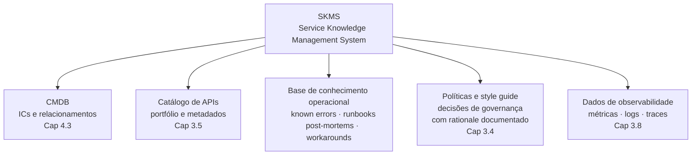

# Anexo D · Gestão do Conhecimento no programa de APIs

> **Referência:** Capítulo 4.6 · Incident, Problem e Continual Improvement
> **Série:** Gerenciamento e Governança de APIs

---

> **Nota sobre este anexo**
>
> Gestão do conhecimento é uma disciplina com teoria e prática próprias que vão muito além do programa de APIs. Este anexo não tem a pretensão de cobrir a disciplina em sua totalidade — trata especificamente dos artefatos e práticas de gestão do conhecimento relevantes para um programa de APIs, com referências para aprofundamento.

---

## O problema que a gestão do conhecimento resolve

Programas de APIs acumulam conhecimento ao longo do tempo — sobre o portfólio, sobre os problemas que ocorreram, sobre as decisões que foram tomadas e por quê. Esse conhecimento tem dois estados possíveis:

**Conhecimento explícito** — documentado, estruturado e acessível. O style guide, as políticas do CoE, os post-mortems, os runbooks, os known errors. Qualquer pessoa pode acessá-lo sem precisar encontrar a pessoa certa.

**Conhecimento tácito** — não documentado, vivido nas pessoas. O arquiteto que sabe por que aquela API tem aquela estrutura estranha. O engenheiro que sabe exatamente qual é o comportamento do backend sob determinadas condições de carga. O líder do CoE que lembra do conflito que moldou a política atual.

O conhecimento tácito é um risco organizacional quando está concentrado em poucas pessoas. A saída de um engenheiro sênior pode levar consigo conhecimento que levou anos para ser construído. Programas de APIs maduros têm mecanismos explícitos para transformar conhecimento tácito em explícito — sistematicamente, não apenas quando alguém está saindo.

---

## O Service Knowledge Management System do ITIL 4

O ITIL 4 trata gestão do conhecimento no contexto do **Service Knowledge Management System** — SKMS — o conjunto de ferramentas, dados, informações e conhecimentos usados para suportar a gestão de serviços de TI.

O SKMS não é um sistema único — é uma arquitetura de conhecimento que integra múltiplas fontes: o CMDB (dados de configuração), o catálogo de serviços (informação de serviço), as bases de conhecimento (conhecimento operacional), a documentação de processos (procedimentos), e os dados de monitoramento e observabilidade (dados em tempo real).

No contexto de um programa de APIs, o SKMS inclui:

---

## A base de conhecimento operacional

A base de conhecimento operacional é o repositório de conhecimento que suporta as operações do dia a dia — incident management, problem management e suporte a consumidores.

---

### Known errors

Known errors são problemas com causa raiz identificada e solução ainda não implementada. Cada known error registrado na base de conhecimento permite que qualquer membro da equipe — incluindo os que não estavam no incidente original — identifique rapidamente o problema quando ele se manifesta novamente.

Um registro de known error bem estruturado contém:

- **Identificador único** — referência que pode ser citada em outros documentos
- **Descrição do sintoma** — como o problema se manifesta do ponto de vista do observador
- **Causa raiz** — o que realmente está causando o problema
- **Condições de ocorrência** — quando e sob quais condições o problema aparece
- **Impacto** — o que é afetado quando ocorre
- **Workaround** — como mitigar o impacto enquanto a correção definitiva não está disponível
- **Status** — em investigação, workaround disponível, correção planejada, resolvido
- **Referência ao Change Record** — quando há correção planejada

---

### Runbooks

Runbooks são procedimentos documentados para operações repetitivas — tanto para respostas a incidentes quanto para operações de rotina. Um runbook bem escrito permite que alguém sem experiência prévia execute uma operação corretamente — porque o conhecimento necessário está no documento, não na pessoa.

Para APIs, runbooks relevantes incluem:

- Procedimento de resposta a incidentes por tipo — um runbook por tipo de incidente do Cap 4.6.4
- Procedimento de rotação de certificados
- Procedimento de rollback de versão de API
- Procedimento de escalação para parceiros estratégicos
- Procedimento de depreciação de versão — complementando o Anexo B

A qualidade de um runbook é medida por um critério simples: um engenheiro de plantão que nunca executou esse procedimento consegue executá-lo corretamente às 3h da manhã?

---

### Post-mortems como base de conhecimento

Os post-mortems que o Cap 4.6.6 descreve são, quando indexados e acessíveis, uma base de conhecimento sobre como o sistema falha. Um engenheiro investigando um problema novo pode pesquisar na base de post-mortems por sintomas similares e encontrar análises de causa raiz que aceleram o diagnóstico.

Para que post-mortems funcionem como base de conhecimento — e não apenas como documentos arquivados — precisam ser:

- Indexados por tipo de componente afetado, tipo de incidente e causa raiz
- Buscáveis por sintoma — não apenas por data ou título
- Referenciados nos known errors quando o problema se repete
- Revisitados periodicamente para verificar se as ações de melhoria foram implementadas

---

## Gestão do conhecimento tácito

O conhecimento tácito não se externaliza com formulários — se externaliza com práticas que criam oportunidades para que o conhecimento flua de pessoas para documentos.

**Decisões com rationale documentado** — cada decisão de arquitetura, cada política do CoE, cada exceção aprovada tem o fundamento registrado junto com a decisão. Como estabelecemos no Cap 3.2.4, uma política sem rationale é vulnerável a qualquer argumento de conveniência. Mas rationale documentado é também gestão de conhecimento — preserva o contexto que explica por que as coisas são como são.

**Onboarding estruturado** — quando um novo membro entra no CoE ou em um time de produto, o onboarding transmite contexto histórico, não apenas procedimentos. "Esta política existe porque houve um incidente em 2022 que revelou X" é conhecimento que não está no style guide mas que precisa ser transmitido.

**Pair work e mob programming em problemas complexos** — quando conhecimento tácito está concentrado em uma pessoa, envolver outras pessoas no processo de resolução de problemas complexos é uma forma de transferência de conhecimento que não exige documentação formal.

**Retrospectivas periódicas** — discussões estruturadas sobre o que está funcionando e o que não está, com output documentado, são uma forma de externalizar o conhecimento coletivo do time.

---

## Ferramentas e integração

A base de conhecimento de um programa de APIs pode ser implementada com diferentes ferramentas — desde wikis simples até plataformas dedicadas de gestão de conhecimento. O que importa não é a ferramenta — é a integração com os fluxos de trabalho:

**Integração com incident management** — quando um incidente é registrado, o sistema sugere known errors relevantes. Quando o incidente é fechado e um post-mortem é produzido, ele é automaticamente indexado na base de conhecimento.

**Integração com o catálogo** — APIs no catálogo têm links diretos para os runbooks relevantes, os known errors conhecidos e os post-mortems relacionados.

**Integração com sistemas agênticos** — como estabelecemos nos Caps 3.3.5 e 3.5.6, a base de conhecimento exposta como contexto para ferramentas de IA permite que desenvolvedores consultem conhecimento operacional no ponto onde trabalham. Um desenvolvedor que encontra um comportamento estranho em uma API pode perguntar à ferramenta de IA e receber como resposta o known error correspondente — sem precisar saber que o problema já foi investigado.

---

## Referências para aprofundamento

Gestão do conhecimento como disciplina tem uma literatura extensa e consolidada. Para quem quiser aprofundar além do contexto específico de APIs:

| Obra | Relevância |
|---|---|
| Nonaka, I. & Takeuchi, H. *The Knowledge-Creating Company*. Oxford University Press, 1995 | A teoria seminal sobre conhecimento tácito e explícito em organizações — a base teórica da disciplina |
| Davenport, T. H. & Prusak, L. *Working Knowledge*. Harvard Business School Press, 1998 | Como organizações gerenciam o que sabem — aplicação prática da teoria de gestão do conhecimento |
| Google SRE Team. *Site Reliability Engineering — Chapter 12: Being On-Call*. Disponível em: [sre.google/sre-book/being-on-call](https://sre.google/sre-book/being-on-call/) | Gestão do conhecimento operacional na perspectiva SRE — runbooks, escalação e transferência de conhecimento |
| Axelos. *ITIL 4 Foundation* — prática de *Service Knowledge Management* | O SKMS no contexto do ITIL 4 |

---

*Série: Gerenciamento e Governança de APIs · Anexo D*