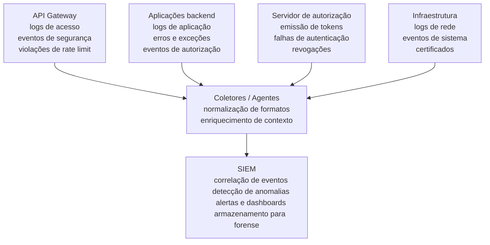
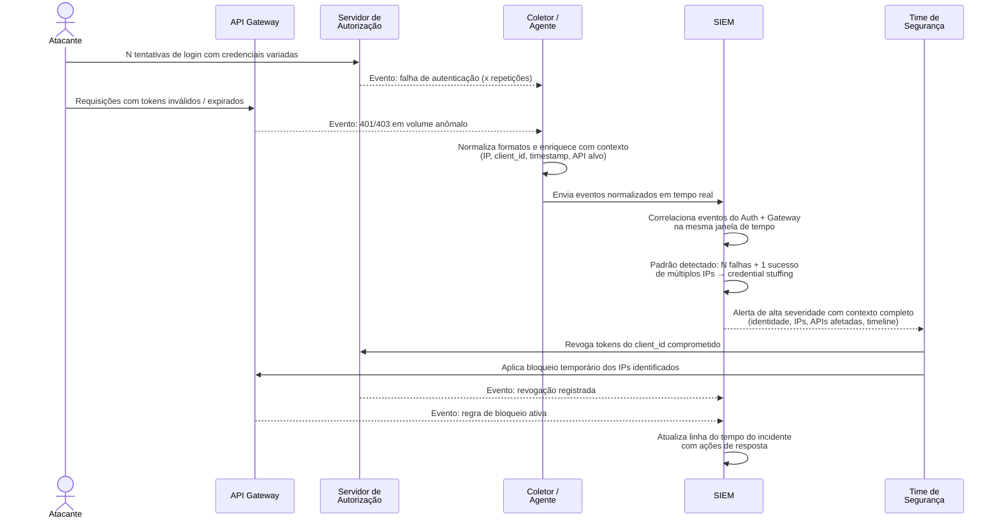

# Anexo F · SIEM e correlação de eventos de segurança

> **Referência:** Capítulo 5.2 · O arsenal de segurança de APIs
> **Série:** Gerenciamento e Governança de APIs

---

> **Sobre este anexo**
>
> SIEM — Security Information and Event Management — é uma plataforma que transcende o contexto de APIs. Este anexo trata o tema com a profundidade que merece, sem comprometer o foco do Cap 5.2 em controles específicos de APIs. O objetivo é contextualizar quando e como o SIEM é relevante para programas de APIs, e quais são os critérios para sua adoção.

---

## O que é SIEM

SIEM é uma plataforma que combina duas capacidades distintas que historicamente existiam como produtos separados:

**SIM — Security Information Management**: coleta, armazenamento e análise de logs e eventos de segurança de múltiplas fontes para conformidade e investigação forense.

**SEM — Security Event Management**: monitoramento em tempo real, correlação de eventos e alertas baseados em regras e comportamento.

A fusão das duas capacidades em SIEM criou plataformas que centralizam a visibilidade de segurança de toda a organização — servidores, redes, aplicações, APIs, endpoints — em um único painel, com capacidade de correlacionar eventos entre fontes para identificar padrões que não seriam visíveis em cada fonte individualmente.

---

## Por que SIEM transcende o contexto de APIs

O valor central do SIEM é a correlação entre fontes. Um evento isolado raramente é conclusivo. Mas a combinação de eventos de múltiplas fontes — um login bem-sucedido de um IP incomum, seguido de aumento de tráfego em uma API específica, seguido de download incomum de dados — conta uma história que nenhuma fonte individual conta.

No contexto de APIs especificamente, o SIEM é valioso quando:

**O portfólio é grande** — com dezenas ou centenas de APIs, a correlação manual entre fontes é inviável. Ataques que ficam abaixo dos thresholds individuais de cada API só são detectáveis pela correlação que o SIEM habilita.

**Há múltiplos sistemas de autenticação** — quando tokens são emitidos por diferentes servidores de autorização, o SIEM pode correlacionar o comportamento de uma identidade específica através de múltiplos sistemas.

**Há requisitos regulatórios de monitoramento** — setores como financeiro e saúde frequentemente têm requisitos explícitos de SIEM ou equivalente para compliance com frameworks como PCI-DSS, HIPAA e SOC 2.

---

## Arquitetura de integração com APIs

A integração de APIs com SIEM segue o padrão de ingestão de logs e eventos:

---

## Fluxo de coleta e atuação — visão de sequência

O diagrama de arquitetura acima mostra *de onde* os dados vêm. O diagrama abaixo mostra *como* um evento percorre o pipeline desde sua origem até a resposta do time de segurança — usando como exemplo a detecção de um padrão de credential stuffing.

O diagrama ilustra três características centrais do SIEM que o tornam valioso para portfólios grandes:

1. **Correlação entre fontes independentes** — o padrão de credential stuffing só é visível quando os eventos do servidor de autorização e do gateway são analisados juntos
2. **Enriquecimento no coletor** — a normalização e o enriquecimento de contexto antes da ingestão reduzem o trabalho de correlação no SIEM e melhoram a qualidade dos alertas
3. **Rastreabilidade da resposta** — as ações de contenção retroalimentam o SIEM, mantendo o histórico completo do incidente em um único lugar para fins forenses e de aprendizado

---

## O que configurar no SIEM para APIs

**Regras de correlação relevantes para APIs:**

**Credential stuffing** — N falhas de autenticação seguidas de 1 sucesso, de múltiplos IPs, em janela de tempo curta. A correlação entre o servidor de autorização e os logs de gateway identifica o padrão.

**Account takeover** — login bem-sucedido de localização geográfica incomum para aquele client_id, seguido de aumento significativo de volume de requisições.

**Data exfiltration** — volume acumulado de dados retornados por um consumidor específico em um período excedendo o perfil histórico em múltiplos desvios padrão.

**Distribuição de ataque entre APIs** — um mesmo conjunto de IPs ou tokens fazendo requisições a múltiplas APIs diferentes, cada uma abaixo dos thresholds individuais de rate limit.

**Escalada de privilégio** — tentativas de acesso a endpoints com escopos superiores aos do token apresentado, especialmente quando seguem o padrão de enumeração.

---

## Critérios de adoção — quando SIEM faz sentido para APIs

O SIEM tem custo de implementação e operação significativo. A decisão de adotar deve ser proporcional à necessidade:

**SIEM justificado:**
- Portfólio com mais de 50 APIs em produção com dados sensíveis
- Requisitos regulatórios explícitos de monitoramento centralizado
- Organização com time de segurança dedicado capaz de operar e manter regras de correlação
- Histórico de incidentes que teriam sido detectados mais cedo com correlação entre fontes

**Alternativas suficientes para organizações menores:**
- Queries agendadas nos sistemas de observabilidade existentes (Elasticsearch, Datadog, Grafana)
- Alertas configurados diretamente no gateway para os padrões mais críticos
- Correlação manual periódica para os padrões de maior risco

A ausência de SIEM não é necessariamente uma lacuna de segurança — é uma decisão de proporcionalidade. O que não é aceitável é ausência de qualquer mecanismo de correlação entre fontes para portfólios grandes com dados sensíveis.

---

## Referências

| Fonte | Referência completa |
|---|---|
| **NIST SP 800-92 (2006)** | Kent, K. & Souppaya, M. *Guide to Computer Security Log Management*. NIST SP 800-92, setembro 2006. Disponível em: [csrc.nist.gov/pubs/sp/800/92/final](https://csrc.nist.gov/pubs/sp/800/92/final) |
| **NIST SP 800-53 Rev. 5 — família AU** | NIST. *Security and Privacy Controls — Audit and Accountability (AU)*. SP 800-53 Rev. 5, setembro 2020. Disponível em: [doi.org/10.6028/NIST.SP.800-53r5](https://doi.org/10.6028/NIST.SP.800-53r5) |

---

*Série: Gerenciamento e Governança de APIs · Módulo 5 · Anexo F*