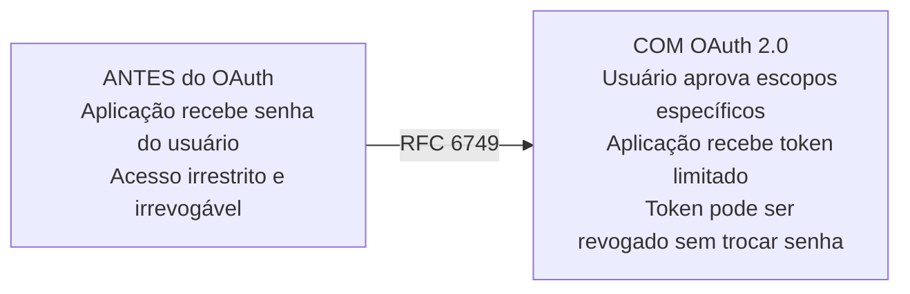
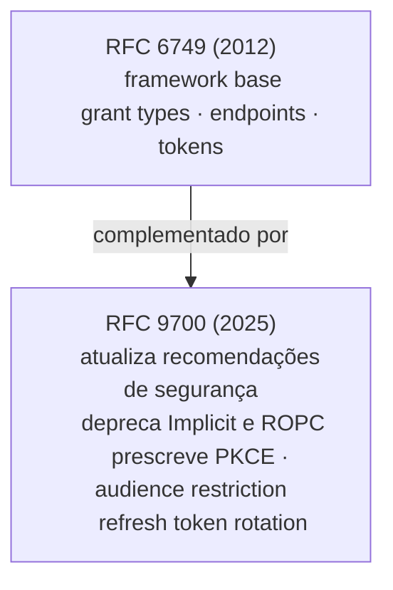
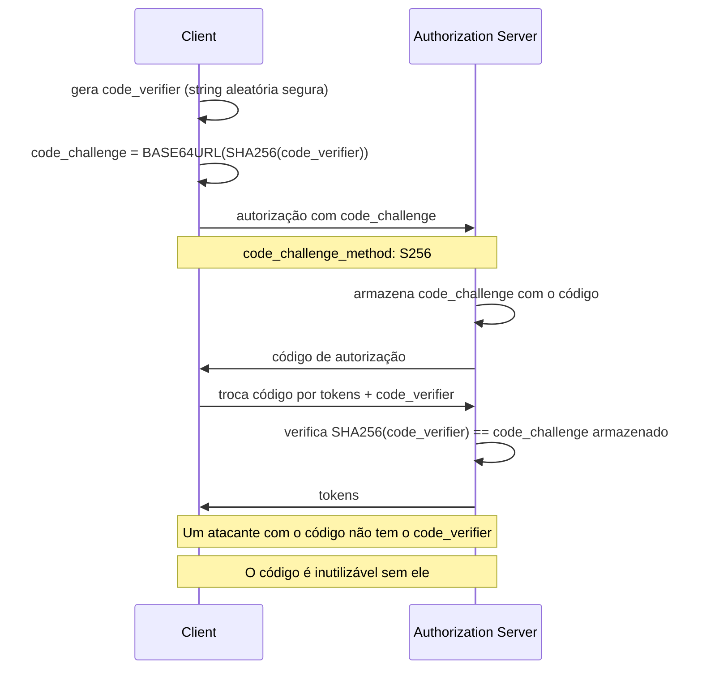
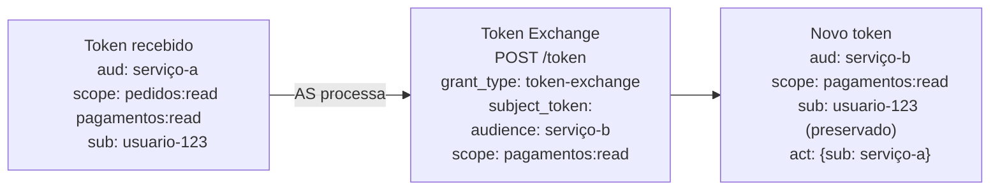
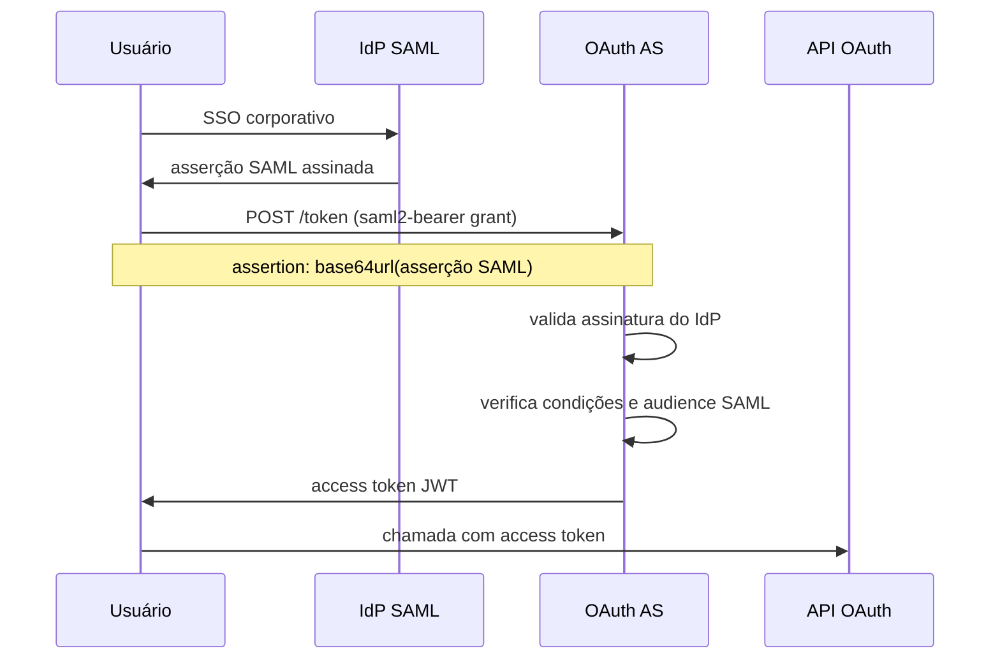

# Anexo J · Guia de leitura — os RFCs do OAuth 2.0

> **Referência:** Capítulo 5.4 · Autenticação e autorização
> **Série:** Gerenciamento e Governança de APIs

---

> **Sobre este anexo**
>
> RFCs são escritos para implementadores de protocolos — a linguagem é precisa, árida e assume familiaridade com o vocabulário técnico do IETF. Este guia explica cada RFC do ecossistema OAuth 2.0 em linguagem acessível: qual problema existia antes, como o RFC resolve, quais são as decisões mais importantes, e onde focar na leitura direta.

---

## RFC 6749 — The OAuth 2.0 Authorization Framework

**Publicado:** outubro 2012 · **Onde:** [datatracker.ietf.org/doc/html/rfc6749](https://datatracker.ietf.org/doc/html/rfc6749)

### O problema que existia antes

Antes do OAuth, aplicações de terceiros precisavam das credenciais do usuário para agir em seu nome. O usuário fornecia sua senha à aplicação — que a armazenava indefinidamente, tinha acesso irrestrito e não podia ter esse acesso revogado sem troca de senha. Qualquer comprometimento da aplicação comprometia as credenciais do usuário em todos os serviços onde ela era usada.

Além disso, não havia um padrão interoperável. Cada API definia seu próprio mecanismo de autorização delegada — impossibilitando integração genérica.

### Como o RFC resolve

O RFC 6749 introduz uma **camada de autorização separada** entre o usuário e a aplicação:



O mecanismo central: o usuário nunca fornece sua senha à aplicação. Aprova um conjunto específico de escopos no Authorization Server. A aplicação recebe um token que representa essa aprovação — com escopo e prazo definidos.

### As decisões-chave

**Separação de papéis** — Authorization Server e Resource Server são separados. O AS emite tokens; o RS os valida. Essa separação permite que o mesmo AS sirva múltiplas APIs, e que cada API valide tokens independentemente.

**Escopos como strings opacas** — a Seção 3.3 define `scope` como um conjunto de strings delimitadas por espaço, sem semântica prescrita. A organização define o significado de cada escopo. Isso foi deliberado — o RFC não poderia antecipar todos os casos de uso. A consequência é que interoperabilidade de escopos entre diferentes implementações exige acordos fora do RFC.

**Quatro grant types originais** — Authorization Code, Implicit, Resource Owner Password Credentials e Client Credentials. Implicit e ROPC foram incluídos em 2012 por casos de uso válidos naquela época — SPAs antes de CORS, e sistemas legados. Ambos são hoje considerados problemáticos (ver RFC 9700).

**Access token format não definido** — deliberadamente. O RFC descreve access tokens como strings opacas. JWT foi padronizado como format de access token apenas em 2021 via RFC 9068.

### O que procurar na leitura direta

**Seção 1** — Introdução e motivação. Explica bem o problema que o OAuth resolve e o vocabulário central. Vale ler completa.

**Seção 4** — Os grant types. Cada subseção (4.1 a 4.4) descreve um fluxo. A Seção 4.1 (Authorization Code) é a mais importante.

**Seção 10** — Security Considerations. Documenta as ameaças que os autores consideraram ao projetar o protocolo. Muitas das vulnerabilidades documentadas mais tarde no RFC 9700 já estavam aqui como riscos a mitigar.

---

## RFC 9700 — Best Current Practice for OAuth 2.0 Security

**Publicado:** janeiro 2025 · **Onde:** [datatracker.ietf.org/doc/rfc9700](https://datatracker.ietf.org/doc/rfc9700/)

### O problema que existia antes

O RFC 6749 foi publicado em 2012 com recomendações de segurança baseadas nas ameaças conhecidas naquele momento. Nos anos seguintes, pesquisadores identificaram vulnerabilidades em implementações reais, novos vetores de ataque foram descobertos e o uso de OAuth expandiu para contextos não antecipados. As recomendações de segurança do RFC 6749 precisavam de atualização profunda.

Uma versão anterior, o RFC 6819 (2013), documentava ameaças mas não fornecia guidance prescritivo suficiente. O draft `oauth-security-topics` evoluiu por anos incorporando lições de incidentes reais até ser publicado como RFC 9700.

### Como o RFC resolve

O RFC 9700 não substitui o RFC 6749 — complementa e atualiza suas recomendações de segurança. Para cada ameaça identificada, fornece contramedidas concretas com o vocabulário normativo do IETF (MUST, SHOULD, MUST NOT).



### As decisões-chave

**Depreciação do Implicit Grant** — o RFC 9700 depreca formalmente o Implicit Grant. Tokens retornados na URL são expostos a vazamento via referrer, histórico de browser e logs de servidor. SPAs devem usar Authorization Code + PKCE.

**Depreciação do ROPC** — Resource Owner Password Credentials também é depreciado. Qualquer fluxo onde o cliente recebe diretamente a senha do usuário derrota o propósito do OAuth.

**PKCE obrigatório para Authorization Code** — não apenas para clientes públicos, como era a recomendação anterior, mas para todos os clientes. A Seção 2.1.1 é prescritiva: PKCE MUST be used.

**Audience restriction obrigatória** — access tokens SHOULD ser restritos à audiência específica (o Resource Server para o qual foram emitidos). Tokens que não têm audiência definida podem ser usados em qualquer RS — um vetor de token confusion.

**Refresh token rotation** — refresh tokens SHOULD ser rotacionados a cada uso. Reuso de um refresh token que já foi usado deve ser tratado como sinal de comprometimento — revogar toda a cadeia de tokens.

### O que procurar na leitura direta

**Seção 2** — As recomendações por componente (AS, RS, Client). É a seção mais acionável — cada subseção corresponde a um componente de implementação.

**Seção 4** — As ameaças específicas e suas contramedidas. Se você está investigando uma vulnerabilidade específica, esta é a seção de referência.

---

## RFC 7636 — Proof Key for Code Exchange (PKCE)

**Publicado:** setembro 2015 · **Onde:** [datatracker.ietf.org/doc/html/rfc7636](https://datatracker.ietf.org/doc/html/rfc7636)

### O problema que existia antes

O Authorization Code Flow tem uma vulnerabilidade fundamental: o código de autorização é entregue via redirect URI. Em dispositivos móveis, múltiplas aplicações podem registrar o mesmo URL scheme (`myapp://`). Um aplicativo malicioso que registra o mesmo scheme intercepta o código de autorização antes que o aplicativo legítimo o receba.

Mesmo em outros contextos, um código interceptado pode ser trocado por tokens — se o atacante conhece o `client_id` público.

### Como o RFC resolve

PKCE cria um vínculo criptográfico entre a requisição de autorização e a troca de código por tokens:



### As decisões-chave

**`code_challenge_method: S256` é obrigatório** — o método `plain` (sem hash) não oferece proteção real e não deve ser usado. O RFC menciona `plain` apenas por compatibilidade com sistemas que não conseguem fazer SHA256.

**O `code_verifier` deve ser criptograficamente aleatório** — 43 a 128 caracteres de entropia suficiente. Um verifier previsível derrota o propósito.

### O que procurar na leitura direta

**Seção 4** — o fluxo completo. Curta e direta — este é um RFC pequeno e bem escrito.

---

## RFC 8693 — OAuth 2.0 Token Exchange

**Publicado:** janeiro 2020 · **Onde:** [datatracker.ietf.org/doc/html/rfc8693](https://datatracker.ietf.org/doc/html/rfc8693)

### O problema que existia antes

Em arquiteturas de microserviços, um token de usuário precisa ser "transformado" à medida que atravessa serviços. O serviço que recebe o token do usuário precisa obter um novo token para chamar o serviço seguinte — com audiência correta, escopos adequados, e com a identidade original preservada. Não havia um mecanismo padrão para isso. Cada implementação resolvia de forma ad hoc.

### Como o RFC resolve

O RFC 8693 define um grant type específico (`urn:ietf:params:oauth:grant-type:token-exchange`) que permite:

- Trocar um token por outro com audiência diferente
- Reduzir escopos (nunca ampliar)
- Delegar — agir em nome de outro sujeito (`act` claim)
- Representar — obter token com o sujeito de outro token



### As decisões-chave

**`act` vs. `may_act`** — `act` indica quem está agindo. `may_act` indica quem está autorizado a agir. Em cadeias de delegação, `act` pode ser aninhado para preservar toda a cadeia.

**Scope reduction é unidirecional** — o novo token não pode ter escopos que o token original não tinha. O AS é responsável por enforçar essa regra.

**Tipos de token de saída** — o RFC suporta trocar por access token, refresh token ou ID token, dependendo do caso de uso.

### O que procurar na leitura direta

**Seção 2.1** — os parâmetros do request. Define o vocabulário completo.
**Seção 4** — os claims `act` e `may_act`. Essencial para entender delegação em cadeias de microserviços.

---

## RFC 7522 — SAML 2.0 Profile for OAuth 2.0

**Publicado:** maio 2015 · **Onde:** [datatracker.ietf.org/doc/html/rfc7522](https://datatracker.ietf.org/doc/html/rfc7522)

### O problema que existia antes

Organizações com infraestrutura SSO baseada em SAML — ADFS, Okta, PingFederate — queriam expor APIs modernas com OAuth 2.0 sem exigir que usuários se autenticassem novamente. Não havia um mecanismo padrão para usar uma asserção SAML existente como grant para obter um access token OAuth 2.0.

### Como o RFC resolve

Define um grant type específico (`urn:ietf:params:oauth:grant-type:saml2-bearer`) que aceita uma asserção SAML 2.0 válida e retorna um access token OAuth 2.0. A ponte entre o mundo SAML e o mundo OAuth é formalizada como protocolo interoperável.



### As decisões-chave

**A asserção SAML deve ser direcionada ao AS** — o `<AudienceRestriction>` da asserção SAML deve incluir o URL do token endpoint do AS. Asserções genéricas não são aceitas.

**Condições de validade são verificadas** — `NotBefore` e `NotOnOrAfter` da asserção SAML são verificados. Asserções expiradas são rejeitadas.

### O que procurar na leitura direta

**Seção 3** — os requisitos da asserção SAML. Define exatamente o que o AS precisa verificar.

---

## RFC 9396 — OAuth 2.0 Rich Authorization Requests (RAR)

**Publicado:** maio 2023 · **Onde:** [rfc-editor.org/rfc/rfc9396.html](https://www.rfc-editor.org/rfc/rfc9396.html)

### O problema que existia antes

Escopos OAuth são strings simples — `pagamentos:write`. Para casos de uso onde a autorização precisa de mais contexto — "autorizo a transferência de até R$500 para a conta X no período Y" — strings de escopo são insuficientes. Não há como expressar parâmetros estruturados de autorização dentro de um scope string.

Como mencionado no Cap 5.1.6, esse problema é especialmente relevante em APIs financeiras reguladas como Open Finance.

### Como o RFC resolve

Introduce o parâmetro `authorization_details` — um array JSON que permite especificar permissões ricas e estruturadas:

```json
{
  "authorization_details": [
    {
      "type": "payment_initiation",
      "locations": ["https://example.com/payments"],
      "instructedAmount": {
        "currency": "BRL",
        "amount": "500.00"
      },
      "creditorAccount": {
        "iban": "BR123456789"
      }
    }
  ]
}
```

### As decisões-chave

**`type` é obrigatório e define o schema** — cada type tem seu próprio schema de parâmetros. O AS precisa entender o type para validar a autorização.

**Convivência com escopos** — RAR pode ser usado junto com escopos tradicionais. Para casos simples, escopos continuam funcionando. Para casos complexos, RAR fornece a expressividade necessária.

### O que procurar na leitura direta

**Seção 2** — a estrutura do `authorization_details`. Curta e com exemplos concretos.

---

## Referências

Todos os RFCs documentados neste anexo são publicações do IETF disponíveis gratuitamente em [datatracker.ietf.org](https://datatracker.ietf.org) e [rfc-editor.org](https://www.rfc-editor.org).

---

*Série: Gerenciamento e Governança de APIs · Módulo 5 · Anexo J*