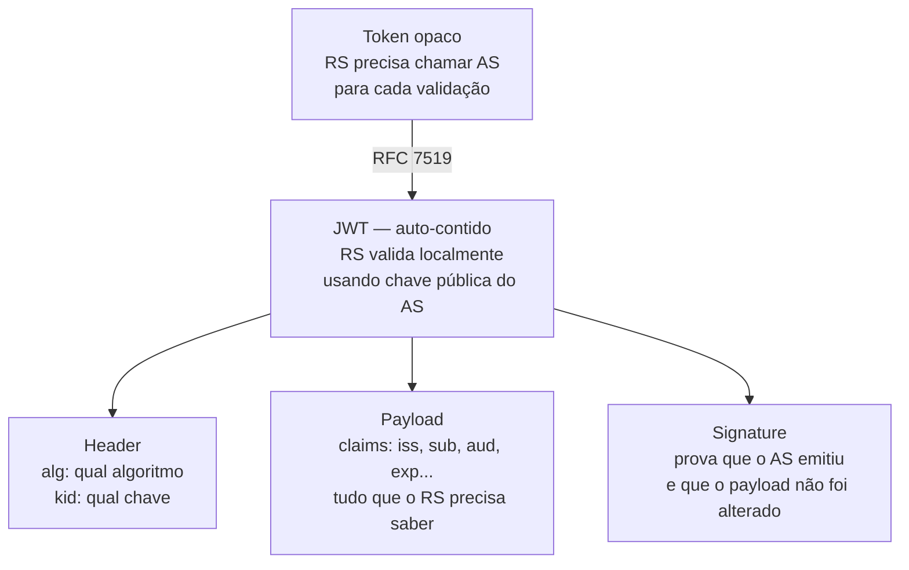
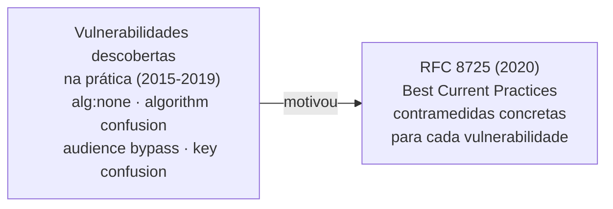
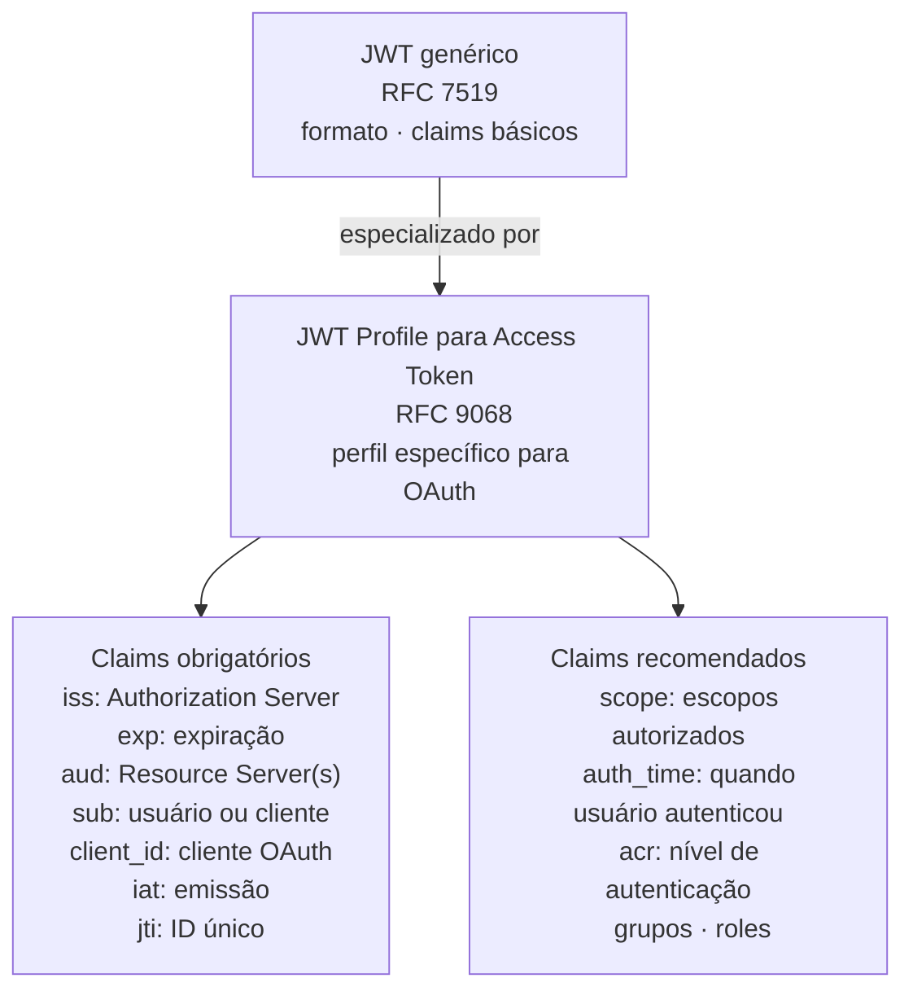
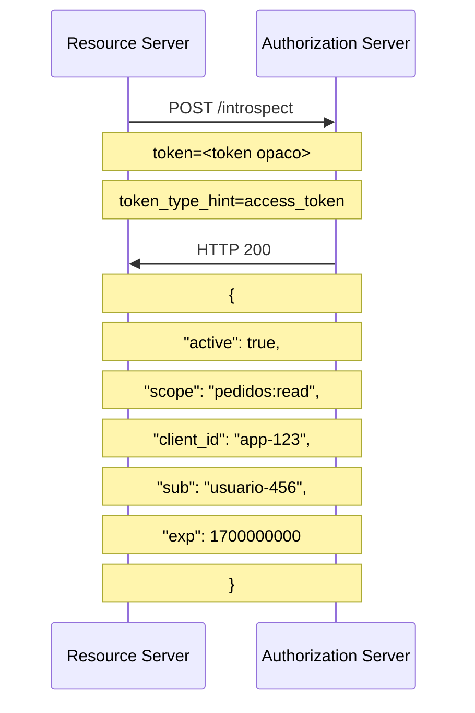
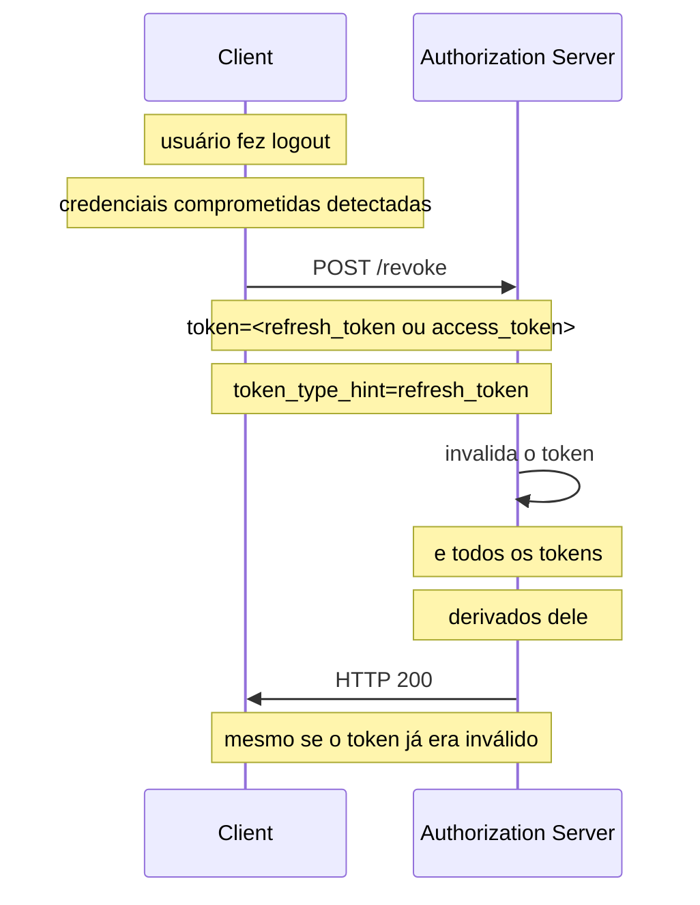
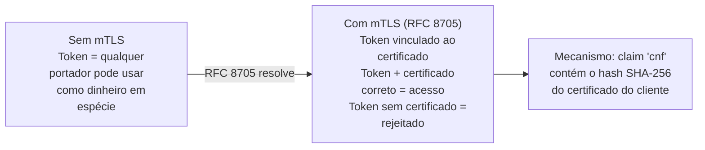
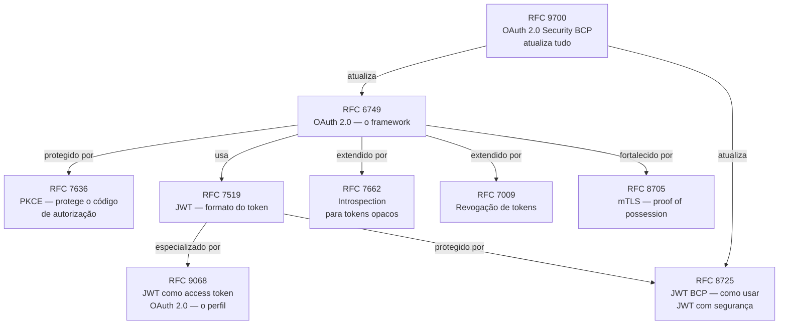

# Anexo K · Guia de leitura — os RFCs dos tokens

> **Referência:** Capítulo 5.4 · Autenticação e autorização
> **Série:** Gerenciamento e Governança de APIs

---

> **Sobre este anexo**
>
> Os RFCs dos tokens — JWT, suas extensões e os mecanismos de revogação e introspection — formam um ecossistema interdependente que é mais fácil de compreender quando se entende a sequência histórica dos problemas que cada um resolve. Este guia explica cada RFC com a mesma estrutura: o problema, a solução, as decisões-chave e onde focar na leitura.

---

## RFC 7519 — JSON Web Token (JWT)

**Publicado:** maio 2015 · **Onde:** [rfc-editor.org/rfc/rfc7519.html](https://www.rfc-editor.org/rfc/rfc7519.html)

### O problema que existia antes

O OAuth 2.0 (RFC 6749) deliberadamente não definiu o formato do access token — descreveu-o como uma string opaca. Na prática, isso criou dois problemas:

**Problema 1 — Validação requer chamada ao Authorization Server.** Para validar um token opaco, o Resource Server precisa chamar o AS a cada requisição. Em sistemas com alto volume, isso cria gargalo e acoplamento.

**Problema 2 — Sem interoperabilidade de formato.** Cada implementação criou seu próprio formato de token, impossibilitando que um Resource Server de um fornecedor validasse tokens de um AS de outro fornecedor sem integração customizada.

### Como o RFC resolve

O JWT define um formato compacto, URL-safe e auto-contido para transmitir claims entre partes. Um JWT contém tudo que o Resource Server precisa para validar o token localmente — sem chamar o AS.

### As decisões-chave

**Claims registrados vs. públicos vs. privados** — a Seção 4 define três categorias. Claims registrados (`iss`, `sub`, `aud`, `exp`, `nbf`, `iat`, `jti`) têm semântica padronizada. Claims públicos devem ser registrados no IANA para evitar colisões. Claims privados são acordos entre emissor e receptor.

**JWT não é necessariamente seguro** — o RFC define o formato, não garante a segurança. Um JWT pode ser assinado (JWS), criptografado (JWE), ambos, ou nenhum (`alg: none`). A segurança depende de como é usado.

**O payload é apenas Base64url-encoded, não encriptado por padrão** — qualquer um que tenha o JWT pode ler o payload. Claims sensíveis não devem estar em JWTs não encriptados.

### O que procurar na leitura direta

**Seção 4.1** — claims registrados. Define a semântica de cada claim padrão.
**Seção 7** — como criar e validar JWTs. A sequência de validação está aqui.
**Seção 11** — Security Considerations. Especialmente 11.1 (Trust Decisions) e 11.2 (Signing and Encryption Order).

---

## RFC 8725 — JSON Web Token Best Current Practices

**Publicado:** fevereiro 2020 · **Onde:** [rfc-editor.org/rfc/rfc8725.html](https://www.rfc-editor.org/rfc/rfc8725.html)

### O problema que existia antes

O RFC 7519 define o formato JWT mas não fornece guidance suficiente sobre como usá-lo com segurança. Nos cinco anos entre a publicação do RFC 7519 e do RFC 8725, pesquisadores identificaram uma série de vulnerabilidades em implementações que seguiam a letra do RFC mas violavam o espírito de segurança.

Os ataques mais documentados: `alg:none` — onde um atacante remove a assinatura e declara que o token não precisa de uma; `algorithm confusion` — onde HS256 é usado em contexto onde RS256 era esperado; ausência de validação de audience — tokens aceitos em qualquer RS.

### Como o RFC resolve

O RFC 8725 atualiza o RFC 7519 com práticas correntes concretas para evitar as vulnerabilidades descobertas na prática. É essencialmente um documento de "como não se machucar com JWT".

### As decisões-chave

**Não confiar no algoritmo declarado no header** — a biblioteca de validação deve ter os algoritmos esperados configurados explicitamente. O header apenas diz qual algoritmo foi usado — não qual deve ser aceito.

**Sempre validar `aud`** — o Resource Server deve verificar que seu identificador está no `aud`. A ausência de validação de audience é uma das vulnerabilidades mais prevalentes.

**`exp` é obrigatório na prática** — o RFC 7519 não obriga `exp`. O RFC 8725 deixa claro que tokens sem expiração são problemáticos e devem ser evitados.

**Usar `jti` para one-time use** — em contextos onde replay attacks são uma ameaça, `jti` permite implementar blacklisting de tokens já usados.

### O que procurar na leitura direta

**Seção 3** — as práticas correntes. Cada subseção é uma recomendação específica. Leitura obrigatória para qualquer implementador.
**Seção 2** — as vulnerabilidades listadas. Explica o contexto de cada ataque antes de prescrever a contramedida.

---

## RFC 9068 — JWT Profile for OAuth 2.0 Access Tokens

**Publicado:** outubro 2021 · **Onde:** [rfc-editor.org/rfc/rfc9068.html](https://www.rfc-editor.org/rfc/rfc9068.html)

### O problema que existia antes

O OAuth 2.0 não definiu o formato do access token. O JWT existe como formato genérico. Mas como usar JWT especificamente como access token OAuth 2.0? Qual `aud` usar? O que `sub` significa — o usuário ou o cliente? Quais claims são obrigatórios?

Cada Authorization Server respondia essas perguntas diferentemente. Um Resource Server não sabia como interpretar um JWT de um AS desconhecido — qual claim era o usuário, qual era o cliente, como encontrar os escopos.

### Como o RFC resolve

Define um perfil específico para JWTs usados como access tokens OAuth 2.0 — com claims obrigatórios e sua semântica precisa.

### As decisões-chave

**`sub` tem semântica diferente por grant type** — em fluxos com usuário humano, `sub` é o identificador do usuário. Em Client Credentials (M2M), `sub` é o `client_id` do cliente. A Seção 2.2 define isso com precisão.

**`aud` deve ser o Resource Server** — não o `client_id` da aplicação (que seria correto para ID Tokens). Esta é a principal distinção entre access token e ID token em termos de `aud`.

**`client_id` é obrigatório** — o RFC 9068 torna `client_id` obrigatório no access token. O Resource Server pode saber qual cliente originou a requisição — relevante para auditoria e para políticas de autorização baseadas no cliente.

### O que procurar na leitura direta

**Seção 2.2** — os claims obrigatórios e sua semântica. Tabela clara com cada claim, se é obrigatório ou recomendado, e seu significado.
**Seção 4** — como o Resource Server valida o access token. A sequência de validação específica para este perfil.

---

## RFC 7662 — OAuth 2.0 Token Introspection

**Publicado:** outubro 2015 · **Onde:** [datatracker.ietf.org/doc/html/rfc7662](https://datatracker.ietf.org/doc/html/rfc7662)

### O problema que existia antes

JWTs podem ser validados localmente — mas tokens opacos não. Para tokens opacos, o Resource Server precisava de um mecanismo para perguntar ao Authorization Server "este token é válido e o que ele representa?". Não havia endpoint padronizado para isso — cada AS tinha sua própria API de validação.

### Como o RFC resolve

Define um endpoint de introspection padronizado (`/introspect`) e o formato da resposta. O RS faz um POST com o token, o AS retorna um objeto JSON com os metadados do token — incluindo se está ativo, quem é o sujeito, quais escopos, e quando expira.

### As decisões-chave

**`active: false` é a resposta para tokens inválidos** — não um erro HTTP. Um token revogado, expirado ou inválido retorna `{"active": false}`, não um 401 ou 404. Isso permite que o RS distinga "token inválido" de "falha de comunicação".

**Cache com TTL** — o RS deve cachear os resultados de introspection para evitar roundtrips desnecessários. O TTL do cache deve ser menor que a expiração do token.

**O endpoint de introspection deve ser protegido** — apenas Resource Servers autorizados devem poder introspeccionar tokens. Um endpoint de introspection público permite que qualquer um verifique se um token é válido e obtenha seus metadados.

### O que procurar na leitura direta

**Seção 2** — o request e response. Direto ao ponto — este RFC é curto e bem estruturado.
**Seção 4** — IANA Considerations. Lista os campos de resposta registrados — útil como referência rápida.

---

## RFC 7009 — OAuth 2.0 Token Revocation

**Publicado:** agosto 2013 · **Onde:** [datatracker.ietf.org/doc/html/rfc7009](https://datatracker.ietf.org/doc/html/rfc7009)

### O problema que existia antes

O logout de um usuário em OAuth 2.0 não invalidava automaticamente os tokens emitidos. Um access token com 1 hora de vida continuava válido por 1 hora após o logout — janela de abuso se o token fosse comprometido. Não havia mecanismo padronizado para o cliente ou o usuário sinalizar que um token não deveria mais ser aceito.

### Como o RFC resolve

Define um endpoint de revogação padronizado. O cliente faz um POST com o token a ser revogado e o AS o invalida. Simples e focado.

### As decisões-chave

**Revogar o refresh token revoga os access tokens derivados** — a Seção 2 especifica que ao revogar um refresh token, o AS deve revogar também os access tokens emitidos a partir dele. Isso é especialmente importante porque access tokens JWTs não podem ser invalidados diretamente via lista negra em validação local.

**200 mesmo para tokens já inválidos** — o endpoint retorna 200 mesmo se o token fornecido não existia ou já estava revogado. Isso evita que o endpoint se torne um oráculo de validade de tokens.

**Autenticação do cliente é necessária** — o cliente que revoga deve se autenticar — não qualquer um pode revogar tokens de qualquer cliente.

### O que procurar na leitura direta

**Seção 2** — o protocolo completo. RFC curto e direto.
**Seção 2.1** — o request. **Seção 2.2** — a resposta.

---

## RFC 8705 — OAuth 2.0 Mutual-TLS Client Authentication and Certificate-Bound Access Tokens

**Publicado:** fevereiro 2020 · **Onde:** [datatracker.ietf.org/doc/html/rfc8705](https://datatracker.ietf.org/doc/html/rfc8705)

### O problema que existia antes

Access tokens são bearer tokens — quem tem o token pode usá-lo. Se um token é interceptado (ex: via log comprometido, proxy malicioso, ou exfiltração de memória), o atacante pode usá-lo até expirar. Não há como o Resource Server verificar se o portador do token é o cliente legítimo que o obteve.

### Como o RFC resolve

Vincula o access token ao certificado de cliente TLS apresentado na conexão. O token só pode ser usado pela entidade que possui o certificado correspondente — interceptar o token não é suficiente sem a chave privada do certificado.

O claim `cnf` no token contém `x5t#S256` — o hash SHA-256 do certificado. O RS verifica que o hash do certificado apresentado na conexão TLS corresponde ao `cnf` do token.

### As decisões-chave

**Dois usos distintos** — o RFC define mTLS para autenticação do cliente ao AS (ao obter tokens) e para certificate-bound access tokens (ao usar tokens no RS). São usos diferentes que podem ser adotados independentemente.

**Overhead operacional** — mTLS exige PKI para emissão, distribuição e rotação de certificados de cliente. O benefício de segurança é real — mas o custo operacional é significativo. É mais adequado para ambientes M2M controlados do que para aplicações de usuário final.

### O que procurar na leitura direta

**Seção 3** — mTLS para autenticação do cliente.
**Seção 3.1** — PKI mutual-TLS. **Seção 3.2** — self-signed certificates.
**Seção 7** — certificate-bound access tokens. A parte mais relevante para APIs.

---

## A interdependência dos RFCs

Compreender um RFC isoladamente é útil — mas a segurança real emerge da combinação:

---

*Série: Gerenciamento e Governança de APIs · Módulo 5 · Anexo K*