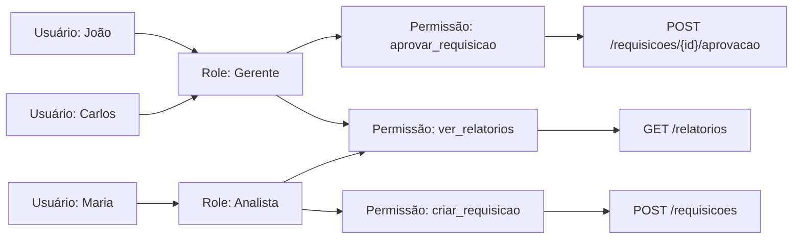
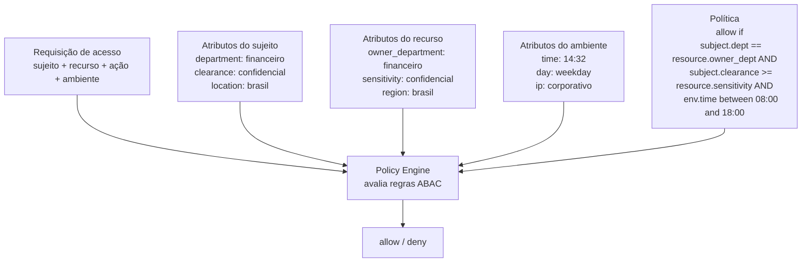
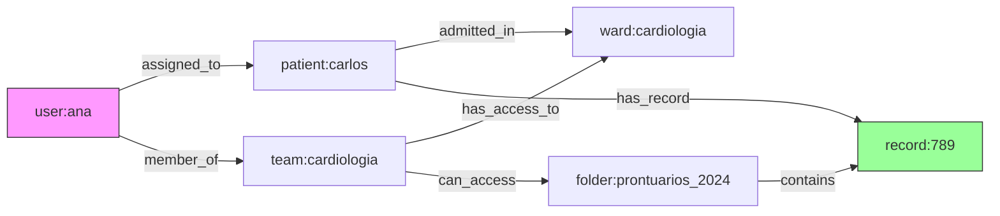
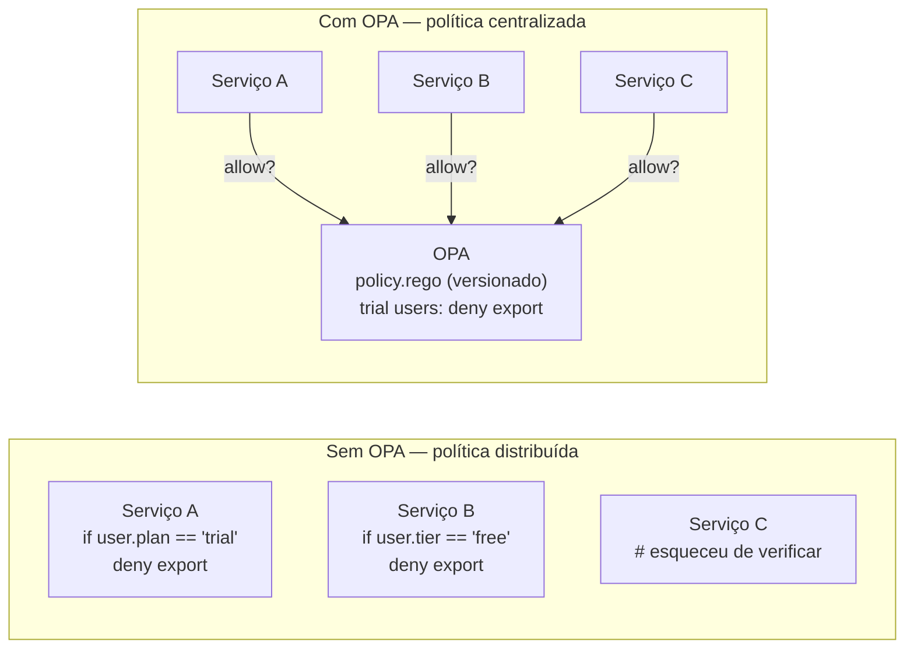
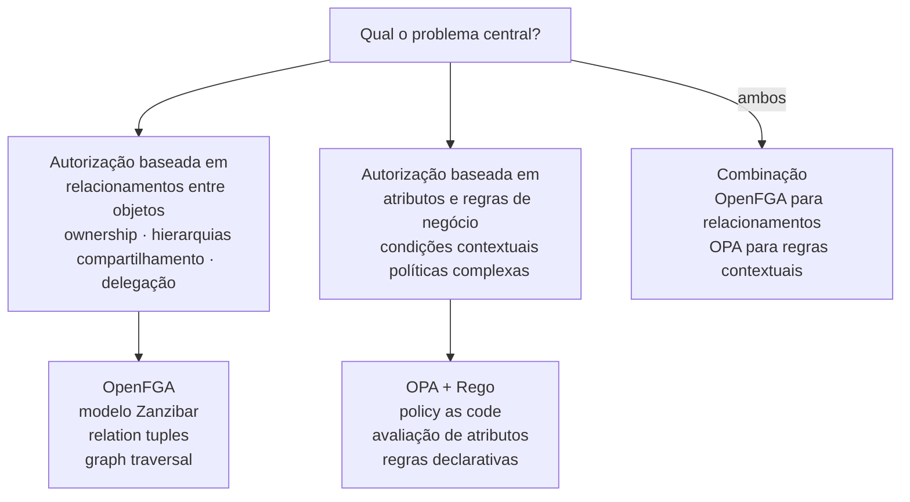

# Anexo L · Modelos e ferramentas de autorização fina

> **Referência:** Capítulo 5.4.12 · Autorização fina — o problema que OAuth não resolve
> **Série:** Gerenciamento e Governança de APIs

---

> **Sobre este anexo**
>
> O Cap 5.4.12 introduziu o problema de Fine-Grained Authorization (FGA) e os conceitos centrais. Este anexo aprofunda os modelos de autorização, o paper seminal do Google Zanzibar, as ferramentas disponíveis e como o CoE governa FGA em escala.

---

## L.1 · Os modelos de autorização em profundidade

### RBAC — Role-Based Access Control

RBAC é o modelo mais antigo e mais amplamente implementado. Formalizado por Ferraiolo e Kuhn no NIST-NCSC National Computer Security Conference em 1992, o modelo central é simples: usuários são atribuídos a roles, roles têm permissões, permissões autorizam operações sobre objetos.



**Onde RBAC funciona bem:** sistemas com hierarquias organizacionais estáveis, permissões que não dependem do estado dos objetos, contexto de autorização previsível.

**Onde RBAC falha:**

*Role explosion* — quando as combinações de contexto crescem, o número de roles necessários explode. Uma organização com 10 departamentos, 5 níveis hierárquicos e 3 regiões geográficas pode precisar de 150 roles diferentes para cobrir todas as combinações — e cada usuário pode precisar de múltiplos roles.

*Autorização por objeto* — RBAC puro não expressa "o gerente pode aprovar requisições do seu próprio departamento apenas". Para isso, é necessário adicionar verificações fora do modelo, ou criar roles por departamento — amplificando o role explosion.

*Contexto dinâmico* — RBAC não expressa "o médico pode acessar o prontuário apenas durante o horário de atendimento" sem adicionar lógica de contexto fora do modelo.

---

### ABAC — Attribute-Based Access Control

ABAC avalia políticas que combinam atributos do sujeito, do recurso, da ação e do ambiente para produzir uma decisão. O NIST SP 800-162 define o modelo ABAC como um padrão para sistemas de informação:

> *NIST. Guide to Attribute Based Access Control (ABAC) Definition and Considerations. NIST SP 800-162, janeiro 2014. Disponível em: [csrc.nist.gov/publications/detail/sp/800-162/final](https://csrc.nist.gov/publications/detail/sp/800-162/final)*



**Onde ABAC funciona bem:** decisões que dependem de múltiplos atributos dinâmicos, requisitos de compliance que especificam condições explícitas, contextos onde as regras mudam com frequência.

**Onde ABAC falha:** políticas ABAC complexas são difíceis de entender, testar e auditar. A combinatória de atributos pode tornar o comportamento do sistema difícil de prever. "Por que este usuário não tem acesso?" pode ser uma pergunta difícil de responder quando a política tem 20 condições.

---

### ReBAC — Relationship-Based Access Control

ReBAC modela autorização como um grafo de relacionamentos entre entidades. A decisão de acesso é determinada pela existência (ou ausência) de um caminho no grafo entre o sujeito e o objeto.



A pergunta "ana pode ler record:789?" é respondida verificando se existe algum caminho válido no grafo entre `user:ana` e `record:789`. Existem dois caminhos no exemplo:
1. `ana → assigned_to → carlos → has_record → record:789`
2. `ana → member_of → equipe → can_access → folder → contains → record:789`

**Onde ReBAC funciona bem:** sistemas com hierarquias de objetos (pastas dentro de pastas), compartilhamento e delegação, onde permissões são herdadas transitivamente, estruturas organizacionais complexas.

**ReBAC é um superset de RBAC** — roles podem ser modelados como relacionamentos (`user:ana → has_role → role:medico`). ABAC baseado em atributos que podem ser expressos como relacionamentos também é expressável em ReBAC.

---

## L.2 · Google Zanzibar — o paper que mudou o campo

### O contexto

Em 2019, o Google publicou o paper "Zanzibar: Google's Consistent, Global Authorization System" no USENIX Annual Technical Conference — uma das conferências mais prestigiosas em sistemas distribuídos.

> *Pang, R. et al. Zanzibar: Google's Consistent, Global Authorization System. USENIX ATC '19, Renton, WA, 2019, pp. 33-46. Disponível em: [usenix.org/conference/atc19/presentation/pang](https://www.usenix.org/conference/atc19/presentation/pang)*

O paper é raro: o Google raramente documenta infraestrutura interna em detalhe. A decisão de publicar refletiu o reconhecimento de que autorização é um problema universal — e que a solução que o Google construiu poderia beneficiar o campo.

### O problema que o Zanzibar resolve

O Google tem centenas de serviços — Calendar, Drive, Maps, Photos, YouTube, Cloud — cada um com seus próprios objetos e suas próprias regras de controle de acesso. Um documento no Drive pode ser compartilhado com um usuário diretamente, com um grupo do Google Groups, com todos os usuários de um domínio, ou ser público. Uma pasta pode herdar permissões de outra pasta. Um arquivo pode ter permissões diferentes das da pasta que o contém.

Sem um sistema centralizado, cada serviço implementaria seu próprio controle de acesso. As regras divergiriam. A consistência entre mudanças de ACL e o conteúdo dos objetos seria difícil de garantir — o "new enemy problem": um usuário cujo acesso foi revogado poderia ainda ver conteúdo se a verificação usasse dados desatualizados.

### O modelo de dados — relation tuples

O Zanzibar armazena relacionamentos como *relation tuples* no formato `objeto#relação@sujeito`:

```
document:readme#owner@user:alice
document:readme#viewer@user:bob
document:readme#viewer@group:eng#member
folder:docs#parent@document:readme
```

Essas tuples expressam: Alice é owner do documento readme. Bob é viewer. Membros do grupo eng são viewers. O documento readme tem a folder docs como parent.

A verificação de acesso é uma busca de caminho no grafo dessas tuples. "Alice pode editar document:readme?" resolve-se procurando se existe uma tupla que conecte `user:alice` ao `document:readme` via relação que implica permissão de edição.

### Escala e performance

O Zanzibar processa trilhões de ACLs e manteve p95 de latência abaixo de 10ms e disponibilidade acima de 99.999% ao longo de 3 anos de operação. Esses números são a demonstração empírica mais forte disponível de que FGA em escala extrema é um problema de engenharia resolvível — não apenas um ideal arquitetural.

---

## L.3 · OPA — Open Policy Agent

### O que é e qual problema resolve

Antes do OPA, cada serviço implementava sua própria lógica de autorização. Quando uma política mudava — "usuários de trial não podem acessar o endpoint de exportação" — era necessário atualizar múltiplos serviços. Não havia visibilidade centralizada de quais políticas existiam.

O OPA externaliza as decisões de política dos serviços para um motor dedicado. Os serviços delegam a decisão ao OPA — e a política é centralizada, versionada e testável.



### Rego — a linguagem de política

Rego é uma linguagem declarativa de alto nível específica para expressar políticas. A política é definida como um conjunto de regras; o OPA avalia o input (a requisição) contra as regras e produz um output (a decisão).

```rego
package api.authz

# Regra principal — default negar
default allow = false

# Permitir leitura para usuários autenticados com scope correto
allow {
    input.method == "GET"
    input.path[0] == "pedidos"
    token_has_scope(input.token, "pedidos:read")
    pedido_pertence_ao_usuario(input.path[1], input.user_id)
}

# Verificar ownership do pedido
pedido_pertence_ao_usuario(pedido_id, user_id) {
    data.pedidos[pedido_id].owner_id == user_id
}

# Verificar scope no token
token_has_scope(token, required_scope) {
    scopes := split(token.scope, " ")
    required_scope == scopes[_]
}
```

### Integração com APIs

O OPA pode ser integrado como sidecar (via Envoy external authorization API), como middleware no framework da aplicação, ou via API REST. A decisão é retornada em milissegundos — adequado para o caminho crítico de autorização.

O OPA não armazena dados de relacionamento — consulta fontes externas (o `data` no Rego). Para FGA baseada em relacionamentos complexos, OPA é frequentemente complementado por um banco de dados de relacionamentos.

---

## L.4 · OpenFGA — Zanzibar para o resto de nós

### O que é

OpenFGA é um motor de FGA open source baseado no modelo do Google Zanzibar. Criado pelo time Auth0/Okta e doado à CNCF em setembro de 2022, implementa o modelo de relation tuples do Zanzibar com uma linguagem de modelagem mais acessível.

> *OpenFGA. Cloud Native Computing Foundation. Disponível em: [openfga.dev](https://openfga.dev/)*

### O modelo de autorização

O OpenFGA usa uma linguagem de modelagem para definir os tipos de objetos, as relações possíveis entre eles e como permissões são derivadas de relacionamentos.

```
model
  schema 1.1

type user

type documento
  relations
    define owner: [user]
    define editor: [user] or owner
    define viewer: [user] or editor or owner

type pasta
  relations
    define owner: [user]
    define viewer: [user] or owner
    define contem: [documento]
```

Com esse modelo, as relation tuples expressam o estado real:

```
documento:readme#owner@user:alice
documento:readme#viewer@user:bob
pasta:docs#contem@documento:readme
pasta:docs#viewer@user:carlos
```

A verificação "carlos pode ver documento:readme?" resolve-se:
1. `carlos` é viewer direto de `documento:readme`? Não.
2. `carlos` é owner de `documento:readme`? Não.
3. `carlos` é viewer de alguma pasta que contém `documento:readme`? Sim — `pasta:docs#viewer@user:carlos` e `pasta:docs#contem@documento:readme`.
4. **Resultado: allow.**

### Quando usar OpenFGA vs OPA



---

## L.5 · Cedar — a abordagem da Amazon

Cedar é uma linguagem de políticas open source desenvolvida pela Amazon, projetada com verificabilidade formal como propriedade central. Políticas Cedar podem ser analisadas estaticamente — antes de ir a produção — para provar que não concedem acesso que não deveriam.

> *Cedar Policy Language. Amazon. Disponível em: [cedarpolicy.com](https://www.cedarpolicy.com/)*

```cedar
// Política Cedar: médicos podem acessar prontuários de seus pacientes
permit (
  principal in Role::"Medico",
  action == Action::"LerProntuario",
  resource
)
when {
  resource.paciente_id in principal.pacientes_responsaveis
};
```

A verificabilidade formal distingue Cedar de OPA e OpenFGA: é possível provar matematicamente que um conjunto de políticas Cedar satisfaz certas propriedades de segurança — por exemplo, que nenhuma política concede acesso administrativo a usuários sem role de administrador.

---

## L.6 · Como o CoE governa FGA em escala

### O desafio de governança

FGA em um portfólio grande apresenta um desafio específico para o CoE: as regras de autorização fina são frequentemente conhecimento de domínio dos times de produto — não do CoE. O CoE não sabe (e não deveria precisar saber) quais são as regras de negócio que determinam se um usuário pode cancelar um pedido específico.

O papel do CoE não é implementar FGA — é criar as condições para que FGA seja implementado de forma consistente, auditável e governável.

### O que o CoE define

**A estratégia arquitetural** — PDP centralizado ou distribuído por domínio. Qual motor (OPA, OpenFGA, Cedar) é o padrão do portfólio. Como o PEP se integra com o gateway existente.

**Policy as Code como padrão** — toda lógica de FGA vive em repositório versionado, não embutida em código de aplicação sem rastreabilidade. Políticas seguem o mesmo ciclo de vida que código: pull request, revisão, CI com testes, deploy controlado.

**O modelo mínimo obrigatório** — para APIs que expõem objetos por identificador, o contrato deve documentar o mecanismo de verificação de ownership. O gate de publicação verifica a presença desse artefato.

**Auditabilidade** — decisões de FGA devem ser registradas com sujeito, objeto, ação, decisão e política que a produziu. Conecta com o Cap 5.2.4 de auditoria e não-repúdio.

**Testes de autorização no pipeline** — a mesma disciplina de testes que se aplica a lógica de negócio se aplica a políticas de autorização. Testes que verificam que um usuário sem acesso recebe 403, e que um usuário com acesso recebe 200, são tão importantes quanto testes funcionais.

### O que o CoE não controla

O CoE não define as regras de negócio de cada domínio — quem pode cancelar um pedido, quais médicos têm acesso a quais prontuários, quais gerentes aprovam quais valores. Essas regras são de responsabilidade dos times de produto e de negócio.

O que o CoE garante é que essas regras existam como código versionado, sejam testadas, sejam auditáveis e sejam implementadas usando os padrões e ferramentas definidos pelo programa de governança.

---

## L.7 · Referências

| Fonte | Referência completa |
|---|---|
| **Zanzibar — USENIX ATC 2019** | Pang, R. et al. *Zanzibar: Google's Consistent, Global Authorization System*. USENIX ATC '19, 2019, pp. 33-46. Disponível em: [usenix.org/conference/atc19/presentation/pang](https://www.usenix.org/conference/atc19/presentation/pang) |
| **NIST SP 800-162 — ABAC** | NIST. *Guide to Attribute Based Access Control (ABAC) Definition and Considerations*. NIST SP 800-162, janeiro 2014. Disponível em: [csrc.nist.gov/publications/detail/sp/800-162/final](https://csrc.nist.gov/publications/detail/sp/800-162/final) |
| **OPA — CNCF** | Open Policy Agent. CNCF Graduated Project, 2021. Disponível em: [openpolicyagent.org](https://www.openpolicyagent.org/) |
| **OpenFGA — CNCF** | OpenFGA. CNCF Incubating Project, 2022. Disponível em: [openfga.dev](https://openfga.dev/) |
| **Cedar** | Amazon. *Cedar Policy Language*. Disponível em: [cedarpolicy.com](https://www.cedarpolicy.com/) |
| **OWASP API Security Top 10 (2023)** | OWASP Foundation. Disponível em: [owasp.org/www-project-api-security](https://owasp.org/www-project-api-security/) |

---

*Série: Gerenciamento e Governança de APIs · Módulo 5 · Anexo L*