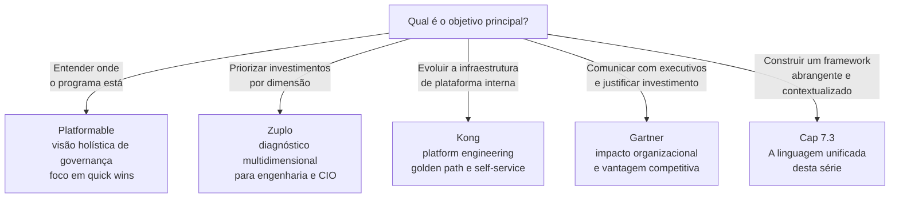

# Módulo 7 · Maturidade em Governança de APIs
## Anexo M · Guia comparativo dos frameworks

> **Tipo:** Referência — consulta rápida
> **Relacionado a:** Cap 7.2 · Cap 7.3

---

Este anexo é um guia de referência para os quatro frameworks de maturidade analisados no Cap 7.2. Organizado para consulta rápida — não para leitura linear.

---

## M.1 · Platformable — API Governance Maturity Model

**Versão analisada:** 2025
**Foco:** Governança organizacional de APIs
**Disponível em:** [platformable.com/blog/api-governance-maturity-model](https://platformable.com/blog/api-governance-maturity-model)

### Os quatro níveis em detalhe

| Nível | Nome | O que caracteriza | O que fazer |
|---|---|---|---|
| **1** | Fragmentado | APIs criadas individualmente sem padrões comuns · Algum uso de OpenAPI · Testes ad hoc · Gateway pode existir mas sem governança | Documentar o estado atual · Identificar APIs de sucesso · Mapear padrões informais existentes |
| **2** | Consolidando | Alguém decide que governança importa · Primeiras tentativas de padronização · Catálogo iniciado · Style guide em rascunho | Entender contexto organizacional · Identificar quick wins · Construir casos de sucesso |
| **3** | Padronizando | Style guide adotado · Catálogo ativo · Ciclo de vida documentado · Lint automatizado · CoE ou equivalente operando | Estabelecer processos de revisão · Automatizar verificações · Medir adoção dos padrões |
| **4** | Otimizando | Dados orientam decisões · Melhoria contínua incorporada · APIs geridas como ativo estratégico · Ecossistema considerado | Fechar loops de feedback · Expandir para parceiros · Medir impacto de negócio |

### Perfil de uso

- **Mais útil para:** CoEs, arquitetos de solução, líderes de API program
- **Contexto ideal:** Organizações iniciando ou estruturando governança
- **Limitação principal:** Não estrutura dimensões separadas — visão holística dificulta diagnóstico granular

---

## M.2 · Zuplo — API Management Maturity Model

**Versão analisada:** 2026
**Foco:** Gestão de APIs em seis dimensões independentes
**Disponível em:** [zuplo.com/learning-center/api-management-maturity-model](https://zuplo.com/learning-center/api-management-maturity-model)

### Os cinco níveis por dimensão

| Dimensão | Nível 1 · Ad-Hoc | Nível 2 · Padronizado | Nível 3 · Gerenciado | Nível 4 · Automatizado | Nível 5 · Otimizado |
|---|---|---|---|---|---|
| **Design** | Sem style guide · cada dev decide | Style guide existe · compliance manual | Revisões formais · métricas de adoção | Lint automatizado em CI/CD | Design orientado por dados de uso |
| **Segurança** | Auth por serviço · sem padrão | Padrões documentados · enforcement manual | Auditoria regular · gestão de credenciais | Gates de segurança automáticos | Threat modeling contínuo |
| **Governança e Ciclo de Vida** | Sem processo de revisão | Processo documentado · informal | Aprovações formais · deprecação estruturada | Lifecycle automatizado | APIs como produtos com roadmap |
| **Developer Experience** | README ad hoc | Portal básico · documentação manual | Portal com try-it · onboarding guiado | Self-service completo | DX medida e otimizada continuamente |
| **Observabilidade** | Logs variáveis por serviço | Dashboard unificado básico | SLOs definidos · alertas configurados | Observabilidade como código | Decisões de produto orientadas por uso |
| **Monetização / Valor** | Não considerada | Métricas básicas de uso | APIs mapeadas a valor de negócio | Billing ou chargeback interno | APIs como produto gerando receita |

### Perfil de uso

- **Mais útil para:** Times de engenharia, CIOs, VPs de engenharia
- **Contexto ideal:** Organizações com portfólio crescente que precisam priorizar investimentos
- **Limitação principal:** Dimensão de monetização tem relevância variável para APIs internas · AI Readiness ausente

---

## M.3 · Kong — API Platform Engineering Maturity Model

**Versão analisada:** 2024
**Foco:** Maturidade da plataforma que suporta o desenvolvimento de APIs
**Disponível em:** [konghq.com/blog/enterprise/api-platform-engineering-maturity-model](https://konghq.com/blog/enterprise/api-platform-engineering-maturity-model)

### Os conceitos centrais

| Conceito | Descrição |
|---|---|
| **Golden Path** | O caminho pavimentado que a plataforma oferece · Times o seguem por ser o mais fácil, não por obrigação |
| **Self-service** | Times conseguem desde design até deploy sem depender do time de plataforma para cada passo |
| **Platform as Product** | A plataforma é um produto interno com usuários, feedback e roadmap próprios |
| **Paved Road** | Infraestrutura e processos que removem fricção do golden path |

### Progressão de maturidade

| Estágio | Característica |
|---|---|
| **Sem plataforma** | Cada time gerencia sua própria infraestrutura de API |
| **Plataforma básica** | Gateway centralizado · alguma automação |
| **Plataforma estruturada** | Processos definidos · catálogo · developer portal |
| **Plataforma como produto** | Golden path claro · self-service · feedback loop com usuários internos |
| **Plataforma otimizada** | Melhoria contínua baseada em dados de uso da própria plataforma |

### Perfil de uso

- **Mais útil para:** Times de platform engineering, arquitetos de infraestrutura
- **Contexto ideal:** Organizações com escala suficiente para justificar um time de plataforma dedicado
- **Limitação principal:** Perspectiva fortemente técnica · contexto organizacional menos desenvolvido

---

## M.4 · Gartner — padrão de cinco estágios

**Referência:** Padrão aplicado a múltiplos domínios · API Strategy Maturity Model (acesso restrito)
**Foco:** Impacto organizacional e competitivo da maturidade

### Os cinco estágios

| Estágio | Nome | Característica | Indicadores |
|---|---|---|---|
| **1** | Foundational | Experimentação ad hoc · sem coordenação | APIs existem mas não são gerenciadas como programa |
| **2** | Emerging | Pilotos iniciais · crescente interesse executivo | Primeiras iniciativas de governança · algum patrocínio executivo |
| **3** | Operational | Capacidades incorporadas · ownership definido | CoE ou equivalente operando · processos estabelecidos |
| **4** | Scaled | Capacidades replicadas com ROI mensurável | Governança consistente em toda a organização · métricas de impacto |
| **5** | Transformational | Remodela decisões, modelos operacionais e vantagem competitiva | APIs como driver estratégico · ecossistemas habilitados |

### O ponto de inflexão crítico

A transição do Estágio 3 para o Estágio 4 — de Operational para Scaled — é onde a maioria das organizações encontra maior dificuldade. Capacidades que funcionam em um time ou domínio precisam ser replicadas de forma consistente em toda a organização. Isso requer mudança cultural e estruturas de governança que suportem escala, não apenas ferramentas adicionais.

### Perfil de uso

- **Mais útil para:** CIOs, CDOs, executivos de transformação digital
- **Contexto ideal:** Comunicação com liderança executiva · justificativa de investimento
- **Limitação principal:** Menos granular tecnicamente · documentação pública limitada

---

## M.5 · Quadro comparativo geral

| Critério | Platformable | Zuplo | Kong | Gartner |
|---|---|---|---|---|
| **Número de níveis** | 4 | 5 | Variável | 5 |
| **Dimensões explícitas** | Não | Sim (6) | Parcial | Não |
| **Foco principal** | Governança | Gestão | Plataforma | Transformação |
| **Audiência primária** | CoE · Arquitetos | Engenharia · CIO | Platform Eng. | Executivos |
| **Contexto organizacional** | Alto | Médio | Alto | Alto |
| **Detalhe técnico** | Médio | Alto | Alto | Baixo |
| **AI / Agentic Readiness** | Incipiente | Ausente | Ausente | Ausente |
| **Acesso público** | Sim | Sim | Sim | Parcial |
| **Última atualização** | 2025 | 2026 | 2024 | Contínuo |

---

## M.6 · Guia de seleção — qual framework usar e quando

---

*Série: Gerenciamento e Governança de APIs · Módulo 7 · Anexo M*