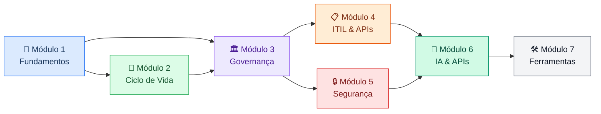

# Gerenciamento e Governança de APIs

Um estudo estruturado sobre **API Management** — do design ao ciclo de vida, da governança à segurança. O material cobre conceitos fundamentais, padrões da indústria, frameworks como ITIL e OWASP, e as decisões de arquitetura que definem programas de API bem-sucedidos.

---

## Trilha de aprendizado

---

## Módulos

### [Módulo 1 — Fundamentos](modulo-1-fundamentos/index.md)
**7 capítulos · Nível: fundamentos · Pré-requisito: nenhum**

O ponto de partida. Define o que é uma API como produto, não apenas como endpoint. Introduz os conceitos de governança versus gerenciamento, os três planos (controle, dados e observabilidade), os principais estilos arquiteturais (REST, gRPC, GraphQL, AsyncAPI) e as implicações de cada escolha para a gestão de APIs em ambientes heterogêneos.

---

### [Módulo 2 — Ciclo de Vida de APIs](modulo-2-ciclo-de-vida/index.md)
**7 capítulos · Nível: operacional · Pré-requisito: Módulo 1**

Percorre todas as fases — design, desenvolvimento, publicação, manutenção e descontinuação. Cobre o debate design-first vs. code-first, os contratos de API (OpenAPI, AsyncAPI, gRPC/Protobuf), documentação, versionamento, gestão de breaking changes e o processo disciplinado de sunset controlado.

---

### [Módulo 3 — Governança de APIs](modulo-3-governanca/index.md)
**8 capítulos · Nível: estratégico · Pré-requisito: Módulos 1 e 2**

Onde as decisões organizacionais encontram a arquitetura técnica. Trata dos pilares da governança, papéis e responsabilidades, o Centro de Excelência de APIs (CoE), style guides e políticas, catálogo e descoberta de APIs, governança com parceiros externos e os modelos organizacionais — centralizado, federado e híbrido.

---

### [Módulo 4 — ITIL & APIs](modulo-4-itil/index.md)
**8 capítulos · Nível: operacional e estratégico · Pré-requisito: Módulos 1 e 3**

Aplica o framework ITIL 4 ao contexto de APIs. Cobre o Sistema de Valor de Serviço, as Quatro Dimensões, CMDB para APIs, Change Enablement, Service Catalog, SLM, Incident & Problem Management e a convergência entre ITIL, SRE e DevOps. Termina com os dois prismas da descoberta de APIs.

---

### [Módulo 5 — Segurança de APIs](modulo-5-seguranca/index.md)
**4 capítulos · Nível: técnico e estratégico · Pré-requisito: Módulos 1 a 4**

Trata segurança como propriedade de design, não como camada adicional. Cobre threat modeling, o arsenal de controles (preventivos, detectivos e corretivos), o OWASP API Security Top 10 e — no capítulo mais denso — a fundação completa de autenticação e autorização: OAuth 2.0, OIDC, JWT, mTLS, grant types, IdP, SAML e propagação de identidade em microserviços.

---

### [Módulo 6 — IA & APIs](modulo-6-ia_apis/index.md)
**Em desenvolvimento**

O impacto da inteligência artificial no design, operação e governança de APIs — de LLMs como consumidores a APIs como infraestrutura de IA.

---

### [Módulo 7 — Ferramentas & Padrões](modulo-7-ferramentas/index.md)
**Em desenvolvimento**

Panorama das ferramentas do ecossistema de API Management: gateways, portais de desenvolvedor, plataformas de governança, ferramentas de teste e padrões de mercado.

---

## Anexos

Materiais de referência e aprofundamento, organizados por tema.

### Breaking Changes

| Anexo | Tema |
|-------|------|
| [A.1 · Breaking Changes em APIs REST](anexos/a_1_breaking_changes_REST.md) | Catálogo e estratégias para REST |
| [A.2 · Breaking Changes em APIs GraphQL](anexos/a_2_breaking_changes_graphQL.md) | Particularidades do esquema GraphQL |
| [A.3 · Breaking Changes em Protocol Buffers (gRPC)](anexos/a_3_breaking_changes_grpc.md) | Compatibilidade de Protobuf |
| [A.4 · Breaking Changes em AsyncAPI](anexos/a_4_breaking_changes_asyncapi.md) | Evolução de contratos assíncronos |

### Governança e Organização

| Anexo | Tema |
|-------|------|
| [B · Template de Plano de Depreciação](anexos/b_plano_depreciacao.md) | Roteiro para sunset controlado |
| [C · Modelo RACI para Governança de APIs](anexos/c_raci.md) | Matriz de responsabilidades |
| [D · Gestão do Conhecimento no Programa de APIs](anexos/d_gestao_conhecimento_api.md) | Como capturar e distribuir conhecimento |

### Segurança

| Anexo | Tema |
|-------|------|
| [E · Falhas de design seguro em APIs — casos práticos](anexos/e_design_seguro.md) | Exemplos reais de falhas de design |
| [F · SIEM e correlação de eventos de segurança](anexos/f_siem.md) | Arquitetura de SIEM para APIs |
| [G · Autorização e controle de acesso em APIs](anexos/g_autorizacao_controle.md) | RBAC, ABAC, ReBAC |
| [H · Exposição de dados em APIs](anexos/h_exposicao_dados.md) | Padrões de vazamento e proteção |
| [I · Recursos, injeção e gestão em APIs](anexos/i_recursos_injecao_gestao.md) | DoS por recurso e injeção |

### OAuth 2.0 e Tokens

| Anexo | Tema |
|-------|------|
| [J · Guia de leitura — os RFCs do OAuth 2.0](anexos/j_rfcs_oauth.md) | Mapa dos RFCs do ecossistema OAuth |
| [K · Guia de leitura — os RFCs dos tokens](anexos/k_rfcs_token.md) | JWT, JWS, JWE, JWK |
| [L · Modelos e ferramentas de autorização fina](anexos/l_rbac.md) | OPA, Casbin, Cedar, OpenFGA |

---

*Material em desenvolvimento contínuo.*
