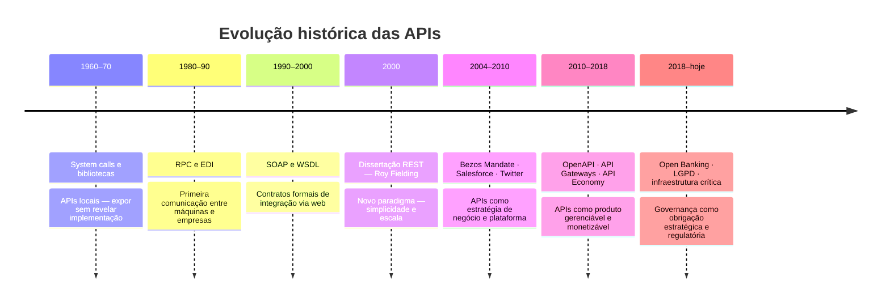
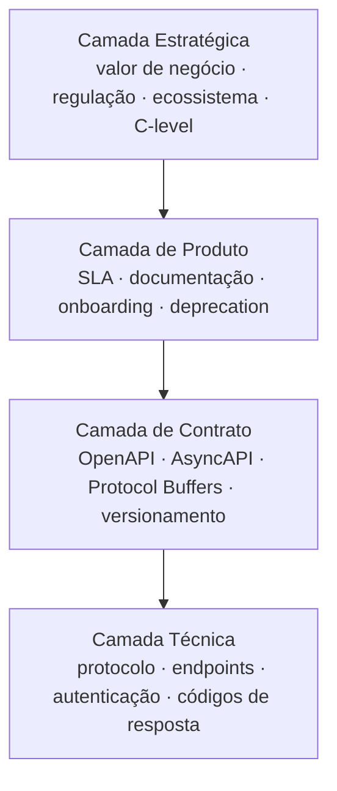

# Módulo 1 · Fundamentos
## Capítulo 1.1 · O que é uma API

> **Série:** Gerenciamento e Governança de APIs  
> **Nível:** Fundamentos  
> **Pré-requisito:** Nenhum

---

## Sumário

- [1.1.1 · Contexto histórico — como chegamos até aqui](#111--contexto-histórico--como-chegamos-até-aqui)
- [1.1.2 · Definição formal e suas camadas](#112--definição-formal-e-suas-camadas)

---

## 1.1.1 · Contexto histórico — como chegamos até aqui

Para entender o que é uma API hoje, precisamos entender o problema que ela veio resolver ao longo do tempo. A história das APIs é, essencialmente, a história de como sistemas aprenderam a **conversar**.

---

### Anos 1960–70 · As primeiras interfaces de software

O conceito de "interface de programação" nasce junto com os primeiros sistemas operacionais. Programas precisavam chamar funções do SO sem conhecer os detalhes de hardware — surgem as primeiras *system calls*, que são, em essência, APIs locais.

A ideia central já estava lá: **expor capacidades sem expor a implementação**.

Nessa época, bibliotecas de software já funcionavam como APIs — você chamava funções de uma lib sem precisar saber como ela funcionava internamente. O contrato era a assinatura da função.

---

### Anos 1980–90 · RPC e a primeira comunicação entre máquinas

Com a chegada das redes, surgiu a necessidade de chamar funções em outras máquinas como se fossem locais. Nasceu o conceito de **RPC — Remote Procedure Call**. A ideia era simples: abstrair a rede para que o programador não precisasse se preocupar com ela.

O problema? RPC era fortemente acoplado — cliente e servidor precisavam compartilhar o mesmo "dialeto". Qualquer mudança de um lado quebrava o outro.

Na mesma época surgiram os primeiros **EDI (Electronic Data Interchange)** — protocolos padronizados para troca de documentos entre empresas (pedidos, faturas). Eram rígidos, caros e exigiam acordos bilaterais. Mas plantaram a semente do que viria a ser a integração B2B via APIs.

---

### Anos 1990–2000 · XML, SOAP e a era dos Web Services

A explosão da internet trouxe um problema novo: sistemas heterogêneos, em linguagens diferentes, em empresas diferentes, precisavam se comunicar pela web.

A resposta da indústria foi o **SOAP (Simple Object Access Protocol)** — um protocolo baseado em XML com regras rígidas de estrutura, contrato formal via **WSDL (Web Services Description Language)** e suporte a segurança e transações. Era robusto, mas extremamente verboso e complexo.

```xml
<!-- Uma requisição SOAP típica — note a cerimônia necessária -->
<soap:Envelope xmlns:soap="http://schemas.xmlsoap.org/soap/envelope/">
  <soap:Body>
    <GetWeather xmlns="http://example.com/weather">
      <City>São Paulo</City>
    </GetWeather>
  </soap:Body>
</soap:Envelope>
```

SOAP dominou o mundo corporativo nos anos 2000. Grandes SIs (SAP, Oracle, IBM) construíram ecossistemas inteiros sobre ele. O WSDL era o "contrato de governança" da época — qualquer mudança exigia renegociação formal do contrato entre times.

---

### 2000 · Roy Fielding e o nascimento do REST

Em 2000, Roy Fielding publicou sua dissertação de doutorado na UC Irvine definindo **REST — Representational State Transfer**. Ele não inventou um protocolo novo — descreveu os princípios arquiteturais que faziam a web funcionar tão bem e propôs usá-los para integração de sistemas.

Os princípios eram radicalmente mais simples que SOAP:

| Princípio | Descrição |
|---|---|
| **Recursos via URI** | Cada recurso tem um identificador único (`/pedidos/42`) |
| **Verbos HTTP** | Operações expressas via GET, POST, PUT, DELETE, PATCH |
| **Stateless** | Cada requisição contém tudo que o servidor precisa — sem estado de sessão |
| **Representações** | JSON, XML ou outros formatos separados do recurso em si |
| **Interface uniforme** | Mesmas regras para todos os recursos |

REST não tinha especificação formal — era um estilo arquitetural. Isso era sua força (flexibilidade) e sua fraqueza (inconsistência entre implementações). A governança de APIs REST viria a ser um problema recorrente exatamente por isso.

---

### 2004–2010 · A virada: APIs públicas como estratégia de negócio

Esse é o momento em que APIs deixam de ser apenas integração técnica e viram **estratégia de negócio**. Três marcos definem essa era:

**Salesforce (2000)** foi uma das primeiras empresas a lançar uma API pública deliberadamente — o que hoje chamamos de API-first. Desenvolvedores podiam construir sobre a plataforma Salesforce. Nascia o conceito de **plataforma como negócio**.

**Amazon Web Services (2002–2006)** — Jeff Bezos emitiu o famoso "Bezos API Mandate": todos os times da Amazon deveriam expor suas capacidades exclusivamente via APIs, como se fossem serviços públicos. Nenhuma comunicação direta entre sistemas. Esse mandato interno foi o que tornou possível lançar o AWS — a Amazon já tinha tudo encapsulado em APIs prontas para consumo externo.

**Twitter e Facebook (2006–2007)** — ao abrir APIs públicas, permitiram que terceiros construíssem clientes, integrações e aplicações. O ecossistema de apps mobile que conhecemos hoje só existe porque essas APIs existiram.

---

### 2010–2018 · A era da API Economy

Com a explosão mobile, APIs tornaram-se a **espinha dorsal da economia digital**. Aplicativos mobile consumiam APIs. Marketplaces de APIs surgiam (Mashery, Apigee). O termo **API Economy** passou a descrever modelos de negócio inteiros baseados na monetização de dados e capacidades via APIs.

Foi nessa época que **Swagger** (hoje OpenAPI) surgiu, em 2011 — uma tentativa de trazer ao REST a mesma capacidade de contrato formal que o WSDL trazia ao SOAP, mas de forma muito mais simples.

Surgiram também os primeiros **API Gateways** comerciais — a necessidade de gerenciar centenas de APIs com segurança, throttling e analytics criou um mercado inteiro.

---

### 2018–hoje · APIs como infraestrutura crítica

APIs deixaram de ser diferencial competitivo e tornaram-se **infraestrutura crítica**. Regulações como **Open Banking** (PSD2 na Europa, BACEN no Brasil) tornaram APIs obrigatórias em setores inteiros. A pandemia de 2020 acelerou a digitalização e com ela a dependência de APIs.

Nesse contexto, **governança de APIs** deixou de ser uma preocupação de arquitetos e virou pauta de C-level. Uma API mal gerenciada pode significar:

- Violação regulatória (LGPD, BACEN, PSD2)
- Incidente de segurança com impacto em milhões de usuários
- Indisponibilidade de serviços críticos
- Perda de parceiros e receita

É nesse cenário que API Management e Governança emergem como disciplinas formais — e onde frameworks como ITIL passam a ser referência natural para estruturar essa gestão.

---

### Linha do tempo resumida



| Período | Marco | Impacto |
|---|---|---|
| 1960–70 | System calls e bibliotecas | APIs locais — expor sem revelar implementação |
| 1980–90 | RPC e EDI | Primeira comunicação entre máquinas e empresas |
| 1990–2000 | SOAP e WSDL | Contratos formais de integração via web |
| 2000 | Dissertação REST (Fielding) | Novo paradigma: simplicidade e escala |
| 2004–2010 | Bezos Mandate, Salesforce, Twitter | APIs como estratégia de negócio e plataforma |
| 2010–2018 | OpenAPI, API Gateways, API Economy | APIs como produto gerenciável e monetizável |
| 2018–hoje | Open Banking, LGPD, infraestrutura crítica | Governança como obrigação estratégica e regulatória |

---

## 1.1.2 · Definição formal e suas camadas

Com o contexto histórico estabelecido, a definição fica muito mais rica:

> **API é um contrato formal que define como dois sistemas se comunicam — especificando o que pode ser solicitado, em que formato, sob quais condições e o que será retornado — abstraindo a complexidade da implementação subjacente.**

Mas essa definição tem camadas. Entender cada uma é fundamental para governança efetiva:

---

### Camada técnica

Protocolo, formato de dados, endpoints, autenticação, códigos de resposta. É o que os desenvolvedores implementam. Exemplos: `GET /pedidos/{id}` retorna `200 OK` com JSON ou `404 Not Found`.

Esta camada é visível no código e nos logs — é onde os problemas técnicos aparecem.

---

### Camada de contrato

A especificação formal (OpenAPI, AsyncAPI, Protocol Buffers). É o acordo entre quem produz e quem consome a API. Define o que é prometido — e o que não pode mudar sem negociação.

**É aqui que a governança começa.** Um contrato bem definido é a base para versionamento, testes automatizados, documentação e gestão de mudanças.

---

### Camada de produto

SLA, planos de uso, documentação interativa, processo de onboarding, suporte, política de versionamento e deprecation. É o que transforma uma API técnica em um **serviço gerenciável e consumível**.

Esta camada conecta API Management ao ITIL — ambos tratam tecnologia como serviço entregue a um usuário com valor mensurável e acordos formais de nível de serviço.

---

### Camada estratégica

Valor de negócio gerado, modelos de monetização, parcerias habilitadas, conformidade regulatória e posição no ecossistema digital. É o que interessa ao C-level e à governança corporativa.

---

### Resumo das camadas



> **Insight de governança:** A maioria dos problemas de APIs em organizações acontece porque times focam exclusivamente na camada técnica e ignoram as demais. Governança existe para garantir que todas as camadas sejam gerenciadas de forma consistente.

---

## Pontos-chave do capítulo

- APIs existem desde os primeiros sistemas operacionais — o que mudou foi a escala, a exposição e o impacto estratégico
- SOAP trouxe contratos formais mas com complexidade alta; REST trouxe simplicidade mas exigiu governança para compensar a falta de rigidez
- O "Bezos API Mandate" é o exemplo mais citado de como governança interna de APIs pode se tornar vantagem competitiva
- APIs modernas têm quatro camadas — técnica, contrato, produto e estratégica — e governança efetiva atua em todas elas
- Regulações (Open Banking, LGPD) elevaram APIs ao status de infraestrutura crítica, tornando governança uma obrigação, não uma opção

---

## Próximo capítulo

**1.2 · API como produto: a mudança de mentalidade** — como tratar APIs com a mesma disciplina de gestão de produtos digitais, com owners, roadmap, métricas de adoção e experiência do desenvolvedor.

---

*Série: Gerenciamento e Governança de APIs · Módulo 1 · Capítulo 1.1*