# Módulo 1 · Fundamentos
## Capítulo 1.2 · API como produto: a mudança de mentalidade

> **Série:** Gerenciamento e Governança de APIs  
> **Nível:** Fundamentos  
> **Pré-requisito:** Capítulo 1.1 · O que é uma API

---

## Sumário

- [1.2.0 · O que é um produto?](#120--o-que-é-um-produto)
- [1.2.1 · O que significa tratar uma API como produto](#121--o-que-significa-tratar-uma-api-como-produto)
  - [1.2.1.1 · API-first: a decisão estratégica por trás do produto](#1211--api-first-a-decisão-estratégica-por-trás-do-produto)
- [1.2.2 · O papel do API Product Owner e do API Product Manager](#122--o-papel-do-api-product-owner-e-do-api-product-manager)
- [1.2.3 · Ciclo de vida do produto vs. ciclo de vida técnico](#123--ciclo-de-vida-do-produto-vs-ciclo-de-vida-técnico)
- [1.2.4 · Developer Experience (DX) como métrica de produto](#124--developer-experience-dx-como-métrica-de-produto)
- [1.2.5 · API como plataforma — o modelo de negócio](#125--api-como-plataforma--o-modelo-de-negócio)

---

## 1.2.0 · O que é um produto?

### A armadilha da palavra óbvia

Poucas palavras no vocabulário de tecnologia e negócio são usadas com tanta frequência e definidas com tanta imprecisão quanto **produto**. Todo mundo usa, poucos param para definir. E quando não há definição compartilhada, conversas sobre "tratar APIs como produto" ficam no ar — cada pessoa entendendo algo diferente.

Vale então fazer o que bons profissionais de tecnologia deveriam fazer mais frequentemente: parar, definir o termo com rigor, e só então avançar.

---

### Visão 1 — O produto no sentido tradicional de negócio

Na teoria econômica clássica, um produto é qualquer **bem ou serviço oferecido ao mercado para satisfazer uma necessidade ou desejo**. Essa definição, consolidada por Philip Kotler, tem três elementos centrais:

- **Oferta:** algo que existe e pode ser entregue
- **Mercado:** existe um público que pode consumi-lo
- **Necessidade ou desejo:** há uma razão para o consumo — um problema a resolver ou um valor a obter

Nessa visão, produto tem dimensões físicas e simbólicas. Kotler propõe três níveis:

**Produto central** — o benefício fundamental. O que o consumidor realmente está comprando. Um perfume não vende líquido — vende status e sedução. Um carro não vende metal — vende mobilidade e identidade.

**Produto real** — as características tangíveis: design, qualidade, embalagem, marca, funcionalidades.

**Produto ampliado** — os serviços que envolvem o produto: entrega, suporte, garantia, comunidade, atualizações.

Essa estrutura de três níveis, como veremos, se aplica de forma surpreendentemente precisa ao universo de APIs.

---

### Visão 2 — O produto no contexto de software

Com a ascensão da indústria de software, o conceito evoluiu. Um produto de software tem características que o distinguem de produtos físicos:

- **Não se esgota com o uso** — a mesma API pode ser consumida por milhares de clientes simultaneamente sem degradação do "estoque"
- **Custo marginal próximo de zero** — entregar para o centésimo consumidor custa quase o mesmo que entregar para o primeiro
- **Evolui continuamente** — ao contrário de um produto físico, um produto de software nunca está "terminado"
- **O valor cresce com a adoção** — efeitos de rede fazem com que um produto usado por muitos seja mais valioso do que um usado por poucos

Essas características mudam fundamentalmente como se pensa ciclo de vida, precificação e governança. Um produto físico depreciado é descartado. Uma API depreciada precisa ser gerenciada com cuidado — consumidores dependem dela e precisam de tempo para migrar.

---

### Visão 3 — O produto no Product Management moderno

A disciplina de Product Management, consolidada por referências como Marty Cagan (*Inspired*) e Gibson Biddle, traz uma definição mais operacional e orientada a valor:

> **Um produto é uma solução entregue continuamente a um conjunto de usuários, gerando valor mensurável para eles e para o negócio, evoluindo com base em aprendizado.**

Cada elemento dessa definição tem implicação direta na gestão de APIs:

**"Entregue continuamente"** — produto não é um projeto com início, meio e fim. É um ativo vivo que evolui. Isso muda completamente a relação com governança — você não governa uma entrega única, governa um ciclo contínuo.

**"Conjunto de usuários"** — há sempre um público específico com necessidades específicas. Produto sem usuário definido não é produto — é um exercício técnico.

**"Valor mensurável"** — produto precisa ter métricas de sucesso. Não "funciona ou não funciona", mas "quanto valor está gerando, para quem, e como isso evolui ao longo do tempo".

**"Evoluindo com base em aprendizado"** — produto é hipótese, não certeza. Você lança, mede, aprende e ajusta. Isso exige um processo de feedback estruturado — o que, no contexto de APIs, significa monitorar adoção, coletar feedback de desenvolvedores e revisar o roadmap com base em dados reais.

---

### Visão 4 — O produto na perspectiva de plataforma e ecossistema

Uma quarta visão, mais recente e especialmente relevante para APIs, vem da teoria de **plataformas** — consolidada por autores como Geoffrey Parker, Marshall Van Alstyne e Sangeet Paul Choudary em *Platform Revolution*.

Nessa visão, um produto deixa de ser apenas uma solução para um usuário e passa a ser uma **infraestrutura sobre a qual outros criam valor**. A distinção é fundamental:

| Produto tradicional | Produto plataforma |
|---|---|
| Cria valor diretamente para o usuário | Habilita que outros criem valor |
| Relação linear: empresa → usuário | Relação de rede: produtores ↔ plataforma ↔ consumidores |
| Cresce com investimento da empresa | Cresce com o ecossistema de participantes |
| Valor definido pela empresa | Valor co-criado com o ecossistema |

O iPhone sem a App Store seria um produto tradicional. Com a App Store, tornou-se uma plataforma — o valor que a Apple entrega não é só o hardware e o iOS, mas o ecossistema de um milhão de aplicativos construídos por terceiros.

APIs públicas bem governadas funcionam exatamente dessa forma. A Twilio não entrega apenas chamadas de voz e SMS — entrega uma plataforma sobre a qual desenvolvedores constroem comunicação em seus produtos.

---

### Sintetizando — o que é produto para fins deste estudo

Com essas quatro visões estabelecidas, podemos construir uma definição sintética que servirá como fundamento para todo o estudo de API como produto:

> **Um produto é um ativo gerenciado continuamente, entregue a um conjunto definido de usuários ou plataformas, que gera valor mensurável para eles e para o negócio, evolui com base em aprendizado e feedback, e tem um responsável claro pela sua direção e qualidade.**

Cada elemento dessa definição tem implicação direta na gestão de APIs:

| Elemento | Implicação para APIs |
|---|---|
| **Ativo gerenciado continuamente** | APIs precisam de ownership, roadmap e processo de evolução — não são entregas pontuais |
| **Conjunto definido de usuários** | Toda API precisa ter seus consumidores identificados com suas necessidades mapeadas |
| **Valor mensurável** | Adoção, disponibilidade, latência e impacto de negócio são métricas de produto |
| **Evolui com base em aprendizado** | Feedback de consumidores alimenta o roadmap |
| **Responsável claro** | Os papéis de API Product Manager e API Product Owner que veremos no 1.2.2 |

---

### Os três níveis de Kotler aplicados a APIs

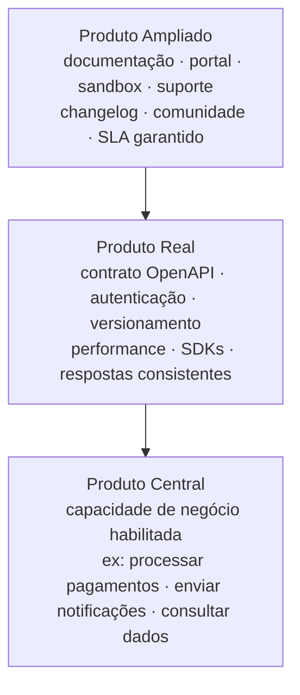

> **Insight de governança:** A maioria das organizações governa apenas o produto real — o contrato técnico. Organizações maduras governam os três níveis — garantindo que o produto central esteja sempre alinhado ao valor de negócio e que o produto ampliado entregue a experiência necessária para adoção e retenção dos consumidores.

---

## 1.2.1 · O que significa tratar uma API como produto

### O problema da mentalidade técnica

Durante muito tempo — e ainda hoje em muitas organizações — APIs foram tratadas como **subproduto técnico**: você tem um sistema, ele precisa se comunicar com outro, você expõe um endpoint. Pronto.

Esse modelo funciona em pequena escala. Quando você tem 5 APIs consumidas por 2 times internos, a informalidade é tolerável. Quando você tem 200 APIs, consumidores externos, parceiros e obrigações regulatórias, ele quebra completamente.

A mudança de mentalidade para **API como produto** parte de uma pergunta simples e poderosa:

> *Se essa API fosse um produto comercial, ela seria boa o suficiente para alguém pagar por ela?*

Essa pergunta força uma perspectiva completamente diferente sobre o que significa "entregar" uma API.

---

### O que muda na prática

| Dimensão | Mentalidade técnica | Mentalidade de produto |
|---|---|---|
| **Critério de sucesso** | Funciona e está no ar | Adotada, usada e gerando valor |
| **Documentação** | Nice to have, feita depois | Parte do produto, feita antes |
| **Mudanças** | Quando o time decide | Com notice, versionamento e respeito ao consumidor |
| **Erros** | Código HTTP e stack trace | Mensagens claras, acionáveis, com código de referência |
| **Descoberta** | Quem sabe, sabe | Catálogo acessível, buscável, com exemplos |
| **Feedback** | Reclamações viram tickets | Canal estruturado, NPS, changelog público |
| **Desempenho** | Monitorado quando quebra | SLA formal, alertas proativos |

O ponto central é que **o consumidor da API é tratado como cliente** — com todas as implicações que isso traz para design, operação e evolução do produto.

---

### Por que isso importa para governança

Governança de APIs sem mentalidade de produto tende a ser burocrática e reativa — um conjunto de regras que ninguém segue porque não enxerga valor. Com mentalidade de produto, a governança passa a ter propósito claro: **proteger a experiência do consumidor e a confiabilidade do produto**.

Um style guide deixa de ser "regra do CoE" e passa a ser "como garantimos que qualquer desenvolvedor consiga usar nossas APIs sem fricção". Um processo de deprecation deixa de ser "procedimento formal" e passa a ser "como respeitamos quem depende do nosso produto".

Governança bem feita **serve** ao produto.

---

## 1.2.1.1 · API-first: a decisão estratégica por trás do produto

### O problema que API-first resolve

Imagine uma organização que cresce. Começa com um sistema web. Depois precisa de um app mobile. Depois um parceiro quer se integrar. Depois surge a necessidade de uma CLI para o time interno. Depois um cliente enterprise quer uma integração direta com o ERP dele.

Em organizações que não adotam API-first, cada um desses canais é construído de forma independente, acessando diretamente a lógica de negócio, o banco de dados ou serviços internos:

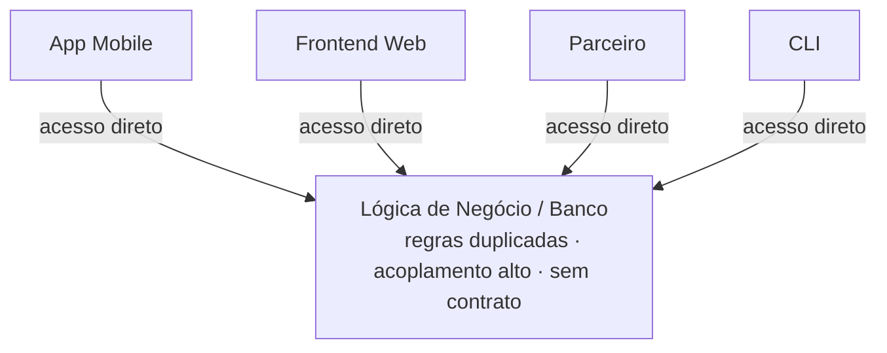

Cada canal conhece os detalhes internos do sistema. Qualquer mudança no core precisa ser replicada em todos os canais. Segurança precisa ser implementada em cada ponto de acesso. Não há contrato formal — só código que "funciona por enquanto".

---

### A lógica do API-first

A premissa é simples e poderosa:

> **Projete a capacidade de negócio como uma API bem definida primeiro. Todo canal de consumo — frontend, mobile, SDK, CLI, parceiro — é apenas uma camada sobre essa fundação.**

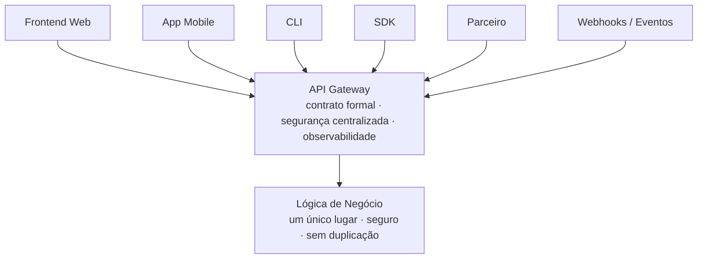

A API se torna o único ponto de acesso às capacidades do sistema. Isso tem consequências profundas:

- Segurança implementada uma vez, válida para todos os canais
- Regras de negócio em um único lugar — sem duplicação
- Qualquer novo canal de consumo é apenas um novo cliente da mesma API
- Contrato formal garante que mudanças internas não quebram consumidores
- Observabilidade centralizada — toda interação passa pelo mesmo ponto

---

### O Bezos API Mandate — o que realmente aconteceu

Em 2002, Jeff Bezos enviou um memorando interno que ficaria conhecido como o **Bezos API Mandate**. Não era uma sugestão — era uma ordem com consequências claras:

1. Todos os times devem expor seus dados e funcionalidades exclusivamente através de interfaces de serviço (APIs)
2. Os times devem se comunicar entre si exclusivamente através dessas interfaces
3. Nenhuma outra forma de comunicação entre processos é permitida — sem leitura direta de banco de dados de outro time, sem memória compartilhada, sem backdoors
4. Não importa qual tecnologia é usada — desde que seja uma interface
5. **Todas as interfaces devem ser projetadas para serem externalizáveis** — o time deve projetar a API como se fosse ser exposta para desenvolvedores externos no mundo inteiro. Sem exceções
6. Times que não fizerem isso serão demitidos

O ponto 5 é o mais importante. Bezos não estava apenas pedindo que os times usassem APIs internamente. Ele estava exigindo que **cada API fosse projetada como um produto público**, independente de ser usada só internamente.

O resultado, anos depois, foi o AWS. A Amazon já tinha toda sua infraestrutura encapsulada em APIs bem definidas, projetadas com qualidade de produto público. Quando decidiram comercializar essa infraestrutura, o trabalho já estava feito.

**Essa é a prova mais concreta de que governança de APIs não é custo operacional — é construção de ativo estratégico.**

---

### O modelo Salesforce — plataforma como ecossistema

A Salesforce projetou seu produto com APIs públicas como parte central da proposta de valor desde o início, em 2000. A lógica era: *se nossos clientes conseguem construir sobre nossa plataforma, eles nunca vão embora.*

Isso criou o **AppExchange** — um marketplace de aplicações construídas por terceiros sobre as APIs da Salesforce. Hoje, grande parte do valor percebido da plataforma não vem da Salesforce em si, mas do ecossistema de parceiros que construíram sobre suas APIs.

> **Uma API bem governada não é só uma interface técnica — é um convite para o mercado construir valor sobre sua plataforma. Cada desenvolvedor que adota sua API é um multiplicador do seu produto.**

---

### Da API ao ecossistema — as camadas de consumo

Quando uma API é bem projetada, ela naturalmente habilita múltiplas camadas de consumo sem retrabalho significativo:

**Camada 1 — A API em si**

```http
POST /v1/pagamentos
Authorization: Bearer {token}
Content-Type: application/json

{
  "valor": 150.00,
  "moeda": "BRL",
  "destinatario_id": "usr_123"
}
```

**Camada 2 — SDKs**

```python
# Python SDK — mesma operação, zero fricção de protocolo
pagamento = cliente.pagamentos.criar(
    valor=150.00,
    moeda="BRL",
    destinatario_id="usr_123"
)
```

Uma API bem documentada e consistente gera SDKs quase automaticamente — ferramentas como OpenAPI Generator, Speakeasy e Stainless fazem isso a partir da spec OpenAPI. **Governança da API é governança das SDKs.**

**Camada 3 — CLI**

```bash
$ api pagamentos criar --valor 150.00 --moeda BRL --destinatario usr_123
✓ Pagamento criado: pag_789 | Status: processando
```

**Camada 4 — Frontend e aplicações**
O frontend web ou mobile é apenas mais um consumidor da API — com a vantagem de que se a API foi projetada para ser pública e segura, o frontend nunca precisa de privilégios especiais ou acesso direto ao backend.

**Camada 5 — Integrações e parceiros**
Com a mesma API, parceiros e integrações de terceiros se conectam sem necessidade de integrações customizadas. O contrato formal da API é o acordo de integração.

**Camada 6 — Webhooks e eventos**
APIs maduras complementam o modelo request-response com webhooks — o sistema notifica consumidores quando algo acontece, sem necessidade de polling.

---

### O custo de não fazer API-first

**Síndrome do "Big Ball of Mud"**
Sistemas crescem sem contratos formais. Lógica de negócio vaza para frontends. Regras de segurança são implementadas em múltiplos lugares de forma inconsistente. Nenhum time sabe exatamente o que outro time expõe ou consome.

**Custo de mudança exponencial**
Sem contratos formais, qualquer mudança interna pode quebrar qualquer consumidor. Times ficam com medo de evoluir sistemas porque não sabem o impacto.

**Impossibilidade de escalar canais**
Cada novo canal de consumo exige uma integração customizada e cara. Nenhum reaproveitamento real.

**Dívida de governança**
Quando a organização finalmente decide profissionalizar a gestão de APIs, encontra dezenas ou centenas de integrações informais que precisam ser mapeadas, documentadas e migradas. O custo é muito maior do que teria sido fazer certo desde o início.

**Risco regulatório**
Em setores como financeiro, saúde e telecomunicações, APIs sem governança adequada representam risco de conformidade com LGPD, BACEN, ANS e outros órgãos reguladores.

---

### API-first e governança — a conexão direta

API-first sem governança é caos organizado — você tem APIs em todo lugar, mas sem padrões, sem catálogo, sem políticas. Governança sem API-first é burocracia vazia — você tem processos, mas aplicados a integrações informais que não seguem nenhum contrato.

> **API-first garante que a fundação técnica seja sólida. Governança garante que essa fundação seja construída de forma consistente, segura e alinhada ao negócio.**

---

## 1.2.2 · O papel do API Product Owner e do API Product Manager

### A confusão de papéis — e por que ela importa

O mercado usa os termos **Product Owner** e **Product Manager** de forma inconsistente. Em algumas empresas são sinônimos. Em outras, papéis completamente distintos. Em muitas, uma única pessoa acumula os dois.

Essa confusão tem consequências práticas sérias na governança de APIs. Quando não está claro quem é responsável pela **visão estratégica** de uma API e quem é responsável pela **execução tática**, surgem os problemas clássicos:

- APIs criadas sem propósito de negócio claro
- Roadmap inexistente ou puramente técnico
- Mudanças sem comunicação adequada aos consumidores
- Nenhum responsável formal quando a API falha ou precisa evoluir
- Governança sem dono — regras que existem no papel mas ninguém aplica

---

### Product Manager vs. Product Owner — a distinção fundamental

A diferença fundamental está no **escopo de responsabilidade** e no **horizonte de tempo**.

O **Product Manager (PM)** atua na visão estratégica e no posicionamento do produto. Seu horizonte é longo — trimestres, anos. Ele define o **"o quê" e o "por quê"** — a direção.

O **Product Owner (PO)**, figura originária do Scrum, atua na interface entre o time de desenvolvimento e as necessidades do produto. Seu horizonte é mais curto — sprints, releases. Ele define o **"o quê" e o "quando"** no nível tático.

---

### Aplicando ao universo de APIs

| Dimensão | API Product Manager | API Product Owner |
|---|---|---|
| **Horizonte** | Estratégico — roadmap anual, posicionamento | Tático — sprint, backlog, entrega |
| **Foco** | Quais APIs criar, para quem, com que modelo | O que entregar nessa versão, quais contratos |
| **Interlocutores** | C-level, parceiros, times de negócio, reguladores | Time de dev, arquitetos, consumidores da API |
| **Entregáveis** | Visão do produto, business case, estratégia de ecossistema | User stories, critérios de aceitação, spec OpenAPI |
| **Métricas** | Adoção, receita, NPS de desenvolvedores, market share | Velocity, qualidade do contrato, cobertura de testes |
| **Decisão típica** | "Vamos abrir essa API para parceiros externos?" | "O campo `data_nascimento` vai no header ou no body?" |
| **Relação com governança** | Define políticas, aprova style guide, representa a API no CoE | Garante conformidade com o style guide na implementação |
| **Relação com ITIL** | Responsável pelo SLA acordado com o negócio | Responsável pelo Change Record de cada versão |

---

### O API Product Manager em profundidade

O API PM precisa dominar três dimensões simultaneamente:

**Dimensão de negócio** — entender o valor que a API gera: direto (receita por chamada, monetização de dados) ou indireto (habilitação de parceiros, redução de custo de integração, conformidade regulatória).

**Dimensão de mercado e ecossistema** — entender quem são os consumidores da API, mapear suas necessidades, monitorar concorrentes. Em APIs públicas, isso inclui gerir a comunidade de desenvolvedores e o programa de parcerias.

**Dimensão técnica estratégica** — não precisa implementar, mas precisa entender o suficiente para tomar decisões bem informadas: o que é um breaking change, por que versionamento importa, o que significa um SLA de 99,9% na prática.

---

### O API Product Owner em profundidade

**Guardião do contrato** — o PO é responsável pela integridade da especificação OpenAPI ou AsyncAPI. Cada mudança no contrato passa por ele — avaliando impacto nos consumidores existentes e garantindo que o versionamento seja aplicado corretamente.

**Elo com os consumidores** — coleta feedback de quem usa a API e alimenta o backlog com a perspectiva do consumidor.

**Responsável pela conformidade** — garante que cada entrega respeite o style guide, as políticas de segurança e os padrões de governança definidos pelo CoE.

**Gestor do ciclo de deprecação** — coordena o processo de depreciação: comunicação, período de coexistência, suporte à migração e encerramento controlado.

---

### Como os papéis se relacionam na prática

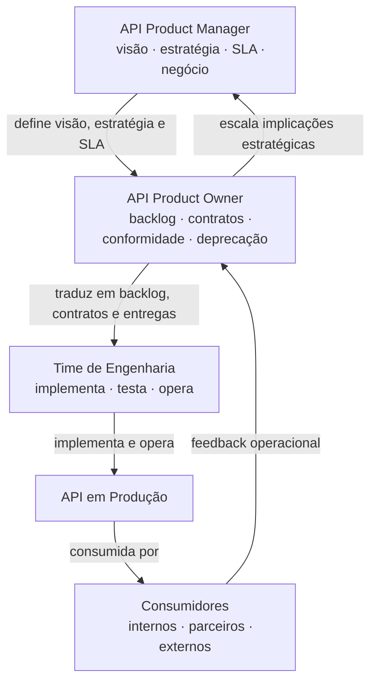

O fluxo não é linear — é um ciclo. O feedback dos consumidores alimenta o PO, que escala para o PM quando há implicações estratégicas.

---

### O que acontece quando esses papéis não existem

**Sem API PM:** APIs são criadas por demanda técnica imediata, sem visão de longo prazo. O resultado é um portfólio fragmentado — dezenas de APIs que cobrem casos de uso similares de formas diferentes.

**Sem API PO:** O contrato da API é tratado como detalhe de implementação — muda quando o desenvolvedor acha necessário, sem avaliação de impacto nos consumidores. Breaking changes silenciosos quebram integrações em produção.

**Sem nenhum dos dois:** A API existe tecnicamente mas não tem dono. Quando falha, ninguém sabe a quem escalar. Quando precisa evoluir, ninguém tem autoridade para decidir.

---

### A realidade do mercado brasileiro

No Brasil, a maturidade desses papéis ainda está em construção. O que se vê com mais frequência:

- **Empresas early-stage:** Um desenvolvedor sênior acumula informalmente as responsabilidades de PM e PO de APIs, sem título nem processo formal
- **Empresas em crescimento:** Um PO de produto digital absorve responsabilidades de APIs sem o treinamento específico que o contexto técnico e de governança exige
- **Enterprises:** Estruturas mais formalizadas, frequentemente influenciadas por frameworks como MuleSoft's API-led connectivity ou o modelo da Sensedia

O Open Banking acelerou essa maturidade no setor financeiro — o BACEN exigiu APIs com qualidade de produto público, forçando bancos e fintechs a criarem estruturas formais de ownership de APIs pela primeira vez.

---

## 1.2.3 · Ciclo de vida do produto vs. ciclo de vida técnico

### Por que essa distinção importa

Uma das confusões mais comuns em organizações que estão amadurecendo a gestão de APIs é tratar o ciclo de vida técnico como se fosse o ciclo de vida do produto — ou pior, ignorar que existem dois ciclos distintos operando simultaneamente.

O **ciclo de vida técnico** responde à pergunta: *em que estado técnico essa API está?*
O **ciclo de vida do produto** responde à pergunta: *em que momento de maturidade de mercado esse produto está?*

São perguntas diferentes, com respostas diferentes, que exigem decisões diferentes.

---

### O ciclo de vida técnico de uma API

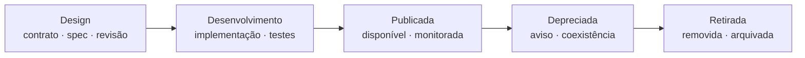

**Design** — o contrato da API é definido antes do código. Especificação OpenAPI ou AsyncAPI é escrita, revisada pelo CoE, validada contra o style guide e aprovada. Consumidores potenciais são consultados nessa fase.

**Desenvolvimento** — implementação conforme o contrato aprovado. Testes unitários, de integração e de contrato (Pact). Mocks disponibilizados para consumidores desenvolverem em paralelo.

**Publicada** — API em produção, com monitoramento ativo e SLA em vigor. Qualquer mudança precisa passar pelo processo de Change Management.

**Depreciada** — API ainda funcional, mas com data de encerramento anunciada. Consumidores notificados com antecedência mínima definida pela política de governança — geralmente 6 a 12 meses para APIs públicas.

**Retirada** — API removida definitivamente, com processo documentado e auditável. Em setores regulados, esse registro tem importância legal.

---

### O ciclo de vida do produto

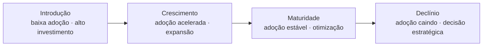

**Introdução** — a API foi lançada mas ainda tem poucos consumidores. Momento mais crítico para Developer Experience. Métricas-chave: time-to-first-call, número de onboardings, tickets de suporte por consumidor.

**Crescimento** — adoção acelerada, feedback rico chegando do mercado. Fase mais importante para governança de evolução. Métricas-chave: taxa de crescimento de consumidores ativos, volume de chamadas, NPS de desenvolvedores.

**Maturidade** — adoção estável, foco em otimização. Métricas-chave: disponibilidade, latência, custo por chamada, churn de consumidores.

**Declínio** — adoção caindo. Exige **decisão estratégica consciente**: investir para revitalizar, manter em modo de sustentação ou iniciar a depreciação planejada.

---

### Onde os dois ciclos se encontram — e onde divergem

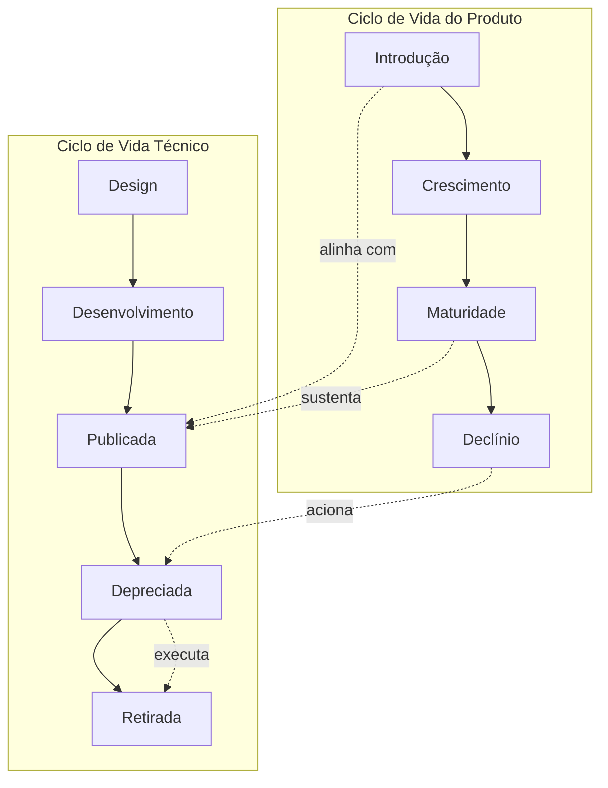

Situações de desalinhamento entre os dois ciclos:

| Situação | Ciclo técnico | Ciclo de produto | Problema |
|---|---|---|---|
| API legada sustentada | Publicada — tecnicamente estável | Declínio — adoção caindo | Custo operacional sem retorno de valor |
| API nova sem adoção | Publicada — tecnicamente pronta | Introdução travada | Problema de DX ou product-market fit |
| API retirada prematuramente | Retirada | Crescimento | Ruptura de serviço para consumidores ativos |
| API em declínio sem depreciação | Publicada indefinidamente | Declínio | Dívida técnica e operacional acumulada |

---

### O papel da governança em cada fase

**Introdução + Design/Desenvolvimento** — governança garante que a API nasce com qualidade. O erro mais comum é apressar o lançamento e deixar a governança "para depois". Dívida de governança em APIs é exponencialmente mais cara de resolver após o lançamento.

**Crescimento + Publicada** — governança protege consumidores existentes enquanto a API evolui. Non-breaking changes com processo leve. Breaking changes exigem nova versão major, coexistência e plano de migração.

**Maturidade + Publicada** — governança foca em SLA, conformidade e automação. Revisões periódicas de segurança, auditorias de uso, renovação de certificados.

**Declínio + Depreciada → Retirada** — governança garante encerramento controlado, comunicado e auditável. A política de deprecation define prazos, processo de comunicação e suporte à migração.

---

### O conceito de versionamento no contexto dos dois ciclos

Uma nova versão major de uma API não é apenas uma mudança técnica — é um evento de produto. Do ponto de vista técnico, permite breaking changes sem quebrar consumidores existentes. Do ponto de vista de produto, é essencialmente um **novo produto** com seu próprio ciclo de vida.

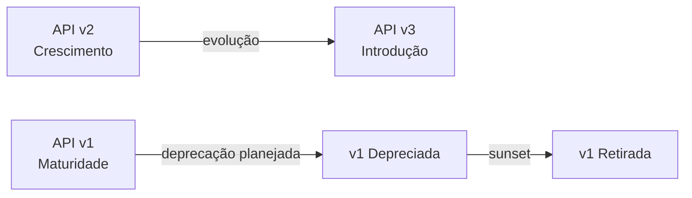

> **O ciclo técnico sem o ciclo de produto gera APIs tecnicamente corretas mas sem direção estratégica. O ciclo de produto sem o ciclo técnico gera visão sem execução controlada. A governança madura integra os dois.**

---

## 1.2.4 · Developer Experience (DX) como métrica de produto

### 1.2.4.1 · O que é Developer Experience — e por que é diferente de UX

User Experience (UX) é a disciplina que projeta a experiência de usuários finais interagindo com produtos digitais. Developer Experience (DX) parte dos mesmos princípios, mas aplica-os a um público radicalmente diferente: **desenvolvedores que consomem uma API como insumo para construir seus próprios produtos**.

A diferença não é superficial. Um usuário final interage com uma interface visual — botões, formulários, fluxos guiados. Um desenvolvedor interage com um contrato abstrato — endpoints, payloads, códigos de resposta, documentação técnica, SDKs.

Além disso, o desenvolvedor tem um objetivo diferente: ele não está usando a API — ele está **construindo sobre ela**. Cada hora de fricção no processo de integração é uma hora a menos de desenvolvimento do produto que ele está tentando entregar.

Há ainda uma dimensão de autonomia central para desenvolvedores: eles esperam conseguir resolver seus problemas **sem precisar de ajuda humana**. Um desenvolvedor que trava numa integração primeiro tenta resolver sozinho — lê documentação, busca no Stack Overflow, testa hipóteses. Se não consegue resolver em tempo razoável, abandona.

Essa expectativa de autonomia tem implicações diretas de governança: documentação incompleta, erros sem mensagem clara e ausência de sandbox não são apenas inconveniências — são barreiras de adoção com impacto mensurável.

---

### 1.2.4.2 · As dimensões da DX em APIs

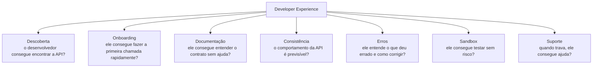

**Descoberta** — o desenvolvedor precisa saber que a API existe e entender rapidamente o que ela faz. A pergunta de qualidade: *um desenvolvedor que nunca ouviu falar desta API consegue entender seu propósito em menos de 60 segundos?*

**Onboarding** — o **Time-to-First-Call (TTFC)** captura toda a fricção do processo inicial: criação de conta, geração de credenciais, compreensão da autenticação, primeira requisição. APIs de referência chegam a TTFC de menos de 5 minutos.

**Documentação** — inclui: guias de início rápido orientados a casos de uso reais, exemplos de código em múltiplas linguagens, explicação dos modelos de dados com contexto de negócio, guias de troubleshooting. A pergunta de qualidade: *um desenvolvedor experiente consegue integrar sem abrir um ticket de suporte?*

**Consistência** — APIs inconsistentes são cognitivamente caras. Quando alguns endpoints usam `snake_case` e outros `camelCase`, o desenvolvedor precisa aprender múltiplos padrões. Cada inconsistência é um indicador de ausência de governança de style guide.

**Mensagens de erro** — uma mensagem de erro de qualidade tem: código de erro único e referenciável, descrição clara do que aconteceu, indicação do que fazer para resolver e link para documentação relevante. A mensagem `{"error": "invalid_request"}` é um exemplo clássico de DX ruim.

**Sandbox** — permite testar todos os fluxos — inclusive casos de erro e edge cases — sem impacto em produção e sem dados reais.

**Suporte** — inclui tempo de resposta, profundidade técnica das respostas, existência de fórum ou comunidade ativa. Em APIs públicas, o suporte da comunidade frequentemente supera o suporte oficial.

---

### 1.2.4.3 · DX dentro do ecossistema de métricas de produto

DX é uma dimensão relevante de produto — mas coexiste com outras dimensões igualmente importantes. O que apresentamos aqui são **dimensões e exemplos representativos**, não um framework universal. Cada organização, setor e modelo de negócio tem suas próprias variáveis e prioridades.

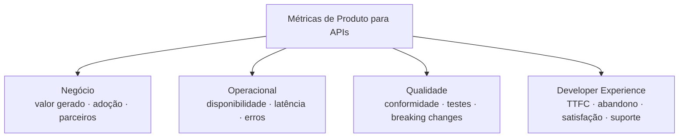

**Dimensão de negócio** — responde: *a API está gerando valor para o negócio?* Exemplos: número de consumidores ativos, volume de chamadas, receita direta ou indireta, número de parceiros integrados.

**Dimensão operacional** — responde: *a API está se comportando conforme o prometido?* Exemplos: disponibilidade, latência (p50, p95, p99), taxa de erros por categoria, MTTR de incidentes.

**Dimensão de qualidade** — responde: *a API está sendo construída com os padrões corretos?* Exemplos: conformidade com style guide, cobertura de testes de contrato, número de breaking changes não planejados.

**Dimensão de Developer Experience** — responde: *consumidores conseguem adotar e usar a API sem fricção desnecessária?* Exemplos: TTFC, taxa de abandono no onboarding, tickets de suporte por consumidor, DevSat.

> Nenhuma dessas dimensões é mais importante que as outras de forma universal. A composição certa depende do contexto — o que não é aceitável é ignorar qualquer dimensão sistematicamente.

---

### 1.2.4.4 · Métricas de DX — como medir o que parece subjetivo

**Time-to-First-Call (TTFC)**
Tempo entre o momento em que um novo desenvolvedor decide integrar a API e o momento em que faz sua primeira chamada com sucesso. Captura de forma objetiva toda a fricção do processo inicial. Uma redução de TTFC de 2 horas para 15 minutos é um dado concreto que justifica investimento.

**Taxa de abandono no onboarding**
Percentual de desenvolvedores que iniciam o processo de integração e não completam a primeira chamada com sucesso em um período definido. A análise de em qual etapa o abandono ocorre aponta onde está o problema.

**Volume de tickets de suporte por consumidor**
Número médio de tickets abertos por consumidor ativo em um período. Um volume alto indica DX ruim em alguma dimensão específica — a análise dos temas dos tickets aponta qual.

**Developer Satisfaction Score (DevSat)**
Equivalente ao NPS aplicado especificamente a desenvolvedores. Mede satisfação com a API, documentação, onboarding e suporte. A tendência ao longo do tempo é tão importante quanto o valor absoluto.

**Análise qualitativa — fóruns e comunidade**
Análise sistemática de fóruns, GitHub issues e Stack Overflow revela padrões de frustração que surveys não capturam — problemas recorrentes, workarounds que a comunidade desenvolveu, inconsistências que ninguém reportou formalmente mas todo mundo conhece.

---

### 1.2.4.5 · DX como vantagem competitiva — casos Stripe, Twilio e Nubank

#### Stripe — DX como fundação do negócio

**O problema que existia:** integrar pagamentos em 2010 levava dias ou semanas. SDKs complexos, documentação confusa, processo de aprovação manual. O TTFC típico era medido em dias.

**O que a Stripe fez especificamente:**
- Documentação com exemplos de código funcional em 8 linguagens, copiáveis diretamente
- Chaves de API disponíveis imediatamente após cadastro — sem processo de aprovação manual
- Ambiente de teste com cartões fictícios documentados para simular todos os cenários
- Mensagens de erro com explicação clara, código de referência único e link para documentação
- API consistente — os mesmos padrões de nomenclatura, paginação e resposta em todos os endpoints

**O resultado mensurável:** a Stripe chegou a uma avaliação de 95 bilhões de dólares em 2021 processando centenas de bilhões em transações anuais — em um mercado com concorrentes muito mais antigos e capitalizados. Desenvolvedores que adotaram Stripe cedo tornaram-se evangelistas, resistindo a migrações mesmo quando concorrentes ofereciam preços menores.

**O que a Stripe provou:** em um mercado commoditizado, DX superior é diferencial competitivo sustentável.

---

#### Twilio — DX como modelo de go-to-market

**O problema que existia:** integrar telecomunicações era historicamente complexo, caro e restrito a empresas com acordos diretos com operadoras. O mercado existia mas era inacessível para desenvolvedores individuais e startups.

**O que a Twilio fez especificamente:**
- Jeff Lawson definiu o desenvolvedor individual como cliente primário — não o CTO, não o gestor de compras
- "Ask your developer" tornou-se o slogan central — direcionando a decisão de compra para quem realmente integra
- TTFC demonstrado ao vivo em conferências — Jeff Lawson subia no palco e integrava Twilio em tempo real
- Precificação por uso sem mínimos — desenvolvedor podia experimentar gastando centavos
- Documentação orientada a casos de uso: "enviar um SMS de boas-vindas", "gravar uma chamada" — não apenas referência técnica

**O resultado mensurável:** a Twilio cresceu de zero para mais de 1 bilhão de dólares de receita anual com o modelo bottom-up — desenvolvedores adotavam individualmente, o uso crescia dentro das organizações, e então a Twilio expandia o contrato para uso enterprise.

**O que a Twilio provou:** DX pode ser o canal de go-to-market em si. Em vez de uma força de vendas tradicional, a Twilio investiu em fazer a experiência de adoção tão boa que o produto se vendia sozinho.

---

#### Nubank — DX em contexto regulado

**O problema que existia:** APIs no setor financeiro brasileiro eram desenvolvidas para conformidade regulatória, não para usabilidade. O resultado era APIs tecnicamente funcionais mas com DX pobre — documentação incompleta, onboarding burocrático, mensagens de erro genéricas.

**O que o Nubank fez especificamente:**
- Documentação técnica com o mesmo cuidado editorial aplicado à comunicação com clientes finais
- Processo de onboarding para parceiros com SLA definido e acompanhamento dedicado
- Sandbox completo com simulação de cenários regulatórios específicos do mercado brasileiro
- Engenheiros de developer relations dedicados — especialistas técnicos que falam a língua do desenvolvedor

**O resultado mensurável:** o Nubank tornou-se referência de DX no mercado financeiro brasileiro, acelerando a adoção de sua plataforma por fintechs e parceiros em um mercado onde a alternativa era integrar com APIs de bancos tradicionais com DX notoriamente ruim.

**O que o Nubank provou:** DX não é incompatível com compliance e regulação. A restrição regulatória define o que precisa ser feito — a DX define como isso é feito.

---

#### O padrão comum nos três casos

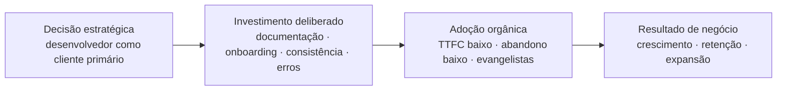

Nos três casos, DX não foi uma iniciativa isolada — foi uma **decisão estratégica de produto** que se traduziu em investimento consistente e gerou resultados de negócio mensuráveis.

> **DX como métrica de produto não é uma escolha filosófica — é uma decisão racional baseada em evidências de que a experiência do desenvolvedor tem impacto direto e mensurável nos resultados do negócio.**

---

## 1.2.5 · API como plataforma — o modelo de negócio

### 1.2.5.1 · Os três modelos de API por audiência

A primeira decisão estratégica sobre uma API não é técnica — é de negócio: **para quem ela existe?** Essa pergunta define tudo que vem depois — modelo de segurança, nível de documentação, processo de onboarding, SLA, estratégia de versionamento e modelo de monetização.

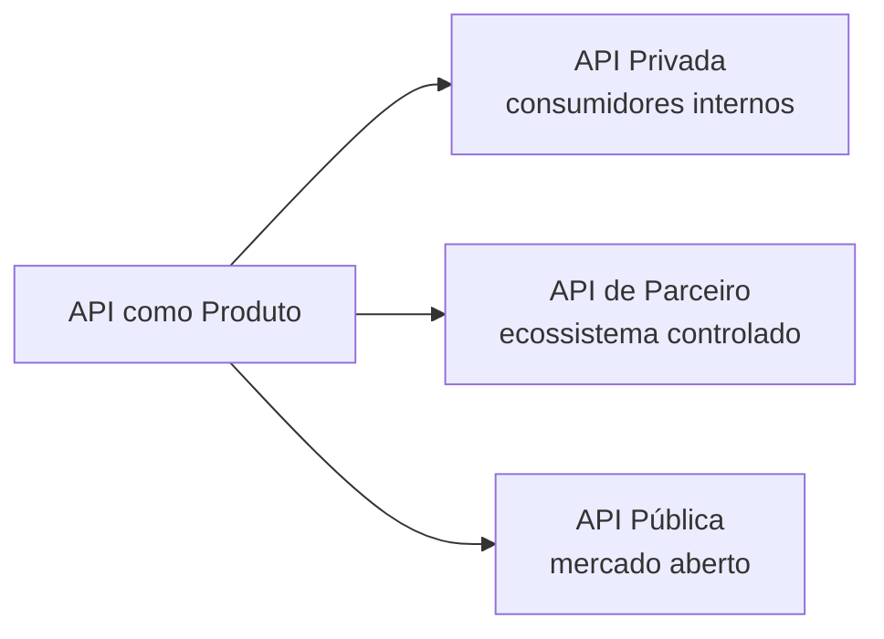

---

**API Privada**

Consumida exclusivamente por times internos. O fato de ser interna não reduz a necessidade de governança — times internos também sofrem com APIs inconsistentes, sem documentação e sem processo de evolução controlado.

Características de governança relevantes:
- Autenticação via tokens internos ou service accounts — obrigatória mesmo internamente
- SLA definido entre times produtores e consumidores
- Catálogo interno como mecanismo central de descoberta e reuso
- Processo de deprecation com comunicação entre times

O risco central: a complacência — a ausência de pressão de mercado pode criar a ilusão de que qualidade de DX e governança são opcionais.

---

**API de Parceiro**

Exposta a um conjunto controlado e conhecido de consumidores externos. Exige equilíbrio entre abertura e controle.

Características de governança relevantes:
- Contratos jurídicos de uso complementam o contrato técnico OpenAPI
- SLA diferenciado por nível de parceiro — basic, premium, enterprise
- Processo formal de change management — breaking changes com notificação contratualmente definida
- Monitoramento de uso por parceiro

O risco central: o acoplamento — quando um parceiro estratégico depende criticamente de uma API, a pressão para não fazer mudanças pode engessá-la.

---

**API Pública**

Disponível para qualquer desenvolvedor, com onboarding self-service. Maximiza o potencial de ecossistema — e também os riscos de segurança, abuso e inconsistência de uso.

Características de governança relevantes:
- Rate limiting e throttling obrigatórios
- Política de uso aceitável com enforcement automatizado
- Processo de deprecation com prazos generosos — consumidores desconhecidos não podem ser notificados individualmente
- Monitoramento de padrões de uso para detectar abuso

O risco central: a perda de controle sobre o ecossistema — consumidores constroem produtos críticos sobre a API, criando dependências que precisam ser honradas mesmo quando se quer evoluir.

---

**Os três modelos não são excludentes**

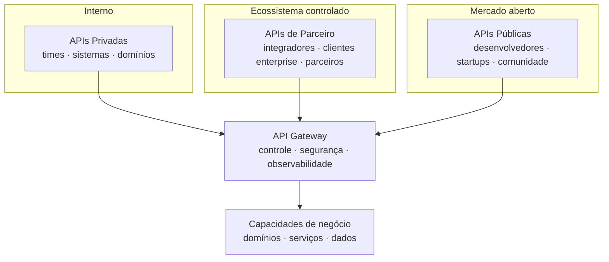

---

### 1.2.5.2 · Modelos de monetização de APIs

Monetização de APIs é o ponto onde a mentalidade de produto encontra o modelo de negócio de forma mais concreta. Existem cinco modelos fundamentais:

| Modelo | Lógica | Exemplos |
|---|---|---|
| **Pay-per-use** | Paga proporcionalmente ao uso — por chamada, volume ou transação | Twilio, AWS, Stripe |
| **Subscription tiers** | Assinatura com tiers (free, basic, pro, enterprise) | Maioria dos SaaS de APIs |
| **Freemium** | Camada gratuita com limites, camadas pagas para mais | Estratégia de aquisição antes de monetização |
| **Revenue share** | Percentual da receita gerada pelo consumidor usando a API | Marketplaces, plataformas de pagamento |
| **Indirect monetization** | API não gera receita direta — habilita o modelo de negócio principal | APIs internas, habilitação de compliance |

A escolha do modelo não é apenas financeira — ela define o perfil de consumidor que a API vai atrair, o nível de DX necessário e a estratégia de governança adequada.

> Os modelos de monetização serão aprofundados no **Módulo 6**, onde exploraremos como organizações em diferentes estágios de maturidade constroem e evoluem suas estratégias de monetização de APIs.

---

### 1.2.5.3 · Efeitos de rede e a lógica de plataforma

No 1.2.0, vimos que produtos de plataforma se diferenciam porque o valor cresce com o número de participantes. O efeito de rede mais relevante para APIs é o **efeito de rede indireto** — o valor da API cresce porque o ecossistema construído sobre ela se torna mais rico e diverso.

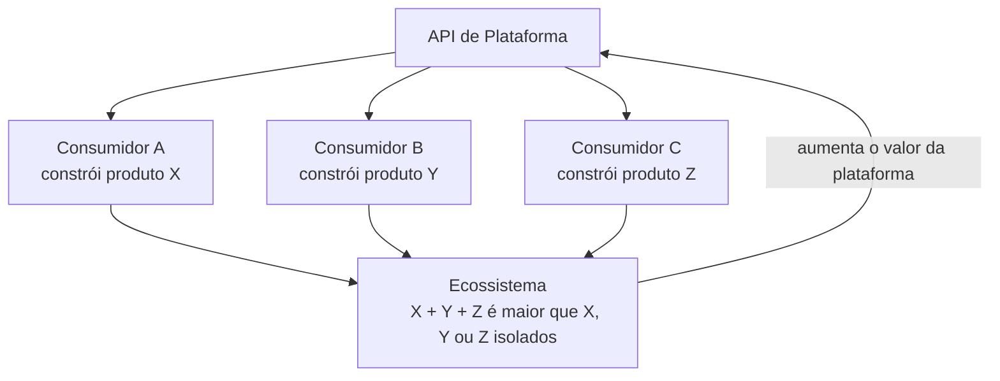

Quanto mais produtos e integrações são construídos sobre uma API, maior o valor percebido da plataforma — mais desenvolvedores querem integrar, mais difícil fica para um consumidor migrar porque perderia acesso ao ecossistema inteiro.

**As implicações de governança dos efeitos de rede**

Quando uma organização opera uma plataforma com ecossistema ativo, decisões de governança afetam não apenas consumidores diretos — afetam todos os produtos construídos sobre a plataforma e, por extensão, os usuários finais desses produtos.

Uma breaking change não comunicada adequadamente pode quebrar simultaneamente dezenas de produtos de terceiros e afetar milhões de usuários finais que nunca ouviram falar da API em questão. Isso explica por que plataformas maduras têm processos de deprecation extremamente conservadores — não é gentileza, é reconhecimento de que o ecossistema é um ativo estratégico.

---

### 1.2.5.4 · API Economy — o ecossistema como produto

No Capítulo 1.1, vimos como a API Economy emergiu historicamente. Partindo desse contexto, podemos examinar o que significa **operar dentro de uma API Economy** do ponto de vista estratégico e de governança.

A API Economy descreve um modelo onde capacidades de negócio são expostas, consumidas e combinadas via APIs de forma que cria valor além do que qualquer participante isolado conseguiria criar. É uma economia de especialização e recombinação.

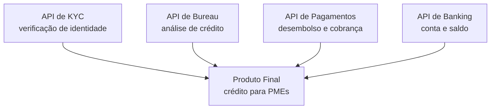

**O que isso significa para governança**

Operar dentro de uma API Economy muda a perspectiva de governança de duas formas fundamentais:

Primeiro, sua API faz parte de cadeias de valor onde outros produtos dependem dela. Decisões de evolução e depreciação têm consequências que se propagam pela cadeia. Governança responsável considera essa propagação.

Segundo, você também é consumidor de APIs de terceiros — e a qualidade da governança desses fornecedores afeta sua capacidade de honrar seus próprios SLAs. Gestão de dependências externas e planos de contingência para indisponibilidade de APIs terceiras são dimensões de governança que emergem especificamente do contexto de API Economy.

> As implicações organizacionais e de maturidade da participação em uma API Economy serão exploradas em profundidade no **Módulo 6**.

---

## Síntese do Capítulo 1.2

O Capítulo 1.2 construiu um argumento progressivo sobre o que significa tratar APIs como produto:

Começamos definindo rigorosamente o conceito de produto — com suas múltiplas visões e suas implicações específicas para o universo digital e de plataformas. Estabelecemos que tratar uma API como produto não é uma metáfora — é uma mudança de mentalidade com consequências concretas.

Vimos como o API-first emerge como decisão estratégica — não apenas como boa prática de arquitetura, mas como mecanismo de construção de ativos que se tornam vantagens competitivas sustentáveis.

Definimos os papéis de API Product Manager e API Product Owner — com suas responsabilidades distintas e complementares — e mostramos o que acontece quando esses papéis não existem.

Exploramos como os ciclos de vida técnico e de produto operam simultaneamente e precisam ser gerenciados de forma integrada, com governança específica para cada fase.

Analisamos Developer Experience como dimensão estratégica de produto — mensurável, com impacto direto em resultados de negócio — dentro de um ecossistema mais amplo de métricas.

E fechamos com o modelo de negócio — os três tipos de API por audiência, os modelos de monetização, a lógica de plataforma e o que significa operar dentro de uma API Economy.

> **Uma API tratada como produto tem dono, tem consumidores identificados, tem valor mensurável, tem ciclo de vida gerenciado, tem experiência projetada e tem modelo de negócio claro. Governança de APIs não é burocracia imposta sobre esse produto — é o conjunto de práticas que garante que ele seja construído, operado e evoluído de forma consistente, segura e alinhada ao negócio.**

---

## Pontos-chave do capítulo

- Produto é um conceito com múltiplas camadas — central, real e ampliado — e todas se aplicam ao universo de APIs
- API-first é uma decisão estratégica de negócio, não apenas uma boa prática de arquitetura — o Bezos API Mandate e o modelo Salesforce são as evidências mais concretas disso
- API PM e API PO são papéis distintos e complementares — a ausência de qualquer um deles tem consequências diretas na qualidade e na governança da API
- O ciclo de vida técnico e o ciclo de vida do produto operam simultaneamente e precisam ser gerenciados de forma integrada
- Developer Experience é mensurável e tem impacto direto em resultados de negócio — mas coexiste com dimensões igualmente importantes de negócio, operacional e qualidade
- Os três modelos de API por audiência — privada, parceiro e pública — têm estratégias, riscos e implicações de governança distintas
- Efeitos de rede em APIs de plataforma criam responsabilidades de governança que vão além dos consumidores diretos

---

## Próximo capítulo

**1.3 · Governança de API — Conceitos** — conceitos básicos de governança e a conexão com a estratégia de API.

---

*Série: Gerenciamento e Governança de APIs · Módulo 1 · Capítulo 1.2*