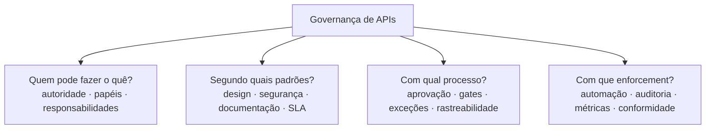
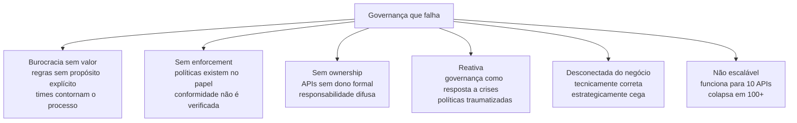
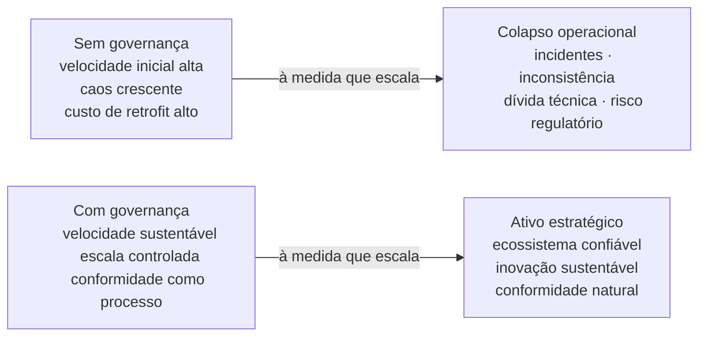

# Módulo 1 · Fundamentos
## Capítulo 1.3 · Governança de API — Conceitos

> **Série:** Gerenciamento e Governança de APIs  
> **Nível:** Fundamentos  
> **Pré-requisito:** Capítulo 1.2 · API como produto: a mudança de mentalidade

---

## Sumário

- [1.3.1 · O que é governança — a origem do conceito](#131--o-que-é-governança--a-origem-do-conceito)
- [1.3.2 · Governança corporativa e governança de TI](#132--governança-corporativa-e-governança-de-ti)
- [1.3.3 · Governança de APIs — o que é especificamente](#133--governança-de-apis--o-que-é-especificamente)
- [1.3.4 · Por que governança de APIs falha](#134--por-que-governança-de-apis-falha)
- [1.3.5 · Governança como habilitadora — não como obstáculo](#135--governança-como-habilitadora--não-como-obstáculo)

---

## 1.3.1 · O que é governança — a origem do conceito

Governança é uma palavra antiga. Muito mais antiga do que TI, APIs ou software. Sua raiz está no grego *kubernetes* — aquele que conduz o navio, o timoneiro. Da mesma raiz etimológica vem *governo*, *governar* e, curiosamente, *cibernética* — a ciência do controle e da comunicação em sistemas complexos.

Essa origem não é trivia histórica. Ela revela a essência do conceito: **governança é o mecanismo pelo qual sistemas complexos são conduzidos de forma intencional** — não deixados à deriva.

Na teoria política clássica, governança descreve como sociedades estabelecem regras de convivência, distribuem poder, tomam decisões coletivas e garantem que essas decisões sejam cumpridas e que haja responsabilização quando não são. Três elementos são sempre centrais, independente do contexto:

**Autoridade** — quem tem o poder de decidir, definir regras e estabelecer direção.

**Accountability** — quem responde pelas consequências das decisões, sejam elas boas ou ruins.

**Enforcement** — como as regras são aplicadas na prática, não apenas declaradas no papel.

Esses três elementos — autoridade, accountability e enforcement — são o núcleo de qualquer sistema de governança funcional. Quando um deles está ausente ou fraco, o sistema de governança falha. E como veremos no 1.3.4, a maioria das falhas de governança de APIs pode ser rastreada à ausência ou fragilidade de um desses três elementos.

---

## 1.3.2 · Governança corporativa e governança de TI

O conceito de governança migrou da teoria política para o mundo corporativo de forma gradual ao longo do século XX. Dois eventos aceleraram esse processo de forma significativa.

O primeiro foi uma série de escândalos corporativos nos Estados Unidos no início dos anos 2000 — Enron, WorldCom, Tyco — que revelaram como a ausência de controles formais e accountability permitia que decisões destrutivas fossem tomadas sem supervisão adequada. A resposta legislativa foi o **Sarbanes-Oxley Act (SOX) de 2002**, que estabeleceu exigências formais de controle interno, auditoria e responsabilização executiva para empresas de capital aberto. SOX não era sobre TI — mas como TI sustentava os processos financeiros auditados, criou pressão imediata para que a gestão de sistemas de informação fosse formalizada.

O segundo foi o crescimento exponencial da dependência organizacional de tecnologia, que tornou evidente que decisões de TI tinham impacto estratégico e de risco comparável a decisões financeiras — e precisavam de governança equivalente.

Nesse contexto emergiram os primeiros frameworks formais de governança de TI:

O **COBIT (Control Objectives for Information and Related Technologies)**, mantido pela ISACA, define um framework de governança e gestão de TI corporativa. Sua premissa central é que TI precisa ser governada como qualquer outro ativo estratégico — com objetivos claros, processos definidos, métricas de desempenho e mecanismos de controle.

A **ISO/IEC 38500**, publicada em 2008, é o padrão internacional para governança de TI corporativa. Define seis princípios fundamentais — responsabilidade, estratégia, aquisição, desempenho, conformidade e comportamento humano — que se aplicam a qualquer decisão de TI em qualquer organização.

O que esses frameworks estabeleceram, e que é diretamente relevante para APIs, é que **tecnologia não pode ser governada apenas por quem a constrói** — precisa de estrutura que conecte decisões técnicas a responsabilidades de negócio, risco e conformidade.

> COBIT e ISO/IEC 38500 serão explorados com maior profundidade no **Módulo 7 · Ferramentas & Padrões**, no contexto dos frameworks de referência para governança de TI.

---

## 1.3.3 · Governança de APIs — o que é especificamente

Com a base conceitual estabelecida, podemos definir governança de APIs com precisão:

> **Governança de APIs é o conjunto de políticas, processos, papéis e controles que definem como APIs são criadas, publicadas, consumidas, evoluídas e retiradas — garantindo consistência, segurança, conformidade e alinhamento estratégico ao longo de todo o ciclo de vida.**

Essa definição tem quatro perguntas fundamentais que toda estrutura de governança precisa responder:

**Quem pode fazer o quê?**
Quem tem autoridade para criar uma nova API? Quem aprova mudanças que afetam consumidores existentes? Quem pode definir exceções às políticas padrão? Quem responde quando uma API falha? Sem respostas claras para essas perguntas, a governança existe no papel mas não na prática.

**Segundo quais padrões?**
Quais são os padrões de design que toda API deve seguir? Quais são as políticas de segurança obrigatórias? Qual é o formato de documentação exigido? Quais são os SLAs mínimos aceitáveis? Padrões sem enforcement são sugestões — não governança.

**Com qual processo de aprovação?**
Como uma nova API passa de ideia para produção? Quais gates de qualidade e segurança são obrigatórios? Como mudanças são avaliadas e aprovadas? Como exceções são tratadas? Processo sem rastreabilidade é invisível — não governável.

**Com que nível de enforcement?**
Como sabemos que as políticas estão sendo seguidas? Como detectamos desvios? Como auditamos o histórico de mudanças? Em setores regulados, rastreabilidade não é opcional — é obrigação legal.

---

### O que governança de APIs não é

É igualmente importante definir o que governança não é — porque confusões sobre isso são frequentes e custosas.

Governança **não é** um time central que aprova tudo. Esse modelo — frequentemente chamado de "API police" — cria gargalos, ressentimento e contornamentos criativos. Times aprendem a pedir permissão apenas quando conveniente.

Governança **não é** um conjunto de documentos que ninguém lê. Políticas que existem apenas em wikis corporativos sem mecanismo de enforcement têm valor próximo de zero — e criam falsa sensação de segurança para os gestores.

Governança **não é** exclusivamente sobre segurança. Segurança é uma dimensão crítica, mas governança cobre qualidade, consistência, experiência do consumidor, alinhamento estratégico e conformidade regulatória — um escopo muito mais amplo.

Governança **não é** estática. O ambiente de APIs muda — novas tecnologias, novos regulamentos, novos modelos de negócio. Governança efetiva evolui com esse ambiente.

---

## 1.3.4 · Por que governança de APIs falha

Estudar o fracasso é tão importante quanto estudar o sucesso — talvez mais, porque os anti-padrões são muito mais comuns do que as boas práticas. Esta seção combina análise dos anti-padrões mais recorrentes com casos documentados publicamente que ilustram suas consequências reais.

---

### Anti-padrão 1 — Governança como burocracia sem valor percebido

O anti-padrão mais comum. A governança existe, mas é percebida pelos times de desenvolvimento como obstáculo — um conjunto de formulários, aprovações e revisões que atrasa entregas sem benefício claro.

Quando isso acontece, a reação natural dos times é contornar o processo. APIs são criadas informalmente, documentação é mínima, mudanças são feitas sem notificação. A governança formal existe no papel; a governança real não existe em lugar nenhum.

A raiz desse anti-padrão é quase sempre a mesma: **governança desconectada do valor**. Quando as regras não explicam por que existem — qual problema resolvem, qual risco mitigam — elas parecem arbitrárias. E regras arbitrárias são ignoradas.

A solução não é menos governança — é governança com propósito explícito e processo proporcional ao risco. Uma API interna de baixo impacto não precisa do mesmo processo de aprovação que uma API pública financeira.

---

### Anti-padrão 2 — Governança sem enforcement

Políticas existem, style guides foram escritos, processo de aprovação foi definido. Mas ninguém verifica se estão sendo seguidos. Não há automação de lint de spec, não há gates no pipeline de CI/CD, não há auditoria periódica.

O resultado é um portfólio de APIs onde cada time seguiu — ou não — as políticas conforme sua própria disposição. A inconsistência se acumula silenciosamente até se tornar dívida técnica e operacional intratável.

O **Postman State of the API Report 2023** documentou que apenas 20% das organizações pesquisadas tinham processos automatizados de validação de conformidade de APIs com políticas internas — o que significa que 80% dependiam de verificação manual, esporádica ou inexistente.

> *Fonte: Postman, "State of the API Report 2023". Disponível em: postman.com/state-of-api*

---

### Anti-padrão 3 — Governança sem ownership claro

APIs existem, são consumidas, geram problemas — mas não têm um dono formal. Quando algo quebra, o ticket circula entre times. Quando precisa evoluir, ninguém tem autoridade para decidir. Quando um consumidor reclama, a reclamação se perde.

Esse anti-padrão é especialmente perigoso porque é invisível até que algo grave aconteça. APIs sem dono são ativos não gerenciados — e ativos não gerenciados são riscos não mensurados.

**Caso documentado — Peloton API exposure (2021)**

Em maio de 2021, o pesquisador de segurança Jan Masters identificou que a API da Peloton expunha dados privados de usuários — incluindo idade, peso, localização e informações de treino — sem qualquer autenticação. Qualquer requisição não autenticada para o endpoint `/api/ride/{id}/details` retornava dados de usuários que haviam configurado suas contas como privadas.

O problema foi reportado à Peloton em janeiro de 2021. A empresa levou mais de 90 dias para corrigir completamente a vulnerabilidade — tempo durante o qual os dados de mais de 4 milhões de usuários permaneceram expostos. A investigação posterior revelou ausência de processo formal de security review para APIs e ownership difuso de segurança entre times.

> *Fontes: Zweerink, J. "Peloton's Leaky API." Pen Test Partners, maio 2021. Disponível em: pentestpartners.com. Cobertura adicional: Coble, S. "Peloton Exposed Private User Data." Infosecurity Magazine, maio 2021.*

---

### Anti-padrão 4 — Governança reativa, não proativa

A organização só pensa em governança depois que algo dá errado. Um incidente de segurança gera uma política de segurança. Uma API quebra um parceiro sem aviso e gera um processo de change management. Uma auditoria regulatória gera documentação retroativa.

Governança reativa é sempre mais cara do que governança proativa — porque o custo do problema já foi pago quando a política é criada. E frequentemente cria políticas traumatizadas: excessivamente rígidas em resposta ao incidente específico, sem considerar o contexto mais amplo.

**Caso documentado — Twitter API vulnerability (2021–2022)**

Entre junho de 2021 e janeiro de 2022, uma vulnerabilidade na API do Twitter permitiu que atores maliciosos submetessem endereços de e-mail e números de telefone para verificar se estavam associados a contas do Twitter — e, em caso positivo, obter o ID da conta correspondente. Isso permitiu a criação de um banco de dados associando dados pessoais a identidades do Twitter, afetando aproximadamente 5,4 milhões de contas.

A vulnerabilidade havia sido introduzida em uma atualização de código em junho de 2021 e não foi detectada pelos processos de segurança existentes. O Twitter foi notificado por meio de seu programa de bug bounty em janeiro de 2022 e corrigiu a vulnerabilidade — mas o banco de dados já havia sido compilado e foi posteriormente disponibilizado publicamente.

A ausência de testes de segurança automatizados no pipeline de API e de revisão proativa de autorização foram identificados como fatores contribuintes.

> *Fonte: Twitter, Inc. "Disclosing a bug that affected approximately 5.4 million Twitter accounts." Blog oficial do Twitter, agosto 2022. Disponível em: blog.twitter.com*

---

### Anti-padrão 5 — Governança desconectada do negócio

A governança existe e funciona tecnicamente — mas opera em isolamento do negócio. Políticas são definidas por arquitetos sem input de produto. SLAs são estabelecidos sem consulta aos consumidores. Processos de deprecation ignoram o impacto em parceiros estratégicos.

O resultado é uma governança tecnicamente correta mas estrategicamente cega — que protege a consistência técnica mas falha em proteger o valor de negócio.

O **Gartner** estimou em relatório de 2022 que até 2025, menos de 50% das APIs empresariais seriam gerenciadas com visibilidade adequada de seu impacto de negócio — criando riscos significativos de decisões técnicas com consequências estratégicas não antecipadas.

> *Fonte: Gartner, "API Strategy Maturity Model", 2022. Disponível para clientes Gartner em gartner.com*

---

### Anti-padrão 6 — Governança que não escala

A organização começa pequena, com um processo manual de revisão que funciona bem para 10 APIs. Quando chega a 100, o processo começa a criar gargalos. Quando chega a 500, colapsou completamente — ou foi abandonado silenciosamente.

Governança que não foi projetada para escalar é uma governança com data de validade. E frequentemente o colapso acontece exatamente no momento em que a organização mais precisa dela — quando está crescendo rapidamente e o risco de inconsistência e incidentes é maior.

O **Salt Security API Security Report 2023** documentou que 94% das organizações pesquisadas enfrentaram problemas de segurança em APIs em produção no ano anterior — e que a complexidade crescente dos portfólios de APIs era o principal fator citado para a dificuldade de manter visibilidade e controle.

> *Fonte: Salt Security, "State of API Security Report Q1 2023". Disponível em: salt.security*

---

### Síntese dos anti-padrões

---

## 1.3.5 · Governança como habilitadora — não como obstáculo

Após examinar por que governança falha, é necessário fazer o argumento positivo com a mesma força. Governança de APIs não é um mal necessário — é uma **condição para escala sustentável**.

A analogia mais útil vem do urbanismo. Uma cidade sem regras de zoning, sem códigos de construção, sem regulação de tráfego pode crescer rapidamente no curto prazo. Cada construtor faz o que quer, onde quer, como quer. A velocidade inicial é alta.

Mas à medida que a cidade cresce, a ausência de governança se torna um freio. Construções incompatíveis criam conflitos. Infraestrutura subdimensionada colapsa. O custo de retrofit — consertar o que foi feito errado — supera em muito o custo que a governança teria gerado desde o início.

APIs em organizações sem governança seguem exatamente o mesmo padrão.

---

### O que governança bem feita habilita

**Velocidade sustentável** — times não precisam reinventar padrões a cada nova API. Style guides, templates e processos claros reduzem o tempo de decisão e aumentam a velocidade de entrega. Paradoxalmente, boa governança acelera — não freia.

**Confiança para inovar** — quando times sabem que há mecanismos de controle funcionando, têm mais confiança para experimentar. A governança é a rede de segurança que torna a inovação menos arriscada.

**Escala sem caos** — portfólios de centenas de APIs permanecem gerenciáveis quando há catálogo, padrões e ownership claros. Sem isso, cada nova API adiciona complexidade de forma não linear.

**Conformidade como consequência** — organizações com governança madura de APIs descobrem que conformidade regulatória (LGPD, BACEN, PSD2) é uma consequência natural do processo — não uma corrida de última hora antes de uma auditoria.

**Ecossistema confiável** — parceiros e consumidores externos constroem sobre APIs governadas com mais confiança. Changelog público, processo de deprecation comunicado e SLA documentado são sinais de confiabilidade que influenciam diretamente a adoção.

> **A governança de APIs não é sobre controlar o que os times fazem — é sobre criar as condições para que times diferentes, em contextos diferentes, tomem boas decisões de forma consistente e responsável. É infraestrutura organizacional, não burocracia.**

---

## Pontos-chave do capítulo

- Governança tem raízes na teoria política clássica — autoridade, accountability e enforcement são seus três elementos universais. A ausência de qualquer um deles compromete todo o sistema
- Frameworks como COBIT e ISO/IEC 38500 estabeleceram que tecnologia precisa ser governada com a mesma seriedade que outros ativos estratégicos corporativos
- Governança de APIs responde a quatro perguntas fundamentais: quem pode fazer o quê, segundo quais padrões, com qual processo e com que enforcement
- A maioria das falhas de governança não é técnica — é organizacional: falta de ownership, falta de enforcement, desconexão com o negócio e incapacidade de escalar
- Casos documentados como Peloton (2021) e Twitter (2021–2022) demonstram que ausência de governança tem custo mensurável em dados expostos, reputação e tempo de resposta
- Governança bem feita é habilitadora — cria velocidade sustentável, confiança para inovar e conformidade como consequência natural do processo

---

## Próximo capítulo

**1.4 · Diferença entre Gerenciamento e Governança** — com o conceito de governança estabelecido, examinamos a distinção precisa entre gerenciar e governar APIs — dois planos complementares que frequentemente são confundidos.

---

*Série: Gerenciamento e Governança de APIs · Módulo 1 · Capítulo 1.3*