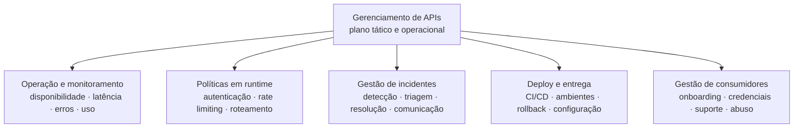
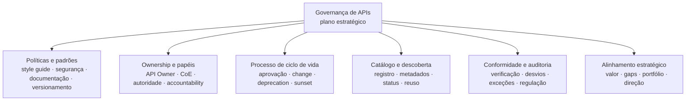
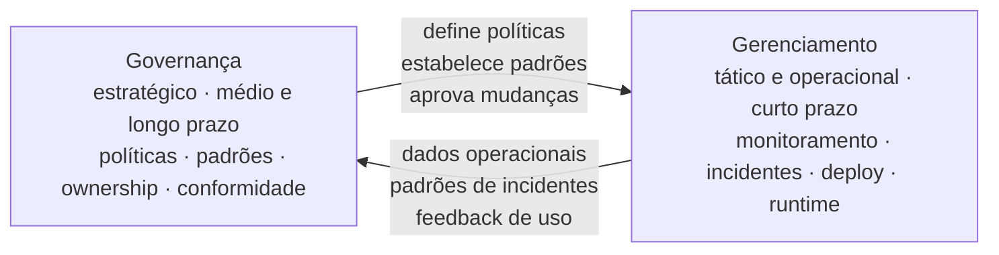
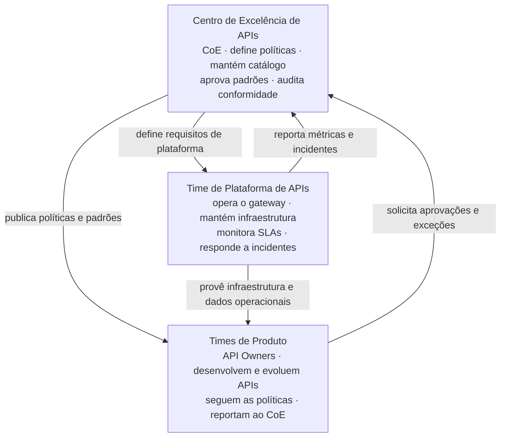

# Módulo 1 · Fundamentos
## Capítulo 1.4 · Diferença entre Gerenciamento e Governança

> **Série:** Gerenciamento e Governança de APIs  
> **Nível:** Fundamentos  
> **Pré-requisito:** Capítulo 1.3 · Governança de API — Conceitos

---

## Sumário

- [1.4.1 · A confusão mais comum — e por que ela importa](#141--a-confusão-mais-comum--e-por-que-ela-importa)
- [1.4.2 · Gerenciamento de APIs — o plano tático e operacional](#142--gerenciamento-de-apis--o-plano-tático-e-operacional)
- [1.4.3 · Governança de APIs — o plano estratégico](#143--governança-de-apis--o-plano-estratégico)
- [1.4.4 · Como os dois planos se complementam](#144--como-os-dois-planos-se-complementam)
- [1.4.5 · Implicações práticas — estrutura, papéis e ferramentas](#145--implicações-práticas--estrutura-papéis-e-ferramentas)

---

## 1.4.1 · A confusão mais comum — e por que ela importa

Em muitas organizações, quando alguém diz *"precisamos melhorar nossa governança de APIs"*, o que está sendo pedido na prática é um API Gateway melhor, dashboards de monitoramento mais completos ou um processo de deploy mais robusto. Isso não é governança — é gerenciamento.

A confusão é compreensível. Os dois conceitos coexistem no mesmo espaço, envolvem as mesmas APIs e frequentemente são responsabilidade das mesmas pessoas. Mas operam em planos fundamentalmente diferentes — e tratá-los como sinônimos cria problemas organizacionais que nenhum dos dois consegue resolver sozinho.

Quando uma organização investe apenas em gerenciamento achando que está fazendo governança, o resultado típico é: excelente visibilidade operacional de APIs que foram projetadas de formas inconsistentes, sem padrões, sem ownership claro e sem alinhamento estratégico. Você sabe exatamente como suas APIs estão falhando — mas não tem os mecanismos para garantir que serão construídas melhor da próxima vez.

Quando investe apenas em governança achando que isso cobre o operacional, o resultado é: políticas bem definidas e padrões claros aplicados a APIs que ninguém monitora, cujos SLAs não são medidos e cujos incidentes demoram horas para ser detectados. Você sabe como as APIs deveriam ser — mas não sabe como elas estão se comportando agora.

Os dois fracassos têm a mesma raiz: **a ausência de consciência de que são planos distintos que precisam de investimento e estrutura independentes**.

> *Governar é estratégico. Gerenciar é tático e operacional. Os dois são indispensáveis — confundi-los é garantia de disfunção.*

---

## 1.4.2 · Gerenciamento de APIs — o plano tático e operacional

Gerenciar APIs é garantir que elas funcionem conforme o prometido — agora, hoje, neste momento. O horizonte do gerenciamento é o presente e o curto prazo. Suas perguntas centrais são:

- *As APIs estão disponíveis e respondendo dentro do SLA?*
- *Há anomalias de tráfego, erros ou degradação de performance?*
- *As políticas de rate limiting e autenticação estão sendo aplicadas?*
- *Como está a saúde do pipeline de deploy?*
- *Quem está sendo impactado por este incidente agora?*

O gerenciamento opera sobre fatos concretos e mensuráveis no presente. É inerentemente reativo em sua dimensão operacional — responde ao que está acontecendo — e proativo em sua dimensão tática — antecipa problemas antes que afetem consumidores.

---

### As responsabilidades do gerenciamento

**Operação e monitoramento** — acompanhamento contínuo de disponibilidade, latência, taxa de erros e uso por consumidor. Alertas configurados para desvios de SLA. Dashboards operacionais que dão visibilidade em tempo real do estado do portfólio de APIs.

**Controle de acesso e políticas em runtime** — aplicação das políticas definidas pela governança: autenticação, autorização, rate limiting, throttling, CORS, transformação de payload. O gerenciamento não define essas políticas — executa as que foram definidas.

**Gestão de incidentes** — detecção, triagem, escalação e resolução de falhas. Comunicação com consumidores afetados. Registro de incidentes para análise posterior. Essa responsabilidade conecta diretamente com o ITIL Incident Management que exploraremos no Módulo 4.

**Deploy e ciclo de entrega** — gerenciamento do pipeline de CI/CD para APIs, promoção entre ambientes (dev, staging, produção), rollback em caso de falha, gestão de configuração de gateway.

**Gestão de consumidores** — onboarding de novos consumidores, gestão de credenciais, suporte técnico operacional, monitoramento de uso por consumidor para detecção de abuso ou anomalias.

---

### O horizonte do gerenciamento

O gerenciamento opera em três horizontes temporais simultâneos:

| Horizonte | Período | Exemplos de decisão |
|---|---|---|
| **Imediato** | Minutos a horas | Resposta a incidentes, alertas de SLA, anomalias de tráfego |
| **Curto prazo** | Dias a semanas | Análise de tendências, planejamento de capacidade, onboarding |
| **Médio prazo** | Semanas a meses | Revisão de SLAs, otimização de performance, análise de incidentes |

---

## 1.4.3 · Governança de APIs — o plano estratégico

Governar APIs é garantir que elas são construídas, evoluídas e retiradas de forma consistente, segura e alinhada ao negócio — ao longo do tempo, em escala, por múltiplos times. O horizonte da governança é o médio e longo prazo. Suas perguntas centrais são:

- *Quais padrões todas as APIs devem seguir?*
- *Como garantimos que novas APIs são consistentes com as existentes?*
- *Quem tem autoridade para aprovar mudanças que afetam consumidores?*
- *Como estamos alinhados com os requisitos regulatórios?*
- *Nosso portfólio de APIs está evoluindo na direção estratégica correta?*

A governança opera sobre decisões estruturais e políticas. É inerentemente proativa — define as regras do jogo antes que o jogo comece — e estratégica — conecta decisões técnicas a objetivos de negócio e gestão de risco.

---

### As responsabilidades da governança

**Definição de políticas e padrões** — o style guide de APIs, as políticas de segurança obrigatórias, os padrões de documentação, as regras de versionamento e deprecation. A governança define o que deve ser — o gerenciamento executa.

**Estrutura de ownership e papéis** — quem é o API Owner de cada API, quais são as responsabilidades de cada papel, como o Centro de Excelência (CoE) opera, quais decisões são centralizadas e quais são federadas.

**Processo de ciclo de vida** — como uma API é aprovada para criação, como mudanças são avaliadas e aprovadas, como depreciações são conduzidas. O processo de Change Enablement que estudaremos no Módulo 4 vive aqui.

**Catálogo e descoberta** — o registro central de todas as APIs da organização, com metadados de negócio e técnicos, status de ciclo de vida e informações de ownership. A governança garante que o catálogo existe e é mantido atualizado.

**Conformidade e auditoria** — verificação periódica de que as políticas estão sendo seguidas, identificação de desvios, gestão de exceções formais. Em setores regulados, isso inclui evidências de conformidade para auditores externos.

**Alinhamento estratégico** — revisão periódica do portfólio de APIs com a perspectiva de negócio: quais APIs estão gerando valor, quais estão obsoletas, quais gaps existem, como o portfólio evolui em direção à estratégia digital da organização.

---

### O horizonte da governança

| Horizonte | Período | Exemplos de decisão |
|---|---|---|
| **Médio prazo** | Meses | Revisão de políticas, avaliação de conformidade, gestão de depreciações |
| **Longo prazo** | Trimestres a anos | Estratégia de APIs, modelos organizacionais, requisitos regulatórios |
| **Estrutural** | Contínuo | Manutenção do catálogo, enforcement de padrões, programa de APIs |

---

## 1.4.4 · Como os dois planos se complementam

Gerenciamento e governança não são concorrentes — são complementares. Cada um depende do outro para ser efetivo.

**Governança alimenta o gerenciamento** — as políticas definidas pela governança são o que o gerenciamento executa em runtime. Os padrões de SLA definidos pela governança são o que o monitoramento verifica. O processo de change aprovado pela governança é o que o pipeline de deploy implementa. Sem governança, o gerenciamento opera sem direção — eficiente na execução, mas sem clareza sobre o que deve ser executado.

**Gerenciamento alimenta a governança** — os dados operacionais do gerenciamento são o feedback que a governança precisa para evoluir. Padrões de incidentes revelam gaps nas políticas. Métricas de uso revelam APIs que deveriam ser depreciadas. Análise de tickets de suporte revela problemas de DX que o style guide não está prevenindo. Sem gerenciamento, a governança opera sem realidade — estratégica nas intenções, mas desconectada do que está acontecendo na prática.

---

### A disfunção quando um plano está ausente

| Situação | Sintoma | Consequência |
|---|---|---|
| **Gerenciamento sem governança** | APIs funcionando operacionalmente, mas inconsistentes e sem ownership | Dívida técnica, risco regulatório, impossibilidade de escalar |
| **Governança sem gerenciamento** | Políticas bem definidas, mas sem visibilidade operacional | Políticas ignoradas, incidentes não detectados, SLAs não medidos |
| **Nenhum dos dois** | Caos operacional e estratégico | Portfólio ingerenciável, risco alto, custo de retrofit enorme |
| **Os dois integrados** | Operação confiável orientada por políticas claras | Escala sustentável, conformidade natural, ecossistema confiável |

---

## 1.4.5 · Implicações práticas — estrutura, papéis e ferramentas

A distinção entre governança e gerenciamento não é apenas conceitual — tem implicações diretas em como organizações estruturam times, definem papéis e escolhem ferramentas.

---

### Estrutura organizacional

Em organizações maduras, os dois planos têm estruturas distintas com pontos de conexão formais:

O **CoE** é o órgão de governança — estratégico, normativo, com visão de portfólio. O **Time de Plataforma** é o órgão de gerenciamento de infraestrutura — operacional, técnico, com foco em confiabilidade. Os **Times de Produto** são os executores — desenvolvem APIs dentro das políticas do CoE, usando a plataforma do time de plataforma.

> O modelo de trabalho do CoE — como ele se estrutura, toma decisões, publica políticas e evolui ao longo do tempo — é explorado em profundidade no **Capítulo 3.3 · O Centro de Excelência de APIs — modelo de trabalho**.

---

### Papéis por plano

| Papel | Plano | Responsabilidade principal |
|---|---|---|
| API Governance Lead | Governança | Define e evolui o framework de governança |
| API Product Manager | Governança + Produto | Visão estratégica da API, alinhamento com negócio |
| API Steward / Architect | Governança | Curadoria de padrões, revisão de design, conformidade |
| Platform Engineer | Gerenciamento | Opera gateway, infraestrutura, CI/CD de APIs |
| API Product Owner | Produto + Gerenciamento | Backlog, contrato, conformidade tática |
| SRE / Operations | Gerenciamento | Monitoramento, resposta a incidentes, SLA |

---

### Ferramentas por plano

As ferramentas de gerenciamento e governança têm focos distintos — e é comum organizações investirem pesadamente em ferramentas de gerenciamento sem ter as ferramentas de governança correspondentes.

| Categoria | Gerenciamento | Governança |
|---|---|---|
| **Core** | API Gateway (Kong, Apigee, AWS API GW) | API Registry / Catálogo (Backstage, Apicurio) |
| **Qualidade** | Testes funcionais (Postman, Bruno) | Lint de spec (Spectral), testes de contrato (Pact) |
| **Observabilidade** | APM, logs, traces (Datadog, Grafana) | Métricas de conformidade, relatórios de auditoria |
| **Processo** | Pipeline CI/CD (GitHub Actions, Jenkins) | Workflow de aprovação, gestão de mudanças |
| **Documentação** | Portal do desenvolvedor | Style guide, políticas publicadas, changelog |

---

### A maturidade dos dois planos precisa ser proporcional

Não adianta ter governança de nível 4 e gerenciamento de nível 1 — ou vice-versa. Os dois planos precisam evoluir de forma proporcional.

Uma organização com políticas sofisticadas e CoE estruturado, mas sem monitoramento adequado e pipeline de deploy confiável, vai ver suas políticas sendo ignoradas porque o processo de compliance é mais trabalhoso do que simplesmente fazer o deploy direto.

Uma organização com gateway robusto, observabilidade avançada e incident response eficiente, mas sem style guide, sem catálogo e sem processo de aprovação, vai operar com excelência técnica em direção errada — construindo e monitorando APIs inconsistentes com eficiência crescente.

> **Governança define para onde ir e como ir bem. Gerenciamento garante que a jornada está acontecendo conforme planejado. Os dois juntos são o que separa organizações que escalam APIs com confiança das que escalam APIs com ansiedade.**

---

## Pontos-chave do capítulo

- Gerenciamento e governança operam em planos distintos — tático/operacional e estratégico — e precisam de investimento e estrutura independentes
- Gerenciamento responde ao presente: as APIs estão funcionando conforme o prometido agora? Governança responde ao futuro: as APIs estão sendo construídas e evoluídas de forma sustentável?
- Os dois planos se alimentam mutuamente — governança sem dados de gerenciamento é cega; gerenciamento sem políticas de governança é sem direção
- A estrutura organizacional reflete essa distinção: CoE para governança, Time de Plataforma para gerenciamento, Times de Produto na interseção dos dois
- Ferramentas de gerenciamento (API Gateway, APM, CI/CD) e ferramentas de governança (catálogo, lint, workflow de aprovação) têm focos distintos e precisam coexistir
- A maturidade dos dois planos precisa ser proporcional — excelência em um sem o outro cria disfunção em vez de valor

---

## Próximo capítulo

**1.5 · Os três planos: controle, dados e observabilidade** — a arquitetura técnica que sustenta o gerenciamento de APIs em escala, com as implicações de governança de cada camada.

---

*Série: Gerenciamento e Governança de APIs · Módulo 1 · Capítulo 1.4*