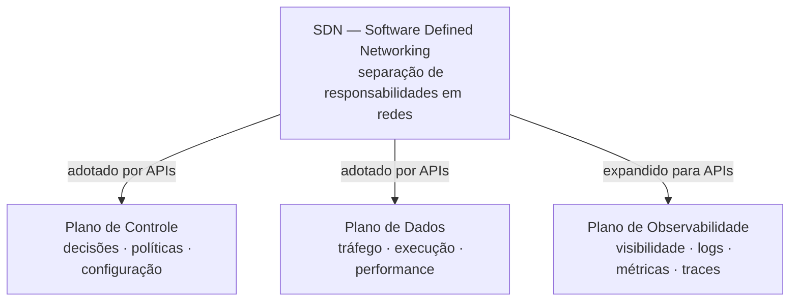
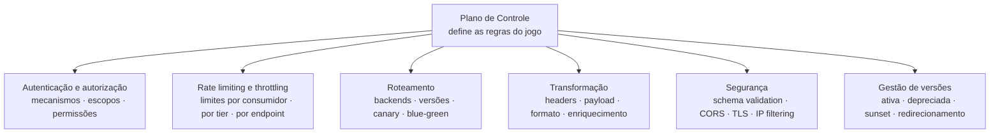
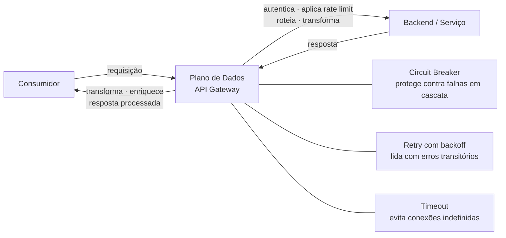
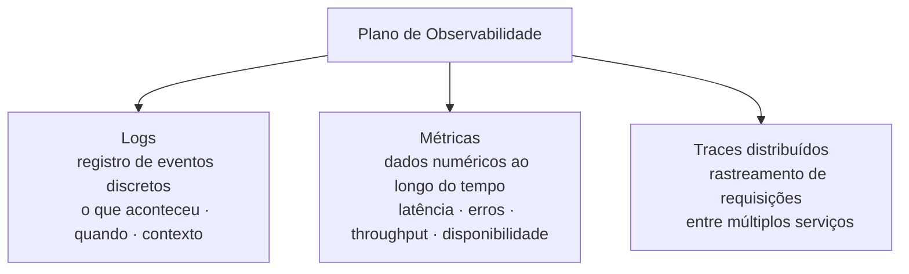
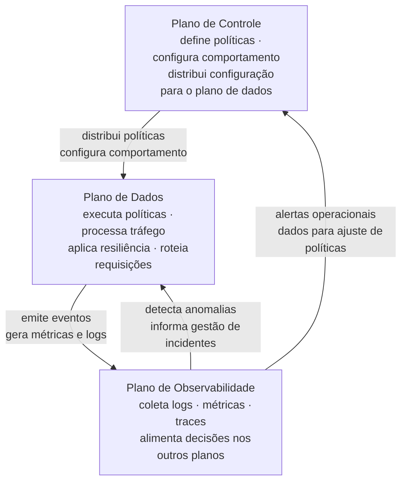
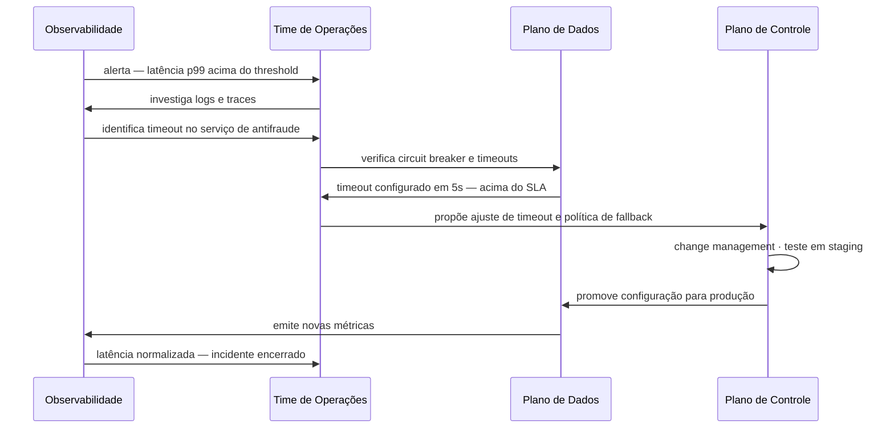
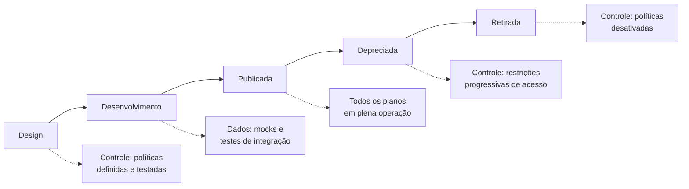

# Módulo 1 · Fundamentos
## Capítulo 1.5 · Os três planos: controle, dados e observabilidade

> **Série:** Gerenciamento e Governança de APIs  
> **Nível:** Fundamentos  
> **Pré-requisito:** Capítulo 1.4 · Diferença entre Gerenciamento e Governança

---

## Sumário

- [1.5.1 · A origem do conceito — de redes para APIs](#151--a-origem-do-conceito--de-redes-para-apis)
- [1.5.2 · Plano de controle](#152--plano-de-controle)
- [1.5.3 · Plano de dados](#153--plano-de-dados)
- [1.5.4 · Plano de observabilidade](#154--plano-de-observabilidade)
- [1.5.5 · Os três planos em conjunto](#155--os-três-planos-em-conjunto)
- [1.5.6 · Os três planos ao longo do ciclo de vida](#156--os-três-planos-ao-longo-do-ciclo-de-vida)

---

## 1.5.1 · A origem do conceito — de redes para APIs

Para entender os três planos no contexto de APIs, precisamos voltar à sua origem — a arquitetura de redes de computadores.

Durante décadas, equipamentos de rede como roteadores e switches misturavam duas responsabilidades fundamentalmente distintas em um único dispositivo: **decidir o que fazer com um pacote** e **fazer com que o pacote chegue ao destino**. Essa mistura funcionava bem em redes pequenas e estáticas — mas criava rigidez e complexidade crescente à medida que as redes escalavam.

No início dos anos 2000, pesquisadores das universidades de Stanford e Berkeley começaram a questionar esse modelo. A pergunta central era: *e se separássemos a inteligência do roteamento da execução do roteamento?*

A resposta foi o **SDN — Software Defined Networking**. A ideia central: separar o **plano de controle** — onde as decisões são tomadas — do **plano de dados** — onde o tráfego flui. O plano de controle poderia ser centralizado, programável e gerenciado por software. O plano de dados poderia ser simples, rápido e especializado em encaminhar pacotes.

Essa separação trouxe benefícios imediatos: visibilidade centralizada, políticas consistentes, capacidade de reprogramar o comportamento da rede sem substituir hardware e observabilidade muito maior sobre o que estava acontecendo.

O mundo de APIs adotou essa mesma lógica de separação — e adicionou um terceiro plano que as redes tradicionais não priorizavam da mesma forma: o **plano de observabilidade**.

A razão para essa adição é simples: APIs são interfaces de negócio, não apenas canais de transporte. Saber que um pacote chegou ao destino é suficiente para uma rede. Saber que uma API está sendo consumida corretamente, por quem, com que padrão e com que resultado de negócio — isso exige muito mais do que monitoramento de conectividade.

---

## 1.5.2 · Plano de controle

O plano de controle é o **cérebro** da arquitetura de API Management. É onde as políticas são definidas, armazenadas e distribuídas para execução. Ele não processa o tráfego de negócio diretamente — define as regras segundo as quais esse tráfego será processado.

Uma analogia útil: o plano de controle é como o código de leis de um país. As leis existem, foram escritas e aprovadas — mas não estão presentes em cada interação cotidiana. Elas são aplicadas por agentes de enforcement quando uma situação relevante ocorre.

---

### O que vive no plano de controle

**Políticas de autenticação e autorização** — quais mecanismos de autenticação são aceitos (API Key, OAuth 2.0, mTLS), quais escopos são necessários para cada operação, quais consumidores têm acesso a quais recursos. Essas políticas são definidas uma vez e aplicadas consistentemente em todo o tráfego.

**Rate limiting e throttling** — quantas requisições um consumidor pode fazer por segundo, por minuto, por dia. Políticas diferentes para tiers diferentes (free, basic, enterprise). Limites globais por endpoint e limites específicos por consumidor.

**Roteamento** — para qual backend uma requisição deve ser encaminhada. Regras baseadas em versão da API, em atributos do consumidor, em peso de tráfego (para deploys canary ou blue/green), em disponibilidade do backend.

**Transformação de payload** — modificações na requisição ou resposta em trânsito: adição de headers, remoção de campos sensíveis, conversão de formato (XML para JSON), enriquecimento com dados de contexto.

**Políticas de segurança** — validação de schema de entrada, proteção contra injeção, CORS, TLS enforcement, filtragem de IPs.

**Configuração de versões** — qual versão de uma API está ativa, em deprecação ou sunset. Redirecionamento de tráfego entre versões durante migrações.

---

### A relação entre plano de controle e API Gateway

O API Gateway é a implementação tecnológica que materializa os planos de controle e de dados. No plano de controle, o gateway oferece a interface de configuração — painel administrativo, APIs de configuração, arquivos de configuração declarativa — onde políticas são definidas e versionadas.

É importante entender que o plano de controle do gateway precisa ser governado da mesma forma que qualquer outro sistema crítico: mudanças em políticas de autenticação ou rate limiting têm impacto imediato em todos os consumidores e precisam de processo de aprovação, teste e rollback definidos.

---

### Implicações de governança do plano de controle

O plano de controle é onde a governança se materializa tecnicamente. As políticas definidas pelo CoE são implementadas aqui. Isso cria responsabilidades específicas:

- **Quem pode modificar políticas no plano de controle?** Mudanças de política têm escopo global e precisam de autorização adequada — não deveria ser qualquer desenvolvedor
- **Como mudanças de política são testadas?** Configurações do plano de controle precisam de ambiente de staging e processo de validação antes de produção
- **Como o histórico de mudanças é rastreado?** Configurações do plano de controle devem estar em controle de versão — Infrastructure as Code para políticas de API

---

## 1.5.3 · Plano de dados

O plano de dados é o **músculo** da arquitetura. É onde o tráfego real flui — cada requisição de cada consumidor, em tempo real, sendo processada segundo as políticas definidas no plano de controle.

Se o plano de controle define as regras, o plano de dados as executa. Cada requisição que chega ao gateway percorre o plano de dados: autenticação verificada, rate limit consultado, roteamento determinado, transformações aplicadas, requisição encaminhada ao backend, resposta processada e devolvida ao consumidor.

O foco do plano de dados é **performance e resiliência**. Latência adicionada pelo gateway precisa ser mínima — cada milissegundo conta. Disponibilidade precisa ser máxima — o plano de dados é o caminho crítico de cada integração.

---

### Características fundamentais do plano de dados

**Baixa latência** — o processamento no plano de dados precisa ser extremamente eficiente. Implementações modernas adicionam latência de 1 a 5 milissegundos por requisição. Qualquer política implementada no plano de dados tem custo de latência — o que reforça a necessidade de políticas bem projetadas no plano de controle.

**Alta disponibilidade** — o plano de dados precisa continuar operando mesmo em condições adversas: alta carga, falhas parciais de backend, degradação de rede.

**Escalabilidade horizontal** — o plano de dados precisa escalar conforme o volume de tráfego cresce, sem mudanças de configuração de política. Instâncias adicionais do gateway recebem as mesmas políticas do plano de controle e começam a processar tráfego imediatamente.

**Independência do plano de controle** — em arquiteturas distribuídas, o plano de dados precisa continuar operando mesmo se o plano de controle estiver temporariamente indisponível. As políticas são cacheadas localmente e continuam sendo aplicadas. Uma falha no painel administrativo do gateway não pode derrubar o processamento de requisições em produção.

---

### Padrões de resiliência no plano de dados

Três padrões são fundamentais para entender como o plano de dados lida com falhas de backend — apresentados aqui de forma introdutória, com aprofundamento de implementação reservado para o **Módulo 7**:

**Circuit Breaker** — quando um backend começa a falhar consistentemente, o circuit breaker "abre" — interrompendo requisições para aquele backend por um período antes de tentar novamente. Evita que falhas em cascata derrubem consumidores e dá tempo para o backend se recuperar.

**Retry com backoff** — quando uma requisição falha por razão transitória (timeout, erro 503), o plano de dados tenta novamente automaticamente, com intervalos crescentes entre tentativas. Evita que erros transitórios cheguem ao consumidor.

**Timeout** — cada requisição tem um tempo máximo de espera. Se o backend não responde dentro desse tempo, o gateway retorna um erro ao consumidor em vez de manter a conexão indefinidamente. Protege o plano de dados de acumular conexões abertas.

---

## 1.5.4 · Plano de observabilidade

O plano de observabilidade é os **olhos** da arquitetura. É onde a capacidade de entender o que está acontecendo — e por que — é construída.

---

### Monitoramento vs. observabilidade

Há uma distinção importante que é frequentemente ignorada:

**Monitoramento** é verificar se sistemas conhecidos estão funcionando conforme esperado. Você define métricas, estabelece thresholds e é alertado quando algo sai do normal. É reativo por natureza — você sabe que há um problema quando um alerta dispara.

**Observabilidade** é a capacidade de entender o estado interno de um sistema a partir de suas saídas externas — mesmo para problemas que você não antecipou. Um sistema observável permite que você faça perguntas que não sabia que precisaria fazer quando o instrumentou.

No contexto de APIs, essa distinção importa porque os problemas mais custosos são frequentemente os que ninguém antecipou — um padrão de uso inesperado que degrada performance, uma combinação de parâmetros que expõe um bug raro, um consumidor específico que está gerando carga desproporcional.

---

### Os três pilares da observabilidade

**Logs** — registros de eventos discretos que ocorreram no sistema. Cada requisição processada, cada erro gerado, cada decisão de roteamento tomada. Logs são a fonte primária de informação para investigação de incidentes — permitem reconstruir exatamente o que aconteceu em uma requisição específica. O desafio dos logs é o volume: APIs de alta escala geram bilhões de eventos por dia, o que exige estratégia de sampling, retenção e indexação.

**Métricas** — dados numéricos coletados ao longo do tempo que descrevem o comportamento do sistema de forma agregada. As métricas fundamentais de APIs são: disponibilidade (% de requisições bem-sucedidas), latência (tempo de resposta em percentis — p50, p95, p99), taxa de erros (% de respostas 4xx e 5xx por categoria) e throughput (requisições por segundo). Métricas são a base para SLAs, alertas e análise de tendências.

**Traces distribuídos** — rastreamento de uma requisição específica através de múltiplos serviços. Em arquiteturas de microsserviços, uma única chamada de API pode envolver dezenas de serviços internos. Sem traces distribuídos, quando uma requisição é lenta ou falha, é impossível saber em qual serviço o problema ocorreu. Traces atribuem um ID único a cada requisição na entrada e propagam esse ID por toda a cadeia — permitindo reconstruir o caminho completo e o tempo gasto em cada etapa.

---

### A conexão com ITIL

O plano de observabilidade é o que torna as práticas de ITIL operacionalmente possíveis no contexto de APIs:

**Incident Management** depende de alertas baseados em métricas e logs para detecção proativa de falhas — sem observabilidade, incidentes são reportados por consumidores, não detectados internamente.

**Problem Management** depende de análise histórica de logs, métricas e traces para identificar causas raiz de problemas recorrentes — sem observabilidade, cada incidente parece único mesmo quando tem a mesma origem.

**Service Level Management** depende de métricas de disponibilidade e latência para verificar conformidade com SLAs — sem observabilidade, SLAs são acordos sem evidência de cumprimento.

> Essa conexão será explorada em profundidade no **Módulo 4 · ITIL & APIs**.

---

## 1.5.5 · Os três planos em conjunto

Os três planos não operam isoladamente — formam um sistema integrado onde cada um depende dos outros para funcionar efetivamente.

---

### Um incidente real percorrendo os três planos

Para tornar essa interação concreta, considere o seguinte cenário: uma API de pagamentos começa a apresentar aumento de latência em produção.

**Plano de observabilidade detecta** — métricas de latência mostram p99 subindo de 200ms para 2s. Um alerta é disparado automaticamente para o time de operações. Logs revelam que o aumento está concentrado em um endpoint específico — `POST /v1/pagamentos`. Traces distribuídos mostram que o tempo está sendo consumido no serviço de antifraude — não no gateway.

**Plano de dados é investigado** — o time verifica que o circuit breaker do serviço de antifraude não disparou porque as respostas estão chegando — apenas lentamente. O timeout configurado para o serviço de antifraude é de 5 segundos — muito alto para o SLA de 500ms prometido ao consumidor.

**Plano de controle é ajustado** — o time reduz o timeout do serviço de antifraude para 800ms e ativa uma política de fallback: quando o antifraude não responde em tempo, a requisição segue com aprovação condicional para revisão posterior. A mudança passa pelo processo de change management, é testada em staging e promovida para produção.

**Plano de observabilidade confirma resolução** — métricas de latência retornam ao normal. O incidente é encerrado. O registro alimenta o Problem Management — o timeout inadequado é identificado como problema recorrente e uma revisão sistemática dos timeouts de todos os serviços dependentes é agendada.

---

## 1.5.6 · Os três planos ao longo do ciclo de vida

Os três planos não são apenas uma arquitetura de runtime — eles têm papéis distintos em cada fase do ciclo de vida de uma API, tanto do ponto de vista técnico quanto do ponto de vista de produto.

Esta seção apresenta essa conexão de forma introdutória. As duas dimensões serão exploradas com profundidade em capítulos dedicados:
- **Capítulo 2.6** · Os três planos ao longo do ciclo de vida — dimensão operacional
- **Capítulo 3.7** · Os três planos como instrumentos de governança — dimensão estratégica

---

### Do ponto de vista do ciclo técnico

**Design** — o plano de controle é projetado junto com o contrato da API: quais políticas de autenticação serão necessárias, quais rate limits fazem sentido para o caso de uso, quais transformações serão necessárias. Projetar as políticas depois da API é um anti-padrão frequente.

**Desenvolvimento** — o plano de dados é configurado com mocks e ambientes de teste. O plano de observabilidade começa a ser instrumentado — observabilidade implementada antes do lançamento é muito mais valiosa do que a adicionada depois de um incidente.

**Publicada** — os três planos operam em conjunto conforme o ciclo descrito no 1.5.5. Este é o estado de plena operação.

**Depreciada** — o plano de controle começa a aplicar restrições progressivas: bloqueio de novos onboardings, mensagens de deprecation nos headers de resposta, monitoramento intensificado de consumidores que ainda não migraram.

**Retirada** — o plano de controle desativa as políticas, o plano de dados para de processar tráfego, o plano de observabilidade arquiva os dados históricos conforme política de retenção.

---

### Do ponto de vista do ciclo de produto

| Fase do produto | Plano de controle | Plano de dados | Plano de observabilidade |
|---|---|---|---|
| **Introdução** | Políticas básicas estabelecidas, sandbox ativo | Performance monitorada para primeiros consumidores | TTFC medido, padrões de onboarding analisados |
| **Crescimento** | Rate limits revisados conforme adoção cresce, novos tiers habilitados | Escalabilidade testada, resiliência validada em carga real | Métricas de adoção, análise de uso por consumidor |
| **Maturidade** | Políticas estáveis, otimizações incrementais | Performance otimizada, SLA consistentemente cumprido | Observabilidade madura, alertas calibrados |
| **Declínio** | Restrições progressivas de acesso, preparação para sunset | Tráfego monitorado para detectar consumidores remanescentes | Dados históricos preservados para auditoria |

---

### O elo que não pode ser perdido

A razão pela qual essa conexão entre os três planos e o ciclo de vida merece tratamento dedicado nos Módulos 2 e 3 é que ela é onde **gerenciamento e governança se encontram de forma mais concreta**.

O plano de controle materializa as decisões de governança em configurações técnicas executáveis. O plano de observabilidade fornece os dados que a governança precisa para tomar decisões informadas sobre o ciclo de vida. O plano de dados executa as políticas e gera a evidência de que estão sendo cumpridas.

Sem essa conexão explícita, organizações frequentemente governam e gerenciam em paralelo — sem que um plano alimente o outro. O resultado é o anti-padrão 5 que vimos no Capítulo 1.3: governança tecnicamente correta mas estrategicamente cega.

> **Os três planos são a infraestrutura técnica que torna a governança operacional. Governança sem os três planos bem configurados é intenção sem execução. Os três planos sem governança são execução sem direção.**

---

## Pontos-chave do capítulo

- Os três planos têm origem no SDN — a separação entre decisão e execução é um princípio arquitetural consolidado que o mundo de APIs adotou e expandiu com o plano de observabilidade
- O plano de controle é o cérebro — define políticas, configura comportamento e materializa tecnicamente as decisões de governança
- O plano de dados é o músculo — executa políticas em runtime com foco em baixa latência, alta disponibilidade e resiliência
- O plano de observabilidade são os olhos — observabilidade não é monitoramento, é a capacidade de entender o estado interno do sistema a partir de suas saídas externas
- Os três planos formam um sistema integrado com ciclo de feedback: controle distribui políticas, dados executa e emite sinais, observabilidade detecta e alimenta decisões de volta ao controle
- A conexão entre os três planos e o ciclo de vida — técnico e de produto — é o elo onde gerenciamento e governança se encontram de forma concreta, explorado em profundidade nos Capítulos 2.6 e 3.7

---

## Próximo capítulo

**1.6 · Estilos arquiteturais e suas implicações de governança** — REST, GraphQL, gRPC e AsyncAPI analisados não apenas como escolhas técnicas, mas como decisões com implicações diretas de governança, operação e experiência do consumidor.

---

*Série: Gerenciamento e Governança de APIs · Módulo 1 · Capítulo 1.5*