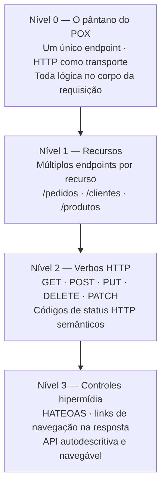
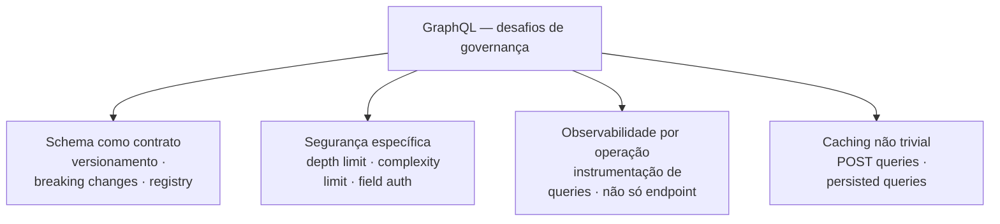
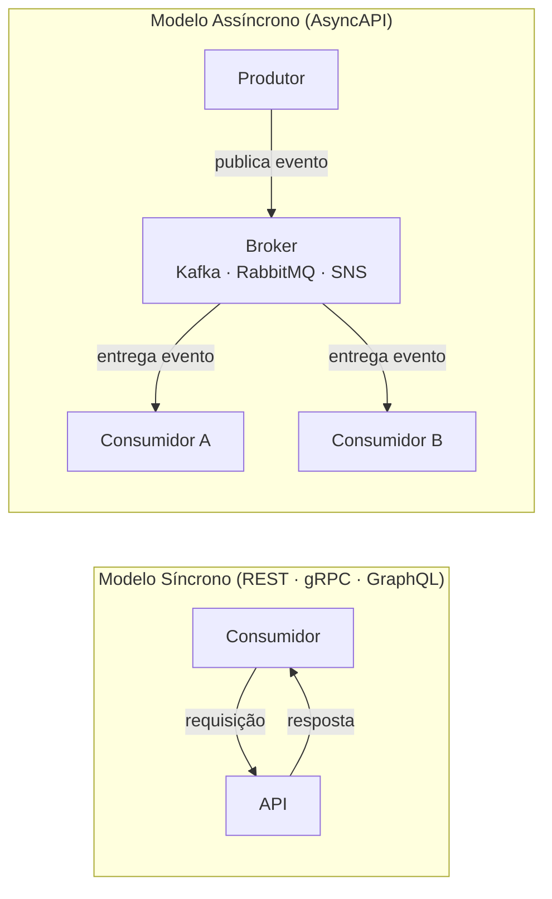
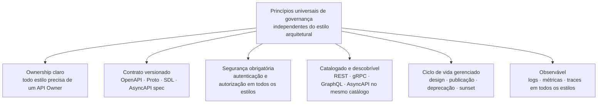

# Módulo 1 · Fundamentos
## Capítulo 1.6 · Estilos arquiteturais e suas implicações de governança

> **Série:** Gerenciamento e Governança de APIs  
> **Nível:** Fundamentos  
> **Pré-requisito:** Capítulo 1.5 · Os três planos: controle, dados e observabilidade

---

## Sumário

- [1.6.1 · Por que o estilo arquitetural importa para governança](#161--por-que-o-estilo-arquitetural-importa-para-governança)
- [1.6.2 · REST — o estilo dominante](#162--rest--o-estilo-dominante)
- [1.6.3 · GraphQL — flexibilidade com responsabilidade](#163--graphql--flexibilidade-com-responsabilidade)
- [1.6.4 · gRPC — performance e contratos rígidos](#164--grpc--performance-e-contratos-rígidos)
- [1.6.5 · AsyncAPI e APIs orientadas a eventos](#165--asyncapi-e-apis-orientadas-a-eventos)
- [1.6.6 · Governando um portfólio heterogêneo de estilos](#166--governando-um-portfólio-heterogêneo-de-estilos)

---

## 1.6.1 · Por que o estilo arquitetural importa para governança

A escolha do estilo arquitetural de uma API é frequentemente tratada como decisão puramente técnica — REST porque é o padrão, gRPC porque é mais rápido, GraphQL porque o frontend pediu. Essa abordagem ignora algo fundamental: **cada estilo arquitetural define um contrato de governança diferente**.

O estilo arquitetural determina:

**Como o contrato é especificado** — REST usa OpenAPI, gRPC usa Protocol Buffers, GraphQL tem seu próprio schema SDL, AsyncAPI tem sua própria especificação. Cada um com ferramentas, processos de revisão e mecanismos de versionamento distintos.

**Como mudanças são gerenciadas** — uma breaking change em REST é diferente de uma breaking change em gRPC. Adicionar um campo obrigatório tem implicações diferentes em cada estilo. A política de versionamento precisa ser calibrada para cada um.

**Como segurança é aplicada** — REST aplica autenticação por endpoint, GraphQL por campo ou operação, gRPC por método RPC. O mesmo nível de segurança exige implementações e revisões diferentes.

**Como o consumidor interage** — REST é navegável por browser e testável com curl. gRPC não é. GraphQL exige um cliente que entenda o schema. AsyncAPI exige um broker intermediário. A experiência do desenvolvedor varia radicalmente.

**Como observabilidade é construída** — tracing de uma requisição REST é direto. Tracing de uma query GraphQL que acessa múltiplos resolvers exige instrumentação específica. Tracing de eventos assíncronos exige correlação de IDs entre produtor e consumidor.

> A governança que funciona para um portfólio exclusivamente REST não funciona sem adaptações para um portfólio heterogêneo. Entender as implicações de cada estilo é pré-requisito para construir um framework de governança que escale.

---

## 1.6.2 · REST — o estilo dominante

REST continua sendo o estilo arquitetural mais adotado para APIs — e por boas razões. Baseia-se em princípios que a web já validou em escala: recursos identificados por URIs, operações via verbos HTTP, stateless, representações separadas dos recursos.

Mas a dominância do REST criou um problema: como não há uma especificação formal do protocolo — apenas um conjunto de princípios arquiteturais definidos por Fielding em 2000 — cada time implementa REST à sua maneira. O resultado é um portfólio onde APIs "REST" variam enormemente em qualidade, consistência e conformidade com os princípios originais.

---

### O Richardson Maturity Model

Em 2008, Leonard Richardson propôs um modelo para classificar APIs REST em quatro níveis de maturidade — do mais primitivo ao mais sofisticado. O modelo é uma ferramenta útil para avaliar e comunicar a qualidade de APIs REST de forma objetiva.



**Nível 0 — O pântano do POX (Plain Old XML/JSON)**
Um único endpoint que recebe tudo. A operação é determinada pelo corpo da requisição, não pela URL ou verbo HTTP. É o padrão de integração mais primitivo — tecnicamente usa HTTP, mas ignora completamente sua semântica. Ainda comum em integrações legadas.

```http
POST /api
{ "acao": "buscarPedido", "id": "123" }
```

**Nível 1 — Recursos**
Múltiplos endpoints, cada um representando um recurso específico. A URL identifica o quê — mas as operações ainda são determinadas pelo corpo ou por parâmetros customizados.

```http
POST /pedidos/buscar
{ "id": "123" }
```

**Nível 2 — Verbos HTTP**
Os verbos HTTP são usados com sua semântica correta: GET para leitura, POST para criação, PUT/PATCH para atualização, DELETE para remoção. Códigos de status HTTP semânticos: 200, 201, 400, 404, 500. Este é o nível mínimo aceitável para APIs modernas — e onde a maioria das APIs REST de mercado opera.

```http
GET /pedidos/123
→ 200 OK com representação do pedido

DELETE /pedidos/123
→ 204 No Content
```

**Nível 3 — Controles hipermídia (HATEOAS)**
As respostas incluem links para as próximas ações possíveis — a API se torna autodescritiva e navegável. O consumidor não precisa conhecer a estrutura de URLs antecipadamente; ela emerge da interação. É o nível mais raro na prática — a complexidade de implementação raramente justifica o benefício para a maioria dos casos de uso.

```json
{
  "id": "123",
  "status": "aprovado",
  "_links": {
    "cancelar": { "href": "/pedidos/123/cancelamento" },
    "rastrear": { "href": "/pedidos/123/rastreamento" }
  }
}
```

> O Richardson Maturity Model será explorado com maior profundidade no **Módulo 6 · Maturidade de APIs**, onde o usaremos como referência para avaliar e evoluir portfólios REST.

---

### Implicações de governança do REST

**Style guide é obrigatório** — a flexibilidade do REST é sua maior força e seu maior risco de governança. Sem um style guide formal, times implementam REST de formas incompatíveis: alguns usam `/pedidos/{id}`, outros usam `/getPedidoById`, outros usam `/pedido?id=123`. O style guide é o mecanismo que transforma a flexibilidade do REST em consistência.

**Versionamento na URI vs. header** — uma das decisões de governança mais recorrentes em portfólios REST. Versão na URI (`/v1/pedidos`) é mais visível e fácil de testar. Versão em header (`Accept: application/vnd.api+json;version=1`) é mais "pura" do ponto de vista REST. A governança precisa definir uma abordagem consistente para todo o portfólio.

**Padronização de erros** — a RFC 7807 (Problem Details for HTTP APIs) define um formato padrão para respostas de erro em APIs REST. Adotá-la como padrão no style guide garante que consumidores tenham experiência consistente independente de qual API da organização estão consumindo.

**OpenAPI como contrato obrigatório** — toda API REST deve ter uma especificação OpenAPI válida como fonte de verdade do contrato. O processo de design-first — escrever a spec antes do código — é a melhor prática de governança para REST.

---

## 1.6.3 · GraphQL — flexibilidade com responsabilidade

GraphQL inverte o modelo de REST de uma forma fundamental: em vez do servidor definir o que retorna em cada endpoint, **o cliente define exatamente o que quer buscar**. Uma única query pode buscar dados de múltiplas entidades em uma única requisição, com exatamente os campos necessários — sem over-fetching nem under-fetching.

Isso resolve problemas reais — especialmente em aplicações mobile onde banda é cara e latência importa. Mas cria desafios de governança específicos que não existem em REST.

```graphql
# Cliente define exatamente o que quer
query {
  pedido(id: "123") {
    status
    valor
    cliente {
      nome
      email
    }
    itens {
      produto
      quantidade
    }
  }
}
```

---

### Implicações de governança do GraphQL

**Schema como contrato central** — em GraphQL, o schema SDL (Schema Definition Language) é o contrato. Toda mudança no schema é uma potencial breaking change para algum consumidor. A governança precisa de um processo rigoroso de revisão de schema — mais rigoroso que REST porque uma única mudança pode impactar queries completamente diferentes.

**Schema registry obrigatório** — o schema precisa ser versionado, publicado centralmente e acessível para todos os consumidores. Ferramentas como Apollo Studio e GraphQL Inspector automatizam a detecção de breaking changes entre versões do schema.

**Depth limiting e complexity limiting** — sem controles, um consumidor pode submeter uma query arbitrariamente complexa que pode derrubar o servidor:

```graphql
# Query maliciosa — recursão profunda
query {
  usuario {
    amigos {
      amigos {
        amigos {
          amigos { nome }
        }
      }
    }
  }
}
```

A governança precisa definir e enforçar limites de profundidade (depth limit) e complexidade (complexity limit) para proteger o servidor de abuso — intencional ou acidental.

**Autorização por campo** — em REST, autorização por endpoint é relativamente simples. Em GraphQL, o mesmo endpoint serve todas as queries — a autorização precisa ser aplicada no nível do campo ou do resolver. Isso exige uma estratégia de autorização mais granular e processos de revisão de segurança específicos para GraphQL.

**Observabilidade mais complexa** — em REST, cada endpoint tem métricas independentes. Em GraphQL, todas as queries passam pelo mesmo endpoint `/graphql`. Observabilidade efetiva exige instrumentação que analise o corpo da query para identificar operações específicas — não apenas o endpoint.

**Caching mais difícil** — REST usa HTTP caching nativamente (GET é cacheável por definição). GraphQL usa POST para a maioria das queries, o que torna caching HTTP padrão inaplicável. Estratégias de caching em GraphQL exigem soluções específicas como persisted queries.



---

## 1.6.4 · gRPC — performance e contratos rígidos

gRPC foi desenvolvido pelo Google e lançado como open source em 2015. Usa **Protocol Buffers (Protobuf)** como linguagem de definição de interface e serialização binária, sobre HTTP/2. O resultado é um protocolo extremamente eficiente — payloads menores, latência menor, multiplexação nativa de streams.

É o estilo preferido para comunicação interna de alta performance entre microsserviços — onde a eficiência importa mais do que a navegabilidade por browser.

```protobuf
// Contrato gRPC — definido em Protocol Buffers
service PagamentoService {
  rpc ProcessarPagamento (PagamentoRequest) returns (PagamentoResponse);
  rpc ListarPagamentos (ListarRequest) returns (stream PagamentoResponse);
}

message PagamentoRequest {
  string destinatario_id = 1;
  double valor = 2;
  string moeda = 3;
}
```

---

### Implicações de governança do gRPC

**O arquivo `.proto` é o contrato** — toda a governança de gRPC gira em torno do arquivo `.proto`. Ele precisa ser tratado com o mesmo rigor que uma especificação OpenAPI: versionado, revisado, publicado centralmente e protegido contra mudanças não controladas.

**Compatibilidade de schema tem regras específicas**

| Mudança | Breaking? | Regra |
|---|---|---|
| Adicionar novo campo | Não | Campos novos são ignorados por clientes antigos |
| Remover campo existente | Sim | Clientes que dependem do campo quebram |
| Renomear campo | Sim | O número do campo importa, não o nome — mas ferramentas podem quebrar |
| Mudar tipo de campo | Sim | Serialização binária incompatível |
| Adicionar novo RPC | Não | Clientes antigos simplesmente não chamam |

A governança precisa de um processo de revisão que valide essas regras antes de qualquer mudança no `.proto` ser promovida.

**Não é navegável por browser** — ao contrário de REST, gRPC não pode ser testado com curl ou browser. Ferramentas específicas são necessárias (grpcurl, Postman com suporte gRPC, BloomRPC), e o processo de onboarding de consumidores é mais trabalhoso.

**Ideal para APIs privadas e de parceiro** — as características de gRPC — eficiência, contrato rígido, não navegável — o tornam mais adequado para comunicação interna ou com parceiros técnicos do que para APIs públicas de ecossistema amplo. A governança deve refletir isso: gRPC geralmente não é a escolha certa para APIs que precisam de ampla adoção externa.

**Streaming nativo** — gRPC suporta streaming bidirecional nativamente, o que REST não oferece sem workarounds. Isso abre casos de uso que exigem considerações específicas de governança: gestão de conexões long-lived, timeout de streams, backpressure.

---

## 1.6.5 · AsyncAPI e APIs orientadas a eventos

Os estilos anteriores — REST, GraphQL, gRPC — compartilham um modelo fundamental: **request-response**. Um consumidor faz uma requisição e aguarda uma resposta. Esse modelo é síncrono por natureza.

APIs orientadas a eventos invertem esse modelo: em vez de um consumidor perguntar *"o que aconteceu?"*, o sistema notifica *"isso aconteceu"* — e o consumidor processa quando estiver pronto. Esse modelo assíncrono é fundamental para arquiteturas de alta escala, processamento de eventos em tempo real e desacoplamento entre sistemas.



**AsyncAPI** é a especificação padrão para documentar APIs orientadas a eventos — o equivalente do OpenAPI para o mundo assíncrono. Define canais, mensagens, schemas de eventos e bindings para diferentes brokers.

---

### Implicações de governança do AsyncAPI

**O evento é o contrato** — em APIs síncronas, o contrato é o endpoint e seus parâmetros. Em APIs assíncronas, o contrato é o schema do evento — a estrutura da mensagem publicada no broker. Qualquer mudança no schema do evento é uma potencial breaking change para todos os consumidores daquele tópico.

**Schema registry de eventos é obrigatório** — ferramentas como Confluent Schema Registry para Kafka gerenciam versões de schemas de eventos e enforçam compatibilidade. A governança precisa definir a estratégia de compatibilidade:

| Estratégia | Significado | Quando usar |
|---|---|---|
| **Backward** | Consumidores antigos leem eventos novos | Adição de campos opcionais |
| **Forward** | Consumidores novos leem eventos antigos | Remoção de campos não essenciais |
| **Full** | Compatibilidade nos dois sentidos | Máxima segurança — mais restritivo |

**Rastreabilidade é mais complexa** — em REST, um request ID é suficiente para rastrear uma interação. Em sistemas event-driven, um fluxo de negócio pode envolver dezenas de eventos em múltiplos tópicos. A governança precisa definir padrões de correlation ID e estratégias de tracing distribuído específicas para o modelo assíncrono.

**Ordenamento e idempotência** — consumidores de eventos precisam lidar com entrega fora de ordem e entrega duplicada (at-least-once delivery). A governança deve definir padrões para handlers idempotentes e estratégias de ordenamento quando necessário.

**Descoberta é um desafio específico** — em REST, um catálogo de APIs é suficiente. Em sistemas event-driven, o catálogo precisa cobrir também os tópicos e schemas de eventos — o que frequentemente é gerenciado separadamente, criando silos de descoberta.

---

## 1.6.6 · Governando um portfólio heterogêneo de estilos

A realidade da maioria das organizações não é um portfólio homogêneo — é uma mistura de estilos que cresceu organicamente ao longo do tempo: APIs REST legadas, novos serviços em gRPC, um gateway GraphQL para o frontend, eventos Kafka para processamento assíncrono.

Governar esse portfólio heterogêneo exige um framework que seja **agnóstico ao estilo nos princípios** mas **específico ao estilo nas políticas**.

---

### Princípios agnósticos ao estilo

Independente do estilo arquitetural, toda API no portfólio deve seguir os mesmos princípios fundamentais de governança:



---

### Políticas específicas por estilo

Dentro dos princípios universais, cada estilo tem políticas específicas:

| Dimensão | REST | GraphQL | gRPC | AsyncAPI |
|---|---|---|---|---|
| **Especificação** | OpenAPI 3.x obrigatório | Schema SDL + registry | `.proto` versionado | AsyncAPI spec obrigatória |
| **Versionamento** | URI ou header — padrão definido | Schema versioning | Compatibilidade de campo | Schema registry com estratégia |
| **Segurança** | Auth por endpoint | Auth por campo/operação | Auth por método RPC | Auth no broker + schema |
| **Breaking change** | Semver + deprecation notice | Schema diff automatizado | Validação de compatibilidade Protobuf | Compatibilidade de schema de evento |
| **Lint** | Spectral com ruleset REST | GraphQL Inspector | Buf CLI | AsyncAPI linter |
| **Teste de contrato** | Pact (consumer-driven) | Schema validation | Protobuf compatibility check | Schema validation no registry |

---

### A decisão de qual estilo usar

Uma das responsabilidades de governança mais importantes em portfólios heterogêneos é evitar proliferação desnecessária de estilos. Cada estilo adicionado ao portfólio aumenta a complexidade de governança — mais ferramentas, mais processos, mais treinamento.

A governança deve definir critérios claros para quando cada estilo é apropriado:

| Contexto | Estilo recomendado | Razão |
|---|---|---|
| API pública com ampla adoção | REST | Universalmente compreendido, tooling maduro |
| Comunicação interna de alta performance | gRPC | Eficiência, contrato rígido, streaming |
| Frontend com necessidades de dados flexíveis | GraphQL | Elimina over/under-fetching, reduz round trips |
| Processamento assíncrono e desacoplamento | AsyncAPI | Modelo event-driven, escalabilidade |
| Integração com sistemas legados | REST ou SOAP | Compatibilidade com o legado |

> A heterogeneidade de estilos é apenas uma das dimensões de complexidade em portfólios de APIs reais. A heterogeneidade de infraestrutura — múltiplos clouds, múltiplos gateways, ambientes on-premises — adiciona uma camada de complexidade igualmente importante, tratada no **Capítulo 1.7 · Heterogeneidade de infraestrutura e governança multi-ambiente**.

---

## Pontos-chave do capítulo

- A escolha do estilo arquitetural não é apenas técnica — define o contrato de governança, o modelo de segurança, a estratégia de versionamento e a experiência do consumidor
- REST é o estilo dominante pela sua universalidade, mas sua flexibilidade exige style guide rigoroso — sem ele, cada time implementa REST à sua maneira
- O Richardson Maturity Model classifica APIs REST em quatro níveis — do Nível 0 (um único endpoint) ao Nível 3 (HATEOAS) — sendo o Nível 2 o mínimo aceitável para APIs modernas
- GraphQL inverte o controle para o cliente, criando desafios específicos de governança: schema registry, depth limiting, autorização por campo e observabilidade por operação
- gRPC é ideal para comunicação interna de alta performance com contratos rígidos — mas não é navegável por browser e exige ferramentas específicas de governança
- AsyncAPI governa o modelo event-driven: o evento é o contrato, schema registry é obrigatório e rastreabilidade exige padrões específicos de correlation ID
- Portfólios heterogêneos precisam de princípios agnósticos ao estilo combinados com políticas específicas por estilo — e de critérios claros para quando usar cada um

---

## Próximo capítulo

**1.7 · Heterogeneidade de infraestrutura e governança multi-ambiente** — como governar APIs em ambientes que combinam múltiplos clouds, múltiplos gateways e infraestrutura on-premises, sem perder visibilidade, consistência e controle.

---

*Série: Gerenciamento e Governança de APIs · Módulo 1 · Capítulo 1.6*