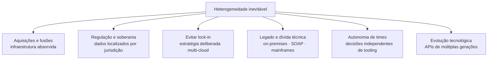
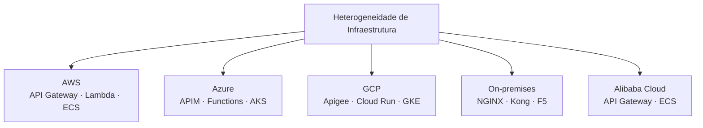
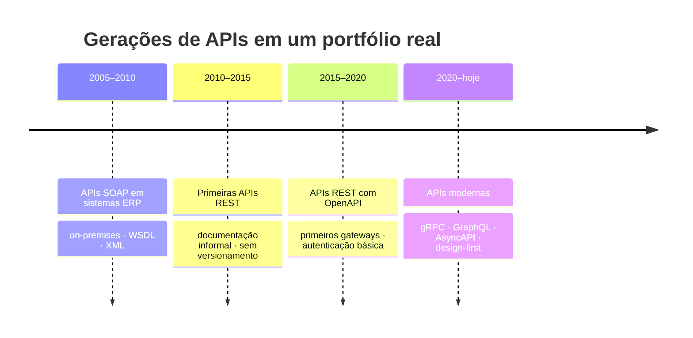
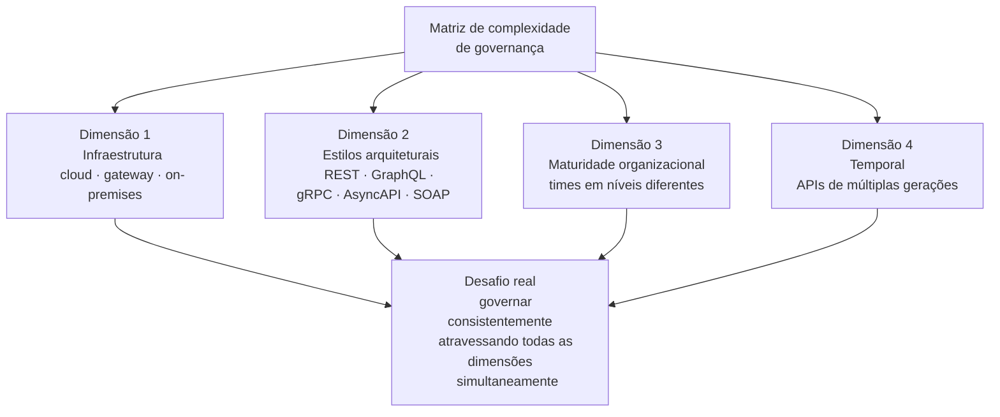
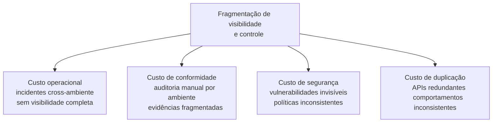
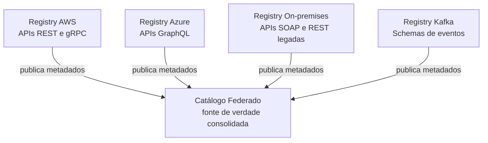
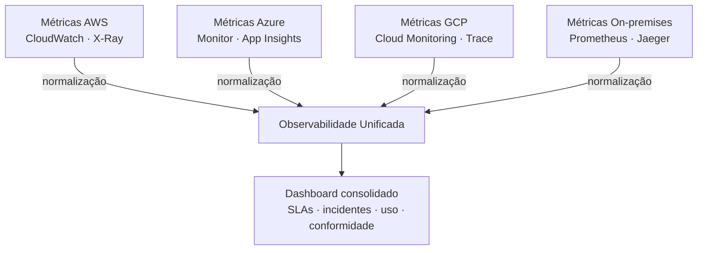
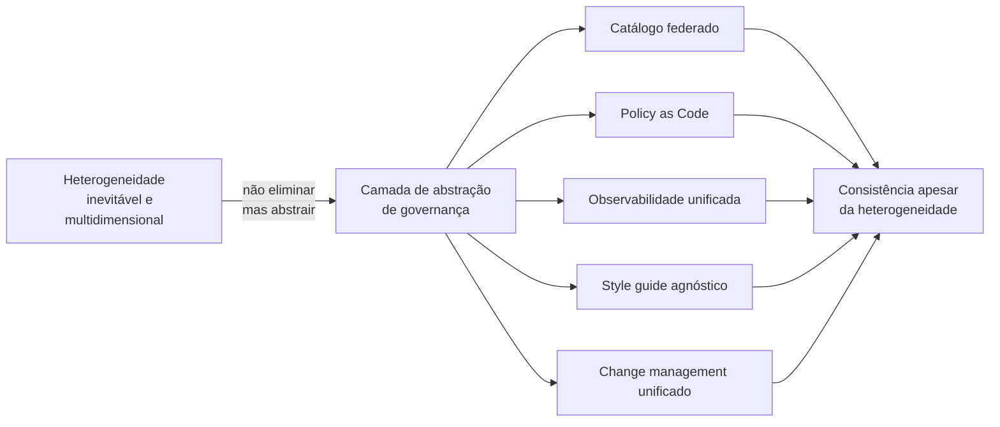

# Módulo 1 · Fundamentos
## Capítulo 1.7 · Heterogeneidade de infraestrutura e governança multi-ambiente

> **Série:** Gerenciamento e Governança de APIs  
> **Nível:** Fundamentos  
> **Pré-requisito:** Capítulo 1.6 · Estilos arquiteturais e suas implicações de governança

---

## Sumário

- [1.7.1 · O mito da infraestrutura homogênea](#171--o-mito-da-infraestrutura-homogênea)
- [1.7.2 · Por que a heterogeneidade é inevitável](#172--por-que-a-heterogeneidade-é-inevitável)
- [1.7.3 · As quatro dimensões da heterogeneidade](#173--as-quatro-dimensões-da-heterogeneidade)
- [1.7.4 · O problema real: fragmentação de visibilidade e controle](#174--o-problema-real-fragmentação-de-visibilidade-e-controle)
- [1.7.5 · Estratégias de governança multi-ambiente](#175--estratégias-de-governança-multi-ambiente)
- [1.7.6 · Ponte para o Módulo 7](#176--ponte-para-o-módulo-7)

---

## 1.7.1 · O mito da infraestrutura homogênea

Existe um ideal arquitetural que aparece frequentemente em apresentações de tecnologia e estratégias de TI: **um único cloud, um único gateway, um único padrão de API, uma única plataforma**. A promessa é sedutora — tudo padronizado, tudo integrado, tudo governado de forma consistente a partir de um único ponto de controle.

O problema é que esse ideal raramente corresponde à realidade de organizações que existem há mais de alguns anos. E quando corresponde — em startups jovens com portfólios pequenos — é uma condição temporária, não permanente.

A busca pela homogeneidade total não é apenas impraticável — frequentemente é contraproducente. Organizações que forçam padronização prematura criam atritos que reduzem velocidade, geram resistência dos times e frequentemente resultam em workarounds informais que criam exatamente a fragmentação que tentavam evitar — só que invisível e não gerenciada.

> **A heterogeneidade não é o problema. O problema é a heterogeneidade não governada.**

Essa distinção é o fio condutor de todo este capítulo. A pergunta relevante não é *"como eliminamos a heterogeneidade?"* — é *"como governamos bem dentro dela?"*

---

## 1.7.2 · Por que a heterogeneidade é inevitável

Entender as forças que criam heterogeneidade é o primeiro passo para governá-la. Não são forças acidentais ou resultado de má gestão — são forças estruturais que operam em qualquer organização que cresce e evolui ao longo do tempo.

---

**Força 1 — Aquisições e fusões**

Quando uma empresa adquire outra, adquire junto toda a sua infraestrutura de TI. A empresa adquirida pode estar rodando em um cloud diferente, com um gateway diferente, com padrões de API completamente distintos. A integração técnica leva anos — e durante esse período, os dois ambientes coexistem. Em organizações que fazem múltiplas aquisições, esse processo se repete indefinidamente.

**Força 2 — Requisitos regulatórios e soberania de dados**

Regulações de proteção de dados em diferentes jurisdições podem exigir que dados de determinados países residam em infraestrutura localizada naquele país. A LGPD no Brasil, o GDPR na Europa, regulações bancárias na China — cada uma pode exigir ambientes separados. O resultado é inevitavelmente multi-cloud ou híbrido.

**Força 3 — Evitar lock-in**

Muitas organizações adotam deliberadamente múltiplos clouds como estratégia para não depender exclusivamente de um fornecedor. Essa é uma decisão consciente de negócio — não um acidente técnico. A governança precisa reconhecer e acomodar essa estratégia.

**Força 4 — Legado e dívida técnica**

Sistemas construídos há 10, 15, 20 anos rodam em infraestrutura on-premises com tecnologias que não migram facilmente para cloud. APIs SOAP de sistemas ERP, integrações com mainframes, serviços construídos antes da era cloud — todos coexistem com APIs modernas em ambientes distribuídos.

**Força 5 — Autonomia de times e velocidade**

Em organizações que adotam estruturas ágeis e times autônomos, cada time toma decisões tecnológicas independentes — inclusive de infraestrutura e tooling. Um time pode escolher AWS por familiaridade, outro Azure por integração com ferramentas Microsoft, outro GCP por capacidades de machine learning. A autonomia que acelera a entrega cria heterogeneidade como efeito colateral.

**Força 6 — Evolução tecnológica**

O ecossistema de APIs evoluiu significativamente ao longo do tempo. APIs construídas em diferentes momentos refletem as melhores práticas de sua época: SOAP nos anos 2000, REST nos anos 2010, gRPC e GraphQL mais recentemente, AsyncAPI para eventos. Um portfólio que existe há anos inevitavelmente contém APIs de múltiplas gerações tecnológicas.

---

## 1.7.3 · As quatro dimensões da heterogeneidade

A heterogeneidade em portfólios de APIs reais não é unidimensional. Ela se manifesta em quatro dimensões simultâneas — e é a combinação dessas dimensões que define o desafio real de governança.

---

### Dimensão 1 — Infraestrutura

A camada mais visível. Múltiplos clouds, múltiplos gateways e ambientes on-premises coexistindo:

Cada ambiente tem suas próprias capacidades de gateway, seu próprio modelo de autenticação nativo, suas próprias ferramentas de observabilidade e seus próprios mecanismos de deploy. Uma política de rate limiting configurada no Azure APIM não se traduz automaticamente para o Kong rodando on-premises.

---

### Dimensão 2 — Estilos arquiteturais

Como vimos no Cap 1.6, cada estilo tem seu próprio contrato, suas próprias ferramentas e suas próprias políticas de governança. Em um portfólio real, múltiplos estilos coexistem simultaneamente com múltiplos ambientes:

| Ambiente | Gateway | Estilo | Geração |
|---|---|---|---|
| AWS | API Gateway | REST | 2018–presente |
| Azure | APIM | GraphQL | 2021–presente |
| On-premises | NGINX | SOAP | 2008–presente |
| GCP | Apigee | gRPC | 2022–presente |
| Kafka | — | AsyncAPI | 2020–presente |

A combinação de ambiente + estilo multiplica a complexidade de governança. Não é apenas "como governamos REST" ou "como governamos o AWS" — é "como governamos REST no AWS, GraphQL no Azure e SOAP on-premises de forma consistente".

---

### Dimensão 3 — Maturidade organizacional

Times diferentes na mesma organização operam em níveis de maturidade diferentes. Um time que existe há cinco anos com práticas DevOps consolidadas tem uma relação completamente diferente com governança do que um time recém-formado ou um time oriundo de uma empresa adquirida.

Essa heterogeneidade de maturidade é frequentemente ignorada em frameworks de governança — que assumem que todos os times têm a mesma capacidade de absorver e aplicar políticas. Na prática, uma política que funciona bem para um time maduro pode ser completamente impraticável para um time menos experiente.

---

### Dimensão 4 — Temporal

APIs de diferentes gerações coexistem no mesmo portfólio — cada uma refletindo as práticas, as ferramentas e as restrições do momento em que foi construída:

Cada geração tem seus próprios padrões, suas próprias ferramentas e suas próprias expectativas de consumidores. Governar o portfólio inteiro exige estratégias que funcionem para todas as gerações simultaneamente — não apenas para as APIs mais novas.

---

### A matriz de complexidade

A combinação das quatro dimensões cria uma matriz de complexidade que explica por que governança multi-ambiente é um dos desafios mais difíceis da disciplina:

---

## 1.7.4 · O problema real: fragmentação de visibilidade e controle

Com quatro dimensões de heterogeneidade operando simultaneamente, o problema central que emerge não é técnico — é de **visibilidade e controle**. Organizações perdem a capacidade de responder a perguntas fundamentais de governança:

- *Quantas APIs temos ao todo?*
- *Quem é responsável por cada uma?*
- *Quais políticas de segurança estão sendo aplicadas em cada ambiente?*
- *Estamos cumprindo nossos SLAs consolidados?*
- *Temos APIs duplicadas resolvendo o mesmo problema em ambientes diferentes?*
- *Quando uma regulação muda, quais APIs precisam ser atualizadas?*

Sem respostas para essas perguntas, a governança fragmenta-se em silos — cada ambiente gerenciado de forma independente, sem visão de conjunto. O custo dessa fragmentação é real e multidimensional:

**Custo operacional** — incidentes que cruzam ambientes demoram mais para ser detectados e resolvidos porque nenhum time tem visibilidade completa da cadeia.

**Custo de conformidade** — auditorias regulatórias exigem evidências de conformidade em todos os ambientes. Sem visibilidade consolidada, cada auditoria se torna uma operação de coleta manual de evidências de múltiplas fontes.

**Custo de segurança** — vulnerabilidades podem existir em um ambiente e não ser detectadas porque o processo de security review não se aplica uniformemente a todos os ambientes.

**Custo de duplicação** — sem catálogo consolidado, times constroem APIs que já existem em outro ambiente — desperdiçando esforço e criando inconsistências de comportamento para consumidores.

---

## 1.7.5 · Estratégias de governança multi-ambiente

Governar efetivamente em ambientes heterogêneos não exige homogeneidade — exige **abstração**. A ideia central é construir uma camada de governança que seja independente da infraestrutura subjacente — que funcione independente de qual cloud, qual gateway ou qual estilo arquitetural está por baixo.

---

### Estratégia 1 — Catálogo federado como fonte de verdade

O catálogo de APIs precisa ser o único lugar onde a organização tem visibilidade de todo o seu portfólio — independente de onde cada API está hospedada. Isso não significa um sistema centralizado que gerencia todos os ambientes — significa um sistema que agrega metadados de todos os ambientes.

Cada ambiente continua sendo gerenciado localmente, mas publica metadados para o catálogo central: nome, versão, owner, SLA, estilo, status do ciclo de vida, ambiente. O catálogo federa essa informação sem precisar controlar a implementação.

---

### Estratégia 2 — Políticas como código agnósticas ao ambiente

Políticas de governança devem ser definidas em uma linguagem abstrata e traduzidas para cada ambiente específico. Em vez de configurar rate limiting diretamente no Kong e repetir o processo no Azure APIM, a política é definida uma vez — *"esta API permite 1000 requisições por minuto por consumidor"* — e ferramentas de automação traduzem essa política para a configuração específica de cada gateway.

Essa abordagem — frequentemente chamada de **Policy as Code** — garante que políticas sejam consistentes entre ambientes e que mudanças de política sejam aplicadas universalmente, não ambiente por ambiente.

---

### Estratégia 3 — Observabilidade unificada

Cada ambiente gera seus próprios logs, métricas e traces em formatos diferentes. A estratégia de observabilidade unificada coleta esses sinais, os normaliza para um formato comum e os consolida em uma plataforma única de análise.

O objetivo não é substituir as ferramentas nativas de cada cloud — é criar uma camada de agregação que permita fazer perguntas que cruzam ambientes: *"qual é a disponibilidade consolidada de todas as APIs de pagamento, independente de onde estão hospedadas?"*

---

### Estratégia 4 — Style guide agnóstico ao estilo e ao ambiente

O style guide de APIs precisa ser escrito em termos de princípios e comportamentos esperados — não em termos de configurações específicas de um gateway ou de um cloud. Em vez de *"configure o rate limiting desta forma no Kong"*, o style guide diz *"toda API deve ter rate limiting definido por tier de consumidor"* — e cada ambiente implementa esse princípio com suas próprias ferramentas.

A validação do style guide também precisa ser agnóstica: linters como Spectral para REST, Buf para Protobuf e GraphQL Inspector para GraphQL aplicam o mesmo conjunto de regras independente de onde a API está hospedada.

---

### Estratégia 5 — Processo de change management unificado

Mudanças em APIs de diferentes ambientes e estilos precisam passar pelo mesmo processo de aprovação — mesmo que a implementação técnica seja diferente. Um change record para uma API SOAP on-premises e um change record para uma API gRPC no GCP seguem o mesmo processo de avaliação de impacto, aprovação e rollback — independente das diferenças técnicas de implementação.

Essa estratégia conecta diretamente com o ITIL Change Enablement que estudaremos no Módulo 4 — e é onde a governança de APIs se integra mais explicitamente com os frameworks de gestão de serviços de TI.

---

### O princípio unificador das cinco estratégias

---

## 1.7.6 · Ponte para o Módulo 7

As estratégias apresentadas no 1.7.5 são princípios de governança — o *"o quê"* e o *"por quê"*. A implementação concreta — as ferramentas, os padrões técnicos e as arquiteturas de referência — é o escopo do **Módulo 7 · Ferramentas & Padrões**.

Em particular, o **Capítulo 7.6 · Multi-cloud, múltiplos gateways e on-premises** aprofundará:

- Ferramentas de catálogo federado (Backstage, Apicurio, AWS Service Catalog)
- Plataformas de observabilidade unificada (Datadog, Dynatrace, Grafana com múltiplas fontes)
- Abordagens de Policy as Code para múltiplos gateways (OPA — Open Policy Agent)
- Padrões de service mesh para governança de comunicação interna (Istio, Linkerd)
- Critérios de decisão para escolha de gateway em ambientes heterogêneos

> A governança multi-ambiente é um dos temas mais complexos e práticos da disciplina — e é onde a maioria das organizações encontra suas maiores dificuldades. O Módulo 7 oferece as ferramentas; este capítulo oferece o framework mental para usá-las de forma consciente.

---

## Fechando o Módulo 1

Este capítulo encerra o Módulo 1 de uma forma deliberada: com o reconhecimento de que o ambiente real onde APIs são governadas é fundamentalmente mais complexo e heterogêneo do que qualquer modelo ideal sugere.

Os conceitos construídos ao longo do Módulo 1 — o que é uma API, como tratá-la como produto, o que é governança, como gerenciamento e governança se complementam, os três planos, os estilos arquiteturais — todos foram apresentados em sua forma mais clara e isolada. O mundo real combina todos esses elementos simultaneamente, em múltiplos ambientes, com múltiplos times, ao longo de múltiplas gerações tecnológicas.

A maturidade em governança de APIs não é dominar cada conceito isoladamente — é saber como aplicá-los de forma integrada em um ambiente que nunca será perfeitamente homogêneo.

> **Governança madura não exige infraestrutura perfeita — exige abstração suficiente para ser consistente apesar da imperfeição.**

---

## Pontos-chave do capítulo

- A heterogeneidade de infraestrutura não é um problema a ser resolvido — é uma condição de operação da maioria das organizações, gerada por forças estruturais legítimas: aquisições, regulação, legado, autonomia de times e evolução tecnológica
- A heterogeneidade é multidimensional — envolve simultaneamente infraestrutura, estilos arquiteturais, maturidade organizacional e gerações tecnológicas
- O problema real não é a heterogeneidade em si — é a fragmentação de visibilidade e controle que ela causa quando não é governada
- Cinco estratégias de abstração permitem governar consistentemente ambientes heterogêneos: catálogo federado, Policy as Code, observabilidade unificada, style guide agnóstico e change management unificado
- Nenhuma dessas estratégias exige homogeneidade — todas operam pela lógica da abstração sobre a heterogeneidade
- A implementação concreta dessas estratégias — ferramentas, padrões e arquiteturas de referência — é explorada no Módulo 7

---

## Próximos passos

O **Módulo 1 · Fundamentos** está completo. Os conceitos estabelecidos aqui — API como produto, governança, gerenciamento, os três planos, estilos arquiteturais e heterogeneidade — são a base sobre a qual todos os módulos seguintes se constroem.

**Módulo 2 · Ciclo de Vida de APIs** — do design ao sunset, com profundidade operacional e as implicações de governança em cada fase.

---

*Série: Gerenciamento e Governança de APIs · Módulo 1 · Capítulo 1.7*