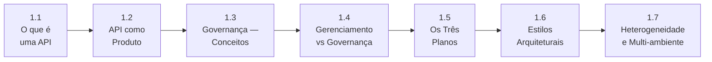

# Módulo 1 — Fundamentos

> **Série:** Gerenciamento e Governança de APIs
> **Nível:** Fundamentos
> **Pré-requisito:** Nenhum

---

## Sobre este módulo

Antes de falar em estratégias, ferramentas ou frameworks, é preciso construir o vocabulário certo. Este módulo existe por uma razão simples: boa parte dos problemas de gerenciamento e governança de APIs nas organizações não vêm de falta de tecnologia — vêm de conceitos mal compreendidos, papéis mal definidos e confusões terminológicas que se acumulam ao longo do tempo.

O Módulo 1 estabelece as bases conceituais sobre as quais todo o restante do estudo será construído. Cada capítulo responde a uma pergunta fundamental — e a sequência importa: cada conceito apoia o seguinte.

---

## Capítulos

### [1.1 · O que é uma API](cap_1_1_o_que_e_uma_api.md)

O ponto de partida. Antes de gerenciar ou governar APIs, é preciso entender o que elas são de fato — não apenas como um recurso técnico, mas como um conceito que evoluiu ao longo de décadas. O capítulo percorre a história das APIs desde as primeiras *system calls* dos anos 60 até as APIs web modernas, e oferece uma definição formal com as suas camadas essenciais: contrato, implementação e runtime.

---

### [1.2 · API como Produto](cap_1_2_api_como_produto.md)

Uma API tecnicamente funcional não é necessariamente uma boa API. Este capítulo apresenta a mudança de mentalidade que separa organizações que apenas expõem APIs daquelas que as tratam como produtos — com usuários, ciclo de vida, métricas de experiência e modelos de negócio. Aborda o papel do API Product Owner e do API Product Manager, a estratégia API-first e o conceito de Developer Experience (DX) como métrica central.

---

### [1.3 · Governança de APIs — Conceitos](cap_1_3__governanca_de_api_conceitos.md)

O que é governança, de onde vem o conceito e o que significa aplicá-lo a APIs. O capítulo parte da origem etimológica e política do termo, passa pela governança corporativa e de TI, e chega à governança de APIs com precisão: autoridade, accountability e enforcement como seus três elementos centrais. Inclui uma análise das razões pelas quais a governança de APIs falha na prática — e por que ela deve ser encarada como habilitadora, não como burocracia.

---

### [1.4 · Diferença entre Gerenciamento e Governança](cap_1_4_diferenca_gerenciamento_governanca.md)

A confusão mais comum no campo — e a mais custosa. Gerenciamento e governança coexistem no mesmo espaço, envolvem as mesmas APIs e frequentemente recaem sobre as mesmas pessoas. Mas operam em planos distintos: o gerenciamento é tático e operacional, a governança é estratégica. Este capítulo clarifica os dois conceitos, explica como se complementam e quais são as implicações práticas dessa distinção em termos de estrutura, papéis e ferramentas.

---

### [1.5 · Os Três Planos — Controle, Dados e Observabilidade](cap_1_5_tres_planos.md)

Uma das lentes conceituais mais úteis para entender a arquitetura de API Management. Originada no SDN (*Software Defined Networking*), a separação entre plano de controle, plano de dados e plano de observabilidade oferece um modelo claro para entender o que cada componente de uma plataforma de APIs faz — e por que essa separação de responsabilidades importa. O capítulo percorre a origem do conceito, detalha cada plano e mostra como os três operam em conjunto ao longo do ciclo de vida de uma API.

---

### [1.6 · Estilos Arquiteturais e suas Implicações de Governança](cap_1_6_estilos_arquiteturais.md)

A escolha entre REST, GraphQL, gRPC ou AsyncAPI não é apenas uma decisão técnica — é uma decisão de governança. Cada estilo define como contratos são especificados, como mudanças são gerenciadas, como segurança é aplicada e quais ferramentas de observabilidade fazem sentido. O capítulo analisa as implicações de governança de cada estilo e o desafio de governar portfólios heterogêneos onde múltiplos estilos coexistem.

---

### [1.7 · Heterogeneidade de Infraestrutura e Governança Multi-ambiente](cap_1_7_heterogeneidade.md)

O ideal de uma infraestrutura homogênea — um único cloud, um único gateway, um único padrão — raramente corresponde à realidade de organizações maduras. Este capítulo desmonta o mito da homogeneidade, explora as quatro dimensões da heterogeneidade (cloud, gateway, estilo arquitetural e maturidade dos times) e apresenta estratégias para governar portfólios distribuídos por múltiplos ambientes sem perder visibilidade e controle. Serve também de ponte para o Módulo 7, onde as ferramentas que viabilizam essa governança são exploradas em profundidade.

---

## Progressão conceitual

