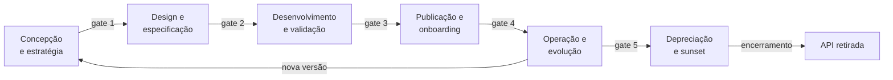
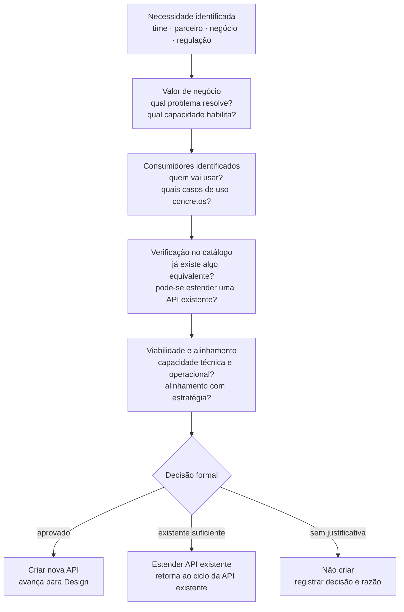
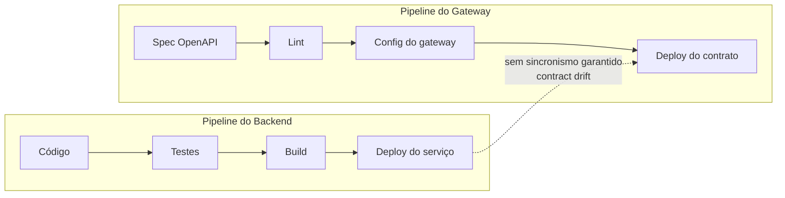
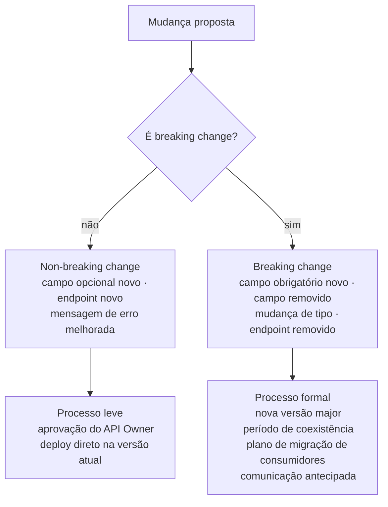
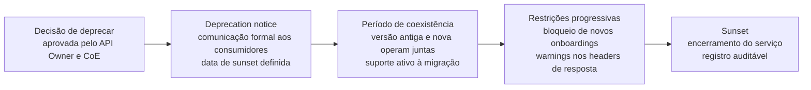
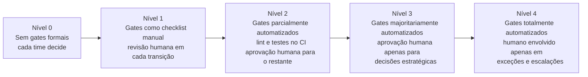
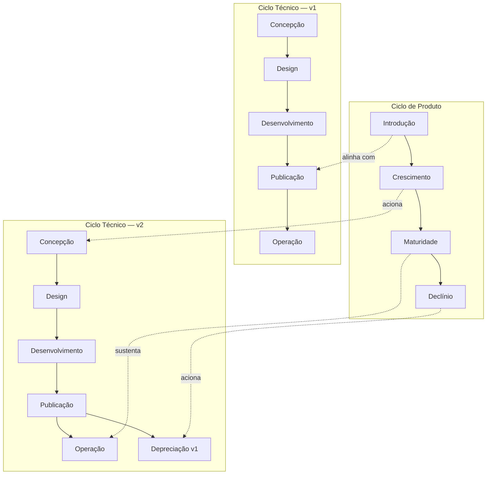
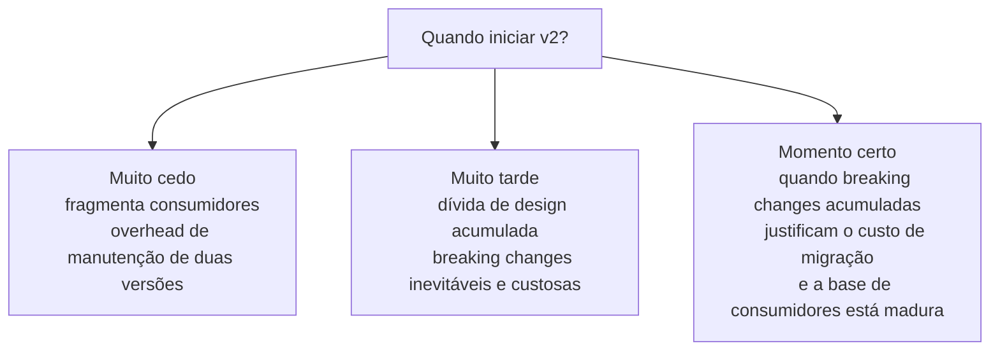
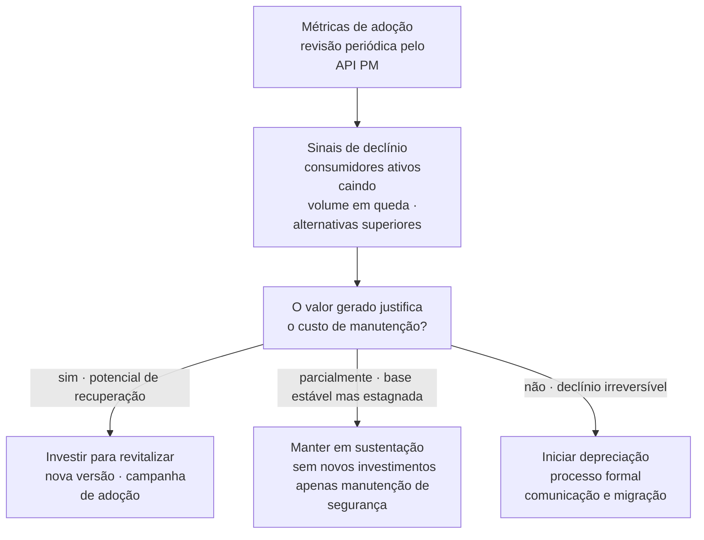

# Módulo 2 · Ciclo de Vida de APIs
## Capítulo 2.1 · As fases do ciclo de vida

> **Série:** Gerenciamento e Governança de APIs  
> **Nível:** Operacional  
> **Pré-requisito:** Módulo 1 · Fundamentos — especialmente Cap 1.2.3 e Cap 1.5.6

---

## Sumário

- [2.1.1 · O ciclo de vida como sistema — não como linha do tempo](#211--o-ciclo-de-vida-como-sistema--não-como-linha-do-tempo)
- [2.1.2 · Fase 1 — Concepção e estratégia](#212--fase-1--concepção-e-estratégia)
- [2.1.3 · Fase 2 — Design e especificação](#213--fase-2--design-e-especificação)
- [2.1.4 · Fase 3 — Desenvolvimento e validação](#214--fase-3--desenvolvimento-e-validação)
- [2.1.5 · Fase 4 — Publicação e onboarding](#215--fase-4--publicação-e-onboarding)
- [2.1.6 · Fase 5 — Operação e evolução](#216--fase-5--operação-e-evolução)
- [2.1.7 · Fase 6 — Depreciação e sunset](#217--fase-6--depreciação-e-sunset)
  - [2.1.7.1 · Gestão de resistências — consumidores externos e clientes estratégicos](#2171--gestão-de-resistências--consumidores-externos-e-clientes-estratégicos)
- [2.1.8 · Critérios de transição — gates de governança](#218--critérios-de-transição--gates-de-governança)
- [2.1.9 · A interseção dos dois ciclos na prática](#219--a-interseção-dos-dois-ciclos-na-prática)

---

## 2.1.1 · O ciclo de vida como sistema — não como linha do tempo

A primeira armadilha ao estudar o ciclo de vida de APIs é tratá-lo como uma linha do tempo simples — uma sequência de eventos que acontece uma vez, do início ao fim. Essa visão é limitante por duas razões fundamentais.

Primeira: **o ciclo de vida é iterativo**. Uma API publicada continua evoluindo — novas versões são concebidas, desenhadas e desenvolvidas enquanto a versão anterior ainda está em operação. Múltiplas instâncias do ciclo ocorrem simultaneamente para a mesma API.

Segunda: **o ciclo de vida é um sistema com regras de transição**. Cada fase tem critérios de entrada — condições que precisam ser satisfeitas para que a API entre naquela fase — e critérios de saída — condições que precisam ser satisfeitas para que a API avance para a próxima. Sem esses critérios, o ciclo de vida é apenas uma nomenclatura, não um mecanismo de governança.

O que diferencia organizações maduras não é conhecer os nomes das fases — é ter os gates de transição bem definidos, aplicados de forma consistente e, idealmente, automatizados no pipeline.

---

## 2.1.2 · Fase 1 — Concepção e estratégia

A fase de concepção é a mais negligenciada no ciclo de vida de APIs. A maioria das organizações começa o processo quando alguém já decidiu que vai construir uma API — pulando a etapa mais importante: **decidir se a API deve ser construída**.

Organizações sem um processo formal de concepção acumulam portfólios com APIs redundantes, sem consumidores claros, sem valor de negócio definido e sem ownership responsável.

---

### A pergunta central da concepção

> *Essa API deve existir — e deve ser construída por nós, agora?*

Essa pergunta desdobra-se em quatro dimensões:

**Dimensão 1 — Valor de negócio**
Qual problema de negócio essa API resolve? Qual capacidade ela habilita? Qual o valor esperado — redução de custo, aumento de receita, habilitação de parceiros, conformidade regulatória?

**Dimensão 2 — Consumidores identificados**
Quem vai consumir essa API? Times internos, parceiros específicos, o mercado aberto? Quais são seus casos de uso concretos? Uma API sem consumidor identificado é um exercício técnico — não um produto.

**Dimensão 3 — Verificação de duplicação**
Já existe uma API no catálogo que resolve o mesmo problema — ou parte dele? Esse passo é crítico e frequentemente ignorado. Organizações sem catálogo ativo acumulam APIs duplicadas que resolvem o mesmo problema de formas diferentes, criando inconsistências e custo operacional desnecessário.

**Dimensão 4 — Viabilidade e alinhamento estratégico**
Essa API está alinhada com a estratégia de plataforma da organização? Há capacidade técnica e operacional para construí-la e mantê-la?

---

### Entregáveis da fase de concepção

- **API Charter** — documento curto que registra: propósito, consumidores identificados, casos de uso, valor de negócio esperado, decisão de criar vs. reusar, owner designado
- **Registro inicial no catálogo** — com status "em concepção" — garantindo visibilidade e evitando iniciativas paralelas
- **Aprovação formal** — registro da decisão de criar, com quem aprovou e quando

---

## 2.1.3 · Fase 2 — Design e especificação

Com a concepção aprovada, o design traduz o propósito de negócio em um contrato técnico formal. O princípio de **design-first** — que exploraremos em profundidade no Cap 2.2 — se materializa aqui.

O contrato precede o código. Um contrato revisado e aprovado antes do desenvolvimento garante que:

- Consumidores identificados na concepção são consultados no design
- A revisão de governança acontece quando o custo de mudança é mínimo
- Mocks podem ser disponibilizados imediatamente para desenvolvimento paralelo

---

### O que acontece no design

**Definição do contrato** — especificação formal no estilo arquitetural escolhido: OpenAPI para REST, Schema SDL para GraphQL, `.proto` para gRPC, AsyncAPI para eventos.

**Revisão de conformidade com style guide** — validação contra o style guide da organização: nomenclatura, convenções de URL, paginação, formato de erros (RFC 7807 para REST), política de versionamento.

**Revisão de segurança** — identificação de riscos no contrato: dados sensíveis expostos desnecessariamente, ausência de autenticação em operações críticas, campos que habilitam injeção.

**Consulta aos consumidores** — os consumidores identificados na concepção são apresentados ao contrato e têm oportunidade de dar feedback. Esse passo é frequentemente pulado — e é um dos principais motivos pelos quais APIs são publicadas e não adotadas.

**Disponibilização de mocks** — com o contrato aprovado, mocks são gerados e disponibilizados no sandbox. Consumidores podem desenvolver suas integrações sem esperar a implementação.

---

### Entregáveis da fase de design

- Especificação formal aprovada (OpenAPI, AsyncAPI, Proto, SDL)
- Relatório de revisão de conformidade com style guide
- Relatório de revisão de segurança
- Feedback documentado dos consumidores consultados
- Mocks disponíveis no ambiente de sandbox
- Atualização do catálogo — status "em design"

---

## 2.1.4 · Fase 3 — Desenvolvimento e validação

Com o contrato aprovado, o desenvolvimento implementa o que foi especificado. Essa sequência parece óbvia — mas é exatamente aqui que o problema do **"elo perdido"** se manifesta.

---

### O problema do contract drift

Em muitas organizações, o pipeline de desenvolvimento do backend e o pipeline de configuração do gateway são independentes. O backend evolui em seu próprio ritmo. O contrato publicado no gateway reflete o estado da API em algum momento no passado.

Com o tempo, contrato e implementação divergem silenciosamente. Consumidores que confiam no contrato publicado encontram comportamentos diferentes na implementação real. Esse fenômeno — **contract drift** — é um dos anti-padrões mais custosos e menos visíveis em portfólios de APIs.

A separação dos pipelines cria ainda um segundo problema — menos visível mas igualmente custoso: a **perda de rastreabilidade entre Itens de Configuração (ICs) no CMDB**. Quando o backend, a spec OpenAPI e a configuração do gateway são artefatos sem relacionamento formal entre si no CMDB, a organização perde a capacidade de responder perguntas críticas de Change Management:

- *"Se eu fizer deploy do backend v2.4.0, quais APIs podem ser afetadas?"*
- *"Qual versão do backend está sustentando essa API em produção agora?"*
- *"Se esse serviço ficar indisponível, quais APIs param de funcionar?"*

Sem esses relacionamentos, a análise de impacto de mudanças é feita no escuro — ou simplesmente não é feita.

**Contract drift e perda de rastreabilidade são dois sintomas da mesma falha de governança**: ausência de Configuration Management formal para APIs. O contract testing resolve a dimensão técnica — a divergência de conteúdo. Os relacionamentos entre ICs no CMDB resolvem a dimensão de rastreabilidade. As duas soluções são complementares, não substitutas.

Essa causa raiz comum e suas soluções são tratadas em profundidade no **Cap 4.3 · Configuration Management e CMDB para APIs**. A solução técnica de contract testing é explorada no **Cap 2.3 · Contratos de API** — cobrindo tanto prevenção quanto remediação quando o problema já existe.

---

### O que acontece no desenvolvimento

**Implementação conforme o contrato** — qualquer desvio necessário deve ser tratado como mudança de contrato — revisada e aprovada antes de ser implementada.

**Testes de contrato** — testes automatizados que verificam que a implementação respeita o contrato. Executados no pipeline de CI do backend — a ponte que conecta os dois pipelines e previne o contract drift.

**Testes de segurança** — validação de que as políticas de segurança definidas no contrato estão corretamente implementadas.

**Performance baseline** — medição da latência e throughput em condições controladas. Estabelece a linha de base contra a qual o SLA será comprometido na publicação.

**Ambiente de staging** — a API é promovida para um ambiente que replica as condições de produção — incluindo a configuração do gateway — antes de qualquer acesso externo.

---

### Entregáveis da fase de desenvolvimento

- Implementação completa conforme o contrato aprovado
- Suíte de testes de contrato passando no pipeline de CI
- Relatório de testes de segurança
- Métricas de performance baseline documentadas
- API validada em ambiente de staging
- Atualização do catálogo — status "em desenvolvimento"

---

## 2.1.5 · Fase 4 — Publicação e onboarding

A fase de publicação é o momento em que a API deixa de ser um artefato interno e se torna um produto disponível para consumo.

---

### O que acontece na publicação

**Go-live controlado** — a publicação não é um evento binário. Organizações maduras fazem go-live progressivo: primeiro para consumidores internos, depois para parceiros selecionados, depois para o público geral.

**Documentação interativa** — a spec OpenAPI publicada no portal deve ser renderizada de forma interativa — permitindo que consumidores explorem endpoints e façam chamadas de teste diretamente na documentação.

**Configuração de monitoramento** — alertas de disponibilidade, latência e erros configurados antes do primeiro consumidor externo.

**Formalização do SLA** — disponibilidade, latência (p99), throughput máximo e janelas de manutenção documentados e comunicados.

**Onboarding dos primeiros consumidores** — o TTFC (Time-to-First-Call) é medido e registrado como baseline de DX.

---

### Entregáveis da fase de publicação

- API disponível em produção com gateway configurado
- Documentação interativa publicada no portal
- SLA formalizado e publicado
- Monitoramento e alertas configurados e validados
- Primeiros consumidores onboardados com sucesso
- TTFC baseline medido e registrado
- Atualização do catálogo — status "publicada · ativa"

---

## 2.1.6 · Fase 5 — Operação e evolução

A fase de operação é a mais longa do ciclo de vida. Uma API pode ficar em operação por anos, e durante esse período precisará evoluir continuamente sem quebrar os consumidores que dependem dela.

---

### Operação contínua

**Monitoramento de SLA** — disponibilidade, latência e taxa de erros monitorados continuamente. Alertas proativos detectam degradações antes que consumidores sejam impactados.

**Gestão de incidentes** — detecção, triagem, comunicação com consumidores afetados, resolução e post-mortem. Conexão direta com ITIL Incident Management — explorado no Módulo 4.

**Análise de uso** — métricas de adoção por consumidor, padrões de uso por endpoint, volumes e tendências alimentando decisões de evolução.

---

### Evolução controlada

Toda mudança precisa ser classificada antes de ser implementada:

---

### Entregáveis contínuos da fase de operação

- Relatórios periódicos de conformidade com SLA
- Registro de incidentes e post-mortems
- Análise de uso e tendências de adoção
- Backlog atualizado com feedback de consumidores
- Relatórios de revisão de segurança
- Changelog público de todas as mudanças

---

## 2.1.7 · Fase 6 — Depreciação e sunset

A depreciação é a fase mais negligenciada do ciclo de vida — e a que mais prejudica a confiança dos consumidores quando mal executada.

---

### Quando deprecar

A decisão de deprecar emerge de múltiplos sinais:

- Adoção em declínio consistente por múltiplos trimestres
- Nova versão disponível e estável com funcionalidades superiores
- Custo operacional que não se justifica pelo valor gerado
- Mudança tecnológica que torna o estilo ou protocolo obsoleto
- Requisito regulatório que exige descontinuação

---

### O processo de depreciação

**Deprecation notice** — comunicação formal e antecipada. Para APIs públicas, prazo mínimo recomendado de 6 a 12 meses. Para APIs de parceiro, prazo frequentemente definido contratualmente.

**Período de coexistência** — a versão antiga continua funcionando enquanto consumidores migram. Novos onboardings são bloqueados; consumidores existentes continuam sendo servidos.

**Restrições progressivas** — headers de deprecation nas respostas, redução gradual de rate limits, comunicações de lembrete periódicas.

**Sunset e arquivamento** — processo documentado e auditável. Em setores regulados, esse registro tem importância legal.

---

### Entregáveis da fase de depreciação

- Decisão formal registrada com justificativa
- Deprecation notice comunicado a todos os consumidores identificados
- Data de sunset publicada no catálogo e na documentação
- Relatório periódico de consumidores que ainda não migraram
- Registro de encerramento arquivado no catálogo

---

## 2.1.7.1 · Gestão de resistências — consumidores externos e clientes estratégicos

Deprecar uma API consumida por clientes externos é fundamentalmente diferente de deprecar uma API interna. Clientes externos têm seus próprios roadmaps, seus próprios orçamentos e frequentemente contratos comerciais que garantem continuidade de serviço.

---

### As três dimensões do problema

**Dimensão técnica**
Consumidores precisam de tempo real para migrar. Esse tempo depende da complexidade da mudança, do tamanho do time, das dependências internas e da prioridade que a migração recebe. Uma empresa com 500 engenheiros migra de forma diferente de uma startup com 5.

**Dimensão de gestão de mudança**
Consumidores resistem quando se sentem surpreendidos, quando não entendem o motivo da mudança ou quando o custo da migração é alto e o benefício para eles é percebido como baixo. A resistência frequentemente é a resposta racional de um consumidor que recebeu uma demanda de trabalho não planejada, sem aviso adequado.

**Dimensão de negócio e relacionamento**
Clientes estratégicos têm poder de negociação. Essa assimetria precisa ser reconhecida e gerenciada com critérios claros — não com decisões ad hoc que criam percepção de favoritismo.

---

### O papel dual da governança

```mermaid
flowchart TD
    dep["Processo de depreciação
    com consumidores externos"]

    gov_boa["Governança bem feita"]
    gov_ruim["Governança mal feita"]

    prev["Previsibilidade
    políticas claras e publicadas
    consumidores sabem o que esperar"]

    surpresa["Surpresa
    prazos arbitrários
    consumidores descobrem tarde"]

    suporte["Suporte estruturado
    comunicação direcionada
    programa de migração"]

    caos["Caos
    comunicação genérica
    sem dados de quem migrou"]

    confianca["Resultado
    resistência baixa · migração controlada
    relacionamento preservado"]

    crise["Resultado
    resistência alta · migração caótica
    relacionamento danificado"]

    dep --> gov_boa
    dep --> gov_ruim
    gov_boa --> prev --> suporte --> confianca
    gov_ruim --> surpresa --> caos --> crise
```

**Governança bem feita previne e facilita** — políticas claras de depreciação com prazos mínimos, catálogo atualizado com visibilidade de quem consome o quê, processo de exceção formal e transparente.

**Governança mal feita amplifica o problema** — depreciação decidida unilateralmente, prazos arbitrários, consumidores notificados por canais incorretos ou descobrindo a depreciação por falha em produção.

---

### Estratégias para gestão de resistências

**Segmentação de consumidores por criticidade**

| Segmento | Critério | Abordagem |
|---|---|---|
| **Crítico** | Alto volume · receita estratégica · integração complexa | Plano de migração dedicado · suporte técnico direto · prazo negociado individualmente |
| **Relevante** | Volume médio · integração moderada | Suporte via canal dedicado · webinars · documentação detalhada |
| **Padrão** | Baixo volume · integração simples | Documentação self-service · FAQ · prazo padrão da política |

**Comunicação em múltiplas camadas**
- Anúncio formal com data de sunset, razão, alternativa e recursos de migração
- Headers de deprecation nas respostas — sinalizando para sistemas automatizados
- Comunicações periódicas de lembrete para consumidores que ainda não migraram
- Outreach proativo para consumidores críticos que não responderam

**Programa de suporte à migração**
Guias detalhados, sandbox estendido, office hours técnicas, SDKs de migração que facilitam a transição.

**Processo de exceção formal e transparente**
Define: quem pode solicitar extensão, quais critérios justificam, qual o prazo máximo possível, quem aprova. Esse processo precisa ser publicado antes que qualquer depreciação seja anunciada.

---

### A decisão mais difícil

Mesmo com todo o suporte e prazo adequados, haverá consumidores que chegam ao sunset sem ter migrado. Essa decisão — adiar o sunset, conceder extensão individual ou manter a data — precisa ser tomada com critérios predefinidos, não improvisados no momento.

> **O processo de depreciação é onde a governança de APIs encontra a gestão de clientes de forma mais direta. Uma governança que funciona bem aqui não apenas facilita a migração técnica — constrói confiança de que a organização é uma parceira responsável.**

Este tema será aprofundado em:
- **Cap 2.5** · Processo completo de depreciação com foco operacional
- **Cap 3.4** · Políticas formais de depreciação — prazos, comunicação, exceções
- **Cap 4.3** · Depreciação como mudança planejada no ITIL

---

## 2.1.8 · Critérios de transição — gates de governança

Os gates de transição são o mecanismo que transforma o ciclo de vida de uma nomenclatura em um sistema de governança.

---

### Gate 1 — Concepção → Design

| Critério | Verificação manual | Automação possível |
|---|---|---|
| API Charter aprovado pelo API Owner | Aprovação no sistema de workflow | Workflow automatizado com notificação |
| Verificação de duplicação no catálogo concluída | Busca manual no catálogo | Busca automatizada por similaridade semântica |
| Pelo menos um consumidor identificado | Revisão pelo CoE | Validação de campo obrigatório no Charter |
| Owner designado e registrado no catálogo | Revisão pelo CoE | Validação de campo obrigatório no catálogo |

### Gate 2 — Design → Desenvolvimento

| Critério | Verificação manual | Automação possível |
|---|---|---|
| Especificação válida | Revisão pelo API Steward | Lint automatizado (Spectral, Buf) no PR |
| Conformidade com style guide sem erros críticos | Revisão pelo API Steward | Spectral com ruleset customizado no CI |
| Revisão de segurança concluída | Revisão pelo time de InfoSec | 42Crunch ou OWASP ZAP no pipeline |
| Feedback de consumidores documentado | Revisão pelo API Owner | Checklist obrigatório no PR |
| Mocks disponíveis no sandbox | Verificação manual | Geração automática a partir da spec |

### Gate 3 — Desenvolvimento → Publicação

| Critério | Verificação manual | Automação possível |
|---|---|---|
| Testes de contrato passando no CI | Revisão do relatório de CI | Pact / Dredd / Schemathesis no pipeline |
| Testes de segurança passando | Revisão do relatório | OWASP ZAP / 42Crunch no pipeline |
| Performance baseline dentro do SLA esperado | Revisão manual | Testes de carga automatizados (k6, Gatling) |
| API validada em ambiente de staging | Aprovação do API Owner | Smoke tests automatizados pós-deploy |
| Documentação interativa publicada | Verificação manual | Geração automática a partir da spec OpenAPI |

### Gate 4 — Publicação → Operação

| Critério | Verificação manual | Automação possível |
|---|---|---|
| Monitoramento e alertas configurados | Verificação manual | Alertas provisionados via IaC |
| SLA formalizado e publicado | Aprovação do API Owner | Validação de campo obrigatório no catálogo |
| Primeiros consumidores onboardados | Confirmação manual | TTFC medido e registrado automaticamente |
| Catálogo atualizado com status "ativa" | Atualização manual | Atualização automática via pipeline |

### Gate 5 — Operação → Depreciação

| Critério | Verificação manual | Automação possível |
|---|---|---|
| Decisão de deprecar aprovada pelo API Owner e CoE | Aprovação no workflow | Workflow com múltiplos aprovadores |
| Alternativa disponível e documentada | Revisão pelo CoE | Validação de campo obrigatório na solicitação |
| Todos os consumidores identificados e notificados | Verificação manual | Notificação automática para consumidores do catálogo |
| Data de sunset publicada | Atualização manual | Atualização automática no catálogo e portal |

---

### A progressão da automação

> A automação dos gates não elimina o julgamento humano — elimina a verificação mecânica que consome tempo e é inconsistentemente aplicada. Decisões estratégicas continuam sendo humanas. O que a automação garante é que os critérios objetivos sejam sempre verificados.

A progressão de maturidade dos gates é explorada no **Módulo 6 · Maturidade de APIs**. A implementação técnica — ferramentas e configurações de pipeline — no **Módulo 7 · Ferramentas & Padrões**.

---

## 2.1.9 · A interseção dos dois ciclos na prática

O Cap 1.2.3 estabeleceu que o ciclo técnico e o ciclo de produto são dimensões distintas que operam simultaneamente. Aqui aprofundamos essa relação de forma operacional — mostrando como cada fase de produto influencia as fases técnicas e quais tensões emergem da interseção.

---

### Introdução × Fases técnicas

Quando uma API entra em produção pela primeira vez, está simultaneamente na fase técnica de Publicação/Operação e na fase de produto de Introdução. O monitoramento nesse momento não é só técnico — é também de adoção. TTFC, taxa de abandono no onboarding e volume de tickets são tão importantes quanto disponibilidade e latência.

Uma breaking change na fase de Introdução — quando poucos consumidores ainda integraram — é muito menos custosa do que na Maturidade. Essa janela deve ser usada conscientemente para corrigir problemas de design que só aparecem em uso real.

---

### Crescimento × Fases técnicas

O crescimento é a fase onde a tensão entre os dois ciclos é mais intensa. A adoção está acelerando, novos casos de uso emergindo, feedback rico chegando. E é exatamente nesse momento que as limitações do design original se tornam visíveis.

A tensão central: produto quer adicionar features rapidamente; técnico precisa proteger consumidores existentes. A decisão mais importante nessa fase — quando iniciar uma versão major — é uma **decisão de produto**, não apenas técnica:

---

### Maturidade × Fases técnicas

A maturidade é a fase mais longa e a que recebe menos atenção estratégica. A complacência é o risco central — manifestando-se como dívida técnica acumulada, segurança não revisada e dependências obsoletas.

A maturidade exige um programa de saúde técnica — revisões periódicas de segurança, dependências e conformidade com o style guide atual. Do ponto de vista de produto, é também o momento de avaliar se a API ainda gera valor suficiente para justificar o investimento.

---

### Declínio × Fases técnicas

O declínio é a fase onde a desconexão entre os dois ciclos é mais frequente e mais custosa. Tecnicamente a API está em plena operação. Do ponto de vista de produto, a adoção está caindo e a justificativa de investimento se deteriorando.

O anti-padrão mais comum: a API permanece em operação indefinidamente — tecnicamente ativa, estrategicamente morta. Em portfólios grandes, APIs em declínio não depreciadas podem representar 20 a 30% do custo operacional total.

O declínio de produto deve ser um trigger formal para o processo de avaliação de depreciação técnica:

---

### As três tensões permanentes

**Tensão 1 — Velocidade de produto vs. estabilidade técnica**
Produto quer evoluir rápido. Técnico quer proteger consumidores. Resolução: classificação de mudanças — velocidade para non-breaking, cautela para breaking.

**Tensão 2 — Demanda de consumidores vs. visão de produto**
Consumidores pedem features baseadas em necessidades imediatas. O API PM tem visão de longo prazo. Resolução: processo de feedback estruturado que informa — mas não determina — o roadmap.

**Tensão 3 — Custo técnico vs. valor de produto**
Quando o valor de produto de uma API está em declínio, o custo técnico de mantê-la começa a superar o valor gerado. Resolução: revisão periódica que conecta métricas de produto a decisões de investimento técnico.

> **Os dois ciclos são complementares, não competitivos. O ciclo técnico sem o ciclo de produto gera APIs que funcionam mas não geram valor. O ciclo de produto sem o ciclo técnico gera visão sem execução responsável. A maturidade em gestão de APIs é, em grande parte, a capacidade de navegar as tensões entre os dois ciclos de forma consciente e equilibrada.**

---

## Pontos-chave do capítulo

- O ciclo de vida de APIs é um sistema com gates de transição — não uma linha do tempo. Sem critérios de entrada e saída, é apenas nomenclatura
- A fase de concepção é a mais negligenciada — e a mais importante para evitar portfólios com APIs redundantes, sem consumidores e sem valor de negócio
- O contract drift — divergência silenciosa entre contrato e implementação — é um dos anti-padrões mais custosos. Surge da ausência de sincronismo entre pipelines de backend e gateway
- Gates de governança devem ser apresentados como checklists concretas e evoluir progressivamente de verificação manual para automação no pipeline
- A depreciação de APIs com consumidores externos exige gestão de resistências — com segmentação por criticidade, comunicação em múltiplas camadas e processo de exceção formal
- A governança tem papel dual na depreciação: bem feita, previne resistências; mal feita, as amplifica
- Os ciclos técnico e de produto operam simultaneamente com três tensões permanentes: velocidade vs. estabilidade, demanda vs. visão, custo técnico vs. valor de produto

---

## Próximo capítulo

**2.2 · Design-first vs. Code-first** — por que a ordem entre contrato e código importa para governança, como design-first previne o contract drift e por que ele não resolve sozinho sem sincronismo de pipelines.

---

*Série: Gerenciamento e Governança de APIs · Módulo 2 · Capítulo 2.1*