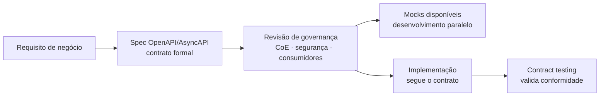
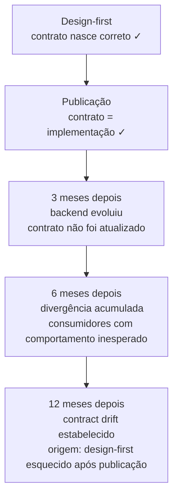
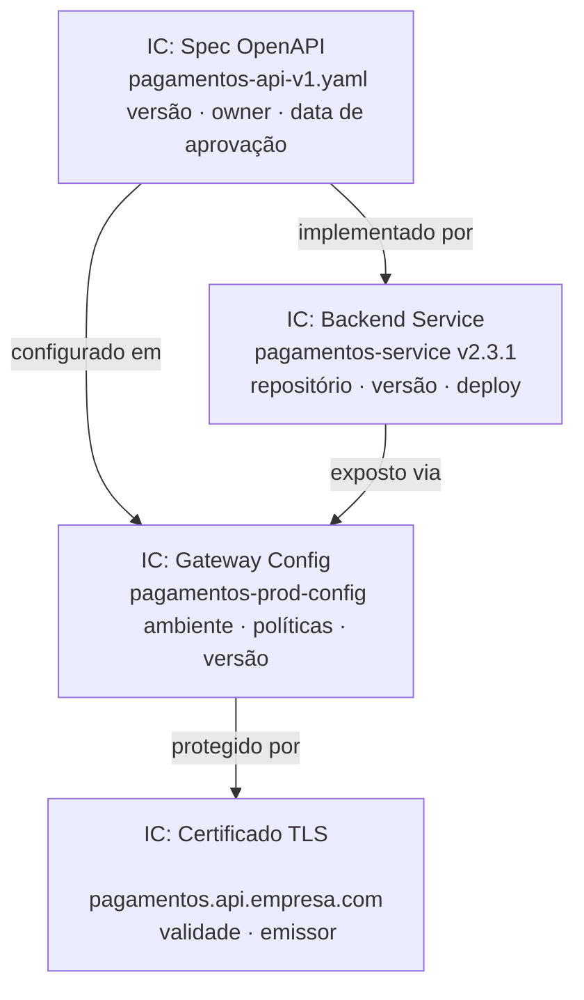
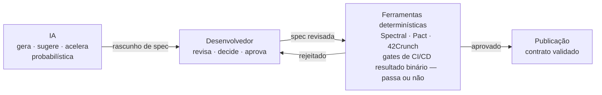

# Módulo 2 · Ciclo de Vida de APIs
## Capítulo 2.2 · Design-first vs. Code-first

> **Série:** Gerenciamento e Governança de APIs  
> **Nível:** Operacional  
> **Pré-requisito:** Cap 2.1 · As fases do ciclo de vida

---

## Sumário

- [2.2.1 · O que significa design-first e code-first](#221--o-que-significa-design-first-e-code-first)
- [2.2.2 · Design-first como prática de governança](#222--design-first-como-prática-de-governança)
- [2.2.3 · Code-first — a ansiedade da materialização](#223--code-first--a-ansiedade-da-materialização)
- [2.2.4 · Design-first não resolve sozinho — o problema do sincronismo](#224--design-first-não-resolve-sozinho--o-problema-do-sincronismo)
- [2.2.5 · Design-first e rastreabilidade no CMDB](#225--design-first-e-rastreabilidade-no-cmdb)
- [2.2.6 · A abordagem pragmática — calibrando o processo pelo risco](#226--a-abordagem-pragmática--calibrando-o-processo-pelo-risco)
- [2.2.7 · IA no processo de design-first — acelerador com guardrails](#227--ia-no-processo-de-design-first--acelerador-com-guardrails)

---

## 2.2.1 · O que significa design-first e code-first

A distinção entre design-first e code-first parece simples na superfície — em um você escreve a spec antes do código, no outro você escreve o código antes da spec. Mas essa simplificação esconde o que realmente diferencia os dois modelos: **a ordem em que as decisões são tomadas e quem as toma**.

---

### Design-first

No modelo design-first, o contrato da API — especificação OpenAPI, AsyncAPI, Protocol Buffers ou GraphQL SDL — é o **artefato primário**. Ele é escrito, revisado e aprovado antes que qualquer linha de código de implementação seja produzida.

Isso significa que:

- As decisões de design — nomenclatura de recursos, estrutura de payloads, modelos de erro, estratégia de versionamento — são tomadas de forma deliberada e colaborativa, não como efeito colateral do desenvolvimento
- O contrato pode ser revisado pelo CoE, pelo time de segurança e pelos consumidores potenciais antes do custo de implementação ser incorrido
- Mocks gerados a partir da spec permitem que consumidores desenvolvam em paralelo — sem esperar a implementação
- A spec se torna o documento de referência que governa toda a implementação subsequente

---

### Code-first

No modelo code-first, o código de implementação é o **artefato primário**. A spec — quando existe — é gerada a partir do código, frequentemente de forma automática por ferramentas de anotação ou reflexão.

Isso significa que:

- As decisões de design são tomadas implicitamente durante o desenvolvimento — frequentemente por um único desenvolvedor, sem revisão de governança
- A spec gerada reflete o que foi implementado, não necessariamente o que deveria ter sido implementado
- Consumidores só têm acesso ao contrato depois que a implementação está pronta
- Mudanças de design identificadas tardiamente têm custo muito maior — o código já existe

---

## 2.2.2 · Design-first como prática de governança

A escolha pelo design-first não é apenas uma boa prática de engenharia — é uma **decisão de governança**. Cada vantagem técnica do design-first tem uma contrapartida direta em termos de controle, qualidade e rastreabilidade.

---

### Governança no momento certo

O princípio de **shift-left** — antecipar verificações para o início do processo — é bem estabelecido em qualidade de software. Design-first é shift-left aplicado à governança de APIs.

O custo de identificar um problema de design varia dramaticamente conforme a fase do ciclo de vida:

| Fase | Custo relativo de mudança | O que precisa ser alterado |
|---|---|---|
| **Spec não aprovada** | 1x | Editar o arquivo YAML/JSON |
| **Spec aprovada, mock gerado** | 3x | Spec + mock + notificar consumidores |
| **Implementação em desenvolvimento** | 10x | Spec + mock + código + testes |
| **Em staging** | 25x | Tudo acima + pipeline + validações |
| **Em produção com consumidores** | 100x+ | Tudo acima + breaking change + migração |

Design-first garante que problemas de design são identificados quando o custo de mudança é 1x — não quando é 100x.

---

### Contrato como artefato de revisão

Com design-first, a spec se torna o objeto central das revisões de governança. O CoE pode revisar nomenclatura, o time de segurança pode identificar exposição de dados sensíveis, os consumidores podem validar se o design atende seus casos de uso — tudo isso antes de qualquer implementação.

Isso transforma a revisão de governança de um gate burocrático em uma **atividade de valor real** — onde o feedback chegando cedo realmente muda a qualidade do produto final.

---

### Documentação que não fica obsoleta

No code-first, a documentação é frequentemente gerada automaticamente e depois esquecida. Quando o código evolui, a documentação muitas vezes não acompanha.

No design-first, a spec é o contrato que governa a implementação. Quando a spec muda, a implementação precisa mudar para se conformar. A spec não é documentação do código — é a fonte de verdade que o código precisa seguir.

---

## 2.2.3 · Code-first — a ansiedade da materialização

Para tratar code-first de forma honesta, é necessário entender por que ele acontece — e resistir à tentação de tratá-lo apenas como falta de disciplina.

---

### A ansiedade de materialização

Existe uma pressão psicológica real no processo de desenvolvimento que design-first às vezes exacerba: **a dificuldade de tomar decisões de design de forma abstrata, sem ver o que está sendo construído**.

Muitos desenvolvedores — e times inteiros — pensam melhor sobre design quando têm algo concreto para reagir. Um endpoint funcionando, mesmo que imperfeito, revela aspectos do problema que uma spec abstrata não revelou. A prototipação e a experimentação têm valor cognitivo real.

Há também uma dimensão de **confiança**: times sem experiência com design-first frequentemente subestimam quanto conseguem decidir no nível da spec antes do código. A ansiedade de "não saber o suficiente para escrever a spec" leva ao code-first como atalho cognitivo.

E há a pressão organizacional: **"temos que mostrar algo funcionando"**. Stakeholders que querem ver progresso concreto criam pressão para materialização rápida — e uma spec OpenAPI, por mais bem escrita que seja, raramente satisfaz essa pressão da mesma forma que um endpoint respondendo.

---

### Quando code-first é legítimo

Há situações onde code-first faz sentido:

**Projetos exploratórios e spikes** — quando o objetivo é entender se algo é tecnicamente viável, não entregar um produto. Um spike de uma semana pode ser code-first; o produto que emerge do spike deveria ser design-first.

**APIs internas experimentais** — APIs de baixo impacto, consumidas por um único time interno em experimentação, onde o custo de retrabalho é baixo e a velocidade importa mais que a consistência.

**Prototipação com consumidores** — quando o objetivo é colocar algo na mão de consumidores potenciais para coletar feedback de design antes de formalizar o contrato. O protótipo code-first alimenta o design-first subsequente.

O problema não é o code-first em si — é o code-first **sem consciência de que é temporário**, sem um processo de formalização do contrato antes da publicação para consumo real.

---

### O code-first irresponsável

Em contraste, o code-first problemático é aquele que:

- Não tem intenção de formalizar o contrato antes da publicação
- Gera specs automaticamente e as publica como se fossem resultado de design deliberado
- Toma decisões de design por conveniência técnica em vez de necessidade do consumidor
- Não passa por nenhuma revisão de governança antes de chegar a consumidores externos

Esse é o code-first que acumula dívida de design — inconsistências que os consumidores precisam aprender e que se tornam cada vez mais caras de corrigir à medida que a base de consumidores cresce.

---

## 2.2.4 · Design-first não resolve sozinho — o problema do sincronismo

> **Design-first garante que o contrato nasce correto. Não garante que permanece correto.**

Uma organização pode adotar design-first com rigor total — spec revisada, aprovada, mocks gerados, consumidores consultados. E ainda assim, meses depois de publicada, a implementação diverge do contrato. Não por negligência maliciosa, mas por uma falha estrutural nos processos subsequentes.

---

### O problema dos pipelines desconectados

Como vimos no Cap 2.1.4, quando o pipeline de desenvolvimento do backend e o pipeline de configuração do gateway são independentes, o contrato e a implementação podem divergir silenciosamente após o lançamento.

Design-first resolve o problema na origem — mas não resolve o problema ao longo do tempo. Cada vez que o backend é atualizado sem que o contrato seja atualizado correspondentemente, o design-first inicial se torna irrelevante.

---

### O que completa o design-first

Design-first é a fundação. Para que a fundação se mantenha ao longo do tempo, três práticas precisam coexistir:

**Contract testing contínuo** — testes automatizados que verificam, a cada build do backend, que a implementação ainda respeita o contrato publicado. Se o backend evoluiu de forma incompatível com o contrato, o pipeline falha — forçando uma decisão consciente: atualizar o contrato ou reverter a mudança.

**Processo de change management para contratos** — qualquer mudança no backend que afete o comportamento da API precisa passar pelo mesmo processo de revisão que a spec original. Mudanças de contrato têm impacto em consumidores.

**Sincronismo de pipelines** — os dois pipelines — backend e gateway — precisam de pontos de integração que garantam que deployments inconsistentes sejam detectados antes de chegar a produção.

> Design-first sem contract testing contínuo é uma boa intenção sem mecanismo de enforcement. O design-first é o "o quê" — o contract testing é o "como garantimos que permanece verdadeiro".

---

## 2.2.5 · Design-first e rastreabilidade no CMDB

Uma dimensão do design-first raramente discutida nas conversas técnicas — mas central para governança madura — é sua contribuição para a rastreabilidade entre Itens de Configuração no CMDB.

Quando uma organização adota design-first, um artefato formal é criado e aprovado **antes** do desenvolvimento começar. Esse artefato não é apenas documentação — é um **IC formal** que pode ser registrado no CMDB com relacionamentos explícitos:

Com esses relacionamentos no CMDB desde o início do ciclo de vida, a organização consegue responder perguntas críticas de análise de impacto:

- *"Se eu atualizar o backend de v2.3.1 para v2.4.0, quais APIs podem ser afetadas?"*
- *"Qual spec governa esse gateway config?"*
- *"Se esse certificado TLS expirar, quais APIs ficam indisponíveis?"*

**Design-first cria o IC no momento certo** — quando as decisões de design estão sendo tomadas, quando o ownership está sendo definido, quando o contrato está sendo aprovado. Esse é o momento ideal para estabelecer os relacionamentos no CMDB que vão sustentar a análise de impacto ao longo de todo o ciclo de vida.

Code-first não tem esse ponto de partida natural. A spec é gerada depois — frequentemente sem o processo formal de criação de IC no CMDB. O relacionamento entre artefatos precisa ser reconstruído retroativamente, se é que é feito.

> O tratamento completo de Configuration Management e modelagem de ICs para APIs está no **Cap 4.3 · Configuration Management e CMDB para APIs**.

---

## 2.2.6 · A abordagem pragmática — calibrando o processo pelo risco

Reconhecer o valor do design-first não significa aplicá-lo com o mesmo rigor em toda situação. A calibração pelo risco é o que separa uma governança madura de uma governança burocrática. O objetivo não é maximizar o processo — é aplicar o processo certo para o risco certo.

---

### Os fatores de risco que calibram o processo

**Audiência** — API pública exige processo completo. API de parceiro exige processo intermediário. API interna experimental pode ter processo mais leve.

**Impacto de negócio** — APIs que movimentam dinheiro, dados pessoais ou processos críticos exigem mais rigor do que APIs de consulta de dados não sensíveis.

**Número de consumidores esperados** — quanto mais consumidores, mais cara é uma mudança de design tardia. Uma API que vai ter 1000 consumidores justifica muito mais investimento em design-first do que uma que vai ter 3.

**Reversibilidade** — APIs que podem ser substituídas facilmente têm menor custo de erro do que APIs que criam dependências profundas nos sistemas dos consumidores.

---

### A escala de rigor

Não é design-first ou code-first — é um espectro de rigor de processo:

| Nível | Contexto | Processo |
|---|---|---|
| **1 · Experimental** | Spike · prototipação · exploração técnica | Code-first com compromisso de formalizar antes de qualquer consumidor externo |
| **2 · Interno** | API interna · baixo impacto · time único | Design-first simplificado · revisão pelo API Owner · sem aprovação do CoE |
| **3 · Parceiro** | API de parceiro · impacto médio | Design-first completo · revisão CoE · consumidores consultados · contract testing obrigatório |
| **4 · Público** | API pública · alto impacto · muitos consumidores | Design-first rigoroso · revisão CoE + segurança · consumidores beta · ICs no CMDB · change management formal |

A governança define qual nível se aplica a qual tipo de API — e o CoE é o órgão que mantém essa calibração atualizada conforme o portfólio evolui.

---

## 2.2.7 · IA no processo de design-first — acelerador com guardrails

A proliferação de ferramentas de IA generativa — GitHub Copilot, Claude Code, Devin e similares — está mudando a dinâmica do design-first de uma forma que a governança precisa reconhecer e endereçar.

---

### O paradoxo da IA no design de APIs

A IA amplifica os dois lados do problema simultaneamente.

Do lado do **code-first irresponsável**: um desenvolvedor com acesso a ferramentas de IA consegue ter um endpoint funcionando em minutos. A ansiedade de materialização é amplificada. A barreira de entrada para "vamos codar e ver" ficou ainda mais baixa.

Do lado do **design-first responsável**: as mesmas ferramentas conseguem gerar um rascunho de spec OpenAPI a partir de uma descrição em linguagem natural, identificar inconsistências em um contrato existente, sugerir melhorias de nomenclatura, detectar potenciais breaking changes.

A IA não resolve o problema — ela amplifica a escolha. Times com boa cultura de design-first vão usar IA para fazer design-first mais rápido. Times com cultura de code-first vão usar IA para fazer code-first mais rápido.

**A governança é o que determina em qual direção a IA amplifica.**

---

### IA como acelerador do design-first

Ferramentas de IA podem contribuir de forma concreta em cada etapa do processo:

**Geração de rascunho de spec** — a partir de uma descrição do caso de uso em linguagem natural, ferramentas de IA podem gerar um rascunho de spec OpenAPI que o designer revisa e refina. Não substitui o designer — elimina o trabalho mecânico de partir do zero.

**Revisão de conformidade** — IA pode verificar se um contrato respeita o style guide da organização, identificar inconsistências de nomenclatura, sugerir melhorias de estrutura. Complementa — não substitui — a revisão humana do CoE.

**Detecção de breaking changes** — ao comparar duas versões de uma spec, ferramentas de IA podem identificar mudanças que potencialmente quebram consumidores existentes — inclusive mudanças sutis que ferramentas puramente determinísticas podem não capturar.

**Geração de exemplos e casos de teste** — a partir da spec aprovada, IA pode gerar exemplos de requisições e respostas, casos de teste e cenários de edge case que enriquecem a documentação e facilitam o onboarding de consumidores.

---

### MCP como base de conhecimento organizacional

Uma das aplicações mais poderosas de IA no contexto de governança de APIs é o uso de **MCP (Model Context Protocol)** para expor o conhecimento organizacional como contexto para ferramentas de IA.

Com um MCP que expõe o catálogo de APIs, o style guide e as políticas como base de conhecimento, um desenvolvedor pode perguntar à sua ferramenta de IA:

- *"Já existe uma API no catálogo que resolve esse problema?"*
- *"Como outras APIs da organização estruturam recursos de paginação?"*
- *"Quais são as políticas de segurança obrigatórias para APIs financeiras na nossa organização?"*

A IA responde a partir do contexto real da organização — não de padrões genéricos de mercado. O CoE, nesse modelo, não é apenas o órgão que define políticas — é o **produtor de bases de conhecimento** que alimentam as ferramentas que os desenvolvedores usam no dia a dia.

> O ecossistema completo de ferramentas de IA aplicadas à governança de APIs — incluindo MCPs organizacionais, ferramentas de geração de specs e validação assistida — será explorado em profundidade no **Módulo 7**.

---

### Guardrails determinísticos são inegociáveis

A IA é probabilística por natureza — ela gera o que parece correto, não necessariamente o que é correto. Uma spec gerada por IA pode parecer bem estruturada e ainda ter inconsistências sutis, violar o style guide em pontos específicos ou introduzir padrões que conflitam com o portfólio existente.

Por isso, **ferramentas determinísticas são os guardrails obrigatórios** que validam o que a IA gerou:

A IA não é o guardião da qualidade — é o acelerador do processo. O guardião continua sendo a combinação de revisão humana e ferramentas determinísticas. Qualquer modelo de governança que usa IA como gate de qualidade sem validação determinística está criando risco invisível.

> **IA acelera. Ferramentas determinísticas validam. MCP contextualiza. Governança define os limites de cada um.**

---

## Pontos-chave do capítulo

- Design-first e code-first diferem na ordem em que as decisões são tomadas — e em quem as toma. Design-first é governança shift-left: problemas identificados quando o custo de mudança é 1x, não 100x
- Code-first não é apenas falta de disciplina — é frequentemente uma resposta legítima à ansiedade de materialização e à necessidade de prototipação. O problema é o code-first sem consciência de que é temporário
- Design-first garante que o contrato nasce correto — mas não garante que permanece correto. Contract testing contínuo e sincronismo de pipelines são o que completam a prática
- Design-first cria o IC formal no CMDB no momento certo — estabelecendo desde o início os relacionamentos que habilitam análise de impacto ao longo de todo o ciclo de vida
- A calibração pelo risco é o que separa governança madura de burocracia: nível experimental, interno, parceiro e público exigem rigor crescente de processo
- IA amplifica a escolha — não a resolve. Times com cultura de design-first usam IA para fazer design-first mais rápido. Ferramentas determinísticas são os guardrails inegociáveis que validam o que a IA gerou
- MCP como camada de conhecimento organizacional transforma o CoE em produtor de contexto que alimenta as ferramentas de IA dos desenvolvedores

---

## Próximo capítulo

**2.3 · Contratos de API: OpenAPI, AsyncAPI e gRPC** — os formatos de especificação que materializam o design-first, como cada um funciona, e como o contract testing garante o sincronismo entre contrato e implementação — incluindo prevenção e remediação do contract drift.

---

*Série: Gerenciamento e Governança de APIs · Módulo 2 · Capítulo 2.2*