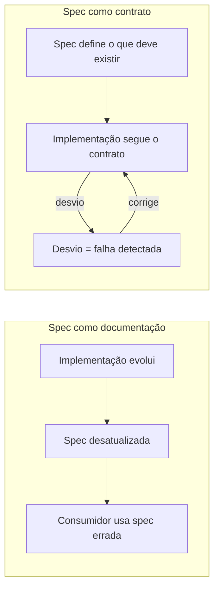
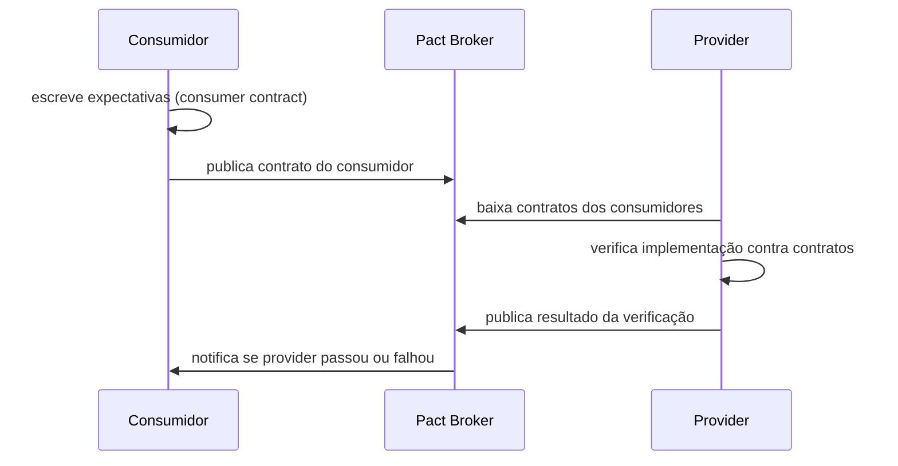
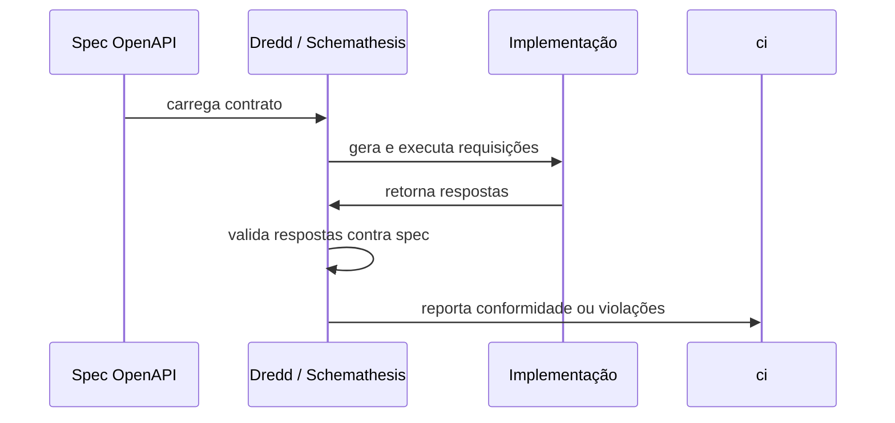
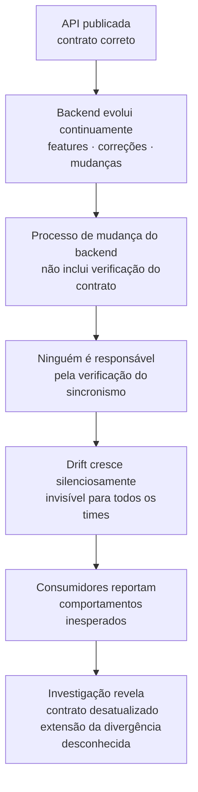
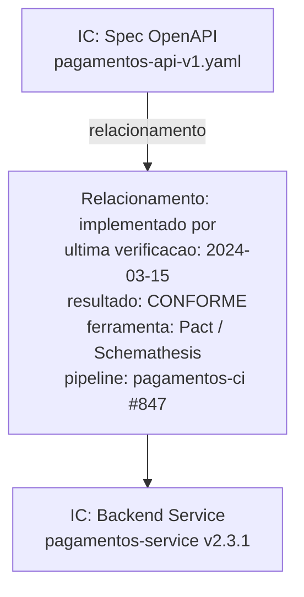

# Módulo 2 · Ciclo de Vida de APIs
## Capítulo 2.3 · Contratos de API: OpenAPI, AsyncAPI e gRPC

> **Série:** Gerenciamento e Governança de APIs
> **Nível:** Operacional
> **Pré-requisito:** Cap 2.2 · Design-first vs. Code-first

---

## Sumário

- [2.3.1 · O contrato como artefato de governança](#231--o-contrato-como-artefato-de-governança)
- [2.3.2 · OpenAPI — o contrato REST](#232--openapi--o-contrato-rest)
- [2.3.3 · AsyncAPI — o contrato event-driven](#233--asyncapi--o-contrato-event-driven)
- [2.3.4 · Protocol Buffers — o contrato gRPC](#234--protocol-buffers--o-contrato-grpc)
- [2.3.5 · Contract testing — consumer-driven vs. provider-driven](#235--contract-testing--consumer-driven-vs-provider-driven)
- [2.3.6 · Contract drift por omissão de governança](#236--contract-drift-por-omissão-de-governança)
- [2.3.7 · Contract testing e rastreabilidade no CMDB](#237--contract-testing-e-rastreabilidade-no-cmdb)

---

## 2.3.1 · O contrato como artefato de governança

Existe uma confusão persistente e custosa no mercado: tratar a especificação de uma API como documentação. As duas coisas parecem iguais — ambas descrevem a API em texto estruturado — mas têm naturezas fundamentalmente diferentes.

**Documentação** descreve o que existe. É escrita depois, pode estar desatualizada, é orientada ao leitor humano e não tem valor normativo sobre a implementação.

**Contrato** define o que deve existir. É escrito antes, é a fonte de verdade que governa a implementação e tem valor normativo — qualquer desvio da implementação em relação ao contrato é, por definição, uma falha.

Essa distinção não é semântica. Ela define quem tem razão quando a implementação e a spec divergem. Se a spec é documentação, a implementação tem razão — a spec está desatualizada. Se a spec é contrato, a implementação está errada — ela desviou do acordo estabelecido.

Organizações que tratam specs como documentação acumulam contract drift silenciosamente. Organizações que tratam specs como contratos têm um mecanismo de governança que detecta e previne o drift.



Esta distinção é o fundamento de todo este capítulo — e de todo o processo de contract testing que exploraremos adiante.

---

## 2.3.2 · OpenAPI — o contrato REST

OpenAPI é o formato de especificação de APIs REST mais adotado no mercado. Nasceu como Swagger em 2011, foi doado para a Linux Foundation em 2016 e renomeado para OpenAPI Specification (OAS). A versão atual, OpenAPI 3.x, é o padrão de facto para especificação de APIs REST.

---

### O que uma spec OpenAPI define

Uma spec OpenAPI bem escrita é um contrato completo — não um esboço. Ela define:

**Endpoints e operações** — cada caminho (`/pedidos/{id}`), cada método HTTP (GET, POST, PUT, PATCH, DELETE), com descrição orientada ao caso de uso do consumidor, não à implementação interna.

**Parâmetros** — path params, query params, headers e cookies. Para cada um: tipo, formato, obrigatoriedade, validações e exemplos.

**Request bodies** — schema completo do payload de entrada, com tipos de dados, campos obrigatórios e opcionais, validações e exemplos funcionais.

**Responses** — para cada código de status possível: schema do payload de resposta, headers retornados, descrição do cenário. Uma spec que documenta apenas o caminho feliz (200 OK) não é um contrato completo.

**Modelos de erro** — seguindo RFC 7807 (Problem Details), com campos padronizados que permitem ao consumidor tratar erros de forma consistente em toda a API.

**Segurança** — esquemas de autenticação disponíveis (OAuth 2.0, API Key, Bearer), escopos necessários por operação.

```yaml
# Exemplo de spec OpenAPI 3.x bem estruturada
openapi: 3.1.0
info:
  title: Pagamentos API
  version: 1.0.0

paths:
  /pagamentos:
    post:
      summary: Processar um pagamento
      operationId: processarPagamento
      security:
        - oauth2: [pagamentos:write]
      requestBody:
        required: true
        content:
          application/json:
            schema:
              $ref: '#/components/schemas/PagamentoRequest'
            example:
              valor: 150.00
              moeda: BRL
              destinatario_id: usr_123
      responses:
        '201':
          description: Pagamento criado com sucesso
          content:
            application/json:
              schema:
                $ref: '#/components/schemas/Pagamento'
        '422':
          description: Dados inválidos
          content:
            application/problem+json:
              schema:
                $ref: '#/components/schemas/ProblemDetails'
```

---

### O que uma spec OpenAPI não define

Uma spec OpenAPI não define comportamento lógico — apenas a interface. Ela não especifica que um pagamento deve ser validado contra saldo disponível, que uma notificação deve ser enviada após a criação, ou que o campo `destinatario_id` deve existir no cadastro de usuários.

Essa limitação é importante para a governança entender: o contract testing valida a conformidade com a interface — não a correção do comportamento de negócio. Testes de integração e testes de negócio têm responsabilidades complementares.

---

### Boas práticas de escrita de contratos OpenAPI

**Design orientado ao consumidor** — a spec deve descrever a API do ponto de vista de quem a usa, não de quem a implementa. Nomes de recursos, operações e campos devem refletir o vocabulário de negócio do consumidor.

**Exemplos funcionais** — exemplos em cada operação, request body e response devem ser válidos e representativos. Exemplos genéricos (`"string"`, `0`) não têm valor educacional nem de teste.

**Cobertura de erros** — documentar apenas o caminho feliz é uma das causas mais comuns de DX ruim. Cada resposta de erro possível deve ter schema e descrição claros.

**Componentes reutilizáveis** — schemas, parâmetros e responses comuns devem ser definidos em `components` e referenciados — não duplicados. Duplicação em specs é um indicador de baixa maturidade de design.

**Descrições acionáveis** — descrições de campos e operações devem explicar o que o campo significa para o negócio. `"ID do destinatário"` não adiciona informação além do nome. `"ID único do usuário cadastrado que receberá o pagamento — deve existir no sistema de usuários"` é acionável.

---

## 2.3.3 · AsyncAPI — o contrato event-driven

AsyncAPI é o padrão de especificação para APIs orientadas a eventos — o equivalente do OpenAPI para o mundo assíncrono. A versão 3.x é a mais recente e traz melhorias significativas na clareza do modelo de canais e operações.

---

### As diferenças fundamentais em relação ao OpenAPI

Em REST, a interação é síncrona e bidirecional: o consumidor faz uma requisição e aguarda uma resposta. Em APIs event-driven, a interação é assíncrona e unidirecional: um produtor publica um evento em um canal, e um ou mais consumidores o processam quando estiverem prontos.

| Dimensão | OpenAPI (REST) | AsyncAPI (Event-driven) |
|---|---|---|
| **Unidade de contrato** | Endpoint + método HTTP | Canal + tipo de mensagem |
| **Direção** | Request-response | Publish-subscribe |
| **Sincronismo** | Síncrono | Assíncrono |
| **Consumidores** | Um por vez | Múltiplos simultâneos |
| **Versionamento** | URI ou header | Schema do evento |

---

### O que uma spec AsyncAPI define

```yaml
# Exemplo de spec AsyncAPI 3.x
asyncapi: 3.0.0
info:
  title: Eventos de Pagamento
  version: 1.0.0

channels:
  pagamento/criado:
    address: pagamento.criado
    messages:
      PagamentoCriado:
        $ref: '#/components/messages/PagamentoCriado'

operations:
  publicarPagamentoCriado:
    action: send
    channel:
      $ref: '#/channels/pagamento~1criado'

components:
  messages:
    PagamentoCriado:
      payload:
        type: object
        required: [id, valor, moeda, timestamp]
        properties:
          id:
            type: string
            description: ID único do pagamento
          valor:
            type: number
          moeda:
            type: string
            enum: [BRL, USD, EUR]
          timestamp:
            type: string
            format: date-time
```

---

### Implicações de governança específicas do AsyncAPI

**O schema do evento é o contrato** — qualquer mudança no schema de um evento é uma breaking change potencial para todos os consumidores daquele canal. A governança precisa tratar mudanças de schema de eventos com o mesmo rigor que trata mudanças de endpoints REST.

**Schema registry é obrigatório** — diferente do OpenAPI, onde a spec pode viver em um repositório git, eventos em produção precisam de um schema registry que valide cada mensagem publicada contra o contrato. O Confluent Schema Registry para Kafka é a referência mais comum.

**Estratégia de compatibilidade precisa ser definida** — backward (consumidores antigos leem eventos novos), forward (consumidores novos leem eventos antigos) ou full (ambos). A escolha não é técnica — é de governança e deve ser definida pelo CoE como política.

**Rastreabilidade é um desafio específico** — um evento publicado pode ser consumido por múltiplos consumidores em momentos diferentes. Sem correlation IDs padronizados e estratégias de tracing distribuído, a rastreabilidade de um fluxo de negócio que cruza múltiplos eventos é praticamente impossível.

---

## 2.3.4 · Protocol Buffers — o contrato gRPC

Em gRPC, o contrato não é um arquivo YAML ou JSON — é um arquivo `.proto` escrito em Protocol Buffers (Protobuf). Esse formato binário e tipado fortemente define os serviços RPC e as mensagens trocadas entre cliente e servidor.

---

### A estrutura de um arquivo `.proto`

```protobuf
syntax = "proto3";

package pagamentos.v1;

service PagamentoService {
  rpc ProcessarPagamento (PagamentoRequest) returns (PagamentoResponse);
  rpc ListarPagamentos (ListarRequest) returns (stream PagamentoResponse);
}

message PagamentoRequest {
  string destinatario_id = 1;
  double valor = 2;
  string moeda = 3;
}

message PagamentoResponse {
  string id = 1;
  string status = 2;
  google.protobuf.Timestamp criado_em = 3;
}
```

Os números de campo (`= 1`, `= 2`) são o elemento mais crítico do contrato Protobuf — eles determinam a serialização binária. Mudar o número de um campo existente é uma breaking change severa, mesmo que o nome seja mantido.

---

### Regras de compatibilidade do Protobuf

| Mudança | Breaking? | Impacto |
|---|---|---|
| Adicionar novo campo com número novo | Não | Clientes antigos ignoram campos desconhecidos |
| Remover campo existente | Sim | Clientes que dependem do campo quebram |
| Mudar tipo de um campo | Sim | Serialização binária incompatível |
| Mudar número de um campo | Sim | Serialização binária incompatível |
| Adicionar novo RPC | Não | Clientes antigos simplesmente não chamam |
| Remover RPC existente | Sim | Clientes que chamam o RPC quebram |
| Renomear campo | Não para binário | Pode quebrar clientes que usam JSON transcoding |

---

### Governança do arquivo `.proto`

**Versionamento no package** — a convenção `package pagamentos.v1` permite evoluir para `pagamentos.v2` sem quebrar clientes do v1. Cada versão major tem seu próprio package e pode coexistir com versões anteriores.

**Buf CLI como ferramenta de lint e breaking change detection** — o Buf CLI é o equivalente do Spectral para Protobuf. Valida conformidade com style guide, detecta breaking changes entre versões e pode ser integrado ao pipeline de CI.

**Proto registry centralizado** — arquivos `.proto` precisam de um repositório centralizado que seja a fonte de verdade para todos os clientes. Clientes que copiam arquivos `.proto` localmente criam dependências não rastreáveis.

---

## 2.3.5 · Contract testing — consumer-driven vs. provider-driven

Contract testing é o mecanismo que fecha o ciclo do design-first — garantindo que o contrato aprovado permanece verdadeiro ao longo de todo o ciclo de vida operacional da API.

Existem duas abordagens fundamentais, com filosofias, ferramentas e implicações organizacionais distintas.

---

### Consumer-driven contract testing

Na abordagem consumer-driven, **o consumidor define e possui os testes**. O consumidor escreve suas expectativas sobre o comportamento da API — os contratos que ele assume — e o provider valida que sua implementação satisfaz essas expectativas.

A ferramenta de referência é o **Pact**.



**Vantagens:**
- Testa o que os consumidores realmente usam — não o que o provider acha que eles usam
- Detecta breaking changes do ponto de vista do consumidor afetado
- Dá voz ao consumidor no processo de evolução da API
- Mais preciso na detecção de impacto real — campos não usados por nenhum consumidor podem ser removidos com segurança

**Desvantagens:**
- Requer que consumidores invistam em escrever e manter contratos
- Infraestrutura adicional necessária (Pact Broker)
- Governança mais complexa — quem garante que todos os consumidores mantêm seus contratos atualizados?
- Não funciona bem quando consumidores são desconhecidos ou muito numerosos

**Implicação organizacional principal:** a responsabilidade pela qualidade do contrato é distribuída — consumidores são co-responsáveis. Isso exige maturidade dos times de consumo e um processo de coordenação entre times.

---

### Provider-driven contract testing

Na abordagem provider-driven, **o provider define e possui os testes**. A spec existente (OpenAPI, AsyncAPI, Protobuf) é usada como a fonte de verdade, e ferramentas verificam automaticamente que a implementação a respeita.

As ferramentas de referência são **Dredd** (OpenAPI), **Schemathesis** (OpenAPI com fuzzing) e **Buf CLI** (Protobuf).



**Vantagens:**
- Não depende de ação dos consumidores — o provider controla o processo inteiro
- Funciona imediatamente com a spec existente
- Escalável para qualquer número de consumidores
- Mais simples de implementar e manter
- Adequado quando consumidores são externos, desconhecidos ou numerosos

**Desvantagens:**
- Testa conformidade com a spec — não com as expectativas reais dos consumidores
- Pode passar em todos os testes mesmo que consumidores específicos estejam quebrados
- Não detecta breaking changes sutis que afetam consumidores específicos
- Qualidade dos testes é proporcional à qualidade da spec

**Implicação organizacional principal:** a responsabilidade pela qualidade do contrato é centralizada no provider. Consumidores não precisam fazer nada — mas também não têm voz direta no processo.

---

### Comparativo e critérios de escolha

| Dimensão | Consumer-driven (Pact) | Provider-driven (Dredd/Schemathesis) |
|---|---|---|
| **Quem escreve os testes** | Consumidor | Provider (automático da spec) |
| **Precisão** | Alta — testa o que o consumidor usa | Média — testa o que a spec define |
| **Escalabilidade** | Limitada — depende de cada consumidor | Alta — um processo para todos |
| **Consumidores externos** | Difícil de coordenar | Funciona bem |
| **Detecção de breaking changes** | Precisa por consumidor | Genérica pela spec |
| **Complexidade operacional** | Alta — precisa de Pact Broker | Baixa — integra direto no CI |
| **Maturidade necessária** | Alta nos times de consumo | Baixa — provider controla |

A abordagem mais madura combina os dois — provider-driven como baseline obrigatório para todo provider, consumer-driven como camada adicional para consumidores críticos e APIs de alto impacto.

---

## 2.3.6 · Contract drift por omissão de governança

O contract drift é frequentemente discutido como um problema técnico — pipelines desconectados, falta de testes automatizados. Mas a forma mais comum e mais perigosa de contract drift não é técnica. É organizacional.

**Drift por omissão de governança** acontece quando nenhum processo formal define quem é responsável por garantir o sincronismo entre contrato e implementação. O drift não acontece por negligência pontual — acontece porque o processo que o detectaria simplesmente não existe.

---

### Como o drift por omissão se instala

O padrão é consistente entre organizações:

A API é publicada com design-first rigoroso. O contrato está correto. Os primeiros meses são bons.

Com o tempo, o backend evolui. Features são adicionadas. Bugs são corrigidos. Comportamentos mudam. Nenhuma dessas mudanças é maliciosa — são evoluções legítimas do sistema.

O processo de mudança do backend não inclui uma etapa que verifica o impacto no contrato. Não porque foi esquecida — porque nunca foi definida. Ninguém sabe que é responsável por fazer essa verificação.

O contrato fica parado no tempo. A implementação evolui. A divergência cresce silenciosamente.



---

### O diagnóstico antes da remediação

Antes de remediar o drift existente, é necessário entender sua extensão. Um diagnóstico estruturado cobre quatro dimensões:

**Dimensão 1 — Campos inexistentes na implementação**
Campos documentados na spec que a implementação não retorna. Consumidores que os esperam podem estar sofrendo falhas silenciosas.

**Dimensão 2 — Campos não documentados na spec**
Campos que a implementação retorna mas a spec não documenta. Consumidores que passaram a depender deles estão em risco — podem ser removidos sem aviso.

**Dimensão 3 — Comportamentos divergentes**
Campos opcionais na spec que na prática são obrigatórios. Validações que a spec não menciona mas a implementação aplica. Respostas de erro com formato diferente do documentado. Esses são os drifts mais perigosos porque são invisíveis para ferramentas de validação de schema.

**Dimensão 4 — Consumidores dependentes de comportamento não documentado**
A dimensão mais difícil de mapear. Consumidores que construíram integrações baseadas no comportamento real da implementação — não no contrato. Qualquer esforço de reconvergência que corrija a implementação vai quebrar esses consumidores.

---

### Estratégias de remediação

**Estratégia 1 — Reconvergir o contrato para a implementação**
Atualizar a spec para refletir o estado atual da implementação. Menor risco de curto prazo — consumidores que dependem do comportamento atual não são quebrados. O risco é que o contrato atualizado pode incorporar inconsistências que o design original havia evitado.

**Estratégia 2 — Reconvergir a implementação para o contrato**
Corrigir a implementação para alinhar com o contrato original. Maior qualidade — o contrato foi aprovado com rigor. O risco é que consumidores que dependem de comportamentos não documentados serão quebrados. Requer processo de comunicação e migração similar a uma breaking change.

Na prática, a remediação de drift significativo combina as duas estratégias: o contrato é atualizado para incorporar as evoluções legítimas da implementação, enquanto as inconsistências de qualidade são corrigidas na implementação com o processo adequado de change management.

---

### Construindo o processo que previne a recorrência

A remediação técnica resolve o sintoma. O que previne a recorrência é a construção do processo que estava ausente:

**Definição de ownership explícito** — quem é responsável por garantir o sincronismo entre contrato e implementação. Sem um nome, a responsabilidade é de ninguém.

**Contract testing no pipeline do backend** — não apenas no pipeline do gateway. O teste precisa rodar no momento em que a implementação muda.

**Processo de change management que inclui o contrato** — qualquer PR que modifique comportamento da API precisa incluir a atualização correspondente da spec. Esse é um gate de governança, não uma sugestão.

**Revisão periódica de conformidade** — além dos testes automatizados, uma revisão periódica verifica se os testes estão cobrindo os casos relevantes e se há comportamentos não testados que estão divergindo.

> O contract drift por omissão de governança não é um problema de engenharia que ferramentas resolvem. É um problema de processo que ownership e accountability resolvem. Ferramentas detectam o drift depois que ele já existe. Processo previne que ele se instale.

---

## 2.3.7 · Contract testing e rastreabilidade no CMDB

Contract testing não é apenas um mecanismo de qualidade técnica — é também uma fonte de evidência de conformidade para o CMDB.

Quando o pipeline de contract testing executa com sucesso, ele produz uma informação valiosa: neste momento, a implementação do backend respeita o contrato publicado. Esse é um dado de conformidade entre dois ICs — o IC do backend e o IC da spec.

Essa informação pode e deve ser registrada no CMDB como atributo do relacionamento entre os ICs:



Isso tem duas consequências práticas importantes:

**Para análise de impacto** — quando alguém precisa avaliar o impacto de uma mudança no backend, o CMDB mostra não apenas qual spec governa aquele backend, mas também quando foi a última verificação de conformidade e qual foi o resultado. Um backend com conformidade verificada há seis meses levanta uma questão diferente de um verificado ontem.

**Para auditoria** — em setores regulados, a evidência de conformidade entre contrato e implementação pode ser exigida por auditores. Contract testing integrado ao CMDB produz essa evidência de forma automática e contínua — sem depender de processos manuais de verificação.

> O tratamento completo de Configuration Management e modelagem de ICs para APIs está no **Cap 4.3 · Configuration Management e CMDB para APIs**.

---

## Pontos-chave do capítulo

- A distinção entre contrato e documentação não é semântica — ela define quem tem razão quando implementação e spec divergem. Spec como contrato tem valor normativo; spec como documentação não
- Uma spec OpenAPI completa cobre não apenas o caminho feliz, mas todos os cenários de erro, com exemplos funcionais e descrições acionáveis — specs incompletas são contratos fracos
- AsyncAPI introduz um modelo de contrato fundamentalmente diferente: o evento é a unidade de contrato, schema registry é obrigatório e a estratégia de compatibilidade é uma decisão de governança
- Em Protobuf, os números de campo são o elemento mais crítico do contrato — sua alteração é sempre uma breaking change severa, independente do nome do campo
- Consumer-driven e provider-driven contract testing não são excludentes: provider-driven como baseline obrigatório, consumer-driven como camada adicional para consumidores críticos
- Contract drift por omissão de governança é a forma mais comum e mais perigosa de drift — não acontece por falha técnica, mas porque o processo que o detectaria nunca foi definido
- Contract testing produz evidência de conformidade que deve ser registrada no CMDB como atributo do relacionamento entre ICs — habilitando análise de impacto e auditoria

---

## Próximo capítulo

**2.4 · Documentação de APIs** — como documentação nasce, quem é responsável por ela, boas práticas, ferramentas e como se mantém atualizada ao longo do ciclo de vida. A perspectiva do time que produz a API.

---

*Série: Gerenciamento e Governança de APIs · Módulo 2 · Capítulo 2.3*