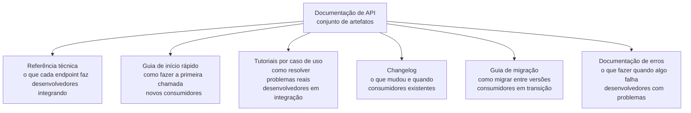
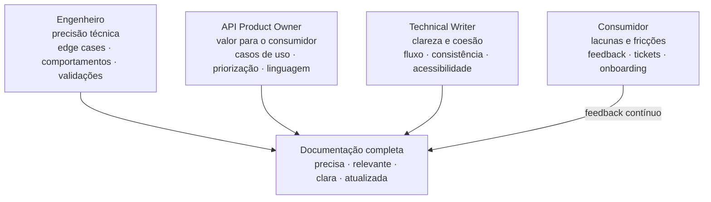
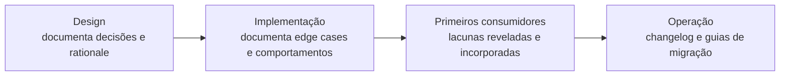
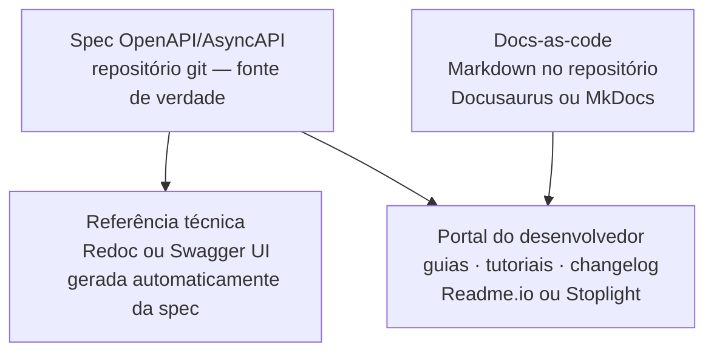
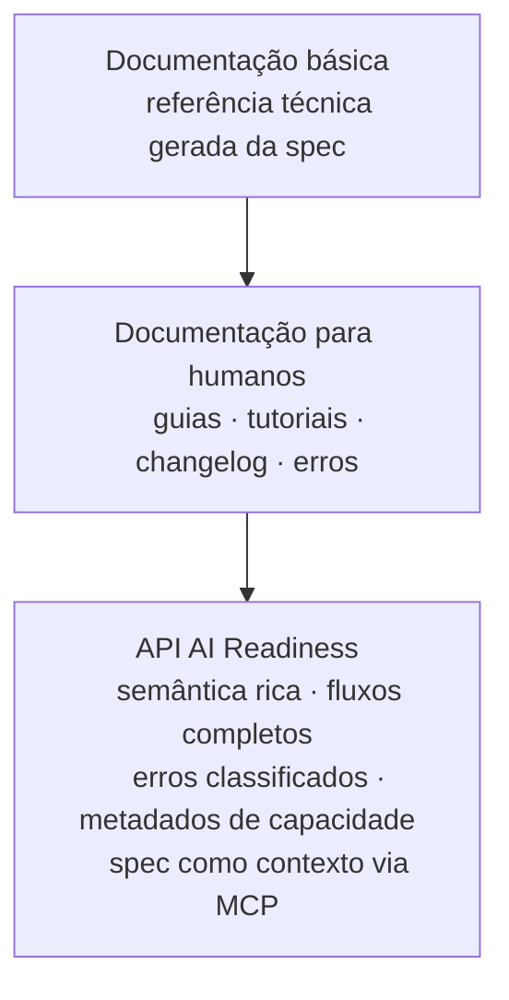
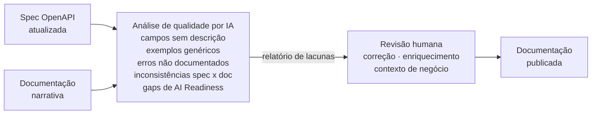

# Módulo 2 · Ciclo de Vida de APIs
## Capítulo 2.4 · Documentação de APIs

> **Série:** Gerenciamento e Governança de APIs
> **Nível:** Operacional
> **Pré-requisito:** Cap 2.3 · Contratos de API: OpenAPI, AsyncAPI e gRPC

---

## Sumário

- [2.4.1 · Documentação não é spec — a distinção que falta](#241--documentação-não-é-spec--a-distinção-que-falta)
- [2.4.2 · Os tipos de documentação](#242--os-tipos-de-documentação)
- [2.4.3 · Quem escreve e quem é responsável](#243--quem-escreve-e-quem-é-responsável)
- [2.4.4 · Quando documentação é escrita — e por que o momento importa](#244--quando-documentação-é-escrita--e-por-que-o-momento-importa)
- [2.4.5 · Como documentação se mantém atualizada](#245--como-documentação-se-mantém-atualizada)
- [2.4.6 · Ferramentas e formatos](#246--ferramentas-e-formatos)
- [2.4.7 · API AI Readiness e o papel da IA na documentação](#247--api-ai-readiness-e-o-papel-da-ia-na-documentação)

---

## 2.4.1 · Documentação não é spec — a distinção que falta

No capítulo anterior estabelecemos que a spec é um contrato — um artefato normativo que governa a implementação. Documentação é algo fundamentalmente diferente: é o que torna a API **compreensível e utilizável** por quem não participou de sua criação.

A confusão entre os dois conceitos é persistente e tem consequências práticas sérias. Times que tratam a spec como documentação acreditam que "gerar o Swagger" é suficiente. Times que tratam documentação como spec acreditam que qualquer texto explicativo tem valor normativo sobre a implementação. Nenhuma das duas visões está certa.

| Dimensão | Spec / Contrato | Documentação |
|---|---|---|
| **Propósito** | Definir o que deve existir | Explicar como usar o que existe |
| **Audiência primária** | Máquinas, ferramentas, testes | Humanos e agentes de IA |
| **Formato** | Estruturado e formal (YAML, JSON, Proto) | Narrativo e didático |
| **Valor normativo** | Sim — desvios são falhas | Não — é orientação, não lei |
| **Quando é escrita** | Antes da implementação | Durante e após a implementação |
| **Quem mantém** | Quem governa o contrato | Quem produz e conhece a API |

Uma API pode ter uma spec perfeita e documentação péssima — o contrato está correto mas ninguém consegue usar a API sem ajuda. E uma API pode ter documentação excelente sobre uma spec desatualizada — a experiência do desenvolvedor é boa até que ele encontra um comportamento que a documentação não descreve.

O ideal é que os dois coexistam com qualidade e estejam sincronizados. A spec define o contrato; a documentação explica como tirar valor dele.

---

## 2.4.2 · Os tipos de documentação

Documentação de API não é um documento único. É um conjunto de artefatos com propósitos, audiências e estratégias de produção distintos. Tratar todos como o mesmo tipo — geralmente como "a documentação" que vive no portal — é uma das causas mais comuns de documentação incompleta.

---

**Referência técnica**

É a documentação mais próxima da spec — descreve cada endpoint, cada campo, cada código de resposta. Frequentemente gerada automaticamente a partir da spec OpenAPI e renderizada como Swagger UI ou Redoc.

É necessária mas não suficiente. Um desenvolvedor que só tem acesso à referência técnica sabe o que cada endpoint aceita e retorna — mas não sabe por onde começar, quais endpoints usar juntos ou como resolver um caso de uso específico.

**Audiência:** desenvolvedores que já estão integrando e precisam de referência detalhada.

---

**Guia de início rápido**

É a documentação que responde à pergunta mais importante de qualquer novo consumidor: *"como faço minha primeira chamada com sucesso?"*

Um guia de início rápido bem escrito leva o desenvolvedor do zero à primeira chamada com sucesso em menos de 10 minutos. Ele não explica todos os endpoints — explica o mínimo necessário para que o desenvolvedor tenha uma vitória rápida e entenda o padrão geral da API.

O Time-to-First-Call (TTFC) que medimos como indicador de DX é diretamente determinado pela qualidade do guia de início rápido.

**Audiência:** desenvolvedores que estão avaliando a API ou começando a integrar.

---

**Tutoriais orientados a casos de uso**

Enquanto a referência técnica descreve o quê e o guia de início rápido mostra como começar, tutoriais respondem à pergunta: *"como resolvo este problema específico com esta API?"*

Um tutorial de qualidade escolhe um caso de uso real e relevante, mostra o fluxo completo de chamadas necessárias, explica as decisões tomadas ao longo do caminho e apresenta os erros mais comuns e como evitá-los.

Tutoriais são os artefatos de documentação mais trabalhosos de produzir — e os que geram mais valor para consumidores em fase de integração.

**Audiência:** desenvolvedores que entenderam a API e precisam resolver um problema concreto.

---

**Changelog**

Registro cronológico de todas as mudanças na API — novas features, correções, breaking changes, depreciações. O changelog é a memória pública da evolução da API.

Um changelog bem mantido tem três benefícios diretos: consumidores sabem o que mudou sem precisar descobrir por tentativa e erro; o time de suporte tem menos tickets sobre mudanças de comportamento; e o processo de depreciação fica mais rastreável.

A ausência de changelog é um dos indicadores mais claros de baixa maturidade de gestão de APIs.

**Audiência:** consumidores existentes que precisam acompanhar a evolução da API.

---

**Guia de migração**

Quando uma breaking change é introduzida — nova versão major, mudança de autenticação, reestruturação de recursos — consumidores precisam de orientação específica para migrar.

Um guia de migração de qualidade explica o que mudou, por que mudou, como identificar o impacto na integração existente e como executar a migração passo a passo.

**Audiência:** consumidores que precisam migrar de uma versão para outra.

---

**Documentação de erros**

Documentação de erros de qualidade cobre cada código de erro possível com: o que causou o erro, o que o consumidor pode fazer para resolvê-lo e exemplos de quando esse erro ocorre. É complementar à spec — que define o schema dos erros — mas vai além: explica o significado de negócio de cada situação.

**Audiência:** desenvolvedores que encontraram um erro e precisam entender o que fazer.

---

## 2.4.3 · Quem escreve e quem é responsável

A documentação de APIs sofre de um problema de ownership difuso — frequentemente todos acham que é responsabilidade de outro. O resultado previsível é documentação incompleta, desatualizada ou escrita às pressas antes de um lançamento.

A solução não está em definir um único papel responsável — está em reconhecer que diferentes perspectivas contribuem para documentação completa, independente de quantas pessoas ou papéis estão disponíveis.

---

### As perspectivas que constroem documentação completa

**A perspectiva do engenheiro** enxerga a precisão técnica. Quem implementou a API conhece os comportamentos sob falha, os edge cases, as validações que não estão na spec, as dependências ocultas. Sem essa perspectiva, a documentação é vaga ou incorreta nos momentos que mais importam.

**A perspectiva do API Product Owner** enxerga o valor para o consumidor. Quais casos de uso devem ser priorizados nos tutoriais? Qual linguagem o consumidor usa? O que precisa estar claro antes do lançamento para que a adoção aconteça? Sem essa perspectiva, a documentação é tecnicamente correta mas desconectada das necessidades reais dos consumidores.

**A perspectiva do technical writer** — quando existe — enxerga a clareza e a coesão narrativa. A documentação flui logicamente? É compreensível para alguém de fora do time? Sem essa perspectiva, a documentação pode ser precisa e relevante mas difícil de absorver.

**A perspectiva do consumidor** enxerga as lacunas. O que está confuso, o que está faltando, o que gerou um ticket de suporte. Consumidores reais — especialmente os primeiros — são a fonte mais valiosa de feedback sobre documentação.

---

### Como essas perspectivas se organizam na prática

Em organizações com papéis distintos, o processo precisa garantir que todas as perspectivas contribuam antes da publicação. Em organizações menores, onde uma ou duas pessoas acumulam múltiplos papéis, o processo é o mesmo — mas executado por menos pessoas.

Um checklist que force a troca de perspectiva é uma ferramenta simples e eficaz: *"revisei como desenvolvedor? como product owner? como alguém que nunca viu essa API antes?"*

---

### O erro mais comum de ownership

O erro mais comum não é a ausência de responsável — é a responsabilidade sem autoridade. Um API Product Owner que é "responsável pela documentação" mas não tem autonomia para bloquear um lançamento até que a documentação esteja completa não tem responsabilidade real. Ownership de documentação precisa incluir o poder de dizer "não publicamos sem isso".

---

## 2.4.4 · Quando documentação é escrita — e por que o momento importa

Documentação escrita no momento certo é mais barata e de melhor qualidade do que documentação escrita depois. Esse princípio parece óbvio — mas é consistentemente ignorado na prática.

---

### O padrão disfuncional mais comum

O ciclo que se repete em organizações sem processo formal de documentação:

A API está em desenvolvimento. "Vamos documentar depois que estiver pronto." O lançamento se aproxima. "Não temos tempo agora, lançamos e documentamos depois." A API é publicada sem documentação adequada. Os primeiros consumidores chegam e abrem tickets. O time de engenharia está em cima de outro projeto. A documentação fica para "quando tiver tempo". O tempo nunca aparece. A documentação nunca é escrita.

---

### As janelas de oportunidade

**Durante o design** — as decisões de design estão frescas na memória. É o momento ideal para documentar o porquê de cada decisão — informação que se perde rapidamente.

**Logo após a implementação** — o engenheiro ainda conhece todos os detalhes de implementação, os edge cases, os comportamentos não explícitos na spec. Essa janela fecha rapidamente.

**Com os primeiros consumidores** — o processo de onboarding revela as lacunas com precisão cirúrgica. Cada pergunta de suporte é uma indicação de onde a documentação falhou.

---

### Documentação como critério de definition of done

A prática mais eficaz é incluir documentação na definição de "pronto" do time. Uma API não está pronta para ser publicada se não tem documentação mínima adequada ao seu nível de exposição.

Isso não significa que toda documentação precisa estar completa antes do lançamento — significa que os artefatos críticos para o nível de exposição da API precisam existir. Uma API interna experimental tem requisitos diferentes de uma API pública com centenas de consumidores esperados.

---

## 2.4.5 · Como documentação se mantém atualizada

O maior desafio da documentação não é criá-la — é mantê-la. Uma documentação desatualizada pode ser pior do que nenhuma documentação, porque cria uma falsa sensação de que o consumidor tem as informações corretas.

---

### Por que documentação fica desatualizada

**Invisibilidade do custo** — quando a documentação fica desatualizada, o custo aparece como tickets de suporte, adoção mais lenta e consumidores frustrados. O custo é real mas difuso — não aparece no dashboard do time que a produz.

**Ausência de processo** — mudanças no código têm processos formais. Mudanças na documentação frequentemente não têm processo equivalente. Dependem de alguém lembrar de atualizar — o que falha sob pressão.

**Desconexão entre artefatos** — spec em um repositório, portal em outro sistema, tutoriais em uma wiki. Quando o código muda, não existe mecanismo automático que identifique quais artefatos precisam ser atualizados.

---

### Práticas que mantêm documentação atualizada

**Documentação no mesmo repositório do código** — quando documentação vive no mesmo repositório que o código, ela passa por code review, fica visível no histórico de mudanças e pode ser bloqueada no pipeline se estiver ausente.

**Changelog automatizado** — ferramentas de conventional commits e geração automática de changelog reduzem a fricção de manter o registro de mudanças atualizado.

**Revisão de documentação em PRs que afetam comportamento** — toda PR que modifica comportamento da API deve incluir a atualização de documentação correspondente como critério de aceite.

**Ciclos periódicos de revisão** — uma revisão periódica verifica se a documentação ainda reflete a realidade da API. Especialmente importante para tutoriais e guias de caso de uso, que envelhecem de formas que testes automatizados não detectam.

**Feedback loop de consumidores** — um canal estruturado para que consumidores reportem problemas de documentação transforma o uso real em sinais de manutenção.

---

## 2.4.6 · Ferramentas e formatos

---

**Swagger UI**

Renderização interativa de specs OpenAPI. Permite que desenvolvedores explorem endpoints e façam chamadas de teste diretamente no navegador. Adequado para referência técnica — não para tutoriais, guias de início rápido ou changelog.

---

**Redoc**

Alternativa ao Swagger UI com foco em legibilidade e navegação. Gera uma página de documentação de referência com sidebar de navegação, mais adequada para APIs com muitos endpoints.

---

**Portais de desenvolvedor**

Plataformas como Stoplight, Readme.io e portais nativos de API Gateways combinam referência técnica, tutoriais, guias de início rápido e changelog em uma experiência unificada. Justificam o investimento para APIs públicas com muitos consumidores externos.

---

**Documentação como código**

A abordagem docs-as-code trata documentação com o mesmo rigor que código: vive em repositório git, passa por revisão, é gerada automaticamente no pipeline. Ferramentas como Docusaurus, MkDocs e Sphinx permitem construir sites de documentação a partir de arquivos Markdown.

---

**A combinação mais comum em organizações maduras**

Não existe uma combinação universal correta. O que não é aceitável é depender exclusivamente da spec renderizada como referência técnica e chamar isso de "documentação completa".

---

## 2.4.7 · API AI Readiness e o papel da IA na documentação

---

### 2.4.7.1 · API AI Readiness — documentação para além do humano

As seções anteriores trataram documentação do ponto de vista de um consumidor humano. Mas há um segundo tipo de consumidor que está se tornando cada vez mais relevante: **agentes de IA**.

Um agente de IA que precisa consumir uma API não lê documentação da mesma forma que um desenvolvedor humano. Ele processa o contexto disponível, infere intenções e toma decisões de forma autônoma — sem a capacidade de perguntar quando algo está ambíguo.

**API AI Readiness** descreve o grau em que uma API está preparada para ser descoberta, compreendida e consumida efetivamente por agentes de IA — sem intervenção humana.

---

**Por que a documentação para humanos não é suficiente para agentes**

Desenvolvedores humanos trazem contexto, intuição e capacidade de inferência que complementam a documentação incompleta. Um desenvolvedor que encontra um campo chamado `destinatario_id` sem descrição provavelmente infere o que é. Um agente de IA pode não conseguir fazer essa inferência com a mesma confiabilidade.

Além disso, agentes de IA precisam de informações que documentação para humanos raramente fornece de forma estruturada:

- Quando usar este endpoint em vez de outros que parecem similares?
- Quais são as pré-condições para que esta operação tenha sucesso?
- Como compor múltiplas chamadas para resolver um objetivo mais amplo?
- Como lidar autonomamente com erros recuperáveis vs. erros que exigem intervenção humana?

---

**Os elementos que tornam uma API AI-Ready**

**Descrições semânticas ricas e orientadas a intenção** — não apenas "o que o campo faz" mas "quando usar este endpoint", "qual o caso de uso esperado", "quais são as pré-condições necessárias".

**Exemplos orientados a fluxos completos** — não apenas exemplos de request/response isolados, mas exemplos de sequências de chamadas que resolvem um problema de ponta a ponta.

**Tratamento de erros acionável e classificado** — erros classificados por recuperabilidade: erros que o agente pode tentar novamente automaticamente, erros que exigem mudança de parâmetros, erros que exigem intervenção humana.

**Metadados de capacidade e limitação** — informações explícitas sobre o que a API pode e não pode fazer, seus limites de rate, suas dependências e suas pré-condições.

**Spec como contexto para agentes via MCP** — uma spec OpenAPI bem escrita, exposta via MCP, pode ser o contexto que um agente de IA usa para entender e consumir a API sem intervenção humana. O CoE que mantém o catálogo e as specs em um MCP organizacional está construindo infraestrutura de AI Readiness.

---

**A relação entre AI Readiness e qualidade geral de documentação**

A maioria dos elementos que tornam uma API AI-Ready são simplesmente boas práticas de documentação levadas ao próximo nível. Descrições semânticas ricas beneficiam desenvolvedores humanos tanto quanto agentes de IA. AI Readiness não é uma camada separada de documentação — é uma dimensão adicional de qualidade.

> Este conceito será aprofundado no **Cap 3.5 · Catálogo e descoberta de APIs** — onde exploraremos como o catálogo exposto via MCP habilita descoberta e seleção de APIs por agentes de IA — e no **Cap 7.7 · IA e ferramentas para governança de APIs**.

---

### 2.4.7.2 · IA na produção de documentação

Um dos maiores obstáculos à documentação de qualidade não é a falta de conhecimento — é a fricção do processo de escrever. Ferramentas de IA reduzem essa fricção de forma concreta e mensurável.

---

**Geração de rascunhos a partir da spec**

A partir de uma spec OpenAPI bem escrita, ferramentas de IA conseguem gerar rascunhos de:

- Descrições de endpoints e campos — transformando nomes técnicos em explicações orientadas ao consumidor
- Guias de início rápido — identificando os endpoints mínimos necessários para uma primeira chamada e construindo um fluxo narrativo
- Exemplos de request/response — expandindo exemplos mínimos em exemplos contextualizados e realistas
- Documentação de erros — traduzindo códigos de status em explicações acionáveis

Esses rascunhos não são documentação final — são pontos de partida que o API Owner ou engenheiro revisa, corrige e enriquece. A diferença entre partir de um rascunho e partir de uma página em branco é significativa o suficiente para mudar o comportamento de times que sistematicamente postergam documentação.

**O guardrail necessário:** rascunhos gerados por IA precisam de revisão humana antes de serem publicados. IA não conhece os comportamentos não documentados na spec, os edge cases encontrados durante implementação ou o contexto de negócio que torna uma descrição realmente útil.

---

**MCP como contexto para geração de documentação consistente**

Quando a spec OpenAPI e o style guide da organização estão expostos via MCP, ferramentas de IA conseguem gerar documentação que já respeita os padrões estabelecidos — usando a linguagem correta, seguindo os formatos definidos e sendo consistente com outros artefatos de documentação do portfólio.

Um engenheiro que usa uma ferramenta de IA com acesso ao MCP organizacional não precisa conhecer de memória todos os padrões de documentação do CoE — a IA já os conhece e os aplica.

---

### 2.4.7.3 · IA na análise de qualidade de documentação

Se IA pode ajudar a produzir documentação, ela pode igualmente ajudar a avaliar a qualidade da documentação existente — identificando lacunas, inconsistências e problemas que revisão humana frequentemente perde por proximidade excessiva com o objeto.

---

**O que análise de qualidade por IA pode detectar**

**Campos e operações sem descrição ou com descrição genérica** — campos nomeados sem descrição contextual são identificados automaticamente.

**Exemplos genéricos ou irreais** — exemplos com valores como `"string"`, `0`, `true` que não refletem dados reais de uso são detectados e podem ser substituídos por exemplos contextualizados.

**Erros não documentados** — a spec define códigos de resposta; a IA pode verificar se todos os códigos de erro têm documentação correspondente.

**Inconsistências entre spec e documentação narrativa** — quando a spec foi atualizada mas tutoriais e guias ainda referenciam o comportamento antigo, análise semântica pode detectar a divergência.

**Lacunas de cobertura de casos de uso** — comparando os endpoints disponíveis com os tutoriais existentes, a IA pode identificar operações importantes que não têm tutorial correspondente.

**Problemas de AI Readiness** — avaliando se as descrições são suficientemente ricas em intenção e semântica para serem consumidas por agentes de IA.

---

**Como isso muda o processo de manutenção**

A análise de qualidade por IA pode ser incorporada ao pipeline de CI como um gate de qualidade de documentação — similar ao lint de spec para o contrato. Cada PR que afeta a spec ou a documentação passa por uma análise automatizada que detecta os problemas mais comuns antes da revisão humana.

---

**O limite da análise por IA**

IA consegue detectar problemas de completude e consistência estrutural — não consegue avaliar se o conteúdo está factualmente correto em relação ao comportamento real da implementação. Uma descrição de campo pode estar bem escrita e completamente errada. Esse tipo de erro exige revisão humana com conhecimento da implementação.

> IA na documentação segue o mesmo princípio estabelecido no Cap 2.2: IA acelera e identifica. Revisão humana e ferramentas determinísticas validam. A combinação dos dois produz documentação de qualidade com custo operacional sustentável.

---

## Pontos-chave do capítulo

- Documentação não é spec — spec é contrato normativo, documentação é o que torna a API compreensível e utilizável. As duas coexistem mas têm propósitos, audiências e responsabilidades diferentes
- Documentação de API é um conjunto de artefatos distintos — referência técnica, guia de início rápido, tutoriais, changelog, guias de migração e documentação de erros. Cada um tem propósito e audiência específicos
- Ownership de documentação não se resolve prescrevendo um papel — resolve-se garantindo que múltiplas perspectivas contribuam: engenheiro, API Product Owner, technical writer e consumidor
- Documentação escrita no momento certo é mais barata e melhor. As janelas de oportunidade são durante o design, logo após a implementação e com os primeiros consumidores
- O maior desafio da documentação não é criá-la — é mantê-la. Docs-as-code, changelog automatizado e revisão em PRs são as práticas mais eficazes
- API AI Readiness é a dimensão que prepara a API para ser consumida por agentes de IA — descrições semânticas ricas, fluxos completos, erros classificados e spec exposta via MCP
- IA pode acelerar a produção de documentação através de geração de rascunhos e pode identificar lacunas de qualidade automaticamente — em ambos os casos, revisão humana é inegociável

---

## Próximo capítulo

**2.5 · Versionamento e gestão de breaking changes** — como APIs evoluem sem quebrar consumidores, as estratégias de versionamento disponíveis, e como o processo de change management governa a evolução do contrato.

---

*Série: Gerenciamento e Governança de APIs · Módulo 2 · Capítulo 2.4*