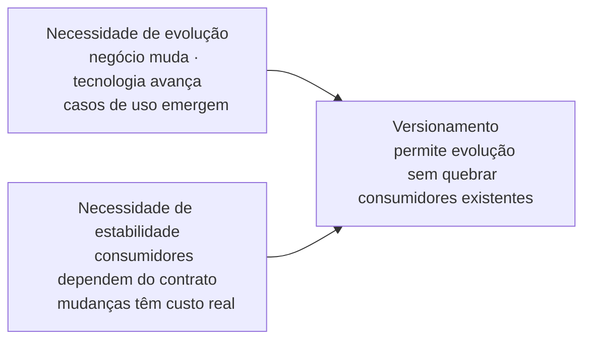
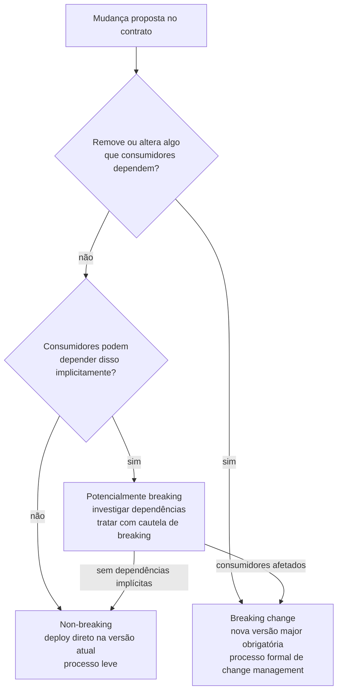
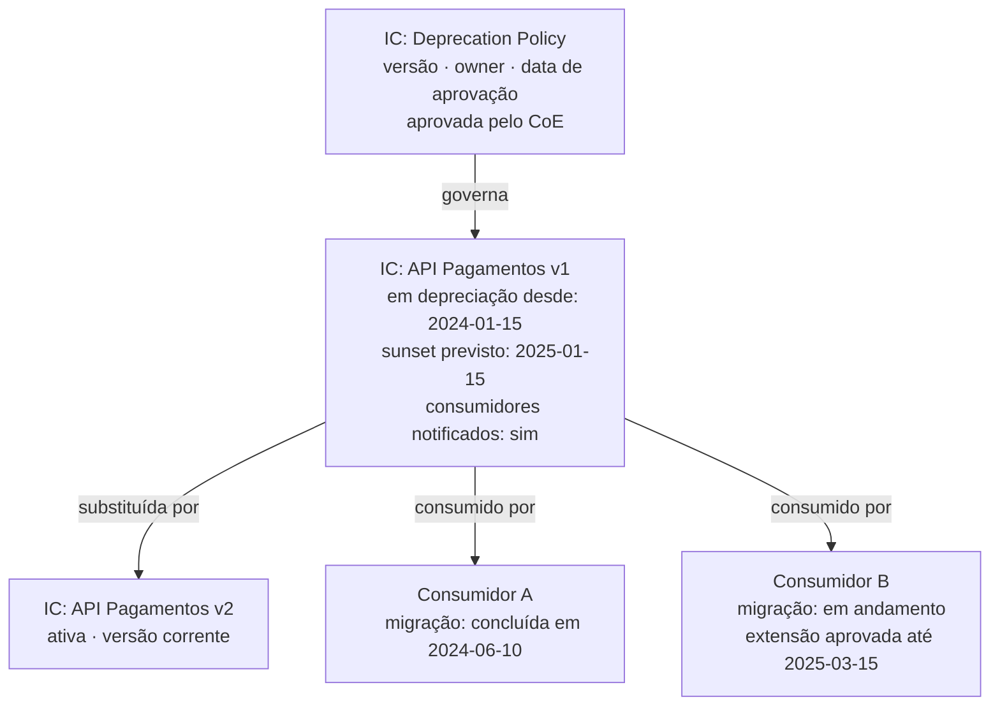
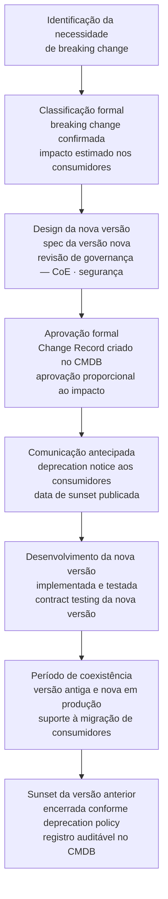
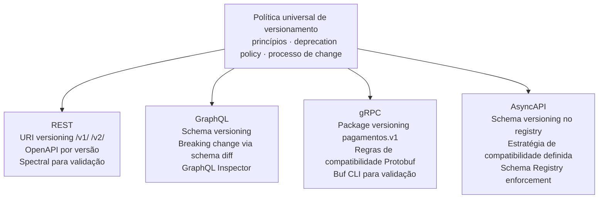

# Módulo 2 · Ciclo de Vida de APIs
## Capítulo 2.5 · Versionamento e gestão de breaking changes

> **Série:** Gerenciamento e Governança de APIs
> **Nível:** Operacional
> **Pré-requisito:** Cap 2.4 · Documentação de APIs

---

## Sumário

- [2.5.1 · Por que versionamento existe — o problema que ele resolve](#251--por-que-versionamento-existe--o-problema-que-ele-resolve)
- [2.5.2 · O que é uma breaking change — e o que não é](#252--o-que-é-uma-breaking-change--e-o-que-não-é)
- [2.5.3 · Estratégias de versionamento](#253--estratégias-de-versionamento)
- [2.5.4 · Deprecation policy — a governança que torna o versionamento previsível](#254--deprecation-policy--a-governança-que-torna-o-versionamento-previsível)
- [2.5.5 · O processo de change management para breaking changes](#255--o-processo-de-change-management-para-breaking-changes)
- [2.5.6 · Versionamento em portfólios heterogêneos](#256--versionamento-em-portfólios-heterogêneos)

**Anexos referenciados:**
- [Anexo A.1 · Breaking changes em APIs REST](../anexos/a_1_breaking_changes_REST.md)
- [Anexo A.2 · Breaking changes em APIs GraphQL](../anexos/a_2_breaking_changes_graphQL.md)
- [Anexo A.3 · Breaking changes em Protocol Buffers (gRPC)](../anexos/a_3_breaking_changes_grpc.md)
- [Anexo A.4 · Breaking changes em AsyncAPI](../anexos/a_4_breaking_changes_asyncapi.md)

---

## 2.5.1 · Por que versionamento existe — o problema que ele resolve

APIs precisam evoluir. Negócios mudam, tecnologias avançam, casos de uso emergem que o design original não antecipou. Sem evolução, uma API envelhece e perde relevância.

Mas APIs também têm consumidores que construíram produtos sobre elas. Cada consumidor tem seu próprio ciclo de desenvolvimento, seu próprio roadmap e sua própria capacidade de absorver mudanças. Uma mudança que quebra o contrato estabelecido — mesmo que melhore a API — impõe um custo não planejado sobre cada consumidor.

Essa é a tensão fundamental do versionamento:



Versionamento é o mecanismo que resolve essa tensão — permitindo que a API evolua enquanto consumidores existentes continuam funcionando na versão que conhecem.

---

### O que acontece sem política de versionamento

Organizações sem política formal de versionamento enfrentam dois anti-padrões opostos — e igualmente problemáticos:

**Anti-padrão 1 — Paralisia de evolução:** o time tem medo de fazer mudanças porque não sabe o impacto nos consumidores. A API envelhece, acumula dívida de design e perde relevância. Novos casos de uso não são atendidos.

**Anti-padrão 2 — Breaking changes silenciosas:** mudanças são feitas sem processo formal, consumidores são quebrados sem aviso, a confiança no contrato da API é destruída. Cada atualização do sistema gera ansiedade nos consumidores.

Uma política de versionamento bem definida previne os dois — dando ao time a liberdade de evoluir e aos consumidores a previsibilidade de que o contrato será respeitado.

---

## 2.5.2 · O que é uma breaking change — e o que não é

A classificação de uma mudança como breaking ou non-breaking é o ponto mais crítico do processo de versionamento — e o mais frequentemente errado.

O erro mais comum é classificar mudanças por intuição ou por analogia superficial. A forma correta é aplicar um princípio claro e consistente.

---

### O princípio fundamental

> **Uma mudança é breaking quando remove ou altera algo que consumidores existentes dependem — de forma que seu código existente pare de funcionar ou passe a se comportar de forma diferente do esperado.**

Esse princípio é independente do estilo arquitetural. O que muda entre REST, GraphQL, gRPC e AsyncAPI é como ele se manifesta — não o princípio em si.

---

### As três categorias de mudança

**Non-breaking (backward compatible)**
Mudanças que adicionam capacidade sem remover ou alterar o que já existe. Consumidores existentes continuam funcionando sem qualquer modificação.

Exemplos universais: adicionar um novo endpoint, adicionar um campo opcional em uma resposta, adicionar um novo código de erro não previsto anteriormente, melhorar uma mensagem de erro sem mudar seu código.

**Breaking (backward incompatible)**
Mudanças que removem ou alteram algo que consumidores existentes dependem. Consumidores existentes precisam modificar seu código para continuar funcionando.

Exemplos universais: remover um endpoint ou campo existente, mudar o tipo de um campo, tornar um campo opcional em obrigatório, mudar o significado semântico de um campo existente.

**Potencialmente breaking (depende do consumidor)**
Mudanças que podem ou não quebrar consumidores dependendo de como eles implementaram a integração. Esse é o caso mais traiçoeiro — e o mais frequentemente subestimado.

Exemplos: adicionar um novo valor em um enum (quebra consumidores que tratam enum como fechado), mudar o comportamento de um campo que era tecnicamente opcional mas na prática sempre presente, alterar a ordem de campos em uma resposta JSON (quebra consumidores que fazem parsing posicional).



---

### A armadilha das mudanças potencialmente breaking

O caso mais perigoso não é a breaking change óbvia — é a mudança que parece non-breaking mas na prática quebra consumidores específicos:

**Mudar formato de data** — de `"2024-03-15"` para `"2024-03-15T00:00:00Z"`. Tecnicamente o campo continua presente, mas parsers de data que não suportam ISO 8601 com timezone quebram.

**Mudar comportamento de paginação** — alterar o tamanho padrão de página de 20 para 50. Nenhum campo foi removido, mas consumidores que assumiam 20 itens por página precisam ajustar sua lógica.

**Restringir valores aceitos** — um campo que aceitava qualquer string começa a rejeitar valores com caracteres especiais. Consumidores que enviavam esses valores começam a receber erros.

**Adicionar campo obrigatório ao request** — parece óbvio que é breaking, mas às vezes é justificado como "só estamos tornando explícito o que já era esperado". O consumidor que não envia o novo campo quebra.

> Para classificação exaustiva de breaking changes por estilo arquitetural — REST, GraphQL, gRPC e AsyncAPI — consulte os **Anexos A.1 a A.4**.

---

## 2.5.3 · Estratégias de versionamento

Com a classificação de breaking changes estabelecida, a próxima questão é: quando uma breaking change é necessária, como ela é comunicada no contrato?

---

### URI Versioning

A versão é parte do caminho da URL:

```http
GET /v1/pedidos/123
GET /v2/pedidos/123
```

É a estratégia mais adotada no mercado por uma razão simples: é visível, explícita e inequívoca. Qualquer desenvolvedor, qualquer ferramenta, qualquer log deixa claro qual versão está sendo consumida.

**Vantagens:** visibilidade imediata, facilidade de roteamento no gateway, facilidade de monitoramento por versão, caching simples por versão.

**Desvantagens:** tecnicamente impura do ponto de vista REST — a versão não é um atributo do recurso.

Do ponto de vista de governança, URI versioning é a estratégia mais fácil de auditar, monitorar e enforçar — o gateway consegue rastrear uso por versão de forma trivial.

---

### Header Versioning

A versão é comunicada via header HTTP:

```http
GET /pedidos/123
Accept: application/vnd.empresa.api+json;version=2
```

ou

```http
GET /pedidos/123
Api-Version: 2
```

**Vantagens:** URLs estáveis, mais alinhado com a semântica REST.

**Desvantagens:** menos visível — logs e ferramentas precisam inspecionar headers para saber qual versão está sendo usada, mais difícil de testar no browser.

Do ponto de vista de governança, header versioning exige instrumentação adicional de observabilidade para ter visibilidade de uso por versão.

---

### Query Parameter Versioning

A versão é um parâmetro de query string:

```http
GET /pedidos/123?api-version=2
```

**Vantagens:** visível na URL, fácil de testar, fácil de adicionar em chamadas existentes.

**Desvantagens:** mistura metadado de protocolo com parâmetros de negócio, pode complicar caching.

---

### Semântica de versão aplicada a APIs

Independente da estratégia de URL escolhida, a numeração de versões segue convenções que precisam ser definidas pela governança:

| Nível | Mudança | Impacto para consumidores |
|---|---|---|
| **Major** (v1 → v2) | Breaking change | Versões coexistem · consumidores migram no próprio ritmo |
| **Minor** (v1.1 → v1.2) | Non-breaking addition | Consumidores não precisam fazer nada |
| **Patch** (v1.1.0 → v1.1.1) | Correção de bug | Transparente para consumidores |

A maioria das organizações expõe apenas a versão major na URL — `v1`, `v2` — e mantém minor e patch como controle interno.

---

### A decisão de governança: qual estratégia adotar

| Contexto | Estratégia recomendada | Razão |
|---|---|---|
| APIs públicas com ampla adoção | URI versioning | Máxima visibilidade e facilidade de suporte |
| APIs internas com gateway maduro | URI ou Header | Flexibilidade com instrumentação adequada |
| APIs com contrato de media type específico | Header versioning | Alinhamento semântico |
| Migração de portfólio legado | URI versioning | Consistência e facilidade de transição |

A governança precisa definir uma estratégia única para o portfólio — ou critérios claros de quando cada estratégia é aplicável. Portfólios onde cada API usa uma estratégia diferente criam inconsistência de experiência e complexidade de operação.

---

## 2.5.4 · Deprecation policy — a governança que torna o versionamento previsível

Uma deprecation policy é o artefato de governança que transforma o versionamento de um problema recorrente em um processo previsível — tanto para o time que produz a API quanto para os consumidores que dependem dela.

Organizações sem deprecation policy formal enfrentam os mesmos problemas repetidamente: quando lançam uma nova versão, precisam decidir sob pressão por quanto tempo manter a versão anterior; quando chegam ao prazo de encerramento, não têm processo para executá-lo; quando consumidores reclamam, não têm critérios para conceder ou negar extensões.

Uma deprecation policy bem definida responde a todas essas perguntas antes que elas precisem ser respondidas.

---

### O que uma deprecation policy precisa definir

**Prazos mínimos de coexistência por tipo de API**

| Tipo de API | Prazo mínimo recomendado | Justificativa |
|---|---|---|
| API privada | 3 meses | Consumidores internos com mais controle de roadmap |
| API de parceiro | 6 meses | Parceiros têm ciclos de desenvolvimento próprios |
| API pública | 12 meses | Consumidores externos desconhecidos — máxima previsibilidade |
| API regulada | Conforme regulação + margem | Compliance exige prazos específicos |

Esses são prazos mínimos — não máximos. A política pode permitir prazos maiores para APIs com base de consumidores especialmente ampla ou complexa.

---

**SLA durante o período de coexistência**

Versões em depreciação devem ter SLA explícito — que pode ser diferente da versão ativa:

- A versão antiga recebe correções de segurança críticas?
- A versão antiga recebe correções de bugs não críticos?
- O SLA de disponibilidade é o mesmo que a versão nova?
- Há suporte técnico para consumidores na versão antiga?

Sem resposta explícita a essas perguntas, consumidores não sabem o que esperar e times de engenharia não sabem o que são obrigados a entregar.

---

**Processo de comunicação**

Como consumidores são notificados da depreciação:

- Canal primário: email, portal, `Deprecation` header nas respostas conforme RFC 8594
- Comunicações periódicas de lembrete — com qual frequência
- Outreach proativo para consumidores que não iniciaram migração
- Quem é responsável pela comunicação — API Owner, time de suporte, CoE

---

**Processo de monitoramento de migração**

Como a organização acompanha o progresso de migração:

- Métricas de uso por versão coletadas e revisadas com qual frequência
- Threshold de uso abaixo do qual o sunset pode ser executado
- Como identificar consumidores que ainda não migraram

---

**Critérios e processo de extensão de prazo**

- Quem pode solicitar extensão
- Quais critérios justificam uma extensão
- Qual o prazo máximo de extensão possível
- Quem aprova
- Como a extensão é comunicada para não criar precedente de que prazos nunca são cumpridos

---

**Processo de sunset**

- Qual é o processo de desligamento — imediato ou degradação progressiva
- O que acontece com consumidores que ainda usam a versão no dia do sunset
- Como o encerramento é registrado no CMDB e no catálogo
- Quais evidências são preservadas para fins de auditoria

---

### A deprecation policy como IC no CMDB

A própria deprecation policy é um artefato de governança que precisa ser gerenciado como IC — com versão, owner, data de aprovação e histórico de mudanças.



---

## 2.5.5 · O processo de change management para breaking changes

Uma breaking change não é apenas uma mudança técnica — é um evento de produto com impacto em consumidores e um evento de governança que precisa de processo formal. A conexão com ITIL Change Enablement — explorada em profundidade no Módulo 4 — é mais direta aqui do que em qualquer outro ponto do ciclo de vida.

---

### O fluxo de uma breaking change



---

### O Change Record de uma breaking change

O Change Record de uma breaking change de API deve incluir:

- Qual API e qual versão está sendo afetada
- Descrição da mudança e justificativa de negócio
- Classificação das breaking changes específicas — referenciando os Anexos A.1 a A.4
- Relação de consumidores identificados e seu status de migração
- Data de sunset proposta e prazo de coexistência
- Plano de rollback se a nova versão tiver problemas críticos
- Aprovações necessárias conforme o impacto estimado

---

### A escala de aprovação pelo impacto

| Impacto | Consumidores afetados | Processo de aprovação |
|---|---|---|
| Baixo | APIs internas · poucos consumidores | Aprovação do API Owner |
| Médio | APIs de parceiro · impacto moderado | API Owner + revisão do CoE |
| Alto | APIs públicas · muitos consumidores | API Owner + CoE + representante de negócio |
| Crítico | APIs reguladas · impacto em compliance | Processo completo com área jurídica e compliance |

---

## 2.5.6 · Versionamento em portfólios heterogêneos

Em portfólios com múltiplos estilos arquiteturais, a política de versionamento precisa ser agnóstica ao estilo nos princípios — e específica ao estilo nas implementações.

Os princípios são universais: breaking changes exigem nova versão major, non-breaking changes podem ser adicionadas à versão atual, a deprecation policy se aplica a todas as APIs independente do estilo, e o processo de change management é o mesmo para todos os estilos.

A implementação varia por estilo:



A governança que define a política universal é responsabilidade do CoE. A definição de como cada estilo implementa essa política é responsabilidade dos times que operam cada estilo — dentro dos limites definidos pelo CoE.

---

## Pontos-chave do capítulo

- Versionamento existe para resolver a tensão entre evolução da API e estabilidade dos consumidores — sem ele, organizações caem em paralisia de evolução ou breaking changes silenciosas
- O princípio fundamental de classificação de breaking changes é universal: uma mudança é breaking quando remove ou altera algo que consumidores existentes dependem. As mudanças potencialmente breaking são as mais perigosas
- URI versioning é a estratégia mais adotada por sua visibilidade e facilidade de governança — a escolha deve ser feita pelo CoE e aplicada de forma consistente no portfólio
- Uma deprecation policy bem definida transforma versionamento de problema recorrente em processo previsível — definindo prazos, SLA de coexistência, processo de comunicação, critérios de extensão e processo de sunset antes que qualquer breaking change aconteça
- Breaking changes são eventos de governança que exigem Change Record, aprovação proporcional ao impacto e comunicação antecipada
- Em portfólios heterogêneos, a política de versionamento é universal nos princípios e específica na implementação por estilo arquitetural

---

## Próximo capítulo

**2.6 · Depreciação e sunset controlado** — o processo completo de encerramento de APIs e versões, com foco na execução da deprecation policy definida neste capítulo e na gestão de resistências de consumidores externos.

---

*Série: Gerenciamento e Governança de APIs · Módulo 2 · Capítulo 2.5*