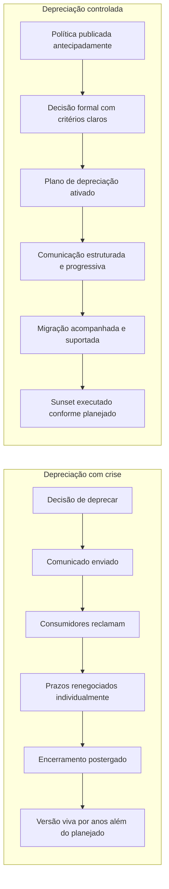
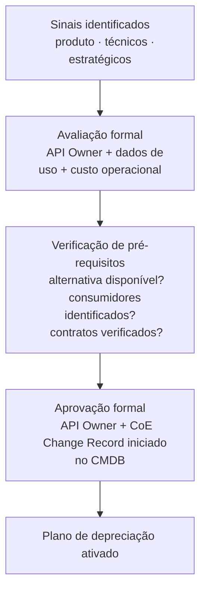
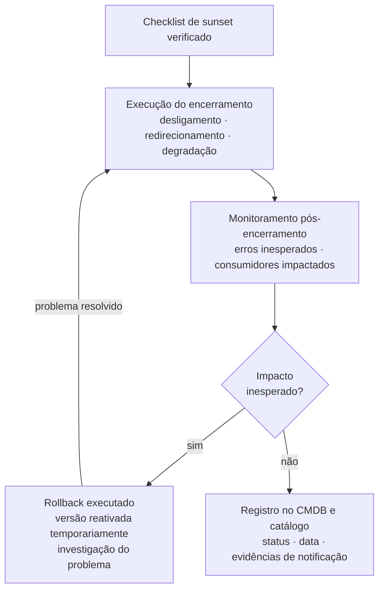
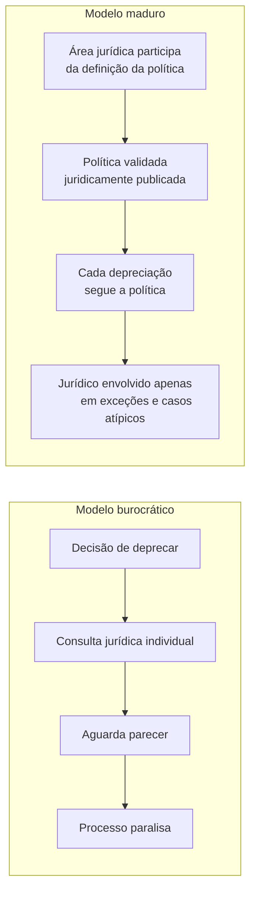

# Módulo 2 · Ciclo de Vida de APIs
## Capítulo 2.6 · Depreciação e sunset controlado

> **Série:** Gerenciamento e Governança de APIs
> **Nível:** Operacional
> **Pré-requisito:** Cap 2.5 · Versionamento e gestão de breaking changes

---

## Sumário

- [2.6.1 · Depreciação como processo — não como evento](#261--depreciação-como-processo--não-como-evento)
- [2.6.2 · A decisão de deprecar — critérios e processo de aprovação](#262--a-decisão-de-deprecar--critérios-e-processo-de-aprovação)
- [2.6.3 · O plano de depreciação](#263--o-plano-de-depreciação)
- [2.6.4 · Comunicação e gestão de consumidores](#264--comunicação-e-gestão-de-consumidores)
- [2.6.5 · Suporte à migração](#265--suporte-à-migração)
- [2.6.6 · O sunset — execução controlada](#266--o-sunset--execução-controlada)
- [2.6.7 · Salvaguardas jurídicas com consumidores externos](#267--salvaguardas-jurídicas-com-consumidores-externos)
- [2.6.8 · Depreciação e o papel da governança](#268--depreciação-e-o-papel-da-governança)

**Anexo referenciado:**
- [Anexo B · Template de plano de depreciação](../anexos/b_plano_depreciacao.md)

---

## 2.6.1 · Depreciação como processo — não como evento

Há uma distinção fundamental entre organizações que deprecam com crise e organizações que deprecam sem ruído. A diferença não está na dificuldade técnica do processo — está em como o processo é tratado.

Organizações que deprecam com crise tratam a depreciação como um evento: chega o momento de encerrar uma versão, um comunicado é enviado, consumidores reclamam, prazos são renegociados individualmente, o encerramento é postergado múltiplas vezes e a versão antiga permanece viva por anos além do planejado — acumulando custo operacional e dividindo a atenção do time entre manter o legado e evoluir o produto.

Organizações que deprecam sem ruído tratam a depreciação como um processo com início definido, etapas claras, responsáveis identificados e critérios objetivos de progressão. Consumidores sabem o que esperar porque a política é pública. O time sabe o que fazer porque o processo está documentado. A área jurídica não precisa ser consultada caso a caso porque já validou a política. E a automação cuida das verificações que não precisam de julgamento humano.

A diferença entre os dois modelos não é de recursos — é de preparação. Depreciação sem crise é planejada antes de ser necessária.



---

## 2.6.2 · A decisão de deprecar — critérios e processo de aprovação

A decisão de deprecar uma API ou versão é uma decisão de produto com implicações técnicas, comerciais e jurídicas. Ela não pode ser tomada unilateralmente pelo time de engenharia — nem postergada indefinidamente porque ninguém quer assumir a responsabilidade.

---

### Os sinais que indicam que a depreciação é necessária

Nenhum sinal isolado é suficiente para justificar uma depreciação. A decisão deve ser baseada em um conjunto de evidências avaliadas em conjunto:

**Sinais de produto:**
- Adoção em declínio consistente por múltiplos trimestres — não apenas sazonalidade
- Nova versão disponível e estável com funcionalidades superiores há tempo suficiente para que consumidores tenham tido oportunidade de migrar
- Casos de uso atendidos pela versão antiga cobertos de forma mais eficiente pela versão nova

**Sinais técnicos:**
- Custo de manutenção da versão antiga supera o valor que ela gera
- Dependências da versão antiga chegaram ao fim de suporte do fornecedor
- Vulnerabilidades de segurança que não podem ser corrigidas sem breaking changes
- Arquitetura subjacente está sendo substituída

**Sinais estratégicos:**
- Requisito regulatório que exige a descontinuação de determinadas práticas implementadas na versão antiga
- Decisão de negócio de consolidar o portfólio e eliminar versões com baixo uso

---

### O processo de aprovação da decisão



Um pré-requisito frequentemente ignorado: a alternativa precisa estar disponível e estável antes que a decisão de deprecar seja tomada. Comunicar a depreciação de uma versão sem ter uma alternativa funcional equivale a forçar consumidores a construir uma solução própria — o que é uma falha de responsabilidade do provedor, não do consumidor.

---

## 2.6.3 · O plano de depreciação

O plano de depreciação é o artefato que governa o processo inteiro — do anúncio ao encerramento. Ele deve ser produzido e aprovado antes de qualquer comunicação ser feita aos consumidores.

Um plano incompleto no momento do anúncio cria problemas imediatos: consumidores fazem perguntas que o time não consegue responder, prazos são questionados sem critérios para defendê-los e exceções são concedidas sem processo formal.

---

### O que o plano precisa definir

**Identificação e escopo**
Qual API ou versão está sendo depreciada, qual é a versão alternativa, qual é o escopo de impacto estimado.

**Cronograma**
Data de anúncio, data de início do período de coexistência, datas de marcos de comunicação, data de sunset. Todos os prazos devem estar alinhados com a deprecation policy definida no Cap 2.5.4.

**Consumidores identificados**
Lista de consumidores ativos identificados via dados de uso do gateway, segmentados por criticidade. Para cada consumidor crítico: contato identificado, status de migração e plano individual se necessário.

**Plano de comunicação**
Canais, conteúdo de cada comunicação, frequência, responsável por cada ação de outreach.

**Plano de suporte à migração**
O que será oferecido a cada segmento de consumidor — documentação, sandbox, office hours, suporte dedicado.

**Critérios e processo de exceção**
O que justifica uma extensão de prazo, quem pode solicitá-la, quem aprova, qual o prazo máximo de extensão e como a exceção é registrada.

---

### Automação do processo de depreciação

Partes significativas do processo de depreciação são candidatas naturais à automação — reduzindo carga manual e garantindo consistência:

**Monitoramento automático de uso por versão** — dashboards e alertas que mostram em tempo real quais consumidores ainda usam a versão depreciada, com tendência de migração. Elimina a necessidade de coleta manual periódica.

**Headers de depreciação automáticos** — conforme RFC 8594, o gateway pode ser configurado para incluir automaticamente headers `Deprecation` e `Sunset` em todas as respostas da versão depreciada. Ferramentas de monitoramento do consumidor detectam esses headers e podem gerar alertas automáticos.

**Comunicações automáticas de lembrete** — com base nos dados de uso, sistemas de comunicação podem enviar lembretes automáticos a consumidores que ainda não iniciaram migração — sem intervenção manual para cada envio.

**Atualização automática do CMDB** — marcos do processo — anúncio realizado, consumidor migrado, sunset executado — podem ser registrados automaticamente via integração com o gateway e o sistema de ITSM.

**Gates automáticos de bloqueio** — o gateway pode ser configurado para bloquear automaticamente novos onboardings na versão depreciada a partir da data definida no plano — sem necessidade de intervenção manual.

> O template de plano de depreciação está disponível no **Anexo B · Template de plano de depreciação**. O template é uma sugestão de ponto de partida — cada organização deve adaptá-lo à sua realidade, cultura e estrutura de governança.

---

## 2.6.4 · Comunicação e gestão de consumidores

A comunicação de depreciação não é um evento único — é uma campanha progressiva que começa antes do anúncio formal e termina depois do sunset.

---

### A estrutura de comunicação

**Fase 1 — Comunicação antecipada com consumidores críticos**
Antes do anúncio público, consumidores críticos devem ser notificados individualmente. Essa comunicação prévia tem dois objetivos: coletar feedback que pode ajustar o cronograma e evitar que um cliente estratégico descubra a depreciação pelo mesmo canal que um desenvolvedor individual.

**Fase 2 — Anúncio formal**
O anúncio público inclui: o que está sendo depreciado, quando o sunset acontecerá, qual é a alternativa disponível, como fazer a migração e como obter suporte. Deve ser publicado em todos os canais relevantes — portal, email, changelog, blog técnico se aplicável.

**Fase 3 — Headers de depreciação em runtime**
Conforme RFC 8594, toda resposta da versão depreciada passa a incluir:

```http
Deprecation: true
Sunset: Sat, 15 Jan 2026 00:00:00 GMT
Link: <https://api.empresa.com/v2>; rel="successor-version"
```

Esses headers permitem que ferramentas de monitoramento do consumidor detectem a depreciação automaticamente — sem depender de que alguém leia o email de anúncio.

**Fase 4 — Lembretes periódicos**
Comunicações regulares reportam o progresso de migração e reforçam a proximidade do sunset. O conteúdo evolui: nos primeiros meses, educativo; nos meses finais, urgente.

**Fase 5 — Outreach proativo para não migrados**
Consumidores que chegam a 60-90 dias do sunset sem ter iniciado migração recebem contato direto — não apenas o lembrete automático. Esse outreach tem como objetivo entender o bloqueio e oferecer suporte específico.

---

### Segmentação de consumidores

| Segmento | Critério | Abordagem de comunicação |
|---|---|---|
| Crítico | Alto volume · receita estratégica · contrato ativo | Comunicação prévia ao anúncio · contato dedicado · plano individual |
| Relevante | Volume médio · integração moderada | Comunicação no anúncio · canal dedicado · webinars |
| Padrão | Baixo volume · integração simples | Comunicação padrão · documentação self-service |

---

## 2.6.5 · Suporte à migração

Depreciação sem suporte à migração é depreciação com crise garantida. Consumidores que querem migrar mas não conseguem — por falta de documentação, de ambiente de testes ou de orientação técnica — acumulam-se como bloqueio no processo.

---

### O que o suporte à migração inclui

**Guia de migração dedicado**
Para cada breaking change, o guia explica o que mudou, como identificar o impacto na integração existente e como executar a migração passo a passo.

**Sandbox estendido**
Durante o período de coexistência, o ambiente de sandbox deve permitir que consumidores testem a migração sem impacto em produção. Para consumidores críticos, o sandbox pode ser estendido além do prazo padrão.

**Office hours técnicas**
Sessões periódicas onde consumidores podem fazer perguntas técnicas diretamente com o time de produto. Especialmente eficazes nas primeiras semanas após o anúncio e nas semanas finais antes do sunset.

**SDKs e ferramentas de migração**
Quando a mudança entre versões é significativa, ferramentas que automatizam parte da migração — scripts de transformação de payload, codemods para atualizar chamadas na aplicação do consumidor — reduzem drasticamente o esforço de migração e a resistência ao processo.

**Suporte dedicado para consumidores críticos**
Consumidores críticos podem receber acesso direto a um engenheiro de suporte designado durante o período de migração — não um canal genérico de suporte, mas um ponto de contato técnico que conhece a integração específica.

---

### Calibração do suporte pelo segmento

| Segmento | Guia de migração | Sandbox estendido | Office hours | Suporte dedicado |
|---|---|---|---|---|
| Crítico | Sim — personalizado | Sim | Sim | Sim |
| Relevante | Sim — padrão | Conforme necessidade | Sim | Não |
| Padrão | Sim — padrão | Padrão | Não | Não |

---

## 2.6.6 · O sunset — execução controlada

O sunset é o encerramento técnico da versão depreciada. Executado de forma controlada, é um evento planejado e previsível. Executado de forma descuidada, pode gerar incidentes de produção em consumidores que não migraram.

---

### Os modos de encerramento

**Encerramento imediato**
A versão é desligada na data exata do sunset. É o modo mais simples de implementar e mais claro de comunicar — mas requer alta confiança de que todos os consumidores relevantes migraram.

**Degradação progressiva**
Nos dias que antecedem o sunset, a versão depreciada recebe restrições progressivas: redução de rate limits, aumento de latência artificial, respostas com warnings de iminência do sunset. Dá um último aviso operacional a consumidores que ainda não migraram.

**Redirecionamento temporário**
Para breaking changes menos severas, a versão antiga pode ser redirecionada temporariamente para a nova — com transformações no gateway. Só é viável quando as mudanças permitem mapeamento automático entre versões.

---

### O checklist de sunset

Antes de executar o encerramento, um checklist formal deve ser verificado:

- Todos os consumidores ativos foram notificados e confirmaram migração ou receberam extensão formal
- O uso da versão caiu abaixo do threshold definido no plano de depreciação
- A área jurídica confirmou que não há contratos ativos que impeçam o encerramento na data prevista
- O plano de rollback está definido
- O gateway está configurado para executar o encerramento
- O CMDB está pronto para receber a atualização de status após o encerramento

---

### O registro pós-sunset

Após o encerramento, o CMDB e o catálogo devem ser atualizados com:

- Status da API/versão alterado para "retirada"
- Data de encerramento efetivo
- Registro de quais consumidores estavam ativos no momento do encerramento
- Evidências de notificação preservadas para fins de auditoria

Em setores regulados, esse registro tem importância legal. A ausência de evidências de que consumidores foram adequadamente notificados pode gerar responsabilidade do provedor.



---

## 2.6.7 · Salvaguardas jurídicas com consumidores externos

Em contextos B2B — especialmente em APIs de parceiro e APIs públicas com consumidores enterprise — a relação entre provedor e consumidor frequentemente é regulada por um contrato comercial com cláusulas que afetam diretamente o processo de depreciação.

Ignorar essa dimensão não é apenas um risco jurídico — é uma fonte de crise operacional. Times técnicos que conduzem depreciações sem verificar contratos comerciais frequentemente descobrem, já no meio do processo, que comprometeram prazos que conflitam com obrigações contratuais.

---

### O que contratos comerciais podem estabelecer

- **Prazo mínimo de aviso para encerramento de serviço** — frequentemente superior ao mínimo técnico da política de depreciação
- **SLA durante o período de coexistência** — obrigações de disponibilidade e suporte que continuam válidas mesmo para versões depreciadas
- **Direito de continuidade** — proteção contra encerramento enquanto o contrato estiver vigente
- **Obrigações de migração do provedor** — suporte técnico, ferramentas e documentação que o provedor é obrigado a fornecer
- **Penalidades por encerramento antecipado** — indenizações se o sunset acontecer antes do prazo contratual

---

### O modelo que evita burocracia

A armadilha comum é tratar a dimensão jurídica como um gate que cada depreciação individual precisa passar. Esse modelo cria exatamente a burocracia que paralisa.

O modelo maduro inverte a lógica:



**Jurídico no design da política — não no processo de cada depreciação.**

Quando a área jurídica participa da definição da deprecation policy — revisando prazos mínimos, obrigações de comunicação e critérios de extensão — o resultado é uma política juridicamente sólida. Cada depreciação individual que segue a política não precisa de nova consulta jurídica. A área jurídica só é envolvida quando um caso específico sai do escopo da política padrão.

---

### O pré-requisito antes de iniciar qualquer depreciação com consumidores externos

Antes de qualquer comunicação ser feita, o plano de depreciação deve incluir uma etapa de verificação contratual:

- Existem contratos comerciais ativos com consumidores que usam a versão a ser depreciada?
- Algum desses contratos inclui cláusulas que afetam o processo de depreciação?
- Os prazos do plano são compatíveis com as obrigações contratuais?
- Há consumidores cujo contrato exige prazo maior do que o mínimo da política padrão?

Essa verificação é feita uma vez, no início do processo — não repetidamente ao longo dele.

---

## 2.6.8 · Depreciação e o papel da governança

Os capítulos anteriores construíram o processo operacional de depreciação. Mas há uma dimensão que atravessa todo o processo e que determina, mais do que qualquer técnica específica, se a depreciação será conduzida com crise ou sem ruído: **a qualidade da governança que a antecede**.

A depreciação é o teste mais revelador da maturidade de governança de APIs de uma organização. Porque ela expõe, de forma amplificada, tudo que foi feito — ou não foi feito — ao longo do ciclo de vida anterior:

Se o catálogo estava atualizado, sabe-se quem notificar. Se não estava, a notificação é incompleta.

Se a deprecation policy estava publicada, consumidores já sabiam o que esperar. Se não estava, cada consumidor reage como se fosse uma surpresa.

Se o CMDB tinha os relacionamentos corretos, a análise de impacto é rápida. Se não tinha, é uma investigação manual demorada.

Se os contratos comerciais foram revisados quando a política foi definida, não há conflito de prazos. Se não foram, surgem surpresas jurídicas no meio do processo.

Se a documentação era boa, o guia de migração existe e é útil. Se era ruim, o guia precisa ser construído do zero sob pressão.

> **Depreciação sem crise não começa na decisão de deprecar — começa muito antes, nas práticas de governança que constroem as condições para que o processo seja possível.**

Essa é a conexão que aprofundaremos no **Cap 3.4 · Style guides e políticas** — onde exploraremos como políticas de depreciação formais, publicadas e juridicamente validadas são a infraestrutura organizacional que torna o processo descrito neste capítulo executável em escala.

---

## Pontos-chave do capítulo

- Depreciação sem crise é planejada antes de ser necessária — organizações que deprecam bem tratam o processo como uma campanha estruturada, não como um evento reativo
- A decisão de deprecar exige critérios formais de produto, técnicos e estratégicos — e um pré-requisito inegociável: a alternativa precisa estar disponível antes do anúncio
- O plano de depreciação é o artefato central que governa o processo inteiro — produzido e aprovado antes de qualquer comunicação. Automação de monitoramento, headers RFC 8594, comunicações e gates de bloqueio reduzem a carga operacional e garantem consistência
- Comunicação é uma campanha progressiva em cinco fases — com segmentação de consumidores por criticidade e outreach proativo para não migrados
- Suporte à migração é proporcional ao impacto do consumidor — guias, sandbox estendido, office hours e suporte dedicado para consumidores críticos
- Sunset controlado exige checklist formal, registro auditável no CMDB e plano de rollback — em setores regulados, as evidências de notificação têm importância legal
- Salvaguardas jurídicas não são burocracia quando a área jurídica participa do design da política — cada depreciação que segue a política não precisa de nova consulta jurídica
- Depreciação é o teste mais revelador de maturidade de governança — ela expõe tudo que foi feito ou não feito ao longo do ciclo de vida anterior

---

## Próximo capítulo

**2.7 · Os três planos ao longo do ciclo de vida** — como os planos de controle, dados e observabilidade se manifestam em cada fase do ciclo de vida técnico e de produto, com foco na dimensão operacional.

---

*Série: Gerenciamento e Governança de APIs · Módulo 2 · Capítulo 2.6*