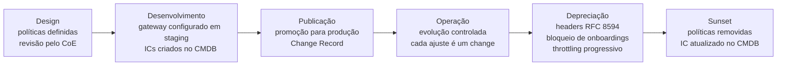
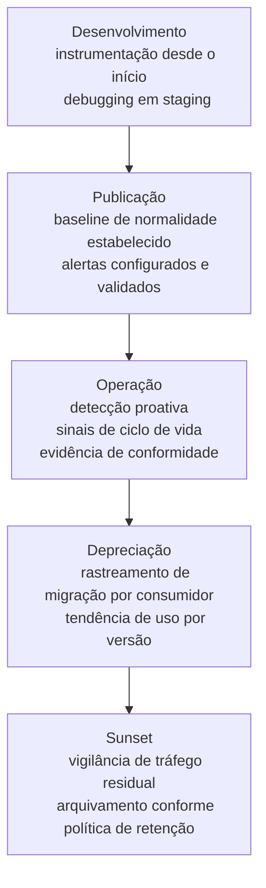
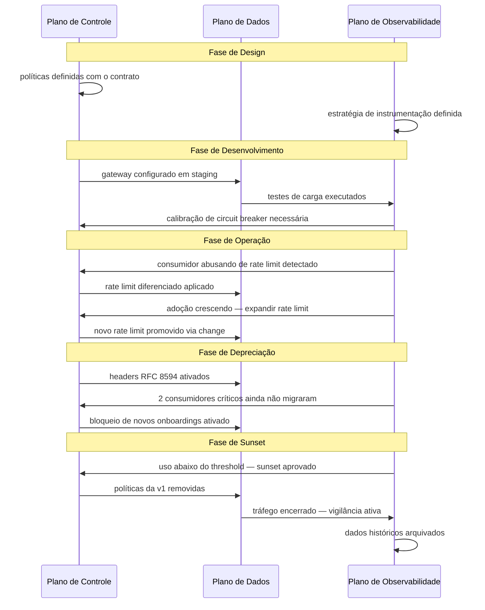

# Módulo 2 · Ciclo de Vida de APIs
## Capítulo 2.7 · Os três planos ao longo do ciclo de vida

> **Série:** Gerenciamento e Governança de APIs
> **Nível:** Operacional
> **Pré-requisito:** Cap 2.6 · Depreciação e sunset controlado · Cap 1.5 · Os três planos: controle, dados e observabilidade

---

## Sumário

- [2.7.1 · Os três planos revisitados — da teoria à operação](#271--os-três-planos-revisitados--da-teoria-à-operação)
- [2.7.2 · Plano de controle ao longo do ciclo de vida](#272--plano-de-controle-ao-longo-do-ciclo-de-vida)
- [2.7.3 · Plano de dados ao longo do ciclo de vida](#273--plano-de-dados-ao-longo-do-ciclo-de-vida)
- [2.7.4 · Plano de observabilidade ao longo do ciclo de vida](#274--plano-de-observabilidade-ao-longo-do-ciclo-de-vida)
- [2.7.5 · Os três planos como sistema integrado no ciclo de vida](#275--os-três-planos-como-sistema-integrado-no-ciclo-de-vida)

---

## 2.7.1 · Os três planos revisitados — da teoria à operação

No Cap 1.5 estabelecemos os três planos como fundamento conceitual: o plano de controle como o cérebro — onde políticas vivem, o plano de dados como o músculo — onde o tráfego flui, e o plano de observabilidade como os olhos — onde sinais são coletados e interpretados.

Aqui o ângulo muda. Em vez de perguntar o que cada plano é, perguntamos o que cada plano faz em cada momento do ciclo de vida — e quem é responsável por ele naquele momento.

Essa pergunta revela algo que a visão estática dos planos não captura: **os três planos não têm o mesmo peso em todas as fases**. Em algumas fases o plano de controle é o mais crítico. Em outras, a observabilidade é o que mais importa. Em outras ainda, é o plano de dados que define o sucesso da fase.

Entender esse peso relativo é o que separa times que gerenciam APIs de forma ativa — antecipando o que cada fase exige — de times que gerenciam de forma reativa — respondendo a problemas depois que aparecem.

---

## 2.7.2 · Plano de controle ao longo do ciclo de vida

O plano de controle é o único dos três planos que tem papel significativo antes da API entrar em produção. Ele começa a ser construído no design e é o último a ser desligado no sunset.

---

### Fase de design e especificação

É aqui que o plano de controle nasce — não como configuração de gateway, mas como decisão de governança. As políticas que vão governar a API são definidas junto com o contrato:

- Quais mecanismos de autenticação serão aceitos?
- Quais rate limits se aplicam por tier de consumidor?
- Qual estratégia de roteamento será usada?
- Quais transformações de payload serão necessárias?

Essas decisões não são detalhes técnicos — são parte do contrato da API. Projetá-las depois da spec é um anti-padrão comum que frequentemente resulta em políticas que conflitam com o design do contrato.

A governança nesta fase: as políticas propostas são revisadas pelo CoE contra o style guide e as políticas de segurança corporativas. Políticas que não passam na revisão bloqueiam o avanço para a fase de desenvolvimento — não são corrigidas depois.

---

### Fase de desenvolvimento

O plano de controle é implementado no ambiente de desenvolvimento e staging. O gateway precisa estar configurado com as políticas definidas no design antes dos primeiros testes de integração.

Um erro frequente é testar a implementação do backend sem o gateway configurado — e só descobrir incompatibilidades entre as políticas e a implementação em staging ou em produção.

A governança nesta fase: as configurações do gateway em staging são tratadas como ICs no CMDB desde o início. Mudanças nas políticas durante o desenvolvimento seguem o mesmo processo de change management que em produção — em escala menor, mas com o mesmo rigor.

---

### Fase de publicação

O plano de controle em produção é o resultado da promoção das configurações validadas em staging. Nenhuma política vai diretamente para produção sem ter passado por staging.

A configuração de produção inclui todos os elementos definidos no design, além de ajustes finais baseados nos testes de staging: rate limits calibrados com o volume esperado, políticas de segurança verificadas contra o ambiente real, roteamento configurado para o backend de produção.

A governança nesta fase: a promoção das configurações do gateway de staging para produção é um Change Record — com aprovação, plano de rollback e janela de manutenção definida.

---

### Fase de operação e evolução

Em operação, o plano de controle é o mecanismo pelo qual a evolução da API é gerenciada sem impacto nos consumidores:

- Rate limits ajustados quando o volume de uso cresce além do previsto
- Novas políticas de segurança aplicadas em resposta a vulnerabilidades emergentes
- Roteamento ajustado para suportar versões em coexistência durante breaking changes
- Políticas de throttling ativadas quando um consumidor apresenta padrão de abuso

Cada uma dessas mudanças é um Change Record — não um ajuste ad hoc feito diretamente no gateway de produção.

---

### Fase de depreciação

O plano de controle é o mecanismo técnico que implementa a política de depreciação. Conforme o processo definido no Cap 2.6, o gateway é progressivamente configurado para:

- Incluir headers de depreciação (RFC 8594) em todas as respostas da versão depreciada
- Bloquear novos onboardings na versão depreciada a partir da data definida
- Aplicar rate limits progressivamente mais restritivos à medida que o sunset se aproxima
- Redirecionar tráfego residual para a nova versão nos dias finais

---

### Fase de sunset

O desligamento do plano de controle é o ato final do ciclo de vida técnico. As políticas da versão encerrada são removidas do gateway — ou arquivadas conforme a política de retenção. O IC correspondente no CMDB é atualizado para status "retirado".

---

## 2.7.3 · Plano de dados ao longo do ciclo de vida

O plano de dados é o mais silencioso dos três — quando está funcionando bem, é invisível. Sua relevância em cada fase está diretamente ligada ao volume e criticidade do tráfego que precisa processar.

---

### Fase de desenvolvimento

O plano de dados em desenvolvimento opera com tráfego artificial — testes automatizados, testes de contrato, testes de carga controlados. Seu papel principal é validar que a implementação do backend e as políticas do plano de controle funcionam corretamente juntos.

O erro mais comum: não replicar a configuração do plano de dados de produção no ambiente de staging. Quando o gateway de staging tem configurações diferentes do de produção, comportamentos que aparecem em produção não são detectados antes do lançamento.

---

### Fase de publicação

O plano de dados entra em modo de observação ativa. Os primeiros consumidores reais geram tráfego real — e frequentemente revelam padrões que os testes não anteciparam. Picos de uso em horários específicos, padrões de retry que sobrecarregam determinados endpoints, volumes por consumidor que diferem das estimativas.

Esta fase estabelece o baseline de comportamento do plano de dados — latência típica, throughput máximo observado, padrões de erro — que vai alimentar o SLA formal da fase de operação.

---

### Fase de operação

É onde o plano de dados opera em plena capacidade. Seus desafios nesta fase são:

**Escalabilidade** — o tráfego cresce com a adoção. O plano de dados precisa escalar horizontalmente sem mudanças de configuração de política — instâncias adicionais do gateway recebem as mesmas políticas do plano de controle e começam a processar tráfego imediatamente.

**Resiliência** — falhas de backend são inevitáveis. Os padrões de resiliência introduzidos no Cap 1.5 — circuit breaker, retry com backoff, timeout — são configurados no plano de controle mas executados no plano de dados. A calibração correta desses padrões é uma atividade de operação contínua, ajustada com base nos dados do plano de observabilidade.

**Performance** — latência adicionada pelo gateway precisa permanecer dentro dos limites do SLA. Qualquer nova política adicionada ao plano de controle tem custo de latência no plano de dados — o que reforça a necessidade de avaliar o impacto de cada mudança de política antes de aplicá-la em produção.

---

### Fase de depreciação e sunset

O plano de dados na depreciação tem um papel específico: permitir que o tráfego da versão depreciada continue fluindo enquanto consumidores migram, ao mesmo tempo em que o tráfego da nova versão cresce.

O gateway roteia tráfego para backends diferentes baseado na versão da requisição — e esse roteamento precisa ser monitorado ativamente para detectar quando o tráfego da versão antiga cai abaixo do threshold definido no plano de depreciação.

No sunset, o plano de dados para de processar tráfego da versão encerrada. Qualquer tráfego residual retorna erro 410 Gone ou é redirecionado para a nova versão, conforme o modo de encerramento escolhido.

---

## 2.7.4 · Plano de observabilidade ao longo do ciclo de vida

O plano de observabilidade é o único dos três que gera valor em todas as fases — inclusive antes da API estar em produção. É também o mais frequentemente subestimado, configurado de forma mínima e expandido apenas depois de um incidente.

---

### Fase de desenvolvimento

A observabilidade deve ser instrumentada antes do primeiro deploy em staging — não depois do primeiro incidente em produção. O código do backend inclui instrumentação de traces, métricas e logs desde o início do desenvolvimento.

O valor de observabilidade em desenvolvimento não é monitoramento — é debugging. Traces distribuídos que mostram exatamente onde uma requisição falha em staging são muito mais valiosos do que stack traces genéricos.

---

### Fase de publicação

O baseline de observabilidade estabelecido nos primeiros dias de produção é uma das informações mais valiosas do ciclo de vida. Latência típica, taxa de erros em condições normais, padrões de uso por endpoint — esses dados definem o "normal" contra o qual anomalias futuras serão detectadas.

Uma observabilidade configurada apenas depois do lançamento perde esse baseline inicial e opera sem referência de normalidade por um período crítico.

---

### Fase de operação

Em operação, o plano de observabilidade cumpre três papéis simultâneos:

**Detecção proativa de anomalias** — alertas que disparam antes que consumidores percebam degradação. SLA de disponibilidade e latência monitorados continuamente contra thresholds definidos.

**Fonte de dados para decisões de ciclo de vida** — métricas de uso por consumidor, tendências de adoção por versão, padrões de erro recorrentes. É aqui que os sinais que vão alimentar a decisão de deprecar emergem — não como insight súbito, mas como tendência que se confirma ao longo do tempo.

**Evidência de conformidade** — logs e métricas preservados conforme a política de retenção, com rastreabilidade que permite reconstruir o histórico de qualquer requisição. Em setores regulados, essa evidência pode ser exigida por auditores.

---

### Fase de depreciação

A observabilidade na depreciação tem um papel específico e crítico: **rastrear o progresso de migração dos consumidores**.

Métricas de uso por versão e por consumidor mostram em tempo real quem ainda está na versão depreciada, qual é a tendência de migração e quando o uso vai cair abaixo do threshold de sunset. Sem essa visibilidade, o processo de depreciação opera no escuro.

---

### Fase de sunset e pós-sunset

O sunset não encerra a responsabilidade do plano de observabilidade. Por um período após o encerramento, logs e métricas precisam ser monitorados para detectar tráfego residual de consumidores que não perceberam o encerramento.

Após esse período de vigilância, os dados históricos são arquivados conforme a política de retenção. Em setores regulados, o prazo de retenção pode ser definido por regulação — e não é opcional.

---

## 2.7.5 · Os três planos como sistema integrado no ciclo de vida

Os três planos operam como sistema — não como peças independentes. O valor de cada plano é amplificado pelos outros dois, e a ausência ou fraqueza de qualquer um degrada os demais.

---

### A tabela de referência

| Fase | Plano de controle | Plano de dados | Plano de observabilidade |
|---|---|---|---|
| **Design** | Políticas definidas com o contrato · revisão pelo CoE | Arquitetura de roteamento e resiliência projetada | Estratégia de instrumentação definida |
| **Desenvolvimento** | Gateway configurado em staging · ICs criados no CMDB | Testes de integração com gateway real · baseline de performance | Instrumentação implementada · debugging em staging |
| **Publicação** | Promoção para produção via Change Record · políticas validadas | Primeiros consumidores reais · baseline de tráfego estabelecido | Alertas configurados · baseline de normalidade capturado |
| **Operação** | Evolução controlada via changes · ajustes de rate limit · roteamento de versões | Escalabilidade e resiliência em carga real · calibração de padrões de resiliência | Detecção proativa · sinais de ciclo de vida · evidência de conformidade |
| **Depreciação** | Headers RFC 8594 · bloqueio de onboardings · throttling progressivo | Roteamento dual de versões · monitoramento de tráfego por versão | Rastreamento de migração por consumidor · tendência de uso |
| **Sunset** | Políticas removidas · IC atualizado no CMDB | Tráfego encerrado · tráfego residual tratado (410 ou redirect) | Vigilância pós-encerramento · arquivamento de dados históricos |

---

### O cenário integrado — do design ao sunset

Para tornar a interação dos três planos concreta ao longo do tempo, considere uma API de notificações que percorre o ciclo completo:

**Design** — o plano de controle é projetado junto com a spec: OAuth 2.0 com scope `notificacoes:write`, rate limit de 100 requisições por minuto por consumidor, roteamento para o backend de notificações v1. O plano de observabilidade define que cada requisição emitirá traces com correlation ID, métricas de latência por endpoint e logs de erro estruturados.

**Desenvolvimento** — o gateway de staging é configurado com as políticas definidas. O plano de dados é testado com testes de carga que simulam 10x o volume esperado — revelando que o circuit breaker precisa de ajuste fino. O plano de observabilidade captura esses testes e mostra exatamente onde a latência aumenta sob carga.

**Publicação** — as configurações validadas são promovidas para produção via Change Record. Os primeiros consumidores geram tráfego real. O plano de observabilidade estabelece o baseline: latência p99 de 180ms, taxa de erros de 0.3%, pico de tráfego às 14h com 60 requisições por minuto. O SLA formal é definido com folga sobre esse baseline.

**Operação** — seis meses depois, o plano de observabilidade detecta um consumidor específico consumindo 80% do rate limit disponível de forma consistente. O plano de controle é ajustado para aplicar rate limit diferenciado para esse consumidor — Change Record aprovado e implementado sem impacto nos demais. Três meses depois, métricas de uso mostram adoção crescente e o rate limit geral é expandido — outro Change Record.

**Depreciação** — doze meses depois, a v2 da API está estável. O plano de observabilidade mostra que 70% do tráfego já migrou organicamente para a v2. A decisão de deprecar a v1 é aprovada. O plano de controle passa a incluir headers RFC 8594 em todas as respostas da v1. Dois meses depois, o bloqueio de novos onboardings é ativado. O plano de observabilidade rastreia a migração dos 30% restantes — identificando dois consumidores críticos que ainda não iniciaram.

**Sunset** — na data prevista, o plano de observabilidade confirma que o uso da v1 caiu para 2% do pico histórico — ambos consumidores críticos migraram após outreach proativo. O checklist de sunset é verificado. O plano de controle remove as políticas da v1. O plano de dados para de processar tráfego da v1 — respostas 410 Gone para qualquer requisição residual. O plano de observabilidade monitora por 48 horas e confirma ausência de tráfego significativo. ICs atualizados no CMDB. Dados históricos arquivados.

---

### Os três padrões que o cenário revela

**Padrão 1 — Observabilidade como antecedente de decisão**
Em cada fase, o plano de observabilidade fornece os dados que justificam as decisões do plano de controle. Rate limit ajustado porque a observabilidade detectou abuso. Sunset aprovado porque a observabilidade confirmou que o uso caiu. Sem observabilidade, as decisões do plano de controle seriam baseadas em intuição — não em dados.

**Padrão 2 — Plano de controle como executor de governança**
Cada decisão de governança — política de depreciação, change management, ajuste de rate limit — se materializa como configuração no plano de controle. O plano de controle é a interface entre as decisões de governança e o comportamento técnico da API. Governança sem plano de controle é intenção sem execução.

**Padrão 3 — Plano de dados como validador de hipóteses**
O plano de dados valida se as políticas do plano de controle estão produzindo o comportamento esperado. Rate limit configurado — o plano de dados confirma se está sendo respeitado. Circuit breaker calibrado — o plano de dados confirma se está disparando com a frequência correta. Sem o plano de dados como validador, o plano de controle opera sem feedback.

> **Os três planos são um sistema de governança técnica. O plano de controle executa as decisões. O plano de dados valida os resultados. O plano de observabilidade informa as próximas decisões. Quando os três operam de forma integrada ao longo de todo o ciclo de vida, a API é gerenciada ativamente — não apenas monitorada.**

---

## Fechando o Módulo 2

Este capítulo encerra o Módulo 2 com a conexão que estava pendente desde o Cap 1.5 — mostrando como os três planos se comportam ao longo do tempo, não apenas em um momento estático de operação.

O Módulo 2 construiu o ciclo de vida de APIs do ponto de vista operacional — das fases e seus gates, passando pelo design-first, pelos contratos, pela documentação, pelo versionamento, pela depreciação e pela infraestrutura técnica que sustenta tudo isso. Cada capítulo adicionou uma dimensão à pergunta central: **como uma API é gerenciada bem ao longo de toda a sua existência?**

A resposta que emerge do módulo é que gerenciar APIs bem é essencialmente uma questão de processo e de governança — não de tecnologia. As ferramentas existem e são maduras. O que diferencia organizações não é o gateway que usam ou as especificações que adotam — é a disciplina de processo que mantêm ao longo do tempo.

O Módulo 3 vai aprofundar exatamente essa dimensão — a governança organizacional que torna os processos do Módulo 2 possíveis em escala.

---

## Pontos-chave do capítulo

- Os três planos não têm o mesmo peso em todas as fases do ciclo de vida — entender esse peso relativo é o que separa gestão ativa de gestão reativa
- O plano de controle é o único que começa antes da produção — nasce no design como decisão de governança e é o último a ser desligado no sunset
- O plano de dados é invisível quando funciona bem — seu papel muda de validador em desenvolvimento para sustentador de escalabilidade e resiliência em operação e executor do encerramento no sunset
- O plano de observabilidade gera valor em todas as fases — incluindo antes da produção. Observabilidade configurada depois do lançamento perde o baseline de normalidade que é fundamental para detectar anomalias
- Os três padrões sistêmicos: observabilidade como antecedente de decisão, plano de controle como executor de governança e plano de dados como validador de hipóteses
- O cenário integrado revela que governança técnica efetiva não é sobre cada plano individualmente — é sobre como os três se alimentam mutuamente ao longo do tempo

---

## Próximo módulo

**Módulo 3 · Governança de APIs** — a estrutura organizacional, os papéis, as políticas e os processos que tornam possível gerenciar um portfólio de APIs com consistência, qualidade e alinhamento estratégico em escala.

---

*Série: Gerenciamento e Governança de APIs · Módulo 2 · Capítulo 2.7*