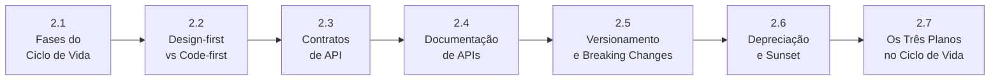

# Módulo 2 — Ciclo de Vida de APIs

> **Série:** Gerenciamento e Governança de APIs
> **Nível:** Operacional
> **Pré-requisito:** Módulo 1 — Fundamentos

---

## Sobre este módulo

Entender o que é uma API e como governá-la conceitualmente é o ponto de partida — mas o trabalho real acontece ao longo do tempo. APIs nascem, evoluem, acumulam consumidores, enfrentam decisões difíceis de mudança e, eventualmente, precisam ser encerradas. O Módulo 2 acompanha essa jornada do início ao fim.

Cada capítulo foca em uma dimensão do ciclo de vida: como as fases se encadeiam, como as decisões de design impactam a governança futura, como contratos são especificados e mantidos, como documentação é produzida e atualizada, como mudanças são gerenciadas sem quebrar consumidores, e como o encerramento de uma API pode — e deve — ser conduzido de forma controlada e transparente.

O módulo fecha revisitando os três planos do Módulo 1 agora sob a ótica operacional: o que o plano de controle, o plano de dados e o plano de observabilidade fazem em cada fase do ciclo de vida.

---

## Capítulos

### [2.1 · As Fases do Ciclo de Vida](cap_2_1_ciclo_vida.md)

O ciclo de vida de uma API não é uma linha do tempo simples — é um sistema com fases, critérios de transição e responsabilidades distintas em cada momento. Este capítulo mapeia as seis fases — concepção, design, desenvolvimento, publicação, operação e depreciação — e introduz o conceito de *gates de governança*: pontos de controle que determinam quando uma API está pronta para avançar de fase.

---

### [2.2 · Design-first vs. Code-first](cap_2_2_design_code.md)

A ordem em que decisões são tomadas define quem tem autoridade sobre o contrato de uma API. Design-first coloca a especificação antes do código — e com ela, a governança antes da implementação. Code-first inverte essa ordem, frequentemente com consequências que só aparecem quando já há consumidores. O capítulo analisa os dois modelos, seus trade-offs reais, a abordagem pragmática de calibrar o processo pelo risco e o papel crescente da IA nesse processo.

---

### [2.3 · Contratos de API — OpenAPI, AsyncAPI e gRPC](cap_2_3_contratos.md)

O contrato é o artefato central de governança de uma API — não a documentação, não o código, mas a especificação que governa ambos. Este capítulo cobre os três principais formatos de contrato — OpenAPI para REST, AsyncAPI para APIs orientadas a eventos e Protocol Buffers para gRPC — e aborda contract testing, a distinção entre abordagens consumer-driven e provider-driven, e o fenômeno do *contract drift* quando a governança é omissa.

---

### [2.4 · Documentação de APIs](cap_2_4_documentacao.md)

Documentação não é spec. A distinção parece óbvia, mas é sistematicamente ignorada — com consequências diretas na adoção e na experiência do desenvolvedor. Este capítulo cobre os tipos de documentação, quem os produz, quando devem ser escritos e como se mantêm sincronizados com a API ao longo do tempo. Inclui uma análise do conceito de *API AI Readiness* — como a qualidade da documentação determina a capacidade de agentes de IA de consumir e integrar APIs corretamente.

---

### [2.5 · Versionamento e Gestão de Breaking Changes](cap_2_5_versionamento.md)

APIs precisam evoluir — mas evolução sem controle quebra consumidores. Este capítulo define o que é uma breaking change (e o que não é), apresenta as estratégias de versionamento disponíveis e seus trade-offs, e detalha como uma *deprecation policy* torna o versionamento previsível e governável. Aborda também o processo de change management para breaking changes e os desafios específicos de portfólios heterogêneos.

> Referencia os Anexos [A.1](../anexos/a_1_breaking_changes_REST.md), [A.2](../anexos/a_2_breaking_changes_graphQL.md), [A.3](../anexos/a_3_breaking_changes_grpc.md) e [A.4](../anexos/a_4_breaking_changes_asyncapi.md) com classificação exaustiva de breaking changes por estilo arquitetural.

---

### [2.6 · Depreciação e Sunset Controlado](cap_2_6_depreciacao.md)

Encerrar uma API é tão crítico quanto lançá-la — e frequentemente mais difícil. Este capítulo trata a depreciação como processo, não como evento: desde a decisão de deprecar, passando pelo plano de depreciação, comunicação com consumidores, suporte à migração e execução do sunset, até as salvaguardas jurídicas necessárias quando há consumidores externos. A governança tem papel central em cada uma dessas etapas.

> Referencia o [Anexo B](../anexos/b_plano_depreciacao.md) com template de plano de depreciação.

---

### [2.7 · Os Três Planos ao Longo do Ciclo de Vida](cap_2_7_tres_planos.md)

O encerramento do módulo revisita os três planos introduzidos no Capítulo 1.5 — controle, dados e observabilidade — agora sob a ótica operacional. Em vez de perguntar *o que* cada plano é, o capítulo pergunta *o que* cada plano faz em cada fase do ciclo de vida e quem é responsável por ele naquele momento. Os três planos como sistema integrado são o fio condutor que conecta as decisões de design às operações do dia a dia.

---

## Progressão conceitual

