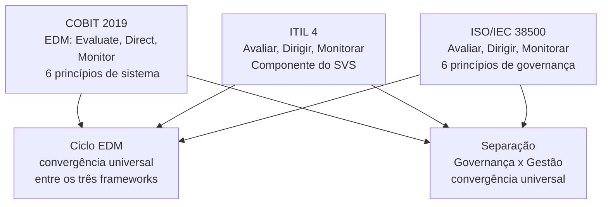
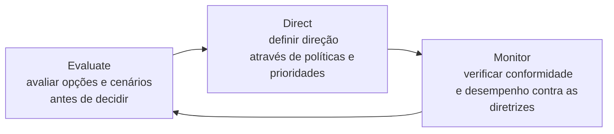
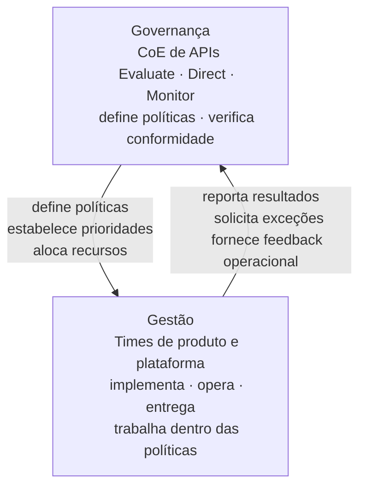
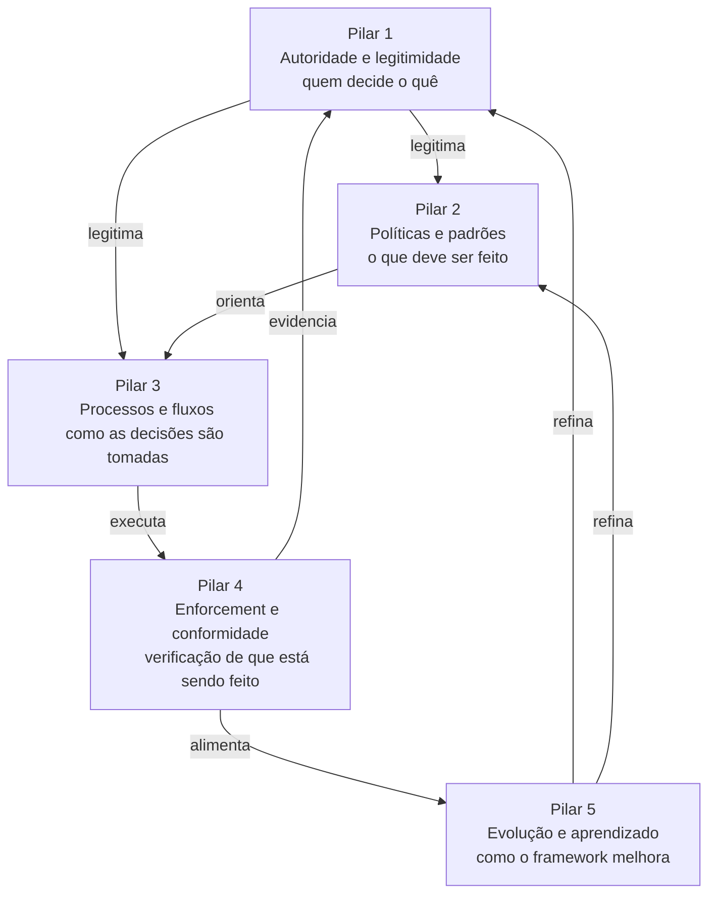

# Módulo 3 · Governança de APIs
## Capítulo 3.1 · Pilares da governança

> **Série:** Gerenciamento e Governança de APIs
> **Nível:** Estratégico e organizacional
> **Pré-requisito:** Módulo 1 · Cap 1.3 e 1.4 · Módulo 2 completo

---

## Sumário

- [3.1.1 · Por que precisamos de referências teóricas](#311--por-que-precisamos-de-referências-teóricas)
- [3.1.2 · O que os frameworks dizem — convergências e diferenças](#312--o-que-os-frameworks-dizem--convergências-e-diferenças)
- [3.1.3 · O ciclo EDM — o núcleo operacional universal](#313--o-ciclo-edm--o-núcleo-operacional-universal)
- [3.1.4 · A separação entre governança e gestão](#314--a-separação-entre-governança-e-gestão)
- [3.1.5 · Os pilares de governança de APIs](#315--os-pilares-de-governança-de-apis)
- [3.1.6 · Por que governança falha — evidência empírica](#316--por-que-governança-falha--evidência-empírica)
- [3.1.7 · Os pilares como sistema](#317--os-pilares-como-sistema)
- [Fontes e referências](#fontes-e-referências)

---

## 3.1.1 · Por que precisamos de referências teóricas

Ao longo do Módulo 1 e do Módulo 2, tratamos governança de APIs de forma predominantemente operacional — o que ela produz, como se manifesta no ciclo de vida, quais são seus anti-padrões. O Cap 3.1 muda o ângulo: antes de construir um framework de governança de APIs, precisamos entender sobre quais bases teóricas ele deve se apoiar.

Construir pilares de governança do zero seria um erro intelectual. Décadas de pesquisa empírica e prática organizacional consolidaram o conhecimento sobre o que torna um sistema de governança funcional — independente do domínio. Ignorar esse conhecimento para inventar pilares específicos de APIs seria reinventar a roda com menos rigor.

Há porém uma lacuna importante que precisamos nomear com honestidade: **a literatura acadêmica específica sobre governança de APIs ainda está em formação**. A revisão sistemática mais abrangente disponível — publicada por Mathijssen, Overeem e Jansen da Universidade de Utrecht em 2020 — identificou que o conhecimento sobre API Management está fragmentado na literatura acadêmica, com a maioria dos estudos focando em dimensões técnicas e negligenciando aspectos organizacionais e de governança.

> *Mathijssen, M., Overeem, M. & Jansen, S. Identification of Practices and Capabilities in API Management: A Systematic Literature Review. Utrecht University, 2020. Disponível em: [arxiv.org/abs/2006.10481](https://arxiv.org/abs/2006.10481)*

Isso torna os frameworks consolidados de governança de TI ainda mais relevantes como base — eles representam o estado da arte disponível para estruturar a governança de APIs com rigor.

---

## 3.1.2 · O que os frameworks dizem — convergências e diferenças

Três frameworks de referência oferecem a base teórica mais sólida disponível para governança de TI — e, por extensão, para governança de APIs.

---

### COBIT 2019 — ISACA

O COBIT (*Control Objectives for Information and Related Technologies*), mantido pela ISACA, é o framework de governança de TI corporativa mais adotado globalmente. Em sua versão de 2019 — a mais recente — o COBIT estrutura a governança em torno de seis princípios de sistema:

1. Fornecer valor às partes interessadas
2. Abordagem holística — pessoas, processos, tecnologia e cultura em conjunto
3. Sistema de governança dinâmico — que evolui com o ambiente
4. Adequado às necessidades da empresa — não existe solução universal
5. Separação de governança e gestão
6. Sistema de ponta a ponta — abrange toda a organização

O COBIT organiza os objetivos de governança no domínio **EDM** — Evaluate, Direct, Monitor — que representa o ciclo operacional fundamental de qualquer corpo governante.

> *ISACA. COBIT 2019 Framework. Disponível em: [isaca.org/resources/cobit](https://www.isaca.org/resources/cobit)*

---

### ITIL 4 — Axelos / PeopleCert

O ITIL 4, publicado em 2019, posiciona governança como um dos cinco componentes centrais do **Sistema de Valor de Serviço (SVS)**. Governança no ITIL 4 envolve as atividades de avaliar, dirigir e monitorar — com o objetivo de garantir que as práticas organizacionais estejam alinhadas com os objetivos de negócio estabelecidos.

O ITIL 4 é notável por sua ênfase em dois aspectos que os outros frameworks tratam de forma menos explícita: a **melhoria contínua** como dimensão inseparável da governança, e a **integração entre governança e operações** — governança não é uma camada acima das operações, é parte do mesmo sistema de valor.

> *Axelos. ITIL Foundation: ITIL 4 Edition. 2019. Disponível em: [axelos.com/certifications/itil-service-management](https://www.axelos.com/certifications/itil-service-management)*

---

### ISO/IEC 38500:2024 — ISO/IEC

A ISO/IEC 38500 é o padrão internacional para governança corporativa de tecnologia da informação — publicado originalmente em 2008 e revisado em 2024. É o único padrão internacional formal nesta área, com adoção em mais de 160 países.

O padrão define seis princípios que descrevem o que é boa governança de TI:

| Princípio | Descrição |
|---|---|
| **Responsabilidade** | Indivíduos e grupos entendem e aceitam suas responsabilidades relacionadas a TI |
| **Estratégia** | Estratégias de TI e de negócio são alinhadas — TI suporta objetivos atuais e futuros |
| **Aquisição** | Decisões de aquisição de TI são feitas por razões válidas e com due diligence adequada |
| **Desempenho** | TI é adequada para suportar a organização e entregar os serviços necessários |
| **Conformidade** | TI está em conformidade com legislação e regulações obrigatórias |
| **Comportamento humano** | Políticas e práticas de TI demonstram respeito pelo comportamento humano |

> *ISO/IEC. 38500:2024 — Information Technology: Governance of IT for the Organization. Disponível em: [iso.org/standard/84415.html](https://www.iso.org/standard/84415.html)*

---

### A convergência notável

O que é academicamente significativo não é o que cada framework propõe individualmente — é o que eles têm em comum. Os três frameworks, desenvolvidos por organizações independentes com metodologias distintas, convergem em dois pontos fundamentais:

**Primeiro:** o ciclo operacional da governança é universalmente o mesmo — Evaluate, Direct, Monitor. Essa convergência não é coincidência — é reconhecimento de que qualquer sistema de governança funcional precisa dessas três atividades para operar.

**Segundo:** todos separam explicitamente governança de gestão. Governança define direção e avalia resultados; gestão executa planos. Essa separação tem raiz nos frameworks mais consolidados da área.

---

## 3.1.3 · O ciclo EDM — o núcleo operacional universal

O ciclo Evaluate-Direct-Monitor merece tratamento dedicado porque é o mecanismo mais fundamental de qualquer sistema de governança — e o mais frequentemente ausente em organizações que têm políticas mas não têm governança funcional.

---

### Evaluate — Avaliar

A atividade de avaliação é onde o corpo governante examina o estado atual, as opções disponíveis e as necessidades das partes interessadas antes de tomar decisões. No contexto de APIs:

- Quais APIs existem no portfólio e qual valor estão gerando?
- O estado atual das APIs está alinhado com os objetivos estratégicos?
- Quais são os riscos e as oportunidades do portfólio atual?
- As políticas existentes são adequadas ou precisam ser revisadas?

Governança sem avaliação sistemática opera no escuro — toma decisões sem dados, define políticas sem diagnóstico e não consegue detectar quando o portfólio está derivando da direção estratégica.

---

### Direct — Dirigir

A atividade de direção é onde o corpo governante estabelece políticas, prioridades e responsabilidades — traduzindo a avaliação em orientação concreta para a gestão. No contexto de APIs:

- Quais são os padrões obrigatórios para todas as APIs?
- Quais são as prioridades do portfólio — quais APIs merecem investimento, quais devem ser descontinuadas?
- Quem tem autoridade para tomar quais decisões?
- Quais recursos são alocados para o programa de APIs?

Governança sem direção clara produz times que trabalham sem orientação — cada um com sua própria interpretação do que é certo, sem critérios compartilhados.

---

### Monitor — Monitorar

A atividade de monitoramento é onde o corpo governante verifica se as diretrizes estão sendo seguidas e se os resultados esperados estão sendo alcançados. No contexto de APIs:

- As políticas definidas estão sendo aplicadas?
- Os SLAs estão sendo cumpridos?
- O portfólio está evoluindo na direção estratégica definida?
- Os consumidores estão recebendo o valor prometido?

Governança sem monitoramento é governança fiduciária — estabelece regras e confia que serão seguidas, sem verificação. Essa é precisamente a falha que identificamos no Cap 1.3 como anti-padrão 2: governança sem enforcement.

---

### O ciclo como sistema — não como sequência

O EDM não é uma sequência linear executada uma vez. É um ciclo contínuo onde cada atividade alimenta as outras: monitoramento gera dados que alimentam a próxima avaliação; avaliação produz insights que refinam as diretrizes; diretrizes atualizadas determinam o que o monitoramento deve verificar.

Organizações com governança madura executam esse ciclo em diferentes frequências para diferentes dimensões — algumas decisões são avaliadas e dirigidas trimestralmente, outras mensalmente, outras continuamente através de automação.

---

## 3.1.4 · A separação entre governança e gestão

A separação entre governança e gestão é o princípio mais frequentemente violado na prática — e o mais importante para APIs.

A pesquisa empírica de Weill e Ross, baseada em estudo com quase 300 empresas em 23 países conduzido pelo MIT Sloan Center for Information Systems Research, estabeleceu que a maioria das falhas de governança de TI não é causada por ausência de políticas — é causada por **ambiguidade de accountability**: as pessoas não sabem quem tem autoridade para tomar quais decisões. A conclusão central é que governança de TI eficaz precisa ser ativamente projetada — não pode ser resultado de mecanismos isolados implementados em momentos diferentes para endereçar o desafio do momento.

> *Weill, P. & Ross, J. W. IT Governance: How Top Performers Manage IT Decision Rights for Superior Results. Harvard Business School Press, 2004. Resumo disponível em: [papers.ssrn.com/sol3/papers.cfm?abstract_id=664612](https://papers.ssrn.com/sol3/papers.cfm?abstract_id=664612)*

---

### O que significa separar governança de gestão em APIs

**Governança** define o que deve ser — as políticas, os padrões, as prioridades e os limites dentro dos quais as APIs são criadas e evoluídas. O corpo governante — CoE de APIs — não executa o trabalho técnico. Ele define as regras do jogo e verifica se estão sendo seguidas.

**Gestão** executa o que foi definido — implementa APIs dentro dos padrões estabelecidos, opera os gateways, responde a incidentes, onboarda consumidores. Os times de produto e plataforma não definem as políticas globais. Eles trabalham dentro delas.

A violação mais comum: times de engenharia que simultaneamente definem as políticas e as aplicam — sem um corpo governante independente que avalie e monitore. O resultado é exatamente o que Weill e Ross identificaram: cada time faz o que acha certo, sem critérios compartilhados, sem accountability clara.

A separação não é hierarquia de poder — é separação de responsabilidades. A gestão tem autonomia plena dentro dos limites definidos pela governança. A governança não executa — decide os limites dentro dos quais a execução acontece.

---

## 3.1.5 · Os pilares de governança de APIs

Com a base teórica estabelecida, podemos identificar os pilares que qualquer framework de governança de APIs precisa ter para ser funcional. Esses pilares não são uma invenção — são a aplicação ao contexto específico de APIs dos elementos que COBIT, ITIL 4, ISO 38500 e a pesquisa empírica identificaram como fundamentais.

---

### Pilar 1 — Autoridade e legitimidade

*Derivado do princípio de Responsabilidade da ISO 38500 e da pesquisa de Weill & Ross sobre decision rights.*

Governança sem autoridade é sugestão. Para que um framework de governança de APIs seja funcional, precisa haver clareza sobre quem tem poder de decisão em cada dimensão relevante:

- Quem pode criar uma nova API?
- Quem pode aprovar breaking changes?
- Quem pode bloquear um lançamento por não conformidade?
- Quem pode conceder exceções às políticas?

Essa clareza não nasce espontaneamente — precisa ser formalmente estabelecida e comunicada. A pesquisa de Weill e Ross mostrou que em média apenas um em três gestores sênior sabe como a TI é governada em sua empresa — e que governança eficaz requer design ativo, não arranjos ad hoc.

A legitimidade da autoridade de governança precisa ser estabelecida pela liderança executiva e compreendida pelos times. Autoridade sem legitimidade percebida gera contornamentos.

---

### Pilar 2 — Políticas e padrões

*Derivado do princípio de Estratégia da ISO 38500 e do componente Principles, Policies and Frameworks do COBIT 2019.*

O segundo pilar é o conjunto de regras que define como APIs devem ser criadas, evoluídas e encerradas. Políticas e padrões traduzem a visão estratégica em orientação concreta para o dia a dia.

No contexto de APIs: style guides de design, políticas de segurança obrigatórias, padrões de documentação, políticas de versionamento e depreciação, critérios de qualidade para publicação.

Uma distinção importante que o COBIT 2019 torna explícita: políticas não são processos. Políticas definem *o quê* é obrigatório ou proibido. Processos definem *como* as atividades são executadas. Confundir os dois produz documentos que são ao mesmo tempo vagos demais para orientar e detalhados demais para serem políticas.

---

### Pilar 3 — Processos e fluxos de decisão

*Derivado do domínio EDM do COBIT 2019 e das atividades de governança do ITIL 4.*

O terceiro pilar define como as decisões são tomadas — quem aprova o quê, com qual processo, em quanto tempo, com quais critérios. Processos bem desenhados habilitam — não paralisam. A distinção entre processos que habilitam e processos que paralisam está na calibração pelo risco: processos mais rigorosos para decisões de alto impacto, processos mais ágeis para decisões de baixo impacto.

De Haes e Van Grembergen, em pesquisa empírica com organizações do setor financeiro, identificaram que maturidade de alinhamento entre TI e negócio é consistentemente maior em organizações que aplicam uma combinação de práticas maduras de governança — não apenas estruturas ou apenas processos, mas os dois em conjunto.

> *De Haes, S. & Van Grembergen, W. An Exploratory Study into IT Governance Implementations and its Impact on Business/IT Alignment. Information Systems Management, 26(2), pp. 123-137, 2009. Disponível em: [tandfonline.com/doi/abs/10.1080/10580530902794786](https://www.tandfonline.com/doi/abs/10.1080/10580530902794786)*

---

### Pilar 4 — Enforcement e conformidade

*Derivado do princípio de Conformidade da ISO 38500 e do componente Monitor do ciclo EDM.*

O quarto pilar é o que transforma políticas declaradas em políticas aplicadas. Sem enforcement, os outros três pilares existem apenas no papel.

Enforcement eficaz tem duas dimensões que precisam coexistir:

**Automação** — gates no pipeline de CI/CD que verificam conformidade com style guide (Spectral), segurança (42Crunch), contrato (Pact). O que pode ser verificado por máquina deve ser verificado por máquina — consistentemente, sem depender de disponibilidade humana.

**Accountability** — quando desvios não podem ser detectados automaticamente, ou quando exceções são necessárias, há um processo formal com registro auditável. Quem desviou da política, quando, com qual justificativa e com qual aprovação.

A combinação das duas é o que permite governança que escala — automação garante consistência no volume, accountability garante responsabilização nos casos que exigem julgamento.

---

### Pilar 5 — Evolução e aprendizado

*Derivado do princípio de sistema de governança dinâmico do COBIT 2019 e da prática de Melhoria Contínua do ITIL 4.*

O quinto pilar é o que garante que o framework de governança não envelhece. Políticas escritas há três anos podem estar desalinhadas com o estado atual da tecnologia, do negócio e do portfólio. Um framework que não evolui torna-se progressivamente menos relevante — e progressivamente mais contornado.

Evolução não significa instabilidade. Weill e Ross identificaram em sua pesquisa que empresas com governança eficaz mudavam algum aspecto da governança aproximadamente uma vez por ano — enquanto empresas com governança menos eficaz mudavam até três vezes por ano. A evolução controlada é sinal de maturidade; mudanças frequentes são sinal de instabilidade.

No contexto de APIs, o ciclo de evolução do framework é alimentado por: análise de conformidade do portfólio, feedback dos times de desenvolvimento, análise de incidentes, mudanças regulatórias e evolução tecnológica do ecossistema.

---

## 3.1.6 · Por que governança falha — evidência empírica

Com os cinco pilares estabelecidos, é possível mapear as falhas de governança — identificadas como anti-padrões no Cap 1.3 — às suas causas raiz em termos de pilares ausentes ou fracos.

A pesquisa de Weill e Ross com 300 empresas estabeleceu que a maioria das falhas de governança tem origem na ambiguidade de accountability — não na ausência de políticas. E a pesquisa de De Haes e Van Grembergen confirmou empiricamente que maturidade de governança requer uma combinação de práticas — estruturas organizacionais, processos e mecanismos relacionais operando juntos.

| Anti-padrão (Cap 1.3) | Pilar ausente ou fraco | Evidência teórica |
|---|---|---|
| Governança como burocracia sem valor | Pilar 3 — processos não calibrados pelo risco | COBIT 2019: processos devem ser adequados às necessidades |
| Governança sem enforcement | Pilar 4 — conformidade não verificada | ISO 38500: conformidade é princípio fundamental |
| Governança sem ownership | Pilar 1 — autoridade e accountability ambíguas | Weill & Ross: ambiguidade de decision rights é causa raiz mais comum |
| Governança reativa | Pilar 5 — ausência de ciclo de avaliação proativa | COBIT EDM: Evaluate precede Direct e Monitor |
| Governança desconectada do negócio | Pilar 2 — políticas sem alinhamento estratégico | ISO 38500: Estratégia é princípio central |
| Governança que não escala | Pilar 4 — enforcement manual sem automação | ITIL 4: melhoria contínua inclui automação de controles |

---

## 3.1.7 · Os pilares como sistema

Os cinco pilares não são independentes — formam um sistema onde cada um depende dos outros para funcionar.

**Autoridade sem políticas** — a autoridade existe mas não há regras claras a enforçar. Decisões são tomadas de forma ad hoc, sem previsibilidade para os times.

**Políticas sem processos** — as regras existem mas não há clareza sobre como as decisões são tomadas. Cada situação é resolvida de forma diferente dependendo de quem está envolvido.

**Processos sem enforcement** — existe um processo formal mas ninguém verifica se está sendo seguido. O processo existe no papel; a prática é outra.

**Enforcement sem evolução** — as políticas são rigorosamente aplicadas mas nunca revisadas. Com o tempo, tornam-se desalinhadas da realidade e são progressivamente contornadas.

**Evolução sem autoridade** — o framework evolui mas as mudanças não têm legitimidade. Times aceitam as políticas antigas e ignoram as novas porque não há autoridade clara que as implemente.

> **Um framework de governança de APIs é tão forte quanto seu pilar mais fraco. A ausência de qualquer pilar não apenas enfraquece aquela dimensão específica — degrada todo o sistema. Governança funcional é sistêmica, não modular.**

---

## Pontos-chave do capítulo

- A literatura acadêmica específica sobre governança de APIs ainda está em formação — o que torna os frameworks consolidados de governança de TI (COBIT, ITIL 4, ISO 38500) ainda mais importantes como base teórica
- Os três frameworks convergem em dois pontos fundamentais: o ciclo EDM (Evaluate, Direct, Monitor) como núcleo operacional universal e a separação entre governança e gestão
- A pesquisa empírica de Weill & Ross com 300 empresas identificou que a causa raiz mais comum de falhas de governança é ambiguidade de accountability — não ausência de políticas
- Os cinco pilares derivados dos frameworks — autoridade, políticas, processos, enforcement e evolução — não são independentes: formam um sistema onde a fraqueza de qualquer um degrada os demais
- O mapeamento entre anti-padrões de governança (Cap 1.3) e pilares ausentes oferece um diagnóstico estruturado: cada falha aponta para uma dimensão específica que precisa ser fortalecida

---

## Fontes e referências

| Fonte | Referência completa |
|---|---|
| **COBIT 2019** | ISACA. *COBIT 2019 Framework: Introduction and Methodology*. ISACA, 2018. Disponível em: [isaca.org/resources/cobit](https://www.isaca.org/resources/cobit) |
| **ITIL 4** | Axelos. *ITIL Foundation: ITIL 4 Edition*. The Stationery Office, 2019. Disponível em: [axelos.com/certifications/itil-service-management](https://www.axelos.com/certifications/itil-service-management) |
| **ISO/IEC 38500:2024** | ISO/IEC. *38500:2024 — Information Technology: Governance of IT for the Organization*. ISO, 2024. Disponível em: [iso.org/standard/84415.html](https://www.iso.org/standard/84415.html) |
| **Weill & Ross (2004)** | Weill, P. & Ross, J. W. *IT Governance: How Top Performers Manage IT Decision Rights for Superior Results*. Harvard Business School Press, 2004. Resumo disponível em: [papers.ssrn.com/sol3/papers.cfm?abstract_id=664612](https://papers.ssrn.com/sol3/papers.cfm?abstract_id=664612) |
| **De Haes & Van Grembergen (2009)** | De Haes, S. & Van Grembergen, W. An Exploratory Study into IT Governance Implementations and its Impact on Business/IT Alignment. *Information Systems Management*, 26(2), pp. 123-137, 2009. Disponível em: [tandfonline.com/doi/abs/10.1080/10580530902794786](https://www.tandfonline.com/doi/abs/10.1080/10580530902794786) |
| **Mathijssen et al. (2020)** | Mathijssen, M., Overeem, M. & Jansen, S. Identification of Practices and Capabilities in API Management: A Systematic Literature Review. *Utrecht University*, 2020. Disponível em: [arxiv.org/abs/2006.10481](https://arxiv.org/abs/2006.10481) |

---

## Próximo capítulo

**3.2 · Papéis e responsabilidades** — quem são as pessoas e estruturas que operacionalizam os pilares de governança: API Owner, API Steward, CoE, times de plataforma e produto. Como papéis são definidos, como se relacionam e como accountability é estabelecida na prática.

---

*Série: Gerenciamento e Governança de APIs · Módulo 3 · Capítulo 3.1*