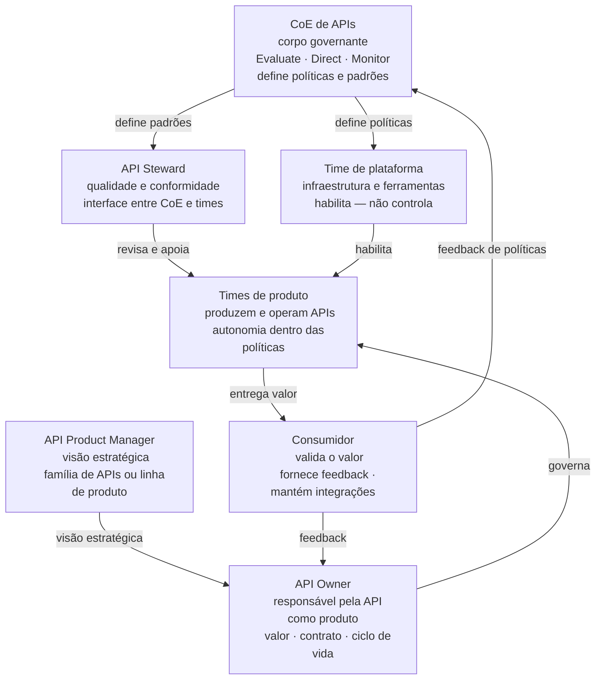
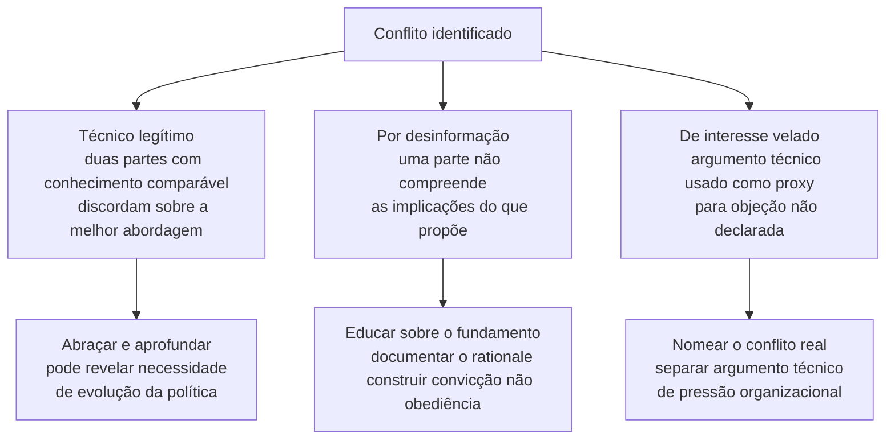
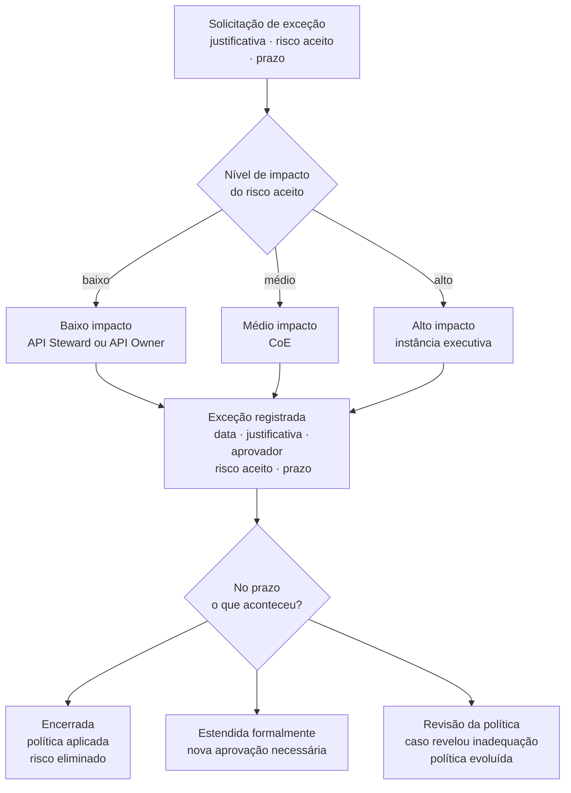

# Módulo 3 · Governança de APIs
## Capítulo 3.2 · Papéis e responsabilidades

> **Série:** Gerenciamento e Governança de APIs
> **Nível:** Estratégico e organizacional
> **Pré-requisito:** Cap 3.1 · Pilares da governança

---

## Sumário

- [3.2.1 · Por que a definição de papéis importa — e por que é difícil](#321--por-que-a-definição-de-papéis-importa--e-por-que-é-difícil)
- [3.2.2 · Os atores da governança de APIs](#322--os-atores-da-governança-de-apis)
- [3.2.3 · As cinco óticas para analisar relacionamentos entre papéis](#323--as-cinco-óticas-para-analisar-relacionamentos-entre-papéis)
- [3.2.4 · Conflitos, exceções e proteção da governança](#324--conflitos-exceções-e-proteção-da-governança)
- [3.2.5 · O princípio orientador — clareza sem rigidez](#325--o-princípio-orientador--clareza-sem-rigidez)
- [Fontes e referências](#fontes-e-referências)

**Anexo referenciado:**
- [Anexo C · Modelo RACI sugerido para governança de APIs](../anexos/c_raci.md)

---

## 3.2.1 · Por que a definição de papéis importa — e por que é difícil

Definir papéis em governança é uma das atividades mais importantes — e mais subestimadas — de qualquer programa de APIs. A tendência é tratá-la como um exercício de organograma: cria-se um diagrama com caixas e setas, publica-se no wiki e considera-se o assunto resolvido. A prática mostra que essa abordagem quase sempre falha.

---

### A evidência empírica sobre ambiguidade de papéis

A pesquisa organizacional estabeleceu há décadas que ambiguidade de papéis em organizações complexas produz consequências disfuncionais sistemáticas. Rizzo, House e Lirtzman, em estudo publicado no Administrative Science Quarterly em 1970, documentaram empiricamente que conflito e ambiguidade de papéis geram resultados negativos consistentes — menor satisfação no trabalho, maior intenção de rotatividade, menor desempenho individual e organizacional. Essa evidência foi extensivamente replicada em meta-análises subsequentes e permanece robusta na literatura.

> *Rizzo, J. R., House, R. J. & Lirtzman, S. I. Role Conflict and Ambiguity in Complex Organizations. Administrative Science Quarterly, 15(2), pp. 150-163, 1970. Disponível em: [semanticscholar.org/paper/Role-Conflict-and-Ambiguity-in-Complex-Rizzo-House](https://www.semanticscholar.org/paper/Role-Conflict-and-Ambiguity-in-Complex-Rizzo-House/48229911d2b48671cca6d44f3eeed07e1d87acf2)*

No contexto específico de governança de TI, Weill e Ross identificaram que a causa raiz mais comum de falhas de governança é exatamente a ambiguidade de accountability — as pessoas não sabem quem tem autoridade para tomar quais decisões. Papéis mal definidos não são um problema periférico de organização interna: são a causa raiz de falhas que se manifestam como incidentes técnicos, inconsistências de portfólio e conflitos interpessoais.

---

### O problema que os próprios frameworks não resolvem

Há uma lacuna importante que precisa ser nomeada com honestidade: mesmo os frameworks mais consolidados não resolvem o problema de alocação de papéis na prática.

Duhamel et al., em pesquisa empírica publicada em 2022 com 30 gestores de TI em 9 países ibero-americanos, usaram ISO/IEC 38500 e COBIT para analisar como papéis e responsabilidades são alocados entre corpos governantes e gestão. A conclusão é direta: os padrões existentes ainda falham em resolver o dilema sobre a alocação real de papéis e responsabilidades entre corpos governantes e gestão de TI — e essa alocação representa um desafio importante em muitas organizações contemporâneas. O grau de divergência na alocação de papéis depende de fatores de contingência organizacional como formalização de procedimentos, centralização, complexidade e tamanho do departamento de TI.

> *Duhamel, F., Luna-Reyes, L. F. et al. IT Managers' Framing of IT Governance Roles and Responsibilities in Ibero-American Higher Education Institutions. Informatics, 9(3), 68, 2022. Disponível em: [mdpi.com/2227-9709/9/3/68](https://www.mdpi.com/2227-9709/9/3/68)*

Isso tem uma implicação direta para o capítulo: qualquer estrutura de papéis apresentada aqui é um ponto de partida — não um gabarito. Cada organização precisa refletir sobre seus fatores de contingência antes de adotar qualquer modelo. O que este capítulo oferece é clareza sobre os atores envolvidos e suas responsabilidades abrangentes — não uma prescrição sobre como estruturá-los.

---

## 3.2.2 · Os atores da governança de APIs

Os atores descritos a seguir representam as responsabilidades que precisam existir em qualquer programa de APIs — independente de como a organização os nomeia, distribui ou combina. Em organizações menores, uma mesma pessoa pode acumular múltiplos papéis. Em organizações maiores, cada papel pode ser desempenhado por um time inteiro. O que importa não é o título — é que as responsabilidades estejam cobertas e que haja clareza sobre quem as exerce.

---

### API Owner

O API Owner é o responsável último pela API como produto — pelo valor que ela gera, pela experiência dos consumidores e pela sustentabilidade do contrato ao longo do ciclo de vida.

**Responsabilidades centrais:** definir e comunicar o propósito e o valor da API, representar as necessidades dos consumidores no processo de design, aprovar mudanças que afetam o contrato, tomar decisões de roadmap, conduzir o processo de depreciação quando necessário e garantir que a documentação reflita o estado real da API.

**O que não é responsabilidade do API Owner:** executar o desenvolvimento, operar a infraestrutura, definir os padrões globais do portfólio. O API Owner é responsável por uma API específica — não pelo portfólio como um todo.

Em organizações pequenas, o API Owner frequentemente é o próprio desenvolvedor que criou a API. Em organizações grandes, é um papel dedicado — frequentemente com formação em produto. O que não muda é a natureza da responsabilidade: ownership do valor, não da implementação.

---

### API Product Manager

Em organizações com APIs como produto central de negócio — gateways de pagamento, plataformas de integração, marketplaces de dados — o API Product Manager é o papel que conecta a estratégia de negócio com o design e a evolução do produto API.

A distinção em relação ao API Owner é de escopo e horizonte: o API Owner cuida de uma API específica, o API Product Manager cuida de uma família de APIs ou de uma linha de produto. Em muitas organizações os dois papéis coexistem na mesma pessoa. Em organizações com portfólios complexos, são papéis distintos com interfaces claras.

**Responsabilidades centrais:** definir a visão e o roadmap estratégico de um conjunto de APIs, identificar oportunidades de mercado, gerenciar o modelo de negócio quando APIs são monetizadas, garantir que o portfólio sob sua responsabilidade evolui de forma coerente e competitiva.

---

### API Steward

O API Steward — ou guardião de qualidade — é o papel que garante que as APIs do portfólio respeitam os padrões estabelecidos pelo CoE. É a interface entre a governança centralizada e os times que produzem APIs.

**Responsabilidades centrais:** revisar specs OpenAPI contra o style guide antes da publicação, identificar inconsistências de design entre APIs do portfólio, apoiar times de produto na interpretação e aplicação das políticas, reportar padrões de não conformidade ao CoE e sugerir evoluções nas políticas com base no feedback dos times.

O API Steward não aprova ou bloqueia APIs por conta própria — a autoridade de bloqueio pertence ao CoE. O Steward é o mecanismo pelo qual o CoE escalona sua capacidade de revisão sem centralizar todo o trabalho.

---

### CoE de APIs — Centro de Excelência

O CoE é o corpo governante do programa de APIs — o órgão que Evaluate, Direct e Monitor conforme o ciclo EDM que estabelecemos no Cap 3.1. Não é um time de execução — é um time de governança.

**Responsabilidades centrais:** definir e manter os pilares de governança — políticas, style guides, critérios de qualidade, políticas de depreciação; revisar e aprovar APIs em gates críticos do ciclo de vida; monitorar a saúde do portfólio; evoluir o framework de governança com base na experiência acumulada; capacitar times em boas práticas; e produzir as bases de conhecimento que alimentam as ferramentas que os times usam no dia a dia.

**O que não é responsabilidade do CoE:** fazer o trabalho técnico pelos times, revisar cada PR de cada API, operar o gateway de produção. O CoE define os limites dentro dos quais os times operam com autonomia.

O CoE será tratado com profundidade no Cap 3.3 — incluindo sua estrutura, modelo de trabalho, composição e relação com diferentes modelos organizacionais.

---

### Time de plataforma de APIs

O time de plataforma é responsável pela infraestrutura que suporta todas as APIs da organização — o gateway, o catálogo, o portal de desenvolvedores, as ferramentas de observabilidade e os pipelines de CI/CD.

**Responsabilidades centrais:** operar e evoluir a plataforma técnica, garantir disponibilidade e performance da infraestrutura, implementar no gateway as políticas definidas pelo CoE, manter o catálogo atualizado e fornecer as ferramentas que os times de produto precisam para produzir APIs com qualidade.

A distinção crítica: o time de plataforma habilita — não controla. Ele não decide as políticas de governança. Ele implementa as políticas que o CoE define. A confusão entre esses dois papéis é uma das causas mais comuns de governança disfuncional — quando o time de plataforma acumula também a responsabilidade de definir as regras, há conflito de interesse estrutural.

---

### Times de produto

Os times de produto são os produtores de APIs — os times que concebem, desenvolvem, publicam e operam as APIs de negócio. Do ponto de vista de governança, são os atores que precisam seguir as políticas definidas pelo CoE e os padrões mantidos pelo time de plataforma.

**Responsabilidades centrais no contexto de governança:** seguir os gates de qualidade definidos pelo CoE, manter o contrato sincronizado com a implementação, documentar adequadamente, conduzir o processo de depreciação quando necessário e fornecer feedback sobre as políticas ao CoE.

Times de produto têm autonomia plena dentro dos limites definidos pelo CoE. A tensão legítima entre autonomia dos times e consistência do portfólio é gerenciada através de políticas claras — não de controle centralizado.

---

### Consumidor como ator

O consumidor — interno ou externo — é frequentemente esquecido nas estruturas de governança de APIs. Isso é um erro. O consumidor é o ator para quem toda a governança existe — sua experiência valida ou invalida cada decisão de design, cada política e cada processo.

No contexto de governança, consumidores têm responsabilidades que precisam ser reconhecidas: fornecer feedback sobre contratos e documentação, manter suas integrações alinhadas com as versões vigentes, participar de processos de consumer-driven contract testing quando relevante e comunicar proativamente problemas que encontram.

A inclusão explícita do consumidor como ator muda a conversa sobre governança — de "como controlamos a produção de APIs" para "como garantimos que APIs geram valor para quem as usa".

---

## 3.2.3 · As cinco óticas para analisar relacionamentos entre papéis

Descrever os atores é necessário — mas não suficiente. O que determina se uma estrutura de governança funciona na prática é como esses atores se relacionam. E os relacionamentos entre papéis precisam ser analisados sob múltiplas óticas — porque cada ótica revela dimensões que as outras não capturam.

---

### Ótica 1 — Estrutural

A ótica estrutural é a mais visível — é o que os organogramas mostram. Linhas de reporte, hierarquias formais, comitês e órgãos colegiados. Ela responde à pergunta: de quem cada ator formalmente depende?

No contexto de APIs, a pergunta estrutural mais importante é: o CoE está posicionado de forma que tenha autoridade real sobre times de produto — ou está em uma posição de apenas recomendar? Um CoE que reporta para uma área técnica sem poder de decisão sobre produto raramente consegue enforçar políticas quando há conflito de prioridades.

O que a ótica estrutural esconde: autoridade informal, relações de dependência técnica e influência cultural que frequentemente são mais determinantes do que a hierarquia formal. Duas organizações com o mesmo organograma podem ter governanças completamente diferentes na prática.

---

### Ótica 2 — Decision rights

A ótica de decision rights responde à pergunta mais importante de qualquer sistema de governança: quem decide o quê? Weill e Ross estabeleceram que essa é a dimensão mais crítica — e a mais frequentemente ambígua — de governança de TI.

No contexto de APIs, as decisões relevantes incluem: criar uma nova API, aprovar o design de uma spec, autorizar uma breaking change, bloquear um lançamento por não conformidade, conceder uma exceção de política, iniciar uma depreciação, encerrar uma versão.

Para cada uma dessas decisões, a clareza de quem decide — não apenas quem executa — é o que previne os conflitos organizacionais mais custosos. A ótica de decision rights é mais granular e mais útil do que o organograma — ela mostra não apenas onde cada ator está na hierarquia, mas qual é seu poder efetivo em situações específicas.

O Anexo C oferece uma sugestão de mapeamento dessas decisões por ator no formato RACI.

---

### Ótica 3 — Relacionamentos e interfaces

A ótica de relacionamentos responde à pergunta: como os atores interagem no dia a dia? Quais são os pontos de contato formais e informais? Quais são os fluxos de informação? Onde estão as tensões legítimas?

Tensões entre papéis são inevitáveis — e não devem ser eliminadas. Um CoE que nunca tem conflito com times de produto provavelmente não está exercendo sua função de governança. Um API Owner que nunca questiona uma política do CoE provavelmente não está representando adequadamente seus consumidores.

O que diferencia tensão saudável de disfunção é a existência de canais formais para resolver conflitos — um processo de exceção, um comitê de revisão, uma instância de escalação. Sem esses canais, tensões legítimas se transformam em conflitos políticos que minam a confiança entre times. O subcapítulo 3.2.4 trata esse tema em profundidade.

O Steward tem um papel especialmente delicado nessa ótica: ele é simultaneamente representante do CoE perante os times de produto e representante dos times de produto perante o CoE. Essa posição de interface exige clareza sobre quando ele fala em nome do CoE e quando fala em nome dos times.

---

### Ótica 4 — Maturidade organizacional

A ótica de maturidade responde à pergunta: como os papéis evoluem conforme a organização amadurece?

A pesquisa de Duhamel et al. estabeleceu que o grau de divergência na alocação de papéis de governança depende de fatores de contingência organizacional. Organizações com procedimentos mais formalizados, maior centralização e departamentos de TI maiores tendem a ter alocações mais próximas do que os frameworks recomendam.

Para APIs, isso se traduz em um espectro:

**Organizações em estágio inicial** — uma pessoa acumula múltiplos papéis. O mesmo engenheiro é API Owner, Steward e time de produto. O CoE não existe formalmente — é uma responsabilidade acumulada por um arquiteto ou tech lead. O importante é que as responsabilidades existam, mesmo que acumuladas.

**Organizações em crescimento** — os papéis começam a se diferenciar. Surge um papel dedicado de governança — frequentemente chamado de API Architect ou API Champion — que exerce as funções do CoE informalmente. Times de produto ganham API Owners dedicados.

**Organizações maduras** — CoE formal com papéis dedicados, Stewards por domínio, API Product Managers em times estratégicos. A estrutura se aproxima do modelo completo descrito na seção 3.2.2 — mas adaptada à cultura e ao contexto da organização.

O erro mais comum é tentar implementar o modelo maduro em uma organização que ainda está em estágio inicial — criando estruturas formais que ninguém tem capacidade de operar, gerando burocracia sem valor.

---

### Ótica 5 — Cultural e comportamental

A ótica cultural responde à pergunta mais difícil: por que papéis bem definidos às vezes não funcionam na prática?

A ISO 38500 inclui Comportamento Humano como um de seus seis princípios — o único que trata explicitamente da dimensão cultural. A premissa é simples: políticas e estruturas são interpretadas e executadas por pessoas, e pessoas respondem ao ambiente cultural tanto quanto às regras formais.

No contexto de governança de APIs, a dimensão cultural se manifesta de formas concretas: um CoE que é percebido como policial tecnológico — que bloqueia sem explicar — vai ser contornado pelos times, independente de sua autoridade formal. Um API Steward que os times percebem como aliado — que ajuda a resolver problemas em vez de apenas apontá-los — vai ter muito mais impacto do que sua posição formal sugere.

A legitimidade de um papel de governança não é apenas formal — é construída através de cada interação. Times que entendem por que as políticas existem tendem a segui-las voluntariamente. Times que percebem políticas como imposição arbitrária tendem a contorná-las sistematicamente.

---

## 3.2.4 · Conflitos, exceções e proteção da governança

Governança de APIs opera em um ambiente de tensões permanentes — entre velocidade e qualidade, entre autonomia dos times e consistência do portfólio, entre pressão de entrega e rigor de processo. Essas tensões são inevitáveis e, quando gerenciadas bem, são saudáveis — são o mecanismo pelo qual a governança evolui e se adapta à realidade dos times.

O problema não é a tensão — é quando tensões se transformam em conflitos mal resolvidos que ou paralisam o processo ou, pior, produzem exceções que minam progressivamente a política.

---

### Os três tipos de conflito em governança de APIs

Nem todos os conflitos são iguais. Identificar o tipo de conflito é o primeiro passo para resolvê-lo adequadamente.

**Conflito técnico legítimo**
Ocorre quando dois atores com conhecimento comparável discordam sobre a melhor abordagem para um problema real. Um API Owner que questiona se um determinado padrão de autenticação do style guide é adequado para seu caso de uso, apresentando um argumento técnico sólido, está exercendo exatamente o tipo de pressão que faz a governança evoluir.

Esse conflito deve ser abraçado — não suprimido. Uma política que nunca é questionada tecnicamente provavelmente está sendo seguida por obediência, não por convicção. E políticas seguidas por obediência são as primeiras a serem contornadas quando a pressão aumenta.

**Conflito por desinformação**
Ocorre quando uma das partes não compreende completamente as implicações do que está propondo. Um time que pressiona para simplificar um processo de revisão de segurança porque o considera burocrático pode genuinamente não saber que aquele processo existe para prevenir um vetor de ataque específico documentado em um incidente anterior.

Esse conflito não é de má-fé — é uma lacuna de entendimento. A resolução não é autoridade — é educação. O CoE que responde a esse conflito com "porque é a política" sem explicar o fundamento está perdendo uma oportunidade de construir convicção e está criando resentimento onde poderia criar aliados.

**Conflito de interesse velado**
Ocorre quando um ator usa argumentos técnicos ou de processo para avançar interesses que não são explicitados. Um time que consistentemente levanta objeções técnicas a processos de governança que atrasam seus prazos pode estar usando o argumento técnico como proxy para uma objeção que é, na verdade, sobre autonomia ou sobre pressão de entrega.

Esse é o tipo mais difícil de gerenciar — porque o argumento apresentado parece legítimo mas não é o argumento real. Ele exige que o CoE tenha sensibilidade para distinguir objeções técnicas genuínas de objeções estratégicas disfarçadas.

---

### A assimetria de argumento

O conflito mais frequente em governança de APIs não é entre especialistas com visões diferentes. É entre um time com profundo conhecimento técnico de um domínio específico — segurança, arquitetura, contrato — e um time com pressão de entrega e argumento de prazo.

O problema estrutural é que "precisamos entregar até sexta" e "isso cria risco de segurança grave" não são argumentos do mesmo tipo — mas frequentemente entram na mesma discussão como se fossem equivalentes. Prazo é uma pressão de negócio real e legítima. Risco de segurança é uma consequência técnica com impacto potencial em toda a organização. Balancear os dois como se fossem variáveis simétricas é um erro de raciocínio que pode ter consequências graves.

A governança madura resolve esse problema de duas formas complementares:

**Separando os planos da discussão.** Quando um time diz "precisamos de uma exceção porque temos prazo", a resposta adequada não é "então pode publicar sem a revisão". É "podemos discutir o prazo, e precisamos fazer a revisão de segurança — são dois problemas distintos que precisam de soluções distintas". Às vezes o prazo pode ser negociado. Às vezes a revisão pode ser acelerada. Raramente a resposta certa é eliminar a revisão.

**Documentando o fundamento das políticas.** Uma política sem rationale documentado é vulnerável a qualquer argumento de conveniência. Uma política que documenta explicitamente "esta revisão de segurança existe porque previne os vetores X e Y, identificados em incidentes que causaram impacto Z" é muito mais difícil de contornar com argumento de prazo. O fundamento torna o custo do contorno visível — não apenas o custo do processo.

---

### O papel do rationale documentado

A documentação do fundamento de cada política é uma das práticas mais eficazes de proteção da governança — e uma das menos adotadas.

Quando o CoE define que todas as APIs públicas precisam de revisão de segurança antes da publicação, esse processo tem uma razão de existir. Pode ser um padrão regulatório, um incidente documentado, uma classe de vulnerabilidades identificada no portfólio existente. Quando essa razão está documentada e acessível, o processo de governança tem um aliado que não precisa estar presente em cada reunião: o próprio fundamento.

O COBIT 2019 é explícito sobre a necessidade de que políticas sejam justificadas por objetivos de governança — não apenas por autoridade. A ISO 38500 enfatiza que conformidade deve ser compreendida, não apenas exigida.

Na prática, cada política do style guide, cada gate do pipeline, cada critério de qualidade deve ter documentado: **o que previne** (o risco ou o problema que endereça), **a evidência** (incidente, regulação, vulnerabilidade conhecida) e **o custo de não aplicar** (o que acontece quando a política é ignorada).

---

### O mecanismo formal de exceção

Exceções são inevitáveis. O problema não é concedê-las — é concedê-las de forma que criem precedentes não intencionais que progressivamente minam a política.

Um mecanismo formal de exceção tem quatro elementos:

**Solicitação documentada** — a exceção é solicitada formalmente, com justificativa explícita do caso específico, avaliação do risco aceito e prazo para regularização.

**Aprovação com autoridade adequada** — exceções de baixo impacto são aprovadas pelo API Steward ou API Owner. Exceções de médio impacto pelo CoE. Exceções de alto impacto por instância executiva. A escala de aprovação deve ser proporcional ao risco aceito.

**Registro auditável** — a exceção é registrada com data, justificativa, aprovador, risco aceito e prazo de regularização. Esse registro serve dois propósitos: responsabilização e aprendizado.

**Encerramento ou revisão da política** — no prazo definido, a exceção é encerrada, estendida formalmente com nova aprovação, ou transforma-se em revisão da política quando o caso revela que a política precisa ser ajustada.

---

### Exceções como fonte de aprendizado

O aspecto mais frequentemente ignorado do processo de exceção é seu potencial como mecanismo de aprendizado. Cada exceção concedida é um dado — esse time, nessa situação, com esse contexto, precisou de uma exceção para essa política.

Quando exceções são registradas e analisadas periodicamente pelo CoE, padrões emergem:

- A mesma política está gerando exceções repetidas? Pode ser um sinal de que a política precisa ser revisada — está desalinhada com a realidade dos times.
- As exceções estão concentradas em um tipo específico de API? Pode indicar que a política precisa ser calibrada por contexto.
- As exceções estão concentradas em períodos de entrega intensa? Pode indicar que o processo de revisão precisa ser mais ágil.

Exceções bem gerenciadas são o mecanismo pelo qual conflitos de interesse legítimos — times que precisam de mais agilidade — se transformam em evolução de política, sem comprometer os fundamentos de segurança e qualidade que a governança existe para proteger.

> **Conflitos não tratados corroem a governança silenciosamente. Conflitos bem gerenciados são o mecanismo pelo qual a governança evolui e ganha legitimidade. A diferença entre os dois não está na ausência de conflito — está na existência de processos que transformam tensão em aprendizado.**

Este tema será retomado no **Cap 3.3 · O Centro de Excelência de APIs**, onde exploraremos como o CoE exerce o papel de árbitro de última instância sem se tornar um obstáculo à velocidade dos times.

---

## 3.2.5 · O princípio orientador — clareza sem rigidez

Com os atores descritos, as cinco óticas apresentadas e os mecanismos de conflito e exceção estabelecidos, chegamos ao princípio que deve guiar qualquer organização na definição de seus papéis e responsabilidades de governança de APIs.

**O que é inegociável:** clareza sobre quem decide o quê em cada dimensão relevante. Não importa como os papéis são nomeados, combinados ou distribuídos — o que importa é que para cada decisão relevante há uma pessoa ou um grupo com autoridade clara e accountability correspondente. Sem essa clareza, a ambiguidade produz exatamente os problemas que a pesquisa de Rizzo et al. e de Weill & Ross documentaram.

**O que é adaptável:** tudo o mais. Os títulos dos papéis, a forma como são combinados em pessoas ou times, o grau de formalização, a estrutura do CoE, os canais de interface. A pesquisa de Duhamel et al. confirmou que não existe uma alocação universal correta — o que funciona depende do contexto organizacional específico.

A consequência prática para qualquer organização que leia este material: o primeiro passo não é replicar a estrutura descrita na seção 3.2.2. É mapear as decisões relevantes que existem no seu contexto e garantir que para cada uma há clareza de quem decide. A estrutura de papéis é a consequência desse mapeamento — não o ponto de partida.

> **Papéis bem definidos não garantem governança funcional. Mas papéis mal definidos garantem disfunção. A definição de papéis não é um exercício de organograma — é o ato fundacional de um programa de governança.**

---

## Pontos-chave do capítulo

- A ambiguidade de papéis produz consequências disfuncionais sistemáticas — menor satisfação, maior rotatividade, menor desempenho. A pesquisa empírica de Rizzo et al. (1970) e Weill & Ross (2004) estabelecem isso com evidência sólida
- Os próprios frameworks consolidados não resolvem o problema de alocação de papéis na prática — Duhamel et al. (2022) confirmaram empiricamente que a alocação correta depende de fatores de contingência organizacional específicos
- Os sete atores da governança de APIs — API Owner, API Product Manager, API Steward, CoE, time de plataforma, times de produto e consumidor — têm responsabilidades abrangentes que precisam ser adaptadas à realidade de cada organização, não copiadas como prescrição
- As cinco óticas — estrutural, decision rights, relacionamentos, maturidade e cultural — revelam dimensões complementares dos relacionamentos entre papéis. Organizações maduras desenvolvem a capacidade de transitar entre essas lentes conforme o contexto exige
- Conflitos em governança têm três tipos distintos — técnico legítimo, por desinformação e de interesse velado — e cada um exige uma abordagem de resolução diferente
- A assimetria de argumento entre conhecimento técnico e pressão de prazo é o conflito mais frequente. A resolução passa por separar os planos da discussão e documentar o fundamento de cada política
- Exceções bem gerenciadas são fonte de aprendizado — não apenas de risco. O padrão de exceções revela onde a governança precisa evoluir

---

## Fontes e referências

| Fonte | Referência completa |
|---|---|
| **Rizzo, House & Lirtzman (1970)** | Rizzo, J. R., House, R. J. & Lirtzman, S. I. Role Conflict and Ambiguity in Complex Organizations. *Administrative Science Quarterly*, 15(2), pp. 150-163, 1970. Disponível em: [semanticscholar.org/paper/Role-Conflict-and-Ambiguity-in-Complex-Rizzo-House](https://www.semanticscholar.org/paper/Role-Conflict-and-Ambiguity-in-Complex-Rizzo-House/48229911d2b48671cca6d44f3eeed07e1d87acf2) |
| **Weill & Ross (2004)** | Weill, P. & Ross, J. W. *IT Governance: How Top Performers Manage IT Decision Rights for Superior Results*. Harvard Business School Press, 2004. Resumo disponível em: [papers.ssrn.com/sol3/papers.cfm?abstract_id=664612](https://papers.ssrn.com/sol3/papers.cfm?abstract_id=664612) |
| **Duhamel et al. (2022)** | Duhamel, F., Luna-Reyes, L. F. et al. IT Managers' Framing of IT Governance Roles and Responsibilities in Ibero-American Higher Education Institutions. *Informatics*, 9(3), 68, 2022. Disponível em: [mdpi.com/2227-9709/9/3/68](https://www.mdpi.com/2227-9709/9/3/68) |
| **COBIT 2019** | ISACA. *COBIT 2019 Framework*. Disponível em: [isaca.org/resources/cobit](https://www.isaca.org/resources/cobit) |
| **ISO/IEC 38500:2024** | ISO/IEC. *38500:2024 — Information Technology: Governance of IT for the Organization*. Disponível em: [iso.org/standard/84415.html](https://www.iso.org/standard/84415.html) |

---

## Próximo capítulo

**3.3 · O Centro de Excelência de APIs — modelo de trabalho** — estrutura, composição, modelo operacional e como o CoE exerce sua função de governança sem se tornar gargalo ou obstáculo à velocidade dos times.

---

*Série: Gerenciamento e Governança de APIs · Módulo 3 · Capítulo 3.2*