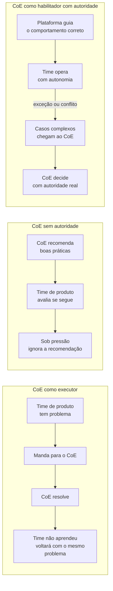
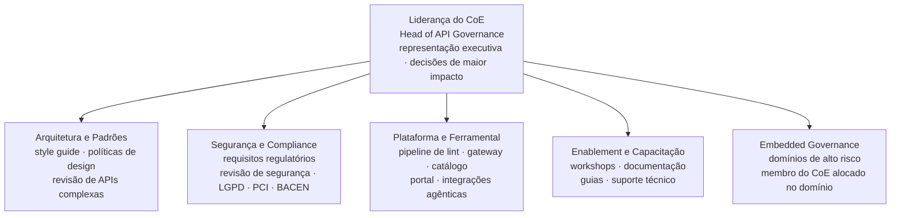
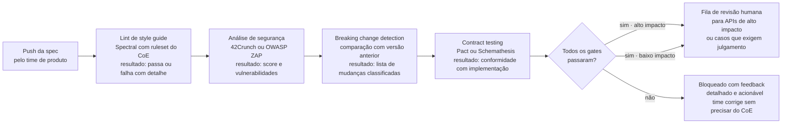
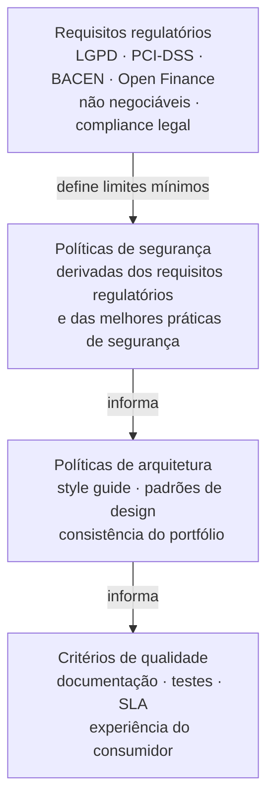

# Módulo 3 · Governança de APIs
## Capítulo 3.3 · O Centro de Excelência de APIs — modelo de trabalho

> **Série:** Gerenciamento e Governança de APIs
> **Nível:** Estratégico e organizacional
> **Pré-requisito:** Cap 3.1 · Pilares da governança · Cap 3.2 · Papéis e responsabilidades

---

## Sumário

- [3.3.1 · O que é e o que não é um CoE de APIs](#331--o-que-é-e-o-que-não-é-um-coe-de-apis)
- [3.3.2 · Modelos de CoE — do virtual ao dedicado](#332--modelos-de-coe--do-virtual-ao-dedicado)
- [3.3.3 · Composição e perfis do CoE](#333--composição-e-perfis-do-coe)
- [3.3.4 · O modelo operacional do CoE](#334--o-modelo-operacional-do-coe)
- [3.3.5 · A plataforma como produto interno — o modelo de escalabilidade](#335--a-plataforma-como-produto-interno--o-modelo-de-escalabilidade)
- [3.3.6 · O CoE como árbitro e como produtor de conhecimento](#336--o-coe-como-árbitro-e-como-produtor-de-conhecimento)
- [3.3.7 · Requisitos específicos de mercados regulados](#337--requisitos-específicos-de-mercados-regulados)
- [3.3.8 · Métricas de eficácia do CoE](#338--métricas-de-eficácia-do-coe)

---

## 3.3.1 · O que é e o que não é um CoE de APIs

O Centro de Excelência de APIs é o órgão que operacionaliza os pilares de governança estabelecidos no Cap 3.1 e exerce as responsabilidades de corpo governante descritas no Cap 3.2. Mas antes de definir o que o CoE é, vale definir o que ele não é — porque as confusões sobre o papel do CoE são a causa mais comum de CoEs que falham.

---

### O CoE não é um time de execução

O erro mais frequente é tratar o CoE como um time que faz o trabalho técnico pelos outros times — que revisa cada spec, que faz o design das APIs mais complexas, que resolve os problemas técnicos quando os times de produto encontram dificuldades.

Esse modelo tem um problema estrutural inevitável: não escala. Em um portfólio com dezenas de APIs, o CoE como time de execução consegue operar. Em um portfólio com centenas de APIs em múltiplos domínios, o CoE vira gargalo. O volume de trabalho cresce com o portfólio; a capacidade do CoE cresce muito mais lentamente.

Além do problema de escala, o modelo de execução cria dependência — os times de produto deixam de desenvolver competência interna em design de APIs porque sabem que o CoE vai resolver. A qualidade do portfólio passa a depender da disponibilidade do CoE, não da capacidade dos times.

---

### O CoE não é um comitê consultivo sem autoridade

O oposto também é problemático. Um CoE que apenas recomenda — sem poder de bloquear um lançamento, sem autoridade para enforçar uma política, sem capacidade de conceder ou negar exceções formalmente — é um órgão que os times respeitam quando conveniente e ignoram quando há pressão.

A pesquisa de Weill e Ross que citamos no Cap 3.1 é clara: governança sem decision rights claros não funciona. Um CoE sem autoridade formal é um investimento de overhead sem retorno de governança.

---

### O CoE é um corpo governante que habilita através de plataforma e conhecimento

O modelo funcional do CoE combina duas dimensões que precisam coexistir:

**Autoridade clara** — o CoE tem poder real de decisão nos gates críticos do ciclo de vida. Pode bloquear um lançamento por não conformidade. Pode conceder ou negar exceções às políticas. Pode definir que uma API precisa ser depreciada. Essa autoridade não é exercida no dia a dia — é o que dá substância às políticas.

**Habilitação sistemática** — o CoE investe na construção de uma plataforma e de um corpo de conhecimento que permite que os times operem com qualidade e autonomia sem precisar do CoE em cada decisão. O objetivo é que a governança aconteça automaticamente — embutida nas ferramentas e no processo — e que o CoE intervenha apenas nos casos que exigem julgamento humano.

A tensão entre essas duas dimensões define o modelo de trabalho do CoE. Muita autoridade sem habilitação vira policiamento. Muita habilitação sem autoridade vira consultoria ignorável. O equilíbrio é o que torna um CoE eficaz.

---

## 3.3.2 · Modelos de CoE — do virtual ao dedicado

CoEs não existem em um único formato. O modelo adequado depende do tamanho do portfólio, da maturidade organizacional e dos recursos disponíveis. O que não muda é o princípio: a forma do CoE deve ser determinada pela capacidade de exercer efetivamente as responsabilidades de governança — não pelo que é mais fácil de montar.

---

### CoE virtual

No modelo virtual, o CoE não tem um time dedicado. É composto por pessoas de diferentes áreas — arquitetura, segurança, produto, plataforma — que dedicam uma fração do seu tempo às responsabilidades de governança.

Funciona em organizações em estágio inicial, com portfólios pequenos e maturidade de API ainda em construção. A vantagem é o custo baixo e a diversidade de perspectivas. A desvantagem é a falta de dedicação — quando há pressão nos projetos primários, a governança é o que cede.

O CoE virtual tem prazo de validade. À medida que o portfólio cresce, a capacidade de um CoE virtual de exercer governança efetiva diminui. Organizações que mantêm o modelo virtual por tempo demais acumulam déficit de governança que é caro de recuperar.

---

### CoE dedicado

No modelo dedicado, o CoE é um time próprio com responsabilidade integral de governança. As pessoas do CoE não têm outros projetos primários — governança de APIs é o que elas fazem.

É o modelo adequado para organizações com portfólios médios a grandes, onde a governança tem impacto de negócio real e onde a inconsistência de qualidade tem custo mensurável. A desvantagem é o custo — um time dedicado exige headcount e orçamento próprio.

Em empresas grandes em mercados regulados, o modelo dedicado não é opcional — é o mínimo necessário para operar com a seriedade que a regulação exige.

---

### O modelo de champions — e por que não funciona em escala

O modelo de champions — pessoas dentro dos times de produto com responsabilidade parcial de governança — é frequentemente proposto como solução de escala para CoEs em empresas grandes. Na prática, não funciona.

O problema é estrutural: o champion é um papel secundário. Sua avaliação de desempenho é feita pelo gestor do time de produto — que avalia pela entrega de produto, não pela qualidade de governança. Quando há conflito entre entregar a feature e seguir o processo de governança, o champion está sozinho contra a pressão do time. Com o tempo, o papel perde força, o champion deixa de ser consultado e a governança que dependia dele se degrada silenciosamente.

Isso não é uma falha das pessoas — é uma falha do modelo. Papel sem autoridade formal, sem dedicação real e sem carreira associada não sustenta responsabilidade de governança em organizações grandes com pressão constante de entrega.

---

### O modelo híbrido com embedded governance

Para organizações grandes que precisam de presença nos domínios sem os problemas do champion, a alternativa viável é o **embedded governance** — profissionais formalmente membros do CoE, com reporte ao CoE e avaliação pelo CoE, alocados permanentemente em domínios de alto risco ou alta criticidade regulatória.

A diferença crítica em relação ao champion: é o papel principal, não secundário. O profissional embedded não divide lealdade — ele é do CoE. Trabalha dentro do domínio para ter contexto, mas sua responsabilidade é governança.

O embedded governance não substitui a plataforma — complementa. Em domínios onde o risco regulatório é alto e onde a automação tem limitações, a presença humana dedicada com autoridade real é o que faz a diferença. Em domínios de menor criticidade, a plataforma resolve sem necessidade de presença humana dedicada.

---

## 3.3.3 · Composição e perfis do CoE

Um CoE em empresa grande em mercado regulado precisa de especialização interna. Não é um time homogêneo de arquitetos — é uma composição multidisciplinar onde diferentes perfis cobrem diferentes dimensões da governança.

---

### Liderança do CoE

Alguém precisa ser o responsável último pelo CoE como organização — com autoridade formal, representação executiva e poder de decisão nos casos de maior impacto. Em empresas grandes, esse papel é frequentemente denominado Head of API Governance, Chief API Officer ou equivalente.

Três responsabilidades que não podem ser delegadas: representar o CoE perante a liderança executiva e garantir que ele tem os recursos necessários para operar; tomar as decisões de governança de maior impacto — especialmente aquelas que conflitam com prioridades de times de produto; e garantir que o modelo operacional do CoE evolui conforme o portfólio e a organização crescem.

Sem esse papel, o CoE não tem voz na conversa estratégica e perde relevância progressivamente.

---

### Time de arquitetura e padrões

Responsável pelo style guide, pelas políticas de design e pela evolução dos padrões técnicos. São os arquitetos de API que definem como uma boa API deve ser construída na organização — nomenclatura, estrutura de payloads, padrões de erro, estratégias de versionamento.

Esse time também é responsável por revisar as APIs de maior complexidade ou impacto — não todas as APIs, mas as que exigem julgamento arquitetural que a automação não consegue substituir.

---

### Time de segurança e compliance

Em mercados regulados, conformidade regulatória não é uma camada opcional — é parte da definição de qualidade de uma API. Esse time garante que as políticas de governança incorporam requisitos de BACEN, LGPD, PCI-DSS, Open Finance ou o que for aplicável ao contexto.

É também o time responsável pelas revisões de segurança das APIs de maior impacto — não substituídas por ferramentas automáticas, mas complementadas por elas. Ferramentas de análise estática identificam vulnerabilidades conhecidas; revisão humana identifica riscos de negócio e de design que ferramentas não detectam.

---

### Time de plataforma e ferramental

Responsável pelas ferramentas que tornam a governança escalável. O pipeline de lint, a configuração do gateway, o catálogo, o portal de desenvolvedores e as integrações com sistemas agênticos.

Sem esse time, a governança depende de revisão manual e não escala. É o time que constrói e opera o produto interno que distribui governança automaticamente — o que exploraremos em profundidade no 3.3.5.

---

### Time de enablement e capacitação

Responsável por distribuir o conhecimento do CoE para os times de produto. Workshops, documentação, guias de boas práticas, suporte técnico.

A distinção crítica entre esse time e o modelo de champions: o time de enablement não está nos times de produto — está no CoE. Ele produz os recursos que os times de produto consomem para operar com autonomia. A responsabilidade de usar bem esses recursos é dos times de produto — não de uma pessoa dentro deles.

---

## 3.3.4 · O modelo operacional do CoE

Estrutura e composição definem o que o CoE é. O modelo operacional define como ele funciona no dia a dia — como decisões são tomadas, como demandas chegam e são priorizadas, como o CoE se comunica com os times.

---

### Cadência de trabalho

O CoE opera em duas velocidades simultâneas:

**Trabalho reativo** — responder a demandas que chegam dos times. Revisões de spec em gates de ciclo de vida, solicitações de exceção, escalações de conflito, dúvidas sobre políticas. Esse trabalho tem SLA — o CoE precisa ter tempo de resposta definido e publicado.

**Trabalho proativo** — antecipar problemas do portfólio antes que se tornem crises. Revisão periódica da saúde do portfólio, análise de padrões de exceções, evolução das políticas, identificação de APIs que deveriam ser depreciadas. Esse trabalho não chega como demanda — precisa ser agendado e protegido na agenda do CoE.

A tendência natural é que o trabalho reativo consuma todo o tempo do CoE, deixando o proativo sem espaço. Organizações com CoEs maduros protegem explicitamente a capacidade proativa — reservando uma fração fixa do tempo do time para trabalho não reativo.

---

### Como demandas chegam ao CoE

Em um modelo bem estruturado, a maioria das demandas não chega ao CoE como solicitação humana — chega como evento automatizado no pipeline. O gate de publicação foi acionado: o CoE recebe uma notificação de que uma spec passou no lint automático e está aguardando revisão de arquitetura para as APIs de determinado nível de criticidade.

Demandas que chegam como solicitação humana são tipicamente: solicitações de exceção de política, escalações de conflito que não foram resolvidas no nível do time, e consultas sobre situações não previstas nas políticas existentes.

A proporção entre demandas automáticas e humanas é um indicador de maturidade: um CoE com plataforma madura recebe a maioria das demandas através de eventos automatizados. Um CoE sem plataforma recebe tudo como e-mail ou mensagem no Slack — e invariavelmente perde rastreabilidade e consistência.

---

### SLA do CoE — definição e critérios

Um CoE sem SLA publicado é um CoE que opera como caixa preta para os times. Quando um time não sabe quando vai receber uma resposta a uma solicitação de revisão ou de exceção, duas coisas acontecem: ou o time para e espera — criando dependência e frustração — ou o time avança sem esperar — contornando a governança por necessidade operacional.

SLA não é uma tabela de tempos arbitrários. É um compromisso público que o CoE assume com os times, que depende de dois fatores que cada organização precisa calibrar para sua realidade:

**Criticidade da demanda** — uma API bloqueando um lançamento em produção tem urgência diferente de uma consulta sobre boas práticas. O SLA precisa refletir essa diferença de forma explícita. Tratar todas as demandas com a mesma prioridade ou sobrecarrega o CoE com urgências artificiais ou subestima situações que realmente exigem atenção imediata.

**Capacidade real do CoE** — um SLA que o CoE não consegue cumprir sistematicamente é pior do que não ter SLA. Ele cria expectativas que não são atendidas e erosão de confiança. O SLA deve ser definido com base na capacidade real do time — considerando o volume esperado de demandas e a complexidade de cada tipo.

O que o CoE deve publicar é a política de SLA — os critérios que determinam como demandas são classificadas e os compromissos de tempo para cada classe — deixando os valores concretos para serem definidos com base na capacidade e no contexto de cada organização.

---

## 3.3.5 · A plataforma como produto interno — o modelo de escalabilidade

Este é o subcapítulo central do capítulo — e o argumento mais importante para organizações que querem construir governança de APIs que realmente escala.

**A premissa fundamental:** governança sustentável em escala não é resolvida adicionando pessoas ao CoE. É resolvida construindo uma plataforma que embute governança no fluxo de trabalho dos times — de forma que o comportamento correto seja o caminho de menor resistência, não o caminho de maior esforço.

---

### O problema que a plataforma resolve

Sem uma plataforma de governança, cada interação de governança depende de uma pessoa do CoE. Um time precisa revisar uma spec: manda para o CoE. O CoE revisa, identifica problemas, devolve. O time corrige, manda de volta. O CoE aprova.

Esse fluxo tem custo de tempo e atenção que não escala. Com 20 APIs por mês, é gerenciável. Com 200 APIs por mês, é impossível sem um CoE desproporcional. E um CoE grande demais cria os próprios problemas — burocracia, lentidão, percepção de obstáculo.

A plataforma inverte a lógica: a governança acontece automaticamente no pipeline de cada time, sem interação com o CoE. O CoE intervém apenas nos casos que excedem a capacidade da automação.

---

### Os componentes da plataforma de governança

**Pipeline de governança automatizado**

O coração da plataforma é um pipeline de CI/CD com gates de governança embutidos. Cada vez que um time faz push de uma spec OpenAPI, o pipeline executa automaticamente:

O feedback do pipeline precisa ser acionável — não apenas "falhou", mas "o campo `destinatario_id` não tem descrição conforme a regra `require-field-descriptions` do style guide". O time corrige sem precisar interagir com o CoE.

---

**Catálogo como sistema de registro obrigatório**

O catálogo não é uma ferramenta opcional que os times usam quando querem — é o sistema de registro formal sem o qual uma API não existe oficialmente. Nenhuma API chega ao gateway sem estar registrada no catálogo. Nenhuma API é publicada sem ter um owner registrado.

Essa obrigatoriedade não é burocracia — é o mecanismo que garante visibilidade de portfólio. Sem ela, o CoE não consegue fazer análise de impacto, identificar duplicações ou conduzir processos de depreciação com base em dados reais.

---

**Gateway com políticas como código**

As políticas definidas pelo CoE — autenticação obrigatória, rate limiting por tier, headers de segurança — são implementadas no gateway como código versionado. Não são configurações manuais que alguém aplica quando lembra. São declaradas em um repositório, revisadas pelo CoE e aplicadas automaticamente via pipeline de infraestrutura.

Isso tem duas consequências importantes: políticas são auditáveis — há histórico de quem mudou o quê e quando — e são consistentes — não dependem de quem fez a configuração manual.

---

**Integrações com sistemas agênticos**

O catálogo, o style guide e as políticas do CoE são expostos como contexto para ferramentas de IA e agentes que os times de desenvolvimento utilizam. Um desenvolvedor que usa ferramentas de IA generativa — seja para geração de código, para revisão de design ou para consulta de padrões — pode ter acesso ao contexto real da organização: quais APIs já existem, quais são os padrões obrigatórios, quais são os requisitos de segurança para o domínio específico.

Essa integração pode assumir diferentes formas dependendo das ferramentas adotadas — desde protocolos de contexto específicos até APIs expostas para consumo por agentes. O que importa do ponto de vista de governança não é a tecnologia de integração — é que o conhecimento que o CoE produz chegue aos times no ponto onde eles trabalham, sem depender de que alguém leia documentação separada.

O CoE que constrói e mantém essas integrações está distribuindo sua autoridade de conhecimento de forma escalável — o conhecimento institucional deixa de estar restrito a quem conhece o CoE pessoalmente e passa a estar acessível através das ferramentas que os times já usam no dia a dia.

---

**Portal de desenvolvedores como ponto único de acesso**

O portal é onde consumidores internos e externos descobrem APIs, acessam documentação, fazem onboarding e consultam o status de APIs em depreciação. A existência de um portal único — não wikis distribuídas, não Confluences descentralizados — é o que garante que a experiência do consumidor é consistente e que o CoE tem visibilidade de quem usa o quê.

---

### Por que a plataforma é um produto — não um projeto

A palavra "produto" é intencional e importante. Um projeto tem início, meio e fim. Uma plataforma de governança nunca está pronta — ela evolui junto com o portfólio, com as regulações e com as tecnologias.

Isso significa que o time de plataforma dentro do CoE opera com a mentalidade de um time de produto: tem backlog, tem roadmap, coleta feedback dos usuários — os times de produto que dependem da plataforma — e itera continuamente.

Uma plataforma de governança construída como projeto — escopo fechado, entregue e abandonada — envelhece rapidamente e começa a criar mais fricção do que valor. Times que encontram uma plataforma desatualizada a contornam. E governança contornada é governança inexistente.

---

## 3.3.6 · O CoE como árbitro e como produtor de conhecimento

Quando a plataforma funciona bem, ela absorve a maioria das interações de governança. O que sobra para o CoE é exatamente o que só humanos conseguem fazer bem: julgar casos complexos, arbitrar conflitos, evoluir políticas e produzir conhecimento.

---

### O CoE como árbitro de última instância

Retomando o que estabelecemos no Cap 3.2.4: conflitos de governança que não são resolvidos no nível dos times chegam ao CoE. A função de árbitro exige que o CoE tome decisões que frequentemente desagradam alguma das partes — e que mantenha sua legitimidade mesmo quando a decisão é impopular.

Três princípios sustentam a legitimidade do CoE como árbitro:

**Consistência** — decisões semelhantes em situações semelhantes produzem resultados semelhantes. Um CoE que aprova exceções para alguns times e nega para outros com base nos mesmos critérios perde credibilidade rapidamente.

**Transparência do fundamento** — toda decisão do CoE é acompanhada de explicação do rationale. Não "negado porque não segue a política", mas "negado porque este padrão de autenticação cria exposição ao vetor X identificado no incidente Y de data Z, e a política existe por essa razão".

**Separação entre regra e exceção** — o CoE não negocia as políticas caso a caso. Políticas são revisadas periodicamente através de um processo formal — não em resposta a pressão de um time específico. Isso protege o CoE de ser usado como canal de lobby por times com mais influência política.

---

### O CoE como produtor de conhecimento

A segunda função que só o CoE consegue exercer com autoridade é a produção do conhecimento organizacional que alimenta a plataforma e capacita os times.

Esse conhecimento tem três formas:

**Políticas e standards documentados** — o style guide, as políticas de segurança, os critérios de qualidade. Não são documentos estáticos — evoluem com base na experiência do portfólio, nos incidentes, nas mudanças regulatórias e no feedback dos times.

**Guias e padrões de design** — documentação que vai além das políticas obrigatórias. Como desenhar APIs para casos de uso específicos do domínio da organização, como tratar padrões de integração recorrentes, como lidar com requisitos regulatórios específicos.

**Bases de conhecimento para sistemas agênticos** — o contexto exposto para ferramentas de IA dos times. A qualidade dessa base de conhecimento determina a qualidade das respostas que os times recebem quando consultam ferramentas de IA sobre problemas de governança. Um CoE que não investe na manutenção dessas bases está deixando os times operarem com contexto desatualizado ou genérico.

O conhecimento produzido pelo CoE é um ativo organizacional. Um CoE que existe há cinco anos e não tem esse conhecimento sistematizado é um CoE que pode ser desfeito sem perda real — porque o conhecimento está nas pessoas, não na organização.

> A estrutura operacional de gestão do conhecimento — bases de conhecimento, runbooks, SKMS e sua integração com catálogo e CMDB — é tratada no **[Anexo D · Gestão do Conhecimento no programa de APIs](../anexos/d_gestao_conhecimento_api.md)**.

---

## 3.3.7 · Requisitos específicos de mercados regulados

Em mercados como financeiro, saúde e telecomunicações, a governança de APIs não é apenas uma questão de qualidade técnica — é uma questão de compliance legal. Isso adiciona dimensões ao modelo do CoE que organizações em outros setores não precisam gerenciar com o mesmo rigor.

---

### Auditabilidade como requisito de primeira classe

Em um mercado regulado, qualquer decisão de governança relevante precisa ser rastreável. Não apenas registrada — rastreável com nível de detalhe suficiente para responder a um auditor externo.

Isso significa que a plataforma de governança precisa ser construída com auditabilidade como requisito desde o início — não como funcionalidade adicionada depois. Cada aprovação de spec tem timestamp, aprovador e justificativa. Cada exceção concedida tem registro com o risco aceito e o prazo de regularização. Cada depreciação tem evidências de notificação de consumidores preservadas. Cada mudança de política tem histórico de versões com autor e justificativa.

A ausência de auditabilidade em um mercado regulado não é apenas um problema de governança interna — é um risco regulatório. Reguladores como BACEN, ANS ou ANATEL podem exigir evidências de que determinadas práticas foram seguidas. Sem registros auditáveis, a organização não consegue demonstrar conformidade.

---

### Requisitos regulatórios como dimensão de política

As políticas do CoE em mercados regulados incorporam requisitos legais não negociáveis. LGPD define como dados pessoais podem ser expostos em APIs. PCI-DSS define como dados de cartão precisam ser tratados. Open Finance define padrões específicos de autenticação e autorização.

Isso cria uma hierarquia de políticas onde os requisitos regulatórios definem os limites mínimos dentro dos quais todas as outras políticas operam:

Políticas de nível regulatório não podem ser objeto de exceção — ou a API está em conformidade ou não está. Políticas de nível arquitetural e de qualidade têm processo de exceção formal. A distinção precisa ser explícita e compreendida pelos times.

---

### O papel do time de segurança e compliance em mercados regulados

Em organizações fora de mercados regulados, revisão de segurança pode ser parcialmente substituída por automação. Em mercados regulados, a automação é necessária — mas não suficiente.

Ferramentas de análise estática identificam vulnerabilidades técnicas conhecidas. Revisão humana por especialistas em compliance identifica riscos de negócio e de interpretação regulatória que ferramentas não detectam. Uma API que tecnicamente passa em todos os gates automáticos pode ainda ter um design que viola a letra ou o espírito de uma regulação específica.

Por isso, em mercados regulados, o time de segurança e compliance do CoE mantém um processo de revisão humana para todas as APIs que expõem dados regulados — independente de quanto a automação tenha evoluído.

---

## 3.3.8 · Métricas de eficácia do CoE

Como saber se um CoE está funcionando? A armadilha mais comum é medir o CoE pelo volume de trabalho — quantas specs foram revisadas, quantas exceções foram processadas, quantos workshops foram realizados. Essas métricas medem atividade, não impacto.

Um CoE eficaz é medido pelo que ele produz no portfólio — não pelo que ele faz internamente.

---

### Métricas de qualidade do portfólio

- Taxa de conformidade com o style guide — percentual de APIs que passam no lint sem erros críticos
- Score médio de segurança por domínio — evolução ao longo do tempo
- Cobertura de documentação — percentual de APIs com documentação completa conforme os critérios definidos
- Taxa de contract drift — percentual de APIs com divergência detectada entre contrato e implementação

---

### Métricas de processo

- Tempo médio de resposta do CoE por tipo de demanda vs. SLA definido
- Taxa de aprovação no primeiro ciclo — percentual de specs que passam na revisão sem ciclos adicionais de correção. Baixa taxa indica que os times não têm orientação suficiente antes de submeter
- Volume de exceções por política — padrões que revelam onde as políticas precisam evoluir
- Taxa de exceções que viraram revisão de política — indicador de que o mecanismo de aprendizado está funcionando

---

### Métricas de adoção e satisfação dos times

- TTFC médio — Time-to-First-Call das novas APIs. Indicador de qualidade da documentação e do onboarding
- NPS dos times de produto em relação ao CoE — os times percebem o CoE como habilitador ou como obstáculo?
- Percentual de demandas resolvidas pela plataforma sem interação com o CoE — indicador direto de escalabilidade

---

### A métrica mais importante

Todas as métricas acima são úteis. Mas existe uma que resume melhor do que qualquer outra se o CoE está cumprindo sua função:

> **O portfólio de APIs está ficando mais consistente, mais seguro e mais fácil de consumir ao longo do tempo — com o CoE intervindo cada vez menos em cada API individual?**

Se a resposta é sim, o CoE está funcionando. Se o portfólio melhora mas o CoE precisa trabalhar cada vez mais para isso, o modelo não escala. Se o portfólio não melhora apesar do CoE trabalhar muito, o modelo está errado.

---

## Pontos-chave do capítulo

- A distinção central: CoE que faz não escala e cria dependência. CoE que habilita através de plataforma e conhecimento escala e constrói capacidade organizacional
- O modelo de champions não funciona em empresas grandes — papel secundário sem autoridade formal perde força sistematicamente sob pressão de entrega
- Governança sustentável em escala é essencialmente um problema de design de plataforma: pipeline automatizado, catálogo obrigatório, gateway com políticas como código, integrações com sistemas agênticos e portal de desenvolvedores
- A plataforma de governança é um produto — não um projeto. Precisa de time dedicado, backlog, roadmap e iteração contínua
- Quando a plataforma absorve o volume, o CoE foca no que só humanos fazem bem: arbitrar conflitos, evoluir políticas e produzir conhecimento
- Em mercados regulados, auditabilidade é requisito de primeira classe — não funcionalidade adicionada depois. Requisitos regulatórios definem os limites não negociáveis dentro dos quais todas as outras políticas operam
- CoEs são medidos pelo impacto no portfólio — não pelo volume de atividade interna

---

## Próximo capítulo

**3.4 · Style guides e políticas** — como as políticas que o CoE define são construídas, estruturadas, publicadas e evoluídas. O que diferencia uma política eficaz de uma política que existe apenas no papel.

---

*Série: Gerenciamento e Governança de APIs · Módulo 3 · Capítulo 3.3*