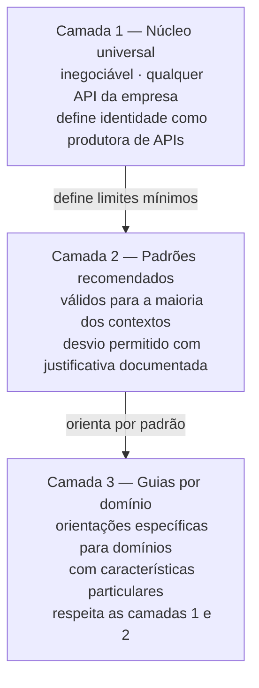
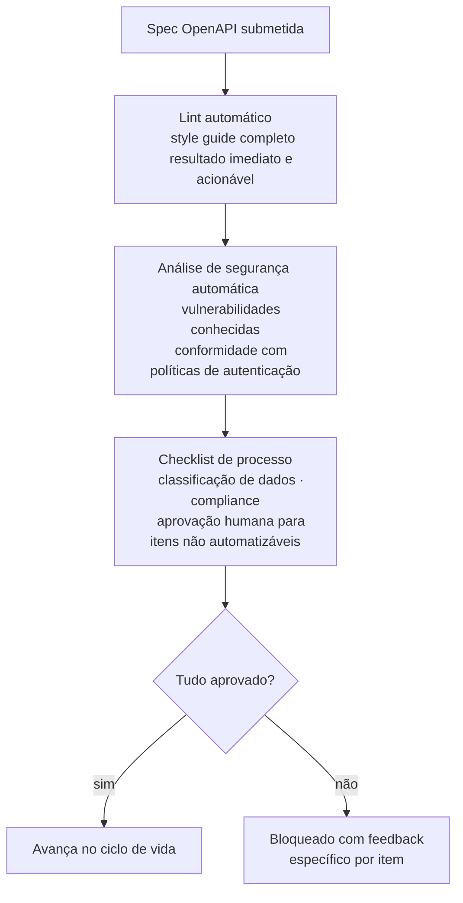
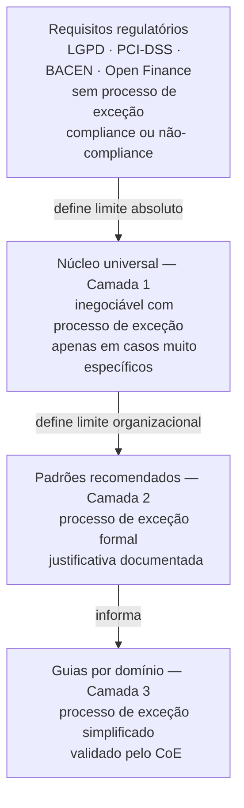

# Módulo 3 · Governança de APIs
## Capítulo 3.4 · Style guides e políticas

> **Série:** Gerenciamento e Governança de APIs
> **Nível:** Estratégico e operacional
> **Pré-requisito:** Cap 3.3 · O Centro de Excelência de APIs

---

## Sumário

- [3.4.1 · A distinção entre style guide e política](#341--a-distinção-entre-style-guide-e-política)
- [3.4.2 · O style guide de APIs — o que cobre e como funciona](#342--o-style-guide-de-apis--o-que-cobre-e-como-funciona)
- [3.4.3 · Políticas de governança — tipos e estrutura](#343--políticas-de-governança--tipos-e-estrutura)
- [3.4.4 · O rationale como parte do artefato](#344--o-rationale-como-parte-do-artefato)
- [3.4.5 · A arquitetura de políticas em camadas](#345--a-arquitetura-de-políticas-em-camadas)
- [3.4.6 · Como políticas são construídas — processo participativo com camadas](#346--como-políticas-são-construídas--processo-participativo-com-camadas)
- [3.4.7 · Como políticas são enforçadas — automação como primeira linha](#347--como-políticas-são-enforçadas--automação-como-primeira-linha)
- [3.4.8 · Como políticas evoluem — o ciclo de revisão](#348--como-políticas-evoluem--o-ciclo-de-revisão)
- [3.4.9 · Políticas em contextos regulados](#349--políticas-em-contextos-regulados)

---

## 3.4.1 · A distinção entre style guide e política

Style guide e política são frequentemente tratados como o mesmo artefato — publicados juntos, revisados juntos, chamados indistintamente de "as regras de APIs da empresa". Essa confusão produz documentos que tentam ser os dois ao mesmo tempo e acabam sendo nenhum dos dois com eficácia.

A distinção é funcional, não apenas terminológica:

**Style guide** define como APIs devem ser construídas — nomenclatura, estrutura, convenções, padrões de design. Responde à pergunta: *qual é a forma correta de expressar este elemento no contrato de uma API?* Um style guide bem escrito garante que um consumidor que integra a API de pagamentos e a API de notificações da mesma empresa encontra os mesmos padrões — nomenclatura consistente, estrutura de erros equivalente, paginação que funciona da mesma forma.

**Política** define o que é obrigatório, proibido ou condicional em relação a comportamentos, processos e decisões. Responde à pergunta: *o que é permitido e o que não é neste contexto?* Uma política de segurança define que autenticação OAuth 2.0 é obrigatória para todas as APIs que expõem dados pessoais. Uma política de depreciação define que o prazo mínimo de notificação para APIs públicas é de 12 meses.

| Dimensão | Style guide | Política |
|---|---|---|
| **Responde a** | Como construir | O que é permitido |
| **Natureza** | Prescritiva de forma | Normativa de comportamento |
| **Enforçamento** | Lint automático | Gates de processo + lint |
| **Exemplo** | Campos de data no formato ISO 8601 | APIs com dados pessoais exigem OAuth 2.0 |
| **Evolui com** | Feedback de design · maturidade técnica | Incidentes · regulação · maturidade organizacional |

Manter os dois separados — como documentos distintos com propósitos distintos — não é burocracia. É clareza que facilita a aplicação, o enforcement e a evolução de cada um.

---

## 3.4.2 · O style guide de APIs — o que cobre e como funciona

Um style guide de APIs é o conjunto de convenções que define a identidade de design da organização como produtora de APIs. Um consumidor que conhece o style guide da organização pode integrar qualquer API do portfólio com uma curva de aprendizado menor — os padrões são previsíveis.

---

### O que um style guide de APIs cobre

**Nomenclatura de recursos e operações**

Como recursos são nomeados — substantivos no plural para coleções, singular para recursos individuais, sem verbos nos endpoints REST. O que parece óbvio para um arquiteto experiente não é óbvio para um desenvolvedor que está criando sua primeira API. Sem convenção explícita, o portfólio acumula `/getPagamentos`, `/pagamento/listar`, `/pagamentos` e `/Pagamentos` — quatro formas de expressar o mesmo conceito em diferentes APIs da mesma empresa.

**Estrutura de URLs**

Hierarquia de recursos, uso de parâmetros de path vs. query, profundidade máxima recomendada. Uma regra descritiva: quando um recurso existe apenas no contexto de outro — uma transação que existe apenas dentro de um pagamento — o caminho reflete essa hierarquia: `/pagamentos/{id}/transacoes`. Quando o recurso pode existir de forma independente, tem seu próprio path raiz.

**Formato de campos comuns**

Datas e horas no formato ISO 8601 com timezone. Identificadores como strings — não inteiros — para evitar problemas de serialização em diferentes linguagens. Valores monetários como strings decimais ou como inteiros em centavos — com a escolha documentada e aplicada consistentemente em todo o portfólio. A inconsistência aqui é especialmente custosa: um consumidor que aprende que identificadores são strings em uma API e encontra inteiros em outra precisa tratar os dois casos separadamente.

**Estrutura de erros**

O RFC 7807 — Problem Details for HTTP APIs — define um formato padrão para respostas de erro que inclui `type`, `title`, `status`, `detail` e `instance`. Um style guide que adota RFC 7807 garante que consumidores que implementam tratamento de erros para uma API conseguem reutilizar a mesma lógica para todas as APIs do portfólio. Sem convenção, cada API inventa seu próprio formato de erro — e consumidores precisam de lógica de tratamento diferente para cada uma.

**Paginação**

Cursor-based, offset-based ou page-based — com as vantagens e limitações de cada abordagem documentadas. O que importa do ponto de vista do style guide não é qual abordagem é escolhida — é que a escolha seja consistente e que os parâmetros tenham os mesmos nomes em todo o portfólio. Um portfólio onde metade das APIs usa `page` e `size` e a outra metade usa `offset` e `limit` força o consumidor a verificar a documentação de cada API para saber qual convenção ela segue.

**Versionamento no contrato**

Como a versão é expressa — URI versioning como padrão, com a justificativa documentada. Quando versão minor e patch são expostas ao consumidor e quando ficam como controle interno.

**Respostas de sucesso**

Quais códigos HTTP são usados para quais situações — 201 para criação, 200 para consulta, 204 para operações sem corpo de resposta, 202 para operações assíncronas. A ausência de convenção aqui produz APIs que retornam 200 para tudo, incluindo criações e erros — o que força consumidores a inspecionar o corpo da resposta para determinar o resultado.

---

### Como o style guide é enforçado

O style guide só tem valor se é verificado automaticamente. Um style guide que existe apenas como documento no wiki — que os times leem uma vez durante o onboarding e nunca mais consultam — não produz consistência de portfólio.

O mecanismo de enforcement primário é o lint automático — ferramentas como Spectral que verificam a spec OpenAPI contra um conjunto de regras derivadas do style guide. Cada regra tem uma mensagem de erro clara e acionável: não apenas "campo sem descrição", mas "o campo `destinatario_id` não tem descrição. Descrições são obrigatórias para todos os campos conforme a regra `require-field-descriptions`. Adicione uma descrição que explique o propósito do campo para o consumidor."

O lint roda no pipeline de CI de cada time — não como uma verificação manual que alguém executa antes de submeter. A spec que não passa no lint não avança no pipeline. O time recebe feedback imediato e acionável sem precisar interagir com o CoE.

---

## 3.4.3 · Políticas de governança — tipos e estrutura

Políticas são as regras de comportamento que governam como APIs são criadas, operadas e encerradas. Um CoE maduro mantém um conjunto de políticas que cobre pelo menos quatro dimensões:

---

### Políticas de segurança

Definem os requisitos mínimos de segurança que toda API precisa atender para ser publicada.

Uma política de autenticação obrigatória define que toda API que expõe dados pessoais ou transacionais deve usar OAuth 2.0 com escopos granulares — não API Keys genéricas que não permitem controle de acesso por operação. A razão documentada: API Keys comprometidas concedem acesso irrestrito; OAuth 2.0 com escopos limita o impacto de um vazamento ao escopo autorizado.

Uma política de exposição de dados sensíveis define que campos classificados como dados pessoais não podem aparecer em paths de URL, query parameters ou headers — apenas no corpo de requisições autenticadas. A razão documentada: URLs são registradas em logs de servidores, proxies e gateways; dados pessoais em URLs ficam expostos nesses registros.

---

### Políticas de versionamento e depreciação

Definem como APIs evoluem e como são encerradas. Essas políticas foram tratadas em profundidade nos Cap 2.5 e 2.6 — aqui são consolidadas como artefato formal de governança com o mesmo rigor que as demais políticas.

Uma política de deprecation define prazos mínimos por tipo de API, processo de comunicação obrigatório, critérios para extensão de prazo e processo formal de exceção. Inclui a dimensão jurídica discutida no Cap 2.6.7: antes de iniciar qualquer depreciação com consumidores externos, contratos comerciais devem ser verificados.

---

### Políticas de qualidade e documentação

Definem o que precisa estar presente para que uma API seja considerada publicável. Exemplos: toda API pública precisa ter guia de início rápido antes da publicação; toda API precisa ter documentação de todos os códigos de erro possíveis; changelog deve ser atualizado antes de qualquer mudança de comportamento.

---

### Políticas de compliance regulatório

Em mercados regulados, políticas que incorporam requisitos legais não negociáveis. Essas políticas têm uma característica distinta das demais: não têm processo de exceção — ou a API está em conformidade ou não está. A hierarquia entre esses tipos de política é explorada no 3.4.9.

---

### A estrutura interna de uma política

Uma política bem estruturada tem cinco elementos:

| Elemento | Descrição | Exemplo |
|---|---|---|
| **Escopo** | A quais APIs se aplica | Todas as APIs que expõem dados pessoais |
| **Regra** | O que é obrigatório, proibido ou condicional | Autenticação OAuth 2.0 com escopos é obrigatória |
| **Rationale** | Por que a regra existe | API Keys comprometidas concedem acesso irrestrito |
| **Enforcement** | Como é verificada | Gate automático no pipeline + revisão do time de segurança |
| **Processo de exceção** | Se existe e como funciona | Exceções aprovadas pelo CoE com prazo de regularização |

---

## 3.4.4 · O rationale como parte do artefato

O elemento mais frequentemente omitido em políticas de governança é o rationale — a explicação de por que a regra existe. Sua ausência é uma das causas mais comuns de políticas que são seguidas por obediência e contornadas sob pressão.

Quando um time recebe a política "autenticação OAuth 2.0 é obrigatória" sem contexto, a pergunta natural é "por que não podemos usar API Key? É muito mais simples de implementar". Sem uma resposta documentada, a única resposta disponível é "porque é a política" — e essa resposta não constrói convicção.

Quando a política documenta que API Keys comprometidas concedem acesso irrestrito a todas as operações, enquanto OAuth 2.0 com escopos limita o impacto de um vazamento ao escopo autorizado — e que essa distinção foi relevante em incidentes de segurança documentados no portfólio — o argumento de "é muito mais simples" fica em perspectiva. O time não concorda necessariamente com entusiasmo — mas entende que a complexidade adicional existe por uma razão, não por arbitrariedade.

O rationale tem três componentes:

**O que previne** — qual risco ou problema a política endereça. Específico o suficiente para que o leitor entenda a consequência real de não seguir a política. "Previne vulnerabilidades de segurança" não é específico. "Previne que um token comprometido conceda acesso irrestrito a todas as operações da API" é específico.

**A evidência** — o que fundamenta a política. Um incidente documentado. Um requisito regulatório com referência. Uma vulnerabilidade conhecida. Uma decisão arquitetural com trade-offs explícitos. Políticas sem evidência são percebidas como opinião — e opiniões são negociáveis.

**O custo de não aplicar** — o que acontece quando a política é ignorada. Não como ameaça, mas como consequência objetiva. Especialmente importante para políticas de segurança e compliance, onde o custo de não aplicar pode ser um incidente com impacto em toda a organização.

---

## 3.4.5 · A arquitetura de políticas em camadas

Organizações grandes têm um desafio que organizações pequenas não têm: seus times de desenvolvimento trabalham em contextos de negócio e tecnológicos muito diversos. Um time que desenvolve APIs de pagamento com alto rigor de compliance opera em um universo completamente diferente de um time que desenvolve APIs de recomendação com ciclos rápidos de experimentação.

Forçar esses dois contextos a seguir exatamente o mesmo conjunto de políticas com o mesmo nível de detalhe e o mesmo grau de obrigatoriedade cria dois problemas simultâneos: sobrecarrega o time de experimentação com overhead que não faz sentido para seu contexto, e pode subestimar o rigor necessário para o time de pagamentos.

Mas sem nenhuma padronização comum, o consumidor que integra APIs de pagamento e de recomendação da mesma empresa encontra dois mundos completamente diferentes. A identidade da organização como produtora de APIs se fragmenta.

A solução é uma **arquitetura de políticas em camadas** — não uma política única que tenta cobrir tudo, mas camadas com diferentes graus de obrigatoriedade e diferentes escopos de aplicação.

---

### Camada 1 — Núcleo universal e inegociável

O núcleo contém o conjunto mínimo de padrões que define a identidade da organização como produtora de APIs — independente do domínio, da tecnologia, do time. É o que garante que qualquer API da empresa é reconhecível como tal pelo consumidor que já conhece outras APIs do portfólio.

O princípio de seleção para o núcleo é rigoroso: só entra o que qualquer API da empresa consegue seguir sem custo desproporcional, e que tem impacto direto na experiência do consumidor ou na segurança da organização. Tudo que é específico de contexto não entra.

Exemplos típicos de elementos do núcleo: formato de erros RFC 7807, autenticação via OAuth 2.0 para APIs com dados pessoais, versionamento via URI, campos de data no formato ISO 8601 com timezone, identificadores como strings.

O núcleo não é negociado caso a caso — é revisado periodicamente pelo CoE com representação de todos os domínios. Times que discordam de um elemento do núcleo participam do processo de revisão — não solicitam exceções individuais.

---

### Camada 2 — Padrões recomendados com justificativa de desvio

A segunda camada contém padrões que fazem sentido para a maioria dos contextos mas que podem ter exceções legítimas. Um time pode desviar — mas precisa documentar por que e como o desvio não compromete a experiência do consumidor.

A justificativa de desvio não é um processo burocrático — é uma pergunta que o time precisa responder antes de divergir: por que o padrão recomendado não se aplica ao nosso contexto, e como garantimos que nossa abordagem alternativa entrega o mesmo resultado para o consumidor?

Exemplos típicos: estrutura de paginação — cursor-based ou offset-based dependendo das características do dataset —, convenções de nomenclatura para domínios com vocabulário técnico específico, estratégias de cache por tipo de dado.

---

### Camada 3 — Guias por domínio ou contexto

A terceira camada contém orientações específicas para domínios com características particulares. APIs financeiras, APIs de dados em tempo real, APIs de integração com sistemas legados — cada um pode ter um guia com requisitos adicionais. Esses guias são construídos pelos domínios com validação do CoE, e podem ser mais restritivos do que as camadas superiores — nunca mais permissivos.

Um domínio financeiro pode ter um guia que adiciona requisitos específicos de logging auditável para todas as operações de valor. Um domínio de streaming pode ter um guia com recomendações para gestão de conexões de longa duração. Esses requisitos específicos não fazem sentido para todos os domínios — por isso ficam na camada 3.

---

### O princípio que resolve a tensão

> *O núcleo universal garante identidade. As camadas específicas respeitam diversidade. O que não pode acontecer é que a diversidade invada o núcleo.*

Um CoE que coloca tudo no núcleo cria rigidez que gera resistência legítima dos times. Um CoE que não tem núcleo cria fragmentação de identidade que prejudica os consumidores. A disciplina de manter o núcleo pequeno e inegociável — resistindo à tentação de adicionar qualquer padrão que pareça importante — é o que torna a arquitetura em camadas funcional.

---

## 3.4.6 · Como políticas são construídas — processo participativo com camadas

Políticas impostas unilateralmente pelo CoE sem participação dos times que vão segui-las têm dois problemas: podem não refletir as realidades operacionais dos diferentes domínios, e carecem de legitimidade — times que não participaram da construção têm menos compreensão do fundamento e menos comprometimento com o resultado.

O processo participativo não dilui a autoridade do CoE — define onde há espaço para adaptação e onde a autoridade é inegociável.

---

### Processo de construção do núcleo

O núcleo é construído com representação de todos os domínios relevantes — não apenas pela arquitetura central. O processo tem quatro etapas:

**Proposta fundamentada** — o CoE propõe um conjunto de elementos para o núcleo, com rationale documentado para cada um. Não uma lista definitiva — um ponto de partida para discussão.

**Revisão por domínios** — representantes dos domínios revisam a proposta e identificam elementos que teriam custo desproporcional para seu contexto. A questão não é se concordam com o princípio — é se conseguem implementar sem prejuízo relevante para sua capacidade de entrega.

**Resolução de conflitos** — quando um domínio identifica um elemento problemático, o CoE avalia se o elemento deve ser removido do núcleo, movido para a camada 2 como recomendado, ou mantido com suporte adicional para o domínio que tem dificuldade.

**Aprovação e publicação** — o núcleo aprovado é publicado com data de vigência clara. Nenhum elemento entra em vigor imediatamente para APIs existentes — há um período de adaptação para o portfólio atual.

---

### Processo de construção de camadas específicas

Camadas 2 e 3 são construídas de forma mais descentralizada. Os domínios constroem seus guias específicos com validação do CoE — que verifica se o guia respeita as camadas superiores e se as justificativas de desvio são sólidas.

Essa descentralização tem um limite importante: o CoE mantém visibilidade de todos os guias de domínio e garante que não há contradições entre eles que prejudiquem a experiência de consumidores que usam APIs de múltiplos domínios.

---

## 3.4.7 · Como políticas são enforçadas — automação como primeira linha

O modelo de enforcement segue o mesmo princípio da plataforma como produto interno que estabelecemos no Cap 3.3.5: o que pode ser verificado por máquina deve ser verificado por máquina — consistentemente, sem depender de disponibilidade humana.

---

### O lint como executor primário do style guide

Ferramentas de lint como Spectral verificam a spec OpenAPI contra um conjunto de regras derivadas do style guide. Cada regra produz um resultado binário — passa ou falha — com feedback acionável.

A qualidade das regras de lint determina a qualidade do enforcement. Uma regra que verifica apenas se um campo tem descrição não-vazia é fraca — aceita "string" como descrição válida. Uma regra que verifica se a descrição tem conteúdo semântico real é muito mais eficaz.

O ruleset de lint é um artefato de governança — mantido pelo time de arquitetura e padrões do CoE, versionado em repositório, com histórico de mudanças. Quando o style guide evolui, o ruleset evolui junto.

---

### Gates de processo para políticas de comportamento

Nem toda política pode ser verificada por lint. Políticas que dependem de contexto de negócio exigem julgamento humano que automação não substitui.

Para essas políticas, o enforcement é um gate de processo: a API não avança no ciclo de vida sem que um checklist específico seja preenchido e aprovado. O checklist pode ser assistido por IA — que analisa a spec e sugere a classificação correta — mas a aprovação final é humana.

---

### A hierarquia de enforcement

Não todos os itens de política têm o mesmo peso. A hierarquia de enforcement deve refletir a hierarquia de risco:

**Bloqueante** — falha impede completamente o avanço. Reservado para violações do núcleo universal e para requisitos regulatórios não negociáveis.

**Advertência com prazo** — falha não bloqueia imediatamente mas gera um registro com prazo de correção. Adequado para padrões da camada 2 onde o time tem justificativa documentada de desvio temporário.

**Informativo** — falha gera log e métrica mas não bloqueia nem gera prazo. Adequado para guias da camada 3 onde a conformidade é desejável mas o contexto pode ter exceções legítimas frequentes.

---

## 3.4.8 · Como políticas evoluem — o ciclo de revisão

Políticas estáticas envelhecem. O style guide escrito há três anos pode ter convenções que não refletem mais as melhores práticas. A política de segurança que era adequada antes de uma vulnerabilidade amplamente divulgada pode precisar ser endurecida. A política de depreciação que foi definida sem considerar requisitos regulatórios novos pode precisar ser revisada.

---

### Os gatilhos de revisão

Políticas são revisadas em resposta a quatro tipos de gatilho:

**Incidentes** — quando um incidente revela que uma política existente era insuficiente ou que uma política necessária não existia. O incidente não é apenas um problema a ser resolvido — é um sinal de que o framework de governança tem uma lacuna.

**Padrão de exceções** — quando o CoE observa que a mesma política está gerando exceções repetidas em múltiplos domínios, isso é um sinal de que a política pode estar desalinhada com a realidade dos times. A análise do padrão de exceções é uma das entradas mais valiosas para o ciclo de revisão.

**Mudanças regulatórias** — novas regulações ou novas interpretações de regulações existentes. Essas atualizações têm data de vigência definida pela regulação — não pelo ciclo interno de revisão do CoE.

**Evolução tecnológica** — novos padrões, novas ferramentas, novas versões de especificações. Novas versões de OpenAPI, novas abordagens de segurança, novas formas de integração exigem que as políticas sejam revisadas para permanecer relevantes.

---

### O processo de revisão

A revisão de políticas segue o mesmo processo participativo da construção — com uma diferença importante: o ônus da prova muda. Na construção, o CoE propõe e os domínios questionam. Na revisão, qualquer ator pode propor uma mudança — mas precisa apresentar a evidência que a justifica.

Um time de produto que quer remover uma regra do style guide porque ela está gerando overhead precisa apresentar dados: quantas specs foram bloqueadas pela regra, qual o custo de conformidade, qual o impacto de remover a regra para o consumidor. Uma proposta sem evidência não entra no ciclo de revisão formal.

---

### Como mudanças são comunicadas e implementadas

Mudanças em políticas têm impacto em APIs existentes e em times que já internalizaram as regras anteriores:

Mudanças no núcleo universal — que afetam todo o portfólio — exigem comunicação antecipada, período de adaptação e suporte ativo durante a transição. Não entram em vigor imediatamente.

Mudanças em camadas específicas — que afetam domínios delimitados — podem ter ciclos mais curtos, mas ainda precisam de comunicação clara e prazo de adaptação adequado.

Toda mudança de política é versionada — com data de vigência, descrição da mudança e referência à discussão que a originou. Times que precisam entender por que uma regra mudou encontram essa informação no histórico da política — não precisam perguntar ao CoE.

---

## 3.4.9 · Políticas em contextos regulados

Em mercados regulados, style guides e políticas de governança técnica coexistem com requisitos legais que têm natureza fundamentalmente diferente. Entender essa diferença é essencial para construir um framework que seja ao mesmo tempo robusto do ponto de vista regulatório e operacionalmente funcional.

---

### A diferença entre política técnica e requisito regulatório

Uma política técnica — mesmo que obrigatória — pode ser objeto de exceção mediante processo formal e justificativa sólida. O processo de exceção existe porque organizações têm contextos diversos e situações que a política geral não antecipou.

Um requisito regulatório não tem esse processo. A LGPD não tem processo de exceção para exposição de dados pessoais sem base legal. O PCI-DSS não tem processo de exceção para armazenamento de dados de cartão sem criptografia. O BACEN não tem processo de exceção para APIs de Open Finance que não implementam os padrões de autenticação definidos.

Misturar os dois — tratar requisitos regulatórios como políticas técnicas que têm processo de exceção — cria risco regulatório real. Um CoE que concede exceção a um requisito regulatório, mesmo com boa intenção operacional, pode estar expondo a organização a penalidades legais.

---

### A hierarquia de políticas em contextos regulados

A arquitetura de políticas em camadas do 3.4.5 tem uma camada adicional em mercados regulados — que fica acima de todas as outras:

---

### O papel do time de segurança e compliance na política

Em mercados regulados, o time de segurança e compliance do CoE garante que as políticas técnicas não apenas referenciam os requisitos regulatórios — mas que são suficientes para atendê-los em qualquer interpretação razoável.

Regulações frequentemente são escritas em linguagem que admite interpretação. Uma política técnica que atende a letra de uma regulação pode não atender o espírito. O time de compliance avalia essa distinção — e garante que, em caso de auditoria, a organização consegue demonstrar que suas políticas foram desenhadas para garantir conformidade.

---

## Pontos-chave do capítulo

- Style guide e política são artefatos distintos com propósitos distintos — misturá-los produz documentos que são vagos demais para um e detalhados demais para o outro
- Um style guide eficaz cobre nomenclatura, estrutura de URLs, formato de campos comuns, padrões de erro, paginação e versionamento — com enforcement via lint automático que produz feedback acionável
- Toda política bem estruturada tem cinco elementos: escopo, regra, rationale, enforcement e processo de exceção. O rationale é o elemento mais frequentemente omitido e o mais importante para construir convicção
- A arquitetura de políticas em camadas resolve a tensão entre diversidade legítima e identidade coerente: núcleo universal inegociável, padrões recomendados com justificativa de desvio, guias por domínio
- O núcleo precisa ser pequeno — apenas o que qualquer API da empresa consegue seguir sem custo desproporcional. A disciplina de manter o núcleo pequeno é o que torna a arquitetura funcional
- Políticas são construídas de forma participativa — mas o processo participativo não dilui a autoridade do CoE: define onde há espaço para adaptação e onde a autoridade é inegociável
- Enforcement segue hierarquia de risco: bloqueante para violações do núcleo e requisitos regulatórios, advertência com prazo para padrões recomendados, informativo para guias de domínio
- Em contextos regulados, requisitos legais ficam acima de toda a arquitetura de camadas — sem processo de exceção. Misturar requisitos regulatórios com políticas técnicas que têm processo de exceção cria risco legal real

---

## Próximo capítulo

**3.5 · Catálogo e descoberta de APIs** — como o portfólio de APIs é tornado visível, descobrível e gerenciável. A perspectiva de governança sobre documentação, descoberta e AI Readiness do portfólio.

---

*Série: Gerenciamento e Governança de APIs · Módulo 3 · Capítulo 3.4*