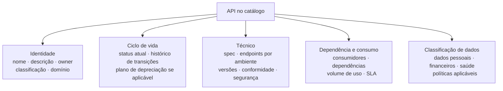
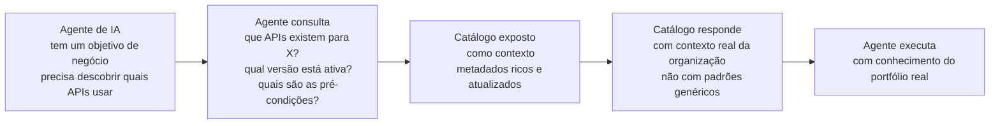

# Módulo 3 · Governança de APIs
## Capítulo 3.5 · Catálogo e descoberta de APIs

> **Série:** Gerenciamento e Governança de APIs
> **Nível:** Estratégico e operacional
> **Pré-requisito:** Cap 3.4 · Style guides e políticas

---

## Sumário

- [3.5.1 · O catálogo como infraestrutura de governança](#351--o-catálogo-como-infraestrutura-de-governança)
- [3.5.2 · O que o catálogo registra](#352--o-que-o-catálogo-registra)
- [3.5.3 · Catálogo e ciclo de vida](#353--catálogo-e-ciclo-de-vida)
- [3.5.4 · Descoberta — tornando APIs encontráveis](#354--descoberta--tornando-apis-encontráveis)
- [3.5.5 · Documentação como objeto de governança](#355--documentação-como-objeto-de-governança)
- [3.5.6 · API AI Readiness — da API individual ao portfólio](#356--api-ai-readiness--da-api-individual-ao-portfólio)
- [3.5.7 · Manutenção e atualização do catálogo](#357--manutenção-e-atualização-do-catálogo)

---

## 3.5.1 · O catálogo como infraestrutura de governança

A palavra "catálogo" evoca imagens de listas e inventários — um registro do que existe. Essa visão não está errada, mas está dramaticamente incompleta. Um catálogo tratado apenas como inventário é uma planilha glorificada. Um catálogo tratado como infraestrutura de governança é o sistema que torna possível tudo que discutimos nos capítulos anteriores.

Sem catálogo, análise de impacto antes de uma mudança é uma investigação manual que pode levar dias — e frequentemente revela surpresas. Sem catálogo, o processo de depreciação começa sem saber quem notificar. Sem catálogo, times que criam uma nova API não têm como saber se já existe algo equivalente no portfólio. Sem catálogo, o CoE não tem visibilidade sobre a saúde do portfólio que governa.

O catálogo é a memória institucional do programa de APIs.

---

### A distinção fundamental

Um catálogo como inventário registra o que existe. Um catálogo como infraestrutura de governança registra o que existe, quem é responsável por cada coisa, em qual estado cada coisa se encontra, quem depende de cada coisa, o que cada coisa expõe e com qual qualidade — e mantém tudo isso atualizado de forma que reflita o estado real do portfólio, não o estado que alguém acreditava que era verdade quando preencheu o formulário.

Essa distinção determina qual tecnologia adotar, como o catálogo é alimentado e como é usado no dia a dia. Ferramentas como Backstage, Apigee, Kong Konnect, AWS API Gateway e soluções customizadas existem em um espectro — e a escolha entre elas deve ser guiada pela profundidade de metadados e pela qualidade de integração com o pipeline de governança, não apenas pela interface de usuário.

---

## 3.5.2 · O que o catálogo registra

O valor do catálogo é diretamente proporcional à riqueza e atualidade dos metadados que ele contém. Metadados insuficientes produzem um catálogo que responde apenas à pergunta "o que existe?" — e não às perguntas que a governança realmente precisa responder.

---

### Metadados de identidade

O mínimo necessário para que uma API exista formalmente no portfólio:

- Nome, descrição de propósito e domínio de negócio
- Owner formal — a pessoa ou time responsável pela API como produto
- Classificação — privada, parceiro ou pública
- Data de criação e histórico de versões

---

### Metadados de ciclo de vida

O estado atual da API no ciclo de vida definido no Cap 2.1 — em concepção, em design, em desenvolvimento, publicada, em depreciação, retirada. Cada transição de estado é registrada com data e responsável. Esse histórico é a trilha de auditoria da API ao longo do tempo.

Para APIs em depreciação: data de anúncio, data de sunset prevista, link para o plano de depreciação e status de migração dos consumidores identificados.

---

### Metadados técnicos

- Link para a spec OpenAPI, AsyncAPI ou Proto — na versão atual e nas versões anteriores
- Endpoints do gateway por ambiente — desenvolvimento, staging, produção
- Versões ativas e suas datas de publicação
- Status de conformidade com o style guide — último resultado do lint
- Score de segurança — último resultado da análise automática
- Status de contract testing — última verificação de conformidade entre contrato e implementação

---

### Metadados de dependência e consumo

- Consumidores registrados — times ou sistemas que dependem da API
- Dependências — APIs ou serviços que esta API consome
- Volume de uso por versão — alimentado pelo gateway em tempo real
- SLA formal e histórico de conformidade

Esses metadados são os que habilitam análise de impacto real. Quando um engenheiro precisa avaliar o impacto de uma mudança no backend, a pergunta não é apenas "qual API pode ser afetada?" — é "quais consumidores específicos dependem desta versão desta API, e como esse volume se distribui?"

---

### Metadados de classificação de dados

Para cada API: quais categorias de dados ela expõe — dados pessoais conforme LGPD, dados financeiros, dados de saúde. Essa classificação determina quais políticas de segurança se aplicam, quais requisitos regulatórios são relevantes e quais restrições de acesso ao catálogo devem ser aplicadas.

---

## 3.5.3 · Catálogo e ciclo de vida

O catálogo não é alimentado uma vez durante a publicação e esquecido. Ele acompanha a API em cada fase do ciclo de vida — e em cada transição há metadados específicos que precisam ser registrados.

---

### Concepção

Quando um time inicia a concepção de uma nova API, o primeiro passo é registrar a intenção no catálogo com status "em concepção". Esse registro serve dois propósitos: dá visibilidade para que outros times saibam que a iniciativa existe antes de criar algo equivalente, e inicia a trilha de auditoria da API desde o primeiro momento.

O catálogo nessa fase responde à pergunta mais importante da concepção: já existe algo equivalente? Uma busca por capacidade no catálogo — não por nome, mas pelo que a API faz — é o mecanismo que previne duplicação. Um CoE que não tem catálogo com metadados de capacidade não tem como responder essa pergunta de forma confiável.

---

### Design e desenvolvimento

Conforme a API avança, o catálogo é atualizado com a spec aprovada, os resultados do lint e o status de conformidade com o style guide. Em staging, o link para os endpoints de teste é registrado — permitindo que consumidores que precisam desenvolver em paralelo encontrem o ambiente correto.

---

### Operação

Em produção, o catálogo é alimentado em tempo real pelo gateway — volume de chamadas por versão, distribuição de consumidores, histórico de incidentes. Esses dados transformam o catálogo de um registro estático em um sistema que reflete o estado vivo do portfólio.

Os dados de volume por versão são especialmente críticos para o processo de depreciação — eles são a evidência objetiva de quando o tráfego na versão antiga caiu o suficiente para que o sunset seja seguro.

---

### Depreciação e sunset

O catálogo na depreciação registra o plano de depreciação completo — link para o documento, data de sunset, status de migração de cada consumidor identificado. O CoE usa o catálogo para monitorar o progresso da migração sem precisar fazer acompanhamento manual.

Após o sunset, o status da API é atualizado para "retirada" — e a API permanece no catálogo com seu histórico completo. Remover APIs retiradas do catálogo destrói a memória institucional que pode ser necessária para análise de impacto futura, auditoria ou para entender por que determinadas decisões de design foram tomadas.

---

## 3.5.4 · Descoberta — tornando APIs encontráveis

A capacidade de descoberta — encontrar a API certa para um problema específico — é o que transforma um catálogo de inventário em um produto com valor direto para consumidores. Mas descoberta não funciona da mesma forma para todos os tipos de API.

---

### APIs internas

O consumidor de uma API interna é um time da mesma organização. Ele tem acesso ao catálogo completo, conhece a estrutura de domínios da empresa e pode entrar em contato diretamente com o owner da API que encontrou.

A estratégia de descoberta para APIs internas foca em:

- Busca por capacidade — "preciso de uma API que faça X" — não apenas por nome
- Navegação por domínio — todas as APIs do domínio de pagamentos, todas as APIs de identidade
- Visibilidade de status — quais APIs estão em depreciação, quais têm SLA garantido, quais são experimentais
- Contato direto — link para o owner, canal de suporte, fórum de discussão

O objetivo é reduzir o esforço de descoberta a ponto de que um time que precisa de uma API já existente a encontre antes de começar a construir algo equivalente.

---

### APIs de parceiros

O consumidor de uma API de parceiro é uma organização externa com a qual há uma relação comercial estabelecida. Ele não tem acesso ao catálogo interno completo — apenas às APIs para as quais tem acesso contratual.

A estratégia de descoberta para APIs de parceiros é mais controlada:

- Portal dedicado ou seção segregada do portal público — com acesso autenticado
- Visibilidade limitada ao contrato — o parceiro vê apenas as APIs para as quais foi credenciado
- Documentação enriquecida com casos de uso específicos do contexto de parceria
- Comunicação proativa de mudanças — o parceiro não descobre mudanças navegando no catálogo; é notificado diretamente

A gestão da visibilidade do catálogo para parceiros é em si uma questão de governança — quem decide quais APIs um parceiro específico pode ver, e como esse controle de acesso é implementado e auditado. A governança específica de APIs de parceiros é tratada em profundidade no **Cap 3.6 · Governança de APIs de parceiros**.

---

### APIs públicas

O consumidor de uma API pública é anônimo — pode ser qualquer desenvolvedor com acesso à internet. A estratégia de descoberta precisa funcionar sem pressuposição de conhecimento prévio sobre a organização ou seu portfólio.

- Portal público com documentação completa e acessível sem autenticação prévia
- Exemplos de código em múltiplas linguagens — o desenvolvedor precisa conseguir fazer a primeira chamada sem precisar ler páginas de documentação
- Sandbox público — ambiente de testes acessível sem credenciais de produção
- Changelog público e transparente — consumidores precisam saber o que mudou sem precisar perguntar

A qualidade da descoberta de APIs públicas é diretamente mensurável pelo TTFC — Time-to-First-Call. Um TTFC alto indica fricção no processo de descoberta e onboarding que o catálogo e o portal precisam resolver.

---

### Controle de visibilidade como dimensão de governança

A segregação entre esses três tipos de descoberta não é apenas uma decisão de UX — é uma decisão de governança. O catálogo precisa implementar controle de acesso que garante que:

- APIs internas não são visíveis externamente
- APIs de parceiros são visíveis apenas para os parceiros credenciados
- APIs públicas são acessíveis por qualquer consumidor

Esse controle precisa ser implementado de forma auditável — com registro de quem tem acesso a quê e desde quando.

---

## 3.5.5 · Documentação como objeto de governança

No Cap 2.4 tratamos documentação sob a perspectiva do time que a produz. Aqui a perspectiva muda: documentação como objeto de governança — o CoE define os padrões mínimos que toda documentação precisa atender, verifica conformidade através do catálogo e monitora a qualidade da documentação no portfólio como um todo.

---

### Padrões mínimos de documentação por tipo de API

A qualidade mínima de documentação que o CoE exige deve ser calibrada pelo tipo de audiência e pelo impacto da API:

| Tipo de API | Referência técnica | Guia de início | Tutoriais | Changelog | Documentação de erros |
|---|---|---|---|---|---|
| **Privada** | Obrigatório | Recomendado | Opcional | Recomendado | Obrigatório |
| **Parceiro** | Obrigatório | Obrigatório | Recomendado | Obrigatório | Obrigatório |
| **Pública** | Obrigatório | Obrigatório | Obrigatório | Obrigatório | Obrigatório |

Nenhuma API pública é publicada sem esses artefatos. Isso não é burocracia — é o mínimo necessário para que um consumidor externo consiga integrar sem precisar abrir um ticket de suporte.

---

### Como o catálogo verifica conformidade de documentação

O catálogo não apenas registra se a documentação existe — verifica se atende os padrões mínimos. Isso pode ser automatizado em diferentes graus:

**Verificação de existência** — o catálogo verifica se os artefatos obrigatórios estão presentes. Uma API pública sem guia de início rápido é sinalizada automaticamente como não-conforme.

**Verificação de qualidade assistida por IA** — ferramentas de IA analisam a documentação existente e identificam campos sem descrição, exemplos genéricos, erros não documentados e inconsistências entre spec e documentação narrativa. O resultado é registrado no catálogo como score de qualidade de documentação.

**Revisão humana periódica** — para APIs de alto impacto, o CoE conduz revisões que vão além do que automação detecta — verificando se o conteúdo é factualmente correto, se os casos de uso são relevantes para os consumidores reais e se o tom está alinhado com a identidade da organização.

---

### Dashboard de qualidade de documentação

O catálogo agrega os dados de conformidade de documentação em um dashboard que dá ao CoE visibilidade do estado da documentação em todo o portfólio. Não como ferramenta de punição — como ferramenta de priorização. Quais APIs têm documentação mais deficiente? Onde os times precisam de mais suporte? Quais domínios têm padrões de documentação consistentemente abaixo do esperado?

---

## 3.5.6 · API AI Readiness — da API individual ao portfólio

No Cap 2.4.7 introduzimos API AI Readiness sob a perspectiva da API individual. Aqui a perspectiva expande: o que significa um portfólio AI-Ready, e como o CoE governa essa dimensão.

---

### Revisitando AI Readiness na API individual

Uma API individual é AI-Ready quando oferece ao agente de IA o contexto necessário para descobri-la, compreendê-la e usá-la de forma autônoma:

**Descrições semânticas ricas** — não apenas "o que o campo faz" mas "quando usar este endpoint", "quais são as pré-condições", "como este endpoint se relaciona com os demais". Agentes de IA precisam de intenção e contexto, não apenas de sintaxe.

**Exemplos orientados a fluxos completos** — sequências de chamadas que resolvem um problema de ponta a ponta, não apenas exemplos de request/response isolados. Um agente que precisa orquestrar múltiplas chamadas precisa entender como elas se encadeiam.

**Erros classificados por recuperabilidade** — quais erros o agente pode tentar novamente automaticamente, quais exigem mudança de parâmetros, quais exigem intervenção humana. Essa classificação permite que o agente tome decisões autônomas de retry e escalação.

**Metadados de capacidade explícitos** — o que a API pode e não pode fazer, seus limites de rate, suas dependências e pré-condições. Um agente precisa dessas informações para planejar sequências de ações sem tentar operações que vão falhar.

Esses elementos beneficiam desenvolvedores humanos tanto quanto agentes de IA — AI Readiness não é uma camada separada de documentação, é qualidade de documentação levada ao próximo nível.

---

### AI Readiness de portfólio

A perspectiva de portfólio adiciona dimensões que a visão de API individual não captura.

**Consistência semântica entre APIs**

Um agente de IA que precisa orquestrar múltiplas APIs do mesmo portfólio para resolver um problema complexo precisa de vocabulário consistente. Se a API de pagamentos chama de `destinatario` o que a API de transferências chama de `beneficiario`, o agente precisa de lógica adicional para fazer a correspondência — ou falha silenciosamente ao assumir que são conceitos distintos.

A consistência semântica entre APIs é uma responsabilidade de governança que o style guide do Cap 3.4 começa a endereçar — mas que o catálogo precisa verificar e monitorar em nível de portfólio. Um dashboard de consistência semântica — que identifica campos com propósitos equivalentes mas nomenclaturas distintas em diferentes APIs — é uma ferramenta de governança que beneficia tanto consumidores humanos quanto agentes.

**Cobertura de capacidades**

Um portfólio AI-Ready tem cobertura de capacidades suficiente para que um agente consiga resolver os problemas de negócio relevantes sem precisar de intervenção humana para lacunas. O catálogo com metadados de capacidade permite ao CoE mapear essa cobertura — identificando domínios onde as APIs existentes não cobrem adequadamente os casos de uso esperados.

**Exposição do catálogo como contexto para agentes**

O catálogo exposto como contexto para sistemas agênticos transforma a descoberta de APIs de um processo manual em um processo assistido onde o agente consulta o catálogo, analisa as opções disponíveis e sugere ou executa a integração mais adequada.

Para que isso funcione, o catálogo precisa ser estruturado de forma que agentes consigam consultá-lo eficientemente:

A diferença entre um catálogo que serve humanos e um catálogo que serve agentes não é de conteúdo — é de estrutura e acessibilidade. Metadados que um humano consegue interpretar em uma interface visual precisam ser estruturados de forma que um agente consiga processar programaticamente.

---

### Como o CoE governa AI Readiness

**Padrões mínimos de AI Readiness** — o CoE define o que constitui uma API AI-Ready: profundidade mínima de descrições, presença de exemplos de fluxo completo, classificação de erros por recuperabilidade. Esses padrões são verificados pelo catálogo e entram nos critérios de qualidade de documentação.

**Score de AI Readiness por API** — o catálogo calcula e exibe um score de AI Readiness para cada API — baseado nos metadados disponíveis, na qualidade das descrições e na presença dos elementos que tornam a API utilizável por agentes. Esse score não é punitivo — é um indicador de priorização para o trabalho de melhoria de documentação.

**Mapa de cobertura do portfólio** — o CoE monitora a cobertura de capacidades do portfólio do ponto de vista de AI Readiness — identificando lacunas onde os casos de uso mais importantes para automação agêntica não têm cobertura adequada.

---

## 3.5.7 · Manutenção e atualização do catálogo

O maior desafio do catálogo não é construí-lo — é mantê-lo atualizado. Um catálogo desatualizado é pior do que não ter catálogo — ele cria falsa confiança. Um time que confia em um catálogo desatualizado pode tomar decisões erradas com base em informações incorretas.

---

### Por que catálogos ficam desatualizados

O catálogo fica desatualizado pelas mesmas razões que documentação fica desatualizada — o custo de atualizar é imediato e visível, o benefício é difuso e diferido. Quando um time faz uma mudança na API, a pressão imediata é entregar a mudança. Atualizar o catálogo é uma tarefa sem urgência aparente que fica para depois — e depois raramente chega.

---

### Automação como base da manutenção

A estratégia mais eficaz para manter o catálogo atualizado é remover a dependência de ação humana para as atualizações que podem ser automatizadas:

**Integração com o pipeline de CI/CD** — quando uma nova versão da spec é aprovada e promovida para produção, o catálogo é atualizado automaticamente. O status da API, a versão ativa, o link para a spec e os resultados de lint e segurança são atualizados sem que ninguém precise lembrar de fazê-lo.

**Integração com o gateway** — métricas de uso, volume por versão, distribuição de consumidores e status de SLA são alimentados pelo gateway em tempo real. O catálogo reflete o estado vivo do portfólio — não o estado registrado manualmente em algum momento do passado.

**Alertas de inconsistência** — o catálogo detecta automaticamente situações que indicam desatualização: uma API com tráfego registrado pelo gateway mas sem consumidores registrados no catálogo, uma spec no repositório com data mais recente do que a spec registrada no catálogo, um owner registrado que saiu da organização.

---

### O que exige ação humana

Nem tudo pode ser automatizado. Alguns metadados exigem julgamento:

- **Classificação de dados** — a presença de um campo chamado `cpf` pode ser detectada automaticamente, mas a classificação da API como "contém dados pessoais" exige revisão humana para confirmar o contexto
- **Relacionamentos de dependência** — dependências de negócio não técnicas exigem declaração explícita
- **Atualização de owner** — a designação do novo owner após mudança de time exige decisão humana

Para esses casos, o catálogo gera alertas que chegam ao CoE e ao owner da API — não como notificação ignorável, mas como item de trabalho com prazo.

---

### O catálogo como contrato de manutenção

A forma mais eficaz de garantir manutenção do catálogo é torná-la um critério de conformidade — não uma boa prática opcional. APIs cujo catálogo está desatualizado além de um limiar definido pelo CoE são sinalizadas como não-conformes. Em processos de revisão de segurança ou de renovação de SLA, o estado do catálogo é um dos critérios avaliados.

Isso transforma a manutenção do catálogo de uma tarefa sem dono em uma responsabilidade com consequências visíveis para o owner da API.

---

## Pontos-chave do capítulo

- O catálogo é a memória institucional do programa de APIs — não um inventário, mas a infraestrutura que torna possível análise de impacto, prevenção de duplicação, depreciação controlada e descoberta por consumidores e agentes
- Metadados ricos são o que diferencia um catálogo útil de uma lista glorificada: identidade, ciclo de vida, conformidade técnica, dependências, consumidores e classificação de dados
- A descoberta funciona de forma diferente para APIs internas, de parceiros e públicas — e o controle de visibilidade entre esses três tipos é uma dimensão de governança, não apenas de UX
- Documentação como objeto de governança: o CoE define padrões mínimos por tipo de API, o catálogo verifica conformidade e o dashboard de qualidade orienta priorização — não punição
- AI Readiness de portfólio vai além da API individual: consistência semântica entre APIs, cobertura de capacidades e exposição do catálogo como contexto para sistemas agênticos
- Catálogos ficam desatualizados por falta de mecanismos automáticos e de consequências visíveis. Automação via pipeline e gateway, combinada com conformidade obrigatória, é o que mantém o catálogo confiável

---

## Próximo capítulo

**3.6 · Governança de APIs de parceiros** — o que torna APIs de parceiros fundamentalmente diferentes do ponto de vista de governança: onboarding contratual, relacionamento bilateral, co-evolução do contrato e gestão de SLAs negociados.

---

*Série: Gerenciamento e Governança de APIs · Módulo 3 · Capítulo 3.5*