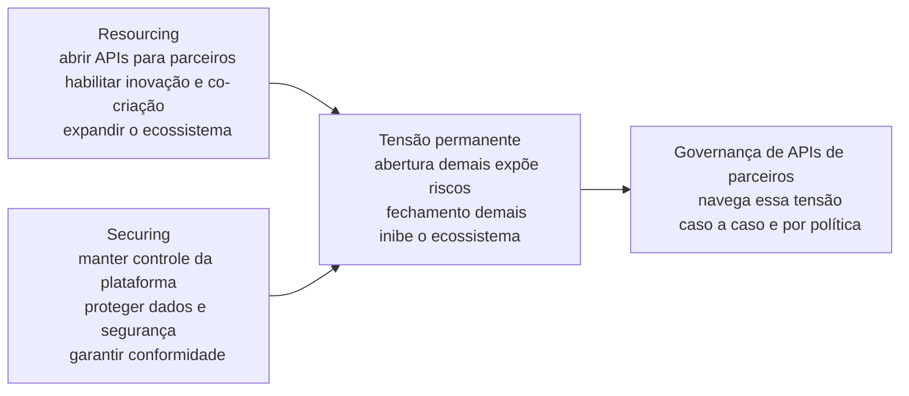
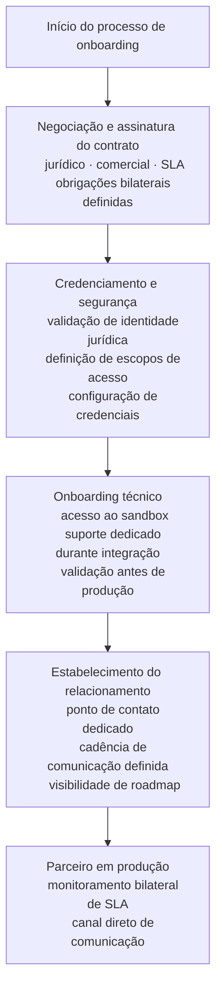
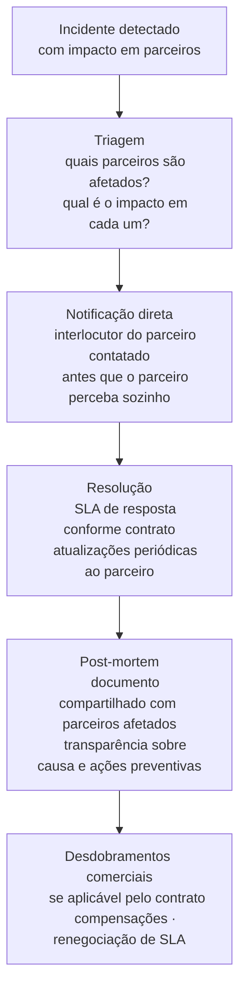

# Módulo 3 · Governança de APIs
## Capítulo 3.6 · Governança de APIs de parceiros

> **Série:** Gerenciamento e Governança de APIs
> **Nível:** Estratégico e operacional
> **Pré-requisito:** Cap 3.5 · Catálogo e descoberta de APIs · Cap 2.5 e 2.6 · Versionamento e depreciação

---

## Sumário

- [3.6.1 · O que torna APIs de parceiros fundamentalmente diferentes](#361--o-que-torna-apis-de-parceiros-fundamentalmente-diferentes)
- [3.6.2 · A tensão entre abertura e controle](#362--a-tensão-entre-abertura-e-controle)
- [3.6.3 · Onboarding de parceiros — além do processo técnico](#363--onboarding-de-parceiros--além-do-processo-técnico)
- [3.6.4 · Contratos e SLAs bilaterais](#364--contratos-e-slas-bilaterais)
- [3.6.5 · Co-evolução do contrato](#365--co-evolução-do-contrato)
- [3.6.6 · Gestão de mudanças e depreciação com parceiros](#366--gestão-de-mudanças-e-depreciação-com-parceiros)
- [3.6.7 · Gestão de incidentes com impacto em parceiros estratégicos](#367--gestão-de-incidentes-com-impacto-em-parceiros-estratégicos)
- [3.6.8 · O catálogo e a visibilidade controlada para parceiros](#368--o-catálogo-e-a-visibilidade-controlada-para-parceiros)
- [Fontes e referências](#fontes-e-referências)

---

## 3.6.1 · O que torna APIs de parceiros fundamentalmente diferentes

Ao longo deste módulo, tratamos governança de APIs sob a perspectiva da organização que as produz. Essa perspectiva é adequada para APIs internas — onde produtor e consumidor fazem parte da mesma organização — e para APIs públicas — onde o produtor governa sozinho e consumidores são essencialmente anônimos.

APIs de parceiros rompem com esse modelo. Quando uma organização disponibiliza APIs para parceiros comerciais — outras empresas com as quais há uma relação contratual estabelecida — a governança precisa operar em um contexto fundamentalmente diferente: há dois lados com poder real de negociação, expectativas formalizadas em contrato e interesses que nem sempre se alinham perfeitamente.

---

### O modelo de boundary resources

A literatura de plataformas digitais oferece o framework teórico mais útil para entender esse contexto. Ghazawneh e Henfridsson, em artigo seminal publicado no Information Systems Journal em 2013, definem as ferramentas técnicas e sociais que regulam a relação entre o dono de uma plataforma e seus parceiros externos como **boundary resources** — recursos de fronteira.

No contexto de APIs de parceiros, as APIs são os boundary resources por excelência: são a interface que define o que o parceiro pode acessar e fazer, os limites dentro dos quais ele pode inovar e criar valor, e os mecanismos pelos quais a organização mantém controle sobre o que é exposto.

Boundary resources são definidos como as ferramentas de software e regulações que servem como interface para a relação à distância entre o dono da plataforma e o desenvolvedor de aplicações. Eles têm simultaneamente natureza técnica — as APIs em si — e natureza social — as políticas, contratos e diretrizes que governam como as APIs são usadas.

> *Ghazawneh, A. & Henfridsson, O. Balancing Platform Control and External Contribution in Third-Party Development: The Boundary Resources Model. Information Systems Journal, 23(2), pp. 173-192, 2013. Disponível em: [doi.org/10.1111/j.1365-2575.2012.00406.x](https://doi.org/10.1111/j.1365-2575.2012.00406.x)*

---

### A natureza bilateral da relação

Com APIs internas, a organização governa os dois lados. Com APIs públicas, governa apenas o produtor. Com APIs de parceiros, a relação é genuinamente bilateral:

- O parceiro tem expectativas formalizadas em contrato — prazos de notificação de mudanças, SLAs garantidos, obrigações de suporte
- O parceiro tem poder de negociação — pode questionar políticas, solicitar adaptações e, em casos extremos, encerrar a parceria
- O parceiro co-cria valor — ele não apenas consome a API, constrói produtos e serviços sobre ela que têm valor para ambas as partes
- O parceiro tem informação valiosa — seu feedback sobre o design da API é mais rico e confiável do que o feedback de consumidores anônimos

Essa bilateralidade não é um complicador que a governança deve tentar eliminar. É uma característica estrutural que deve ser reconhecida e trabalhada a favor — porque parceiros que co-criam valor são uma extensão da capacidade da organização, não apenas consumidores a serem gerenciados.

---

## 3.6.2 · A tensão entre abertura e controle

O modelo de boundary resources identifica a tensão central de qualquer ecossistema de parceiros: **resourcing vs. securing**.

**Resourcing** é o processo pelo qual o escopo e a diversidade da plataforma são expandidos — abrindo recursos para que parceiros inovem e criem valor. Quanto mais a organização abre suas APIs, mais oportunidades surgem para parceiros construírem soluções que o produtor sozinho não construiria.

**Securing** é o processo pelo qual o controle da plataforma e seus serviços relacionados é mantido — garantindo que a abertura não expõe riscos inaceitáveis de segurança, privacidade ou integridade dos dados.

Essa tensão não tem resolução definitiva — precisa ser navegada continuamente conforme o ecossistema de parceiros evolui.

---

### Como essa tensão se manifesta nas políticas do Cap 3.4

A arquitetura de políticas em camadas do Cap 3.4 se aplica a APIs de parceiros com uma adaptação importante: o que é negociável muda.

Para APIs públicas, o núcleo universal é inegociável e as camadas específicas têm processo de exceção formal. Para APIs de parceiros, há uma terceira dimensão: **políticas negociadas bilateralmente no contrato**. Um parceiro estratégico pode negociar condições que diferem das políticas padrão — prazos de depreciação maiores, SLAs mais rigorosos, acesso a funcionalidades em beta.

Essa negociação é legítima e faz parte da relação bilateral — desde que não viole o núcleo universal inegociável nem os requisitos regulatórios.

---

## 3.6.3 · Onboarding de parceiros — além do processo técnico

O onboarding de um parceiro não é o mesmo que o onboarding de um consumidor de API pública. Há uma dimensão técnica e uma dimensão comercial e jurídica que precisam ser coordenadas e que frequentemente determinam o sucesso ou fracasso do onboarding.

---

### As dimensões do onboarding de parceiros

**Dimensão jurídica e comercial**
Antes de qualquer acesso técnico, o parceiro precisa assinar o contrato que governa a relação. Esse contrato define: quais APIs o parceiro pode acessar, quais são os SLAs garantidos, quais são os prazos mínimos de notificação para mudanças, quais são as obrigações de ambas as partes em caso de incidente, e quais são as condições de encerramento da parceria.

Um onboarding que cria acesso técnico antes de ter o contrato assinado está invertendo a sequência e criando dependências sem proteção.

**Dimensão de credenciamento e segurança**
APIs de parceiros têm um processo de credenciamento mais rigoroso do que APIs públicas. O parceiro é credenciado pela organização após verificação — validação da identidade jurídica, avaliação do caso de uso proposto, definição dos escopos de acesso e configuração de credenciais com as permissões corretas.

**Dimensão técnica**
O onboarding técnico de um parceiro tem elementos que o onboarding público não tem: acesso a ambientes de homologação com dados representativos, suporte técnico dedicado durante a fase de integração e validação do comportamento antes de ir para produção.

**Dimensão de relacionamento**
Parceiros estratégicos recebem um ponto de contato dedicado — não um canal genérico de suporte. Esse interlocutor conhece o parceiro, entende seu caso de uso e é capaz de facilitar a resolução de problemas que atravessam as fronteiras entre as equipes.

---

### Governança do processo de onboarding

O processo de onboarding de parceiros precisa ser governado — não apenas executado. O CoE é responsável por garantir que o processo tem etapas claras, responsabilidades definidas e que nenhuma etapa é pulada por pressão comercial.

Um risco específico: a área comercial que fecha a parceria tem incentivo para acelerar o onboarding. Esse incentivo pode criar pressão para pular a validação de segurança ou iniciar o acesso técnico antes que o contrato esteja finalizado. O CoE precisa ter autoridade para manter o processo mesmo sob pressão comercial.

---

## 3.6.4 · Contratos e SLAs bilaterais

O contrato de uma API de parceiro não é um documento técnico — é o instrumento jurídico que formaliza a relação comercial e define as obrigações de ambas as partes.

Goo et al., em pesquisa sobre SLAs em relacionamentos de outsourcing de TI, estabeleceram que contratos formais e governança relacional funcionam como complementos, não como substitutos. Um contrato bem construído não substitui a confiança — ele a estrutura.

---

### O que um contrato de API de parceiro precisa cobrir

**Escopo de acesso**
Quais APIs, quais versões, quais escopos de dados e quais ambientes o parceiro pode acessar. Mudanças no escopo exigem aditivo contratual.

**SLA bilateral**
A diferença fundamental em relação a SLAs públicos: o SLA de parceiro é negociado e pode incluir obrigações da organização que vão além dos SLAs padrão. Um parceiro crítico pode negociar disponibilidade superior, tempo de resposta a incidentes mais rigoroso e janelas de manutenção que excluem seus horários críticos de negócio.

O SLA bilateral também pode incluir obrigações do parceiro — disponibilidade mínima dos sistemas que consomem a API, notificação proativa de picos de uso esperados, restrições de uso que protegem a integridade da plataforma.

**Prazos de notificação para mudanças**
Enquanto a política padrão de depreciação define prazos mínimos por tipo de API, o contrato do parceiro pode estabelecer prazos maiores — especialmente para parceiros com integrações profundas e alto custo de migração.

**Gestão de incidentes**
Processo específico de comunicação e escalação em caso de incidente — incluindo contatos diretos, SLA de resposta ao parceiro e obrigações de post-mortem.

**Condições de encerramento**
O que acontece quando a parceria termina — prazo de transição, acesso residual para migração de dados, obrigações de confidencialidade pós-encerramento.

---

### A governança do contrato ao longo do tempo

Um erro comum é tratar o contrato como um documento estático assinado no início da parceria e esquecido depois. Contratos de API de parceiro precisam de revisão periódica — porque as APIs evoluem, os casos de uso do parceiro evoluem e as condições de mercado mudam.

O CoE precisa manter um registro de todos os contratos ativos — com os SLAs específicos de cada parceiro, os prazos de notificação comprometidos e as datas de revisão. Esse registro é parte da infraestrutura de governança que habilita o processo de change management e o processo de depreciação.

---

## 3.6.5 · Co-evolução do contrato

Huber, Kude e Dibbern, em estudo de múltiplos casos em ecossistemas de plataformas publicado no Information Systems Research em 2017, desenvolveram uma teoria de processo que mostra como práticas de governança evoluem ao longo do tempo. A conclusão central: práticas de governança sensíveis aos valores do ecossistema — às necessidades, expectativas e perspectivas dos parceiros — são mais bem-sucedidas do que práticas que seguem apenas regras formais.

> *Huber, T. L., Kude, T. & Dibbern, J. Governance Practices in Platform Ecosystems: Navigating Tensions Between Cocreated Value and Governance Costs. Information Systems Research, 28(3), pp. 563-584, 2017. Disponível em: [doi.org/10.1287/isre.2017.0701](https://doi.org/10.1287/isre.2017.0701)*

Aplicando essa pesquisa ao contexto de APIs de parceiros: **parceiros estratégicos devem ter voz na evolução das APIs que sustentam seus produtos e negócios**. Não como veto — a organização mantém a autoridade de decisão final sobre seu portfólio. Mas como input estruturado que informa o roadmap.

---

### O processo de co-evolução

**Visibilidade antecipada do roadmap**
Parceiros estratégicos recebem visibilidade do roadmap antes do anúncio público. O parceiro pode planejar sua evolução em sincronia com a plataforma, e a organização recebe feedback de impacto real antes de finalizar decisões.

**Consulta formal em mudanças de alto impacto**
Quando uma mudança de alto impacto é considerada, parceiros afetados são consultados formalmente antes da decisão final. O resultado da consulta não é necessariamente uma mudança na decisão — é um input que pode revelar impactos não antecipados e soluções alternativas.

**Canal direto de feedback sobre design**
Parceiros que identificam limitações no design atual das APIs têm um canal formal para comunicar essa percepção ao CoE e ao API Owner — não o suporte técnico, mas um canal de evolução de produto que alimenta o backlog de forma estruturada.

---

### Os limites da co-evolução

A co-evolução não significa que parceiros definem o roadmap. Há limites claros:

- Decisões de segurança e compliance não são negociadas com parceiros
- O núcleo universal do style guide não é alterado para atender preferências de um parceiro específico
- O processo de co-evolução não substitui nem contorna o processo formal de change management

O que a co-evolução garante é que decisões que afetam profundamente os parceiros são tomadas com informação suficiente sobre o impacto real.

---

## 3.6.6 · Gestão de mudanças e depreciação com parceiros

O processo de change management e o processo de depreciação dos Caps 2.5 e 2.6 se aplicam a APIs de parceiros com adaptações que refletem a natureza bilateral da relação e as obrigações contratuais existentes.

---

### O que muda no processo de change management

**Verificação contratual antes de qualquer anúncio**
Como estabelecido no Cap 2.6.7, antes de iniciar qualquer processo de depreciação com consumidores externos, os contratos devem ser verificados. Para parceiros, essa verificação é ainda mais crítica — o contrato pode definir prazos de notificação superiores ao mínimo da política padrão, e uma depreciação que não respeita esses prazos é uma quebra de contrato.

**Comunicação diferenciada para parceiros estratégicos**
Parceiros estratégicos são notificados antes do anúncio público — com detalhes do impacto esperado na integração deles especificamente. Essa notificação não é genérica — é preparada com conhecimento do caso de uso do parceiro e das APIs que ele usa.

**Período de transição negociado para parceiros críticos**
Parceiros com integrações críticas e contratos que garantem prazos maiores têm direito a períodos de transição correspondentes. Esse período não é uma concessão ad hoc — é uma obrigação contratual.

---

### O plano de depreciação para APIs de parceiros

O plano de depreciação do [Anexo B · Template de plano de depreciação](../anexos/b_plano_depreciacao.md) precisa ser adaptado para o contexto de parceiros:

- Lista específica de parceiros afetados — com nome do interlocutor, impacto estimado na integração e prazo contratual de notificação
- Plano de migração individualizado para cada parceiro crítico
- Processo de comunicação com interlocutores designados — não apenas canais genéricos
- Validação jurídica de que os prazos propostos são compatíveis com todos os contratos ativos

---

## 3.6.7 · Gestão de incidentes com impacto em parceiros estratégicos

Um incidente que afeta um parceiro estratégico não é apenas um incidente técnico — é um evento que pode ter impacto direto nos negócios do parceiro e que coloca em risco a relação comercial.

---

### O que diferencia um incidente com parceiros

**Comunicação proativa e direta**
Enquanto consumidores de APIs públicas descobrem incidentes pela status page ou por alertas automáticos, parceiros estratégicos precisam ser notificados diretamente pelo interlocutor designado — com informação sobre impacto esperado, estimativa de resolução e ações de mitigação. Essa comunicação acontece antes que o parceiro perceba o problema por conta própria.

**SLA de resposta diferenciado**
O contrato de API de parceiro pode definir SLAs de resposta a incidentes mais rigorosos do que os padrão. Um parceiro cujo produto em produção depende da API afetada tem expectativa legítima de atenção proporcional ao impacto.

**Post-mortem compartilhado**
Para incidentes de alto impacto, o post-mortem não é apenas um documento interno — é compartilhado com os parceiros afetados. Isso demonstra transparência e fornece ao parceiro as informações que ele precisa para avaliar se precisa adaptar sua integração para aumentar a resiliência.

**Gestão de impacto comercial**
Incidentes graves que causam impacto mensurável nos negócios do parceiro podem ter desdobramentos comerciais — compensações definidas em contrato, renegociação de SLA, ou um processo formal de reconhecimento do impacto. O CoE precisa coordenar com as áreas jurídica e comercial nesses casos.

---

## 3.6.8 · O catálogo e a visibilidade controlada para parceiros

No Cap 3.5.4 introduzimos o controle de visibilidade do catálogo para parceiros. Aqui aprofundamos como esse controle é implementado e governado.

---

### O modelo de visibilidade por contrato

A visibilidade de um parceiro no catálogo é determinada pelo seu contrato — não por um controle de acesso genérico. Quando um parceiro é credenciado para um conjunto específico de APIs, esse credenciamento é registrado no catálogo e determina o que ele vê no portal de parceiros.

Consequências práticas importantes:

**Visibilidade de roadmap controlada** — o parceiro pode ver o roadmap das APIs para as quais tem acesso, mas não o roadmap de outros domínios ou APIs fora de seu contrato.

**Visibilidade de status de depreciação** — o parceiro é notificado automaticamente quando uma API que ele usa entra em processo de depreciação — antes que precise checar o catálogo.

**Visibilidade de SLA em tempo real** — o parceiro tem acesso ao status do SLA das APIs que ele usa em tempo real — disponibilidade, latência, incidentes ativos. Isso não é apenas um benefício para o parceiro — é um mecanismo de transparência que reduz o volume de consultas de suporte durante degradações de serviço.

---

### Governança do controle de acesso

O controle de acesso ao catálogo para parceiros precisa ser auditável — especialmente em mercados regulados. O registro de quem tem acesso a quê e desde quando é uma evidência de conformidade.

Quando uma parceria é encerrada, o processo de offboarding precisa incluir a revogação de acesso ao catálogo — com a mesma atenção que a revogação de credenciais técnicas. Um ex-parceiro com acesso ao catálogo tem visibilidade de informações que podem ser comercialmente sensíveis.

---

## Pontos-chave do capítulo

- APIs de parceiros são boundary resources — recursos de fronteira que equilibram abertura para habilitar co-criação de valor e controle para proteger a plataforma. Governar APIs de parceiros é governar essa tensão continuamente
- A relação com parceiros é genuinamente bilateral: há poder de negociação dos dois lados, expectativas formalizadas em contrato e co-criação de valor que beneficia ambas as partes
- O onboarding de parceiros tem quatro dimensões que precisam ser coordenadas: jurídica e comercial, credenciamento e segurança, técnica e de relacionamento. Nenhuma dimensão pode ser pulada por pressão comercial
- Contratos formais e governança relacional são complementos, não substitutos. Um contrato bem construído estrutura a confiança e define as obrigações bilaterais — incluindo SLAs negociados, prazos de notificação e gestão de incidentes
- Práticas de governança sensíveis aos valores do ecossistema são mais bem-sucedidas do que práticas que seguem apenas regras formais. Parceiros estratégicos precisam ter voz na co-evolução das APIs — dentro de limites claros que preservam a autoridade de decisão da organização
- Gestão de mudanças e depreciação com parceiros exige verificação contratual antes de qualquer anúncio, comunicação diferenciada e períodos de transição que respeitam as obrigações contratuais
- Incidentes com impacto em parceiros estratégicos são eventos comerciais, não apenas técnicos — exigindo comunicação proativa, SLA de resposta diferenciado e post-mortem compartilhado
- O controle de visibilidade do catálogo para parceiros é uma dimensão de governança auditável — determinada pelo contrato e revogada formalmente no offboarding

---

## Fontes e referências

| Fonte | Referência completa |
|---|---|
| **Ghazawneh & Henfridsson (2013)** | Ghazawneh, A. & Henfridsson, O. Balancing Platform Control and External Contribution in Third-Party Development: The Boundary Resources Model. *Information Systems Journal*, 23(2), pp. 173-192, 2013. Disponível em: [doi.org/10.1111/j.1365-2575.2012.00406.x](https://doi.org/10.1111/j.1365-2575.2012.00406.x) |
| **Huber, Kude & Dibbern (2017)** | Huber, T. L., Kude, T. & Dibbern, J. Governance Practices in Platform Ecosystems: Navigating Tensions Between Cocreated Value and Governance Costs. *Information Systems Research*, 28(3), pp. 563-584, 2017. Disponível em: [doi.org/10.1287/isre.2017.0701](https://doi.org/10.1287/isre.2017.0701) |

---

## Próximo capítulo

**3.7 · Modelos organizacionais: centralizado, federado e híbrido** — como a estrutura organizacional influencia e é influenciada pela governança de APIs. Como diferentes modelos distribuem autoridade, responsabilidade e capacidade de execução.

---

*Série: Gerenciamento e Governança de APIs · Módulo 3 · Capítulo 3.6*