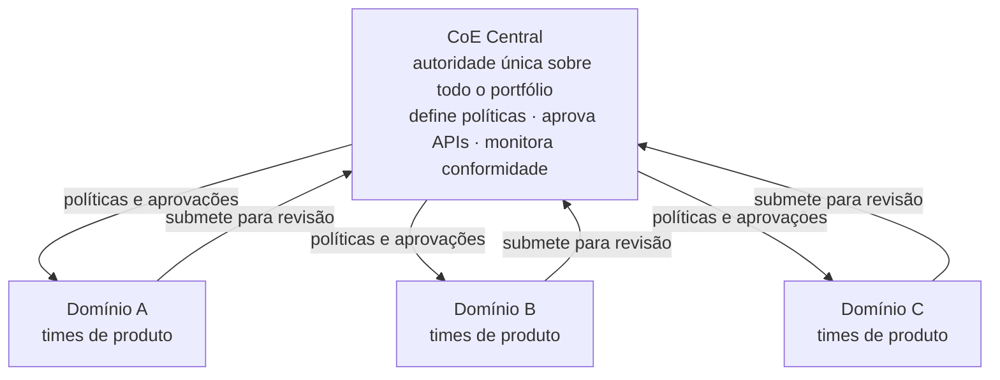
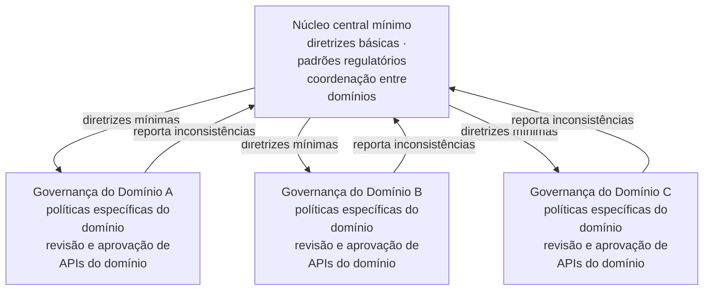
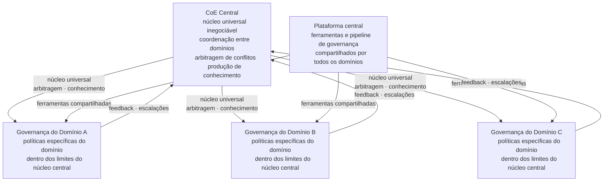
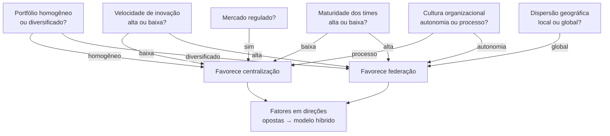

# Módulo 3 · Governança de APIs
## Capítulo 3.7 · Modelos organizacionais: centralizado, federado e híbrido

> **Série:** Gerenciamento e Governança de APIs
> **Nível:** Estratégico e organizacional
> **Pré-requisito:** Cap 3.3 · O CoE · Cap 3.4 · Style guides e políticas

---

## Sumário

- [3.7.1 · Por que o modelo organizacional importa — e o que a pesquisa diz](#371--por-que-o-modelo-organizacional-importa--e-o-que-a-pesquisa-diz)
- [3.7.2 · O modelo centralizado](#372--o-modelo-centralizado)
- [3.7.3 · O modelo federado](#373--o-modelo-federado)
- [3.7.4 · O modelo híbrido](#374--o-modelo-híbrido)
- [3.7.5 · Como o CoE se configura em cada modelo](#375--como-o-coe-se-configura-em-cada-modelo)
- [3.7.6 · Fatores que determinam o modelo adequado](#376--fatores-que-determinam-o-modelo-adequado)
- [3.7.7 · Coevolução — o modelo muda com a organização](#377--coevolução--o-modelo-muda-com-a-organização)
- [Fontes e referências](#fontes-e-referências)

---

## 3.7.1 · Por que o modelo organizacional importa — e o que a pesquisa diz

A estrutura organizacional de governança não é uma decisão neutra. Ela determina onde a autoridade reside, como decisões são tomadas, quão rapidamente a governança responde a mudanças e qual é o custo operacional de manter o programa de APIs. Duas organizações com as mesmas políticas e o mesmo CoE podem ter resultados completamente diferentes dependendo de como a autoridade está distribuída.

---

### A teoria de contingências de Sambamurthy e Zmud

Sambamurthy e Zmud, em pesquisa seminal publicada no MIS Quarterly em 1999, identificaram três modos predominantes de governança de TI nas organizações — centralizado, descentralizado e federal — e propuseram uma teoria que explica por que organizações diferentes adotam modos diferentes.

A teoria de múltiplas contingências argumenta que três forças determinam o modo adequado de governança de TI para uma organização específica:

**Governança corporativa** — como a organização distribui autoridade de decisão em geral. Organizações com governança corporativa centralizada tendem a centralizar a governança de TI. Organizações com unidades de negócio autônomas tendem a descentralizar.

**Economias de escopo** — o grau em que recursos e capacidades de TI podem ser compartilhados entre unidades. Quando há economias de escopo significativas — infraestrutura compartilhada, padrões comuns — a centralização produz eficiência. Quando cada unidade tem necessidades muito distintas, a centralização produz rigidez.

**Capacidade de absorção** — a capacidade das unidades de negócio de absorver e usar efetivamente recursos de TI descentralizados. Unidades sem essa capacidade precisam de suporte centralizado. Unidades com alta capacidade se beneficiam de autonomia.

> *Sambamurthy, V. & Zmud, R. W. Arrangements for Information Technology Governance: A Theory of Multiple Contingencies. MIS Quarterly, 23(2), pp. 261-290, 1999. Disponível em: [aisel.aisnet.org/misq/vol23/iss2/6](https://aisel.aisnet.org/misq/vol23/iss2/6)*

---

### A lacuna específica para APIs

Como no Cap 3.1, precisamos nomear com honestidade: não existe literatura acadêmica específica robusta sobre modelos organizacionais de governança de APIs. A teoria de Sambamurthy e Zmud trata governança de TI em geral — sua aplicação ao contexto de APIs é uma extrapolação fundamentada, não uma pesquisa específica.

O que a prática de mercado confirma é que organizações de APIs estão convergindo para o modelo híbrido como padrão de maturidade — o que é consistente com o que a teoria de contingências prediz para organizações grandes com portfólios diversificados.

---

## 3.7.2 · O modelo centralizado

No modelo centralizado, a autoridade sobre governança de APIs está concentrada em um único órgão — o CoE central — que tem poder de decisão sobre todo o portfólio, independente de domínio, tecnologia ou time.

---

### Vantagens do modelo centralizado

**Consistência máxima** — um único conjunto de políticas, um único processo de revisão, um único padrão de qualidade aplicado uniformemente em todo o portfólio. Para consumidores que integram APIs de múltiplos domínios, essa consistência é diretamente perceptível.

**Visibilidade completa** — o CoE tem visão de todo o portfólio, pode identificar duplicações, detectar inconsistências e conduzir análises de impacto com informação completa.

**Enforcement uniforme** — não há espaço para interpretações diferentes da mesma política por domínios diferentes. O que o CoE decide é o que acontece.

**Mais adequado para mercados regulados** — a centralidade facilita a demonstração de conformidade regulatória, pois há um único responsável pelo conjunto completo de políticas.

---

### Desvantagens do modelo centralizado

**Gargalo de decisão** — todo o fluxo de aprovação passa pelo mesmo ponto. Com portfólios pequenos, é gerenciável. Com portfólios grandes, o CoE central vira gargalo e a velocidade de entrega dos times de produto sofre.

**Desconexão de contexto** — um CoE central não conhece profundamente o contexto de cada domínio. Uma política que faz sentido para APIs financeiras pode ser inadequada para APIs de dados analíticos.

**Resistência dos times** — times com alta capacidade técnica resistem à centralização porque percebem o CoE como obstáculo à sua autonomia. Essa resistência, quando não endereçada, produz os contornamentos discutidos no Cap 3.3.

---

### Quando o modelo centralizado faz sentido

Com base na teoria de contingências: o modelo centralizado é mais adequado quando a governança corporativa da organização é centralizada, quando há economias de escopo significativas em APIs e quando os times de produto têm baixa capacidade de absorção autônoma de responsabilidades de governança.

Na prática: organizações em estágios iniciais de maturidade de APIs, onde os times ainda estão aprendendo o que boa governança significa, se beneficiam de centralização que constrói padrões e referências antes de distribuir autoridade.

---

## 3.7.3 · O modelo federado

No modelo federado, a autoridade sobre governança de APIs está distribuída pelos domínios — cada domínio tem sua própria instância de governança, operando dentro de diretrizes mínimas centrais.

---

### Vantagens do modelo federado

**Proximidade ao contexto** — quem governa as APIs de um domínio conhece profundamente as necessidades, restrições e particularidades daquele domínio. Decisões de governança são mais informadas e mais relevantes.

**Velocidade de decisão** — aprovações não precisam atravessar toda a organização. Times esperam menos e o CoE do domínio tem contexto para decidir com rapidez.

**Autonomia que engaja** — times com alta capacidade técnica são mais engajados quando têm autoridade real sobre seu próprio portfólio. A percepção de propriedade reduz resistência à governança.

**Escalabilidade por domínio** — o crescimento do portfólio de um domínio não sobrecarrega outros domínios nem um CoE central.

---

### Desvantagens do modelo federado

**Risco de fragmentação** — sem coordenação central suficiente, domínios diferentes desenvolvem políticas inconsistentes. Consumidores que integram APIs de múltiplos domínios encontram experiências diferentes. A identidade da organização como produtora de APIs se fragmenta — exatamente o problema discutido no Cap 3.4.5.

**Custo de coordenação** — para manter consistência mínima entre domínios, é necessário um mecanismo de coordenação com custo real. Reuniões de sincronização, processos de alinhamento de políticas, canais de comunicação de decisões.

**Dependência de maturidade dos domínios** — o modelo federado só funciona quando os domínios têm capacidade de exercer governança de forma autônoma. Domínios sem essa capacidade produzem governança inconsistente ou inexistente.

**Dificuldade em mercados regulados** — demonstrar conformidade regulatória é mais complexo quando há múltiplas instâncias de governança. Auditores precisam verificar conformidade em cada domínio.

---

### Quando o modelo federado faz sentido

Com base na teoria de contingências: o modelo federado é mais adequado quando a governança corporativa da organização é descentralizada, quando os domínios têm necessidades distintas que economias de escopo centrais não conseguem servir bem, e quando os times têm alta capacidade de absorção autônoma.

---

## 3.7.4 · O modelo híbrido

O modelo híbrido combina núcleo central com autonomia federada — e é o modelo mais comum em organizações de APIs maduras. Ele existe porque a realidade de organizações grandes raramente se encaixa perfeitamente nas condições que justificam o modelo puramente centralizado ou puramente federado.

---

### O que é central e o que é federado

A distinção mais importante do modelo híbrido — e a que mais frequentemente é mal feita — é decidir o que fica no centro e o que fica nos domínios.

A conexão com a arquitetura de políticas em camadas do Cap 3.4 é direta e não acidental:

**É central:**
- O núcleo universal de políticas — o que qualquer API da empresa precisa seguir
- A plataforma técnica de governança — pipeline de lint, gateway, catálogo, portal
- A arbitragem de conflitos entre domínios
- A coordenação para garantir consistência mínima entre domínios
- A produção de conhecimento — style guide, bases de conhecimento para ferramentas agênticas

**É federado:**
- Políticas específicas de domínio — camadas 2 e 3 do Cap 3.4
- Revisão e aprovação de APIs de menor criticidade dentro do domínio
- Adaptações do processo de governança ao contexto do domínio
- Feedback para evolução do núcleo central

---

### O desafio central do modelo híbrido

O modelo híbrido resolve o gargalo do centralizado e a fragmentação do federado — mas cria um desafio de coordenação que precisa ser ativamente gerenciado. Sem mecanismos explícitos de coordenação entre o centro e os domínios, o modelo híbrido pode produzir o pior dos dois mundos: processos centrais lentos e políticas locais inconsistentes.

---

## 3.7.5 · Como o CoE se configura em cada modelo

O modelo organizacional determina não apenas a estrutura, mas o propósito e o modelo operacional do CoE. O mesmo CoE descrito no Cap 3.3 se manifesta de formas diferentes em cada modelo.

---

### CoE no modelo centralizado

O CoE centralizado é o único corpo de governança — tem autoridade direta sobre todo o portfólio e é responsável por todas as revisões, aprovações e decisões de governança.

O modelo operacional do Cap 3.3 — com times especializados de arquitetura, segurança, plataforma e enablement — é a estrutura natural do CoE centralizado em uma organização grande. A escala desse CoE precisa ser proporcional ao volume do portfólio.

O risco específico: o CoE centralizado grande tende a se tornar burocrático. Conforme cresce para acompanhar o portfólio, seus processos se tornam mais pesados e sua distância do contexto dos times aumenta.

---

### CoE no modelo federado

No modelo federado, não existe um único CoE — existe um órgão central de coordenação e múltiplas instâncias de governança por domínio.

O órgão central tem um papel diferente: não aprova APIs individualmente, mas garante que as instâncias de domínio estão alinhadas com as diretrizes mínimas, coordena quando há inconsistências entre domínios e é a instância de escalação para conflitos não resolvidos no nível do domínio.

As instâncias de domínio exercem o papel de CoE dentro de seu escopo — com autoridade real sobre as APIs do domínio e responsabilidade pela qualidade dentro das diretrizes centrais.

---

### CoE no modelo híbrido

No modelo híbrido, o CoE central desempenha o papel descrito no Cap 3.3 — focado no que é genuinamente central: o núcleo de políticas, a plataforma técnica, a coordenação entre domínios e a arbitragem de conflitos.

Os domínios têm instâncias de governança locais — que podem ser formais como CoEs de domínio, ou informais como API Stewards e API Owners com autoridade ampliada. O CoE central não microgerencia essas instâncias — define os limites dentro dos quais elas operam e intervém quando esses limites são ultrapassados.

---

## 3.7.6 · Fatores que determinam o modelo adequado

Não existe um modelo universalmente correto. A escolha deve ser consciente e baseada em fatores específicos da organização — não na preferência estética do CoE nem no que o fornecedor de gateway recomenda.

---

### Os fatores relevantes para APIs

Adaptando a teoria de contingências de Sambamurthy e Zmud ao contexto específico de APIs:

**Tamanho e diversidade do portfólio**
Um portfólio homogêneo pode ser governado centralmente com eficiência. Um portfólio diversificado — APIs financeiras, de dados, de integração com sistemas legados, de parceiros — tem necessidades suficientemente distintas para justificar governança federada em pelo menos parte das dimensões.

**Velocidade de inovação necessária**
Times que precisam lançar APIs com frequência alta são mais prejudicados pelo modelo centralizado do que times com ciclos longos de desenvolvimento.

**Maturidade dos times de produto**
Times que entendem governança e têm capacidade de aplicá-la autonomamente são candidatos naturais para o modelo federado. Times que ainda estão aprendendo precisam do suporte que o modelo centralizado oferece. A maturidade não é homogênea — diferentes domínios podem estar em pontos muito diferentes.

**Cultura organizacional**
Organizações com cultura de autonomia resistem à centralização. Organizações com cultura de processo são mais confortáveis com o modelo centralizado. Forçar um modelo que vai contra a cultura produz resistência que impede a efetividade da governança.

**Requisitos regulatórios**
Organizações em mercados regulados têm obrigações de conformidade que favorecem centralização em pelo menos as dimensões regulatórias — mesmo que o restante da governança seja federado.

**Dispersão geográfica**
Organizações com times distribuídos em múltiplas geografias — especialmente com requisitos legais específicos por região — precisam de um modelo que permita adaptação local dentro de consistência global.

---

### O framework de decisão prático

Uma organização que quer escolher conscientemente seu modelo pode percorrer as seguintes perguntas:

O portfólio tem mais similaridades ou mais diferenças entre domínios? Se as diferenças dominam, a centralização vai gerar inadequação.

Os times de produto têm maturidade para exercer governança autonomamente? Se não, a federação vai produzir inconsistência.

Há requisitos regulatórios que exigem demonstração centralizada de conformidade? Se sim, pelo menos a dimensão regulatória precisa ter centralização.

A cultura organizacional aceita autoridade central sobre como APIs são construídas? Se não, o modelo centralizado vai ser contornado.

Quando as respostas apontam em direções diferentes — o que é comum em organizações grandes — o modelo híbrido não é um compromisso entre extremos. É o modelo que acomoda a complexidade real.

---

## 3.7.7 · Coevolução — o modelo muda com a organização

Tiwana, Konsynski e Bush, em pesquisa publicada no Information Systems Research em 2010, estabeleceram que arquitetura de plataforma e governança coevoluem — não são dimensões independentes que podem ser gerenciadas separadamente. À medida que a plataforma evolui, o modelo de governança precisa evoluir junto. Ignorar essa coevolução produz desalinhamento crescente entre o que a plataforma suporta e o que a governança tenta enforçar.

> *Tiwana, A., Konsynski, B. & Bush, A. A. Platform Evolution: Coevolution of Platform Architecture, Governance, and Environmental Dynamics. Information Systems Research, 21(4), pp. 675-687, 2010. Disponível em: [doi.org/10.1287/isre.1100.0323](https://doi.org/10.1287/isre.1100.0323)*

---

### A trajetória típica de evolução

**Estágio 1 — Governança informal ou centralização forçada**
Organizações que estão começando com APIs frequentemente não têm modelo formal. Há uma centralização forçada por um arquiteto ou tech lead que assumiu responsabilidade por falta de alternativa, ou não há governança alguma.

Sinal de inadequação: o responsável informal está sobrecarregado e os times começam a contornar o processo.

**Estágio 2 — Centralização formal**
Com reconhecimento do problema, a organização formaliza um CoE centralizado — com políticas, processos e autoridade explícita. Esse é o estágio necessário para construir o núcleo de padrões que vai sustentar os estágios posteriores.

Sinal de adequação: a qualidade do portfólio melhora e os times têm referências claras.

Sinal de inadequação: o CoE está sobrecarregado, a velocidade de entrega está comprometida e os times com maior maturidade estão resistindo.

**Estágio 3 — Híbrido gerenciado**
Com o núcleo de padrões estabelecido e os times desenvolvendo maturidade, a organização distribui progressivamente autoridade para os domínios — mantendo o núcleo central e a plataforma compartilhada.

Sinal de adequação: os domínios operam com autonomia real sem fragmentar a identidade do portfólio. O CoE central intervém com frequência menor mas com impacto maior.

---

### Os sinais de que o modelo atual está inadequado

**O CoE está sobrecarregado e se tornando gargalo** — o volume de trabalho cresceu além da capacidade do modelo atual. O modelo centralizado precisa distribuir autoridade.

**A consistência do portfólio está se deteriorando** — domínios diferentes estão divergindo em padrões. O modelo federado precisa de mais coordenação central.

**Times de alta maturidade estão contornando a governança** — a centralização é percebida como obstáculo por times que teriam capacidade de se autogovernarem bem. É hora de distribuir autoridade para esses domínios.

**Incidentes de compliance estão aumentando** — a descentralização foi longe demais. Dimensões de conformidade regulatória precisam ser recentralizadas.

**O modelo não acompanhou o crescimento do portfólio** — a organização cresceu, novos domínios surgiram, a diversidade tecnológica aumentou — mas o modelo de governança não foi revisado. A revisão periódica do modelo é parte do ciclo de evolução e aprendizado do Pilar 5 estabelecido no Cap 3.1.

---

## Pontos-chave do capítulo

- Não existe modelo organizacional universalmente correto para governança de APIs. A escolha entre centralizado, federado e híbrido é uma decisão estratégica que deve ser consciente e baseada em fatores de contingência específicos da organização
- Sambamurthy e Zmud identificaram três forças que determinam o modo adequado de governança de TI: governança corporativa, economias de escopo e capacidade de absorção dos times. Esses fatores se aplicam diretamente ao contexto de APIs
- O modelo centralizado oferece consistência máxima e visibilidade completa — ao custo de gargalo de decisão e desconexão de contexto. É mais adequado para organizações em estágios iniciais de maturidade e para dimensões regulatórias
- O modelo federado oferece proximidade ao contexto e velocidade de decisão — ao custo de risco de fragmentação e dependência da maturidade dos domínios
- O modelo híbrido combina núcleo central com autonomia federada — e mapeia diretamente sobre a arquitetura de políticas em camadas do Cap 3.4. É o modelo mais comum em organizações maduras
- Arquitetura de plataforma e governança coevoluem — Tiwana et al. (2010). O modelo de governança precisa evoluir junto com o portfólio e a organização
- A revisão periódica do modelo organizacional é parte do Pilar 5 de evolução e aprendizado do Cap 3.1 — não um exercício pontual

---

## Fontes e referências

| Fonte | Referência completa |
|---|---|
| **Sambamurthy & Zmud (1999)** | Sambamurthy, V. & Zmud, R. W. Arrangements for Information Technology Governance: A Theory of Multiple Contingencies. *MIS Quarterly*, 23(2), pp. 261-290, 1999. Disponível em: [aisel.aisnet.org/misq/vol23/iss2/6](https://aisel.aisnet.org/misq/vol23/iss2/6) |
| **Tiwana, Konsynski & Bush (2010)** | Tiwana, A., Konsynski, B. & Bush, A. A. Platform Evolution: Coevolution of Platform Architecture, Governance, and Environmental Dynamics. *Information Systems Research*, 21(4), pp. 675-687, 2010. Disponível em: [doi.org/10.1287/isre.1100.0323](https://doi.org/10.1287/isre.1100.0323) |
| **Weill & Ross (2004)** | Weill, P. & Ross, J. W. *IT Governance: How Top Performers Manage IT Decision Rights for Superior Results*. Harvard Business School Press, 2004. Disponível em: [papers.ssrn.com/sol3/papers.cfm?abstract_id=664612](https://papers.ssrn.com/sol3/papers.cfm?abstract_id=664612) |

---

## Próximo capítulo

**3.8 · Os três planos como instrumentos de governança** — como os planos de controle, dados e observabilidade se tornam os mecanismos técnicos pelos quais as decisões de governança do Módulo 3 são operacionalizadas. A perspectiva estratégica que fecha o Módulo 3.

---

*Série: Gerenciamento e Governança de APIs · Módulo 3 · Capítulo 3.7*