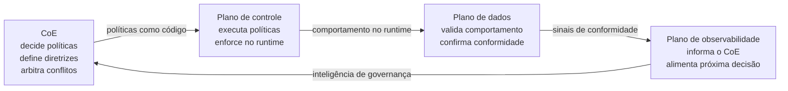
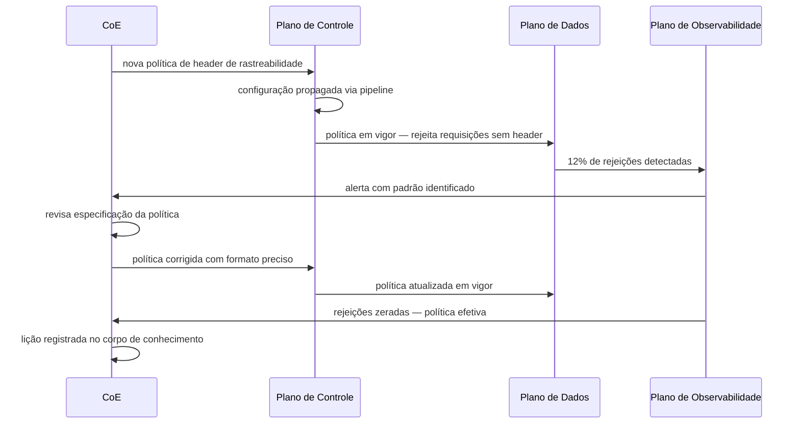
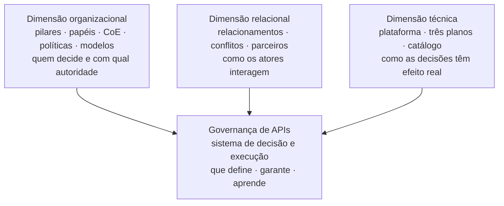

# Módulo 3 · Governança de APIs
## Capítulo 3.8 · Os três planos como instrumentos de governança

> **Série:** Gerenciamento e Governança de APIs
> **Nível:** Estratégico
> **Pré-requisito:** Módulo 3 completo · Cap 1.5 · Cap 2.7

---

## Sumário

- [3.8.1 · Da decisão à execução — o papel dos três planos](#381--da-decisão-à-execução--o-papel-dos-três-planos)
- [3.8.2 · O plano de controle como executor de políticas](#382--o-plano-de-controle-como-executor-de-políticas)
- [3.8.3 · O plano de dados como validador de conformidade](#383--o-plano-de-dados-como-validador-de-conformidade)
- [3.8.4 · O plano de observabilidade como fonte de inteligência de governança](#384--o-plano-de-observabilidade-como-fonte-de-inteligência-de-governança)
- [3.8.5 · Os três planos como sistema de governança técnica](#385--os-três-planos-como-sistema-de-governança-técnica)
- [3.8.6 · Fechando o Módulo 3 — o que governança de APIs realmente é](#386--fechando-o-módulo-3--o-que-governança-de-apis-realmente-é)

---

## 3.8.1 · Da decisão à execução — o papel dos três planos

Ao longo do Módulo 3 construímos a arquitetura organizacional da governança de APIs — os pilares que a sustentam, os papéis que a operacionalizam, o CoE que a centraliza ou distribui, as políticas que a materializam, o catálogo que a torna visível, as relações com parceiros que a complexificam e os modelos organizacionais que a configuram.

Mas há uma lacuna entre decidir e executar que a dimensão organizacional sozinha não fecha.

O CoE pode definir que autenticação OAuth 2.0 é obrigatória para todas as APIs com dados pessoais. Essa é uma decisão de governança. Mas como essa decisão garante que nenhuma API com dados pessoais é publicada sem OAuth 2.0? Não através de revisão humana de cada API — essa abordagem não escala. Através dos três planos.

O plano de controle executa a política — rejeita qualquer requisição para uma API sem o esquema correto de autenticação. O plano de dados valida que a execução está funcionando — o tráfego real confirma que consumidores não conseguem chamar endpoints sem autenticação válida. O plano de observabilidade informa o CoE — as tentativas de acesso sem autenticação são registradas, analisadas e alimentam a revisão das políticas.

Essa é a distinção central do capítulo:

> **O CoE governa. Os três planos executam, validam e informam. Governança sem essa infraestrutura técnica é declaração de intenção.**

Esse ciclo — decidir, executar, validar, informar — é o ciclo EDM do Cap 3.1 materializado em infraestrutura técnica. O plano de controle é o Direct. O plano de dados é parte do Monitor. O plano de observabilidade fecha o Monitor e alimenta o próximo Evaluate.

---

## 3.8.2 · O plano de controle como executor de políticas

O plano de controle é onde as políticas definidas pelo CoE no Cap 3.4 deixam de ser documentos e se tornam comportamento. É o mecanismo de enforcement que garante que a governança tem efeito real — independente de quem está revisando, independente do volume de APIs.

---

### Políticas como código

A conexão entre governança e plano de controle passa pelo princípio estabelecido no Cap 3.3.5: políticas como código. As regras definidas pelo CoE — autenticação obrigatória, rate limits por tier, headers de segurança, políticas de CORS — são declaradas em um repositório, versionadas e aplicadas automaticamente via pipeline de infraestrutura.

Isso tem três consequências diretas para a governança:

**Auditabilidade** — toda mudança nas políticas tem histórico. Quem mudou o quê, quando e com qual justificativa. Em mercados regulados, esse histórico é evidência de conformidade.

**Consistência** — políticas aplicadas como código são as mesmas para todas as APIs, em todos os ambientes, sem dependência de quem executou a configuração manualmente.

**Velocidade** — mudanças de política que antes exigiam configuração manual em cada gateway de cada ambiente são propagadas automaticamente via pipeline.

---

### O plano de controle como limite do portfólio

O plano de controle é o mecanismo pelo qual o CoE define o espaço dentro do qual os times de produto têm autonomia.

No modelo híbrido do Cap 3.7, a governança central define o núcleo universal e os domínios têm autonomia nas camadas específicas. Essa arquitetura de autonomia só é sustentável porque o plano de controle implementa o núcleo universal de forma não negociável — independente do que os times configurem em cima. O espaço de autonomia dos domínios é o espaço que o plano de controle central não ocupa.

---

## 3.8.3 · O plano de dados como validador de conformidade

O plano de controle executa as políticas. Mas execução não é garantia de conformidade. Uma política pode estar configurada corretamente no gateway e ainda assim não estar produzindo o comportamento esperado — por um bug de implementação, por uma configuração mal feita, por um caso de uso não previsto.

O plano de dados é o que valida que a execução está funcionando.

---

### A distinção entre configuração e conformidade

Uma política de rate limiting configurada para 100 requisições por minuto por consumidor pode estar corretamente declarada no plano de controle e ainda assim não estar sendo aplicada — se o roteamento está incorreto, se há um bypass não documentado, se a implementação tem um edge case não previsto.

O plano de dados revela essa diferença. O tráfego real mostra se consumidores estão sendo limitados quando deveriam. Mostra se autenticação está sendo verificada. Mostra se os headers de segurança estão presentes nas respostas.

Em termos de governança: o plano de controle é o que deveria acontecer. O plano de dados é o que está acontecendo. A diferença entre os dois é o gap de conformidade.

---

### O plano de dados e o CMDB

A conexão com o CMDB estabelecida no Cap 2.1.4 se manifesta aqui de forma específica: o plano de dados alimenta a evidência de conformidade que o CMDB precisa para que os relacionamentos entre ICs sejam confiáveis.

O resultado de cada requisição processada pelo gateway — qual backend foi chamado, qual política foi aplicada, qual resposta foi retornada — é a evidência de que a configuração do plano de controle está produzindo o comportamento esperado. Essa evidência, quando registrada sistematicamente, torna o CMDB um sistema que reflete o estado real da operação — não apenas o estado declarado na configuração.

---

## 3.8.4 · O plano de observabilidade como fonte de inteligência de governança

O plano de observabilidade é o único dos três que tem papel direto em todas as atividades do ciclo EDM — Evaluate, Direct e Monitor. É o sistema que transforma dados operacionais em inteligência que o CoE pode usar para tomar decisões melhores.

---

### Observabilidade como mecanismo de Monitor

O ciclo EDM do Cap 3.1 define Monitor como a atividade pela qual o corpo governante verifica se as diretrizes estão sendo seguidas e se os resultados esperados estão sendo alcançados. O plano de observabilidade é a infraestrutura que torna esse Monitor possível em escala — contínuo, abrangente e alimentado por dados reais de produção.

As dimensões que o plano de observabilidade torna visíveis para a governança:

**Conformidade de políticas** — quantas requisições violaram uma política de segurança? Qual API tem o maior número de tentativas de acesso sem autenticação válida? Qual consumidor está consistentemente excedendo seus rate limits?

**Saúde do portfólio** — quais APIs têm SLA degradado? Quais têm taxa de erro acima do threshold? Quais têm latência crescente que pode indicar degradação de backend?

**Adoção e uso** — quais APIs estão crescendo? Quais estão em declínio? Quais versões têm tráfego residual que precisa ser migrado?

**Comportamento de consumidores** — quais consumidores têm padrões de uso que indicam integração frágil? Quais têm volume crescente que pode sobrecarregar o sistema?

---

### Observabilidade como mecanismo de Evaluate

O plano de observabilidade não apenas monitora o presente — informa as avaliações do CoE sobre o estado do portfólio e as necessidades de evolução.

Quando o CoE precisa avaliar se uma política de rate limiting está calibrada corretamente, os dados de observabilidade mostram como o tráfego real se distribui em relação aos limites configurados. Quando o CoE precisa avaliar se uma API está pronta para ser depreciada, os dados de adoção mostram a tendência de uso ao longo do tempo. Quando o CoE precisa avaliar se o modelo organizacional está funcionando, os dados de conformidade por domínio mostram onde a qualidade está mais alta e onde está mais baixa.

Essa inteligência fecha o ciclo EDM — Monitor alimenta Evaluate que alimenta o próximo Direct.

---

## 3.8.5 · Os três planos como sistema de governança técnica

Os três planos não são camadas independentes — são um sistema onde cada um amplifica o valor dos outros dois. A ausência ou fraqueza de qualquer um degrada os demais e compromete a efetividade da governança.

---

### O cenário integrado — de uma decisão do CoE ao feedback

Para tornar essa integração concreta, considere uma decisão típica do CoE: endurecer a política de segurança para APIs que expõem dados de transações financeiras, exigindo que todas as requisições incluam um header de rastreabilidade auditável.

**Decisão e execução — plano de controle**

O CoE aprova a mudança de política. O time de plataforma traduz a decisão em configuração do gateway — uma nova regra que verifica a presença e o formato do header de rastreabilidade em todas as requisições para APIs classificadas como financeiras no catálogo. A configuração é versionada no repositório, passa por revisão e é propagada via pipeline para todos os ambientes. A política entra em vigor.

**Validação — plano de dados**

Nas primeiras horas, o plano de dados revela um problema não antecipado: 12% das requisições de um parceiro específico estão sendo rejeitadas porque o formato do header implementado pelo parceiro difere sutilmente do que a política especifica. O problema não estava no design da política — estava em uma ambiguidade na especificação do formato que o parceiro interpretou diferente da intenção do CoE.

Sem o plano de dados, esse problema só seria descoberto quando o parceiro reportasse falhas na integração. Com o plano de dados, é detectado em horas.

**Inteligência e revisão — plano de observabilidade**

O plano de observabilidade registra o padrão de rejeições, correlaciona com o parceiro específico e gera um alerta para o CoE. O CoE revisa o caso, confirma a ambiguidade na especificação e emite uma clarificação do formato aceito. A política é corrigida com a especificação mais precisa. O parceiro é notificado.

Três semanas depois, o plano de observabilidade mostra que as rejeições caíram a zero para esse parceiro. A política está funcionando conforme esperado. O CoE registra a lição: especificações de formato em políticas de segurança precisam incluir exemplos concretos e referências a padrões formais para evitar ambiguidade.

---

### Os três padrões sistêmicos

O cenário revela três padrões que o Cap 2.7 identificou e que aqui se confirmam sob a perspectiva de governança:

**Plano de controle como executor de governança** — cada decisão de política do CoE se materializa como configuração no plano de controle. Sem essa materialização, a política existe apenas no documento.

**Plano de dados como validador de hipóteses** — o CoE define o comportamento esperado; o plano de dados confirma se está acontecendo. Sem validação, o CoE governa com base em suposições.

**Plano de observabilidade como antecedente de decisão** — o próximo ciclo de avaliação do CoE é alimentado pelos dados que o plano de observabilidade coletou. Sem essa inteligência, o CoE avalia com informação incompleta.

---

## 3.8.6 · Fechando o Módulo 3 — o que governança de APIs realmente é

Este é o último capítulo do Módulo 3 — e o momento de olhar para trás e nomear o que oito capítulos construíram em conjunto.

Governança de APIs é frequentemente descrita como um conjunto de políticas e processos. Essa descrição não está errada — mas está incompleta de uma forma que importa.

Políticas e processos são os artefatos visíveis da governança. O que a governança realmente é, em seu nível mais fundamental, é um **sistema de decisão e execução** — que define o que deve acontecer, garante que acontece e aprende quando não acontece.

Esse sistema tem três dimensões que o Módulo 3 construiu progressivamente:

**A dimensão organizacional** — quem decide, com qual autoridade, em qual modelo de distribuição de responsabilidades. Os capítulos 3.1 a 3.4 e 3.7 construíram essa dimensão — dos pilares teóricos à arquitetura de políticas, do CoE aos modelos organizacionais.

**A dimensão relacional** — como os atores se relacionam, como conflitos são resolvidos, como parceiros são governados. Os capítulos 3.2 e 3.6 construíram essa dimensão — dos papéis às relações de parceria.

**A dimensão técnica** — como as decisões organizacionais e relacionais se materializam em infraestrutura que opera de forma contínua e escalável. Os capítulos 3.3, 3.5 e 3.8 construíram essa dimensão — da plataforma como produto interno aos três planos como sistema de execução.

Organizações que têm apenas a dimensão organizacional — políticas bem definidas sem infraestrutura técnica de enforcement — têm governança que funciona no papel mas não na operação. Organizações que têm apenas a dimensão técnica — um gateway configurado sem decisões organizacionais conscientes por trás — têm infraestrutura sem governança. Organizações que descuidam da dimensão relacional descobrem que suas políticas são contornadas ou contestadas de formas que a governança formal não consegue gerenciar.

A maturidade de governança de APIs não é medida pela sofisticação de qualquer uma das três dimensões — é medida pela coerência entre as três.

> **Governança de APIs não é o que o CoE escreve no style guide. É o que acontece quando um desenvolvedor faz o push de uma spec às 23h numa sexta-feira. É o que acontece quando um parceiro estratégico descobre que sua integração vai ser depreciada. É o que acontece quando um incidente de segurança exige uma resposta coordenada de múltiplos times. O sistema que governa esses momentos — e aprende com eles — é o que o Módulo 3 construiu.**

---

## Pontos-chave do capítulo

- Os três planos são os instrumentos pelos quais as decisões de governança do Módulo 3 se materializam: o plano de controle executa, o plano de dados valida e o plano de observabilidade informa
- Políticas como código no plano de controle garantem auditabilidade, consistência e velocidade de propagação — conectando as decisões do CoE ao comportamento do portfólio em produção
- O plano de dados fecha a lacuna entre configuração e conformidade: o CoE define o comportamento esperado; o plano de dados confirma se está acontecendo
- O plano de observabilidade fecha o ciclo EDM do Cap 3.1: Monitor alimenta Evaluate que alimenta o próximo Direct. Sem essa inteligência, o CoE governa com informação incompleta
- Governança de APIs tem três dimensões que precisam ser coerentes: organizacional, relacional e técnica. A maturidade é medida pela coerência entre as três — não pela sofisticação de qualquer uma delas individualmente

---

## Próximo módulo

**Módulo 4 · ITIL e APIs** — como o framework ITIL 4 se aplica ao contexto de APIs. Configuration Management, Change Enablement, Service Catalog e os processos de gestão de serviço que dão ao programa de APIs a maturidade operacional que os módulos anteriores pressupõem.

---

*Série: Gerenciamento e Governança de APIs · Módulo 3 · Capítulo 3.8*