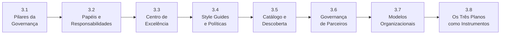

# Módulo 3 — Governança de APIs

> **Série:** Gerenciamento e Governança de APIs
> **Nível:** Estratégico e organizacional
> **Pré-requisito:** Módulo 1 — Fundamentos, Módulo 2 — Ciclo de Vida de APIs

---

## Sobre este módulo

Governança não é burocracia — é o mecanismo pelo qual decisões sobre APIs são tomadas de forma intencional, consistente e rastreável. O Módulo 3 aprofunda o que foi introduzido no Módulo 1 e o que atravessou o Módulo 2: como as organizações estruturam autoridade, accountability e enforcement para que suas APIs evoluam com qualidade e sem caos.

O módulo percorre os pilares teóricos da governança, desce aos papéis e estruturas organizacionais concretas — incluindo o CoE de APIs —, trata dos artefatos que tornam a governança operacional (style guides, políticas, catálogos) e fecha mostrando como os três planos técnicos — controle, dados e observabilidade — funcionam como instrumentos de execução das decisões de governança.

---

## Capítulos

### [3.1 · Pilares da Governança](cap_3_1_pilares.md)

O ponto de partida teórico do módulo. O capítulo analisa o que frameworks como COBIT, TOGAF e ISO/IEC 38500 convergem sobre governança, introduz o ciclo EDM (Evaluate-Direct-Monitor) como núcleo operacional universal e deriva os pilares específicos de governança de APIs a partir dessas referências. Fecha com uma análise empírica de por que a governança falha na prática — e como os pilares funcionam como sistema integrado.

---

### [3.2 · Papéis e Responsabilidades](cap_3_2_papeis_reponsabilidades.md)

Governança sem papéis claros é intenção sem execução. Este capítulo mapeia os atores da governança de APIs — do API Product Owner ao CoE, passando por arquitetos, times de segurança e consumidores —, analisa seus relacionamentos sob cinco óticas distintas e aborda os conflitos e exceções que surgem quando as responsabilidades se sobrepõem. O Anexo C oferece um modelo RACI de referência.

> Referencia o [Anexo C · Modelo RACI sugerido para governança de APIs](../anexos/c_raci.md).

---

### [3.3 · O Centro de Excelência de APIs](cap_3_3_coe.md)

O CoE é a estrutura organizacional central da governança de APIs — mas frequentemente mal compreendida. Este capítulo define o que um CoE é e o que não é, apresenta os modelos de CoE (do virtual ao dedicado), sua composição, modelo operacional e como ele exerce sua função sem se tornar gargalo. Inclui o conceito de plataforma como produto interno e as métricas de eficácia do CoE.

---

### [3.4 · Style Guides e Políticas](cap_3_4_guia_estilo_politica.md)

Os artefatos que tornam a governança concreta. O capítulo distingue style guides de políticas, detalha o que cada um cobre, como são construídos de forma participativa, como são enforçados — com automação como primeira linha — e como evoluem ao longo do tempo. Aborda também a arquitetura de políticas em camadas e os requisitos específicos de contextos regulados.

---

### [3.5 · Catálogo e Descoberta de APIs](cap_3_5_catalogo.md)

O catálogo é a infraestrutura de visibilidade da governança — sem ele, não há como saber o que existe, quem usa o quê ou o que está em que fase do ciclo de vida. Este capítulo cobre o que o catálogo registra, sua relação com o ciclo de vida, como APIs se tornam descobríveis e como a documentação é tratada como objeto de governança. Inclui o conceito de *API AI Readiness* aplicado ao nível de portfólio.

---

### [3.6 · Governança de APIs de Parceiros](cap_3_6_parceiros.md)

APIs de parceiros introduzem uma dimensão que a governança interna não cobre: contratos bilaterais, SLAs negociados, co-evolução de especificações e salvaguardas jurídicas. Este capítulo analisa o que torna APIs de parceiros fundamentalmente diferentes, como estruturar o onboarding, gerir mudanças e incidentes com impacto externo, e como o catálogo controla a visibilidade para parceiros.

---

### [3.7 · Modelos Organizacionais — Centralizado, Federado e Híbrido](cap_3_7_modelos_organizacionais.md)

Não existe um modelo organizacional de governança universalmente correto. Este capítulo analisa os três modelos principais — centralizado, federado e híbrido —, seus trade-offs, como o CoE se configura em cada um e quais fatores determinam qual modelo é adequado para cada organização. Fecha com o conceito de coevolução: o modelo organizacional muda à medida que a maturidade da organização avança.

---

### [3.8 · Os Três Planos como Instrumentos de Governança](cap_3_8_tres_planos.md)

O encerramento do módulo fecha o arco iniciado no Cap 1.5 e aprofundado no Cap 2.7. Aqui os três planos — controle, dados e observabilidade — são analisados como instrumentos de execução das decisões de governança: o plano de controle como executor de políticas, o plano de dados como validador de conformidade e o plano de observabilidade como fonte de inteligência para o ciclo EDM. Os três operam como sistema integrado de governança técnica.

---

## Progressão conceitual

