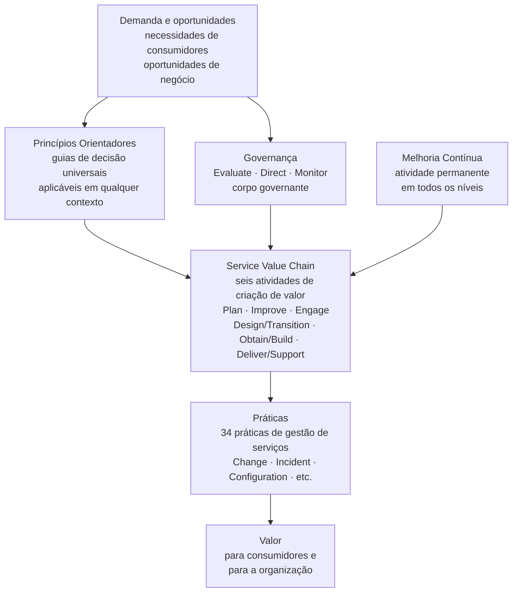
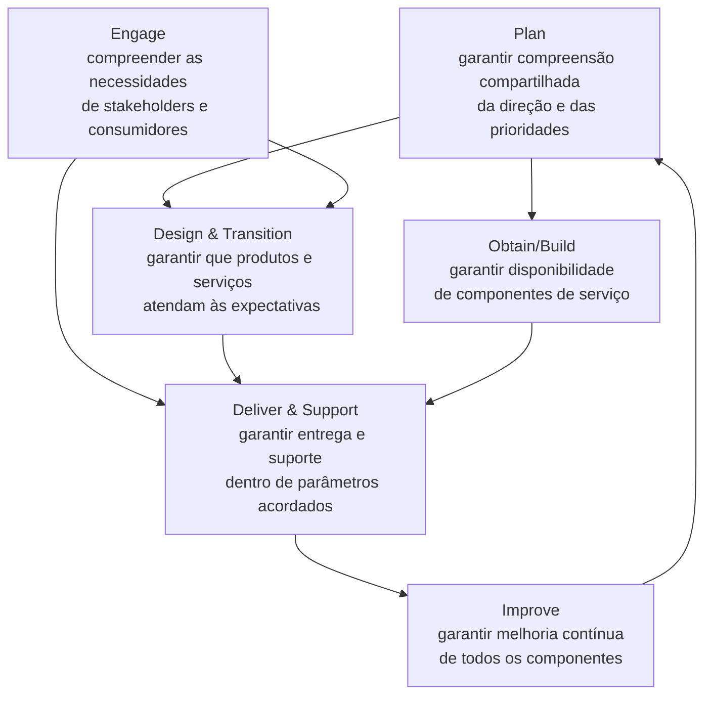

# Módulo 4 · ITIL e APIs
## Capítulo 4.1 · O Sistema de Valor de Serviço (SVS) aplicado a APIs

> **Série:** Gerenciamento e Governança de APIs
> **Nível:** Estratégico e operacional
> **Pré-requisito:** Módulos 1, 2 e 3 completos · Cap 3.1 · Pilares da governança

---

## Sumário

- [4.1.1 · O SVS como modelo de sistema — não de processo](#411--o-svs-como-modelo-de-sistema--não-de-processo)
- [4.1.2 · Os cinco componentes do SVS aplicados a APIs](#412--os-cinco-componentes-do-svs-aplicados-a-apis)
- [4.1.3 · Os sete princípios orientadores como guia de decisão](#413--os-sete-princípios-orientadores-como-guia-de-decisão)
- [4.1.4 · A Service Value Chain aplicada ao ciclo de vida de APIs](#414--a-service-value-chain-aplicada-ao-ciclo-de-vida-de-apis)
- [4.1.5 · APIs como serviços no SVS — implicações de governança](#415--apis-como-serviços-no-svs--implicações-de-governança)
- [Fontes e referências](#fontes-e-referências)

---

## 4.1.1 · O SVS como modelo de sistema — não de processo

O ITIL 4, publicado em 2019 pela Axelos, representou uma ruptura significativa com suas versões anteriores. O ITIL v3, dominante entre 2007 e 2019, organizava a gestão de serviços em um ciclo de vida de cinco fases — Estratégia, Design, Transição, Operação e Melhoria Contínua — com processos bem definidos, entradas, saídas e papéis específicos. Era um modelo prescritivo, detalhado e, para muitas organizações, excessivamente rígido para o ritmo de mudança que o ambiente digital exigia.

O ITIL 4 substitui esse modelo por algo fundamentalmente diferente: o **Sistema de Valor de Serviço** — uma visão holística de como todos os componentes e atividades de uma organização trabalham juntos como sistema para criar valor a partir da demanda de stakeholders e oportunidades de mercado.

Essa mudança não é apenas cosmética. Ela reflete um reconhecimento que a gestão de serviços amadureceu o suficiente para perceber o que teorias de gestão já sabiam: sistemas complexos não se comportam como sequências lineares de processos. Eles têm retroalimentação, emergência e interdependências que só são visíveis quando se olha para o todo — não para as partes isoladas.

---

### A observação sobre o PDCA

Antes de entrar nos detalhes do SVS, vale nomear um padrão que qualquer pessoa familiarizada com frameworks de gestão vai reconhecer: o SVS é mais uma instanciação do ciclo fundamental Plan-Do-Check-Act que Deming formalizou nos anos 1950 e que reaparece em praticamente todos os frameworks de gestão maduros desde então.

O COBIT 2019 o chama de EDM — Evaluate, Direct, Monitor. A ISO/IEC 38500 usa a mesma nomenclatura. O Scrum tem Sprint Planning, Sprint, Review, Retrospective. O DevOps tem Plan, Code, Build, Test, Release, Deploy, Operate, Monitor. O ITIL 4 tem seu próprio vocabulário dentro do SVS.

O que muda entre esses frameworks não é o princípio — é o domínio de aplicação, o vocabulário e o nível de granularidade das práticas. O valor do ITIL 4 não está em ter inventado um novo modelo de gestão. Está na profundidade com que cada atividade é definida, nas práticas específicas que as suportam e na maturidade operacional que décadas de implementação em organizações reais acumularam.

> *O SVS do ITIL 4 operacionaliza com precisão o que a teoria de gestão estabeleceu há décadas: definir intenção, executar, verificar e aprender. O valor do ITIL não está no ciclo — está na profundidade com que cada atividade é definida e nas práticas que a suportam.*

> *Axelos. ITIL Foundation: ITIL 4 Edition. The Stationery Office, 2019. Disponível em: [axelos.com/certifications/itil-service-management](https://www.axelos.com/certifications/itil-service-management)*

---

### A transição de processo para sistema

No modelo do ITIL v3, a pergunta central era: *qual processo gerencia este problema?* Um incidente vai para Incident Management. Uma mudança vai para Change Management. Os processos eram compartimentos com seus handoffs.

No ITIL 4, a pergunta central muda: *como o sistema como um todo cria valor?* Não existe um processo de Incident Management isolado — existe um conjunto de práticas que colaboram dentro de uma cadeia de valor de serviço para responder a eventos de forma que preserve ou restaure o valor para os consumidores.

Essa mudança de perspectiva tem implicações diretas para APIs. Uma API não é o output de um processo de desenvolvimento — é um serviço que cria valor continuamente, que tem stakeholders com necessidades distintas, que opera dentro de um sistema mais amplo de serviços interdependentes, e que precisa ser gerenciada de forma holística ao longo de todo o seu ciclo de existência.

---

## 4.1.2 · Os cinco componentes do SVS aplicados a APIs

O SVS é composto por cinco elementos que trabalham em conjunto. Nenhum deles é suficiente isoladamente — é a interação entre os cinco que produz o sistema de valor.

---

### Princípios Orientadores

Os sete princípios orientadores são guias de decisão — não regras obrigatórias, mas orientações que ajudam a tomar decisões melhores em qualquer contexto. Trataremos cada um em detalhe no 4.1.3.

No contexto de APIs, os princípios orientadores são especialmente relevantes porque o programa de APIs frequentemente enfrenta pressões conflitantes: velocidade vs. qualidade, autonomia vs. consistência, inovação vs. estabilidade. Os princípios oferecem critérios para navegar esses conflitos de forma consciente.

---

### Governança

O componente de Governança do SVS é onde o corpo governante — no contexto de APIs, o CoE — exerce as atividades de Evaluate, Direct e Monitor que estabelecemos no Cap 3.1. A governança no ITIL 4 não é uma camada acima do sistema — é um componente que dirige o sistema a partir do ciclo EDM.

A conexão entre o Cap 3.1 e o ITIL 4 aqui é explícita e intencional: o COBIT 2019 e o ITIL 4 compartilham o mesmo modelo EDM — o que confirma que estamos construindo sobre fundamentos consistentes entre frameworks, não sobre escolhas arbitrárias de nomenclatura.

---

### Service Value Chain

A cadeia de valor de serviço é o conjunto de atividades que transforma demanda em valor. É o coração operacional do SVS. Trataremos em detalhe no 4.1.4.

---

### Práticas

As 34 práticas do ITIL 4 são os recursos organizacionais que suportam as atividades da cadeia de valor. Cada prática tem pessoas, processos, tecnologia e parceiros. Para APIs, as práticas mais relevantes são: Change Enablement, Service Configuration Management, Incident Management, Problem Management, Service Level Management e Continual Improvement — que serão tratadas nos capítulos 4.3 a 4.7.

A pesquisa sistemática de Bianchi et al. (2023), publicada no International Journal of Information Management, analisou implementações de ITSM entre 2012 e 2021 e concluiu que ITSM funciona como um Management Control System — uma coleção de controles de gestão cujos outcomes incluem maior transparência, qualidade de serviço e orientação ao cliente. As práticas do ITIL 4 não são processos burocráticos — são controles de gestão que produzem outcomes mensuráveis.

> *Bianchi, I. S., Sousa, R. D. & Pereira, R. Implementation and impacts of IT Service Management in the IT function. International Journal of Information Management, 70, 2023. Disponível em: [doi.org/10.1016/j.ijinfomgt.2023.102628](https://doi.org/10.1016/j.ijinfomgt.2023.102628)*

---

### Melhoria Contínua

A melhoria contínua no ITIL 4 não é uma fase ou um processo — é uma atividade que permeia todos os outros componentes do SVS e garante que o sistema não apenas opera, mas evolui.

No contexto de APIs, melhoria contínua é o Pilar 5 do Cap 3.1 — o mecanismo pelo qual o framework de governança não envelhece. No ITIL 4, ela tem uma prática dedicada com técnicas específicas que, seguindo o padrão universal já identificado, operacionalizam o ciclo Plan-Do-Check-Act para melhoria sistemática.

---

## 4.1.3 · Os sete princípios orientadores como guia de decisão

Os sete princípios orientadores do ITIL 4 são aplicáveis em qualquer contexto e em qualquer nível da organização. São o elemento do ITIL 4 que mais diretamente conecta o framework com a prática cotidiana de quem gerencia APIs — porque são critérios de decisão, não procedimentos a seguir.

---

### 1 · Focus on Value

Toda atividade deve contribuir diretamente ou indiretamente para a criação de valor para os stakeholders. No contexto de APIs: qualquer processo de governança que não contribui para a qualidade do portfólio, para a experiência do consumidor ou para a conformidade com requisitos legais é overhead que deve ser eliminado.

Este princípio é o antídoto para governança burocrática. Quando um gate de revisão está gerando atraso sem produzir melhoria de qualidade, Focus on Value é o argumento para revisá-lo — não como concessão à pressão dos times, mas como decisão de gestão racional.

---

### 2 · Start Where You Are

Antes de criar algo novo, avalie o que já existe. No contexto de APIs: antes de construir um processo de change management, avalie o que o processo atual produz. Antes de adotar uma nova ferramenta de catálogo, avalie o que o catálogo atual oferece e o que falta. Antes de criar uma nova política de depreciação, verifique se existe política informal já praticada que pode ser formalizada.

Este princípio previne o desperdício de reconstruir do zero o que já funciona parcialmente, e preserva o conhecimento operacional acumulado que não aparece em documentação formal.

---

### 3 · Progress Iteratively with Feedback

Não espere a solução perfeita antes de agir. Avance em incrementos, colete feedback, ajuste. No contexto de APIs: uma política imperfeita publicada e evoluída com base em feedback real é mais valiosa do que uma política perfeita que ainda está em revisão interna.

Este princípio conecta diretamente com o Pilar 5 de evolução e aprendizado do Cap 3.1 — e com o mecanismo de exceções como fonte de aprendizado do Cap 3.2.4.

---

### 4 · Collaborate and Promote Visibility

Trabalhe em conjunto e torne o trabalho visível. No contexto de APIs: o CoE que toma decisões de política sem envolver os times de produto viola este princípio. O catálogo que não é acessível aos consumidores viola este princípio. O processo de depreciação que notifica consumidores informalmente viola este princípio.

---

### 5 · Think and Work Holistically

Nenhum serviço, prática ou componente funciona isoladamente. No contexto de APIs: uma mudança no plano de controle pode afetar o plano de dados e o plano de observabilidade. Uma decisão de depreciação tem implicações técnicas, comerciais e jurídicas. Uma política de segurança afeta DX, conformidade e tempo de desenvolvimento.

Este princípio é o fundamento teórico do argumento que percorre o Módulo 3 inteiro: governança de APIs tem três dimensões — organizacional, relacional e técnica — que precisam ser gerenciadas em conjunto.

---

### 6 · Keep it Simple and Practical

Se um processo não contribui para a criação de valor, elimine-o. Use o mínimo de passos necessários. No contexto de APIs: gates de governança devem ter o mínimo de etapas necessárias para o nível de risco da decisão. A arquitetura de políticas em camadas do Cap 3.4 é uma aplicação direta deste princípio — o núcleo é pequeno precisamente porque o excesso de obrigatoriedade cria fricção sem valor correspondente.

---

### 7 · Optimize and Automate

Use os recursos da melhor forma possível. Automatize o que pode ser automatizado para liberar capacidade humana para o que exige julgamento. No contexto de APIs: lint automático, contract testing no pipeline, headers de depreciação automáticos, atualização automática do catálogo via gateway — cada um desses mecanismos aplica este princípio.

Este princípio é a fundamentação ITIL do argumento central do Cap 3.3: CoE que habilita através de plataforma é mais eficaz e mais escalável do que CoE que faz o trabalho manualmente.

---

## 4.1.4 · A Service Value Chain aplicada ao ciclo de vida de APIs

A Service Value Chain define seis atividades que, em diferentes combinações, criam fluxos de valor para diferentes tipos de demanda. Não é uma sequência linear — as atividades se combinam de formas distintas dependendo do que está sendo produzido ou operado.

---

### Plan aplicado a APIs

A atividade Plan garante compreensão compartilhada da visão, do estado atual e da direção de melhoria para o programa de APIs. Manifesta-se como: definição da estratégia de APIs, priorização do portfólio, decisão sobre o modelo organizacional de governança, alocação de recursos para o CoE e para a plataforma. A revisão periódica do modelo organizacional do Cap 3.7.7 é uma manifestação de Plan.

---

### Improve aplicado a APIs

Improve garante melhoria contínua em todos os componentes do SVS. Para APIs: evolução das políticas com base em exceções e incidentes, maturidade dos gates de governança, qualidade do portfólio ao longo do tempo, evolução da plataforma do CoE. A prática de Continual Improvement que suporta esta atividade é onde o Pilar 5 do Cap 3.1 encontra sua implementação formal.

---

### Engage aplicado a APIs

Engage garante que a organização entende as necessidades dos stakeholders e consumidores de forma contínua. Para APIs: onboarding de consumidores, gestão de relacionamento com parceiros do Cap 3.6, coleta de feedback sobre qualidade de documentação, consulta formal a consumidores em mudanças de alto impacto. O processo de co-evolução do Cap 3.6.5 é uma manifestação de Engage.

---

### Design & Transition aplicado a APIs

Design & Transition garante que produtos e serviços atendem às expectativas de qualidade, segurança e compliance. Para APIs: as fases de design e desenvolvimento do ciclo de vida do Cap 2.1, o processo design-first do Cap 2.2, os gates de qualidade antes da publicação. A transição é a promoção de uma API de staging para produção — o Change Record que garante que a mudança é controlada.

---

### Obtain/Build aplicado a APIs

Obtain/Build garante a disponibilidade dos componentes necessários para a entrega do serviço. Para APIs: implementação do backend, configuração do gateway, construção da documentação, setup da observabilidade. É onde o trabalho técnico de desenvolvimento acontece dentro do framework ITIL.

---

### Deliver & Support aplicado a APIs

Deliver & Support garante que serviços são entregues e suportados dentro dos parâmetros acordados. Para APIs: operação contínua, gestão de incidentes, suporte a consumidores, enforcement do SLA. É a fase de operação do Cap 2.1.6 vista pela lente do ITIL 4.

---

### O mapeamento entre SVC e ciclo de vida de APIs

| Atividade SVC | Fase do ciclo de vida de APIs | Capítulo de referência |
|---|---|---|
| Plan | Concepção e estratégia | Cap 2.1.2 |
| Engage | Design — consulta a consumidores | Cap 2.1.3 |
| Design & Transition | Design, Desenvolvimento, Publicação | Cap 2.1.3, 2.1.4, 2.1.5 |
| Obtain/Build | Desenvolvimento e validação | Cap 2.1.4 |
| Deliver & Support | Operação e evolução | Cap 2.1.6 |
| Improve | Todas as fases — especialmente Depreciação | Cap 2.1.7, 3.1 |

O que esse mapeamento revela: o ciclo de vida de APIs do Módulo 2 está naturalmente alinhado com a estrutura da SVC. Ambos derivam dos mesmos princípios de gestão de serviços que a experiência de décadas consolidou.

---

## 4.1.5 · APIs como serviços no SVS — implicações de governança

A implicação mais importante que emerge da aplicação do SVS ao contexto de APIs é deceptivamente simples: **quando APIs são tratadas como serviços dentro do SVS, elas herdam toda a infraestrutura de gestão de serviços da organização**.

---

### O que APIs herdam quando são tratadas como serviços

Uma organização que já tem processos maduros de ITSM não precisa construir processos equivalentes separados para APIs. Precisa estender os processos existentes para cobrir APIs como um tipo específico de serviço com características próprias.

Essa extensão é muito mais eficiente do que construir do zero — e produz integração natural com o restante da gestão de serviços. Um Change Record de uma breaking change de API coexiste no mesmo sistema com um Change Record de uma mudança de infraestrutura. Um incidente em uma API aparece no mesmo dashboard que incidentes em outros serviços. Um IC de uma spec OpenAPI vive no mesmo CMDB que ICs de servidores e bancos de dados.

A pesquisa de Marrone e Kolbe (2011), publicada no Business & Information Systems Engineering Journal, identificou empiricamente que a adoção de frameworks de ITSM impacta positivamente a organização de TI em múltiplas dimensões — incluindo transparência, qualidade e alinhamento com o negócio. A extensão desses processos para APIs herda esses benefícios.

> *Marrone, M. & Kolbe, L. M. Impact of IT Service Management Frameworks on the IT Organization. Business & Information Systems Engineering, 3(1), pp. 5-18, 2011. Disponível em: [doi.org/10.1007/s12599-010-0141-5](https://doi.org/10.1007/s12599-010-0141-5)*

---

### O que APIs adicionam ao SVS existente

APIs não são apenas mais um tipo de serviço — elas têm características que o SVS genérico não trata de forma específica e que os Módulos 2 e 3 construíram em profundidade:

- **Contratos formais** como artefatos de governança — a spec OpenAPI como IC com valor normativo
- **Consumidores externos com poder de negociação** — dimensão que o ITSM genérico não endereça para serviços internos
- **Ciclo de vida com depreciação controlada** — processo de encerramento que vai além do que o ITIL genérico prescreve
- **Ecossistema de parceiros** com relações bilaterais e contratos comerciais

Essas características específicas de APIs complementam o SVS — não o contradizem. O SVS oferece o framework de sistema de valor; os Módulos 2 e 3 oferecem as práticas específicas que o contexto de APIs exige.

---

### Service mapping — a visibilidade holística do SVS

O SVS pressupõe visibilidade holística de como os serviços de negócio são sustentados pelos componentes técnicos subjacentes. **Service mapping** é a prática que constrói e mantém no CMDB essa cadeia de relacionamentos — do serviço de negócio visível ao cliente até os componentes técnicos mais granulares que o sustentam.

No contexto de APIs, uma API não é apenas um IC isolado — é um nó em uma cadeia que conecta serviços de negócio a backends, bancos de dados, certificados e configurações de gateway. Essa visibilidade é o que torna possível responder às perguntas críticas de change management e incident management: se este componente falhar ou mudar, qual serviço de negócio é impactado?

O tratamento completo de service mapping no contexto de APIs — incluindo como essa cadeia é modelada no CMDB — está no **Cap 4.3 · Configuration Management e CMDB para APIs**.

---

## Pontos-chave do capítulo

- O ITIL 4 representa uma mudança de modelo de ciclo de vida de processo para modelo de sistema de valor — o SVS descreve como todos os componentes trabalham juntos para criar valor, não como processos se sucedem linearmente
- O SVS é mais uma instanciação do princípio universal Plan-Do-Check-Act. O valor do ITIL não está no ciclo — está na profundidade das práticas que o suportam e na maturidade operacional acumulada
- Os cinco componentes do SVS — Princípios Orientadores, Governança, Service Value Chain, Práticas e Melhoria Contínua — mapeiam naturalmente sobre os elementos construídos nos Módulos 2 e 3
- Os sete princípios orientadores são critérios de decisão práticos — não declarações de intenção. Cada um resolve tensões reais que surgem na gestão de APIs
- A Service Value Chain e o ciclo de vida de APIs do Módulo 2 estão naturalmente alinhados — ambos derivam dos mesmos princípios de gestão de serviços
- Quando APIs são tratadas como serviços dentro do SVS, elas herdam a infraestrutura de gestão de serviços existente. A extensão é mais eficiente do que construir do zero e produz integração natural com o restante da gestão de TI

---

## Fontes e referências

| Fonte | Referência completa |
|---|---|
| **ITIL 4 Foundation (2019)** | Axelos. *ITIL Foundation: ITIL 4 Edition*. The Stationery Office, 2019. Disponível em: [axelos.com/certifications/itil-service-management](https://www.axelos.com/certifications/itil-service-management) |
| **Bianchi et al. (2023)** | Bianchi, I. S., Sousa, R. D. & Pereira, R. Implementation and impacts of IT Service Management in the IT function. *International Journal of Information Management*, 70, 2023. Disponível em: [doi.org/10.1016/j.ijinfomgt.2023.102628](https://doi.org/10.1016/j.ijinfomgt.2023.102628) |
| **Marrone & Kolbe (2011)** | Marrone, M. & Kolbe, L. M. Impact of IT Service Management Frameworks on the IT Organization. *Business & Information Systems Engineering*, 3(1), pp. 5-18, 2011. Disponível em: [doi.org/10.1007/s12599-010-0141-5](https://doi.org/10.1007/s12599-010-0141-5) |

---

## Próximo capítulo

**4.2 · As Quatro Dimensões do ITIL 4 no contexto de APIs** — como as quatro dimensões — organizações e pessoas, informação e tecnologia, parceiros e fornecedores, fluxos de valor e processos — se manifestam especificamente no contexto de APIs e onde os capítulos anteriores se encaixam em cada dimensão.

---

*Série: Gerenciamento e Governança de APIs · Módulo 4 · Capítulo 4.1*