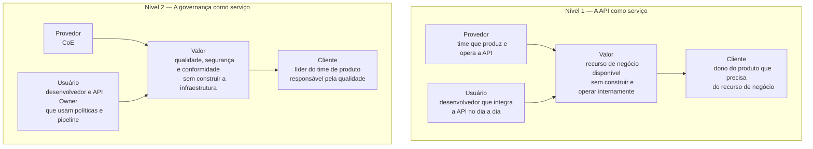

# Módulo 4 · ITIL e APIs
## Capítulo 4.2 · As Quatro Dimensões do ITIL 4 no contexto de APIs

> **Série:** Gerenciamento e Governança de APIs
> **Nível:** Estratégico e operacional
> **Pré-requisito:** Cap 4.1 · O SVS aplicado a APIs · Módulo 3 completo

---

## Sumário

- [4.2.1 · As Quatro Dimensões como lentes — e a distinção de serviço](#421--as-quatro-dimensões-como-lentes--e-a-distinção-de-serviço)
- [4.2.2 · Organizações e Pessoas](#422--organizações-e-pessoas)
- [4.2.3 · Informação e Tecnologia](#423--informação-e-tecnologia)
- [4.2.4 · Parceiros e Fornecedores](#424--parceiros-e-fornecedores)
- [4.2.5 · Fluxos de Valor e Processos](#425--fluxos-de-valor-e-processos)
- [4.2.6 · As Quatro Dimensões como checklist de governança](#426--as-quatro-dimensões-como-checklist-de-governança)

---

## 4.2.1 · As Quatro Dimensões como lentes — e a distinção de serviço

As Quatro Dimensões do ITIL 4 não são compartimentos organizacionais nem fases de um processo. São lentes — perspectivas que devem ser aplicadas simultaneamente a qualquer serviço, prática ou decisão de gestão. O propósito é garantir que nenhum aspecto relevante seja ignorado em favor dos que são mais visíveis ou mais confortáveis de gerenciar.

Organizações com alta maturidade técnica tendem a sobre-investir na dimensão de Informação e Tecnologia e sub-investir em Organizações e Pessoas. Organizações com alta maturidade de processos tendem a formalizar Fluxos de Valor e Processos ao ponto de criar rigidez que impede a adaptação. As Quatro Dimensões funcionam como um checklist de equilíbrio — não porque todas as dimensões precisam ter o mesmo peso em toda situação, mas porque a negligência sistemática de qualquer uma delas produz fragilidade.

---

### A ancoragem necessária — dois níveis de serviço

Antes de aplicar as quatro dimensões ao contexto de APIs, precisamos resolver uma ambiguidade que o material até aqui tratou pelo contexto mas não definiu explicitamente: quando usamos a palavra **serviço**, a qual serviço estamos nos referindo?

No vocabulário do ITIL 4, um serviço é o meio pelo qual um provedor habilita que seus clientes alcancem resultados de negócio desejados sem precisar gerenciar diretamente os recursos, riscos e complexidades necessários para produzi-los. O provedor absorve essa responsabilidade; o cliente recebe o resultado.

O ITIL 4 distingue três papéis que frequentemente são confundidos no uso cotidiano:

**Cliente** — quem define os requisitos do serviço e é responsável pelos resultados do ponto de vista do negócio. Não necessariamente quem usa o serviço no dia a dia.

**Usuário** — quem usa o serviço no dia a dia para produzir resultados. Pode ser o mesmo que o cliente ou pode ser diferente.

**Patrocinador** — quem autoriza o orçamento para o serviço.

No contexto do nosso material, essa definição se aplica em dois níveis distintos que operam simultaneamente:

---

**Nível 1 — A API como serviço**

O provedor é o time que produz e opera a API. O cliente é quem precisa do recurso de negócio que ela representa — o dono do produto ou domínio que define o que a API precisa entregar em termos de negócio. O usuário é o desenvolvedor que integra a API no dia a dia. O patrocinador é o gestor que aprova o investimento.

O valor entregue: o cliente consegue usar pagamentos, identidade, dados ou qualquer outro recurso de negócio sem precisar construir e operar esses sistemas internamente. A complexidade técnica e operacional fica com o provedor.

**Nível 2 — A governança como serviço**

O provedor é o CoE. O cliente é o líder do time de produto — quem é responsável pela qualidade das APIs do seu domínio e define o que governança útil significa do ponto de vista do negócio. O usuário é o desenvolvedor e o API Owner que interagem com as políticas, o catálogo e o pipeline no dia a dia. O patrocinador é o executivo que aprova o investimento no CoE e na plataforma de governança.

O valor entregue: o time de produto consegue produzir APIs com qualidade, segurança e conformidade sem precisar construir e operar sozinho toda a infraestrutura de políticas, enforcement, catálogo e conhecimento que isso exige.

A distinção importa porque as quatro dimensões se aplicam diferentemente a cada nível. A dimensão de Parceiros e Fornecedores tem implicações completamente diferentes quando estamos pensando nos parceiros que consomem as APIs versus os fornecedores da plataforma de governança que o CoE opera. Ao longo do Módulo 4, usaremos **"API como serviço"** quando nos referirmos ao Nível 1 e **"governança como serviço"** quando nos referirmos ao Nível 2.

---

## 4.2.2 · Organizações e Pessoas

A primeira dimensão examina as estruturas organizacionais, papéis, responsabilidades, sistemas de autoridade, competências e cultura que suportam a entrega e gestão de serviços. É a dimensão mais frequentemente negligenciada em programas de APIs — porque é mais fácil investir em ferramentas do que desenvolver pessoas e cultura.

---

### O que o Módulo 3 já construiu

O Módulo 3 cobriu extensamente a dimensão de Organizações e Pessoas: os pilares de governança no Cap 3.1, os papéis e responsabilidades no Cap 3.2, a estrutura e o modelo de trabalho do CoE no Cap 3.3, os modelos organizacionais no Cap 3.7. A arquitetura organizacional da governança de APIs está bem fundamentada.

---

### O que essa dimensão revela além do organograma

**Competências e capacitação**

Quais competências são necessárias para que cada papel funcione bem? O CoE precisa de arquitetos com profundidade técnica em APIs — mas também precisa de pessoas com capacidade de comunicação, de facilitação de conflitos e de produção de conhecimento. Times de produto precisam de desenvolvedores que entendam os princípios de design de APIs — não apenas as ferramentas.

A lacuna mais comum: organizações que têm o organograma certo mas não investem no desenvolvimento das competências necessárias para que cada papel seja exercido com eficácia.

**Gestão do conhecimento tácito**

O conhecimento organizacional sobre APIs não está apenas no catálogo, no style guide e nas políticas. Uma parte significativa está nas pessoas — nos arquitetos que entendem por que certas decisões foram tomadas, nos desenvolvedores que conhecem os casos extremos de determinadas integrações, nos líderes do CoE que têm o histórico dos conflitos que moldaram as políticas atuais.

Esse conhecimento tácito é um risco organizacional quando está concentrado em poucas pessoas. Programas de APIs maduros têm mecanismos explícitos para externalizar conhecimento tácito — processos de decisão documentados com rationale, post-mortems que capturam aprendizado, onboarding que transmite contexto histórico não apenas procedimentos.

**Cultura de governança**

O Cap 3.2.3 identificou a dimensão cultural como a quinta ótica para analisar relacionamentos entre papéis. A perspectiva ITIL 4 reforça: governança só funciona quando a cultura da organização reconhece seu valor. Times que percebem políticas como imposição arbitrária as contornam. Times que entendem o fundamento das políticas tendem a segui-las voluntariamente — e a contribuir para sua evolução.

A cultura de governança não se cria com documentos — se cria com comportamentos consistentes ao longo do tempo. O CoE que rejeita uma API com uma explicação clara do fundamento constrói mais cultura de governança do que o CoE que rejeita com uma referência ao número da política.

---

## 4.2.3 · Informação e Tecnologia

A segunda dimensão examina as informações gerenciadas pelos serviços, o conhecimento necessário para gerenciá-los e as tecnologias que os suportam. No contexto de APIs, essa dimensão cobre um espectro amplo — desde a spec OpenAPI como contrato formal até o CMDB como sistema de registro de relacionamentos entre ICs.

---

### O que os Módulos 2 e 3 já construíram

A dimensão de Informação e Tecnologia está bem representada no material existente: specs OpenAPI como contratos no Cap 2.3, documentação como artefato de governança no Cap 3.5, catálogo como infraestrutura de visibilidade no Cap 3.5, plataforma do CoE no Cap 3.3.5, integrações com sistemas agênticos no Cap 3.3.5.

---

### O que essa dimensão revela além das ferramentas

**Informação como ativo estratégico**

O catálogo, o CMDB, os logs de gateway, os históricos de incidentes e os registros de exceções de políticas não são apenas dados operacionais. São informação estratégica que alimenta as decisões de governança. Um CoE que não gerencia ativamente essa informação — que não analisa padrões, não identifica tendências, não extrai aprendizado — está operando com visibilidade parcial.

A distinção entre dados e informação é relevante: dados são os eventos registrados. Informação é o que emerge da análise desses dados com o contexto adequado. O plano de observabilidade do Cap 3.8 produz dados; a análise que o CoE faz desses dados é o que produz informação estratégica.

**Gestão do conhecimento organizacional**

A dimensão de Informação e Tecnologia no ITIL 4 inclui explicitamente o conhecimento — não apenas os sistemas que armazenam dados. No contexto de APIs, isso significa que o conhecimento organizacional sobre o portfólio precisa ser gerenciado ativamente:

- O histórico de decisões arquiteturais com seus fundamentos
- O contexto de cada política — por que foi criada, que problema resolveu
- O aprendizado de incidentes e de exceções
- O mapa de relacionamentos entre APIs, sistemas e serviços de negócio

Esse conhecimento alimenta as integrações com sistemas agênticos mencionadas no Cap 3.3.5 e no Cap 3.5.6 — a qualidade das respostas que ferramentas de IA dão aos desenvolvedores sobre o portfólio é diretamente proporcional à qualidade do conhecimento que o CoE mantém e disponibiliza.

**Gestão de dados e compliance**

A dimensão de Informação também levanta questões de conformidade regulatória que a perspectiva técnica de APIs às vezes deixa de lado. APIs que expõem dados pessoais não têm apenas um requisito de autenticação — têm requisitos de minimização de dados, de propósito de uso, de retenção e de portabilidade. A classificação de dados do catálogo do Cap 3.5.2 é o ponto de entrada para essas questões, mas a gestão do ciclo de vida dos dados que as APIs expõem vai além do que a governança técnica cobre sozinha.

---

## 4.2.4 · Parceiros e Fornecedores

A terceira dimensão examina os relacionamentos com outras organizações que contribuem para a criação e entrega dos serviços. No contexto de APIs, essa dimensão se divide em dois grupos com naturezas muito distintas — e cujas implicações de governança raramente são tratadas com o mesmo cuidado.

---

### O que o Módulo 3 já construiu

O Cap 3.6 cobriu em profundidade a governança de APIs de parceiros — boundary resources, onboarding bilateral, contratos e SLAs, co-evolução, gestão de mudanças e incidentes. A dimensão de parceiros comerciais está bem coberta.

---

### O que essa dimensão revela além dos parceiros comerciais

**Dependência de fornecedores de plataforma**

O grupo menos tratado no material existente é o dos fornecedores de plataforma — os provedores do gateway, do catálogo, das ferramentas de observabilidade, dos serviços de identidade. Esses fornecedores não são parceiros no sentido do Cap 3.6 — não há co-criação de valor nem relação bilateral de negócio. São fornecedores de capacidade técnica da qual o programa de APIs depende estruturalmente.

A dependência de fornecedores de plataforma tem implicações de governança que precisam ser gerenciadas explicitamente:

**Vendor lock-in** — quanto mais profundamente a governança depende de funcionalidades específicas de um fornecedor, mais difícil é mudar quando necessário. Políticas como código versionadas em formato aberto, specs OpenAPI como contrato independente de gateway e catálogo baseado em metadados portáveis são mecanismos que reduzem o lock-in sem eliminar a dependência.

**Continuidade e evolução do fornecedor** — o roadmap do fornecedor de gateway afeta diretamente a capacidade de evolução da plataforma de governança. Um fornecedor que descontinua uma funcionalidade crítica ou muda seu modelo de precificação pode forçar migrações não planejadas com impacto em todo o programa de APIs.

**Segurança e compliance no fornecedor** — para APIs em mercados regulados, as certificações e práticas de segurança dos fornecedores de plataforma fazem parte do escopo de compliance. Um gateway que processa dados financeiros precisa ser operado por um fornecedor com certificações adequadas.

**Ecossistema de padrões abertos**

Há um terceiro grupo frequentemente invisível na discussão de Parceiros e Fornecedores: as comunidades de padrões abertos — OpenAPI Initiative, AsyncAPI, CNCF — e os projetos open source que compõem o stack de governança.

A dependência de projetos open source tem características diferentes da dependência de fornecedores comerciais: o risco de abandono é real mas o acesso ao código-fonte oferece uma saída que produtos proprietários não oferecem. A participação ativa nas comunidades de padrões — contribuindo com feedback, casos de uso e implementações — é uma forma de governança do ecossistema que beneficia toda a indústria e reduz o risco de que padrões evoluam em direções que não atendem as necessidades da organização.

---

## 4.2.5 · Fluxos de Valor e Processos

A quarta dimensão examina como as atividades de criação de valor são organizadas — os fluxos de valor que transformam demanda em resultado, e os processos que estruturam essas atividades. Os Módulos 2 e 3 construíram o ciclo de vida e os processos de governança em profundidade. Essa dimensão oferece uma perspectiva adicional que os processos individuais não capturam.

---

### O que os Módulos 2 e 3 já construíram

O Módulo 2 cobriu o ciclo de vida de APIs como fluxo de valor com gates em cada fase. O Módulo 3 cobriu os processos de governança — políticas, exceções, conflitos, depreciação, onboarding de parceiros. A perspectiva de processo está bem representada.

---

### O que essa dimensão revela além dos processos individuais

**A otimização do sistema versus a otimização dos processos**

O erro mais comum na gestão de processos é otimizar cada processo individualmente sem considerar o impacto no fluxo como um todo. Um gate de revisão de segurança otimizado para detectar o máximo de vulnerabilidades pode ser tão rigoroso que cria um gargalo que atrasa todo o pipeline — mesmo que cada API que passa tenha segurança impecável.

A perspectiva de fluxo de valor coloca a pergunta correta: não "como este processo é mais eficiente?" mas "como o fluxo completo de criação de valor é mais eficiente?" Às vezes a resposta é simplificar um processo que estava bem projetado isoladamente porque ele cria fricção excessiva no contexto do fluxo maior.

**Desperdícios no fluxo de valor de APIs**

O pensamento Lean — que o ITIL 4 incorpora explicitamente — identifica categorias de desperdício em fluxos de valor. No contexto de APIs, os desperdícios mais comuns são:

**Espera** — APIs aguardando revisão manual que poderia ser automatizada. Times aguardando resposta do CoE além do SLA definido. Consumidores aguardando acesso ao sandbox enquanto o credenciamento está em análise.

**Retrabalho** — specs que falham nos gates de qualidade porque o time não teve orientação suficiente antes de submeter. Documentação reescrita porque os padrões mudaram após o trabalho estar feito.

**Inventário** — APIs em desenvolvimento que nunca chegam à produção. Versões antigas mantidas além do necessário porque o processo de sunset não foi iniciado.

**Processamento desnecessário** — revisões manuais de casos que poderiam ser resolvidos pelo lint automático. Reuniões de aprovação para mudanças de baixo impacto que poderiam ser standard changes.

**Fluxos de valor para diferentes tipos de demanda**

No contexto de APIs, há pelo menos três fluxos de valor distintos que coexistem e exigem abordagens diferentes:

**Fluxo de criação** — da concepção de uma nova API até a publicação em produção. É o fluxo que o ciclo de vida do Módulo 2 descreve.

**Fluxo de evolução** — de uma mudança identificada até sua implementação e validação em produção. É o fluxo que o change management do Cap 4.4 governa.

**Fluxo de suporte** — de um incidente ou problema identificado até sua resolução e aprendizado. É o fluxo que o Incident e Problem Management do Cap 4.6 governa.

Cada fluxo tem suas próprias características de velocidade, risco e qualidade — e a tentativa de aplicar o mesmo processo a todos os três produz inadequação sistemática.

---

## 4.2.6 · As Quatro Dimensões como checklist de governança

A aplicação prática das quatro dimensões não é um exercício acadêmico — é um mecanismo de prevenção de pontos cegos. Qualquer decisão importante de governança de APIs pode ser avaliada através das quatro dimensões como checklist.

---

### Aplicação a uma decisão de mudança de política

Considere que o CoE está avaliando tornar obrigatório o consumer-driven contract testing para todas as APIs que têm consumidores externos.

**Organizações e Pessoas** — os times têm competência para implementar contract testing? Há capacitação disponível? O CoE tem capacidade de suportar a adoção? Quem é responsável por manter os contratos atualizados?

**Informação e Tecnologia** — qual ferramenta será usada — Pact, Schemathesis? Como os contratos são versionados e armazenados? Como o catálogo registra o status de conformidade? Como o pipeline integra a verificação?

**Parceiros e Fornecedores** — consumidores externos têm capacidade técnica de contribuir com contratos? Como consumidores de parceiros participam? O fornecedor de gateway tem integração nativa ou precisa de customização?

**Fluxos de Valor e Processos** — em qual ponto do pipeline o contract testing entra? Como o fluxo de criação e o fluxo de evolução são afetados? Quanto tempo adicional é adicionado ao ciclo de publicação? Qual é o processo para quando um contrato falha?

Quando alguma dessas perguntas não tem resposta clara, a decisão não está pronta para ser implementada — independente de quão tecnicamente correta ela seja.

---

### As dimensões como indicador de maturidade

A maturidade de governança de um programa de APIs pode ser avaliada pelo equilíbrio com que as quatro dimensões são gerenciadas. Uma organização que investe fortemente em tecnologia mas negligencia pessoas e cultura tem maturidade assimétrica. Uma organização que tem processos excelentes mas não gerencia seus fornecedores de plataforma tem riscos não visíveis.

Programas de APIs que fracassam raramente fracassam porque a tecnologia era inadequada. Fracassam porque uma dimensão foi negligenciada sistematicamente — mais frequentemente Organizações e Pessoas, que é a menos visível e a mais difícil de medir.

---

## Pontos-chave do capítulo

- No vocabulário do ITIL 4, serviço tem definição precisa com papéis distintos de cliente, usuário e patrocinador. No contexto do nosso material, serviço opera em dois níveis: a API como serviço — cujo valor é o recurso de negócio que oferece — e a governança como serviço — cujo valor é habilitar qualidade sem que cada time construa a infraestrutura sozinho
- As Quatro Dimensões são lentes simultâneas — não compartimentos. Sua função é garantir que nenhum aspecto relevante seja sistematicamente negligenciado
- Organizações e Pessoas revela o que o organograma não mostra: competências necessárias, gestão do conhecimento tácito e cultura de governança como ativos que precisam ser gerenciados ativamente
- Informação e Tecnologia vai além das ferramentas: informação como ativo estratégico, gestão do conhecimento organizacional e compliance de dados como dimensões da governança de APIs
- Parceiros e Fornecedores revela o grupo frequentemente invisível: fornecedores de plataforma com implicações de vendor lock-in, continuidade e compliance — distintos dos parceiros comerciais do Cap 3.6
- Fluxos de Valor e Processos coloca a pergunta correta: não como otimizar cada processo, mas como otimizar o fluxo completo. Desperdícios no fluxo — espera, retrabalho, inventário, processamento desnecessário — são os indicadores de onde intervir
- As quatro dimensões funcionam como checklist de governança: qualquer decisão importante que não tenha respostas claras para as perguntas de todas as quatro dimensões não está pronta para ser implementada

---

## Próximo capítulo

**4.3 · Configuration Management e CMDB para APIs** — como APIs são modeladas como ICs no CMDB, quais relacionamentos precisam existir e como o service mapping constrói a cadeia do serviço de negócio até o componente mais granular. O capítulo que fecha a promessa do "elo perdido" introduzida no Cap 2.1.4.

---

*Série: Gerenciamento e Governança de APIs · Módulo 4 · Capítulo 4.2*