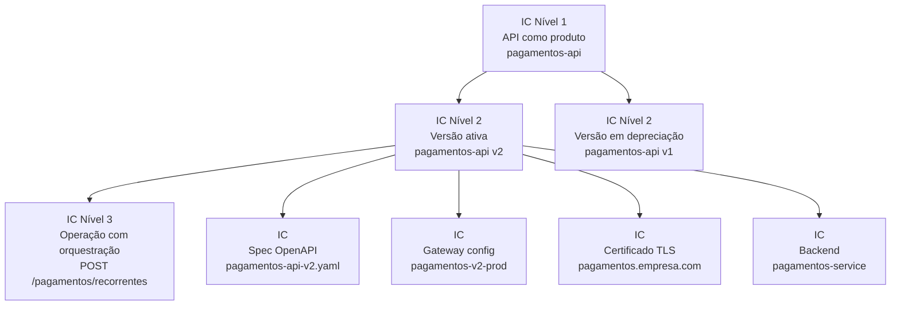
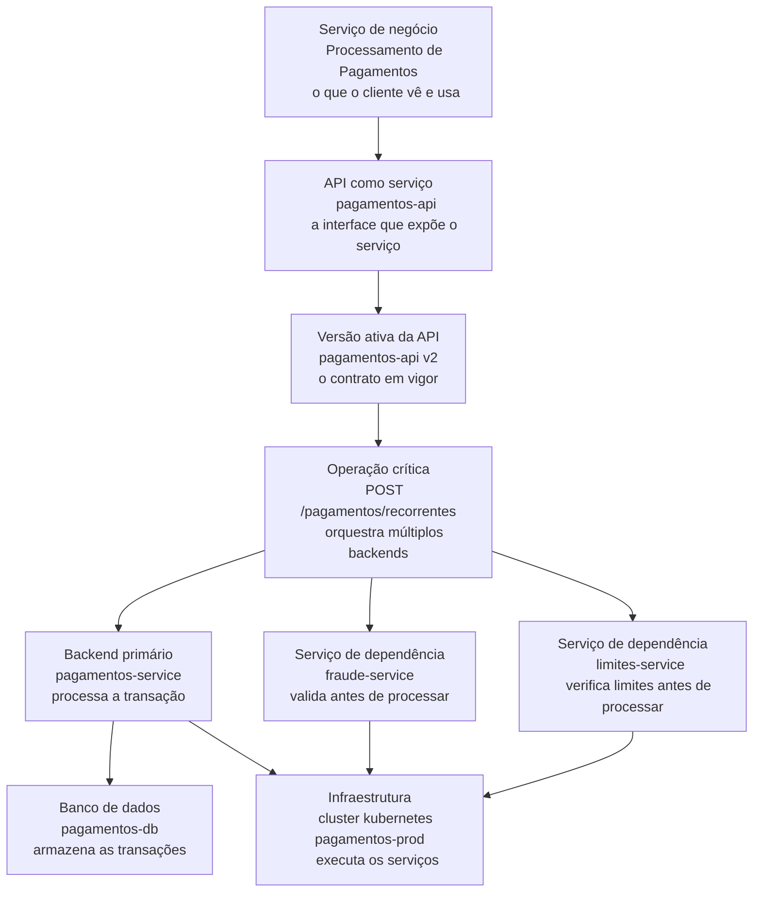
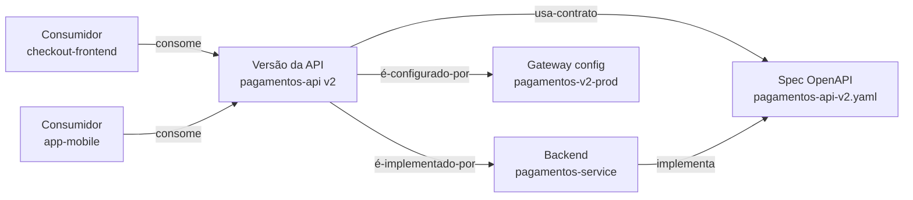
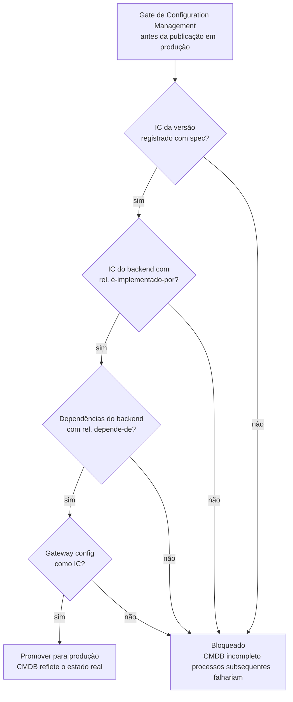

# Módulo 4 · ITIL e APIs
## Capítulo 4.3 · Configuration Management e CMDB para APIs

> **Série:** Gerenciamento e Governança de APIs
> **Nível:** Operacional e estratégico
> **Pré-requisito:** Cap 2.1.4 · Cap 4.1 · Cap 4.2

---

## Sumário

- [4.3.1 · Configuration Management como prática — não como banco de dados](#431--configuration-management-como-prática--não-como-banco-de-dados)
- [4.3.2 · O que é um IC no contexto de APIs](#432--o-que-é-um-ic-no-contexto-de-apis)
- [4.3.3 · Service mapping — da oferta de negócio ao menor IC](#433--service-mapping--da-oferta-de-negócio-ao-menor-ic)
- [4.3.4 · Relacionamentos entre ICs — o que o CMDB precisa saber](#434--relacionamentos-entre-ics--o-que-o-cmdb-precisa-saber)
- [4.3.5 · Contract drift e rastreabilidade — fechando o elo perdido](#435--contract-drift-e-rastreabilidade--fechando-o-elo-perdido)
- [4.3.6 · Manter o CMDB atualizado em ambientes de deploy contínuo](#436--manter-o-cmdb-atualizado-em-ambientes-de-deploy-contínuo)
- [4.3.7 · Configuration Management como fundação das outras práticas](#437--configuration-management-como-fundação-das-outras-práticas)
- [Fontes e referências](#fontes-e-referências)

---

## 4.3.1 · Configuration Management como prática — não como banco de dados

Configuration Management é frequentemente reduzido ao seu artefato principal — o CMDB. Organizações que tratam configuration management como "o projeto de popular o CMDB" invariavelmente produzem um banco de dados que foi preciso no momento da carga inicial e que envelhece progressivamente até se tornar mais perigoso do que útil. Um CMDB desatualizado que inspira confiança falsa é pior do que não ter CMDB.

A prática de Configuration Management — definida no ITIL 4 como Service Configuration Management — é o conjunto de atividades que garante que informação precisa e confiável sobre os ICs e seus relacionamentos está disponível quando e onde é necessária. O CMDB é a ferramenta que armazena essa informação. A prática é o que mantém essa informação confiável ao longo do tempo.

---

### O que a prática realmente envolve

Configuration Management como prática tem quatro atividades fundamentais que precisam operar continuamente — não apenas no momento da implementação inicial:

**Identificação** — decidir quais ativos precisam ser registrados como ICs, com qual granularidade e com quais atributos. No contexto de APIs, essa é a atividade mais estratégica — e a que mais frequentemente é feita de forma inadequada.

**Controle** — garantir que mudanças nos ICs só acontecem através de processos autorizados. Nenhum IC muda sem um Change Record correspondente. Essa atividade é o elo entre Configuration Management e Change Enablement.

**Status accounting** — registrar e reportar o estado atual e o histórico de cada IC. Qual versão está em produção, qual está em staging, qual está em depreciação, qual foi retirada.

**Verificação e auditoria** — confirmar periodicamente que os ICs registrados no CMDB correspondem aos ICs que existem na realidade. A divergência entre o que o CMDB diz e o que existe é o principal indicador de maturidade da prática.

A pesquisa de Marrone e Kolbe identificou configuration management como uma das práticas de ITSM com maior impacto positivo na qualidade operacional — especialmente na capacidade de resposta a incidentes e na eficácia de change management. Essa relação causal é direta: change management e incident management dependem de configuration management para ter a visibilidade que precisam.

> *Marrone, M. & Kolbe, L. M. Impact of IT Service Management Frameworks on the IT Organization. Business & Information Systems Engineering, 3(1), pp. 5-18, 2011. Disponível em: [doi.org/10.1007/s12599-010-0141-5](https://doi.org/10.1007/s12599-010-0141-5)*

---

## 4.3.2 · O que é um IC no contexto de APIs

Um Configuration Item é qualquer componente que precisa ser gerenciado para garantir a entrega de um serviço de TI. No contexto de APIs, os ICs relevantes formam uma hierarquia com diferentes níveis de granularidade — e a decisão de qual granularidade usar em cada contexto é uma das mais importantes do design do CMDB de APIs.

---

### Os níveis de IC em um programa de APIs

**Nível 1 — A API como produto**
O IC de mais alto nível representa a API como produto — independente de versões e implementações. Atributos essenciais: nome, domínio de negócio, owner, classificação (privada / parceiro / pública), data de criação.

**Nível 2 — A versão da API**
Cada versão ativa da API é um IC separado — com sua spec OpenAPI específica, seus endpoints de gateway, seu SLA e seu status no ciclo de vida. Atributos essenciais: número de versão, link para a spec, status (ativa / em depreciação / retirada), data de publicação, data de sunset se aplicável.

**Nível 3 — A operação**
Operações individuais da API como ICs próprios. Esse nível é necessário quando a operação tem características que a distinguem materialmente das demais operações da mesma versão: dependências de backends distintos, SLA específico, ou criticidade diferente do contrato geral.

**Os ICs de infraestrutura e plataforma**
Além dos ICs da API em si, o CMDB precisa registrar os componentes que a sustentam: o backend que implementa a API, os bancos de dados que o backend consome, a configuração do gateway, os certificados TLS e as dependências de outros serviços ou APIs.

---

### O problema do encadeamento de critérios — e a solução

A tentação natural ao definir quais ICs registrar é criar critérios baseados nas características de cada objeto: "registre operações quando tiverem múltiplos backends", "registre separadamente quando o SLA for diferente". Esse caminho produz um processo que exige avaliação caso a caso — e inevitavelmente se transforma em um encadeamento de condicionais que ninguém aplica consistentemente.

A solução é eliminar a avaliação caso a caso. A granularidade do CMDB é uma **decisão de configuração por domínio** — tomada uma vez no onboarding do domínio ao programa de governança, derivada da classificação de criticidade que já existe no catálogo:

| Classificação do domínio | Granularidade padrão |
|---|---|
| Domínio crítico ou regulado | IC por versão + IC por operação quando há dependências externas |
| Domínio padrão | IC por versão da API |
| Domínio experimental | IC por API |

Essa decisão é registrada no catálogo como metadado do domínio. Times que onboardam novas APIs naquele domínio seguem a granularidade definida — sem precisar avaliar cada caso individualmente. O CoE revisa a decisão periodicamente como parte do ciclo de evolução do framework de governança, não para cada API nova.

---

### Os atributos essenciais de cada IC

Independente do nível de granularidade, cada IC de API precisa ter no mínimo:

- **Identificador único** — estável ao longo do tempo, não baseado em nome ou versão que pode mudar
- **Owner** — quem é responsável pelo IC e pela acuracidade de seus metadados
- **Status** — o estado atual no ciclo de vida
- **Relacionamentos** — os outros ICs dos quais este depende ou que dependem deste
- **Histórico de mudanças** — trilha de auditoria com referência ao Change Record correspondente

---

## 4.3.3 · Service mapping — da oferta de negócio ao menor IC

Service mapping é a prática de construir e manter no CMDB a cadeia de relacionamentos que conecta o serviço de negócio que o cliente vê até os componentes técnicos mais granulares que o sustentam. É o que transforma o CMDB de um inventário de componentes isolados em um mapa de dependências que habilita análise de impacto real.

Sem service mapping, o CMDB responde à pergunta "o que existe?". Com service mapping, ele responde à pergunta que realmente importa para change management e incident management: **"se este componente falhar ou mudar, qual serviço de negócio é impactado — e quão gravemente?"**

---

### A cadeia do serviço de negócio ao IC mais granular

No contexto de APIs, o service mapping percorre pelo menos cinco níveis de abstração:

Cada seta nesse diagrama é um relacionamento registrado no CMDB. A qualidade do service mapping é medida pela completude e acuracidade dessas setas — não pela quantidade de ICs registrados.

---

### Por que o service mapping transforma change management e incident management

**No change management:**
Um engenheiro propõe uma mudança no `pagamentos-service`. Sem service mapping, ele sabe que a mudança afeta o backend. Com service mapping, o CMDB mostra imediatamente que `pagamentos-service` é consumido por `pagamentos-api v2` — que expõe o serviço de negócio "Processamento de Pagamentos" — com SLA de 99,9% e impacto em parceiros estratégicos. O nível de aprovação necessário para a mudança muda completamente.

**No incident management:**
Um alerta dispara: `fraude-service` está com latência acima do threshold. Sem service mapping, a equipe sabe que `fraude-service` está degradado. Com service mapping, o CMDB mostra em segundos que `fraude-service` é dependência de `POST /pagamentos/recorrentes` — operação crítica da `pagamentos-api v2` — que sustenta o serviço de negócio "Processamento de Pagamentos". A prioridade do incidente sobe automaticamente para o nível correto.

A diferença entre os dois cenários não é técnica — é de visibilidade. O service mapping constrói essa visibilidade de forma sistemática.

---

### Como construir o service mapping progressivamente

A armadilha mais comum é tentar construir o service mapping completo de uma vez. Esse approach falha invariavelmente por sobrecarga.

A abordagem sustentável é progressiva e orientada por criticidade:

**Fase 1** — mapear os serviços de negócio críticos e as APIs que os sustentam. Apenas os dois primeiros níveis da hierarquia. Isso já produz valor imediato para incident management.

**Fase 2** — mapear as dependências de backend das APIs críticas. Acrescenta o terceiro e quarto níveis para os serviços de maior risco.

**Fase 3** — expandir para APIs padrão e aprofundar o mapeamento de infraestrutura onde o risco justifica.

A cobertura do service mapping não precisa ser completa para ser útil. Oitenta por cento de cobertura nos vinte por cento mais críticos do portfólio produz mais valor do que cobertura uniforme e superficial em todo o portfólio.

---

## 4.3.4 · Relacionamentos entre ICs — o que o CMDB precisa saber

Os relacionamentos são o que transforma o CMDB de inventário em mapa. Cada relacionamento tem um tipo que carrega semântica específica — e que habilita diferentes tipos de análise.

---

### Os relacionamentos essenciais para APIs

**Depende-de** — este IC falha quando aquele falha ou fica indisponível. É o relacionamento mais crítico para incident management e análise de impacto. `pagamentos-api v2` depende-de `pagamentos-service`. `POST /pagamentos/recorrentes` depende-de `fraude-service`, `limites-service` e `pagamentos-service`.

**É-implementado-por** — o IC do contrato é implementado pelo IC do backend. `pagamentos-api v2 spec` é-implementada-por `pagamentos-service`. Este é o relacionamento que fecha o elo do contract drift — quando a spec muda sem Change Record correspondente no backend, ou quando o backend muda sem Change Record correspondente na spec, a inconsistência é detectável.

**É-versão-de** — este IC é uma versão de um IC de nível superior. `pagamentos-api v2` é-versão-de `pagamentos-api`. Esse relacionamento habilita o gerenciamento do ciclo de vida multi-versão — saber quantas versões ativas existem de uma mesma API e qual é o status de cada uma.

**É-consumido-por** — este IC é consumido por aquele. `pagamentos-api v2` é-consumida-por `checkout-frontend`, `app-mobile` e pelo parceiro `fintech-parceiro-a`. Este é o relacionamento que habilita o processo de depreciação — sem ele, não sabemos quem notificar.

**É-configurado-por** — este IC de infraestrutura é configurado por este IC de configuração. `pagamentos-api v2 gateway config` é-configurado-por `pagamentos-prod-gateway-config.yaml`. Esse relacionamento garante que mudanças de configuração do gateway são rastreadas como mudanças em ICs.

---

### A análise de impacto habilitada pelos relacionamentos

Com os relacionamentos registrados, o CMDB responde automaticamente às perguntas que as outras práticas precisam:

- Quais APIs são afetadas se `pagamentos-service` for modificado? → Percorrer todos os relacionamentos "é-implementado-por" upstream
- Quem precisa ser notificado antes de deprecar `pagamentos-api v1`? → Percorrer todos os relacionamentos "é-consumido-por"
- Se `fraude-service` ficar indisponível, quais operações de API falham? → Percorrer todos os relacionamentos "depende-de" downstream
- Quantas versões ativas de `pagamentos-api` existem? → Contar todos os ICs com relacionamento "é-versão-de" e status ativo

---

## 4.3.5 · Contract drift e rastreabilidade — fechando o elo perdido

No Cap 2.1.4 introduzimos dois sintomas que identificamos como sendo da mesma falha de governança: o **contract drift** — divergência entre a spec OpenAPI e a implementação real — e a **perda de rastreabilidade** — não saber quem consome o quê. Este subcapítulo fecha essa promessa.

---

### O elo que estava faltando

A raiz dos dois problemas é a mesma: **ausência dos relacionamentos "é-implementado-por" e "é-consumido-por" no CMDB**. Quando esses relacionamentos não existem, a spec e o backend são ICs isolados sem conexão formal — e os consumidores são desconhecidos para o sistema de registro.

O contract drift emerge da desconexão entre spec e backend. O backend evolui para atender uma necessidade operacional. A mudança não passa por change management formal porque é percebida como mudança interna de implementação — não de contrato. A spec não é atualizada porque ninguém sabe que precisa ser. Consumidores que integram com base na spec encontram comportamento diferente em produção.

A perda de rastreabilidade emerge da ausência do relacionamento "é-consumido-por". Quando uma API precisa ser depreciada, a pergunta "quem precisa ser notificado?" não tem resposta no CMDB — precisa de investigação manual em logs de gateway, em código de sistemas que podem ou não ter sido documentados, em conversas com times que podem ou não lembrar que integram com aquela API.

---

### A cadeia bidirecional completa

O CMDB com relacionamentos completos cria uma cadeia bidirecional que resolve ambos os problemas:

**Direção upstream — o que esta API depende**

O relacionamento entre a spec OpenAPI e o backend cria o elo que detecta contract drift. Quando o backend recebe um Change Record, o change management pode verificar automaticamente: existe alguma spec que registra esse backend como implementação? Se sim, a spec precisa ser revisada como parte da mesma mudança.

Essa verificação pode ser automatizada no pipeline de CI/CD: "este serviço de backend é referenciado como implementação de alguma spec OpenAPI?" Se sim, um check de conformidade entre a spec e o backend é executado antes do merge.

**Direção downstream — quem depende desta API**

Os relacionamentos "é-consumido-por" criam o mapa de dependências que torna a depreciação controlada possível. Quando uma versão de API precisa ser depreciada, o CMDB retorna a lista completa de consumidores registrados — internos, parceiros, sistemas — com seus dados de contato e os volumes de uso via gateway.

O processo de depreciação do Cap 2.6 pressupõe essa visibilidade. Sem os relacionamentos no CMDB, o processo existe no papel mas falha na execução.

---

### A condição necessária — ICs registrados no momento certo

O relacionamento "é-implementado-por" entre spec e backend só existe se ambos os ICs forem registrados antes da publicação da API. Esse é o gate de configuration management no ciclo de vida: antes de promover uma API para produção, o CMDB precisa ter:

- IC da versão da API com a spec linkada
- IC do backend com o relacionamento de implementação
- ICs das dependências do backend com relacionamentos "depende-de"
- Configuração do gateway como IC com relacionamento "é-configurado-por"

---

## 4.3.6 · Manter o CMDB atualizado em ambientes de deploy contínuo

O maior desafio operacional de configuration management para APIs não é a carga inicial — é a manutenção contínua em ambientes onde APIs evoluem com frequência alta. Um CMDB que foi preciso no dia da carga inicial e que envelheceu progressivamente é o estado mais comum — e o mais perigoso.

---

### O problema específico de APIs em CI/CD

Em ambientes de deploy contínuo, APIs podem ter múltiplos deploys por semana. Se cada deploy exige atualização manual do CMDB, o overhead torna o processo insustentável — e o CMDB inevitavelmente diverge da realidade.

A resposta não é reduzir a frequência de deploys para acomodar o processo manual. É automatizar as atualizações do CMDB para que aconteçam como parte natural do pipeline.

---

### O que pode ser automatizado

**Integração com o pipeline de CI/CD**
Quando uma nova versão da spec OpenAPI é aprovada e promovida para produção, o CMDB é atualizado automaticamente: o IC da versão tem seu status atualizado, a spec linkada é atualizada, a data de publicação é registrada. Sem intervenção humana.

**Integração com o gateway**
O gateway é a fonte de verdade sobre o que está em produção. Os ICs de configuração do gateway são sincronizados periodicamente do gateway para o CMDB. Mudanças de configuração que passaram pelo change management têm Change Records correspondentes. Mudanças sem Change Record são sinalizadas como anomalias.

**Integração com service discovery e observabilidade**
Em ambientes cloud native, ferramentas de service discovery conhecem quais serviços existem e como se comunicam. Essa informação pode alimentar automaticamente os relacionamentos "depende-de" para as dependências técnicas detectáveis via tráfego de rede.

**Reconciliação periódica**
Um processo automatizado que periodicamente compara o estado do CMDB com o estado real do ambiente. Divergências são sinalizadas como itens de trabalho para revisão humana.

---

### O que exige ação humana

Alguns metadados e relacionamentos exigem julgamento que automação não substitui:

**Relacionamentos de negócio** — quais consumidores externos dependem desta API, especialmente parceiros e sistemas legados que não aparecem no tráfego do gateway como entidades identificadas.

**Classificação e criticidade** — quando há mudança de contexto de negócio que não se reflete automaticamente nos metadados técnicos.

**Dependências de serviços externos** — dependências de sistemas externos à organização, que não aparecem no service discovery interno.

Para esses casos, o CMDB gera alertas periódicos para os owners dos ICs — itens de trabalho com prazo e impacto na avaliação de conformidade do portfólio.

---

### Configuration drift no próprio CMDB

O conceito de drift se aplica ao próprio CMDB. Configuration drift do CMDB é quando o banco de dados diz que um IC está em produção mas foi desativado, ou diz que uma dependência existe mas foi removida.

Organizações maduras medem o configuration drift do CMDB como uma métrica de qualidade da prática — não apenas como problema a resolver quando surge. A frequência de reconciliações e o número de divergências encontradas são indicadores diretos de quão confiável é o CMDB para suportar as outras práticas.

---

## 4.3.7 · Configuration Management como fundação das outras práticas

Configuration Management não é uma prática isolada — é a fundação sobre a qual change management, incident management e service level management operam. A qualidade dessas práticas é limitada pela qualidade do configuration management subjacente.

---

### Configuration Management e Change Enablement

Change management precisa de configuration management para responder à pergunta mais básica antes de aprovar uma mudança: quais outros ICs são afetados? Sem o service mapping e os relacionamentos do CMDB, a análise de impacto é manual e incompleta.

Cada Change Record deve referenciar os ICs afetados — e essa referência só é possível quando os ICs e seus relacionamentos existem no CMDB. Change management sem configuration management é aprovação de mudanças sem análise de impacto real.

---

### Configuration Management e Incident Management

Quando um incidente acontece, as perguntas mais urgentes são: qual serviço de negócio está impactado, qual é a severidade e qual é a causa raiz provável? As três dependem do service mapping e dos relacionamentos do CMDB para serem respondidas com velocidade.

O MTTI — Mean Time to Identify — de um incidente em uma API sem service mapping pode ser de horas. Com service mapping e relacionamentos completos, o mesmo incidente pode ser correlacionado com o componente afetado em minutos — porque o caminho do sintoma à causa raiz está mapeado.

---

### Configuration Management e Service Level Management

SLM precisa saber quais componentes sustentam cada SLA. Se um SLA de 99,9% para uma API depende de um backend com disponibilidade histórica de 99,5%, o SLA está em risco estrutural — e sem o service mapping no CMDB, essa relação de dependência não é visível. SLAs definidos sem visibilidade das dependências que os sustentam são compromissos feitos sem informação completa.

---

## Pontos-chave do capítulo

- Configuration Management é uma prática contínua — não um projeto de carga de dados. O CMDB é o artefato; a prática é o que mantém esse artefato confiável ao longo do tempo com identificação, controle, status accounting e verificação periódica
- Os ICs de APIs formam uma hierarquia de três níveis: API como produto, versão e operação. A granularidade é definida por domínio no onboarding ao programa de governança — derivada da classificação de criticidade — eliminando a avaliação caso a caso que cria encadeamentos de regras inconsistentes
- Service mapping constrói a cadeia do serviço de negócio ao IC mais granular. É o que transforma o CMDB em mapa de dependências e habilita análise de impacto real em change management e incident management
- Os relacionamentos são o coração do CMDB: depende-de, é-implementado-por, é-versão-de, é-consumido-por, é-configurado-por. Cada tipo habilita análises que nenhum outro mecanismo oferece de forma confiável
- Contract drift e perda de rastreabilidade são sintomas da mesma falha: ausência dos relacionamentos "é-implementado-por" e "é-consumido-por". Com esses relacionamentos, contract drift é detectável automaticamente e depreciação tem a lista de notificações disponível no CMDB
- Em ambientes de deploy contínuo, a manutenção do CMDB deve ser automatizada via pipeline, gateway e service discovery. O que não pode ser automatizado é gerenciado via alertas periódicos para owners com prazo de resolução
- A qualidade de change management, incident management e SLM é limitada pela qualidade do configuration management subjacente. Nenhuma dessas práticas funciona bem sem um CMDB confiável

---

## Fontes e referências

| Fonte | Referência completa |
|---|---|
| **ITIL 4 Foundation (2019)** | Axelos. *ITIL Foundation: ITIL 4 Edition*. The Stationery Office, 2019. Disponível em: [axelos.com/certifications/itil-service-management](https://www.axelos.com/certifications/itil-service-management) |
| **Marrone & Kolbe (2011)** | Marrone, M. & Kolbe, L. M. Impact of IT Service Management Frameworks on the IT Organization. *Business & Information Systems Engineering*, 3(1), pp. 5-18, 2011. Disponível em: [doi.org/10.1007/s12599-010-0141-5](https://doi.org/10.1007/s12599-010-0141-5) |

---

## Próximo capítulo

**4.4 · Change Enablement para APIs** — como o processo de change enablement do ITIL 4 governa breaking changes, depreciações e evoluções de APIs. A hierarquia de mudanças — standard, normal, emergency — e como gates de governança no pipeline são change management automatizado.

---

*Série: Gerenciamento e Governança de APIs · Módulo 4 · Capítulo 4.3*