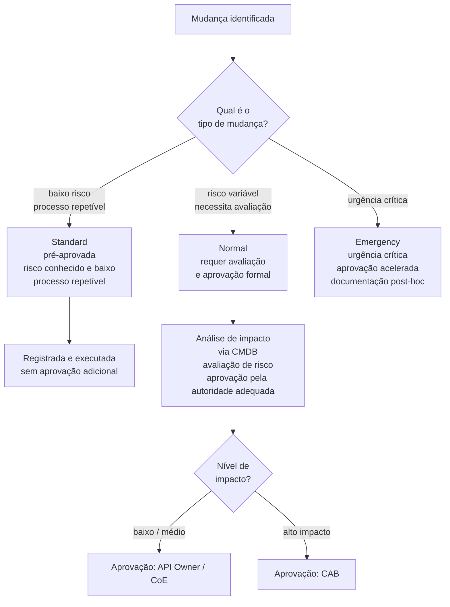
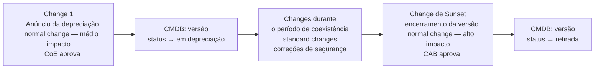
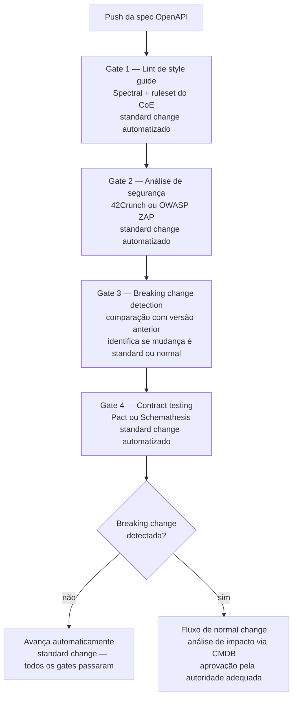

# Módulo 4 · ITIL e APIs
## Capítulo 4.4 · Change Enablement para APIs

> **Série:** Gerenciamento e Governança de APIs
> **Nível:** Operacional
> **Pré-requisito:** Cap 2.5 · Cap 2.6 · Cap 4.3 · Configuration Management e CMDB

---

## Sumário

- [4.4.1 · Change Enablement como prática — o que mudou do ITIL v3](#441--change-enablement-como-prática--o-que-mudou-do-itil-v3)
- [4.4.2 · A hierarquia de mudanças — standard, normal e emergency](#442--a-hierarquia-de-mudanças--standard-normal-e-emergency)
- [4.4.3 · APIs e a classificação de mudanças](#443--apis-e-a-classificação-de-mudanças)
- [4.4.4 · O Change Advisory Board e APIs](#444--o-change-advisory-board-e-apis)
- [4.4.5 · Breaking changes como mudanças planejadas](#445--breaking-changes-como-mudanças-planejadas)
- [4.4.6 · Depreciação como fluxo de change enablement](#446--depreciação-como-fluxo-de-change-enablement)
- [4.4.7 · Gates de governança no pipeline como change management automatizado](#447--gates-de-governança-no-pipeline-como-change-management-automatizado)

---

## 4.4.1 · Change Enablement como prática — o que mudou do ITIL v3

No ITIL v3, a prática equivalente se chamava Change Management — e sua reputação era de processo burocrático que atrasava entregas sem agregar valor proporcional. Times de desenvolvimento encontravam formas de contorná-lo. Janelas de mudança eram longas e imprecisas. O Change Advisory Board se reunia semanalmente para aprovar mudanças que deveriam ter sido aprovadas automaticamente.

O ITIL 4 renomeou a prática para Change Enablement — e a mudança de nome não é cosmética. Ela reflete uma mudança de propósito: a prática não existe para controlar mudanças, mas para habilitar que mudanças aconteçam com velocidade e segurança adequadas ao seu risco. A burocracia que caracterizava o Change Management do ITIL v3 não é uma consequência inevitável de ter uma prática formal de gestão de mudanças — é uma consequência de ter uma prática mal calibrada que trata todas as mudanças com o mesmo nível de controle.

> *Axelos. ITIL Foundation: ITIL 4 Edition. The Stationery Office, 2019. Disponível em: [axelos.com/certifications/itil-service-management](https://www.axelos.com/certifications/itil-service-management)*

O princípio orientador é o mesmo que identificamos no Cap 4.1 — Keep it Simple and Practical. O controle de uma mudança deve ser proporcional ao risco que ela representa. Mudanças de baixo risco devem ter processos leves. Mudanças de alto risco merecem avaliação rigorosa.

---

### A conexão essencial com Configuration Management

O Change Enablement só funciona com qualidade quando o Configuration Management do Cap 4.3 está funcionando. Um Change Record precisa referenciar quais ICs são afetados pela mudança — e essa referência exige que os ICs e seus relacionamentos existam no CMDB.

Sem configuration management maduro, change enablement opera no escuro: aprova mudanças sem saber o que elas afetam, sem visibilidade do impacto real e sem capacidade de identificar conflitos entre mudanças que afetam os mesmos componentes.

---

## 4.4.2 · A hierarquia de mudanças — standard, normal e emergency

O ITIL 4 define três tipos de mudança que merecem processos distintos — não por tradição, mas porque têm características de risco e urgência fundamentalmente diferentes.

---

### Standard Change

Uma mudança standard é pré-aprovada. O processo de avaliação e aprovação aconteceu uma vez — quando a mudança foi classificada como standard — e não precisa acontecer novamente para cada instância.

O que qualifica uma mudança como standard: risco bem compreendido e consistentemente baixo, processo de implementação documentado e repetível, resultado previsível, reversão clara e testada.

A pré-aprovação não significa ausência de controle. Significa que o controle foi exercido no design da mudança e no processo que a governa — não na aprovação individual de cada instância. O registro de cada execução ainda acontece — para rastreabilidade e para alimentar a análise de padrões.

---

### Normal Change

Uma mudança normal requer avaliação e aprovação antes de ser implementada. O processo inclui: análise de impacto com base nos ICs afetados no CMDB, avaliação de risco, aprovação pela autoridade adequada e planejamento de implementação e reversão.

A autoridade de aprovação varia com o impacto: mudanças de baixo impacto podem ser aprovadas pelo API Owner ou pelo CoE. Mudanças de médio e alto impacto podem exigir o Change Advisory Board. A escala de aprovação deve ser definida nas políticas de governança — não decidida ad hoc para cada mudança.

---

### Emergency Change

Uma mudança emergency precisa ser implementada urgentemente para resolver um incidente crítico ou prevenir um risco iminente. O processo é acelerado — a aprovação normal é substituída por uma autoridade de emergência designada — mas não é eliminado. A documentação e a revisão post-hoc são obrigatórias.

Emergency changes não são uma válvula de escape para evitar o processo normal. São reservadas para situações onde o risco de não implementar imediatamente excede o risco de implementar sem o processo completo. O padrão de emergency changes é um indicador de saúde do programa — organizações que as usam com frequência elevada têm um problema de planejamento, não apenas de operações.

---

## 4.4.3 · APIs e a classificação de mudanças

Aplicar a hierarquia de mudanças ao contexto de APIs exige mapeamento entre os tipos de mudança de API — que o Módulo 2 classificou em detalhe — e os tipos de mudança do ITIL 4.

---

### O que são standard changes para APIs

Standard changes para APIs têm risco bem compreendido, processo repetível e resultado previsível. Exemplos típicos:

- Atualização de documentação sem mudança de contrato
- Correção de descrições na spec OpenAPI sem mudança de comportamento
- Adição de campos opcionais com valor default que não afeta consumidores existentes
- Rotação de certificados TLS dentro do processo padrão estabelecido
- Atualização de dependências de patch version sem mudança de API pública
- Deploy de correção de bug que não altera comportamento de contrato

Essas mudanças seguem um processo definido, são registradas no CMDB e no log de mudanças, mas não exigem aprovação individual a cada execução.

---

### O que são normal changes para APIs

Normal changes exigem análise de impacto e aprovação. A maioria das mudanças que evoluem o comportamento de uma API se enquadra aqui:

- Adição de nova operação à API — baixo impacto, aprovação pelo API Owner
- Mudança de comportamento de uma operação existente dentro do contrato — médio impacto, aprovação pelo CoE
- Breaking change — alto impacto, aprovação pelo CAB ou instância executiva
- Mudança de política de autenticação ou autorização — médio a alto impacto
- Mudança na estrutura de erros — médio impacto
- Depreciação de uma versão — alto impacto quando há consumidores externos

A escala de aprovação é proporcional ao impacto — determinado pela análise dos ICs afetados no CMDB e pelo número e criticidade dos consumidores identificados.

---

### O que são emergency changes para APIs

Emergency changes para APIs são raras em contexto de produto — mais comuns em resposta a incidentes críticos:

- Patch de vulnerabilidade de segurança crítica que exige mudança de contrato imediata
- Correção de comportamento que está causando perda de dados ou falha em cascata
- Resposta a incidente de segurança que exige revogação de credenciais ou mudança de autenticação

---

### A classificação como decisão de configuração

Assim como a granularidade do CMDB foi definida como decisão de configuração por domínio no Cap 4.3, a classificação de tipos de mudança para APIs deve ser definida nas políticas de governança — não avaliada caso a caso.

O CoE mantém um catálogo de tipos de mudança com sua classificação padrão: "adição de campo opcional — standard", "breaking change — normal de alto impacto", "patch de segurança crítica — emergency". Times consultam o catálogo para saber qual processo seguir — sem precisar fazer uma avaliação de risco do zero para cada mudança.

Mudanças que não se encaixam em nenhuma categoria existente são tratadas como normal change até que o CoE as categorize formalmente.

---

## 4.4.4 · O Change Advisory Board e APIs

O Change Advisory Board — CAB — é o corpo que avalia e aprova mudanças de maior impacto. No contexto de APIs, a questão de quando o CAB precisa ser envolvido é uma das mais importantes de calibração do processo.

---

### O anti-padrão: CAB para tudo

O CAB foi o alvo mais frequente das críticas ao Change Management do ITIL v3. Reuniões semanais onde centenas de mudanças eram apresentadas e aprovadas em massa, sem análise real de cada uma. Quando todas as mudanças passam pelo CAB, o CAB não tem capacidade de analisar adequadamente nenhuma delas. O resultado é aprovação em massa — que é o equivalente funcional de não ter aprovação.

---

### O modelo correto: CAB para mudanças de alto impacto

O CAB é reservado para mudanças que justificam análise aprofundada. Para APIs, isso tipicamente inclui:

- Breaking changes em APIs com consumidores externos ou de parceiros
- Mudanças que afetam múltiplas APIs simultaneamente
- Mudanças com implicações regulatórias — alterações em APIs que expõem dados pessoais ou financeiros
- Depreciações de APIs com alto volume de consumidores

Para todas as demais mudanças, a aprovação é delegada ao API Owner, ao CoE ou é pré-aprovada como standard change.

---

### A composição do CAB para APIs

Em organizações com programa de APIs maduro, pode haver um CAB específico para APIs — ou um comitê de change enablement do CoE — com composição adequada:

- Representante do CoE com conhecimento de arquitetura e políticas
- Representante de segurança e compliance
- Representante dos domínios mais afetados pela mudança
- Representante de parceiros quando mudanças afetam APIs de parceiros

---

## 4.4.5 · Breaking changes como mudanças planejadas

No Cap 2.5 tratamos breaking changes do ponto de vista técnico. Aqui a perspectiva muda: breaking changes são mudanças planejadas de alto impacto que precisam de todo o rigor do processo de change enablement.

---

### O Change Record de uma breaking change

Um Change Record de breaking change em uma API pública ou de parceiros contém:

**Escopo do impacto** — quais consumidores são afetados, identificados via CMDB. Volume de tráfego atual na versão afetada. Criticidade de cada consumidor.

**Justificativa técnica** — por que a mudança é necessária e por que não pode ser feita de forma não-breaking. Alternativas consideradas e descartadas.

**Plano de migração** — como cada consumidor afetado deve migrar. A nova versão disponível, as diferenças e como a migração é feita.

**Cronograma** — data de anúncio, período de coexistência de versões, data de sunset da versão anterior. Compatível com as políticas de depreciação do Cap 2.6 e com os contratos de parceiros do Cap 3.6.

**Plano de reversão** — como desfazer a mudança se o impacto for maior do que o esperado.

---

### A relação entre breaking change e nova versão

Uma breaking change quase sempre implica a criação de uma nova versão major da API. O Change Record inclui dois conjuntos de mudanças no CMDB:

**A nova versão** — criação de um novo IC de versão, com nova spec, novos endpoints de gateway, novo SLA se aplicável.

**A versão anterior** — mudança de status para "em depreciação", com data de sunset definida e plano de depreciação ativo.

Ambas as mudanças precisam de seus próprios itens no Change Record — porque afetam ICs distintos com processos subsequentes distintos.

---

## 4.4.6 · Depreciação como fluxo de change enablement

O processo de depreciação do Cap 2.6 é, do ponto de vista do ITIL 4, um fluxo de change enablement de longa duração. Não é uma mudança única — é uma sequência de mudanças planejadas que se desdobra ao longo de meses.

---

### As mudanças que compõem um processo de depreciação

**Change 1 — Anúncio da depreciação**
Mudança de status da versão no CMDB de "ativa" para "em depreciação". Adição de headers de depreciação no gateway. Atualização da documentação. Notificação aos consumidores identificados via CMDB. Normal change de médio impacto — exige aprovação do CoE e, quando há consumidores de parceiros, verificação de conformidade com os contratos do Cap 3.6.

**Changes durante o período de coexistência**
Correções de segurança na versão depreciada — que ainda precisa ser mantida operacional durante a transição. Standard changes dentro do processo estabelecido.

**Change de Sunset**
O encerramento da versão depreciada — remoção dos endpoints do gateway, mudança de status no CMDB para "retirada". Normal change de alto impacto que exige confirmação de migração de consumidores e aprovação pelo CAB quando há consumidores externos.

---

### Por que modelar depreciação como fluxo de change enablement importa

**Visibilidade organizacional** — depreciações aparecem no backlog de mudanças da organização, não apenas no roadmap de produto. Stakeholders de operações, segurança e compliance têm visibilidade e podem levantar impedimentos antes que se tornem problemas.

**Rastreabilidade** — cada etapa tem um Change Record com data, aprovador e justificativa. Em mercados regulados, essa trilha de auditoria pode ser necessária para demonstrar que a descontinuação foi conduzida de forma responsável.

**Coordenação** — o CAB pode identificar conflitos entre uma depreciação planejada e outras mudanças em andamento que afetam os mesmos consumidores ou infraestrutura.

---

## 4.4.7 · Gates de governança no pipeline como change management automatizado

Um dos argumentos centrais do Módulo 4 é que ITIL 4 e práticas de desenvolvimento moderno não são incompatíveis — quando bem calibrados, se complementam. O exemplo mais concreto dessa complementaridade é a relação entre gates de governança no pipeline de CI/CD e o processo de change enablement.

---

### O que gates de pipeline são do ponto de vista do ITIL 4

Um gate de pipeline que verifica a spec OpenAPI contra o style guide antes do merge é, do ponto de vista do ITIL 4, um mecanismo de standard change automatizado. A avaliação de risco aconteceu uma vez — quando o ruleset do Spectral foi definido pelo CoE. A execução acontece automaticamente para cada push, sem intervenção humana.

A diferença entre aprovação manual e gate automatizado não é que um é mais rigoroso. É que o gate automatizado aplica o mesmo critério de forma consistente, em segundos, para qualquer volume. O processo manual aplica critérios que podem variar dependendo de quem avalia, em horas ou dias, com capacidade limitada.

---

### A hierarquia de automação no pipeline

Os primeiros gates — lint, segurança, contract testing — são mecanismos de standard change. Executam critérios pré-definidos pelo CoE de forma automática. Uma spec que passa por todos eles sem breaking change detectada tem um caminho de standard change para produção.

Quando uma breaking change é detectada, o pipeline sinaliza que essa mudança requer o fluxo de normal change — com análise de impacto via CMDB, comunicação aos consumidores e aprovação pela autoridade adequada.

---

### A maturidade progressiva dos gates

O Cap 2.1.8 descreveu a progressão de maturidade dos gates de governança. Do ponto de vista do ITIL 4, essa progressão é uma evolução de maturidade de change enablement:

**Maturidade 1** — todas as mudanças são normal changes manuais. Alta rastreabilidade, baixa velocidade.

**Maturidade 2** — mudanças de baixo risco são standard changes com processo documentado. Velocidade maior para o volume, rigor mantido para mudanças de alto risco.

**Maturidade 3** — standard changes são automatizadas via pipeline. Velocidade máxima para o volume, rastreabilidade mantida via registros automáticos no CMDB, rigor do processo normal para mudanças que exigem análise.

A automação não reduz o controle — redistribui onde ele acontece. O controle de uma standard change automatizada está no design do ruleset e no processo de change management do próprio ruleset — não na aprovação de cada execução individual.

---

## Pontos-chave do capítulo

- Change Enablement substituiu Change Management no ITIL 4 com mudança de propósito: habilitar mudanças com velocidade e segurança proporcionais ao risco, não controlar todas as mudanças com o mesmo rigor
- A hierarquia de mudanças — standard, normal, emergency — calibra o processo ao risco. A classificação de tipos de mudança para APIs é definida nas políticas de governança, não avaliada caso a caso
- O CAB é reservado para mudanças de alto impacto: breaking changes com consumidores externos, mudanças com implicações regulatórias e depreciações de APIs críticas. CAB para tudo é o anti-padrão que gerou a reputação negativa do Change Management do ITIL v3
- Breaking changes são normal changes de alto impacto — com Change Record que inclui escopo do impacto via CMDB, justificativa técnica, plano de migração, cronograma e plano de reversão
- Depreciação é um fluxo de change enablement de longa duração — uma sequência de mudanças planejadas com Change Records distintos para anúncio, manutenção durante coexistência e sunset
- Gates de governança no pipeline de CI/CD são mecanismos de standard change automatizado. A automação redistribui onde o controle acontece — do processo de aprovação individual para o design do ruleset
- A maturidade de change enablement evolui do manual ao automatizado — com velocidade crescente para o volume e rigor mantido para as mudanças que exigem análise humana

---

## Fontes e referências

| Fonte | Referência completa |
|---|---|
| **ITIL 4 Foundation (2019)** | Axelos. *ITIL Foundation: ITIL 4 Edition*. The Stationery Office, 2019. Disponível em: [axelos.com/certifications/itil-service-management](https://www.axelos.com/certifications/itil-service-management) |

---

## Próximo capítulo

**4.5 · Service Catalog e SLM para APIs** — a relação entre o catálogo de serviços do ITIL 4 e o catálogo de APIs do Cap 3.5, Service Level Management e como SLAs de APIs se encaixam no SLM corporativo, e a diferença entre SLA técnico e SLA de serviço.

---

*Série: Gerenciamento e Governança de APIs · Módulo 4 · Capítulo 4.4*