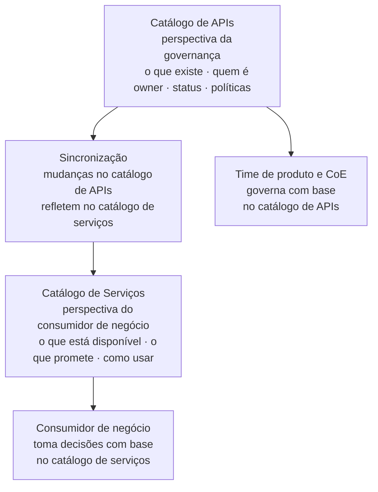
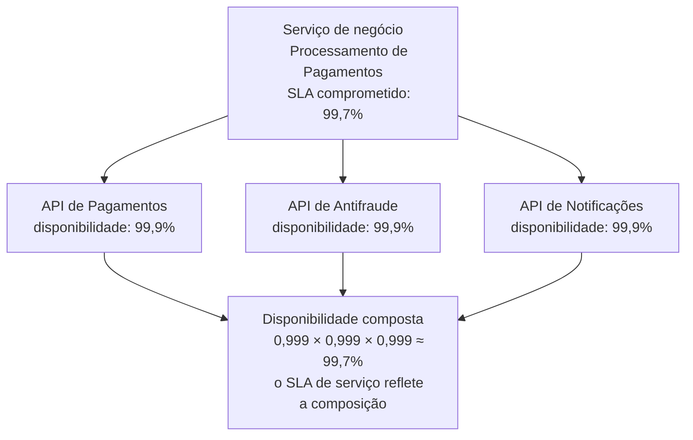
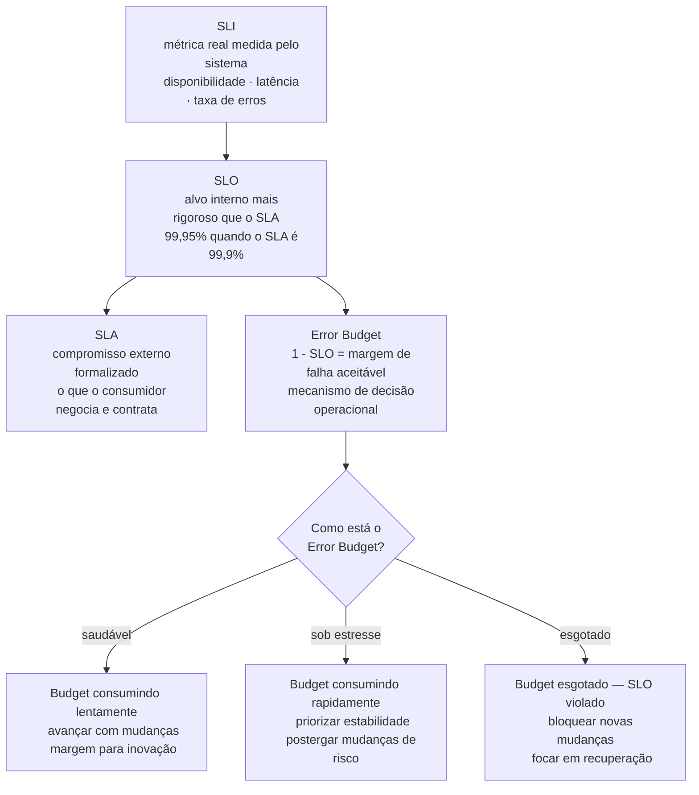

# Módulo 4 · ITIL e APIs
## Capítulo 4.5 · Service Catalog e SLM para APIs

> **Série:** Gerenciamento e Governança de APIs
> **Nível:** Estratégico e operacional
> **Pré-requisito:** Cap 3.5 · Cap 3.6 · Cap 4.3 · Cap 4.4

---

## Sumário

- [4.5.1 · Catálogo de serviços vs. catálogo de APIs — duas perspectivas complementares](#451--catálogo-de-serviços-vs-catálogo-de-apis--duas-perspectivas-complementares)
- [4.5.2 · O que compõe um item do catálogo de serviços de APIs](#452--o-que-compõe-um-item-do-catálogo-de-serviços-de-apis)
- [4.5.3 · Service Level Management — o que é e como se aplica a APIs](#453--service-level-management--o-que-é-e-como-se-aplica-a-apis)
- [4.5.4 · A distinção entre SLA técnico e SLA de serviço](#454--a-distinção-entre-sla-técnico-e-sla-de-serviço)
- [4.5.5 · SLI, SLO, SLA e Error Budget — a hierarquia de níveis de serviço](#455--sli-slo-sla-e-error-budget--a-hierarquia-de-níveis-de-serviço)
- [4.5.6 · SLM e parceiros — a complexidade bilateral](#456--slm-e-parceiros--a-complexidade-bilateral)
- [4.5.7 · Catálogo de serviços e descoberta — a perspectiva ITIL 4](#457--catálogo-de-serviços-e-descoberta--a-perspectiva-itil-4)

---

## 4.5.1 · Catálogo de serviços vs. catálogo de APIs — duas perspectivas complementares

O catálogo de APIs que construímos no Cap 3.5 e o catálogo de serviços do ITIL 4 não são a mesma coisa. São duas perspectivas complementares do mesmo portfólio — e a confusão entre elas é uma das causas mais comuns de desalinhamento entre times de produto e gestão de serviços de TI.

---

### O catálogo de serviços — a perspectiva do consumidor

O catálogo de serviços do ITIL 4 é a visão do consumidor de negócio — o que está disponível, o que promete entregar e sob quais condições. Um item do catálogo de serviços responde às perguntas que um consumidor de negócio faz antes de tomar uma decisão de integração: o que este serviço faz para o meu negócio? Qual é o nível de serviço garantido? Como me onboardo? O que acontece quando algo falha?

O catálogo de serviços não é técnico — é um documento de produto. Seu vocabulário é de negócio, não de engenharia.

### O catálogo de APIs — a perspectiva da governança

O catálogo de APIs do Cap 3.5 é a visão técnica e de governança — o que existe, quem é o owner, qual é o status no ciclo de vida, quais políticas se aplicam, quais consumidores estão registrados. Seu vocabulário é técnico e organizacional.

O catálogo de APIs existe para que o CoE governe o portfólio. O catálogo de serviços existe para que consumidores descubram e usem o que o portfólio oferece.

---

### Por que precisam estar sincronizados

Um serviço no catálogo de serviços é sustentado por uma ou mais APIs no catálogo de APIs. Quando uma API muda de status — entra em depreciação, tem seu SLA degradado, tem uma breaking change planejada — essa mudança precisa se refletir no catálogo de serviços para que os consumidores de negócio tenham informação precisa.

Sem sincronização, o catálogo de serviços envelhece e perde confiança. Consumidores descobrem que o serviço que contrataram tem condições diferentes das que o catálogo prometia.



---

## 4.5.2 · O que compõe um item do catálogo de serviços de APIs

Um item do catálogo de serviços de APIs raramente é uma API individual. É tipicamente uma **capacidade de negócio** — composta por uma ou mais APIs que juntas entregam um resultado de negócio específico.

---

### A distinção entre capacidade e API

"Processamento de Pagamentos" é uma capacidade de negócio. Por baixo dela podem existir múltiplas APIs: a API de pagamentos que executa a transação, a API de antifraude que valida antes do processamento, a API de notificações que informa o resultado ao consumidor. Do ponto de vista do consumidor de negócio, ele contrata "Processamento de Pagamentos" — não três APIs separadas.

Essa distinção é importante para SLM: o SLA que o consumidor de negócio negocia é o SLA da capacidade — não o SLA de cada API individualmente. A capacidade de entregar esse SLA depende da composição dos SLAs das APIs que a sustentam.

---

### O que um item do catálogo de serviços deve conter

**Descrição de negócio** — o que a capacidade faz em linguagem de negócio. Orientada a casos de uso reais do consumidor.

**Condições de uso** — quem pode usar, em qual contexto, com quais restrições. A classificação do Cap 3.5 — privada, parceiro, pública — se traduz em condições de acesso.

**SLA comprometido** — disponibilidade, latência e throughput garantidos. Em linguagem que o consumidor de negócio entende — não apenas percentuais técnicos, mas o que significam em termos de impacto na operação do consumidor.

**Processo de onboarding** — como o consumidor se credencia, quanto tempo leva, quais informações precisa fornecer.

**Suporte e escalação** — como reportar problemas, quais são os canais e quais são os SLAs de resposta ao suporte.

**Roadmap público** — o que está planejado para a capacidade. Mudanças relevantes anunciadas com antecedência. Depreciações planejadas com prazos claros.

**Componentes técnicos** — ligação ao catálogo de APIs com as APIs que compõem a capacidade. Essa ligação é o que o service mapping do Cap 4.3 habilita.

---

## 4.5.3 · Service Level Management — o que é e como se aplica a APIs

Service Level Management — SLM — é a prática do ITIL 4 responsável por estabelecer metas claras de nível de serviço e garantir que os serviços entregues atendem a essas metas. Não é apenas o documento de SLA — é o processo contínuo de negociação, monitoramento e revisão dos níveis de serviço ao longo do tempo.

---

### Os três elementos do SLM

**Negociação e acordo** — o processo pelo qual consumidores e provedores chegam a um acordo sobre o que o serviço vai entregar. Para APIs, inclui disponibilidade, latência, throughput e suporte. Para APIs de parceiros, inclui obrigações bilaterais do Cap 3.6.

**Monitoramento e reporte** — a verificação contínua de que o serviço está entregando o que foi acordado. O plano de observabilidade do Cap 3.8 é o mecanismo de monitoramento. Os dashboards de SLA que o catálogo expõe são o mecanismo de reporte.

**Revisão e melhoria** — a análise periódica de como o serviço está performando em relação ao SLA, identificação de tendências e ações corretivas. É a dimensão de melhoria contínua — a prática que fecha o ciclo EDM do Cap 3.1.

---

### A distinção entre SLA e OLA

O ITIL 4 distingue dois tipos de acordo de nível de serviço:

**SLA — Service Level Agreement** — o acordo com o consumidor externo. Define o que a organização se compromete a entregar.

**OLA — Operational Level Agreement** — o acordo interno entre times da organização. Define o que cada time interno precisa entregar para que o SLA externo seja cumprido.

No contexto de APIs, o SLA da capacidade "Processamento de Pagamentos" é um SLA. Os acordos entre o time de API, o time de backend, o time de infraestrutura e o time de antifraude são OLAs. A cadeia de OLAs precisa ser mais rigorosa do que o SLA — caso contrário, o SLA não pode ser cumprido de forma sustentável.

---

## 4.5.4 · A distinção entre SLA técnico e SLA de serviço

Um SLA técnico de uma API define as métricas de performance do componente — disponibilidade do endpoint, latência das respostas, throughput suportado. Um SLA de serviço define o que o consumidor de negócio pode esperar da capacidade como um todo.

A diferença parece sutil mas tem implicações profundas — especialmente quando a capacidade é composta por múltiplas APIs e serviços.

---

### A matemática da composição de SLAs

Quando um serviço de negócio depende de múltiplos componentes em série — todos precisam funcionar para que o serviço funcione — a disponibilidade composta é o produto das disponibilidades individuais.

Um serviço que depende de três APIs com 99,9% de disponibilidade cada não tem disponibilidade de 99,9%. Tem disponibilidade aproximada de:

```
0,999 × 0,999 × 0,999 = 0,997 ≈ 99,7%
```

Essa diferença de 0,2 pontos percentuais representa aproximadamente 17,5 horas de indisponibilidade adicional por ano — determinante para consumidores com requisitos rigorosos de continuidade.

O princípio é direto: **o nível de serviço de uma capacidade composta é limitado pelo seu componente mais fraco**. Não importa que a maioria dos componentes tenha SLA excelente — um componente com SLA inferior degrada o serviço como um todo.



---

### Implicações para o design de SLAs

**O SLA de serviço deve ser derivado — não arbitrado** — o SLA que a organização promete ao consumidor de negócio precisa ser calculado a partir dos SLAs técnicos dos componentes. Prometer 99,9% para uma capacidade sustentada por componentes que matematicamente só permitem 99,7% é um compromisso que não pode ser cumprido de forma sustentável.

**O service mapping do Cap 4.3 é prerequisito** — sem conhecer quais componentes sustentam uma capacidade, não é possível calcular o SLA composto. O service mapping não é apenas uma prática de configuration management — é um input direto para as decisões de SLM.

**Melhorar o componente mais fraco tem mais impacto** — se um dos três componentes tem 99,5% de disponibilidade enquanto os outros têm 99,9%, melhorar o componente mais fraco para 99,9% produz mais ganho no SLA composto do que qualquer melhoria nos componentes já fortes.

---

## 4.5.5 · SLI, SLO, SLA e Error Budget — a hierarquia de níveis de serviço

A prática de SLM do ITIL 4 converge com a cultura SRE — Site Reliability Engineering — em uma hierarquia de conceitos que transforma o gerenciamento de níveis de serviço de uma atividade periódica de reporte em um mecanismo contínuo de decisão operacional.

---

### SLI — Service Level Indicator

O SLI é a métrica real que está sendo medida. É o dado bruto que o sistema de observabilidade coleta — o que está realmente acontecendo, sem julgamento sobre se é bom ou ruim.

Para APIs, SLIs típicos incluem: disponibilidade (percentual de requisições com resposta bem-sucedida), latência no percentil 95 ou 99, taxa de erros (percentual de requisições com resposta de erro), throughput (requisições por segundo processadas com sucesso).

A qualidade de um SLI é medida por sua relevância para a experiência do consumidor: um SLI que o consumidor não percebe como indicador de qualidade não é um bom SLI. A pergunta orientadora é: se este indicador degradar, o consumidor sente?

---

### SLO — Service Level Objective

O SLO é o alvo interno que a organização se propõe a atingir. É mais rigoroso do que o SLA — a organização se compromete internamente com um nível superior ao que promete externamente. Essa margem existe para absorver variações naturais sem violar o compromisso externo.

Se o SLA externo para disponibilidade é 99,9%, o SLO interno pode ser 99,95%. Isso significa que a operação deve ser gerenciada para atingir 99,95% — e somente quando esse objetivo não for atingido é que o SLA externo está em risco.

O SLO é um mecanismo de proteção: ele cria um buffer entre a operação real e o compromisso externo. Operações gerenciadas apenas pelo SLA externo chegam ao limite sem margem de reação.

---

### Error Budget

O Error Budget é o corolário direto do SLO: se o SLO de disponibilidade é 99,95% em um período de 30 dias, o error budget é 0,05% desse período — aproximadamente 21,6 minutos de indisponibilidade aceitável.

O Error Budget transforma o SLO de uma meta estática em um mecanismo de decisão operacional:

**Quando o Error Budget está sendo consumido lentamente** — a operação está saudável. Há margem para avançar com mudanças mais arriscadas, experimentos e melhorias que podem causar instabilidade temporária.

**Quando o Error Budget está sendo consumido rapidamente** — a operação está sob estresse. A prioridade deve ser estabilidade. Novas funcionalidades e mudanças de risco são postergadas até que o budget se recupere.

**Quando o Error Budget foi totalmente consumido** — o SLO foi violado. Novas mudanças são bloqueadas até que o serviço se estabilize e o budget se recupere no próximo período.



---

### A conexão com Change Enablement

A hierarquia SLI/SLO/SLA/Error Budget tem uma conexão direta com o Change Enablement do Cap 4.4: o estado do Error Budget é um critério de decisão para o processo de change enablement.

Uma mudança normal que seria aprovada em condições normais pode ser postergada quando o Error Budget está crítico — não porque a mudança é ruim, mas porque a operação não tem margem para absorver instabilidade adicional. Esse é um critério objetivo e transparente que remove o julgamento subjetivo do processo de aprovação de mudanças.

---

### A conexão com o SLA composto

Cada componente de uma capacidade tem seu próprio conjunto de SLI, SLO e Error Budget. O SLA de serviço é derivado da composição dos SLOs individuais — não dos SLAs. Isso significa que o buffer entre operação real e compromisso externo precisa existir em todos os componentes para que o serviço tenha margem de operação sustentável.

Um componente gerenciado apenas pelo SLA externo — sem SLO mais rigoroso — não tem buffer. Quando viola seu SLA, viola imediatamente o SLA do serviço. Introduzir SLOs em todos os componentes críticos é uma medida de proteção sistêmica.

---

## 4.5.6 · SLM e parceiros — a complexidade bilateral

O SLM com parceiros tem características que o SLM interno não tem — porque a relação é bilateral, contratual e com consequências comerciais quando SLAs são violados.

---

### SLAs negociados vs. SLAs definidos unilateralmente

Para APIs internas, o SLA é definido pelo time produtor e aceito pelos consumidores — há assimetria de poder. Para APIs de parceiros, como estabelecemos no Cap 3.6, o SLA é negociado. Um parceiro estratégico pode ter requisitos específicos que diferem do SLA padrão — maior disponibilidade, latência máxima menor, janelas de manutenção que excluem seus horários críticos.

O SLM para parceiros precisa gerenciar essa heterogeneidade: múltiplos parceiros com SLAs diferentes para a mesma capacidade. O catálogo de serviços mostra o SLA padrão; os contratos individuais definem os SLAs negociados.

---

### Monitoramento diferenciado para parceiros

Quando um SLA de parceiro é violado — mesmo que o SLA padrão não tenha sido — o processo de SLM precisa detectar e responder. Isso exige que o sistema de monitoramento avalie o SLA de cada parceiro individualmente, não apenas o SLA médio do portfólio.

O plano de observabilidade do Cap 3.8 precisa estar configurado para métricas por consumidor. Um parceiro com SLA de 99,95% que recebe 99,9% de disponibilidade está em violação de contrato — mesmo que a média geral do serviço seja 99,95%.

---

### Revisão periódica com parceiros

O SLM maduro inclui revisões periódicas de SLA com parceiros estratégicos — não apenas reporte de conformidade, mas análise conjunta de tendências, discussão de melhorias e renegociação de condições quando o contexto mudou.

Essas revisões são parte do processo de co-evolução do Cap 3.6.5 aplicado à dimensão operacional. Um parceiro que vê seus SLAs sendo cumpridos e que participa de discussões sobre melhorias tem uma relação muito mais robusta com a organização do que um parceiro que recebe apenas um relatório mensal de conformidade.

---

## 4.5.7 · Catálogo de serviços e descoberta — a perspectiva ITIL 4

O ITIL 4 trata a descoberta de serviços como parte da prática de Service Request Management — o processo pelo qual consumidores identificam o que precisam, entendem o que está disponível e iniciam o processo de acesso.

---

### A perspectiva ITIL 4 sobre descoberta

No vocabulário do ITIL 4, o catálogo de serviços é o mecanismo primário de descoberta. Serve ao consumidor como ponto de entrada para entender o que a organização oferece — antes de qualquer interação com os times técnicos.

A qualidade do catálogo de serviços como ferramenta de descoberta é medida pela sua capacidade de responder às perguntas que consumidores fazem no início da jornada de integração: existe algo que faz X? Qual é a diferença entre A e B? Posso usar isso para o meu caso de uso específico?

A conexão com o Cap 3.5 é direta: o portal de desenvolvedores é a interface do catálogo de serviços para desenvolvedores. O catálogo de APIs é o backend que alimenta o portal. O Service Request Management do ITIL 4 é o processo que governa o que acontece quando um consumidor encontra o que precisa e quer começar a usar.

---

### A descoberta do prisma da governança — o problema das Shadow APIs

O Cap 3.5 tratou descoberta do prisma do consumidor. Há um segundo prisma igualmente importante — o prisma da governança: garantir que o CoE conhece todas as APIs que existem na organização, incluindo as criadas fora do processo de governança.

Shadow APIs — endpoints em produção sem owner registrado, sem revisão de segurança, sem catálogo — são ao mesmo tempo um risco de segurança e uma evidência de falha de governança. As técnicas de descoberta ativa que endereçam esse problema merecem tratamento próprio, desenvolvido com profundidade no **Cap 4.8 · Descoberta de APIs — os dois prismas**.

---

## Pontos-chave do capítulo

- O catálogo de serviços do ITIL 4 e o catálogo de APIs do Cap 3.5 são perspectivas complementares — um orientado ao consumidor de negócio, outro à governança técnica. Precisam estar sincronizados para que o portfólio seja gerenciável e confiável
- Um item do catálogo de serviços tipicamente representa uma capacidade de negócio composta por múltiplas APIs. O SLA da capacidade é derivado da composição dos SLAs dos componentes
- SLM é um processo contínuo de negociação, monitoramento e revisão — não apenas um documento de SLA. OLAs internos precisam ser mais rigorosos do que o SLA externo para que o compromisso seja sustentável
- A disponibilidade composta de um serviço é o produto das disponibilidades de seus componentes. O nível de serviço é limitado pelo componente mais fraco — e o service mapping do Cap 4.3 é o prerequisito para calcular essa composição
- A hierarquia SLI → SLO → SLA → Error Budget transforma SLM de reporte periódico em mecanismo contínuo de decisão operacional. O estado do Error Budget é critério de decisão para change enablement — conectando as práticas de forma sistêmica
- SLM com parceiros exige monitoramento diferenciado por consumidor. Um parceiro com SLA negociado mais rigoroso está em violação de contrato quando o SLA padrão ainda está sendo cumprido
- A descoberta do prisma da governança — shadow APIs, descoberta ativa do portfólio real — é tratada com profundidade no Cap 4.8

---

## Fontes e referências

| Fonte | Referência completa |
|---|---|
| **ITIL 4 Foundation (2019)** | Axelos. *ITIL Foundation: ITIL 4 Edition*. The Stationery Office, 2019. Disponível em: [axelos.com/certifications/itil-service-management](https://www.axelos.com/certifications/itil-service-management) |

---

## Próximo capítulo

**4.6 · Incident, Problem e Continual Improvement para APIs** — como as práticas de gestão de incidentes, gestão de problemas e melhoria contínua do ITIL 4 se aplicam especificamente ao contexto de APIs e como se conectam com as práticas construídas nos módulos anteriores.

---

*Série: Gerenciamento e Governança de APIs · Módulo 4 · Capítulo 4.5*