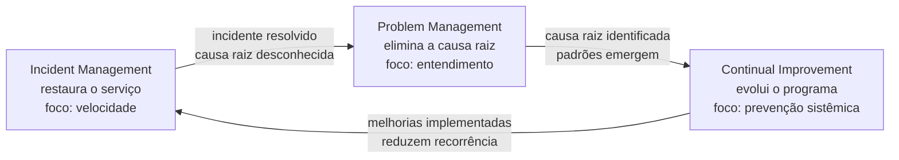
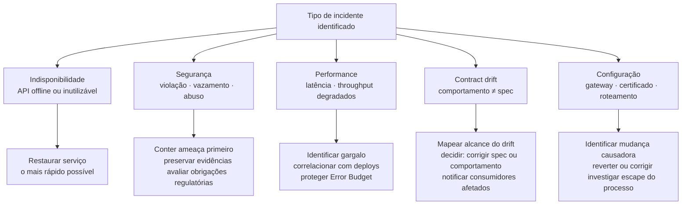

# Módulo 4 · ITIL e APIs
## Capítulo 4.6 · Incident, Problem e Continual Improvement para APIs

> **Série:** Gerenciamento e Governança de APIs
> **Nível:** Operacional
> **Pré-requisito:** Cap 3.8 · Cap 4.3 · Cap 4.4 · Cap 4.5

---

## Sumário

- [4.6.1 · As três práticas como ciclo de aprendizado](#461--as-três-práticas-como-ciclo-de-aprendizado)
- [4.6.2 · Monitoramento e detecção — a condição para incident management eficaz](#462--monitoramento-e-detecção--a-condição-para-incident-management-eficaz)
- [4.6.3 · Incident Management para APIs — processo e classificação de severidade](#463--incident-management-para-apis--processo-e-classificação-de-severidade)
- [4.6.4 · Tipos de incidente em APIs — processos distintos para problemas distintos](#464--tipos-de-incidente-em-apis--processos-distintos-para-problemas-distintos)
- [4.6.5 · Problem Management — causa raiz, técnicas de análise e known errors](#465--problem-management--causa-raiz-técnicas-de-análise-e-known-errors)
- [4.6.6 · O post-mortem como artefato de aprendizado](#466--o-post-mortem-como-artefato-de-aprendizado)
- [4.6.7 · Continual Improvement para o programa de APIs](#467--continual-improvement-para-o-programa-de-apis)
- [4.6.8 · O ciclo completo — de incidente a melhoria sistêmica](#468--o-ciclo-completo--de-incidente-a-melhoria-sistêmica)
- [Fontes e referências](#fontes-e-referências)

---

## 4.6.1 · As três práticas como ciclo de aprendizado

Incident Management, Problem Management e Continual Improvement são frequentemente tratadas como práticas independentes — processos separados com responsáveis diferentes e cadências distintas. Essa visão fragmentada é a razão pela qual organizações respondem aos mesmos problemas repetidamente sem nunca resolver o que os causa.

As três práticas formam um ciclo de aprendizado operacional que só funciona quando operam em conjunto:

**Incident Management** restaura o serviço o mais rápido possível. O foco é velocidade — minimizar o impacto no consumidor e no Error Budget. Não é o momento de investigar causas — é o momento de resolver sintomas.

**Problem Management** elimina a causa raiz para que o incidente não se repita. O foco é entendimento — identificar o que realmente causou o incidente e como prevenir a recorrência. É o trabalho que acontece depois que o serviço está restaurado.

**Continual Improvement** usa o aprendizado acumulado para evoluir sistematicamente o programa de APIs. O foco é evolução — transformar padrões de incidentes e problemas em melhorias duradouras nas políticas, nos processos e na plataforma.

A ausência de qualquer uma das três quebra o ciclo. Sem Problem Management, os mesmos incidentes se repetem indefinidamente. Sem Continual Improvement, problemas são resolvidos individualmente sem que o aprendizado se acumule no sistema. Sem Incident Management eficaz, o serviço não é restaurado rápido o suficiente para que o aprendizado valha a pena.

---

## 4.6.2 · Monitoramento e detecção — a condição para incident management eficaz

Um incidente só pode ser gerenciado depois de ser detectado. E a velocidade e qualidade do processo de incident management dependem diretamente da qualidade do monitoramento que o precedeu.

O plano de observabilidade foi mencionado nos Caps 2.7, 3.8 e 4.1 como infraestrutura de governança. Aqui a perspectiva é operacional: o monitoramento bem projetado é a condição para que incident management seja eficaz — não apenas reativo.

---

### Monitoramento reativo vs. proativo

**Monitoramento reativo** detecta problemas depois que aconteceram. Um alerta dispara quando a disponibilidade cai abaixo do threshold, quando a taxa de erros excede o limite, quando o certificado expira. Garante que incidentes conhecidos são detectados — mas só depois que o consumidor já foi impactado.

**Monitoramento proativo** detecta sinais que indicam que um problema está se desenvolvendo antes que se materialize em incidente. Latência crescente que ainda está dentro do SLA mas acelera em direção ao limite. Taxa de erros em um endpoint específico aumentando gradualmente. Consumo de memória do backend seguindo uma tendência que sugere vazamento. Esses sinais permitem intervenção antes do impacto ao consumidor.

A diferença entre os dois não é apenas técnica — é de filosofia operacional. Organizações que operam apenas com monitoramento reativo respondem a incidentes. Organizações com monitoramento proativo previnem incidentes.

---

### O que monitorar em APIs

Para que o incident management de APIs seja eficaz, o monitoramento precisa cobrir pelo menos quatro dimensões:

**Disponibilidade e performance** — taxa de sucesso das requisições, latência nos percentis relevantes (p95, p99), throughput. Esses são os SLIs do Cap 4.5 — e seus thresholds devem ser derivados dos SLOs, não do SLA diretamente.

**Erros e anomalias** — taxa de erros por tipo (4xx vs. 5xx), distribuição por endpoint, spikes inesperados em códigos específicos. Um pico de 401 pode indicar problema de autenticação. Um pico de 429 pode indicar abuso ou misconfiguration de rate limiting.

**Dependências e backends** — latência e disponibilidade dos backends que cada API consome. O service mapping do Cap 4.3 define quais dependências monitorar. Degradação em uma dependência pode antecipar degradação na API antes que se manifeste para o consumidor.

**Segurança e comportamento anômalo** — padrões de requisição que desviam do normal: volume incomum por consumidor, horários atípicos, padrões que sugerem enumeração ou scraping. Exigem monitoramento dedicado e são específicos de incidentes de segurança.

---

### Alertas que funcionam vs. alertas que paralisam

O problema mais comum de monitoramento não é falta de alertas — é excesso de alertas de baixa qualidade. Quando cada flutuação gera um alerta, as equipes desenvolvem alert fatigue — ignoram alertas sistematicamente porque a maioria é ruído. O resultado é que alertas importantes são perdidos.

Um alerta de qualidade tem três características: é acionável — quando dispara, há algo concreto a fazer; é preciso — quando dispara, indica genuinamente um problema; e é raro o suficiente para que seja levado a sério. Alertas derivados diretamente dos SLOs tendem a ter essas características. Alertas derivados de thresholds arbitrários tendem a não ter.

---

## 4.6.3 · Incident Management para APIs — processo e classificação de severidade

Um incidente é qualquer interrupção não planejada ou degradação na qualidade de um serviço. No contexto de APIs, o impacto pode ser visível diretamente aos consumidores finais ou invisível, afetando sistemas que consomem a API sem que o usuário perceba imediatamente a origem do problema.

---

### A distinção entre incidente e service request

O ITIL 4 distingue explicitamente incidente de service request. Um incidente é uma interrupção não planejada — algo que estava funcionando e parou, ou degradou. Um service request é uma requisição por algo que ainda não existe — onboarding, acesso a uma nova API, aumento de rate limit.

Tratar os dois com o mesmo processo é ou lento demais para incidentes ou burocrático demais para requests.

---

### Classificação de severidade

A severidade determina a urgência da resposta e o nível de escalação. Deve ser derivada do impacto no serviço de negócio — usando o service mapping do Cap 4.3.

| Severidade | Definição | Tempo de resposta | Exemplo |
|---|---|---|---|
| SEV-1 | Serviço crítico completamente indisponível · impacto em consumidores externos | Imediato · escalação imediata | API de pagamentos offline em horário de pico |
| SEV-2 | Serviço crítico degradado ou serviço não-crítico indisponível | Minutos · equipe responsável acionada | Latência 10x acima do SLO em API de consulta |
| SEV-3 | Degradação parcial sem impacto crítico | Horas · processamento normal | Endpoint específico com taxa de erro elevada |
| SEV-4 | Problema de qualidade sem impacto operacional imediato | Dias · backlog de operações | Documentação inconsistente com comportamento |

A classificação inicial pode mudar durante o processo — um incidente que começa como SEV-3 pode escalar para SEV-1 quando o service mapping revela que afeta um serviço crítico.

---

### O processo de resposta

**Detecção** — alerta automático via monitoramento ou reporte de consumidor. O MTTD — Mean Time to Detect — é o primeiro indicador de qualidade do monitoramento.

**Triagem** — classificação de severidade, identificação do serviço afetado via service mapping, acionamento das pessoas certas.

**Diagnóstico** — identificação da causa imediata. O objetivo é encontrar o que precisa ser feito para restaurar o serviço — não por que o problema aconteceu. Esses são trabalhos diferentes com urgências diferentes.

**Resolução e restauração** — implementação da correção ou do workaround. Pode ser rollback de mudança recente, correção de configuração no gateway ou mitigação temporária.

**Comunicação** — proativa ao longo de todo o processo, calibrada pelo tipo de consumidor. Consumidores internos via canais de status. Consumidores externos via status page. Parceiros estratégicos via contato direto — conforme o Cap 3.6.7. A comunicação não espera a resolução — inicia na detecção.

**Fechamento** — registro formal com timeline, impacto, ações tomadas e referência ao problema aberto para investigação de causa raiz.

---

## 4.6.4 · Tipos de incidente em APIs — processos distintos para problemas distintos

Incidentes em APIs não são homogêneos. A classificação de severidade determina a urgência. O tipo de incidente determina o processo — quem é acionado, quais ações são tomadas primeiro e quais são as obrigações regulatórias.

---

### Incidente de indisponibilidade

A API está offline ou com degradação severa que a torna inutilizável. O processo é centrado em restauração de serviço — a prioridade é velocidade.

Impacto imediato e mensurável, Error Budget consumido visivelmente, SLAs em risco. A causa raiz fica para o Problem Management.

Ações típicas: verificar status dos backends via service mapping, verificar configurações do gateway, verificar se houve deploy recente que pode ser revertido, acionar time de infraestrutura se o problema for de plataforma.

---

### Incidente de segurança

O tipo mais crítico em termos de consequências — violação de autenticação, vazamento de dados, abuso de API, injeção de dados maliciosos. O processo é fundamentalmente diferente do incidente de indisponibilidade.

A distinção mais importante: em incidentes de indisponibilidade, a prioridade é restaurar o serviço. Em incidentes de segurança, restaurar o serviço sem conter a ameaça pode piorar a situação — pode significar manter ativo um vetor de ataque enquanto dados continuam sendo exfiltrados.

**A sequência correta em incidentes de segurança: conter primeiro, restaurar depois.**

Ações típicas na contenção: revogar credenciais comprometidas, bloquear IPs ou consumidores maliciosos no gateway, isolar o endpoint afetado se necessário, preservar logs para análise forense.

Obrigações adicionais em mercados regulados: notificação ao time jurídico e avaliação de obrigação de notificação ao regulador. A LGPD estabelece prazo de 72 horas para notificação à ANPD em casos de violação que possam acarretar risco ou dano relevante aos titulares.

---

### Incidente de performance

A API está disponível mas com degradação de latência ou throughput que viola os SLOs sem necessariamente violar o SLA. O impacto pode ser invisível nos alertas de disponibilidade mas perceptível nos alertas de SLO.

O Error Budget está sendo consumido sem alerta de indisponibilidade. Consumidores podem estar enfrentando timeouts ou respostas mais lentas do que o esperado.

Ações típicas: análise de traces para identificar onde a latência está sendo introduzida — backend, rede, gateway, dependência downstream. Verificação de padrões de tráfego que possam indicar sobrecarga. Correlação com deploys recentes.

---

### Incidente de contract drift

A API está disponível e performática, mas seu comportamento divergiu da spec OpenAPI. Consumidores que integraram com base na spec encontram respostas que não correspondem ao contrato.

O tipo de incidente mais silencioso — frequentemente não gera alertas de monitoramento porque a API "funciona" do ponto de vista de disponibilidade. O impacto é descoberto pelos consumidores, não pelo monitoramento.

Antes de qualquer ação corretiva, é necessário mapear o alcance do drift — quais operações estão divergentes, desde quando e quais consumidores foram afetados. A "correção" pode ser um Change Record para atualizar a spec à realidade, ou para corrigir o comportamento — dependendo de qual estava errado.

---

### Incidente de configuração

Política mal configurada no gateway, certificado TLS expirado, roteamento incorreto, rate limits configurados errado. Frequentemente resultado de uma mudança que não passou pelo processo formal de change enablement do Cap 4.4.

A causa é geralmente identificável rapidamente — a mudança de configuração causadora. O post-mortem é especialmente importante para entender por que a mudança escapou do processo formal.

---

## 4.6.5 · Problem Management — causa raiz, técnicas de análise e known errors

Um problema é a causa raiz de um ou mais incidentes. O objetivo do Problem Management é identificar essa causa raiz e eliminá-la — ou, quando não é possível eliminar imediatamente, registrar um known error com workaround documentado.

---

### A distinção fundamental: sintoma vs. causa

Durante um incidente, o objetivo é resolver o sintoma — restaurar o serviço. Durante a investigação de problema, o objetivo é entender a causa. Confundir os dois leva a soluções que resolvem o sintoma sem eliminar a causa, resultando em recorrência.

---

### Técnicas de análise de causa raiz

Em sistemas distribuídos — onde APIs orquestram múltiplos serviços e backends — identificar causa raiz é genuinamente difícil. O problema pode estar em qualquer ponto da cadeia de dependências, pode ser intermitente e pode se manifestar apenas sob condições específicas de carga ou de dados.

As técnicas descritas a seguir são introduzidas com aplicação ao contexto de APIs. Para aprofundamento, os recursos referenciados ao final do capítulo são o ponto de partida recomendado.

**5 Whys**

A técnica mais simples e mais amplamente usada. Perguntar "por que?" repetidamente até chegar à causa raiz — tipicamente cinco vezes, mas o número não é fixo.

Exemplo no contexto de APIs:
- *Por que a API de pagamentos retorna 500?* → Porque o `pagamentos-service` está retornando erro.
- *Por que o `pagamentos-service` está retornando erro?* → Porque a conexão com o banco de dados está falhando.
- *Por que a conexão com o banco está falhando?* → Porque o pool de conexões está esgotado.
- *Por que o pool de conexões está esgotado?* → Porque cada requisição está abrindo uma conexão nova sem fechar a anterior.
- *Por que as conexões não estão sendo fechadas?* → Porque o handler de erro não inclui o bloco de finally que fecha a conexão.

A causa raiz não é "banco de dados com problema" — é um bug de gerenciamento de recursos introduzido em um deploy recente.

**Fishbone — Diagrama de Ishikawa**

Útil quando o problema pode ter múltiplas causas contribuintes que precisam ser exploradas sistematicamente. O diagrama organiza as causas potenciais em categorias — para APIs: código, configuração, infraestrutura, dependências, dados e processo.

Especialmente útil para problemas que envolvem múltiplas equipes — o diagrama torna visível quais categorias cada equipe precisa investigar, sem que uma equipe bloqueie a investigação das outras.

**Fault Tree Analysis**

Técnica mais formal — parte do efeito indesejado e constrói uma árvore lógica de condições que poderiam causar esse efeito. Cada nó é um evento ou condição, conectado por portas lógicas AND/OR.

Em APIs com múltiplas dependências, a fault tree analysis é especialmente poderosa porque torna explícitas as condições combinadas que causam o problema — por exemplo, "a operação falha quando o `fraude-service` tem latência acima de 2s AND o `limites-service` retorna timeout".

**Análise de traces distribuídos**

Em ambientes com observabilidade madura, a análise de distributed traces é frequentemente o ponto de partida mais eficaz para problemas de performance e falhas intermitentes. Traces mostram exatamente onde no fluxo de uma requisição o problema ocorre — qual serviço, qual operação, em qual condição.

A qualidade da análise depende diretamente da instrumentação — serviços sem tracing adequado criam pontos cegos na investigação. O plano de observabilidade do Cap 3.8 precisa garantir cobertura de tracing em toda a cadeia de dependências críticas.

> Para aprofundamento nas técnicas de análise de causa raiz:
> - **Root Cause Analysis (RCA)** — ASQ. Disponível em: [asq.org/quality-resources/root-cause-analysis](https://asq.org/quality-resources/root-cause-analysis)
> - **Observability Engineering** — Majors, C., Fong-Jones, L. & Miranda, G. O'Reilly, 2022. Referência para análise de causa raiz em sistemas distribuídos com observabilidade. Disponível em: [oreilly.com/library/view/observability-engineering/9781492076438](https://www.oreilly.com/library/view/observability-engineering/9781492076438/)
> - **Site Reliability Engineering — How Google Runs Production Systems** — Google SRE Team. Gratuito online. Capítulos sobre postmortem culture e root cause analysis. Disponível em: [sre.google/sre-book/table-of-contents](https://sre.google/sre-book/table-of-contents/)

---

### Known errors, workarounds e bases de conhecimento

Quando a causa raiz é identificada mas a correção definitiva não pode ser implementada imediatamente, o ITIL 4 recomenda registrar um **known error**: um problema com causa raiz conhecida e solução ainda não implementada.

O known error deve incluir: descrição precisa do problema e da causa raiz, condições que o desencadeiam, impacto esperado, workaround disponível se houver, e referência ao Change Record planejado para a correção definitiva.

Known errors sem workaround são especialmente importantes de comunicar — consumidores que conhecem o problema e suas condições de ocorrência podem tomar medidas de mitigação no seu lado, como retry com backoff ou fallback para um endpoint alternativo.

Known errors pertencem a uma estrutura mais ampla de gestão do conhecimento operacional — as **bases de conhecimento** que registram problemas conhecidos, workarounds, runbooks e aprendizados de incidentes. O ITIL 4 trata isso no contexto do Service Knowledge Management System (SKMS).

> Gestão do conhecimento no programa de APIs — incluindo bases de conhecimento, runbooks, SKMS e a relação com o catálogo e o CMDB — é tratado com profundidade no **[Anexo D · Gestão do Conhecimento no programa de APIs](../anexos/d_gestao_conhecimento_api.md)**.

---

## 4.6.6 · O post-mortem como artefato de aprendizado

O post-mortem transforma um incidente em conhecimento organizacional. Não é um relatório de conformidade. Não é uma análise de culpa. É o mecanismo pelo qual o aprendizado de um evento específico fica disponível para toda a organização — incluindo pessoas que não estavam envolvidas e que precisarão desse conhecimento no futuro.

---

### A cultura blameless

A eficácia do post-mortem depende inteiramente da cultura em que é produzido. Um post-mortem produzido em uma cultura de punição não revela causas reais — revela narrativas que protegem as pessoas envolvidas.

A cultura blameless parte de uma premissa verificada empiricamente: quando uma pessoa comete um erro em um sistema complexo, o sistema tinha condições que tornavam esse erro possível. Eliminar a condição sistêmica previne a recorrência. Punir a pessoa não previne nada.

Isso não significa ausência de responsabilidade — significa que a responsabilidade é sistêmica, não individual. A pergunta não é "quem errou?" mas "quais condições tornaram esse erro possível?"

> A cultura blameless foi desenvolvida e documentada pela equipe de SRE do Google. Para aprofundamento: [sre.google/sre-book/postmortem-culture](https://sre.google/sre-book/postmortem-culture/)

---

### O que um bom post-mortem de API contém

**Timeline** — sequência cronológica dos eventos desde o início do incidente até a resolução, construída a partir de logs e alertas — não da memória das pessoas envolvidas.

**Impacto** — o que foi afetado, por quanto tempo, com qual magnitude. Consumidores impactados, volume de requisições afetadas, SLOs e SLAs violados, Error Budget consumido.

**Causa raiz** — o resultado da análise de Problem Management. Não o sintoma — a causa.

**Fatores contribuintes** — condições que tornaram o incidente possível ou mais grave. Monitoramento insuficiente que atrasou a detecção. Ausência de workaround documentado. Dependência sem circuit breaker. Esses são os itens de ação.

**O que funcionou** — o que a equipe fez bem durante a resposta. Registrar o que funcionou é tão importante quanto registrar o que falhou — reforça comportamentos positivos e identifica práticas a padronizar.

**Itens de ação** — mudanças específicas, com dono e prazo, derivadas dos fatores contribuintes. Cada item é um Change Record potencial que alimenta o Change Enablement do Cap 4.4 ou uma melhoria de política que alimenta o Continual Improvement do 4.6.7.

---

### Como o post-mortem alimenta o programa de APIs

Os itens de ação de um post-mortem têm destinos diferentes dependendo do que revelam:

- Um bug de código → Change Record no time de produto
- Uma política de segurança inadequada → revisão de política no CoE
- Uma regra de lint que não detectou o problema → evolução do ruleset do Spectral
- Um relacionamento de dependência ausente no CMDB → atualização do configuration management
- Um alerta que não disparou → melhoria do monitoramento
- Um processo de comunicação que falhou → atualização do runbook de incident management

Cada item de ação é um ponto de entrada para o Continual Improvement — transformando o aprendizado de um incidente específico em melhoria sistêmica.

---

## 4.6.7 · Continual Improvement para o programa de APIs

A prática de Continual Improvement é o mecanismo pelo qual o programa de APIs não apenas opera, mas evolui. É um processo permanente que coleta sinais de múltiplas fontes e os transforma em melhorias sistêmicas.

---

### As fontes de input para melhoria contínua

**Incidentes e post-mortems** — cada post-mortem gera itens de ação que podem evoluir políticas, processos, ferramentas ou o framework de governança.

**Padrão de exceções de política** — como estabelecemos no Cap 3.2.4, exceções repetidas para a mesma política são sinal de que a política precisa ser revisada.

**Feedback dos times de produto** — times que trabalham com as políticas e ferramentas do CoE têm perspectivas sobre o que funciona e o que cria fricção desnecessária.

**Métricas de qualidade do portfólio** — taxa de conformidade com o style guide, cobertura de documentação, score de segurança médio. Tendências negativas indicam onde o framework de governança precisa evoluir.

**Evolução do ecossistema** — novas versões de padrões, novas práticas de segurança, novas regulações. O framework precisa evoluir para incorporar essas mudanças antes que se tornem lacunas.

---

### A conexão com o Pilar 5 do Cap 3.1

O Pilar 5 de evolução e aprendizado que estabelecemos no Cap 3.1 é, no vocabulário do ITIL 4, a prática de Continual Improvement aplicada ao programa de APIs. O que o Cap 3.1 definiu conceitualmente, o Cap 4.6.7 operacionaliza — com as fontes de input, o modelo de melhoria e a cadência de ciclos.

Um CoE maduro tem cadências explícitas: revisão semanal de incidentes recentes, revisão mensal de padrões de exceções e métricas de qualidade, revisão trimestral do framework de governança. Cada cadência tem inputs, processo de análise e outputs — mudanças de política, evoluções do pipeline, atualizações do catálogo.

---

## 4.6.8 · O ciclo completo — de incidente a melhoria sistêmica

**O cenário**

A API de onboarding de clientes — uma API pública crítica — começa a retornar 503 para 8% das requisições em um dia de alto volume. O monitoramento proativo detecta o aumento na taxa de erros antes que o threshold de alerta de SLA seja atingido.

**Incident Management**

O alerta dispara com SEV-2. O service mapping mostra imediatamente que a API é sustentada pelo `identity-service` e pelo `kyc-service`, e que o `kyc-service` está com latência 15x acima do normal.

O time implementa um circuit breaker temporário no gateway — requisições que antes esperavam o timeout agora falham rápido com retry-after. A taxa de erros cai para 0 em 23 minutos.

Comunicação: consumidores externos notificados via status page. Parceiros estratégicos notificados diretamente conforme o Cap 3.6.7.

**Problem Management**

A análise de traces distribuídos mostra que o `kyc-service` degradou durante o pico de carga porque seu banco de dados atingiu o limite de conexões simultâneas.

A análise de 5 Whys revela: o banco foi dimensionado para a carga média histórica, mas o volume de onboarding cresceu 40% nos últimos dois meses sem que o capacity planning fosse revisado. A causa raiz não é técnica — é de processo: não havia mecanismo automático de alerta quando o crescimento se aproximava dos limites de capacidade.

**Post-mortem**

Fatores contribuintes identificados: ausência de alerta proativo de capacity planning, SLO do `kyc-service` não monitorado independentemente, crescimento de uso não formalizado como trigger de revisão.

Itens de ação gerados: alerta de capacity planning para backends críticos, SLOs do `kyc-service` adicionados ao plano de observabilidade, revisão do processo de capacity planning como parte do ciclo de vida.

**Continual Improvement**

Três meses depois, os itens de ação contribuíram para três melhorias sistêmicas: capacity planning formalizado como gate de publicação de APIs críticas, plano de observabilidade atualizado para incluir SLOs de todos os backends críticos, checklist de revisão periódica do CoE atualizado com análise de tendências de crescimento vs. capacidade.

O incidente que poderia ter sido apenas um problema técnico resolvido e esquecido tornou-se o ponto de partida de melhorias que reduziram o risco de recorrência — e que generalizaram o aprendizado para todo o portfólio.

---

## Pontos-chave do capítulo

- Incident Management, Problem Management e Continual Improvement formam um ciclo de aprendizado operacional. Sem os três em conjunto, a organização responde aos mesmos problemas repetidamente
- Monitoramento bem projetado é a condição para incident management eficaz — a distinção entre reativo e proativo determina se a organização responde a incidentes ou os previne. Alertas derivados de SLOs têm qualidade superior a alertas com thresholds arbitrários
- Os cinco tipos de incidente em APIs têm processos distintos: indisponibilidade foca em restauração; segurança foca em contenção antes de restauração; performance foca em identificação de gargalo; contract drift foca em mapear o alcance antes de agir; configuração foca em identificar a mudança causadora
- As técnicas de análise de causa raiz — 5 Whys, Fishbone, Fault Tree Analysis, distributed traces — são introduzidas com aplicação ao contexto de APIs. Para aprofundamento, as referências ao final do capítulo são o ponto de partida recomendado
- O post-mortem blameless é o mecanismo que transforma um incidente em conhecimento organizacional. Sua eficácia depende da cultura — em ambientes de punição, post-mortems revelam narrativas, não causas reais
- Known errors e workarounds integram a base de conhecimento operacional do programa de APIs. O [Anexo D](../anexos/d_gestao_conhecimento_api.md) trata gestão do conhecimento com a profundidade que o tema merece
- Continual Improvement é alimentado por múltiplas fontes: incidentes, padrões de exceções, feedback dos times, métricas do portfólio e evolução do ecossistema. Cadências explícitas garantem que o aprendizado se acumule sistematicamente

---

## Fontes e referências

| Fonte | Referência completa |
|---|---|
| **ITIL 4 Foundation (2019)** | Axelos. *ITIL Foundation: ITIL 4 Edition*. The Stationery Office, 2019. Disponível em: [axelos.com/certifications/itil-service-management](https://www.axelos.com/certifications/itil-service-management) |
| **Root Cause Analysis — ASQ** | American Society for Quality. *Root Cause Analysis*. Disponível em: [asq.org/quality-resources/root-cause-analysis](https://asq.org/quality-resources/root-cause-analysis) |
| **Observability Engineering** | Majors, C., Fong-Jones, L. & Miranda, G. *Observability Engineering*. O'Reilly Media, 2022. Disponível em: [oreilly.com/library/view/observability-engineering/9781492076438](https://www.oreilly.com/library/view/observability-engineering/9781492076438/) |
| **Site Reliability Engineering** | Google SRE Team. *Site Reliability Engineering: How Google Runs Production Systems*. Gratuito online. Disponível em: [sre.google/sre-book/table-of-contents](https://sre.google/sre-book/table-of-contents/) |
| **Postmortem Culture** | Google SRE Team. *Postmortem Culture: Learning from Failure*. Disponível em: [sre.google/sre-book/postmortem-culture](https://sre.google/sre-book/postmortem-culture/) |

---

## Próximo capítulo

**4.7 · ITIL, SRE e DevOps — convergências e complementaridades** — como os três frameworks se relacionam, onde convergem, onde diferem e o que cada um contribui especificamente para o programa de APIs.

---

*Série: Gerenciamento e Governança de APIs · Módulo 4 · Capítulo 4.6*