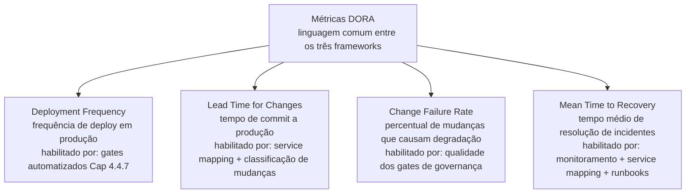
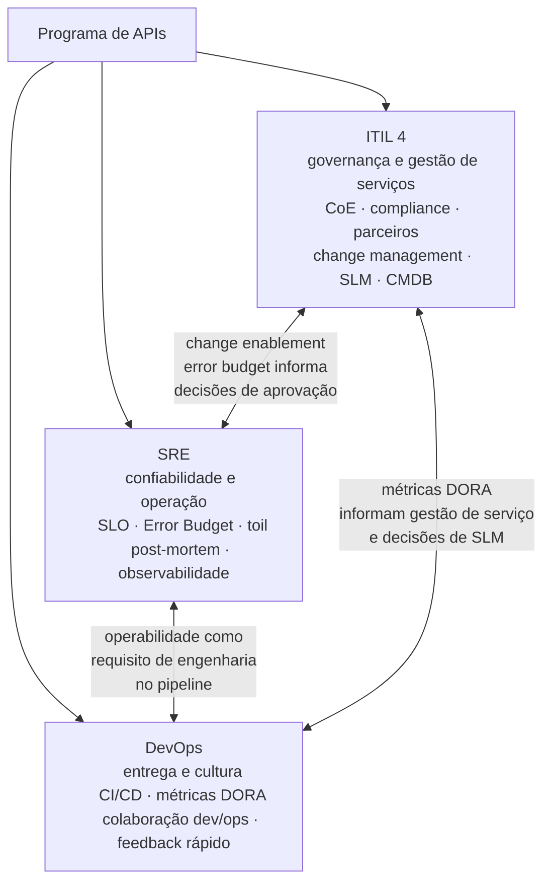

# Módulo 4 · ITIL e APIs
## Capítulo 4.7 · ITIL, SRE e DevOps — convergências e complementaridades

> **Série:** Gerenciamento e Governança de APIs
> **Nível:** Estratégico e operacional
> **Pré-requisito:** Cap 4.1 a 4.6 · Módulo 3 completo

---

## Sumário

- [4.7.1 · Três frameworks, um objetivo](#471--três-frameworks-um-objetivo)
- [4.7.2 · O que cada framework contribui](#472--o-que-cada-framework-contribui)
- [4.7.3 · Onde convergem — os princípios compartilhados](#473--onde-convergem--os-princípios-compartilhados)
- [4.7.4 · Onde diferem — tensões reais e como resolvê-las](#474--onde-diferem--tensões-reais-e-como-resolvê-las)
- [4.7.5 · As métricas DORA como ponte](#475--as-métricas-dora-como-ponte)
- [4.7.6 · A integração prática no programa de APIs](#476--a-integração-prática-no-programa-de-apis)
- [Fontes e referências](#fontes-e-referências)

---

## 4.7.1 · Três frameworks, um objetivo

Durante anos, ITIL, SRE e DevOps foram apresentados como alternativas — ou pior, como adversários. Times de desenvolvimento acusavam o ITIL de ser a burocracia que impedia a entrega. Praticantes de ITIL acusavam o DevOps de ser imprudência disfarçada de agilidade. O SRE era visto por alguns como a versão "séria" do DevOps e por outros como ITIL reembalado com vocabulário de engenharia.

Essa narrativa de adversidade nunca foi verdadeira — e o ITIL 4, publicado em 2019 com incorporação explícita de princípios Agile, DevOps e Lean, a tornou ainda menos sustentável.

Os três frameworks existem para o mesmo objetivo: **entregar produtos e serviços de tecnologia com qualidade, velocidade e confiabilidade adequadas às necessidades do negócio e dos consumidores**. As diferenças não são de objetivo — são de ênfase, vocabulário e contexto de origem.

- **ITIL** nasceu no contexto de grandes organizações de TI corporativas com necessidades de processo, compliance e governança formal. Sua ênfase é na gestão de serviços como sistema organizacional.
- **SRE** nasceu no Google, onde a escala de operações tornava as abordagens tradicionais insustentáveis. Sua ênfase é na engenharia de confiabilidade como disciplina técnica.
- **DevOps** nasceu da tensão entre times de desenvolvimento e times de operações — a "wall of confusion" onde desenvolvimento jogava código por cima do muro e operações tentava mantê-lo funcionando. Sua ênfase é na cultura de colaboração e na entrega contínua.

Compreender essas origens distintas é o primeiro passo para usar os três de forma complementar — sem tentar forçar um único framework sobre contextos para os quais não foi projetado.

---

## 4.7.2 · O que cada framework contribui

---

### O que o ITIL 4 contribui melhor

**Governança formal e compliance** — a estrutura de autoridade, os processos de decisão, as políticas e a auditabilidade que mercados regulados exigem. O ciclo EDM — Evaluate, Direct, Monitor — que permeia o Módulo 3 inteiro é uma contribuição específica do ITIL 4 que SRE e DevOps não cobrem com a mesma profundidade.

**Gestão do ciclo de vida completo de serviços** — da concepção ao encerramento, incluindo gestão de contratos com parceiros, SLM formal, gestão de mudanças com rastreabilidade e configuration management. São práticas que SRE e DevOps pressupõem mas não especificam.

**Integração com o restante da organização de TI** — o ITIL 4 fala a língua dos times de operações corporativos, das áreas de compliance, dos auditores e dos gestores sênior. É o framework que cria pontes entre o programa de APIs e o restante da organização.

**Vocabulário compartilhado em escala** — com adoção global em organizações de todos os tamanhos e setores, o ITIL oferece um vocabulário que transcende a organização individual. Um incidente é um incidente. Um Change Record é um Change Record.

---

### O que o SRE contribui melhor

O SRE — documentado nos livros do Google disponíveis gratuitamente em [sre.google/books](https://sre.google/books/) — é onde a engenharia de confiabilidade encontrou sua linguagem mais precisa:

**SLI, SLO e Error Budget** — que incorporamos no Cap 4.5. Esses conceitos transformam gestão de confiabilidade de uma atividade de reporte em um mecanismo de decisão operacional. O ITIL 4 trata SLAs, mas o modelo de SLO/Error Budget do SRE é mais operacionalmente poderoso.

**Toil reduction** — a identificação e eliminação sistemática de trabalho operacional repetitivo que não escala. Toil é o trabalho manual, repetitivo e automável que consome capacidade de engenharia sem produzir valor duradouro.

**Operação em escala como problema de engenharia** — o SRE trata operação não como disciplina de processo mas como disciplina de engenharia. A premissa é que problemas de operação em escala têm soluções de engenharia — não apenas soluções de processo.

**Cultura de confiabilidade com responsabilidade compartilhada** — engenheiros de produto e de confiabilidade trabalhando nos mesmos sistemas, com Error Budget como linguagem comum, cria uma cultura onde confiabilidade é responsabilidade de todos.

---

### O que o DevOps contribui melhor

O DevOps — cuja base empírica mais sólida é o *Accelerate* de Forsgren, Humble e Kim — contribui especialmente onde velocidade e cultura importam mais:

**Cultura de colaboração e responsabilidade compartilhada** — a eliminação da wall of confusion entre desenvolvimento e operações. Times que desenvolvem e operam o que constroem têm mais incentivo para construir com qualidade e operabilidade.

**Entrega contínua como prática** — o pipeline de CI/CD como mecanismo que permite entregar valor com frequência alta e risco baixo. A pesquisa do *Accelerate* demonstrou empiricamente que alta frequência de deploy e baixa taxa de falhas não são objetivos conflitantes.

**Feedback rápido como princípio organizacional** — o encurtamento do ciclo de feedback entre código e produção, entre produção e time de desenvolvimento, entre consumidor e produto.

**Métricas de performance de entrega** — as quatro métricas DORA como linguagem objetiva para avaliar a saúde do processo de entrega, exploradas no 4.7.5.

---

## 4.7.3 · Onde convergem — os princípios compartilhados

Apesar das origens distintas, os três frameworks convergem em um conjunto de princípios que qualquer organização de tecnologia madura reconhece como fundamentais.

---

### Automação como escala

Os três frameworks chegam à mesma conclusão por caminhos diferentes: o trabalho que pode ser automatizado deve ser automatizado, para que o trabalho humano seja reservado para o que exige julgamento.

O ITIL 4 nomeia isso como "Optimize and Automate" — seu sétimo princípio orientador. O SRE nomeia como toil reduction. O DevOps nomeia como o pipeline de entrega contínua.

No contexto de APIs, essa convergência se materializa nos gates de pipeline do Cap 4.4.7: lint automático, análise de segurança, contract testing, breaking change detection. São ao mesmo tempo standard changes automatizadas do ITIL 4, redução de toil do SRE e entrega contínua do DevOps.

---

### Feedback contínuo como mecanismo de aprendizado

O ITIL 4 nomeia como Continual Improvement. O SRE nomeia como o ciclo SLI/SLO/Error Budget — onde os dados de performance alimentam decisões operacionais em tempo real. O DevOps nomeia como o loop de feedback do pipeline.

---

### Foco no valor para o consumidor

O ITIL 4 coloca "Focus on Value" como seu primeiro princípio orientador. O SRE define SLIs a partir da perspectiva do consumidor. O DevOps mede Lead Time for Changes a partir do momento em que o consumidor solicita uma funcionalidade.

---

### Melhoria incremental em vez de transformação big-bang

O ITIL 4 nomeia como "Progress Iteratively with Feedback". O SRE opera com Error Budget — cada período é uma nova oportunidade de aprender e melhorar. O DevOps nomeia como deploy frequente com baixo risco.

---

## 4.7.4 · Onde diferem — tensões reais e como resolvê-las

As convergências são reais — mas também são as tensões. Ignorá-las seria desonesto. O que se pode dizer é que as tensões têm resoluções práticas que organizações maduras já descobriram.

---

### Tensão 1 — Change management formal vs. deploy contínuo

A tensão mais visível: o ITIL 4 tem Change Advisory Boards, Change Records e processos de aprovação. DevOps e SRE advogam por deploy frequente, às vezes múltiplas vezes por dia.

**Como se resolve:** a resolução está na hierarquia de mudanças do Cap 4.4.2. Normal changes são reservadas para mudanças de alto impacto. Standard changes cobrem mudanças de baixo risco. E standard changes automatizadas via pipeline são a implementação de deploy contínuo dentro do framework de change enablement do ITIL 4.

O ITIL 4 nunca disse que todas as mudanças precisam de aprovação manual. Disse que mudanças precisam de controle proporcional ao risco. Deploy contínuo com gates de qualidade automatizados é controle proporcional ao risco — não ausência de controle.

A pesquisa do *Accelerate* demonstrou empiricamente que organizações de elite têm simultaneamente alta frequência de deploy e baixa taxa de falhas. A tensão entre velocidade e estabilidade é falsa quando o processo é bem calibrado.

---

### Tensão 2 — Processo documentado vs. engenharia pragmática

O ITIL tem uma reputação — parcialmente merecida — de produzir documentação abundante e processos detalhados. SRE e DevOps tendem a preferir código e automação sobre documentação de processo.

**Como se resolve:** o ITIL 4 explicitamente abandonou a prescrição detalhada de processos do ITIL v3. O princípio "Keep it Simple and Practical" é uma resposta direta a essa crítica. A documentação que o ITIL 4 requer é a que justifica decisões e garante rastreabilidade — não documentação pela documentação.

No contexto de APIs, a documentação de rationale do Cap 3.2.4, os Change Records com justificativa e o CMDB com relacionamentos entre ICs são documentação que o SRE e o DevOps também precisariam ter — só não nomeiam da mesma forma.

---

### Tensão 3 — Estabilidade vs. inovação

O ITIL foi historicamente associado a conservadorismo. DevOps e SRE são associados a velocidade e inovação.

**Como se resolve:** o Error Budget do SRE é precisamente o mecanismo que equilibra as duas forças dentro de um único framework coerente. Quando o budget está saudável, a equipe pode inovar. Quando está crítico, a estabilidade tem prioridade. O ITIL 4 incorporou essa lógica no princípio de melhoria iterativa com feedback.

---

## 4.7.5 · As métricas DORA como ponte

As quatro métricas DORA — definidas na pesquisa de Forsgren, Humble e Kim — são uma das contribuições mais práticas do movimento DevOps para qualquer programa de entrega de software. E são uma ponte natural entre os três frameworks porque medem resultados que todos os três se propõem a melhorar.

As métricas DORA foram derivadas de anos de pesquisa com dezenas de milhares de profissionais de tecnologia globalmente, examinando as práticas que distinguem organizações de alta performance das demais.

---

### As quatro métricas e sua aplicação a APIs

**Deployment Frequency — Frequência de Deploy**
Com que frequência a organização faz deploy em produção. Para APIs, é a frequência com que novas versões ou atualizações chegam a produção. Organizações de elite fazem múltiplos deploys por dia. Organizações de baixa performance fazem deploys mensais ou menos frequentes.

No contexto de APIs, alta frequência de deploy é habilitada pelos gates automatizados do Cap 4.4.7 — que garantem que apenas mudanças que passaram por todos os critérios de qualidade chegam a produção, com velocidade que o processo manual não permite.

**Lead Time for Changes — Tempo de Ciclo de Mudanças**
O tempo entre um commit de código e essa mudança estar em produção. Para APIs, é o tempo entre a finalização de uma mudança na spec e a disponibilidade para consumidores.

Lead time alto indica gargalos no pipeline — gates manuais excessivos, processos de aprovação demorados, ambientes de staging congestionados. O service mapping do Cap 4.3 e a classificação de mudanças do Cap 4.4.3 são mecanismos que reduzem lead time sem reduzir segurança.

**Change Failure Rate — Taxa de Falha de Mudanças**
O percentual de mudanças que causam degradação de serviço e exigem remediação. Para APIs, é o percentual de deploys que introduzem bugs, breaking changes não intencionais ou degradação de performance.

Alta change failure rate indica que os gates de qualidade não estão funcionando — lint insuficiente, cobertura de testes inadequada, ausência de contract testing. É o indicador que melhor revela a qualidade do pipeline de governança técnica.

**Mean Time to Recovery — MTTR**
O tempo médio entre a degradação de serviço e a restauração completa. Para APIs, combina tempo de detecção (qualidade do monitoramento do Cap 4.6.2) e tempo de diagnóstico e resolução (qualidade do service mapping do Cap 4.3 e dos runbooks do [Anexo D](../anexos/d_gestao_conhecimento_api.md)).

---

### As métricas DORA como avaliação do programa de APIs

As quatro métricas não são métricas de engenharia — são métricas de programa. Avaliam a saúde do processo de entrega como um todo.

Um programa de APIs com Deployment Frequency alta, Lead Time baixo, Change Failure Rate baixa e MTTR baixo está entregando bem — com velocidade, qualidade e confiabilidade. Qualquer uma dessas métricas deteriorando é sinal de que algo no programa precisa de atenção.

A pesquisa do *Accelerate* mostrou que as quatro métricas se correlacionam — organizações que são boas em uma tendem a ser boas nas quatro. Isso confirma que velocidade e estabilidade não são objetivos em tensão quando o processo é bem projetado.

---

## 4.7.6 · A integração prática no programa de APIs

Com os três frameworks compreendidos, a pergunta prática é: como coexistem em um programa de APIs maduro?

A resposta é que cada framework opera em um nível diferente do programa — e juntos cobrem o programa completo.

---

### ITIL 4 opera no nível de governança e gestão de serviços

O CoE usa o vocabulário e as práticas do ITIL 4 para: definir políticas e padrões (Cap 3.4), gerenciar o ciclo de vida de APIs (mapeado sobre a SVC do Cap 4.1), operar change enablement (Cap 4.4), gerenciar o CMDB e o service mapping (Cap 4.3), conduzir SLM (Cap 4.5) e garantir compliance regulatório.

O ITIL 4 é a linguagem do CoE com o restante da organização de TI — com os times de operações, com compliance, com auditores, com a liderança executiva.

---

### SRE opera no nível de confiabilidade e operação

Os times que operam APIs em produção usam os princípios SRE para: definir SLIs e SLOs (Cap 4.5.5), gerenciar Error Budget como mecanismo de decisão operacional, identificar e eliminar toil no processo de deploy e operação, conduzir post-mortems com cultura blameless (Cap 4.6.6) e projetar sistemas para falhar de forma controlável.

---

### DevOps opera no nível de entrega e cultura

Os times de produto usam os princípios DevOps para: estruturar pipelines de CI/CD com gates de qualidade (Cap 4.4.7), medir performance de entrega com métricas DORA (Cap 4.7.5), construir uma cultura onde qualidade e confiabilidade são responsabilidades do time de desenvolvimento.

---

### A maturidade como integração progressiva

Organizações raramente conseguem implementar os três frameworks simultaneamente. A trajetória típica é progressiva:

**Estágio inicial** — práticas informais. Pode haver elementos de DevOps no pipeline, mas pouca governança formal e pouca engenharia de confiabilidade dedicada.

**Estágio de formalização** — o ITIL 4 é o primeiro framework a ser formalizado, porque a pressão de compliance e gestão de serviços corporativos exige processos documentados e rastreáveis.

**Estágio de maturidade operacional** — à medida que o portfólio cresce, práticas SRE são incorporadas. SLOs são definidos, Error Budget é adotado, toil reduction se torna prioridade.

**Estágio de excelência** — os três frameworks coexistem de forma integrada. As métricas DORA são o painel de controle do programa. O ITIL 4 garante governança. O SRE garante confiabilidade. O DevOps garante velocidade de entrega.

---

## Pontos-chave do capítulo

- ITIL 4, SRE e DevOps não são adversários — são frameworks com origens distintas que convergem no mesmo objetivo: entregar serviços de tecnologia com qualidade, velocidade e confiabilidade
- O ITIL 4 contribui com governança formal, compliance e gestão do ciclo de vida. O SRE contribui com engenharia de confiabilidade, SLO/Error Budget e toil reduction. O DevOps contribui com cultura de colaboração, entrega contínua e métricas de performance
- As convergências são reais: automação como escala, feedback contínuo como aprendizado, foco no valor para o consumidor e melhoria incremental
- As tensões históricas têm resoluções práticas: change management formal é compatível com deploy contínuo quando a hierarquia de mudanças está bem calibrada
- As métricas DORA são a linguagem comum entre os três frameworks e o painel de controle mais útil para avaliar a saúde de um programa de APIs
- A pesquisa do *Accelerate* demonstrou empiricamente que velocidade e estabilidade não são objetivos em tensão: organizações de elite têm alta frequência de deploy e baixa taxa de falhas simultaneamente
- Em um programa de APIs maduro, os três frameworks operam em níveis complementares: ITIL 4 na governança, SRE na confiabilidade operacional e DevOps na entrega e cultura

---

## Fontes e referências

| Fonte | Referência completa |
|---|---|
| **ITIL 4 Foundation (2019)** | Axelos. *ITIL Foundation: ITIL 4 Edition*. The Stationery Office, 2019. Disponível em: [axelos.com/certifications/itil-service-management](https://www.axelos.com/certifications/itil-service-management) |
| **Accelerate (2018)** | Forsgren, N., Humble, J. & Kim, G. *Accelerate: The Science of Lean Software and DevOps*. IT Revolution Press, 2018. Disponível em: [amazon.com/Accelerate](https://www.amazon.com/Accelerate-Software-Performing-Technology-Organizations/dp/1942788339) |
| **Google SRE Books** | Google SRE Team. *Site Reliability Engineering* e *The Site Reliability Workbook*. Gratuitos online. Disponível em: [sre.google/books](https://sre.google/books/) |

---

## Próximo capítulo

**4.8 · Descoberta de APIs — os dois prismas** — o prisma do consumidor e o prisma da governança. Shadow APIs como risco de segurança e evidência de falha de governança. Técnicas de descoberta ativa do portfólio real.

---

*Série: Gerenciamento e Governança de APIs · Módulo 4 · Capítulo 4.7*