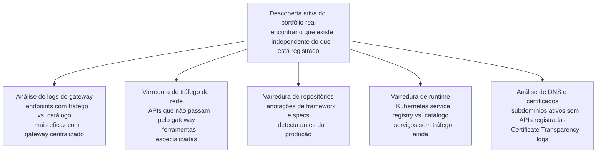

# Módulo 4 · ITIL e APIs
## Capítulo 4.8 · Descoberta de APIs — os dois prismas

> **Série:** Gerenciamento e Governança de APIs
> **Nível:** Estratégico e operacional
> **Pré-requisito:** Cap 3.5 · Cap 4.3 · Cap 4.5 · Cap 4.6

---

## Sumário

- [4.8.1 · Os dois prismas de discovery](#481--os-dois-prismas-de-discovery)
- [4.8.2 · Prisma do consumidor — tornando APIs encontráveis](#482--prisma-do-consumidor--tornando-apis-encontráveis)
- [4.8.3 · Prisma da governança — o problema das shadow APIs](#483--prisma-da-governança--o-problema-das-shadow-apis)
- [4.8.4 · Origens das shadow APIs](#484--origens-das-shadow-apis)
- [4.8.5 · Técnicas de descoberta ativa](#485--técnicas-de-descoberta-ativa)
- [4.8.6 · Reconciliação — comparando o que existe com o que está registrado](#486--reconciliação--comparando-o-que-existe-com-o-que-está-registrado)
- [4.8.7 · Governança como resposta sistêmica às shadow APIs](#487--governança-como-resposta-sistêmica-às-shadow-apis)

---

## 4.8.1 · Os dois prismas de discovery

Quando falamos em "descoberta de APIs", a tendência natural é pensar no problema do consumidor: encontrar a API certa para um problema específico. O Cap 3.5 tratou esse prisma com profundidade — estratégias de descoberta por tipo de audiência, catálogo como infraestrutura de visibilidade, AI Readiness do portfólio.

Mas há um segundo prisma de discovery que é igualmente — em alguns contextos mais — importante: o prisma da governança. A pergunta não é "como um consumidor encontra a API que precisa?", mas "como o CoE garante que conhece todas as APIs que existem na organização?"

Os dois prismas são complementares mas fundamentalmente distintos em propósito, método e urgência:

| | Prisma do consumidor | Prisma da governança |
|---|---|---|
| **Pergunta central** | Que APIs existem para resolver meu problema? | Quais APIs existem que podem não estar sob controle? |
| **Ator principal** | Desenvolvedor consumidor | CoE e time de segurança |
| **Objetivo** | Encontrar e usar | Auditar e controlar |
| **Urgência** | Melhora a experiência | Reduz risco de segurança |
| **Ferramenta primária** | Catálogo e portal | Varredura ativa e análise de tráfego |

Este capítulo trata os dois prismas — com ênfase especial no segundo, que representa uma dimensão crítica de governança frequentemente subestimada.

---

## 4.8.2 · Prisma do consumidor — tornando APIs encontráveis

O Cap 3.5 cobriu estratégias de descoberta por tipo de audiência e o papel do catálogo como infraestrutura. O Cap 4.5.7 conectou descoberta com Service Request Management do ITIL 4. Aqui consolidamos o argumento sob a perspectiva de governança de discovery.

---

### O catálogo como mecanismo de discovery ativo

Um catálogo passivo — onde as APIs estão registradas mas ninguém sabe que precisam ser consultadas antes de criar algo novo — não resolve o problema de descoberta. O catálogo precisa ser integrado no fluxo de trabalho dos times de forma que a consulta aconteça naturalmente.

Os mecanismos que tornam a consulta ao catálogo parte natural do fluxo:

**Gate de concepção** — antes de iniciar o design de uma nova API, o processo exige que o time demonstre que verificou o catálogo por capacidades existentes. Não como obrigação burocrática — como proteção: construir algo que já existe é desperdício que o time quer evitar tanto quanto o CoE.

**Integração com ferramentas agênticas** — quando um desenvolvedor usa ferramentas de IA para apoiar o desenvolvimento, o catálogo exposto como contexto permite que a ferramenta sugira APIs existentes antes que o desenvolvedor decida construir algo novo.

**Busca por capacidade, não por nome** — catálogos que só permitem busca por nome são eficazes apenas para quem já sabe o que está procurando. Catálogos com metadados de capacidade permitem busca por o que a API faz e retornam resultados mesmo quando o consumidor não conhece o nome da API existente.

---

### Service Request Management e o onboarding

Quando um consumidor encontra a API que precisa, o ITIL 4 trata a transição para uso como Service Request Management — o processo que governa "encontrei o que preciso" até "estou usando em produção".

Para APIs públicas, esse processo pode ser completamente automatizado. Para APIs de parceiros, envolve verificação de identidade, negociação de contrato e credenciamento formal — como tratamos no Cap 3.6.3. Para APIs internas críticas, pode envolver revisão do caso de uso pelo owner.

O design do processo de Service Request Management é parte do design de governança de discovery — um processo lento ou opaco desincentiva o uso do catálogo e incentiva os times a construírem soluções próprias em vez de reutilizarem o que existe.

---

## 4.8.3 · Prisma da governança — o problema das shadow APIs

**Shadow APIs** são APIs que existem em produção fora do processo de governança. Elas não estão no catálogo. Não têm owner registrado. Não passaram por revisão de segurança. Não fazem parte do CMDB. Do ponto de vista do CoE, elas não existem — mas do ponto de vista da infraestrutura e dos consumidores que as usam, elas existem e estão ativas.

---

### Por que shadow APIs são um risco de segurança

A OWASP API Security Top 10 inclui consistentemente "Improper Assets Management" — Gerenciamento Inadequado de Ativos — como uma das principais causas de incidentes de segurança em APIs.

A raiz de Improper Assets Management é exatamente o problema das shadow APIs: endpoints que existem em produção sem que a organização saiba, sem que tenham sido revisados e sem que sejam monitorados. Um atacante que descobre uma shadow API frequentemente encontra um endpoint sem autenticação adequada, sem rate limiting, sem logging — porque nunca passou pelos gates de governança que garantem esses controles.

Além da ausência de controles de segurança, shadow APIs não aparecem nas análises de impacto. Uma mudança de infraestrutura pode quebrar uma shadow API sem que ninguém no CoE saiba.

---

### Por que shadow APIs são uma evidência de falha de governança

A existência de shadow APIs não é apenas um problema técnico — é um sinal de que o processo de governança tem lacunas. Quando times criam APIs fora do processo, geralmente é porque:

- O processo tem fricção suficiente para que contorná-lo pareça mais rápido
- Os times não conhecem o processo ou não entendem por que ele existe
- Não há consequências visíveis para criar APIs fora do processo
- A necessidade era urgente e o processo era lento

Cada causa aponta para uma dimensão diferente de melhoria — identificá-las é tão importante quanto encontrar as shadow APIs em si.

---

## 4.8.4 · Origens das shadow APIs

Compreender de onde shadow APIs vêm é essencial para desenhar respostas eficazes.

---

### Times que criam APIs sem passar pelo processo

O padrão mais comum em organizações com processo de governança mal calibrado. Um time precisa de uma integração rápida e cria um endpoint diretamente, sem registro no catálogo, sem revisão do CoE.

Especialmente comum em organizações onde o processo de governança é percebido como obstáculo. Times que entendem o valor da governança tendem a seguir o processo mesmo sob pressão. Times que percebem a governança como burocracia tendem a contorná-la.

### APIs legadas esquecidas

Endpoints criados há anos, cujos times originais se desfizeram, que ninguém mais mantém formalmente mas que continuam recebendo tráfego. Em organizações com histórico longo, esse padrão é surpreendentemente comum.

Essas APIs são particularmente perigosas porque tendem a usar padrões técnicos desatualizados — versões antigas de frameworks com vulnerabilidades conhecidas, esquemas de autenticação que não atendem os padrões atuais.

### APIs expostas por ferramentas e plataformas

Sistemas SaaS, plataformas de dados, ferramentas de colaboração — muitas expõem APIs automaticamente como parte de sua operação normal. A organização contrata a ferramenta para uma função específica sem perceber que ela também está expondo endpoints que podem ser acessados.

Particularmente difícil de detectar porque as APIs não foram criadas pela organização — e podem expor dados organizacionais sem que ninguém tenha tomado uma decisão consciente de expô-los via API.

### Endpoints de desenvolvimento que chegaram a produção

Endpoints criados para debug, teste ou exploração que nunca foram desligados quando o sistema foi para produção. Frequentemente incluem funcionalidades que não deveriam estar acessíveis — acesso a dados de diagnóstico, endpoints de administração sem autenticação, funcionalidades experimentais sem rate limiting.

### APIs de microserviços com exposição não intencional

Serviços que deveriam se comunicar apenas internamente mas são expostos inadvertidamente através de configuração inadequada de rede ou gateway. Um serviço que expõe uma API para consumo interno pode estar acessível externamente sem que ninguém tenha tomado essa decisão conscientemente.

---

## 4.8.5 · Técnicas de descoberta ativa

A descoberta ativa do portfólio real usa técnicas que examinam a infraestrutura real em vez de confiar no catálogo declarado.

---

### Análise de logs e tráfego do gateway

A técnica mais direta para organizações com gateway centralizado. O gateway registra todo o tráfego. Comparar os endpoints que aparecem nos logs com os endpoints registrados no catálogo revela endpoints com tráfego real que não estão catalogados.

O processo: extrair a lista de endpoints únicos com tráfego nos últimos N dias. Comparar com o catálogo. Qualquer endpoint no primeiro conjunto mas não no segundo é uma shadow API candidata.

Limitação importante: só detecta shadow APIs que passam pelo gateway. APIs expostas diretamente na infraestrutura sem passar pelo gateway não aparecem nessa análise.

---

### Varredura de tráfego de rede

Para detectar APIs que não passam pelo gateway, é necessário analisar o tráfego de rede diretamente. Ferramentas especializadas em API security discovery — como Noname Security, Salt Security e Traceable — identificam padrões de tráfego HTTP/HTTPS que indicam a presença de APIs.

Essas ferramentas analisam padrões estruturais no tráfego — formatos de payload, padrões de URL, códigos de resposta — para identificar endpoints que se comportam como APIs mesmo sem spec OpenAPI associada.

---

### Varredura de repositórios de código

APIs deixam rastros nos repositórios antes de chegar a produção. Anotações de framework — `@RestController` em Spring, `@app.route` em Flask, `router.get` em Express — definem endpoints no código. Arquivos de spec OpenAPI em repositórios indicam APIs intencionalmente definidas.

A varredura sistemática dos repositórios Git por esses padrões revela APIs que existem no código mas não estão no catálogo. Técnica especialmente valiosa porque detecta shadow APIs antes que cheguem a produção.

---

### Varredura de ambientes de runtime

Em ambientes Kubernetes e service mesh, o sistema de service discovery conhece todos os serviços em execução. Comparar o service registry do Kubernetes com o catálogo de APIs revela serviços em produção sem registro formal.

Complementa a análise de logs do gateway — detecta serviços que estão rodando mesmo sem tráfego ainda, e detecta serviços que não passam pelo gateway.

---

### Análise de DNS e certificados

Subdomínios ativos que respondem em portas típicas de APIs e que não têm APIs registradas no catálogo são candidatos a investigação. Certificate Transparency logs — que registram publicamente todos os certificados TLS emitidos — permitem identificar domínios e subdomínios que a organização pode não saber que existem.

> A implementação técnica das ferramentas de descoberta ativa e a automação da reconciliação são tratadas com profundidade no **Módulo 7**.

---

## 4.8.6 · Reconciliação — comparando o que existe com o que está registrado

A descoberta ativa produz candidatos a shadow APIs. A reconciliação é o processo de investigar cada candidato e determinar o que fazer.

---

### O processo de reconciliação

**Identificação e triagem** — para cada candidato, a primeira pergunta é: é realmente uma shadow API ou um falso positivo? Endpoints de health check, métricas internas, serviços de infraestrutura podem aparecer na varredura sem serem APIs de negócio que precisam de governança.

**Mapeamento de owner** — para cada shadow API confirmada, identificar quem a criou e quem atualmente mantém o código. Frequentemente a parte mais difícil — especialmente para APIs legadas onde o time original se desfez.

**Avaliação de risco** — nem todas as shadow APIs têm o mesmo risco. Uma API interna sem dados sensíveis tem perfil muito diferente de uma API com acesso a dados de clientes exposta na internet sem autenticação.

**Decisão e ação** — para cada shadow API, uma de três decisões:
- **Registrar e formalizar** — tem valor legítimo e deve ser trazida para dentro do processo. Owner é designado, revisão de segurança é conduzida, API é registrada no catálogo.
- **Desligar** — não tem valor atual, está abandonada ou representa risco sem contrapartida. O processo é semelhante ao sunset do Cap 2.6.
- **Isolar temporariamente** — tem consumidores que dependem dela mas precisa de remediação antes de ser formalizada. Acesso é restrito enquanto a remediação acontece.

---

### Reconciliação contínua vs. auditoria pontual

A reconciliação como auditoria pontual — realizada uma vez e esquecida — tem valor limitado. Shadow APIs continuam sendo criadas. A reconciliação precisa ser um processo contínuo com cadência definida.

A automação da reconciliação — scripts que regularmente comparam logs do gateway com o catálogo, alertas quando o Kubernetes service registry diverge do catálogo — é o que torna o processo sustentável sem depender de iniciativas manuais periódicas.

---

## 4.8.7 · Governança como resposta sistêmica às shadow APIs

A descoberta e reconciliação resolve o problema imediato. Mas o objetivo de longo prazo não é encontrar shadow APIs — é criar as condições para que não sejam criadas.

---

### Endereçando as causas raiz

Cada origem de shadow API aponta para uma intervenção de governança específica:

**Times que contornam o processo** → o processo tem fricção excessiva. A resposta é simplificação — não mais enforcement. Um gate de concepção que responde em minutos, gates automatizados sem espera por revisão humana para casos de baixo risco.

**APIs legadas esquecidas** → ausência de inventário periódico e revisão de ownership. A resposta é tornar a manutenção do catálogo uma condição de conformidade — alertas automáticos para ICs sem owner ativo, revisão periódica de ICs sem tráfego recente.

**APIs de ferramentas e plataformas** → ausência de avaliação de APIs de terceiros no onboarding de ferramentas. A resposta é incluir inventário de APIs expostas como parte do processo de procurement e onboarding de ferramentas SaaS.

**Endpoints de desenvolvimento em produção** → ausência de gate que verifica endpoints não registrados. A resposta é um gate no pipeline de deploy que bloqueia a promoção para produção de qualquer serviço com endpoints não catalogados.

---

### O ciclo de maturidade

Organizações que tratam shadow APIs como problema pontual resolvem o sintoma sem endereçar a causa. Organizações que as tratam como indicador de maturidade de governança usam a descoberta ativa como ferramenta de diagnóstico — identificando onde o processo tem lacunas e evoluindo o framework de forma dirigida.

Essa é a conexão com o Continual Improvement do Cap 4.6.7: o padrão de shadow APIs encontradas em cada ciclo de reconciliação é um dos inputs mais valiosos para a evolução do programa de governança.

---

### A conexão com o CMDB e o catálogo

A reconciliação produz novos ICs e novos relacionamentos que precisam ser adicionados ao CMDB — fechando o ciclo com o Cap 4.3. O service mapping que o Cap 4.3 constrói é também uma ferramenta de detecção: quando um serviço aparece no service registry do Kubernetes mas não tem relacionamentos no CMDB, é um candidato a shadow API.

O catálogo do Cap 3.5 é o estado desejado que a reconciliação tenta alcançar: um catálogo que reflete o portfólio real, não apenas o portfólio formalmente registrado. O gap entre o catálogo declarado e o portfólio real é a medida do problema de shadow APIs em qualquer organização.

---

## Pontos-chave do capítulo

- Discovery de APIs opera em dois prismas com propósitos opostos: o prisma do consumidor — tornar APIs encontráveis — e o prisma da governança — garantir que o CoE conhece todas as APIs que existem
- Shadow APIs são endpoints em produção fora do processo de governança. São ao mesmo tempo um risco de segurança crítico e uma evidência de falha de governança. A OWASP API Security Top 10 inclui Improper Assets Management como uma das principais causas de incidentes
- As cinco origens de shadow APIs têm dinâmicas distintas: times que contornam o processo, APIs legadas esquecidas, ferramentas SaaS com APIs inadvertidas, endpoints de desenvolvimento em produção e microserviços com exposição não intencional
- As técnicas de descoberta ativa cobrem diferentes camadas: análise de logs do gateway, varredura de tráfego de rede, varredura de repositórios de código, varredura de runtime e análise de DNS e certificados
- A reconciliação investiga candidatos, mapeia owners, avalia risco e toma decisões — registrar e formalizar, desligar ou isolar temporariamente
- Reconciliação contínua e automatizada é mais eficaz do que auditorias pontuais
- O objetivo de longo prazo não é encontrar shadow APIs — é criar as condições para que não sejam criadas. Cada origem aponta para uma intervenção de governança específica
- A implementação técnica das ferramentas de descoberta ativa e automação da reconciliação são tratadas no Módulo 7

---

## Próximo módulo

O Módulo 4 está completo. O próximo módulo e seu escopo serão definidos na próxima sessão de desenvolvimento.

---

*Série: Gerenciamento e Governança de APIs · Módulo 4 · Capítulo 4.8*