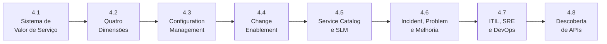

# Módulo 4 — ITIL & APIs

> **Série:** Gerenciamento e Governança de APIs
> **Nível:** Operacional e estratégico
> **Pré-requisito:** Módulo 1 — Fundamentos, Módulo 3 — Governança de APIs

---

## Sobre este módulo

ITIL 4 é o framework de gerenciamento de serviços de TI mais adotado no mundo — mas raramente é lido com o foco em APIs. O Módulo 4 faz exatamente isso: toma os conceitos centrais do ITIL 4 e os aplica ao contexto específico de programas de API, mostrando onde o framework ilumina decisões de governança que outros modelos não cobrem com a mesma profundidade.

O módulo não exige que a organização adote ITIL formalmente. Os conceitos têm valor independente de certificações ou implementações oficiais — o SVS, as quatro dimensões, o configuration management, o change enablement e as práticas de incident e problem management são lentes úteis para qualquer programa de APIs que queira operar com rigor e aprendizado sistemático.

O módulo fecha com dois capítulos de integração: a convergência entre ITIL, SRE e DevOps — três frameworks que frequentemente coexistem nos mesmos times — e o problema de descoberta de APIs, analisado sob os dois prismas que o ITIL 4 ajuda a separar: a descoberta pelo consumidor e a descoberta pela governança.

---

## Capítulos

### [4.1 · O Sistema de Valor de Serviço (SVS) aplicado a APIs](cap_4_1_itil_api.md)

O SVS é o modelo central do ITIL 4 — e sua leitura com o foco em APIs revela conexões que a perspectiva técnica não alcança sozinha. O capítulo percorre os cinco componentes do SVS, os sete princípios orientadores como guia de decisão para programas de APIs e a Service Value Chain como mapa das atividades que transformam demanda em valor entregue. Fecha com as implicações de tratar APIs como serviços dentro do SVS.

---

### [4.2 · As Quatro Dimensões do ITIL 4 no contexto de APIs](cap_4_2_quatro_dimensoes.md)

As quatro dimensões — Organizações e Pessoas, Informação e Tecnologia, Parceiros e Fornecedores, e Fluxos de Valor e Processos — funcionam como um checklist de governança que garante que nenhum aspecto crítico seja negligenciado. O capítulo aplica cada dimensão ao contexto de APIs, abordando competências e cultura, gestão do conhecimento organizacional, ecossistemas de parceiros e o design de fluxos de valor para o ciclo de vida.

> Referencia o [Anexo D · Gestão do Conhecimento no programa de APIs](../anexos/d_gestao_conhecimento_api.md).

---

### [4.3 · Configuration Management e CMDB para APIs](cap_4_3_cmdb_api.md)

O CMDB é frequentemente reduzido a um inventário — mas no contexto de APIs é uma ferramenta de rastreabilidade que conecta specs, implementações, dependências e impactos de mudança. O capítulo define o que é um IC no contexto de APIs, como construir o service mapping da oferta de negócio ao menor IC, e como manter o CMDB atualizado em ambientes de deploy contínuo. O *contract drift* é analisado como falha de configuration management.

---

### [4.4 · Change Enablement para APIs](cap_4_4_change_api.md)

Mudanças em APIs têm características que tornam o change enablement especialmente crítico: impacto em consumidores externos, risco de breaking changes e a necessidade de coordenação entre múltiplos times. O capítulo cobre a hierarquia de mudanças (standard, normal e emergency), a classificação de mudanças de APIs, o papel do CAB e como gates de governança no pipeline automatizam o change management sem criar burocracia.

---

### [4.5 · Service Catalog e SLM para APIs](cap_4_5_catalogo_servico_slm_api.md)

O catálogo de serviços e o catálogo de APIs são perspectivas complementares sobre o mesmo portfólio — uma orientada ao negócio, outra orientada ao consumidor técnico. Este capítulo distingue as duas perspectivas, detalha a hierarquia SLI → SLO → SLA → Error Budget, analisa a complexidade bilateral do SLM com parceiros e conecta o catálogo de serviços à descoberta de APIs.

---

### [4.6 · Incident, Problem e Continual Improvement para APIs](cap_4_6_incidente_problema_melhoria.md)

As três práticas formam um ciclo de aprendizado: incidentes revelam falhas, problem management identifica causas raiz, continual improvement sistematiza a resposta. O capítulo cobre monitoramento e detecção, classificação de severidade, tipos de incidente em APIs, técnicas de análise de causa raiz, o post-mortem blameless como artefato de aprendizado e as cadências de melhoria contínua no programa de APIs.

> Referencia o [Anexo D · Gestão do Conhecimento no programa de APIs](../anexos/d_gestao_conhecimento_api.md).

---

### [4.7 · ITIL, SRE e DevOps — Convergências e Complementaridades](cap_4_7_itil_devops_sre.md)

Os três frameworks coexistem em muitas organizações — frequentemente com tensão. Este capítulo analisa o que cada um contribui, onde convergem nos princípios e onde diferem nas abordagens, e como as métricas DORA funcionam como ponte prática entre eles. Fecha com um modelo de integração para programas de APIs que operam em organizações onde ITIL, SRE e DevOps precisam coexistir.

---

### [4.8 · Descoberta de APIs — os Dois Prismas](cap_4_8_descoberta.md)

Descoberta de APIs tem dois problemas distintos que frequentemente são confundidos: tornar APIs conhecidas para quem quer consumi-las, e descobrir APIs que existem mas não estão registradas — as *shadow APIs*. O capítulo analisa os dois prismas, as origens das shadow APIs, as técnicas de descoberta ativa e o processo de reconciliação entre o que existe e o que está registrado no catálogo e no CMDB.

---

## Progressão conceitual

