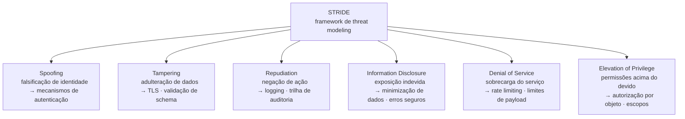
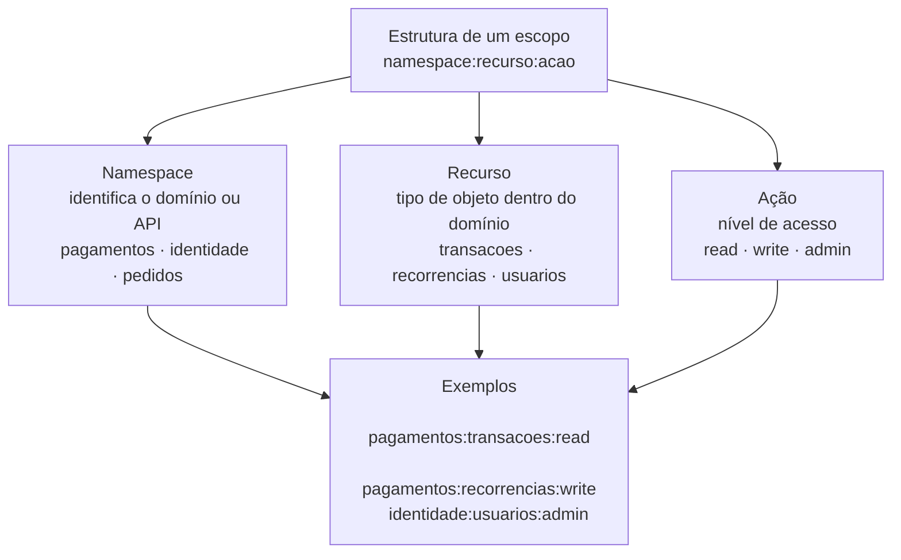

# Módulo 5 · Segurança de APIs
## Capítulo 5.1 · Segurança como propriedade do design

> **Série:** Gerenciamento e Governança de APIs
> **Nível:** Estratégico e técnico
> **Pré-requisito:** Cap 2.2 · Cap 2.3 · Cap 3.4

---

## Sumário

- [5.1.1 · A distinção entre security by design e security by addition](#511--a-distinção-entre-security-by-design-e-security-by-addition)
- [5.1.2 · Superfícies de ataque no design de APIs](#512--superfícies-de-ataque-no-design-de-apis)
- [5.1.3 · Threat modeling para APIs](#513--threat-modeling-para-apis)
- [5.1.4 · Princípios de design seguro](#514--princípios-de-design-seguro)
- [5.1.5 · Segurança como critério do contrato](#515--segurança-como-critério-do-contrato)
- [5.1.6 · Modelagem de escopos — design, taxonomia e governança](#516--modelagem-de-escopos--design-taxonomia-e-governança)
- [Fontes e referências](#fontes-e-referências)

---

## 5.1.1 · A distinção entre security by design e security by addition

Existe uma diferença fundamental entre uma API que é segura e uma API que tem segurança adicionada. A distinção não é sutil — é estrutural — e determina o nível de proteção real que qualquer quantidade de controles adicionais consegue oferecer.

**Security by addition** é o padrão mais comum. A API é projetada para funcionar — para expor os recursos certos, retornar os dados corretos, ter a performance adequada. Quando está pronta, ou quase pronta, a segurança é adicionada: um gateway na frente, rate limiting configurado, autenticação habilitada. Os controles são reais e têm valor. Mas são aplicados sobre um design que não foi pensado com segurança em mente — e há um limite para o que conseguem compensar.

**Security by design** é diferente em natureza, não apenas em timing. Segurança é uma propriedade do design — cada decisão considera suas implicações desde o início. Quais dados este endpoint precisa realmente expor? Como vou garantir que apenas o consumidor certo acessa o objeto certo? O que acontece se este endpoint for chamado com um payload malformado? Essas perguntas são feitas durante o design — não durante a revisão de segurança antes do lançamento.

O NIST SP 800-160v1r1 — *Engineering Trustworthy Secure Systems*, publicado em novembro de 2022 — formaliza esse princípio como fundamento da engenharia de sistemas seguros: segurança deve ser tratada como propriedade do sistema desde as fases iniciais de concepção, não como um conjunto de controles adicionados ao final. A publicação substitui e supera o SP 800-160 original de 2018, com ênfase renovada nos princípios de design que tornam sistemas genuinamente confiáveis.

> *Ross, R., McEvilley, M. & Winstead, M. Engineering Trustworthy Secure Systems. NIST Special Publication 800-160v1r1, novembro 2022. Disponível em: [doi.org/10.6028/NIST.SP.800-160v1r1](https://doi.org/10.6028/NIST.SP.800-160v1r1)*

---

### Por que security by addition tem um teto

O problema do security by addition não é que os controles são fracos — é que não conseguem compensar decisões de design que criam superfícies de ataque estruturais.

Três exemplos documentados no OWASP API Security Top 10:

Um endpoint que usa IDs sequenciais de objetos e retorna os dados sem verificar se o consumidor autenticado tem direito àquele objeto específico. Um gateway com autenticação habilitada não resolve — o consumidor está autenticado, mas está acessando um objeto que não é dele. A vulnerabilidade está no design, não na ausência de autenticação.

Um endpoint que retorna o objeto completo — incluindo campos internos, flags de sistema e dados sensíveis — quando o consumidor precisa apenas do nome e do email. Rate limiting e WAF não resolvem. A exposição excessiva de dados está no design do contrato.

Um endpoint que aceita qualquer campo em um payload de atualização e os aplica diretamente ao objeto — incluindo campos que o consumidor não deveria poder alterar, como `role` ou `admin_flag`. Validação de schema no gateway não resolve se o schema não especifica exatamente quais campos são permitidos.

Em todos os três casos, adicionar controles depois não resolve a vulnerabilidade — porque a vulnerabilidade é o design. O [Anexo E · Falhas de design seguro em APIs — casos práticos](../anexos/e_design_seguro.md) aprofunda esses e outros padrões com exemplos práticos e casos documentados.

---

### O custo de retrofit

Além da eficácia limitada, security by addition tem um custo prático que security by design não tem: o custo de retrofit.

Redesenhar um endpoint que expõe objetos por ID sequencial para validar autorização por objeto depois que consumidores já estão integrados é uma breaking change. Remover campos de um payload de resposta depois que consumidores os utilizam é uma breaking change. Restringir quais campos um endpoint aceita depois que consumidores os estão enviando é uma breaking change.

Security by design evita esse custo — não porque os requisitos de segurança são mais baratos de implementar durante o design, mas porque não forçam breaking changes em consumidores existentes quando são descobertos depois.

---

## 5.1.2 · Superfícies de ataque no design de APIs

Superfície de ataque é o conjunto de pontos onde um atacante pode tentar entrar, extrair dados ou causar dano. No contexto de APIs, a superfície de ataque é definida em grande parte pelas decisões de design — antes que qualquer controle de segurança seja aplicado.

---

### Exposição excessiva de dados

Cada campo que um endpoint retorna é parte da superfície de ataque. Campos que o consumidor não precisa — campos internos, flags de sistema, dados de outros contextos, metadados técnicos — são superfície de ataque sem valor para o consumidor legítimo.

O princípio de minimização de exposição é simples: um endpoint deve retornar apenas os dados que o consumidor específico precisa para o caso de uso específico. Na prática, esse princípio é violado frequentemente porque é mais fácil retornar o objeto completo do que projetar uma resposta específica para cada caso de uso.

A conexão com o design-first do Cap 2.2 é direta: quando o design começa pela perspectiva do consumidor — o que ele precisa, não o que o backend tem disponível — a tendência natural é minimizar a exposição. Quando o design começa pelo backend e o contrato é gerado automaticamente a partir do modelo de dados, a tendência é expor tudo que existe.

---

### Identificadores previsíveis

Identificadores sequenciais — `/usuarios/1234`, `/pedidos/5678` — são eficientes para implementação mas criam superfície de ataque. Um atacante que descobre que é o usuário 1234 pode tentar acessar o usuário 1233 e o usuário 1235. Se o endpoint não verifica autorização por objeto, o atacante tem acesso a dados de outros usuários.

UUIDs aleatórios não eliminam a necessidade de verificação de autorização por objeto — mas eliminam a capacidade de enumeração, reduzindo a superfície de ataque sem custo para o consumidor legítimo.

---

### Endpoints sem granularidade de autorização

Um endpoint que aceita qualquer token válido sem verificar se aquele token específico tem autorização para aquele objeto específico cria superfície de ataque que nenhum controle de gateway resolve. A verificação de autorização por objeto precisa acontecer na implementação, guiada pelo design do contrato.

---

### Payloads sem restrição de escopo

Endpoints que aceitam campos arbitrários em payloads de atualização e os aplicam ao objeto — o que a OWASP chama de Mass Assignment — criam superfície de ataque para manipulação de campos que o consumidor não deveria poder alterar. O design do contrato precisa especificar explicitamente quais campos são aceitos em cada operação.

---

### Operações sem limites de volume

Endpoints sem limites de taxa declarados no design — deixando rate limiting como responsabilidade exclusiva do gateway — criam superfície de ataque para ataques de enumeração, credential stuffing e negação de serviço. O design precisa definir os limites adequados para cada operação.

---

## 5.1.3 · Threat modeling para APIs

Threat modeling é a prática de identificar ameaças e vulnerabilidades potenciais durante o design — antes que o sistema seja construído. É a versão formal do raciocínio de segurança que security by design pressupõe.

Para APIs, threat modeling é mais eficaz quando feito durante a fase de design do contrato — depois que as operações e os recursos foram definidos mas antes que a implementação comece.

---

### STRIDE aplicado a APIs

STRIDE é o framework de threat modeling mais amplamente usado. O acrônimo representa seis categorias de ameaça:

**Spoofing — Falsificação de identidade**
Um atacante se passa por um consumidor legítimo ou por outro serviço. No contexto de APIs: tokens falsificados, headers de identidade manipulados, ataques de replay. A mitigação começa no design: quais mecanismos de autenticação são adequados para cada operação, como tokens são validados, quais claims são verificados.

**Tampering — Adulteração de dados**
Um atacante modifica dados em trânsito ou explora vulnerabilidades para modificar dados em repouso. No contexto de APIs: payloads modificados em trânsito, injeção de campos não esperados, mass assignment. A mitigação começa no design: TLS obrigatório, validação rigorosa de schema, lista explícita de campos aceitos.

**Repudiation — Repúdio**
Um ator nega ter realizado uma ação sem que haja evidência suficiente para refutar. No contexto de APIs: operações sem log adequado, tokens sem identificação do consumidor, ausência de trilha de auditoria. A mitigação começa no design: quais operações precisam de log de auditoria, quais informações precisam estar no token.

**Information Disclosure — Divulgação de informação**
Dados sensíveis são expostos a quem não deveria ter acesso. No contexto de APIs: exposição excessiva de dados, erros com stack traces, headers com informações de implementação, IDs previsíveis. A mitigação começa no design: minimização de exposição, respostas de erro sem informação técnica.

**Denial of Service — Negação de serviço**
O serviço é tornado indisponível por sobrecarga ou consumo excessivo de recursos. No contexto de APIs: ausência de rate limiting, payloads sem limite de tamanho, queries sem limite de profundidade em GraphQL, operações computacionalmente caras sem proteção. A mitigação começa no design: definição de limites para cada operação, paginação obrigatória para coleções grandes.

**Elevation of Privilege — Elevação de privilégio**
Um ator obtém permissões acima do que deveria ter. No contexto de APIs: ausência de verificação de autorização por objeto, endpoints administrativos sem restrição de escopo, mass assignment de campos de role. A mitigação começa no design: verificação de autorização por objeto em todas as operações, escopos granulares por operação.

---

### Como fazer threat modeling durante o design de APIs

Uma abordagem pragmática dentro de um processo design-first: para cada operação definida no contrato, perguntar:

- Quem pode chamar esta operação? O mecanismo de autenticação está adequado?
- Para cada objeto que esta operação retorna ou modifica, quem tem direito a ver ou alterar aquele objeto específico? Como isso é verificado?
- Quais dados esta operação retorna que o consumidor não precisa?
- Quais campos esta operação aceita que não deveriam ser aceitos?
- O que acontece se esta operação for chamada 1.000 vezes por segundo?
- O que vazamos nas mensagens de erro desta operação?

Essas seis perguntas, aplicadas a cada operação durante o design, cobrem a maioria das vulnerabilidades documentadas no OWASP API Security Top 10.

---

## 5.1.4 · Princípios de design seguro

Os princípios de design seguro — formalizados no NIST SP 800-160v1r1 e na tradição de engenharia de segurança que remonta a Saltzer e Schroeder (1975) — são critérios de decisão, não regras mecânicas.

---

### Least privilege — privilégio mínimo

Um consumidor deve ter acesso apenas ao que precisa para o seu caso de uso específico. No contexto de APIs: escopos OAuth granulares por operação em vez de escopos amplos, endpoints que retornam apenas os campos necessários, operações de escrita que aceitam apenas os campos relevantes.

### Defense in depth — defesa em profundidade

Nenhum controle único é suficiente. Segurança robusta combina múltiplas camadas — design seguro, autenticação, autorização por objeto, validação de input, rate limiting, monitoramento. Se uma camada falha, as outras ainda oferecem proteção.

No contexto de design de APIs, defense in depth significa que o design implementa os controles que só podem ser implementados no design — e não delega toda a responsabilidade para o gateway.

### Fail secure — falhar de forma segura

Quando algo falha ou um caso não esperado é encontrado, o comportamento padrão deve ser negar acesso. Um endpoint que encontra uma condição não tratada e retorna os dados mesmo assim está falhando de forma insegura. Autorização por objeto deve ter default de negação — se a verificação falha, a resposta é 403 ou 404, nunca os dados do objeto.

### Minimização de exposição de dados

Expor apenas o que é necessário para o caso de uso. No design de contratos OpenAPI: cada campo no schema de resposta é uma decisão consciente de exposição, não um reflexo automático do modelo de dados interno.

---

## 5.1.5 · Segurança como critério do contrato

A spec OpenAPI não é apenas um documento de interface — é o lugar onde as intenções de segurança são declaradas formalmente.

---

### Declaração de esquemas de segurança

O OpenAPI permite declarar globalmente e por operação quais esquemas de segurança se aplicam. Uma spec que declara `securitySchemes` com OAuth 2.0 e `security` por operação com os escopos específicos está expressando intenções verificáveis — pelo lint automático, pela ferramenta de análise de segurança no pipeline e pelo revisor humano.

### Escopos granulares por operação

A granularidade dos escopos OAuth declarados no contrato determina o princípio de least privilege que o sistema pode implementar. Escopos bem projetados são específicos ao recurso e à operação. Essa granularidade precisa existir no design do contrato para poder ser implementada na autorização. A modelagem de escopos é tratada em profundidade no 5.1.6.

### Schema restritivo de payloads

Um schema de payload que usa `additionalProperties: false` — rejeitando qualquer campo não declarado explicitamente — é a implementação no contrato do princípio de least privilege aplicado aos dados de entrada. É a defesa de design contra mass assignment.

### Mensagens de erro sem vazamento de informação

Os schemas de resposta de erro definem o que é retornado quando algo falha. Um schema que inclui stack traces, nomes de tabelas de banco de dados ou detalhes de implementação está vazando informação que facilita ataques. O contrato deve especificar schemas de erro que seguem um formato padrão — como RFC 7807 — sem incluir campos que exponham detalhes internos.

---

## 5.1.6 · Modelagem de escopos — design, taxonomia e governança

Escopos OAuth são o mecanismo pelo qual o princípio de least privilege se materializa na autorização de APIs. A RFC 6749 define escopos simplesmente como um conjunto de strings delimitadas por espaço no §3.3 — e deliberadamente não especifica a semântica dessas strings. A organização define o significado de cada escopo.

> *Hardt, D. (Ed.). The OAuth 2.0 Authorization Framework. RFC 6749, outubro 2012. §3.3 Access Token Scope. Disponível em: [datatracker.ietf.org/doc/html/rfc6749](https://datatracker.ietf.org/doc/html/rfc6749)*

Essa liberdade é poderosa e perigosa ao mesmo tempo. Poderosa porque permite modelar escopos que refletem as necessidades reais do negócio. Perigosa porque sem uma abordagem sistemática produz portfólios com escopos inconsistentes, sobrepostos e impossíveis de auditar.

---

### O dilema da granularidade

Escopos mal modelados criam dois problemas opostos que qualquer taxonomia precisa navegar:

**Escopos amplos demais violam least privilege.** Um escopo `api:full_access` que concede acesso irrestrito a todas as operações de todas as APIs é funcionalmente equivalente a não ter escopos. Um consumidor que precisa apenas consultar pedidos não deveria ter um token que também permite cancelar, modificar e criar pedidos.

**Escopos granulares demais criam explosão de complexidade.** Um portfólio com 50 APIs, cada uma com 10 operações, e um escopo por operação produz 500 escopos. Nenhum desenvolvedor consegue selecionar os escopos corretos de uma lista de 500. Nenhum time de operações consegue auditar 500 escopos. O sistema de autorização se torna inoperável na prática.

O equilíbrio está em modelar escopos ao nível de granularidade que reflete intenções de negócio reais — não ao nível de cada operação individual nem ao nível de "tudo ou nada".

---

### A estrutura de uma taxonomia de escopos

Uma taxonomia bem projetada tem três elementos: um namespace, um recurso e uma ação.

**Namespace** — identifica a API ou o domínio ao qual o escopo pertence. Evita colisões entre escopos de APIs diferentes e torna o escopo auto-descritivo. Exemplos: `pagamentos`, `identidade`, `pedidos`.

**Recurso** — identifica o tipo de objeto ou capacidade dentro do domínio. Nem sempre necessário para domínios simples, mas essencial para domínios com múltiplos recursos distintos. Exemplos: `pagamentos:transacoes`, `pagamentos:recorrencias`, `identidade:usuarios`.

**Ação** — identifica o nível de acesso: leitura, escrita, administração. Seguindo uma convenção consistente em todo o portfólio. Exemplos: `pagamentos:transacoes:read`, `pagamentos:transacoes:write`.

O padrão `namespace:recurso:acao` produz escopos que são legíveis, consistentes e auditáveis — e permite que o número de escopos cresça proporcionalmente ao portfólio sem explosão de complexidade.

---

### Boas práticas de modelagem de escopos

**Modelar por intenção de negócio, não por operação técnica.** A granularidade correta é a que reflete o que um consumidor de negócio precisa fazer — não a que mapeia para cada endpoint ou método HTTP. Um consumidor que "consulta pedidos" precisa de `pedidos:read` — não de escopos separados para `GET /pedidos`, `GET /pedidos/{id}` e `GET /pedidos/{id}/itens`.

**Usar verbos de negócio em vez de verbos HTTP.** `pagamentos:transacoes:read` é mais expressivo do que `pagamentos:transacoes:get`. A ação deve refletir o que o consumidor está autorizado a fazer no domínio — ler, criar, modificar, cancelar — não o método HTTP que a operação usa.

**Definir uma hierarquia implícita quando necessário.** Em alguns contextos, um escopo de escrita implica também permissão de leitura. Em outros, são independentes. Essa semântica deve ser definida explicitamente na documentação da taxonomia — não deixada para cada consumidor interpretar.

**Evitar escopos negativos.** Escopos que definem o que o consumidor não pode fazer — `pagamentos:sem_cancelamento` — são difíceis de auditar e criam ambiguidade. O modelo deve ser baseado em concessão explícita, não em negação.

---

### A evolução além de escopos simples — Rich Authorization Requests

A RFC 9396 — *OAuth 2.0 Rich Authorization Requests* — publicada pelo IETF em 2023, representa uma evolução significativa além de escopos simples. Em vez de strings opacas que definem uma capacidade genérica, o RAR permite especificar permissões estruturadas e contextuais em formato JSON: não apenas "leitura de transações", mas "leitura das transações do contrato X, no período Y, até o valor Z".

> *Lodderstedt, T. et al. OAuth 2.0 Rich Authorization Requests. RFC 9396, maio 2023. Disponível em: [rfc-editor.org/rfc/rfc9396.html](https://www.rfc-editor.org/rfc/rfc9396.html)*

O RAR é especialmente relevante para APIs em mercados regulados — como o Open Finance — onde a granularidade de permissões precisa ir além do que strings de escopo conseguem expressar. Para a maioria dos portfólios corporativos, a taxonomia de escopos bem projetada é suficiente. O RAR é o próximo nível de granularidade quando essa suficiência não existe.

---

### Como o CoE governa a taxonomia de escopos

A consistência de escopos em um portfólio não emerge espontaneamente. Sem governança ativa, times diferentes definem escopos com convenções diferentes — e o portfólio se fragmenta em taxonomias incompatíveis.

**O CoE como definidor da taxonomia central**

O CoE é responsável por definir e manter a taxonomia de escopos do portfólio — os namespaces reconhecidos, as convenções de nomeação, os padrões de ação, a semântica de hierarquia. Essa taxonomia é parte do style guide do Cap 3.4 — não uma recomendação, mas uma política.

**Registro central de escopos**

Cada escopo do portfólio deve estar registrado centralmente — com seu namespace, seu significado, quais operações ele autoriza e quais APIs o utilizam. Esse registro é parte do catálogo do Cap 3.5 e é mantido pelo CoE.

Sem esse registro, é impossível auditar quais consumidores têm acesso a quê, identificar escopos em desuso e garantir que novos escopos não colidam com escopos existentes.

**Revisão de escopos como gate de publicação**

Antes de publicar uma nova API, o CoE verifica se os escopos declarados no contrato seguem a taxonomia central — e se escopos novos que a API requeira foram aprovados e registrados. Esse gate é parte do processo de change enablement do Cap 4.4.

**Auditoria periódica**

O conjunto de escopos de um portfólio envelhece. Escopos criados para casos de uso que não existem mais permanecem no sistema criando superfície de ataque e confusão. O CoE realiza auditorias periódicas da taxonomia — identificando escopos em desuso, consolidando escopos redundantes e alinhando escopos existentes com a taxonomia atual.

---

## Pontos-chave do capítulo

- A distinção entre security by design e security by addition é estrutural, não de timing. Controles adicionados depois não conseguem compensar decisões de design que criam superfícies de ataque — e retrofit frequentemente força breaking changes em consumidores existentes. O NIST SP 800-160v1r1 formaliza esse princípio como fundamento da engenharia de sistemas seguros
- Superfícies de ataque em APIs são criadas no design: exposição excessiva de dados, identificadores previsíveis, ausência de autorização por objeto, payloads sem restrição de escopo, operações sem limites de volume
- Threat modeling com STRIDE durante o design do contrato — seis perguntas por operação — cobre a maioria das vulnerabilidades documentadas no OWASP API Security Top 10 antes que o código seja escrito
- Os princípios de design seguro — least privilege, defense in depth, fail secure, minimização de exposição — são critérios de decisão que o NIST SP 800-160v1r1 formaliza como parte da engenharia de sistemas confiáveis
- A spec OpenAPI expressa intenções de segurança formalmente: esquemas de autenticação, escopos por operação, schemas restritivos de payload e schemas de erro sem vazamento de informação
- Escopos OAuth são definidos pela RFC 6749 §3.3 como strings opacas — a organização define a semântica. Escopos mal modelados criam dois problemas opostos: amplos demais violam least privilege; granulares demais criam explosão de complexidade. A taxonomia `namespace:recurso:acao` equilibra os dois extremos
- O CoE governa a taxonomia de escopos através do style guide, do registro central, do gate de publicação e de auditorias periódicas — garantindo consistência e auditabilidade em todo o portfólio

---

## Fontes e referências

| Fonte | Referência completa |
|---|---|
| **NIST SP 800-160v1r1 (2022)** | Ross, R., McEvilley, M. & Winstead, M. *Engineering Trustworthy Secure Systems*. NIST Special Publication 800-160v1r1, novembro 2022. Disponível em: [doi.org/10.6028/NIST.SP.800-160v1r1](https://doi.org/10.6028/NIST.SP.800-160v1r1) |
| **OWASP API Security Top 10 (2023)** | OWASP Foundation. *OWASP API Security Top 10 2023*. Disponível em: [owasp.org/www-project-api-security](https://owasp.org/www-project-api-security/) |
| **STRIDE** | Microsoft Security. *Threat Modeling Tool Threats*. Disponível em: [learn.microsoft.com/en-us/azure/security/develop/threat-modeling-tool-threats](https://learn.microsoft.com/en-us/azure/security/develop/threat-modeling-tool-threats) |
| **RFC 6749 — OAuth 2.0 (2012)** | Hardt, D. (Ed.). *The OAuth 2.0 Authorization Framework*. RFC 6749, outubro 2012. Disponível em: [datatracker.ietf.org/doc/html/rfc6749](https://datatracker.ietf.org/doc/html/rfc6749) |
| **RFC 9700 — OAuth 2.0 Security BCP (2025)** | Lodderstedt, T. et al. *Best Current Practice for OAuth 2.0 Security*. RFC 9700, janeiro 2025. Disponível em: [datatracker.ietf.org/doc/rfc9700](https://datatracker.ietf.org/doc/rfc9700/) |
| **RFC 9396 — Rich Authorization Requests (2023)** | Lodderstedt, T. et al. *OAuth 2.0 Rich Authorization Requests*. RFC 9396, maio 2023. Disponível em: [rfc-editor.org/rfc/rfc9396.html](https://www.rfc-editor.org/rfc/rfc9396.html) |

---

## Próximo capítulo

**5.2 · O arsenal de segurança de APIs — preventivo, detectivo e corretivo** — o panorama completo dos controles de segurança disponíveis, organizados pela sua função na arquitetura de segurança: WAF, tokens, rate limiting, monitoramento de comportamento, análise de logs, revogação.

---

*Série: Gerenciamento e Governança de APIs · Módulo 5 · Capítulo 5.1*