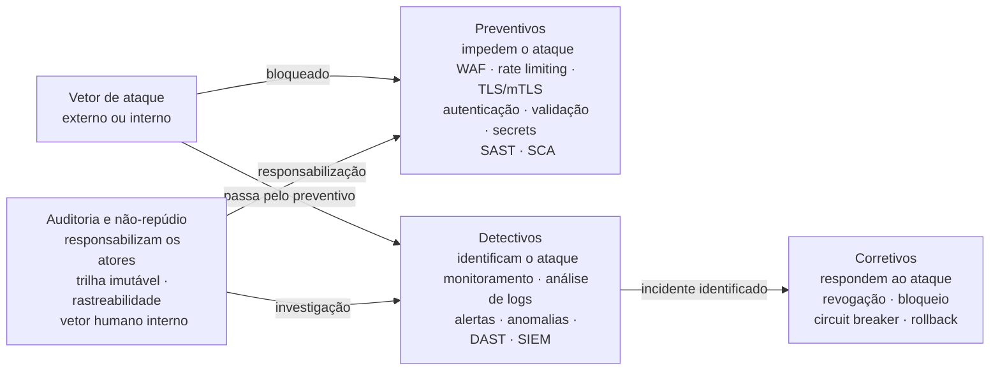

# Módulo 5 · Segurança de APIs
## Capítulo 5.2 · O arsenal de segurança de APIs — preventivo, detectivo e corretivo

> **Série:** Gerenciamento e Governança de APIs
> **Nível:** Técnico e operacional
> **Pré-requisito:** Cap 5.1 · Segurança como propriedade do design

---

## Sumário

- [5.2.1 · A taxonomia preventivo, detectivo e corretivo](#521--a-taxonomia-preventivo-detectivo-e-corretivo)
- [5.2.2 · Controles preventivos](#522--controles-preventivos)
- [5.2.3 · Controles detectivos](#523--controles-detectivos)
- [5.2.4 · Auditoria e não-repúdio — o vetor humano](#524--auditoria-e-não-repúdio--o-vetor-humano)
- [5.2.5 · Controles corretivos](#525--controles-corretivos)
- [5.2.6 · Defense in depth — os três tipos como sistema](#526--defense-in-depth--os-três-tipos-como-sistema)
- [Fontes e referências](#fontes-e-referências)

---

## 5.2.1 · A taxonomia preventivo, detectivo e corretivo

Controles de segurança não são intercambiáveis. Cada um tem uma função específica na arquitetura de segurança — e um controle que faz bem uma função não necessariamente faz bem outra. Organizar o arsenal de segurança pela função que cada controle desempenha — prevenir, detectar, corrigir — é mais útil do que listá-los como inventário de ferramentas, porque revela o que acontece quando qualquer tipo está ausente.

**Controles preventivos** atuam antes que o problema aconteça. Eles tentam impedir que um ataque chegue ao sistema, que um token inválido seja aceito, que um payload malformado cause dano. São o primeiro nível de defesa — e o mais visível.

**Controles detectivos** atuam durante ou depois que o problema aconteceu. Eles identificam que algo errado está acontecendo — ou já aconteceu — através da análise de comportamento, logs e padrões anômalos.

**Controles corretivos** atuam depois que o problema foi identificado. Eles respondem ao incidente, limitam o dano, restauram o serviço e previnem que o mesmo vetor seja usado novamente.

**Auditoria e não-repúdio** formam uma categoria transversal — presente tanto na dimensão detectiva quanto na preventiva. São o que garante que qualquer ação pode ser atribuída inequivocamente a um ator, incluindo atores internos autorizados. Tratamos essa dimensão em seção própria por sua importância e especificidade.

A ausência de qualquer tipo cria uma lacuna distinta. Um portfólio apenas com controles preventivos é cego ao que já passou pelos controles. Um portfólio sem auditoria é incapaz de responsabilizar atores internos ou investigar incidentes com profundidade.

Uma limitação estrutural importante confirmada pela pesquisa: WAFs tradicionais foram projetados para detectar vulnerabilidades por assinatura e têm dificuldade fundamental de bloquear ataques que parecem requisições legítimas — como IDOR, mass assignment e abuso de lógica de negócio. Controles preventivos complementam design seguro, não o substituem.

---

## 5.2.2 · Controles preventivos

---

### WAF — Web Application Firewall para APIs

O WAF opera inspecionando o tráfego HTTP/HTTPS antes que chegue à aplicação. Usando rulesets — o OWASP Core Rule Set é o mais amplamente adotado — o WAF detecta e bloqueia padrões conhecidos de ataque: injeção de SQL, cross-site scripting, path traversal, cabeçalhos malformados. O ModSecurity, transferido para a OWASP em 2024, é o engine open source de referência.

> *OWASP ModSecurity Project. Disponível em: [owasp.org/www-project-modsecurity](https://owasp.org/www-project-modsecurity/)*

O que o WAF faz bem: bloquear ataques por assinatura conhecida, filtrar payloads com padrões de injeção, detectar ferramentas de scanning automatizado, limitar exposição a CVEs conhecidos.

O que o WAF não consegue fazer: detectar IDOR — uma requisição legítima com ID de outro usuário é indistinguível de uma requisição normal; detectar mass assignment — um payload com campos extras mas sem padrões de injeção passa pelo WAF; detectar abuso de lógica de negócio. Essas são limitações estruturais, não de implementação.

---

### Rate limiting e throttling

**Rate limiting** define o número máximo de requisições que um consumidor pode fazer em uma janela de tempo. Quando o limite é atingido, as requisições são rejeitadas com 429 Too Many Requests.

**Throttling** reduz a velocidade de processamento quando o sistema está sob pressão — em vez de rejeitar, processa mais lentamente para proteger recursos.

A granularidade do rate limiting é crítica para sua eficácia:

**Por consumidor** — garante que nenhum consumidor individual pode monopolizar a capacidade ou realizar enumeração em escala. É o controle mais importante.

**Por operação** — operações sensíveis merecem limites mais restritivos. Um endpoint de autenticação merece limites muito mais restritivos do que um endpoint de leitura.

**Por IP** — útil para ataques de credential stuffing sem token. Complementa o rate limit por consumidor, não o substitui.

---

### TLS e mTLS

O TLS — Transport Layer Security — garante confidencialidade e integridade do tráfego em trânsito. A versão 1.3, especificada no RFC 8446 em agosto de 2018, é a versão atual e a única que deve ser aceita em APIs novas. TLS 1.0 e 1.1 são considerados inseguros e devem ser desabilitados.

> *Rescorla, E. The Transport Layer Security (TLS) Protocol Version 1.3. RFC 8446, agosto 2018. Disponível em: [datatracker.ietf.org/doc/html/rfc8446](https://datatracker.ietf.org/doc/html/rfc8446)*

**mTLS — mutual TLS** adiciona autenticação mútua: o servidor também verifica a identidade do cliente através de um certificado. Cria uma camada de autenticação antes mesmo que a requisição chegue à camada de aplicação. Especialmente relevante para comunicação entre serviços e ambientes Zero Trust. O RFC 8705 formaliza o uso de mTLS em contextos OAuth.

---

### Validação de input

Validação de input no gateway complementa — nunca substitui — a validação na aplicação. O gateway pode validar: formato e tipo de parâmetros, presença de headers obrigatórios, tamanho máximo do payload, e conformidade com o schema OpenAPI declarado.

A combinação de validação no gateway com `additionalProperties: false` no schema — como discutido no Cap 5.1 — rejeita automaticamente payloads com campos não declarados, reduzindo a superfície de mass assignment sem código adicional na aplicação.

---

### Secrets management — gestão de credenciais

Secrets expostos em código-fonte, logs ou repositórios públicos representam uma falha que nenhum outro controle compensa. O NIST SP 800-57 — Recommendation for Key Management — é a referência normativa para gestão de chaves e credenciais.

> *Barker, E. Recommendation for Key Management: Part 1 – General. NIST SP 800-57 Part 1 Rev. 5, maio 2020. Disponível em: [csrc.nist.gov/pubs/sp/800/57/pt1/r5/final](https://csrc.nist.gov/pubs/sp/800/57/pt1/r5/final)*

Princípios fundamentais: secrets nunca em código-fonte; rotação periódica e automática seguindo crypto-periods; revogação imediata em caso de comprometimento; least privilege aplicado a credenciais — cada serviço acessa apenas os secrets que precisa.

---

### Análise de código — SAST e SCA

A análise de código-fonte como controle de segurança é a implementação mais concreta do princípio shift-left: encontrar vulnerabilidades quando ainda é mais barato e menos arriscado corrigi-las. O NIST SP 800-218 — Secure Software Development Framework (SSDF) v1.1 — publicado em fevereiro de 2022, é a referência normativa que formaliza a integração de ferramentas de análise de código no SDLC.

> *Souppaya, M., Scarfone, K. & Dodson, D. Secure Software Development Framework (SSDF) v1.1. NIST SP 800-218, fevereiro 2022. Disponível em: [doi.org/10.6028/NIST.SP.800-218](https://doi.org/10.6028/NIST.SP.800-218)*

**SAST — Static Application Security Testing**

SAST analisa o código-fonte sem executá-lo — identificando vulnerabilidades durante o desenvolvimento, antes do deploy. Opera como white-box testing: tem acesso ao código completo e pode realizar análise de fluxo de dados, rastreamento de taint e análise de control-flow para identificar caminhos que levam a vulnerabilidades.

No contexto de APIs: SAST identifica injeção de SQL em queries, uso inseguro de dependências, ausência de validação de input, hard-coded secrets, e padrões que levam a mass assignment. É um gate natural no pipeline de CI/CD — executado em cada pull request, antes do merge.

**SCA — Software Composition Analysis**

Com a maioria do código moderno composto de dependências open source, SCA analisa o grafo de dependências do projeto para identificar componentes com CVEs conhecidos, licenças incompatíveis e versões desatualizadas.

No contexto de APIs: uma dependência de serialização com vulnerabilidade de desserialização insegura pode comprometer toda a API. Uma biblioteca HTTP com CVE de SSRF pode ser explorada por um atacante. SCA é o controle que torna visível o risco da cadeia de fornecimento de software antes que chegue a produção.

A combinação SAST + SCA no pipeline de CI/CD cobre as duas principais fontes de vulnerabilidade preventivamente: o código que o time escreveu e o código que o time trouxe de terceiros.

---

## 5.2.3 · Controles detectivos

---

### Monitoramento de comportamento e anomalias

O monitoramento de segurança vai além de disponibilidade e latência — analisa padrões de comportamento para identificar atividade maliciosa mesmo quando tecnicamente válida.

Padrões que merecem atenção:

**Volume anômalo por consumidor** — um consumidor que normalmente faz 100 requisições por hora e de repente faz 10.000 pode estar realizando enumeração ou com credenciais comprometidas.

**Padrões sequenciais de identificadores** — requisições que percorrem IDs em sequência numérica são sinal claro de tentativa de enumeração.

**Acessos em horários atípicos** — um consumidor que normalmente opera em horário comercial e passa a fazer requisições às 3h pode ter credenciais comprometidas.

**Padrão de erros de autenticação** — múltiplas tentativas com credenciais diferentes em sequência rápida — credential stuffing.

---

### Análise de logs de segurança

O NIST SP 800-92 — Guide to Computer Security Log Management — é a referência normativa para gestão de logs de segurança.

> *Kent, K. & Souppaya, M. Guide to Computer Security Log Management. NIST SP 800-92, setembro 2006. Disponível em: [csrc.nist.gov/pubs/sp/800/92/final](https://csrc.nist.gov/pubs/sp/800/92/final)*

O que registrar em logs de segurança de APIs, para cada requisição: timestamp com precisão de milissegundos, identificador do consumidor, endpoint e método HTTP, código de resposta, tamanho do payload, latência e correlation ID.

O que **não** registrar: tokens de autenticação, payloads completos com dados sensíveis e stack traces em logs de acesso.

---

### DAST — Dynamic Application Security Testing

DAST testa a aplicação em execução simulando o comportamento de um atacante externo — sem acesso ao código-fonte. Opera como black-box testing: envia requisições e analisa as respostas para identificar vulnerabilidades que só se manifestam em runtime.

No contexto de APIs: DAST identifica configurações inseguras de CORS, endpoints que retornam dados de autenticação em respostas de erro, vulnerabilidades de injeção que o SAST não detectou, e comportamentos inesperados sob condições de input anômalo.

DAST é mais eficaz quando aplicado a ambientes que reproduzem fielmente a produção — staging com dados e configurações representativos. Diferente do SAST, que é executado em cada commit, DAST tipicamente é executado em cadências menos frequentes devido ao tempo de execução e ao risco de efeitos colaterais em dados de teste.

A combinação SAST + DAST é recomendada pelo NIST SSDF e pela literatura de segurança de aplicações como cobertura complementar: SAST encontra vulnerabilidades no código antes da execução; DAST confirma quais são exploráveis em runtime.

> *OWASP Foundation. OWASP Web Security Testing Guide v4. Disponível em: [owasp.org/www-project-web-security-testing-guide](https://owasp.org/www-project-web-security-testing-guide/)*

---

### SIEM e correlação de eventos

SIEM — Security Information and Event Management — centraliza logs de múltiplas fontes e correlaciona eventos para identificar padrões não visíveis em cada fonte individualmente. Para APIs, é especialmente útil quando o portfólio é grande e ataques distribuídos — que ficam abaixo dos limites individuais de cada API — só são detectáveis pela correlação entre APIs.

O SIEM é uma plataforma que transcende o contexto de APIs — é parte da estratégia de segurança de toda a organização de TI. Seu detalhamento completo, incluindo arquiteturas, critérios de adoção e integração com programas de APIs, está no **[Anexo F · SIEM e correlação de eventos de segurança](../anexos/f_siem.md)**.

---

## 5.2.4 · Auditoria e não-repúdio — o vetor humano

Controles preventivos e detectivos são projetados primariamente contra ameaças externas. Mas uma das ameaças mais significativas para sistemas de informação é interna: o ator com acesso legítimo que age de forma maliciosa, negligente ou além de suas permissões.

Um administrador insatisfeito com acesso a credenciais de produção. Um desenvolvedor com permissões excessivas que acessa dados que não deveria. Um parceiro com escopos amplos que extrai dados além do necessário para seu caso de uso. Esses vetores têm em comum que passam pelos controles preventivos — porque têm credenciais válidas — e frequentemente passam pelos controles detectivos — porque o volume e o padrão de acesso podem parecer normais.

O que os diferencia de atacantes externos é que há um ator identificável responsável pelas ações. A auditoria e o não-repúdio são os controles que garantem que esse ator pode ser responsabilizado.

---

### O princípio de não-repúdio

Não-repúdio é a garantia de que uma ação pode ser atribuída inequivocamente a um ator específico de forma que esse ator não possa negar tê-la realizado. O NIST SP 800-53 Rev. 5 dedica o controle AU-10 explicitamente ao não-repúdio dentro da família Audit and Accountability.

> *NIST. Security and Privacy Controls for Information Systems and Organizations. NIST SP 800-53 Rev. 5, setembro 2020. Disponível em: [doi.org/10.6028/NIST.SP.800-53r5](https://doi.org/10.6028/NIST.SP.800-53r5)*

A família AU do NIST SP 800-53 define os controles de auditoria com precisão:

- **AU-2** — quais eventos devem ser registrados
- **AU-3** — o conteúdo obrigatório de cada registro: tipo de evento, timestamp, localização, origem, resultado e identidade do ator
- **AU-9** — proteção dos registros de auditoria contra modificação ou exclusão
- **AU-10** — não-repúdio: evidência irrefutável de que um ator realizou uma ação específica
- **AU-11** — retenção dos registros pelo período necessário

---

### O que uma trilha de auditoria de APIs precisa registrar

Para que o não-repúdio seja efetivo no contexto de APIs, cada ação com consequências de segurança precisa estar registrada com informação suficiente para atribuição inequívoca:

**Identidade do ator** — não apenas o IP ou o client_id do sistema consumidor, mas a identidade do usuário humano quando aplicável. Em sistemas com autenticação delegada, o sub do JWT que identifica o usuário final é o que permite responsabilização individual.

**A ação realizada** — qual operação foi chamada, qual recurso foi acessado ou modificado, qual dado foi lido.

**O momento exato** — timestamp sincronizado com servidor de tempo confiável (AU-8 do NIST SP 800-53 trata explicitamente de sincronização de timestamps).

**O resultado** — sucesso, falha, e em casos de falha o motivo.

**O contexto** — de onde a requisição veio, qual versão da API foi usada, qual escopo estava no token.

---

### Proteção da trilha de auditoria

Uma trilha de auditoria que pode ser modificada pelo ator auditado não oferece não-repúdio. O controle AU-9 do NIST SP 800-53 estabelece explicitamente que os registros de auditoria devem ser protegidos contra acesso não autorizado, modificação e deleção.

No contexto de APIs, isso significa:

**Imutabilidade** — logs de auditoria não devem poder ser modificados por nenhum processo, incluindo os administradores do sistema auditado. Soluções de armazenamento com write-once semantics ou logs enviados para um sistema separado sem permissão de escrita reversa.

**Separação de duties** — quem administra as APIs não deve ter acesso de escrita aos logs de auditoria dessas mesmas APIs. A separação previne que um administrador malicioso apague evidências de suas próprias ações.

**Retenção adequada** — os registros precisam ser mantidos pelo período que a regulação e os requisitos de compliance determinam. Logs descartados prematuramente invalidam investigações forenses.

---

### O efeito dissuasório

Auditoria tem também uma dimensão preventiva que frequentemente é subestimada: a consciência de que todas as ações são registradas e podem ser revisadas tem efeito dissuasório sobre atores internos. Um administrador que sabe que cada acesso a dados de produção gera um registro auditável que pode ser revisado pela gestão ou por auditores externos tende a ser mais criterioso no uso de seus privilégios.

Esse efeito dissuasório é especialmente relevante para APIs com escopos administrativos ou com acesso a dados pessoais — onde a tentação de abuso de privilégio é maior e onde as consequências regulatórias de um vazamento interno são mais severas.

---

## 5.2.5 · Controles corretivos

---

### Revogação de tokens e credenciais

A capacidade de revogar tokens e credenciais rapidamente é o controle corretivo mais crítico em incidentes de segurança. Um token comprometido que não pode ser revogado é uma janela de vulnerabilidade que persiste até a expiração natural.

O design de tokens com vida curta — access tokens com expiração em minutos — reduz o impacto de um token comprometido. Mas não elimina a necessidade de revogação: em incidentes graves, mesmo minutos de exposição são inaceitáveis.

A RFC 7009 — OAuth 2.0 Token Revocation — define o protocolo padrão. O processo operacional de revogação deve ser documentado e testado antes de ser necessário em um incidente real.

---

### Bloqueio de IPs e consumidores

O bloqueio de IPs é eficaz para ataques com infraestrutura limitada. Para ataques com credenciais comprometidas, o bloqueio de consumidor — suspender um client_id específico — é mais eficaz, mas requer comunicação imediata com o consumidor legítimo para restaurar acesso com novas credenciais.

---

### Circuit breaker e isolamento de endpoints

Em incidentes onde um endpoint específico está sendo explorado ativamente, o isolamento temporário desse endpoint no gateway pode ser a ação corretiva mais rápida enquanto a vulnerabilidade é investigada. A decisão requer análise de impacto imediata — que o service mapping do Cap 4.3 habilita.

---

### Rollback de mudanças

Quando um incidente é causado por uma mudança recente — configuração de gateway, política de segurança removida, atualização de dependência com vulnerabilidade — o rollback para a versão anterior é frequentemente o controle corretivo mais rápido. Depende da maturidade do change management do Cap 4.4: Change Records com plano de reversão, versionamento de configurações e pipelines que permitem deploy da versão anterior rapidamente.

---

## 5.2.6 · Defense in depth — os três tipos como sistema

A taxonomia preventivo-detectivo-corretivo tem valor real apenas quando os três tipos operam como sistema. Cada tipo tem limitações que os outros compensam.

Controles preventivos não conseguem bloquear o que não reconhecem como ameaça. Controles detectivos não conseguem prevenir o dano inicial. Controles corretivos não conseguem desfazer o dano já causado. Auditoria não previne o ato — responsabiliza depois.

---

### Um cenário integrado

Um atacante obtém credenciais comprometidas de um consumidor legítimo e inicia extração de dados:

**Camada preventiva — detecção parcial:** o WAF não detecta nada — requisições com credenciais válidas sem padrões de injeção. Rate limit por consumidor não é violado — o atacante fica dentro dos limites. TLS está correto. Os controles preventivos não bloquearam porque o atacante parece legítimo.

**Camada detectiva — alerta:** monitoramento comportamental identifica volume dobrado nas últimas 2 horas, padrão sequencial de IDs e horário incomum. Alerta gerado. Time de segurança confirma comprometimento de credenciais.

**Auditoria — responsabilização e investigação:** a trilha de auditoria mostra exatamente quais objetos foram acessados, com timestamps precisos. Evidência irrefutável para análise forense, notificação regulatória e, se aplicável, ação legal.

**Camada corretiva — resposta:** credenciais revogadas via RFC 7009. Consumidor legítimo notificado. Logs preservados. Volume de dados potencialmente expostos avaliado para obrigações de notificação.

O post-mortem identifica: alertas comportamentais poderiam ter sido mais sensíveis; a auditoria forneceu evidência completa que o monitoramento operacional não teria.

---

## Pontos-chave do capítulo

- A taxonomia preventivo-detectivo-corretivo organiza controles pela função que desempenham. Auditoria e não-repúdio formam uma categoria transversal que responsabiliza atores — incluindo internos autorizados
- WAF tem limitações estruturais para APIs: não detecta IDOR, mass assignment nem lógica de negócio. É controle complementar, não substituto de design seguro
- SAST e SCA são controles preventivos que pertencem ao pipeline de CI/CD: SAST encontra vulnerabilidades no código que o time escreveu; SCA encontra vulnerabilidades no código de terceiros que o time usa. O NIST SP 800-218 (SSDF) formaliza sua integração no SDLC
- DAST é controle detectivo que testa a aplicação em execução — confirmando quais vulnerabilidades são exploráveis em runtime. Complementar ao SAST, não substituto
- Auditoria e não-repúdio — formalizados na família AU do NIST SP 800-53 — são os controles que protegem contra o vetor humano interno. A trilha de auditoria precisa ser imutável, com identidade do ator, ação, timestamp e resultado. Seu efeito dissuasório tem também dimensão preventiva
- O SIEM é tratado com profundidade no [Anexo F](../anexos/f_siem.md), por transcender o contexto específico de APIs
- Defense in depth: nenhum tipo de controle é suficiente isoladamente. A eficácia de cada tipo depende dos outros dois

---

## Fontes e referências

| Fonte | Referência completa |
|---|---|
| **OWASP API Security Top 10 (2023)** | OWASP Foundation. *OWASP API Security Top 10 2023*. Disponível em: [owasp.org/www-project-api-security](https://owasp.org/www-project-api-security/) |
| **OWASP ModSecurity** | OWASP Foundation. *OWASP ModSecurity Project*. Disponível em: [owasp.org/www-project-modsecurity](https://owasp.org/www-project-modsecurity/) |
| **RFC 8446 — TLS 1.3 (2018)** | Rescorla, E. *The Transport Layer Security (TLS) Protocol Version 1.3*. RFC 8446, agosto 2018. Disponível em: [datatracker.ietf.org/doc/html/rfc8446](https://datatracker.ietf.org/doc/html/rfc8446) |
| **RFC 8705 — mTLS OAuth (2020)** | Campbell, B. et al. *OAuth 2.0 Mutual-TLS Client Authentication and Certificate-Bound Access Tokens*. RFC 8705, fevereiro 2020. Disponível em: [datatracker.ietf.org/doc/html/rfc8705](https://datatracker.ietf.org/doc/html/rfc8705) |
| **NIST SP 800-57 Pt1 Rev.5 (2020)** | Barker, E. *Recommendation for Key Management: Part 1 – General*. NIST SP 800-57 Part 1 Revision 5, maio 2020. Disponível em: [csrc.nist.gov/pubs/sp/800/57/pt1/r5/final](https://csrc.nist.gov/pubs/sp/800/57/pt1/r5/final) |
| **NIST SP 800-218 — SSDF (2022)** | Souppaya, M., Scarfone, K. & Dodson, D. *Secure Software Development Framework (SSDF) v1.1*. NIST SP 800-218, fevereiro 2022. Disponível em: [doi.org/10.6028/NIST.SP.800-218](https://doi.org/10.6028/NIST.SP.800-218) |
| **NIST SP 800-53 Rev. 5 (2020)** | NIST. *Security and Privacy Controls for Information Systems and Organizations*. NIST SP 800-53 Rev. 5, setembro 2020. Disponível em: [doi.org/10.6028/NIST.SP.800-53r5](https://doi.org/10.6028/NIST.SP.800-53r5) |
| **NIST SP 800-92 (2006)** | Kent, K. & Souppaya, M. *Guide to Computer Security Log Management*. NIST SP 800-92, setembro 2006. Disponível em: [csrc.nist.gov/pubs/sp/800/92/final](https://csrc.nist.gov/pubs/sp/800/92/final) |
| **OWASP Testing Guide v4** | OWASP Foundation. *OWASP Web Security Testing Guide v4*. Disponível em: [owasp.org/www-project-web-security-testing-guide](https://owasp.org/www-project-web-security-testing-guide/) |
| **RFC 7009 — Token Revocation** | Lodderstedt, T. & Dronia, S. *OAuth 2.0 Token Revocation*. RFC 7009, agosto 2013. Disponível em: [datatracker.ietf.org/doc/html/rfc7009](https://datatracker.ietf.org/doc/html/rfc7009) |

---

## Próximo capítulo

**5.3 · OWASP API Security Top 10 — os riscos mais críticos** — análise profunda das dez categorias de risco mais prevalentes em APIs, com causa raiz, padrão de exploração e mitigação para cada uma.

---

*Série: Gerenciamento e Governança de APIs · Módulo 5 · Capítulo 5.2*