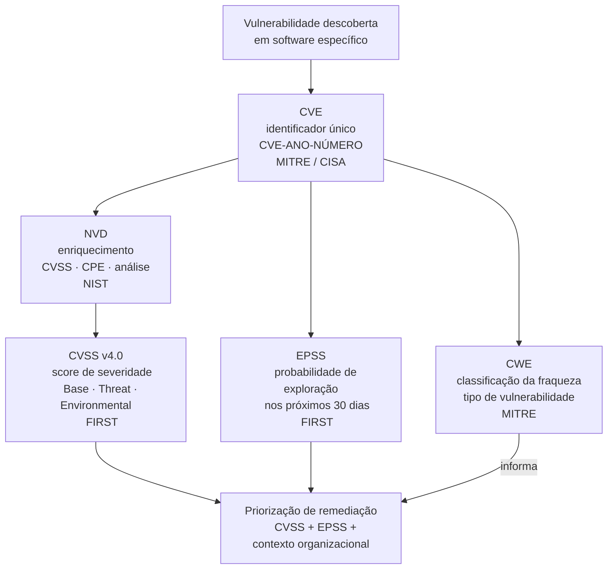

# Módulo 5 · Segurança de APIs
## Capítulo 5.3 · OWASP API Security Top 10 — os riscos mais críticos

> **Série:** Gerenciamento e Governança de APIs
> **Nível:** Técnico e estratégico
> **Pré-requisito:** Cap 5.1 · Cap 5.2

---

## Sumário

- [5.3.1 · O ecossistema de vulnerabilidades conhecidas](#531--o-ecossistema-de-vulnerabilidades-conhecidas)
- [5.3.2 · Como ler e usar uma entrada CVE](#532--como-ler-e-usar-uma-entrada-cve)
- [5.3.3 · OWASP API Security Top 10 2023 — o ranking e sua metodologia](#533--owasp-api-security-top-10-2023--o-ranking-e-sua-metodologia)
- [5.3.4 · As dez categorias — visão panorâmica](#534--as-dez-categorias--visão-panorâmica)
- [5.3.5 · Como usar o Top 10 na governança de APIs](#535--como-usar-o-top-10-na-governança-de-apis)
- [Fontes e referências](#fontes-e-referências)

---

## 5.3.1 · O ecossistema de vulnerabilidades conhecidas

Antes de entrar no OWASP API Security Top 10, é necessário compreender o ecossistema de sistemas que organiza o conhecimento sobre vulnerabilidades na indústria. Esses sistemas são a infraestrutura que conecta a descoberta de uma vulnerabilidade específica — em uma biblioteca, em um framework, em um padrão de design — ao processo de priorização e remediação de qualquer organização.

---

### CVE — Common Vulnerabilities and Exposures

O CVE é o sistema de identificação única de vulnerabilidades de segurança publicamente conhecidas. Mantido pelo MITRE e patrocinado pela CISA, cada entrada CVE recebe um identificador único no formato `CVE-ANO-NÚMERO` — por exemplo, `CVE-2021-44228` para a vulnerabilidade Log4Shell.

O CVE não descreve vulnerabilidades em profundidade — é um dicionário de referência. Seu valor está em fornecer um identificador comum que permite que diferentes organizações, ferramentas e bancos de dados referenciem a mesma vulnerabilidade sem ambiguidade.

> *CVE Program. The MITRE Corporation / CISA. Disponível em: [cve.org](https://www.cve.org/)*

**CNAs — CVE Numbering Authorities**

Organizações credenciadas pelo MITRE podem emitir CVE IDs diretamente para vulnerabilidades em seus próprios produtos. Grandes fornecedores de software, projetos open source de alta relevância e organizações de pesquisa de segurança são CNAs. Isso acelera o processo de publicação mas também significa que a qualidade e completude das entradas CVE varia.

---

### NVD — National Vulnerability Database

O NVD é o banco de dados do NIST que enriquece as entradas CVE com informação adicional: score de severidade CVSS, análise técnica, referências a patches e produtos afetados via CPE — Common Platform Enumeration.

> *National Vulnerability Database. NIST. Disponível em: [nvd.nist.gov](https://nvd.nist.gov/)*

**Uma nota importante sobre as limitações atuais do NVD**

O crescimento de 263% nas submissões de CVEs entre 2020 e 2025 gerou um backlog significativo no NVD. Em 2024 o NIST anunciou mudanças na priorização de enriquecimento — CVEs de menor prioridade podem não receber análise imediata. Isso significa que o NVD não pode mais ser tratado como única fonte de verdade para vulnerabilidades.

Fontes complementares relevantes para programas de APIs:
- **OSV — Open Source Vulnerabilities** — [osv.dev](https://osv.dev) — foco em dependências open source
- **GitHub Advisory Database** — vulnerabilidades em pacotes de múltiplos ecossistemas
- **Bancos de dados por ecossistema** — npm Advisory, PyPI Advisory, Maven Central

---

### CVSS — Common Vulnerability Scoring System

O CVSS é o sistema de pontuação de severidade de vulnerabilidades, mantido pelo FIRST. A versão 4.0, lançada em novembro de 2023, é a mais recente e introduz quatro grupos de métricas:

> *FIRST. Common Vulnerability Scoring System Version 4.0. Disponível em: [first.org/cvss/v4.0](https://www.first.org/cvss/v4.0/)*

**Base** — características intrínsecas da vulnerabilidade, constantes no tempo e entre ambientes. Inclui vetores de ataque, complexidade, privilégios necessários, interação do usuário e impacto em confidencialidade, integridade e disponibilidade. Produz um score de 0 a 10.

**Threat** — reflete a situação atual de ameaça: existência de exploit público, maturidade do exploit. Ajusta o score base com contexto de ameaça real.

**Environmental** — características específicas do ambiente do consumidor: importância do sistema, controles mitigadores existentes. Permite que cada organização ajuste o score ao seu contexto específico.

**Supplemental** — métricas adicionais que fornecem contexto sem afetar o score numérico: automação possível, impacto em segurança física, impacto em privacidade.

**A armadilha do score base isolado**

O erro mais comum é usar apenas o CVSS Base Score para priorizar remediações. Um score de 9.8 indica severidade máxima nas condições mais adversas — mas pode estar em uma biblioteca que sua organização não usa, em um componente sem exposição externa, ou em uma vulnerabilidade sem exploit conhecido. O score base é um ponto de partida, não uma decisão.

---

### CWE — Common Weakness Enumeration

O CWE é a taxonomia de fraquezas de software e hardware mantida pelo MITRE. Onde o CVE identifica uma instância específica de vulnerabilidade, o CWE classifica o tipo de fraqueza que a originou.

> *MITRE. Common Weakness Enumeration. Disponível em: [cwe.mitre.org](https://cwe.mitre.org/)*

A versão 4.15, lançada em julho de 2024, cobre mais de 600 categorias. Exemplos relevantes para APIs:

- **CWE-639** — Authorization Bypass Through User-Controlled Key (IDOR/BOLA)
- **CWE-915** — Improperly Controlled Modification of Dynamically-Determined Object Attributes (Mass Assignment)
- **CWE-213** — Exposure of Sensitive Information Due to Incompatible Policies
- **CWE-89** — SQL Injection
- **CWE-287** — Improper Authentication

O CWE é o vocabulário que conecta os sistemas: CVEs referenciam CWEs para classificar o tipo de fraqueza. O OWASP Top 10 mapeia para CWEs. Ferramentas de SAST reportam findings por CWE.

---

### EPSS — Exploit Prediction Scoring System

O EPSS é um modelo de machine learning mantido pelo FIRST que estima a probabilidade de uma vulnerabilidade publicada ser explorada em ambiente real nos próximos 30 dias. Scores vão de 0 a 1 e são atualizados diariamente.

> *FIRST. Exploit Prediction Scoring System. Disponível em: [first.org/epss](https://www.first.org/epss/)*

O EPSS complementa o CVSS — onde o CVSS mede severidade potencial, o EPSS mede probabilidade de exploração real. A pesquisa que embasou o EPSS mostrou que apenas 2-7% das vulnerabilidades são exploradas na prática — mas sem EPSS, não há como saber quais. A combinação CVSS + EPSS é o padrão emergente de priorização:

- **CVSS alto + EPSS alto** → remediação imediata
- **CVSS alto + EPSS baixo** → monitorar, remediar no ciclo normal
- **CVSS baixo + EPSS alto** → atenção — atacantes estão usando, severidade teórica é baixa mas risco real é alto
- **CVSS baixo + EPSS baixo** → backlog de menor prioridade

---

### Como os sistemas se conectam

---

## 5.3.2 · Como ler e usar uma entrada CVE

Para tornar o ecossistema concreto, vamos percorrer um CVE real relevante para APIs. A vulnerabilidade Log4Shell — CVE-2021-44228 — é um dos casos mais documentados da história recente e ilustra como todos os sistemas funcionam em conjunto.

---

### O CVE

**CVE-2021-44228** — publicado em dezembro de 2021, afeta a biblioteca Apache Log4j2 nas versões 2.0-beta9 até 2.14.1. A vulnerabilidade permite execução remota de código via JNDI lookup em mensagens de log quando o atacante controla o conteúdo logado.

Para APIs Java que usavam Log4j2 para logging — um padrão extremamente comum — qualquer entrada de usuário que fosse logada poderia ser explorada para executar código arbitrário no servidor.

---

### O enriquecimento no NVD

O NVD enriqueceu o CVE-2021-44228 com:

**CVSS v3.1 Base Score: 10.0 (Critical)**
- Attack Vector: Network — explorável remotamente
- Attack Complexity: Low — sem condições especiais
- Privileges Required: None — não requer autenticação
- User Interaction: None — não requer interação
- Confidentiality / Integrity / Availability Impact: High

**CPE**: identifica todas as versões do Log4j2 afetadas, permitindo que ferramentas de SCA identifiquem automaticamente se uma dependência específica está vulnerável.

---

### A CWE

O CVE-2021-44228 mapeia para **CWE-917** — Improper Neutralization of Special Elements used in an Expression Language Statement. A CWE classifica a fraqueza como um problema de neutralização inadequada de elementos especiais — um tipo de injeção, mas via linguagem de expressão em vez de SQL ou HTML.

Compreender a CWE permite generalizar: qualquer sistema que usa expressões avaliadas dinamicamente com input não sanitizado tem o mesmo tipo de fraqueza, mesmo que o CVE específico não se aplique.

---

### O EPSS

O EPSS do CVE-2021-44228 atingiu scores próximos a 0.98 — 98% de probabilidade de exploração nos 30 dias seguintes à publicação. Exploits foram disponibilizados publicamente em horas após a divulgação. Para esse CVE específico, o EPSS confirmou o que o CVSS 10.0 indicava: remediação imediata era necessária.

---

### O que isso significa para um programa de APIs

Uma API Java que usava Log4j2 e logava qualquer input de usuário — cabeçalhos HTTP, parâmetros de query, campos de payload — estava vulnerável. O SCA do pipeline deveria ter identificado a dependência via CPE. O CVSS 10.0 e EPSS 0.98 juntos justificavam interrupção imediata do deploy e remediação emergencial.

---

## 5.3.3 · OWASP API Security Top 10 2023 — o ranking e sua metodologia

O OWASP API Security Top 10 é uma lista das dez categorias de risco mais críticas e prevalentes em APIs, publicada pela OWASP Foundation. A edição 2023 é a versão atual.

> *OWASP Foundation. OWASP API Security Top 10 2023. Disponível em: [owasp.org/www-project-api-security](https://owasp.org/www-project-api-security/)*

---

### O que o Top 10 é — e o que não é

**O Top 10 não é uma lista de CVEs.** Não identifica vulnerabilidades em produtos específicos — identifica categorias de risco que emergem de decisões de design e implementação que se repetem em APIs de todo tipo, independente da tecnologia.

**O Top 10 não é exaustivo.** Representa as categorias mais prevalentes e impactantes baseadas em dados de campo, relatórios de segurança e contribuições da comunidade — não todas as categorias possíveis de risco.

**O Top 10 mapeia para CWEs.** Cada categoria do Top 10 corresponde a um conjunto de CWEs que classificam as fraquezas subjacentes.

---

### A relação com o OWASP Web Application Top 10

O OWASP API Security Top 10 existe como lista separada do OWASP Web Application Top 10 porque APIs têm superfícies de ataque e padrões de vulnerabilidade distintos. Autenticação em APIs funciona diferente de autenticação em aplicações web. O conceito de objeto e autorização por objeto é específico de APIs. Abuso de lógica de negócio em APIs tem características próprias.

---

## 5.3.4 · As dez categorias — visão panorâmica

Para cada categoria: o que é, por que é crítica e qual é a mitigação principal. O aprofundamento com análise de causa raiz, padrões de exploração e exemplos detalhados está nos [Anexo G](../anexos/g_autorizacao_controle.md), [Anexo H](../anexos/h_exposicao_dados.md) e [Anexo I](../anexos/i_recursos_injecao_gestao.md).

---

### API1:2023 · Broken Object Level Authorization (BOLA)

**O que é:** Endpoints que retornam ou modificam objetos sem verificar se o consumidor autenticado tem autorização para aquele objeto específico. O consumidor manipula o identificador do objeto para acessar dados de outros usuários.

**Por que é crítica:** É a vulnerabilidade mais prevalente em APIs. Autenticação e rate limiting não resolvem — o consumidor está autenticado e faz requisições dentro dos limites.

**Mitigação principal:** Verificação de autorização por objeto em cada operação, no nível da aplicação. UUID em vez de IDs sequenciais reduz enumeração mas não substitui a verificação.

**CWEs associadas:** CWE-639, CWE-284
**Aprofundamento:** [Anexo G](../anexos/g_autorizacao_controle.md)

---

### API2:2023 · Broken Authentication

**O que é:** Mecanismos de autenticação implementados de forma incorreta ou incompleta — tokens sem expiração, secrets de JWT fracos, ausência de proteção contra credential stuffing, fluxos de autenticação com vulnerabilidades.

**Por que é crítica:** Autenticação quebrada compromete toda a segurança subsequente. Qualquer ator pode se passar por um consumidor legítimo.

**Mitigação principal:** Implementar padrões estabelecidos — OAuth 2.0, OIDC — sem customizações que introduzam fraquezas. Tokens com vida curta, rotação de refresh tokens, proteção contra força bruta.

**CWEs associadas:** CWE-287, CWE-798, CWE-330
**Aprofundamento:** [Anexo G](../anexos/g_autorizacao_controle.md)

---

### API3:2023 · Broken Object Property Level Authorization

**O que é:** Endpoints que expõem propriedades de objetos além do necessário (exposição excessiva) ou que aceitam e processam propriedades que o consumidor não deveria poder alterar (mass assignment).

**Por que é crítica:** Combine exposição excessiva com mass assignment e um consumidor pode descobrir campos internos via leitura e manipulá-los via escrita.

**Mitigação principal:** Schemas de resposta e entrada específicos por caso de uso, não reflexos do modelo de dados interno. `additionalProperties: false` nos schemas de entrada.

**CWEs associadas:** CWE-213, CWE-915
**Aprofundamento:** [Anexo H](../anexos/h_exposicao_dados.md)

---

### API4:2023 · Unrestricted Resource Consumption

**O que é:** Ausência de limites de consumo de recursos — rate limiting insuficiente, payloads sem limite de tamanho, queries sem limite de profundidade ou complexidade, operações que consomem recursos externos sem controle.

**Por que é crítica:** Permite negação de serviço, aumenta custos operacionais e cria vetores de abuso financeiro em APIs com custo por uso.

**Mitigação principal:** Rate limiting granular por consumidor e operação, limites de tamanho de payload, paginação obrigatória, timeout em operações longas.

**CWEs associadas:** CWE-770, CWE-400
**Aprofundamento:** [Anexo I](../anexos/i_recursos_injecao_gestao.md)

---

### API5:2023 · Broken Function Level Authorization

**O que é:** Controles de autorização insuficientes em nível de função ou endpoint — endpoints administrativos acessíveis por usuários comuns, diferenciação inadequada entre funções de leitura e escrita.

**Por que é crítica:** Diferente de BOLA que é horizontal (acessar objetos de outros usuários do mesmo nível), BFLA é vertical — acessar funções de um nível de privilégio superior.

**Mitigação principal:** Verificação explícita de autorização baseada em função para cada endpoint, não apenas autenticação. Escopos OAuth granulares por operação.

**CWEs associadas:** CWE-285, CWE-269
**Aprofundamento:** [Anexo G](../anexos/g_autorizacao_controle.md)

---

### API6:2023 · Unrestricted Access to Sensitive Business Flows

**O que é:** Fluxos de negócio sensíveis — cadastro em massa, compra de itens com desconto, votação repetida — acessíveis sem controles adequados de frequência ou detecção de abuso.

**Por que é crítica:** Não é uma vulnerabilidade técnica clássica — é abuso de funcionalidade legítima. WAF e rate limiting genérico não detectam porque cada requisição individual é válida.

**Mitigação principal:** Identificar os fluxos de negócio de maior valor e risco. Implementar controles específicos: CAPTCHA, device fingerprinting, detecção de padrões de automação.

**CWEs associadas:** CWE-770, CWE-799
**Aprofundamento:** [Anexo H](../anexos/h_exposicao_dados.md)

---

### API7:2023 · Server Side Request Forgery (SSRF)

**O que é:** A API aceita uma URL como input e realiza uma requisição para essa URL do lado do servidor, sem validar adequadamente o destino. O atacante pode usar o servidor como proxy para acessar recursos internos.

**Por que é crítica:** Em ambientes cloud, SSRF pode acessar o metadata service do provedor e obter credenciais temporárias de alta privilégio.

**Mitigação principal:** Validação rigorosa de URLs aceitas como input — allowlist de destinos, bloqueio de IPs internos, metadados de cloud e loopback.

**CWEs associadas:** CWE-918
**Aprofundamento:** [Anexo I](../anexos/i_recursos_injecao_gestao.md)

---

### API8:2023 · Security Misconfiguration

**O que é:** Configurações inseguras em qualquer camada — CORS permissivo demais, headers de segurança ausentes, HTTPS desabilitado, permissões excessivas, mensagens de erro com stack traces, serviços desnecessários expostos.

**Por que é crítica:** É a categoria mais ampla — pode afetar qualquer componente do stack. Frequentemente resulta de defaults inseguros ou configuração realizada sob pressão de prazo.

**Mitigação principal:** Hardening de configuração como parte do pipeline. Revisão periódica de configurações. Headers de segurança obrigatórios. Ambientes de staging com configuração idêntica à produção.

**CWEs associadas:** CWE-16, CWE-614
**Aprofundamento:** [Anexo H](../anexos/h_exposicao_dados.md)

---

### API9:2023 · Improper Inventory Management

**O que é:** Shadow APIs — endpoints em produção sem documentação, sem owner, sem monitoramento. Versões antigas ativas que deveriam ter sido desativadas. APIs de terceiros consumidas sem avaliação de segurança.

**Por que é crítica:** É impossível proteger o que não se sabe que existe. Shadow APIs tipicamente não têm os controles de segurança que as APIs governadas têm — são a superfície de ataque invisível.

**Mitigação principal:** Descoberta ativa do portfólio real (Cap 4.8), catálogo como fonte de verdade, processo formal de sunset para versões antigas.

**CWEs associadas:** CWE-1059, CWE-710
**Aprofundamento:** [Anexo I](../anexos/i_recursos_injecao_gestao.md)

---

### API10:2023 · Unsafe Consumption of APIs

**O que é:** A organização consome APIs de terceiros sem aplicar os mesmos controles de segurança que aplica às suas próprias APIs — confiando implicitamente nos dados retornados, não validando respostas, não tratando falhas de forma segura.

**Por que é crítica:** Um comprometimento de uma API de terceiro pode propagar-se para a organização se os dados retornados por essa API não forem tratados como não confiáveis.

**Mitigação principal:** Tratar dados de APIs de terceiros como input não confiável — validar, sanitizar, não confiar em respostas sem verificação. TLS obrigatório mesmo para APIs internas. Limites de timeout e circuit breaker.

**CWEs associadas:** CWE-345, CWE-346
**Aprofundamento:** [Anexo I](../anexos/i_recursos_injecao_gestao.md)

---

### Visão consolidada

| # | Categoria | Domínio | Anexo |
|---|---|---|---|
| API1 | Broken Object Level Authorization | Autorização | G |
| API2 | Broken Authentication | Autenticação | G |
| API3 | Broken Object Property Level Authorization | Dados / Propriedades | H |
| API4 | Unrestricted Resource Consumption | Recursos | I |
| API5 | Broken Function Level Authorization | Autorização | G |
| API6 | Unrestricted Access to Sensitive Business Flows | Lógica de negócio | H |
| API7 | Server Side Request Forgery | Injeção / SSRF | I |
| API8 | Security Misconfiguration | Configuração | H |
| API9 | Improper Inventory Management | Inventário | I |
| API10 | Unsafe Consumption of APIs | Dependências | I |

---

## 5.3.5 · Como usar o Top 10 na governança de APIs

O OWASP API Security Top 10 não é apenas um documento de referência — é uma ferramenta operacional para o programa de governança.

---

### Como alimenta o threat modeling

O Cap 5.1.3 introduziu o threat modeling com STRIDE como prática de design. O Top 10 enriquece esse processo: para cada operação do contrato, verificar se alguma das dez categorias se aplica é um checklist complementar ao STRIDE.

API1 (BOLA) → esta operação verifica autorização por objeto?
API2 (Autenticação) → o mecanismo de autenticação desta operação é robusto?
API3 (Propriedades) → o schema de resposta expõe apenas o necessário? O schema de entrada restringe campos?
API4 (Recursos) → há rate limiting definido para esta operação?

---

### Como alimenta os gates de pipeline

Os controles preventivos do Cap 5.2 — SAST, SCA, análise de spec — podem ser mapeados para categorias específicas do Top 10:

- **SAST** → detecta padrões que levam a API7 (SSRF), API2 (autenticação fraca), API8 (misconfiguration no código)
- **SCA** → detecta dependências com CVEs que se manifestam como API2, API7, API10
- **Lint de spec** → detecta API3 (schemas sem `additionalProperties: false`), API4 (ausência de rate limit declarado), API8 (ausência de security schemes)

---

### Como alimenta as políticas do CoE

O CoE usa o Top 10 como referência para políticas obrigatórias. Cada categoria pode ser traduzida em um requisito verificável:

- API1 → toda operação que acessa objetos por ID deve incluir verificação de ownership documentada no contrato
- API3 → toda spec deve usar `additionalProperties: false` em schemas de entrada
- API4 → toda operação deve declarar rate limits no contrato
- API9 → toda API deve estar registrada no catálogo antes de ir a produção

---

### Como alimenta revisões periódicas de segurança

O Top 10 é atualizado a cada poucos anos — a edição 2019 foi substituída pela edição 2023. O CoE deve revisar periodicamente se as políticas e gates existentes ainda cobrem adequadamente as categorias da versão mais recente, e se novas categorias introduzidas exigem novos controles.

---

## Pontos-chave do capítulo

- O ecossistema CVE/NVD/CVSS/CWE/EPSS é a infraestrutura que conecta descoberta de vulnerabilidades a priorização e remediação. Compreender como os sistemas se relacionam é prerequisito para usar qualquer ferramenta de segurança eficazmente
- O NVD tem limitações crescentes de cobertura — fontes complementares como OSV e bancos de dados por ecossistema são necessárias para cobertura abrangente de dependências
- CVSS mede severidade potencial. EPSS mede probabilidade de exploração real. A combinação dos dois é o padrão emergente de priorização — CVSS isolado leva a sub ou super-priorização
- O OWASP API Security Top 10 identifica categorias de risco que emergem de padrões de design e implementação, não vulnerabilidades em produtos específicos. Mapeia para CWEs e é atualizado periodicamente
- As dez categorias abrangem desde falhas de autorização (API1, API2, API5) a problemas de dados e configuração (API3, API6, API8) e gestão de recursos e ativos (API4, API7, API9, API10). O aprofundamento está nos [Anexo G](../anexos/g_autorizacao_controle.md), [Anexo H](../anexos/h_exposicao_dados.md) e [Anexo I](../anexos/i_recursos_injecao_gestao.md)
- O Top 10 é uma ferramenta operacional: alimenta o threat modeling, os gates de pipeline, as políticas do CoE e as revisões periódicas de segurança

---

## Fontes e referências

| Fonte | Referência completa |
|---|---|
| **OWASP API Security Top 10 (2023)** | OWASP Foundation. *OWASP API Security Top 10 2023*. Disponível em: [owasp.org/www-project-api-security](https://owasp.org/www-project-api-security/) |
| **CVE Program** | The MITRE Corporation / CISA. *Common Vulnerabilities and Exposures*. Disponível em: [cve.org](https://www.cve.org/) |
| **NVD** | NIST. *National Vulnerability Database*. Disponível em: [nvd.nist.gov](https://nvd.nist.gov/) |
| **CVSS v4.0** | FIRST. *Common Vulnerability Scoring System Version 4.0*. Novembro 2023. Disponível em: [first.org/cvss/v4.0](https://www.first.org/cvss/v4.0/) |
| **CWE** | The MITRE Corporation / CISA. *Common Weakness Enumeration*. Versão 4.15, julho 2024. Disponível em: [cwe.mitre.org](https://cwe.mitre.org/) |
| **EPSS** | FIRST. *Exploit Prediction Scoring System*. Disponível em: [first.org/epss](https://www.first.org/epss/) |
| **OSV** | Google. *Open Source Vulnerabilities*. Disponível em: [osv.dev](https://osv.dev/) |

---

## Próximo capítulo

**5.4 · Autenticação e autorização — os fundamentos** — OAuth 2.0, OIDC, JWT, mTLS. Decisões de design com trade-offs explícitos. Capítulo com profundidade especial.

---

*Série: Gerenciamento e Governança de APIs · Módulo 5 · Capítulo 5.3*