# Módulo 5 · Segurança de APIs
## Capítulo 5.4 · Autenticação e autorização — os fundamentos

> **Série:** Gerenciamento e Governança de APIs
> **Nível:** Técnico — profundidade especial
> **Pré-requisito:** Cap 5.1 · Cap 5.2 · Cap 5.3

---

## Sumário

- [5.4.1 · OAuth 2.0 — o framework de autorização](#541--oauth-20--o-framework-de-autorização)
- [5.4.2 · Tokens — tipos, estrutura e ciclo de vida](#542--tokens--tipos-estrutura-e-ciclo-de-vida)
- [5.4.3 · Validação de tokens](#543--validação-de-tokens)
- [5.4.4 · OpenID Connect — a camada de identidade](#544--openid-connect--a-camada-de-identidade)
- [5.4.5 · Grant types em detalhe — quando usar cada um](#545--grant-types-em-detalhe--quando-usar-cada-um)
- [5.4.6 · mTLS e proof-of-possession](#546--mtls-e-proof-of-possession)
- [5.4.7 · Provedores de identidade e diretórios](#547--provedores-de-identidade-e-diretórios)
- [5.4.8 · SAML e a ponte para OAuth 2.0](#548--saml-e-a-ponte-para-oauth-20)
- [5.4.9 · Propagação de identidade em microserviços](#549--propagação-de-identidade-em-microserviços)
- [5.4.10 · Decisões de design — trade-offs explícitos](#5410--decisões-de-design--trade-offs-explícitos)
- [5.4.11 · Erros comuns e como evitá-los](#5411--erros-comuns-e-como-evitá-los)
- [Fontes e referências](#fontes-e-referências)

---

## 5.4.1 · OAuth 2.0 — o framework de autorização

### O problema que o OAuth resolve

Antes do OAuth, o padrão para que uma aplicação agisse em nome de um usuário era simples e perigoso: o usuário fornecia sua senha à aplicação. A aplicação armazenava essa senha, usava-a indefinidamente e tinha acesso irrestrito a tudo que o usuário tinha acesso. Não havia como revogar o acesso sem trocar a senha. Não havia como limitar o que a aplicação podia fazer. Qualquer comprometimento da aplicação comprometia as credenciais do usuário.

O OAuth 2.0 — definido no RFC 6749 em outubro de 2012 — resolve esse problema introduzindo uma camada de autorização separada. O usuário nunca fornece suas credenciais à aplicação — aprova um acesso específico com escopo e prazo definidos. A aplicação recebe um token que representa esse acesso, não as credenciais do usuário.

> *Hardt, D. (Ed.). The OAuth 2.0 Authorization Framework. RFC 6749, outubro 2012. Disponível em: [datatracker.ietf.org/doc/html/rfc6749](https://datatracker.ietf.org/doc/html/rfc6749)*

---

### Os quatro papéis do OAuth 2.0

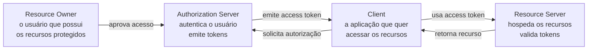

**Resource Owner** — quem possui os recursos. Tipicamente o usuário humano, mas pode ser a própria organização em fluxos M2M.

**Client** — a aplicação que quer acessar os recursos. Pode ser uma aplicação web, mobile, desktop ou outro serviço. O Client nunca vê as credenciais do Resource Owner.

**Authorization Server** — valida a identidade do Resource Owner, obtém sua autorização e emite tokens. É o componente central do ecossistema OAuth.

**Resource Server** — hospeda os recursos protegidos — as APIs. Valida os tokens recebidos e decide se concede ou nega o acesso.

---

### A separação entre autenticação e autorização

OAuth 2.0 é um framework de **autorização** — não de autenticação. Essa distinção é fundamental e frequentemente mal compreendida.

**Autorização** responde: "o que esta aplicação pode fazer?"
**Autenticação** responde: "quem é este usuário?"

O OAuth 2.0 responde à primeira pergunta. A segunda é respondida pelo OpenID Connect — tratado no 5.4.4. Usar o access token OAuth como prova de identidade do usuário é um erro de design que o OWASP documenta como vulnerabilidade.

---

## 5.4.2 · Tokens — tipos, estrutura e ciclo de vida

### Os três tipos de token

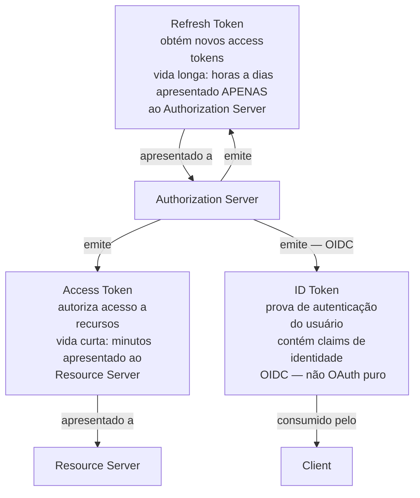

Cada token tem um propósito específico e uma audiência específica. Confundir os três — especialmente usar o ID Token como access token — é um erro de design comum com implicações de segurança.

---

### Tokens opacos vs. JWT

O RFC 6749 deliberadamente não define o formato do access token — é uma string opaca do ponto de vista do Client. Na prática, há duas abordagens:

**Token opaco** — uma string aleatória sem estrutura legível. O Resource Server precisa chamar o Authorization Server (endpoint de introspection — RFC 7662) para validar o token e obter seus metadados a cada requisição.

**JWT — JSON Web Token** — um token estruturado e auto-contido que o Resource Server pode validar localmente sem chamar o Authorization Server, usando a chave pública disponível no JWKS endpoint.

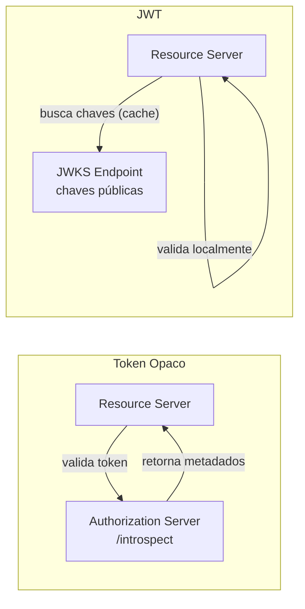

| | Token Opaco | JWT |
|---|---|---|
| Validação | Requer chamada ao AS | Local — sem rede |
| Revogação | Imediata | Depende da expiração |
| Tamanho | Pequeno | Maior |
| Privacidade | Claims não expostos ao RS | Claims visíveis ao RS |
| Latência | Maior — roundtrip ao AS | Menor — validação local |

---

### Anatomia do JWT

O JWT — definido no RFC 7519 — tem três partes separadas por pontos, cada uma codificada em Base64url:

```
eyJhbGciOiJSUzI1NiIsInR5cCI6IkpXVCIsImtpZCI6ImFiYzEyMyJ9
.
eyJpc3MiOiJodHRwczovL2F1dGguZW1wcmVzYS5jb20iLCJzdWIiOiJ1c3VhcmlvLTEyMyIsImF1ZCI6Imh0dHBzOi8vYXBpLmVtcHJlc2EuY29tIiwiZXhwIjoxNjg5MDAwMDAwLCJpYXQiOjE2ODkwMDAwMDAsImp0aSI6InVuaXF1ZS1pZC0xMjMiLCJzY29wZSI6InBlZGlkb3M6cmVhZCJ9
.
[assinatura]
```

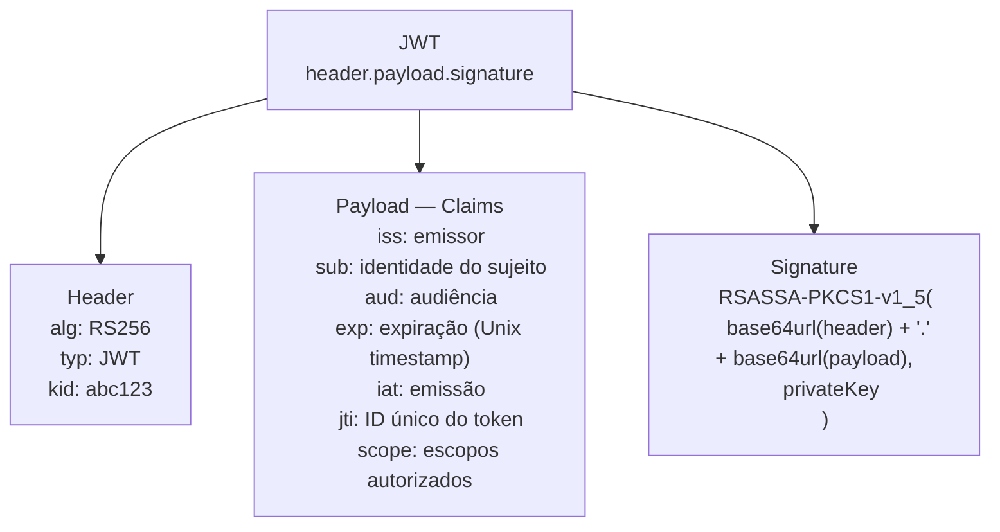

**Claims obrigatórios e suas semânticas:**

`iss` — Issuer. Identifica o Authorization Server que emitiu o token. O Resource Server deve verificar que o `iss` é o AS esperado — não aceitar tokens de qualquer emissor.

`sub` — Subject. Identifica o sujeito do token — o usuário ou o cliente M2M. Em fluxos com usuário humano, é o identificador único do usuário no AS. Em Client Credentials, é o identificador do cliente.

`aud` — Audience. Identifica os destinatários do token. O Resource Server deve verificar que seu identificador está no `aud`. Um token com `aud: api-pagamentos` não deve ser aceito pela `api-pedidos` — isso é audience confusion.

`exp` — Expiration. Unix timestamp após o qual o token não deve ser aceito. A validação do `exp` é obrigatória — um token expirado deve ser rejeitado mesmo com assinatura válida.

`iat` — Issued At. Quando o token foi emitido. Útil para detectar tokens emitidos no futuro ou com tempo de emissão incomum.

`jti` — JWT ID. Identificador único do token. Permite implementar token blacklisting após revogação e detectar replay attacks.

`scope` — Os escopos autorizados. Define o que o portador do token pode fazer.

---

### JWT Profile para Access Tokens — RFC 9068

O RFC 6749 não especificou o formato do access token. Por anos, cada Authorization Server usou uma estrutura de JWT diferente, tornando a interoperabilidade difícil. O RFC 9068 — publicado em 2021 — define um perfil padrão para JWTs usados como access tokens OAuth 2.0.

> *Bertocci, V. JSON Web Token (JWT) Profile for OAuth 2.0 Access Tokens. RFC 9068, outubro 2021. Disponível em: [rfc-editor.org/rfc/rfc9068.html](https://www.rfc-editor.org/rfc/rfc9068.html)*

O RFC 9068 adiciona ao JWT padrão os claims específicos de access token: `client_id` (o cliente que obteve o token), `auth_time` (quando o usuário se autenticou), e define semântica precisa para `sub` e `scope` no contexto de access tokens.

---

### Ciclo de vida de tokens

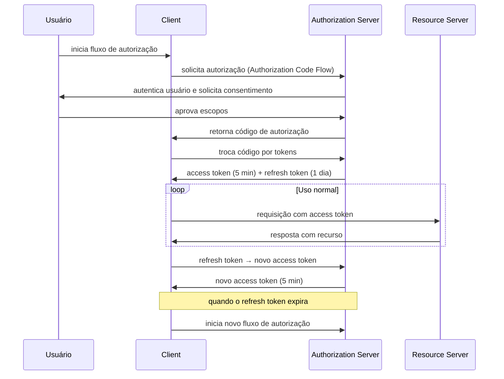

---

## 5.4.3 · Validação de tokens

A validação correta de tokens é onde a maioria dos erros de implementação acontece. O RFC 8725 — JWT Best Current Practices — documenta as vulnerabilidades mais comuns e como evitá-las.

> *Sheffer, Y., Hardt, D. & Jones, M. JSON Web Token Best Current Practices. RFC 8725, fevereiro 2020. Disponível em: [rfc-editor.org/rfc/rfc8725.html](https://www.rfc-editor.org/rfc/rfc8725.html)*

---

### A sequência completa de validação

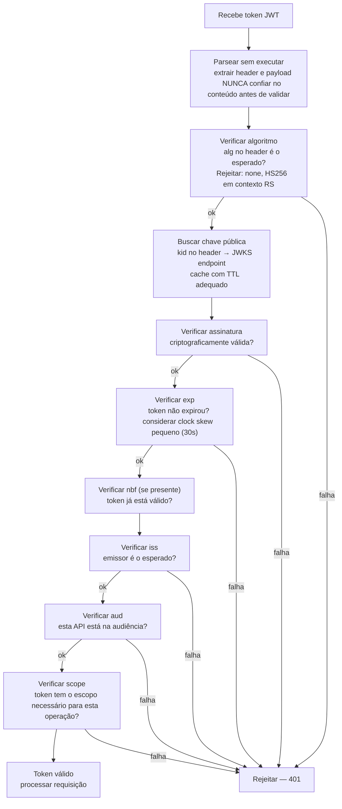

---

### Algoritmos seguros e inseguros

O header do JWT especifica o algoritmo de assinatura. O Resource Server **não deve aceitar qualquer algoritmo que o token declare** — deve verificar que o algoritmo é o esperado antes de qualquer outra validação.

| Algoritmo | Tipo | Status |
|---|---|---|
| RS256, RS384, RS512 | RSA + SHA | Recomendado para AS públicos |
| ES256, ES384, ES512 | ECDSA + SHA | Recomendado — menor tamanho de chave |
| PS256, PS384, PS512 | RSASSA-PSS | Recomendado |
| HS256, HS384, HS512 | HMAC simétrico | Apenas em contextos específicos M2M |
| **none** | **Sem assinatura** | **NUNCA aceitar — vulnerabilidade crítica** |

O ataque `alg:none` — onde um atacante modifica o header para `"alg": "none"` e remove a assinatura — é documentado no RFC 8725 e deve ser explicitamente prevenido.

---

### Token Introspection para tokens opacos

Quando o Resource Server recebe um token opaco, usa o endpoint de introspection do Authorization Server (RFC 7662) para validar o token e obter seus metadados.

> *Richer, J. OAuth 2.0 Token Introspection. RFC 7662, outubro 2015. Disponível em: [datatracker.ietf.org/doc/html/rfc7662](https://datatracker.ietf.org/doc/html/rfc7662)*

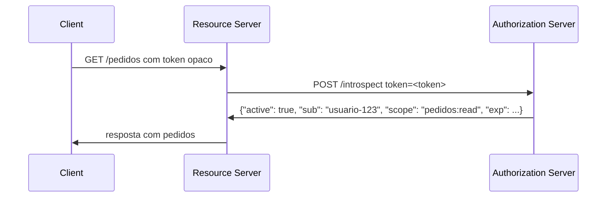

O resultado da introspection deve ser cacheado com TTL inferior à expiração do token para evitar roundtrips desnecessários a cada requisição.

---

## 5.4.4 · OpenID Connect — a camada de identidade

### O que OIDC adiciona ao OAuth 2.0

O OpenID Connect — mantido pela OpenID Foundation — é uma camada de identidade construída sobre OAuth 2.0. Enquanto OAuth 2.0 resolve autorização ("o que esta aplicação pode fazer?"), OIDC resolve autenticação ("quem é este usuário?").

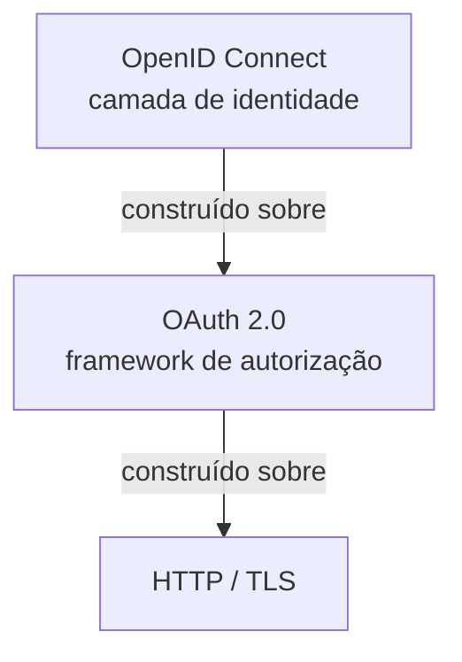

O que OIDC adiciona concretamente ao OAuth 2.0:

**ID Token** — um JWT que prova que o usuário se autenticou. Contém claims de identidade e é destinado ao Client — não ao Resource Server.

**UserInfo Endpoint** — endpoint padronizado para buscar claims adicionais do usuário com o access token.

**Scopes de identidade padronizados** — `openid` (obrigatório para OIDC), `profile`, `email`, `address`, `phone`.

**Discovery Endpoint** — `/.well-known/openid-configuration` — onde o Authorization Server publica sua configuração, incluindo endpoints e algoritmos suportados.

---

### ID Token vs. Access Token — não são a mesma coisa

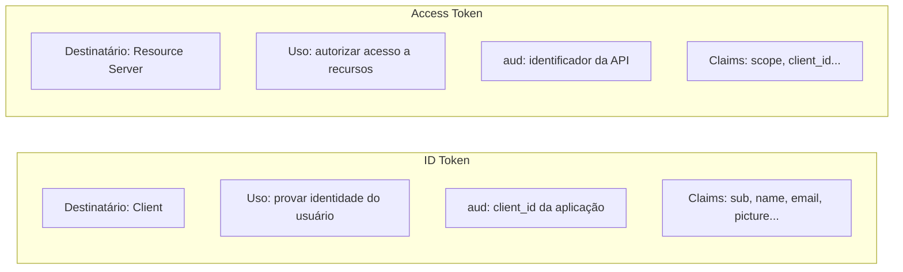

Usar o ID Token como access token para chamar APIs é uma vulnerabilidade documentada — o `aud` do ID Token é o `client_id` da aplicação, não o identificador da API. Uma API que aceita ID Tokens está aceitando tokens que não foram emitidos para ela.

---

### Claims de identidade padronizados

O OIDC define um conjunto de claims padronizados para o ID Token e o UserInfo endpoint:

| Claim | Descrição |
|---|---|
| `sub` | Identificador único do usuário — estável e não reutilizável |
| `name` | Nome completo |
| `given_name` / `family_name` | Nome e sobrenome |
| `email` | Endereço de email |
| `email_verified` | Boolean — o email foi verificado pelo AS |
| `phone_number` | Telefone |
| `picture` | URL da foto de perfil |
| `locale` | Idioma preferido |
| `updated_at` | Quando o perfil foi atualizado |

---

## 5.4.5 · Grant types em detalhe — quando usar cada um

### Authorization Code + PKCE — o fluxo padrão para usuários

O Authorization Code Flow com PKCE — Proof Key for Code Exchange, RFC 7636 — é o fluxo correto para qualquer aplicação que envolve um usuário humano.

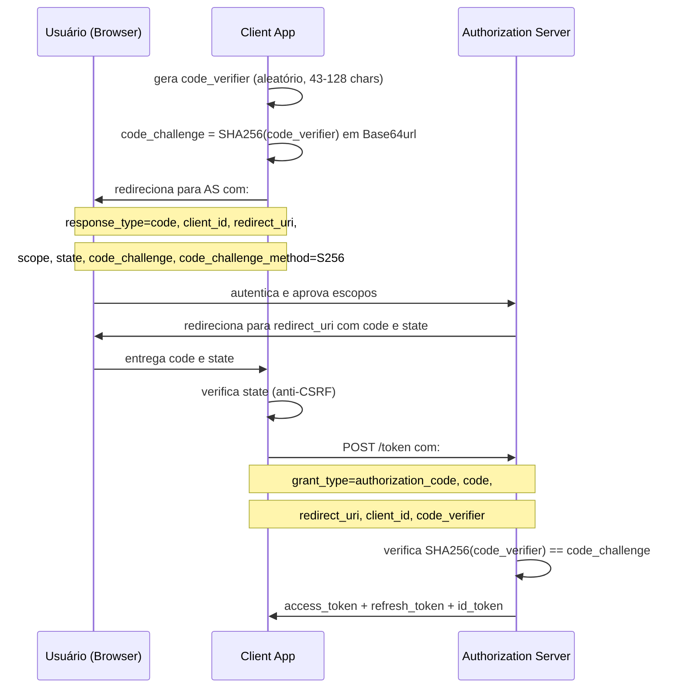

**Por que PKCE é obrigatório:** sem PKCE, um atacante que intercepta o código de autorização pode trocá-lo por tokens. Com PKCE, o código é inutilizável sem o `code_verifier` que só o Client legítimo conhece.

**Quando usar:** aplicações web com backend, SPAs, aplicações mobile, qualquer fluxo onde um usuário humano está presente.

---

### Client Credentials — machine-to-machine

O fluxo mais simples — sem usuário humano envolvido. O Client se autentica diretamente com o Authorization Server usando suas próprias credenciais.

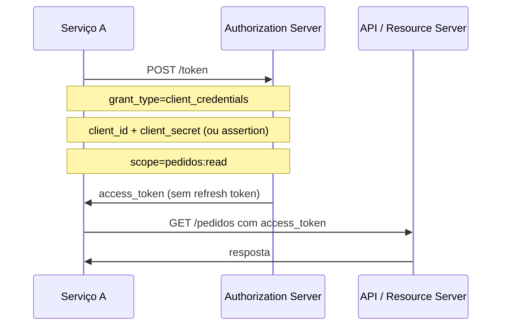

Não há refresh token no Client Credentials — quando o token expira, o serviço obtém um novo diretamente.

**Quando usar:** comunicação entre serviços (M2M), jobs automatizados, integrações sem contexto de usuário.

**Cuidado:** o `client_secret` é uma credencial de alta sensibilidade. Deve ser armazenado via secrets management (Cap 5.2) e nunca hardcoded.

---

### Device Code — dispositivos sem browser

Para dispositivos com capacidade de input limitada — Smart TVs, IoT, CLI tools.

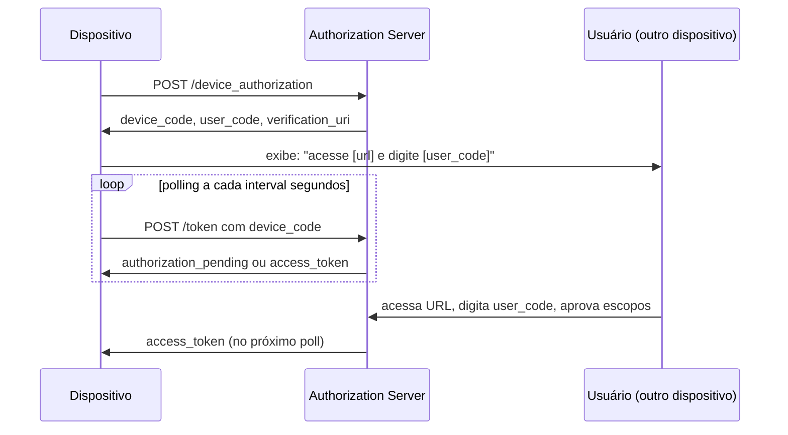

---

### Token Exchange — RFC 8693

O Token Exchange permite que um serviço troque um token recebido por um novo token com audiência, escopos ou sujeito diferentes — o mecanismo correto para propagação de identidade em microserviços (tratado em detalhe no 5.4.9).

> *Jones, M. & Campbell, B. OAuth 2.0 Token Exchange. RFC 8693, janeiro 2020. Disponível em: [datatracker.ietf.org/doc/html/rfc8693](https://datatracker.ietf.org/doc/html/rfc8693)*

---

### Grant types depreciados

**Implicit Grant** — foi criado para SPAs em 2012, quando não era possível fazer POST cross-origin. Com CORS e PKCE disponíveis, é obsoleto. Tokens retornados diretamente na URL são expostos a vazamento via referrer, histórico e logs.

**Resource Owner Password Credentials (ROPC)** — o cliente recebe diretamente a senha do usuário. Derrota o propósito do OAuth — o usuário expõe suas credenciais à aplicação. Depreciado no OAuth 2.1.

---

## 5.4.6 · mTLS e proof-of-possession

### O problema dos bearer tokens

Bearer tokens são como dinheiro em espécie: quem tem o token pode usá-lo. Se um access token é interceptado, qualquer um pode apresentá-lo ao Resource Server e obter acesso — o RS não tem como saber se o portador é o cliente legítimo.

**Proof-of-possession** resolve isso: o token é vinculado a uma chave que só o cliente legítimo possui. Apresentar o token sem provar posse da chave não é suficiente.

---

### mTLS — mutual TLS

O RFC 8705 define como vincular access tokens a certificados de cliente TLS. O Resource Server valida não apenas o token, mas que o certificado TLS da conexão corresponde ao certificado associado ao token.

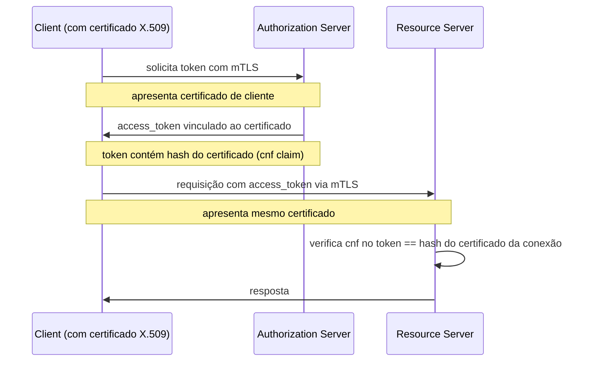

> *Campbell, B. et al. OAuth 2.0 Mutual-TLS Client Authentication and Certificate-Bound Access Tokens. RFC 8705, fevereiro 2020. Disponível em: [datatracker.ietf.org/doc/html/rfc8705](https://datatracker.ietf.org/doc/html/rfc8705)*

**Quando usar mTLS:** comunicação M2M em ambientes controlados, APIs em mercados regulados (Open Finance), service mesh interno.

**Custo:** gestão de certificados de cliente — emissão, rotação, revogação — tem overhead operacional significativo.

---

### DPoP — Demonstrating Proof of Possession

DPoP — RFC 9449 — é uma alternativa ao mTLS que não requer certificados. O cliente gera um par de chaves efêmero, assina cada requisição HTTP com a chave privada e inclui o header `DPoP` com a prova. O token é vinculado à chave pública correspondente.

---

## 5.4.7 · Provedores de identidade e diretórios

### O papel do Authorization Server e do Diretório

Na prática, nenhuma organização implementa um Authorization Server do zero. Usa um provedor que implementa OAuth 2.0, OIDC e frequentemente SAML. A distinção importante:

**Diretório de identidades** — repositório de usuários, grupos e atributos. Onde as identidades vivem. Exemplos: Microsoft Entra ID, Active Directory local, LDAP, Okta Universal Directory.

**Authorization Server** — implementa os fluxos OAuth 2.0 e OIDC, valida credenciais, emite tokens e publica metadata. Pode ser o mesmo sistema que o diretório ou um componente separado.

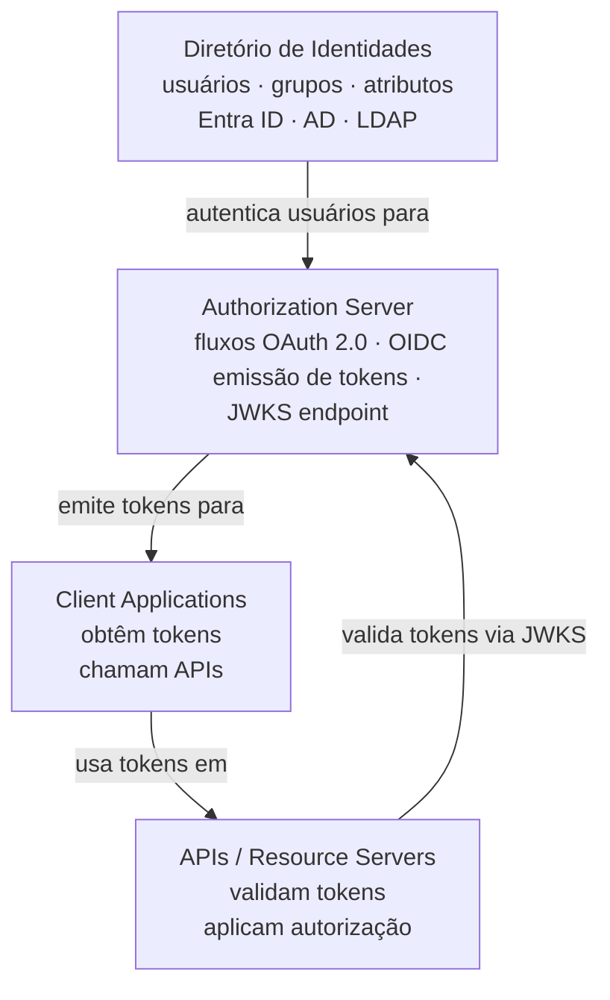

---

### Microsoft Entra ID (Azure AD)

O provedor mais prevalente em ambientes corporativos. Suporta OAuth 2.0, OIDC e SAML. Tem conceitos específicos que todo arquiteto de APIs em ambiente Microsoft precisa conhecer:

**Tenant** — o diretório da organização. Cada organização tem um ou mais tenants, identificados por um GUID ou domínio. O `iss` de tokens Entra ID inclui o tenant ID: `https://login.microsoftonline.com/{tenant-id}/v2.0`.

**App Registration** — o registro da aplicação ou API no Entra ID. Define o `client_id`, as permissões (escopos) que a API expõe, e quais aplicações podem obter tokens para ela.

**Service Principal** — a instância de uma App Registration num tenant específico. Permite que apps multi-tenant sejam usadas em múltiplos tenants.

**Managed Identity** — identidade gerenciada automaticamente pelo Azure para recursos de infraestrutura (VMs, Functions, App Services). Elimina a necessidade de gerenciar client secrets para comunicação M2M dentro do Azure.

**Tokens v1 vs. v2** — o Entra ID emite tokens em dois formatos com estruturas de claims diferentes. O endpoint v2.0 é o recomendado para aplicações novas.

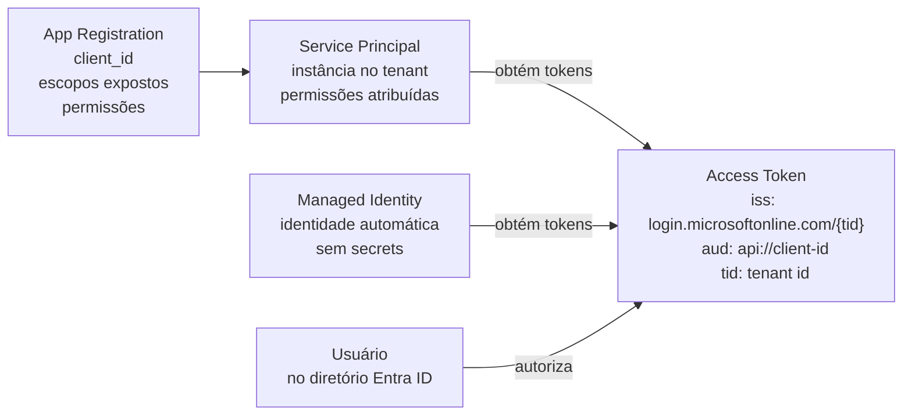

---

### Multi-tenant e multi-issuer

Uma API que serve múltiplos clientes corporativos pode receber tokens de tenants Entra ID diferentes — cada um com seu próprio `iss`. Há duas abordagens:

**Validação multi-tenant:** a API aceita tokens de qualquer tenant Entra ID (`iss` contém `login.microsoftonline.com/{any-tenant-id}/v2.0`). Exige validação cuidadosa para garantir que o tenant está autorizado a usar a API.

**Issuer allowlist:** a API mantém uma lista explícita de issuers aceitos. Mais seguro e mais restritivo.

---

### Outros provedores relevantes

**Okta / Auth0** — provedores cloud de identidade e authorization. Auth0 é voltado para desenvolvedores com forte DX. Okta é mais focado em enterprise. Ambos suportam OAuth 2.0, OIDC e SAML.

**Keycloak** — authorization server open source da Red Hat. Muito usado em ambientes on-premises ou quando a organização precisa manter controle total sobre a infraestrutura de identidade.

**AWS Cognito** — serviço de identidade gerenciado da AWS. Integrado com o ecossistema AWS. Tem particularidades nos claims e no formato de tokens que diferem do padrão.

**Google Identity Platform** — para APIs que servem usuários Google. O JWKS endpoint e o discovery endpoint seguem o padrão OIDC mas com especificidades de implementação.

---

## 5.4.8 · SAML e a ponte para OAuth 2.0

### O que é SAML e quando ainda é relevante

SAML — Security Assertion Markup Language — é um padrão de federação de identidade baseado em XML, publicado pelo OASIS em 2002 e amplamente adotado a partir da versão 2.0 em 2005. Precede OAuth 2.0 por uma década e foi projetado para SSO em aplicações web empresariais — não para APIs.

SAML ainda é relevante porque a maioria das organizações corporativas tem infraestrutura SAML em produção: Active Directory Federation Services (ADFS), provedores de SSO corporativos, integrações com sistemas de RH e ERP. Migrar esse ecossistema é custoso — e frequentemente não é a prioridade.

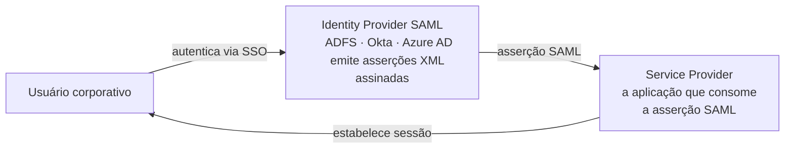

---

### O problema de SAML com APIs modernas

SAML foi projetado para fluxos de browser — o usuário é redirecionado, a asserção XML é entregue via HTTP POST. APIs modernas usam tokens compactos (JWT) via Authorization header. As duas abordagens são fundamentalmente incompatíveis no nível técnico.

O resultado prático: uma organização com IdP SAML que quer expor APIs modernas precisa de uma ponte entre os dois mundos.

---

### RFC 7522 — SAML Assertion Grant para OAuth 2.0

O RFC 7522 define como usar uma asserção SAML 2.0 como grant type para obter um access token OAuth 2.0. É a ponte padrão entre o mundo SAML e o mundo OAuth.

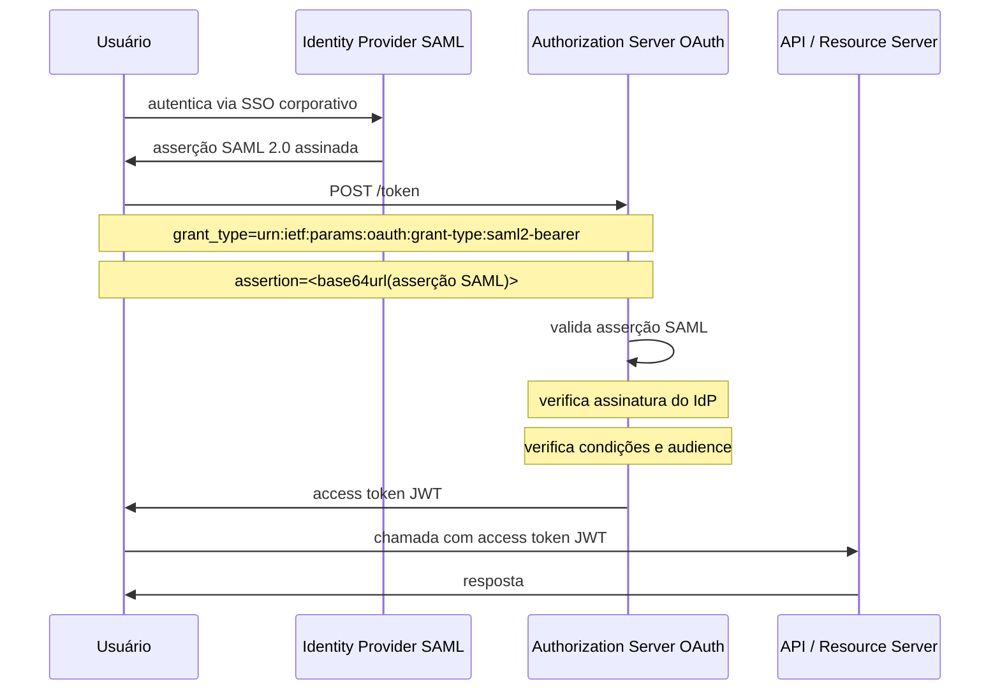

> *Campbell, B. & Mortimore, C. Assertion Framework for OAuth 2.0 Client Authentication and Authorization Grants. RFC 7521, maio 2015. E: SAML 2.0 Profile for OAuth 2.0 Client Authentication and Authorization Grants. RFC 7522, maio 2015. Disponível em: [datatracker.ietf.org/doc/html/rfc7522](https://datatracker.ietf.org/doc/html/rfc7522)*

**O resultado:** o usuário autentica uma vez no IdP SAML corporativo. Para cada acesso a APIs OAuth 2.0, troca a asserção SAML por um access token JWT sem nova autenticação. As APIs recebem tokens JWT padrão — sem precisar conhecer SAML.

---

## 5.4.9 · Propagação de identidade em microserviços

### O problema

Uma requisição de usuário raramente termina em um único serviço. Ela percorre uma cadeia:

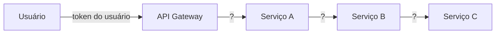

Cada serviço da cadeia precisa saber:
1. **Quem** iniciou a requisição — para autorização por objeto e auditoria
2. **O que** está autorizado — para aplicar least privilege em cada hop
3. Que o token que recebe é **válido para ele** — não apenas válido em geral

---

### As abordagens e seus problemas

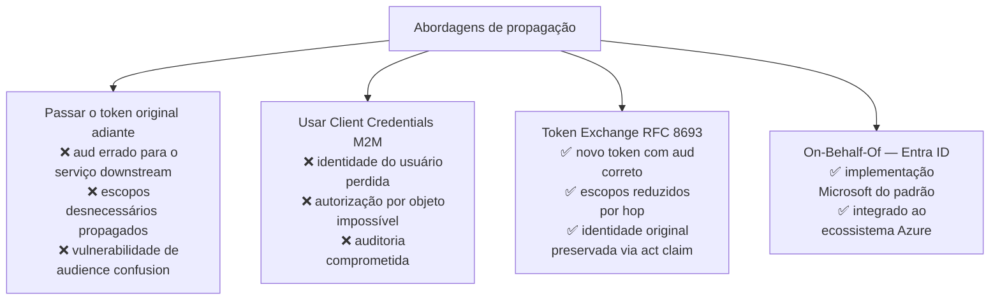

---

### Token Exchange — RFC 8693

O Token Exchange define como um serviço troca um token recebido por um novo token adequado para o próximo serviço da cadeia.

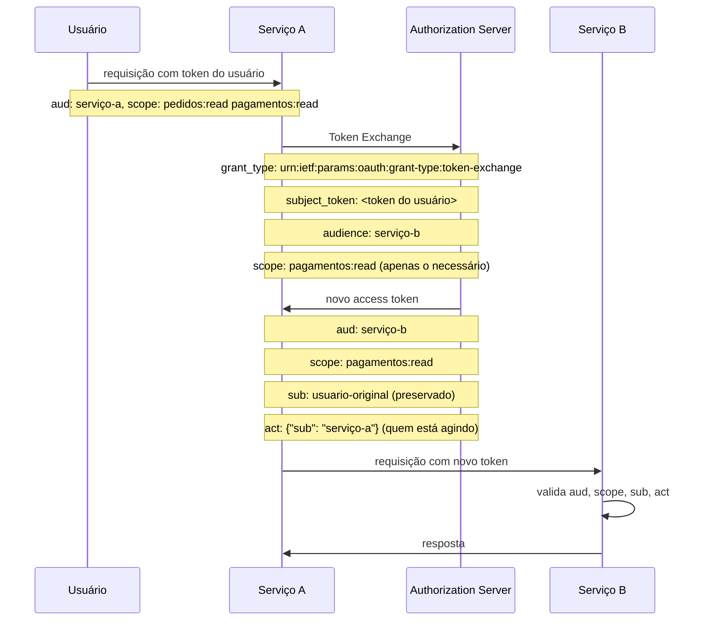

**O claim `act`** — Actor — registra quem está agindo em nome do sujeito original. Em cadeias longas, `act` pode ser aninhado: o Serviço C sabe que o Serviço B agiu em nome do Serviço A que agiu em nome do usuário original. Isso preserva a trilha de auditoria completa.

---

### Scope reduction — least privilege em cada hop

```mermaid
flowchart LR
    token_user["Token do usuário
    scope: pedidos:read
           pedidos:write
           pagamentos:read
           pagamentos:write
           usuarios:read"]

    token_a["Token Serviço A → B
    scope: pagamentos:read
    (apenas o que B precisa)"]

    token_b["Token Serviço B → C
    scope: pagamentos:read
    (mesmo escopo — B não pode ampliar)"]

    token_user -->|"Token Exchange com scope reduction"| token_a
    token_a -->|"Token Exchange"| token_b
```

O Authorization Server só pode reduzir escopos no token exchange — nunca ampliar. Um serviço não pode obter escopos que o usuário original não tinha.

---

### On-Behalf-Of no Microsoft Entra ID

O Entra ID implementa o padrão de Token Exchange com o fluxo On-Behalf-Of (OBO). A API do Meio recebe um token do usuário e usa esse token para obter um novo token para a API Downstream, preservando a identidade do usuário.

```mermaid
sequenceDiagram
    participant App as Aplicação
    participant API1 as API do Meio
    participant Entra as Microsoft Entra ID
    participant API2 as API Downstream

    App->>API1: com token do usuário (scope: api1/.default)
    API1->>Entra: OBO request
    Note over API1,Entra: grant_type: urn:ietf:params:oauth:grant-type:jwt-bearer
    Note over API1,Entra: assertion: <token do usuário>
    Note over API1,Entra: requested_token_use: on_behalf_of
    Note over API1,Entra: scope: api2/.default
    Entra->>API1: novo token (sub = usuário original)
    API1->>API2: com novo token
    API2->>API1: resposta
```

---

## 5.4.10 · Decisões de design — trade-offs explícitos

### JWT vs. token opaco

```mermaid
flowchart TD
    pergunta["Qual tipo de token?"]

    p1{"RS precisa validar
    sem chamar AS?"}
    p2{"Revogação imediata
    é crítica?"}
    p3{"Privacy dos claims
    é importante?"}

    jwt["JWT
    validação local
    sem roundtrip ao AS"]

    opaque["Token opaco
    com introspection"]

    hybrid["Abordagem híbrida
    JWT de vida curta (5 min)
    + revogação por jti blacklist"]

    pergunta --> p1
    p1 -->|"sim"| p2
    p1 -->|"não"| opaque
    p2 -->|"sim"| hybrid
    p2 -->|"não — expiração ok"| p3
    p3 -->|"sim"| opaque
    p3 -->|"não"| jwt
```

---

### Vida do access token — o equilíbrio certo

Access tokens de vida longa são convenientes mas criam janelas de ataque grandes. Access tokens de vida muito curta aumentam a carga no Authorization Server.

| Vida do access token | Vantagem | Desvantagem |
|---|---|---|
| 1 hora+ | Menos roundtrips ao AS | Janela de ataque ampla se comprometido |
| 15 minutos | Equilíbrio razoável | Mais renovações via refresh token |
| 5 minutos | Janela pequena de comprometimento | Carga maior no AS |
| < 1 minuto | Quase sem janela de ataque | Latência adicional perceptível |

O padrão de mercado para a maioria dos casos é 5-15 minutos para access tokens com refresh tokens de 1-24 horas, renovados por rotação.

---

### Como o modelo de escopos do Cap 5.1.6 se conecta ao access token

O design de escopos discutido no Cap 5.1.6 — taxonomia `namespace:recurso:acao` — se materializa no claim `scope` do access token. O Resource Server verifica o `scope` do token para decidir se a operação solicitada é autorizada:

```
Token scope: "pedidos:read"

GET /pedidos → scope pedidos:read → ✅ autorizado
POST /pedidos → scope pedidos:write → ❌ não autorizado
DELETE /pedidos/123 → scope pedidos:write → ❌ não autorizado
```

A granularidade do modelo de escopos determina a precisão do controle de acesso que o Resource Server consegue implementar com base apenas no token.

---

## 5.4.11 · Erros comuns e como evitá-los

### Aceitar alg:none

O atacante modifica o header JWT para `"alg": "none"` e remove a assinatura. Se a biblioteca de validação aceitar esse algoritmo, o token não assinado é aceito como válido.

**Prevenção:** configurar explicitamente os algoritmos aceitos na biblioteca de validação. Nunca aceitar `none`.

---

### Não validar o audience

O Resource Server valida a assinatura e a expiração mas não verifica se o `aud` do token inclui seu identificador. Um token emitido para outra API — ou um ID Token emitido para o Client — é aceito.

**Prevenção:** audience validation é obrigatória. Cada Resource Server deve ter um identificador único e verificar que está no `aud` de cada token recebido.

---

### Usar o ID Token como access token

O `aud` do ID Token é o `client_id` da aplicação — não o identificador da API. Aceitar ID Tokens em APIs é uma vulnerabilidade de audience confusion.

**Prevenção:** APIs aceitam apenas access tokens. O ID Token é consumido pelo Client para estabelecer sessão — nunca enviado a APIs.

---

### Armazenar tokens em localStorage

Tokens armazenados em localStorage são acessíveis por qualquer JavaScript da página — vulneráveis a XSS. Tokens em cookies httpOnly não são acessíveis por JavaScript.

**Prevenção:** access tokens em cookies httpOnly com Secure e SameSite. Para SPAs sem backend, considerar o BFF — Backend for Frontend — pattern.

---

### Não rotacionar refresh tokens

Um refresh token comprometido que não é invalidado após o uso permite que um atacante use-o indefinidamente para obter novos access tokens.

**Prevenção:** refresh token rotation — cada uso do refresh token invalida o anterior e emite um novo. Detecção de reuso de refresh token como sinal de comprometimento.

---

### Confundir autenticação com autorização

A vulnerabilidade estrutural mais importante — e a mais difícil de corrigir depois. Um sistema que verifica "você está autenticado?" mas não verifica "você tem direito a este recurso específico?" está vulnerável a BOLA (API1 do OWASP Top 10) para qualquer recurso com identificador.

**Prevenção:** OAuth 2.0 e tokens resolvem autenticação e autorização de escopo. Autorização por objeto — RBAC, ABAC, verificação de ownership — é responsabilidade da aplicação e precisa ser implementada explicitamente para cada operação.

---

## Pontos-chave do capítulo

- OAuth 2.0 resolve autorização — não autenticação. OIDC resolve autenticação. Confundir os dois é um erro de design com implicações de segurança diretas
- Access tokens têm vida curta e audiência específica. Refresh tokens têm vida longa e são apresentados apenas ao Authorization Server. ID Tokens são consumidos pelo Client — nunca enviados a APIs
- JWT permite validação local sem roundtrip ao AS — ao custo de revogação baseada apenas em expiração. Tokens opacos com introspection permitem revogação imediata — ao custo de latência adicional
- A validação de JWT tem uma sequência obrigatória: algoritmo → assinatura → exp → iss → aud → scope. Cada passo é necessário e a ordem importa
- PKCE é obrigatório para qualquer fluxo de Authorization Code — elimina a possibilidade de interceptação do código de autorização
- Client Credentials é o fluxo correto para M2M. Device Code para dispositivos sem browser. Token Exchange para propagação de identidade em microserviços
- Em microserviços, a propagação correta de identidade usa Token Exchange (RFC 8693) — não repasse do token original nem abandono da identidade do usuário em favor de credenciais M2M
- SAML ainda é relevante em ambientes corporativos. O RFC 7522 define a ponte padrão: trocar uma asserção SAML por um access token OAuth 2.0 sem nova autenticação
- Os erros mais críticos: aceitar alg:none, não validar audience, usar ID Token como access token, não rotacionar refresh tokens

---

## Fontes e referências

| Fonte | Referência completa |
|---|---|
| **RFC 6749 — OAuth 2.0 (2012)** | Hardt, D. *The OAuth 2.0 Authorization Framework*. RFC 6749, outubro 2012. Disponível em: [datatracker.ietf.org/doc/html/rfc6749](https://datatracker.ietf.org/doc/html/rfc6749) |
| **RFC 6750 — Bearer Tokens (2012)** | Jones, M. & Hardt, D. *The OAuth 2.0 Authorization Framework: Bearer Token Usage*. RFC 6750, outubro 2012. Disponível em: [datatracker.ietf.org/doc/html/rfc6750](https://datatracker.ietf.org/doc/html/rfc6750) |
| **RFC 7519 — JWT (2015)** | Jones, M., Bradley, J. & Sakimura, N. *JSON Web Token*. RFC 7519, maio 2015. Disponível em: [rfc-editor.org/rfc/rfc7519.html](https://www.rfc-editor.org/rfc/rfc7519.html) |
| **RFC 7636 — PKCE (2015)** | Sakimura, N. et al. *Proof Key for Code Exchange*. RFC 7636, setembro 2015. Disponível em: [datatracker.ietf.org/doc/html/rfc7636](https://datatracker.ietf.org/doc/html/rfc7636) |
| **RFC 7662 — Introspection (2015)** | Richer, J. *OAuth 2.0 Token Introspection*. RFC 7662, outubro 2015. Disponível em: [datatracker.ietf.org/doc/html/rfc7662](https://datatracker.ietf.org/doc/html/rfc7662) |
| **RFC 7009 — Revocation (2013)** | Lodderstedt, T. & Dronia, S. *OAuth 2.0 Token Revocation*. RFC 7009, agosto 2013. Disponível em: [datatracker.ietf.org/doc/html/rfc7009](https://datatracker.ietf.org/doc/html/rfc7009) |
| **RFC 8693 — Token Exchange (2020)** | Jones, M. & Campbell, B. *OAuth 2.0 Token Exchange*. RFC 8693, janeiro 2020. Disponível em: [datatracker.ietf.org/doc/html/rfc8693](https://datatracker.ietf.org/doc/html/rfc8693) |
| **RFC 8705 — mTLS OAuth (2020)** | Campbell, B. et al. *OAuth 2.0 Mutual-TLS*. RFC 8705, fevereiro 2020. Disponível em: [datatracker.ietf.org/doc/html/rfc8705](https://datatracker.ietf.org/doc/html/rfc8705) |
| **RFC 8725 — JWT BCP (2020)** | Sheffer, Y., Hardt, D. & Jones, M. *JSON Web Token Best Current Practices*. RFC 8725, fevereiro 2020. Disponível em: [rfc-editor.org/rfc/rfc8725.html](https://www.rfc-editor.org/rfc/rfc8725.html) |
| **RFC 9068 — JWT Access Token (2021)** | Bertocci, V. *JWT Profile for OAuth 2.0 Access Tokens*. RFC 9068, outubro 2021. Disponível em: [rfc-editor.org/rfc/rfc9068.html](https://www.rfc-editor.org/rfc/rfc9068.html) |
| **RFC 9396 — RAR (2023)** | Lodderstedt, T. et al. *OAuth 2.0 Rich Authorization Requests*. RFC 9396, maio 2023. Disponível em: [rfc-editor.org/rfc/rfc9396.html](https://www.rfc-editor.org/rfc/rfc9396.html) |
| **RFC 9449 — DPoP (2023)** | Fett, D. et al. *OAuth 2.0 Demonstrating Proof of Possession*. RFC 9449, setembro 2023. Disponível em: [datatracker.ietf.org/doc/html/rfc9449](https://datatracker.ietf.org/doc/html/rfc9449) |
| **RFC 9700 — OAuth 2.0 Security BCP (2025)** | Lodderstedt, T. et al. *Best Current Practice for OAuth 2.0 Security*. RFC 9700, janeiro 2025. Disponível em: [datatracker.ietf.org/doc/rfc9700](https://datatracker.ietf.org/doc/rfc9700/) |
| **RFC 7522 — SAML Grant (2015)** | Campbell, B. & Mortimore, C. *SAML 2.0 Profile for OAuth 2.0*. RFC 7522, maio 2015. Disponível em: [datatracker.ietf.org/doc/html/rfc7522](https://datatracker.ietf.org/doc/html/rfc7522) |
| **OpenID Connect Core 1.0** | Sakimura, N. et al. *OpenID Connect Core 1.0*. OpenID Foundation, novembro 2014. Disponível em: [openid.net/specs/openid-connect-core-1_0.html](https://openid.net/specs/openid-connect-core-1_0.html) |

---

## Próximo capítulo

**5.5 · Zero Trust para APIs** — o modelo que assume que nenhuma requisição é confiável por padrão e como ele se aplica ao contexto de APIs.

---

*Série: Gerenciamento e Governança de APIs · Módulo 5 · Capítulo 5.4*

---

## 5.4.12 · Autorização fina — o problema que OAuth não resolve

### A distinção que o capítulo não cobriu

Tudo que discutimos até aqui sobre OAuth 2.0, escopos e tokens resolve um problema específico: **autorização grossa** — *coarse-grained authorization*. O token tem o escopo correto para acessar este tipo de recurso?

Mas há um nível mais profundo de autorização que nenhum protocolo OAuth resolve — e que é responsável pela maioria dos incidentes de segurança documentados no OWASP API1 e API5: **autorização fina** — *fine-grained authorization (FGA)*. Este sujeito específico pode executar esta operação específica sobre este objeto específico neste contexto específico?

```mermaid
flowchart TD
    req["Requisição
    DELETE /pedidos/4521
    Authorization: Bearer <token>"]

    coarse["Autorização grossa
    O token é válido?
    O scope pedidos:write está presente?
    → OAuth 2.0 resolve"]

    fine["Autorização fina
    O usuário é dono do pedido 4521?
    O pedido está num estado que permite cancelamento?
    O usuário não excedeu o limite de cancelamentos?
    → OAuth não resolve — aplicação precisa resolver"]

    req --> coarse
    req --> fine

    coarse -->|"sim"| fine
    fine -->|"todas as regras passam"| autorizado["Operação autorizada"]
    fine -->|"alguma regra falha"| negado["403 Forbidden"]
```

---

### Os exemplos concretos

**Exemplo 1 — Acesso a objeto específico (BOLA)**
Token válido com `scope: pedidos:read`. Mas o pedido #4521 pertence ao usuário B, não ao usuário A. O OAuth não vê essa distinção — vê apenas que o escopo está presente. A verificação de ownership é responsabilidade da aplicação.

**Exemplo 2 — Regra de negócio contextual**
Usuário quer aplicar cupom `PROMO10` a uma compra. O cupom existe. O token é válido. O escopo `compras:write` está presente. Mas o cupom já foi usado por este usuário? É válido para esta categoria de produto? O usuário é elegível (primeira compra)? Nenhuma dessas verificações existe no protocolo de autorização.

**Exemplo 3 — Autorização hierárquica**
Gerente pode aprovar requisições de até R$10.000. Diretor pode aprovar até R$100.000. A operação `POST /aprovacoes` tem um scope genérico `aprovacoes:write` — mas o valor da requisição determina quem pode aprová-la. Regra de negócio pura, invisível ao OAuth.

**Exemplo 4 — Autorização baseada em relacionamento**
Médico pode acessar prontuário de um paciente apenas se for o médico responsável por aquele paciente. O mesmo scope `prontuarios:read` existe para todos os médicos — mas apenas o relacionamento médico-paciente determina o acesso ao objeto específico.

---

### Os modelos de autorização fina

Há três modelos principais, com filosofias distintas:

**RBAC — Role-Based Access Control**
Usuário tem role → role tem permissões. O modelo mais simples e mais amplamente implementado.

```
user: joao         → role: gerente
role: gerente      → permission: aprovar até R$10.000
role: gerente      → permission: ver relatórios financeiros
```

RBAC funciona bem para permissões estáticas e hierarquias organizacionais previsíveis. Falha quando as decisões de autorização dependem de atributos dinâmicos ou de relacionamentos entre objetos — o número de roles explode para cobrir cada combinação de contexto.

**ABAC — Attribute-Based Access Control**
A decisão é baseada em atributos do sujeito, do recurso, da ação e do ambiente. Uma policy engine avalia um conjunto de regras com esses atributos como input.

```
allow if:
  user.department == resource.department AND
  user.clearance_level >= resource.sensitivity AND
  time.hour >= 8 AND time.hour <= 18
```

ABAC é altamente flexível e expressa contexto rico. O custo é a complexidade das políticas — difíceis de testar, auditar e manter em escala. O NIST SP 800-162 formaliza o modelo ABAC para sistemas de informação do governo americano.

**ReBAC — Relationship-Based Access Control**
A decisão é baseada em relacionamentos entre entidades. Acesso é concedido quando existe um caminho no grafo de relacionamentos entre o usuário e o recurso.

```
doctor:ana → assigned_to → patient:carlos
patient:carlos → has_record → record:789

# Ana pode acessar o record:789 porque há um caminho:
# doctor:ana → assigned_to → patient:carlos → has_record → record:789
```

ReBAC é o modelo que melhor expressa sistemas com hierarquias de objetos, compartilhamento e delegação — como Google Drive, onde um documento herdado de uma pasta herdada de um drive compartilhado tem permissões transitivas ao longo da cadeia.

```mermaid
flowchart LR
    rbac["RBAC
    user → role → permission
    Simples, estático
    Falha com contexto dinâmico"]

    abac["ABAC
    policy(user, resource, action, env)
    Flexível, expressivo
    Complexidade de manutenção"]

    rebac["ReBAC
    user → relationship → resource
    Grafo de relacionamentos
    Permissões transitivas e herdadas"]

    rebac -->|"superset de"| rbac
    rebac -->|"expressa ABAC via relacionamentos"| abac
```

---

### Por que "delegar e confiar" não é sustentável

A abordagem mais comum em organizações sem estratégia de FGA é a delegação: cada time de produto implementa sua própria lógica de autorização, e a governança confia que cada time faz isso corretamente.

Essa abordagem tem quatro problemas que se agravam com o tempo:

**Inconsistência sistêmica** — times diferentes implementam as mesmas regras de forma diferente. O mesmo usuário pode ter acesso a um recurso em um serviço e não ter em outro, por divergência de implementação. Ou pior: um serviço implementa uma verificação que outro esqueceu.

**Invisibilidade** — não há uma visão centralizada de "quem pode fazer o quê". Quando a pergunta "o usuário João tem acesso a quê?" é feita — por um auditor, por um processo de offboarding, por uma investigação de incidente — a resposta exige perguntar a cada time individualmente.

**Duplicação e drift** — a mesma regra de negócio é implementada em múltiplos serviços. Quando a regra muda, todos os serviços precisam ser atualizados. A probabilidade de inconsistência cresce a cada mudança.

**Ausência de testabilidade** — lógica de autorização embutida no código da aplicação é difícil de testar isoladamente. Regressões de autorização — mudanças que inadvertidamente ampliam ou restringem acesso — são descobertas em produção.

---

### O padrão arquitetural — PDP e PEP

A solução arquitetural padrão para FGA externaliza as decisões de autorização da aplicação para um serviço dedicado. O vocabulário padrão vem do XACML (OASIS) mas é amplamente usado independente do protocolo:

**PEP — Policy Enforcement Point** — o componente que intercepta a requisição e delega a decisão ao PDP. Pode ser o gateway, um middleware, ou código na aplicação.

**PDP — Policy Decision Point** — o serviço que avalia as políticas e retorna a decisão: permitir ou negar. OPA, OpenFGA e similares são PDPs.

**PAP — Policy Administration Point** — onde as políticas são criadas, editadas e versionadas. Pode ser um repositório Git com políticas como código.

**PIP — Policy Information Point** — fontes de dados que o PDP consulta para tomar decisões: diretório de usuários, banco de dados de relacionamentos, serviço de atributos.

```mermaid
flowchart LR
    client["Client
    usuário ou serviço"]

    pep["PEP
    Policy Enforcement Point
    gateway · middleware · SDK"]

    pdp["PDP
    Policy Decision Point
    OPA · OpenFGA · Cedar"]

    pap["PAP
    Policy Administration Point
    repositório de políticas
    versionadas como código"]

    pip["PIP
    Policy Information Point
    diretório · banco de dados
    serviço de atributos"]

    app["Aplicação / Resource Server"]

    client -->|"requisição"| pep
    pep -->|"authorization request"| pdp
    pdp -->|"consulta dados"| pip
    pdp -->|"consulta políticas"| pap
    pdp -->|"allow / deny"| pep
    pep -->|"requisição autorizada"| app
```

---

### As soluções de mercado e open source

**OPA — Open Policy Agent**
Motor de políticas open source de propósito geral, graduado na CNCF em 2021. Usa a linguagem Rego para expressar políticas como código. Suporta RBAC e ABAC. Integra com gateways de API, service meshes (Istio/Envoy), Kubernetes e CI/CD.

OPA responde a perguntas de autorização via API REST ou biblioteca embutida. A pergunta é expressada como input JSON; a política Rego avalia e retorna output JSON com a decisão.

Usado em produção por Netflix, Cloudflare, Pinterest, Intuit, Capital One entre outros. Disponível em: [openpolicyagent.org](https://www.openpolicyagent.org/)

**OpenFGA**
Motor de FGA open source baseado no modelo ReBAC do Google Zanzibar. Criado pelo time Auth0/Okta e doado à CNCF em setembro de 2022. Resolve especificamente o problema de autorização baseada em relacionamentos — ownership, hierarquias, delegação.

Disponível em: [openfga.dev](https://openfga.dev/)

**Cedar — Amazon**
Linguagem de políticas open source desenvolvida pela Amazon, usada internamente no AWS Verified Permissions e no Amazon Verified Permissions. Projetada para ser verificável formalmente — políticas Cedar podem ser analisadas estaticamente para provar propriedades de segurança.

Disponível em: [cedarpolicy.com](https://www.cedarpolicy.com/)

**AWS Verified Permissions**
Serviço gerenciado da AWS baseado em Cedar. Externaliza decisões de autorização fina para o ecossistema AWS. Adequado para organizações já no ecossistema AWS que querem FGA como serviço.

**Cerbos**
Motor de autorização open source focado em simplicidade operacional. Políticas em YAML, fácil de integrar em qualquer stack. Disponível em: [cerbos.dev](https://cerbos.dev/)

---

### Como a governança de APIs atua sobre FGA

A governança de APIs não pode implementar FGA por cada time — mas pode criar as condições para que FGA seja implementado de forma consistente e auditável em todo o portfólio.

**Policy as Code como padrão obrigatório**
O CoE define que lógica de autorização fina deve existir como código versionado — não embutida em lógica de aplicação sem rastreabilidade. Políticas em OPA, OpenFGA ou equivalente são versionadas em repositório, revisadas via pull request e testadas no pipeline.

**Modelo de autorização como artefato de design**
Antes de publicar uma API, o time documenta o modelo de autorização fina: quais objetos requerem verificação de ownership, quais operações têm restrições contextuais, quais relacionamentos determinam o acesso. Esse artefato é revisado pelo CoE como parte do gate de publicação.

**PDP centralizado vs. distribuído**
O CoE decide a estratégia arquitetural: um PDP central compartilhado pelo portfólio (menos operacional, mais acoplamento) ou PDPs distribuídos por domínio (mais autônomo, mais heterogeneidade). Não há resposta única — depende do tamanho e maturidade da organização.

**Auditabilidade como requisito**
O CoE define que decisões de autorização fina devem ser registradas — quem solicitou, qual objeto, qual decisão, por qual política. Isso conecta FGA com a trilha de auditoria do Cap 5.2.4 e permite investigação forense de incidentes de acesso.

**Revisões periódicas de políticas**
Políticas de autorização envelhecem. Regras criadas para um caso de uso antigo podem ser mais permissivas do que o necessário hoje. O CoE estabelece cadência de revisão de políticas como parte do Continual Improvement do Cap 4.6.7.

---

### O aprofundamento

Os modelos de autorização, a arquitetura do Zanzibar, como OPA e Rego funcionam em detalhe, e como o CoE governa o modelo de FGA de um portfólio são tratados em profundidade no **[Anexo L · Modelos e ferramentas de autorização fina](../anexos/l_rbac.md)**.

---

## Anexos referenciados

- [Anexo J · Guia de leitura — os RFCs do OAuth 2.0](../anexos/j_rfcs_oauth.md)
- [Anexo K · Guia de leitura — os RFCs dos tokens](../anexos/k_rfcs_token.md)
- [Anexo L · Modelos e ferramentas de autorização fina](../anexos/l_rbac.md)