# Módulo 5 · Segurança de APIs
## Capítulo 5.5 · Zero Trust para APIs

> **Série:** Gerenciamento e Governança de APIs
> **Nível:** Arquitetural e estratégico
> **Pré-requisito:** Cap 5.1 · Cap 5.2 · Cap 5.4

---

## Sumário

- [5.5.1 · O modelo de perímetro e por que ele falha para APIs](#551--o-modelo-de-perímetro-e-por-que-ele-falha-para-apis)
- [5.5.2 · Os sete tenets do NIST SP 800-207 aplicados a APIs](#552--os-sete-tenets-do-nist-sp-800-207-aplicados-a-apis)
- [5.5.3 · Identidade como o novo perímetro](#553--identidade-como-o-novo-perímetro)
- [5.5.4 · Verificação contínua — além do token na entrada](#554--verificação-contínua--além-do-token-na-entrada)
- [5.5.5 · Microsegmentação e lateral movement](#555--microsegmentação-e-lateral-movement)
- [5.5.6 · Como Zero Trust conecta os capítulos anteriores](#556--como-zero-trust-conecta-os-capítulos-anteriores)
- [5.5.7 · Maturidade de adoção — Zero Trust não é binário](#557--maturidade-de-adoção--zero-trust-não-é-binário)
- [Fontes e referências](#fontes-e-referências)

---

## 5.5.1 · O modelo de perímetro e por que ele falha para APIs

### O modelo de perímetro

O modelo de segurança dominante durante décadas foi baseado em perímetro de rede. A premissa era simples: defender a fronteira, e tudo dentro dela é confiável. Firewalls, DMZs e VPNs foram projetados para esse modelo — construir um castelo com muros altos e validar quem entra pelo portão.

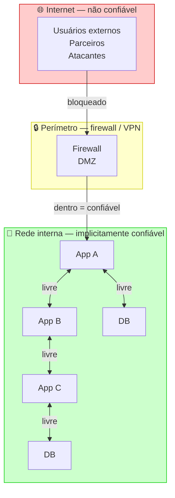

Dentro da rede, serviços se comunicavam livremente. Um serviço que passava pelo firewall tinha acesso a praticamente tudo. A confiança era baseada em localização — se você está dentro, você é confiável.

---

### Por que esse modelo falha para APIs

**APIs existem para romper o perímetro.** Uma API pública, por definição, é exposta à internet. Uma API de parceiro cruzando o perímetro via integração B2B. Uma API interna acessada por times remotos via VPN. O modelo de perímetro foi construído para um mundo onde o valor estava contido dentro da rede — e APIs invertem exatamente essa premissa.

**O perímetro já foi comprometido.** A questão não é se um atacante já está dentro da rede — é quando isso aconteceu. Credenciais comprometidas, phishing, supply chain attacks, insiders maliciosos — todos resultam em um ator dentro do perímetro operando como se fosse confiável. Se a rede interna é implicitamente confiável, um ator comprometido tem acesso lateral irrestrito.

**A rede interna não existe mais como entidade coesa.** Microserviços em múltiplos clusters Kubernetes, workloads em clouds diferentes, times remotos acessando ambientes de desenvolvimento — a "rede interna" é um conceito cada vez mais fictício. Tratar como confiável uma rede que não tem fronteiras claras é uma premissa que não se sustenta.

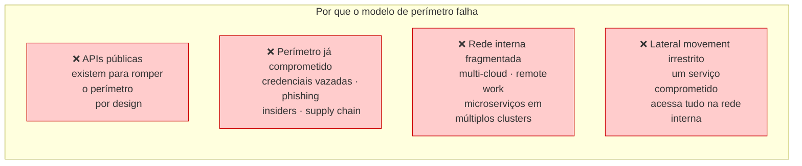

---

### O princípio Zero Trust

O NIST SP 800-207 — publicado em agosto de 2020 — é a referência normativa central para Zero Trust Architecture. O documento define Zero Trust como um conjunto de paradigmas de segurança que move as defesas de amplos perímetros de rede para recursos individuais, com foco em proteger recursos e não segmentos de rede.

> *Rose, S., Borchert, O., Mitchell, S. & Connelly, S. Zero Trust Architecture. NIST SP 800-207, agosto 2020. Disponível em: [doi.org/10.6028/NIST.SP.800-207](https://doi.org/10.6028/NIST.SP.800-207)*

O princípio central: **nunca confiar, sempre verificar.** Nenhuma requisição é implicitamente confiável baseada em localização de rede. Toda requisição é autenticada, autorizada e continuamente validada — independente de onde origina.

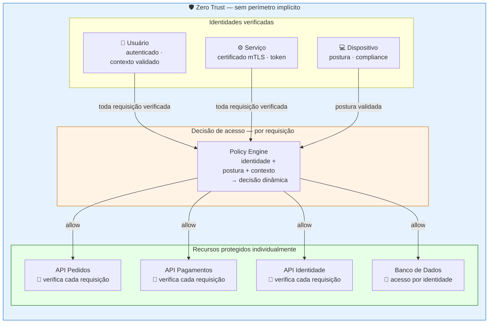

---

## 5.5.2 · Os sete tenets do NIST SP 800-207 aplicados a APIs

O NIST SP 800-207 define sete tenets que formam o núcleo filosófico de uma Zero Trust Architecture. Para cada tenet, a tradução direta para o contexto de APIs:

---

**Tenet 1 — Todos os dados e serviços são recursos**

No contexto de APIs: cada API é um recurso que requer proteção independente — não importa se está na rede interna, em um cloud provider ou exposta publicamente. Uma API de microserviço interno não é menos um recurso do que uma API pública.

*Implicação prática:* o catálogo do Cap 3.5 e o CMDB do Cap 4.3 precisam cobrir todas as APIs — incluindo as de comunicação interna entre serviços. Shadow APIs são um violação direta deste tenet.

---

**Tenet 2 — Toda comunicação é protegida independente de localização de rede**

No contexto de APIs: TLS 1.3 é obrigatório para toda comunicação — incluindo entre serviços internos. A localização na rede interna não é um substituto para criptografia em trânsito.

*Implicação prática:* comunicação entre microserviços sem TLS — comum em redes internas "confiáveis" — viola este tenet. Service mesh com mTLS automático é a implementação arquitetural.

---

**Tenet 3 — Acesso a recursos é concedido por sessão**

No contexto de APIs: tokens de vida curta por requisição ou sessão — não sessões permanentes com acesso irrevogável. Access tokens com expiração de minutos, não horas ou dias.

*Implicação prática:* o modelo de refresh token do Cap 5.4.2 é a implementação — vida curta para access tokens, renovação explícita via refresh token.

---

**Tenet 4 — Acesso é determinado por política dinâmica**

No contexto de APIs: a decisão de acesso considera não apenas o token e o escopo — considera o estado da identidade, do dispositivo, do comportamento e do contexto ambiental. Um token válido de um dispositivo com postura comprometida pode ser negado.

*Implicação prática:* o PDP do Cap 5.4.12 é o componente que implementa política dinâmica. A decisão não é estática — é reavaliada com base em contexto atual.

---

**Tenet 5 — Integridade e postura dos ativos são monitoradas continuamente**

No contexto de APIs: as APIs produzidas e consumidas são ativos cuja postura é monitorada — vulnerabilidades conhecidas, configurações, comportamento anômalo. O monitoramento do Cap 5.2.3 implementa este tenet.

*Implicação prática:* SCA no pipeline verifica dependências com CVEs. Monitoramento comportamental detecta desvios. Reconciliação periódica do portfólio real com o catálogo declarado.

---

**Tenet 6 — Autenticação e autorização são dinâmicas e estritamente aplicadas antes de qualquer acesso**

No contexto de APIs: a sequência completa de validação do Cap 5.4.3 — assinatura, expiração, issuer, audience, scope — é executada a cada requisição. Não há "já validei uma vez, pode passar".

*Implicação prática:* validação no Resource Server a cada requisição. Token introspection para tokens opacos a cada requisição (com cache de TTL curto). Sem confiança residual entre requisições.

---

**Tenet 7 — Coleta de informação e melhoria contínua do estado de segurança**

No contexto de APIs: logs de segurança, métricas de autorização, detecção de anomalias alimentam melhoria contínua da postura. O [Anexo F · SIEM e correlação de eventos de segurança](../anexos/f_siem.md) e o Continual Improvement do Cap 4.6.7 implementam este tenet.

*Implicação prática:* cada incidente de segurança é input para evolução das políticas. O CoE revisa periodicamente a postura Zero Trust do portfólio.

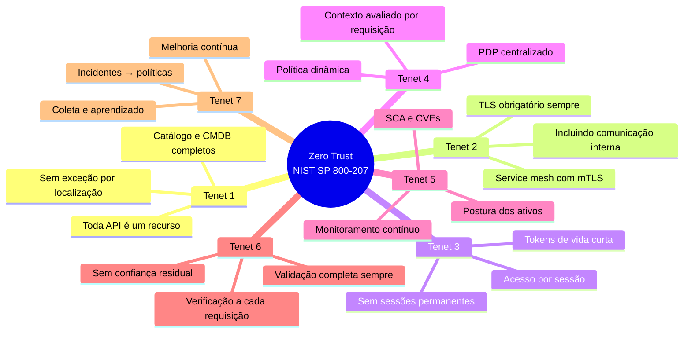

---

## 5.5.3 · Identidade como o novo perímetro

No modelo de perímetro, a localização de rede era o proxy de confiança — estar dentro da rede interna era suficiente. No Zero Trust, **identidade substitui localização** como base de confiança.

Identidade no contexto de Zero Trust para APIs não é apenas o usuário humano — é qualquer entidade que faz uma requisição:

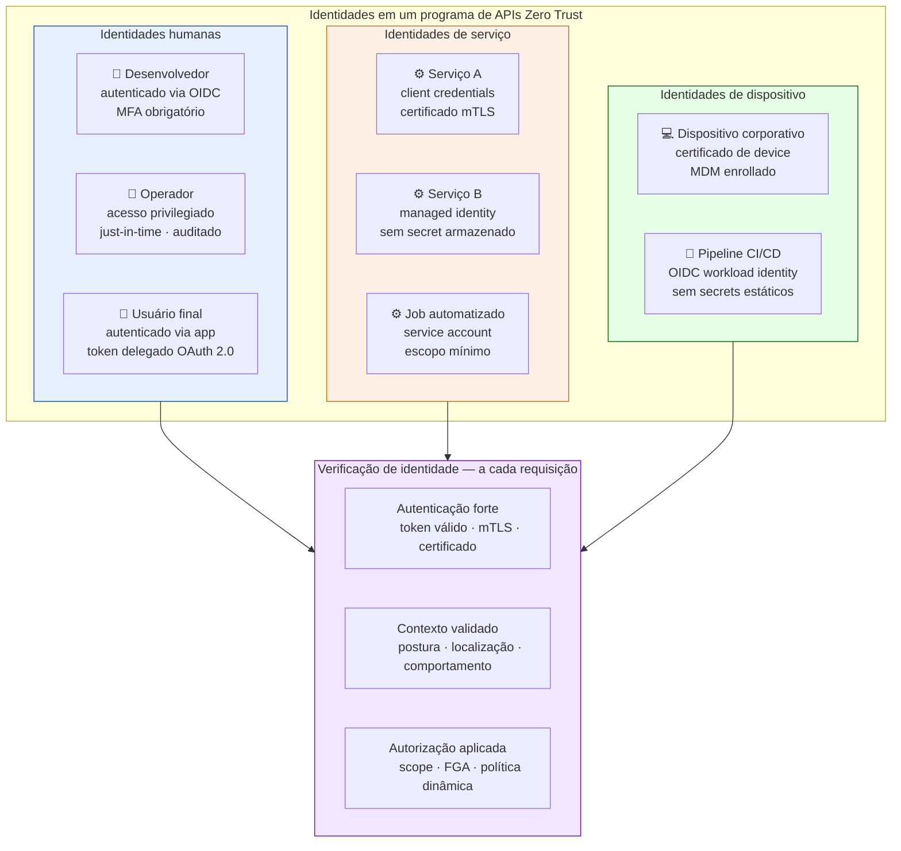

---

### O problema das credenciais de longa vida

O maior vetor de comprometimento em arquiteturas de APIs não é a quebra de criptografia — é o roubo de credenciais de longa vida: secrets hardcoded, API keys que nunca expiram, service accounts com permissões acumuladas ao longo de anos.

Zero Trust combate isso com o princípio de **credenciais efêmeras** — identidades que existem apenas pelo tempo necessário:

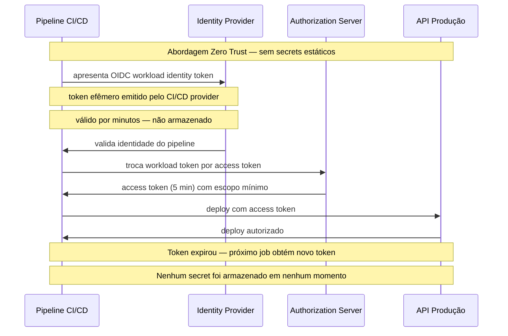

---

## 5.5.4 · Verificação contínua — além do token na entrada

A implementação mais comum de Zero Trust em APIs é a verificação do token na entrada — o gateway valida o token e libera a requisição. Isso é necessário mas não suficiente. Zero Trust pressupõe **verificação contínua** durante a sessão.

```mermaid
stateDiagram-v2
    [*] --> Autenticado : token válido na entrada

    Autenticado --> Monitorado : sessão iniciada

    Monitorado --> Suspeito : anomalia detectada
    Monitorado --> Autorizado : comportamento normal

    Suspeito --> StepUp : step-up authentication
    Suspeito --> Revogado : risco alto — revogar imediatamente

    StepUp --> Autorizado : verificação adicional aprovada
    StepUp --> Revogado : verificação falhou

    Autorizado --> Monitorado : continua sendo monitorado

    Revogado --> [*] : acesso encerrado · incidente registrado

    note right of Suspeito
        Sinais de anomalia:
        — volume acima do histórico
        — padrão sequencial de IDs
        — localização geográfica incomum
        — horário atípico para este consumer
    end note

    note right of StepUp
        Step-up authentication:
        — requer re-autenticação
        — ou segundo fator
        — para operações de alto risco
    end note
```

---

### O que aciona verificação adicional

**Mudança de comportamento durante a sessão** — o consumidor que normalmente faz 100 requisições por hora começa a fazer 10.000. O padrão de IDs acessados torna-se sequencial. O horário é incomum.

**Operação de alto risco** — uma operação que excede um threshold de valor, que afeta um objeto crítico ou que é irreversível pode exigir step-up authentication — confirmação adicional do usuário.

**Sinal externo de comprometimento** — o sistema de monitoramento recebeu alerta de que as credenciais deste consumidor aparecem em um dump de dados comprometidos. O acesso é suspenso preventivamente.

---

## 5.5.5 · Microsegmentação e lateral movement

### O problema do lateral movement

Em arquiteturas de microserviços sem Zero Trust, um serviço comprometido tem acesso lateral irrestrito a todos os outros serviços na rede interna. O atacante que comprometeu o `notificacao-service` pode alcançar o `pagamentos-service` — porque ambos estão na "rede interna confiável".

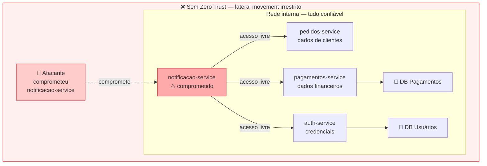

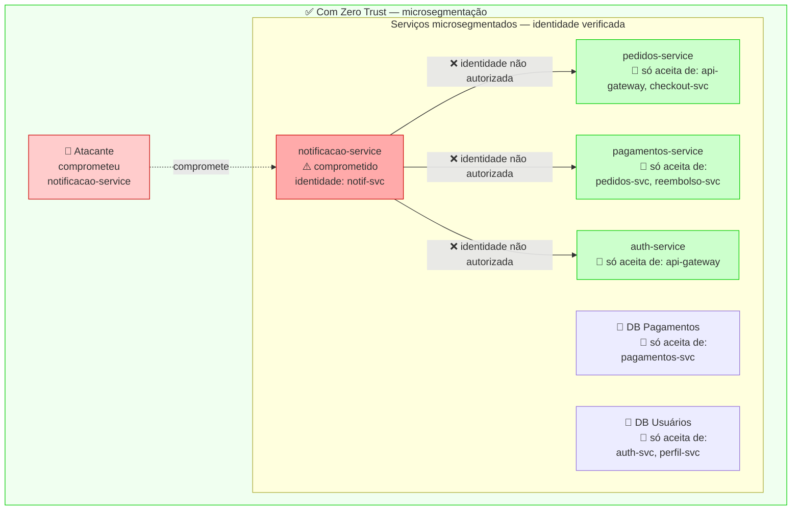

---

### Service mesh como infraestrutura Zero Trust

O service mesh — Istio, Linkerd, Consul Connect — é a infraestrutura que torna microsegmentação operacional em ambientes Kubernetes. Sem service mesh, implementar mTLS entre todos os pares de serviços é manualmente inviável. Com service mesh, mTLS é automático e transparente para o código da aplicação.

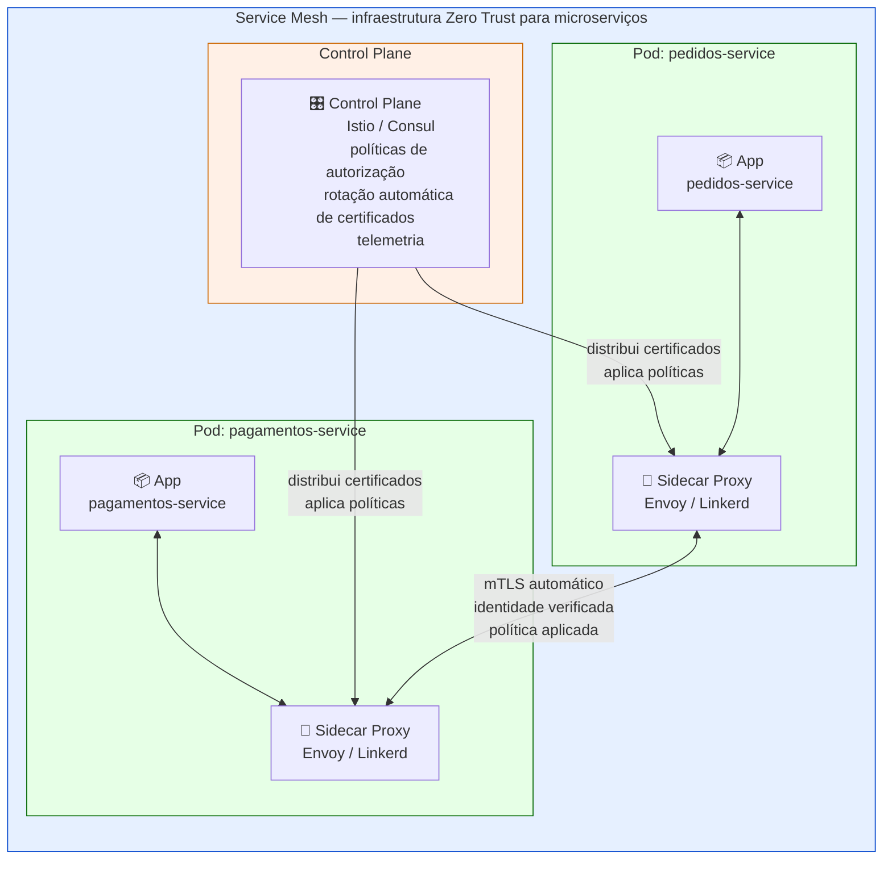

O service mesh implementa os Tenets 2 e 6 do NIST SP 800-207 de forma transparente: toda comunicação entre serviços é protegida via mTLS (Tenet 2), e autenticação e autorização são aplicadas a cada requisição (Tenet 6) — sem que o código da aplicação precise gerenciar certificados ou validar tokens entre serviços.

---

## 5.5.6 · Como Zero Trust conecta os capítulos anteriores

Zero Trust não é uma tecnologia nova a ser implementada do zero. É um **framework que organiza controles já existentes** em uma estratégia coerente. Cada capítulo anterior do Módulo 5 contribui para uma postura Zero Trust:

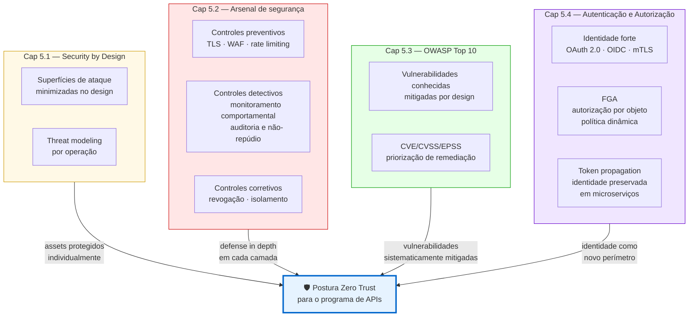

---

### O que Zero Trust acrescenta além dos controles individuais

Cada controle dos capítulos anteriores resolve um problema específico. Zero Trust acrescenta três elementos que os controles individuais não fornecem:

**Coerência** — Zero Trust é o princípio organizador que garante que os controles são aplicados de forma consistente em todo o portfólio, não apenas onde alguém lembrou de configurar.

**Postura de assume breach** — Zero Trust presume que o perímetro já foi comprometido. Esse pressuposto muda o design dos controles: em vez de "como evitar que atacantes entrem", a pergunta é "o que um atacante pode fazer se já estiver dentro?". Microsegmentação, FGA e auditoria são as respostas a essa pergunta.

**Verificação contínua** — os controles individuais verificam na entrada. Zero Trust verifica continuamente — durante toda a sessão, para toda requisição.

---

## 5.5.7 · Maturidade de adoção — Zero Trust não é binário

Zero Trust não é um estado que se atinge — é uma direção que se percorre. Nenhuma organização implementa todos os tenets simultaneamente. O NIST SP 800-207A — extensão do SP 800-207 para ambientes cloud-native — reconhece explicitamente que a adoção é incremental.

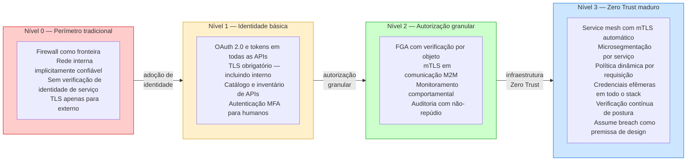

---

### A jornada incremental para um programa de APIs

**De onde partir:** a maioria dos programas de APIs começa no Nível 0 ou entre 0 e 1. O primeiro passo de maior impacto é a adoção consistente de identidade — OAuth 2.0 em todas as APIs, TLS obrigatório inclusive internamente, catálogo completo do portfólio.

**O que desbloqueia cada nível:**

Nível 1 → 2: o modelo de escopos bem definido (Cap 5.1.6), a implementação de FGA (Cap 5.4.12), e o plano de observabilidade ativo (Cap 3.8) são os habilitadores.

Nível 2 → 3: a maturidade operacional do Cap 4.7 (ITIL + SRE + DevOps), o service mapping do Cap 4.3 e a infraestrutura de service mesh são os habilitadores.

**O que o CoE governa nessa jornada:**

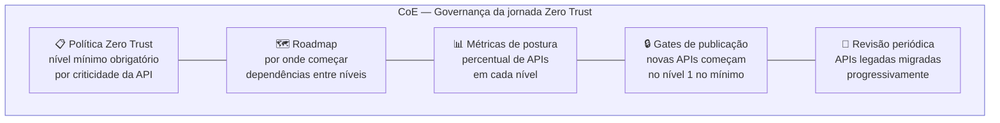

O CoE define o nível mínimo de postura Zero Trust exigido por criticidade — APIs públicas com dados sensíveis no mínimo Nível 2, APIs de microserviços internos no mínimo Nível 1. Novas APIs publicadas precisam atender o nível mínimo como gate de publicação. APIs legadas são migradas progressivamente conforme roadmap.

---

## Pontos-chave do capítulo

- O modelo de perímetro falha para APIs por três razões estruturais: APIs existem para romper o perímetro, o perímetro já foi comprometido e a rede interna fragmentada tornou a localização um proxy inválido de confiança
- O NIST SP 800-207 define sete tenets de Zero Trust. Aplicados a APIs: toda API é um recurso, TLS é obrigatório inclusive internamente, tokens têm vida curta, política é dinâmica por requisição, ativos são monitorados continuamente, autenticação é aplicada a cada requisição e aprendizado contínuo evolui a postura
- Identidade substitui localização como base de confiança. Identidades incluem usuários humanos, serviços, dispositivos e pipelines. Credenciais efêmeras — workload identity, managed identity — eliminam secrets estáticos de longa vida
- Verificação contínua vai além do token na entrada. Anomalias durante a sessão acionam step-up authentication ou revogação. Um token válido não é garantia de comportamento legítimo ao longo de toda a sessão
- Microsegmentação limita lateral movement — um serviço comprometido não alcança outros serviços porque cada serviço verifica a identidade do chamador. Service mesh implementa mTLS automático e microsegmentação de forma transparente para o código da aplicação
- Zero Trust não é uma tecnologia nova — é um framework que organiza os controles dos capítulos anteriores em uma estratégia coerente, acrescentando coerência, assume breach como premissa e verificação contínua
- Zero Trust não é binário. A adoção é incremental em quatro níveis. O CoE governa a jornada definindo nível mínimo por criticidade, roadmap de migração e gates de publicação

---

## Fontes e referências

| Fonte | Referência completa |
|---|---|
| **NIST SP 800-207 (2020)** | Rose, S., Borchert, O., Mitchell, S. & Connelly, S. *Zero Trust Architecture*. NIST SP 800-207, agosto 2020. Disponível em: [doi.org/10.6028/NIST.SP.800-207](https://doi.org/10.6028/NIST.SP.800-207) |
| **NIST SP 800-207A** | *Zero Trust Architecture Model for Cloud-Native Applications*. NIST SP 800-207A. Disponível em: [nvlpubs.nist.gov/nistpubs/SpecialPublications/NIST.SP.800-207A.pdf](https://nvlpubs.nist.gov/nistpubs/SpecialPublications/NIST.SP.800-207A.pdf) |

---

## Próximo capítulo

**5.6 · Segurança no ciclo de vida — shift left** — como a segurança é incorporada em cada fase do ciclo de vida de APIs: threat modeling no design, SAST/SCA no pipeline, revisão de segurança como gate de publicação.

---

*Série: Gerenciamento e Governança de APIs · Módulo 5 · Capítulo 5.5*