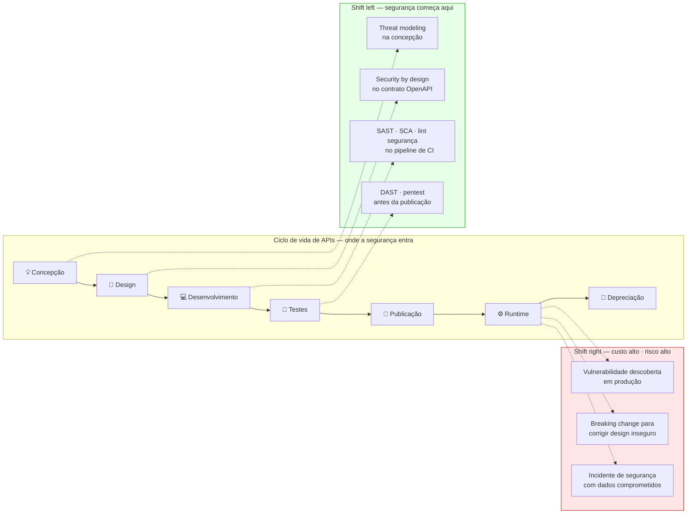
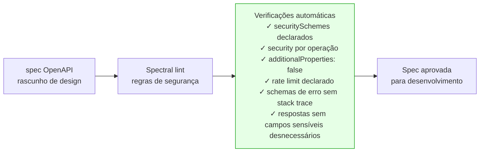
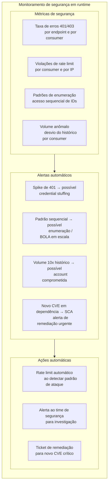
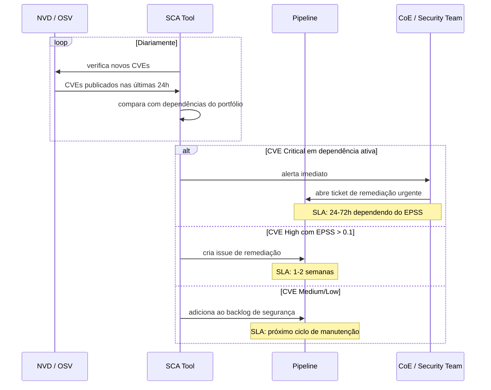
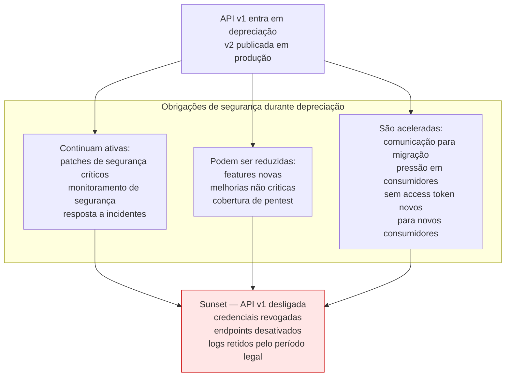
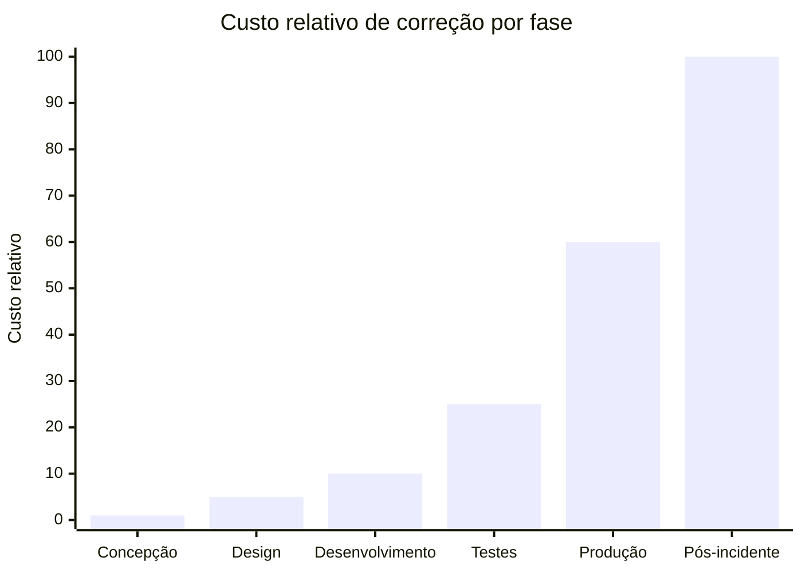

# Módulo 5 · Segurança de APIs
## Capítulo 5.6 · Segurança no ciclo de vida — shift left

> **Série:** Gerenciamento e Governança de APIs
> **Nível:** Técnico e operacional
> **Pré-requisito:** Cap 2.1 · Cap 4.4 · Cap 5.1 · Cap 5.2

---

## Sumário

- [5.6.1 · O princípio shift left aplicado à segurança de APIs](#561--o-princípio-shift-left-aplicado-à-segurança-de-apis)
- [5.6.2 · Segurança na fase de concepção e design](#562--segurança-na-fase-de-concepção-e-design)
- [5.6.3 · Segurança no pipeline — gates automatizados](#563--segurança-no-pipeline--gates-automatizados)
- [5.6.4 · Segurança na publicação e no runtime](#564--segurança-na-publicação-e-no-runtime)
- [5.6.5 · Segurança na depreciação e no sunset](#565--segurança-na-depreciação-e-no-sunset)
- [5.6.6 · O custo do shift right — por que adiar é mais caro](#566--o-custo-do-shift-right--por-que-adiar-é-mais-caro)
- [Fontes e referências](#fontes-e-referências)

---

## 5.6.1 · O princípio shift left aplicado à segurança de APIs

Shift left é o princípio de mover verificações e controles para o mais cedo possível no ciclo de vida — para a esquerda na linha do tempo de desenvolvimento. Originalmente associado a testes, o princípio se aplica com ainda mais força à segurança: quanto mais cedo uma vulnerabilidade é identificada, menor o custo de corrigi-la e menor o risco de ela chegar a produção.

O NIST SP 800-218 — Secure Software Development Framework (SSDF), publicado em fevereiro de 2022 — formaliza a integração de práticas de segurança em todo o ciclo de desenvolvimento de software. É a referência normativa central para shift left de segurança.

> *Souppaya, M., Scarfone, K. & Dodson, D. Secure Software Development Framework (SSDF) v1.1. NIST SP 800-218, fevereiro 2022. Disponível em: [doi.org/10.6028/NIST.SP.800-218](https://doi.org/10.6028/NIST.SP.800-218)*



---

## 5.6.2 · Segurança na fase de concepção e design

### Threat modeling como artefato de design

O Cap 5.1.3 introduziu STRIDE como framework de threat modeling. Na fase de design de uma API, o threat modeling produz um artefato concreto — não apenas um exercício mental. Esse artefato documenta:

- Para cada operação: as ameaças identificadas por STRIDE
- Os controles de mitigação decididos
- As decisões de design que resultaram da análise
- As ameaças residuais aceitas conscientemente

Esse artefato é revisado pelo CoE como parte do gate de concepção. Uma API cujo threat model não foi documentado não está pronta para o próximo estágio do ciclo de vida.

### Security requirements no backlog

Requisitos de segurança não são diferentes de requisitos funcionais — pertencem ao backlog do time de produto com a mesma prioridade. A formalização dos requisitos de segurança como stories ou tasks no backlog garante que não são esquecidos sob pressão de prazo.

Exemplos de security requirements derivados do threat model:

```
Story: Verificação de ownership em GET /pedidos/{id}
  Como: sistema de autorização
  Quero: verificar que pedido.owner_id == token.sub antes de retornar
  Para: prevenir BOLA (OWASP API1)
  Critério de aceite: requisição com token de outro usuário retorna 403

Story: Schema restritivo em PATCH /usuarios/{id}
  Como: endpoint de atualização de perfil
  Quero: rejeitar campos não declarados no schema
  Para: prevenir mass assignment (OWASP API3)
  Critério de aceite: payload com campo 'role' retorna 400
```

### Design seguro do contrato OpenAPI

A spec OpenAPI é o primeiro artefato verificável de segurança. Um pipeline de lint configurado com regras de segurança verifica automaticamente a spec antes que qualquer código seja escrito:



---

## 5.6.3 · Segurança no pipeline — gates automatizados

O pipeline de CI/CD é onde shift left de segurança se materializa em verificações automáticas e obrigatórias. O Cap 4.4.7 introduziu os gates do pipeline; aqui o foco é especificamente nos gates de segurança.

```mermaid
graph TB
    commit["📝 Commit / Pull Request"]

    subgraph pipeline["Pipeline de CI/CD — gates de segurança"]
        direction TB

        subgraph gate1["Gate 1 — Análise Estática"]
            sast["SAST
            vulnerabilidades no código
            injeção · autenticação fraca
            criptografia insegura"]
            sca["SCA
            dependências com CVEs
            licenças incompatíveis
            versões desatualizadas"]
            secret_scan["Secret scanning
            credenciais hardcoded
            API keys · tokens
            strings de conexão"]
        end

        subgraph gate2["Gate 2 — Qualidade do Contrato"]
            lint_sec["Lint de segurança
            Spectral com regras de segurança
            securitySchemes · scopes · schemas"]
            breaking["Breaking change detection
            mudanças que quebram contratos
            sem versionamento adequado"]
        end

        subgraph gate3["Gate 3 — Testes de Segurança"]
            unit_sec["Testes unitários de autorização
            ownership · BOLA · BFLA
            casos de negação explícitos"]
            contract_sec["Contract tests de segurança
            401 sem token
            403 token sem scope
            403 objeto de outro usuário"]
        end

        subgraph gate4["Gate 4 — Análise Dinâmica (staging)"]
            dast["DAST
            OWASP ZAP · Burp Suite
            testa API em execução
            injeção · auth · config"]
            pentest_auto["Pentest automatizado
            fuzzing de payloads
            enumeração de IDs
            manipulação de tokens"]
        end

        gate1 --> gate2 --> gate3 --> gate4
    end

    deploy["🚀 Deploy autorizado
    todos os gates passaram"]

    commit --> gate1
    gate4 --> deploy

    style gate1 fill:#fff9e6,stroke:#cc9900
    style gate2 fill:#e6f0ff,stroke:#0044cc
    style gate3 fill:#e6ffe6,stroke:#009900
    style gate4 fill:#ffe6f0,stroke:#cc0044
```



### Secret scanning como gate obrigatório

Secret scanning merece atenção especial porque um secret commitado uma vez permanece no histórico do repositório — mesmo após ser removido do código atual. Ferramentas como GitHub Secret Scanning, GitLeaks e TruffleHog varrem o histórico completo do repositório, não apenas o commit atual.

O gate de secret scanning deve bloquear o merge imediatamente quando qualquer credencial é detectada — sem exceções. O processo de remediação inclui invalidar o secret comprometido antes de qualquer outra ação, independente de se o repositório é público ou privado.

### Política de severidade para vulnerabilidades

O pipeline precisa de uma política explícita sobre quais severidades de vulnerabilidade bloqueiam o deploy. Uma política razoável baseada em CVSS e EPSS:

| Severidade | EPSS | Decisão |
|---|---|---|
| Critical (CVSS ≥ 9.0) | qualquer | Bloqueia imediatamente |
| High (CVSS ≥ 7.0) | > 0.1 | Bloqueia — probabilidade real de exploração |
| High (CVSS ≥ 7.0) | ≤ 0.1 | Alerta — prazo para remediação |
| Medium (CVSS < 7.0) | qualquer | Registra — backlog de segurança |

---

## 5.6.4 · Segurança na publicação e no runtime

### Gate de segurança na publicação

Antes de uma API ir a produção, uma revisão de segurança pelo CoE verifica que:

- O threat model foi produzido e revisado
- Os gates do pipeline passaram sem exceções não documentadas
- O modelo de autorização está documentado no contrato
- Os escopos seguem a taxonomia do portfólio (Cap 5.1.6)
- Os dados sensíveis estão identificados e protegidos

Para APIs de alto risco — APIs públicas com dados sensíveis, APIs financeiras — um pentest manual antes da publicação pode ser exigido além dos gates automatizados.

### Monitoramento de segurança em runtime

Uma vez em produção, a segurança não termina — começa o ciclo detectivo. O plano de observabilidade do Cap 3.8 precisa incluir dimensões de segurança:



### Gestão contínua de CVEs em produção

A publicação de uma API não congela suas dependências. CVEs são publicados continuamente — uma dependência sem vulnerabilidade hoje pode ter uma amanhã. O programa de segurança precisa de um processo contínuo:



---

## 5.6.5 · Segurança na depreciação e no sunset

A fase de depreciação e sunset tem dimensões de segurança específicas que frequentemente são ignoradas — o foco do time está no lançamento da nova versão, e a versão antiga é tratada como problema resolvido.

**Versões depreciadas são superfície de ataque crescente.** Uma API v1 em depreciação para a v2 continua recebendo atualizações de segurança? Vulnerabilidades descobertas na v1 são corrigidas? Se não, a versão em depreciação torna-se progressivamente mais vulnerável enquanto ainda tem tráfego de consumidores que não migraram.



**Revogação de credenciais no sunset** é um processo de segurança crítico que o Cap 2.6 trata do ponto de vista operacional. Do ponto de vista de segurança: todas as credenciais emitidas para a versão desativada devem ser revogadas — client_ids, API keys, certificados. Consumidores que não migraram a tempo não devem simplesmente receber 404 — suas credenciais devem ser desativadas para prevenir tentativas de acesso que exploram comportamento residual de infraestrutura.

---

## 5.6.6 · O custo do shift right — por que adiar é mais caro

A pressão para não priorizar segurança durante o desenvolvimento é real. Prazos, backlog funcional, débito técnico. Mas o custo de descobrir vulnerabilidades em produção é ordens de magnitude maior do que descobri-las no design.



Os fatores que amplificam o custo em produção:

**Breaking changes** — corrigir um design inseguro em produção frequentemente exige breaking changes que impactam consumidores existentes. O processo de versionamento e sunset do Cap 2.5 e 2.6 tem custo operacional e de relacionamento significativo.

**Dano já causado** — uma vulnerabilidade descoberta em produção pode já ter sido explorada. Dados já exfiltrados não são recuperados com a correção. O custo do incidente — investigação forense, notificação regulatória, dano reputacional — soma-se ao custo técnico da correção.

**Urgência que derruba qualidade** — correções de segurança em produção feitas sob pressão de tempo tendem a ser menos cuidadosas do que o normal. Patches de emergência introduzem novos problemas. O ciclo de correção apressada → novo problema → nova correção é mais caro do que teria sido a correção durante o desenvolvimento.

---

## Pontos-chave do capítulo

- Shift left de segurança move verificações para o mais cedo possível no ciclo de vida. O NIST SP 800-218 (SSDF) é a referência normativa que formaliza a integração de segurança em todo o ciclo de desenvolvimento
- Na fase de design: threat modeling produz artefatos concretos revisados pelo CoE, security requirements entram no backlog com a mesma prioridade que requisitos funcionais, e o lint de segurança da spec OpenAPI verifica controles antes que qualquer código seja escrito
- O pipeline de CI/CD implementa quatro gates de segurança: análise estática (SAST + SCA + secret scanning), qualidade do contrato (lint + breaking changes), testes de autorização e análise dinâmica (DAST)
- Secret scanning é gate obrigatório que bloqueia merges. Um secret commitado uma vez permanece no histórico — a invalidação do secret precede qualquer outra ação de remediação
- Em runtime, o monitoramento de segurança cobre métricas de 401/403, violações de rate limit, padrões de enumeração e volume anômalo — com alertas e ações automáticas
- A gestão contínua de CVEs em produção exige processo com SLA definido por severidade e EPSS. CVEs críticos: 24-72h. High com EPSS > 0.1: 1-2 semanas
- Depreciação tem obrigações de segurança específicas: patches críticos continuam, monitoramento continua, e credenciais são revogadas no sunset
- O custo de correção em produção é ordens de magnitude maior do que no design — amplificado por breaking changes, dano já causado e urgência que derruba qualidade

---

## Fontes e referências

| Fonte | Referência completa |
|---|---|
| **NIST SP 800-218 — SSDF (2022)** | Souppaya, M., Scarfone, K. & Dodson, D. *Secure Software Development Framework (SSDF) v1.1*. NIST SP 800-218, fevereiro 2022. Disponível em: [doi.org/10.6028/NIST.SP.800-218](https://doi.org/10.6028/NIST.SP.800-218) |
| **OWASP API Security Top 10 (2023)** | OWASP Foundation. Disponível em: [owasp.org/www-project-api-security](https://owasp.org/www-project-api-security/) |

---

## Próximo capítulo

**5.7 · Segurança no gateway e na plataforma** — como o gateway e a plataforma de APIs implementam controles de segurança centralizados que complementam o design seguro e o pipeline.

---

*Série: Gerenciamento e Governança de APIs · Módulo 5 · Capítulo 5.6*