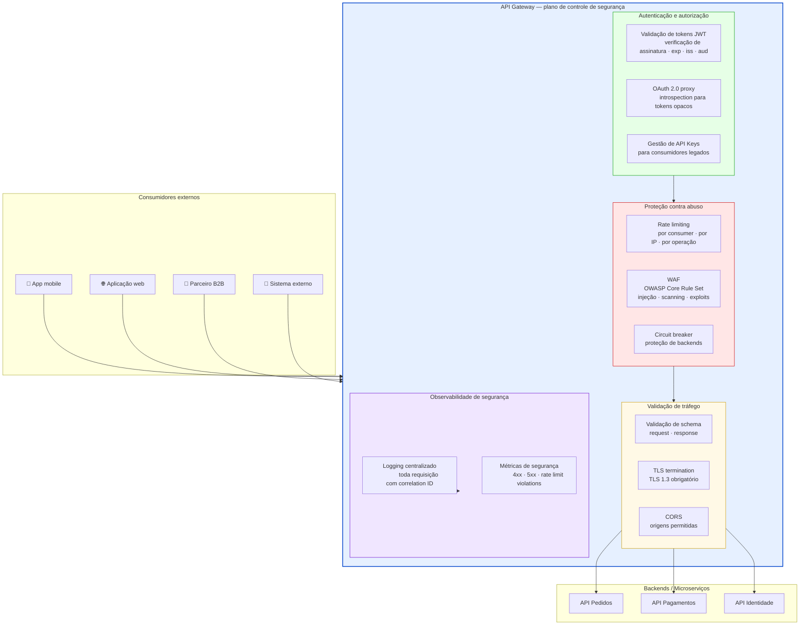
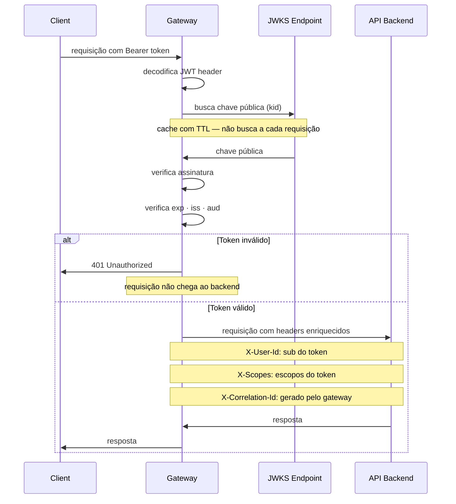
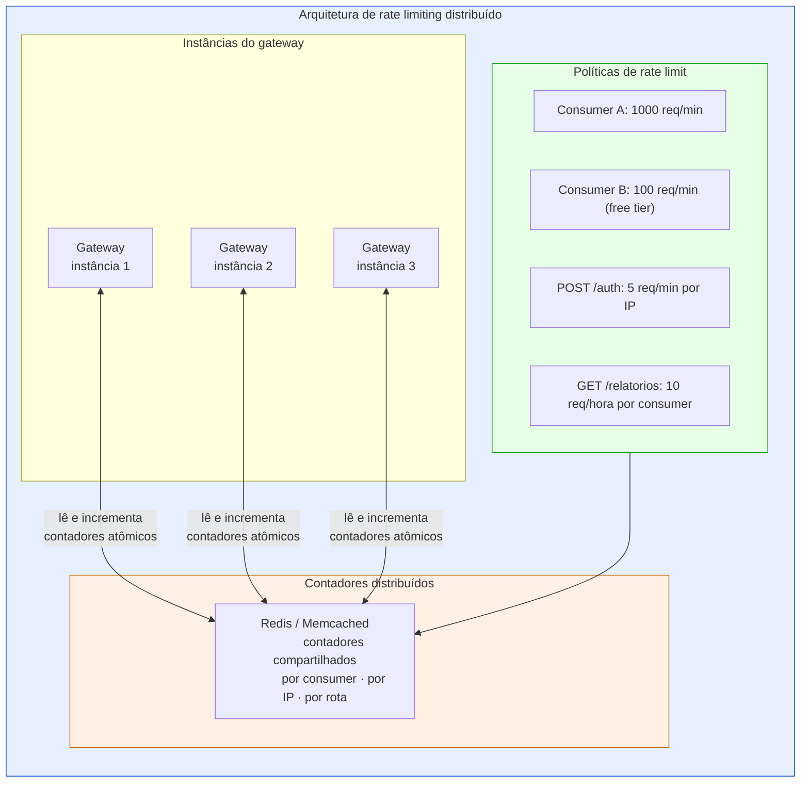
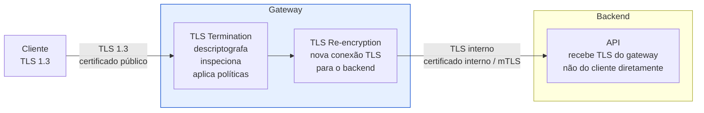
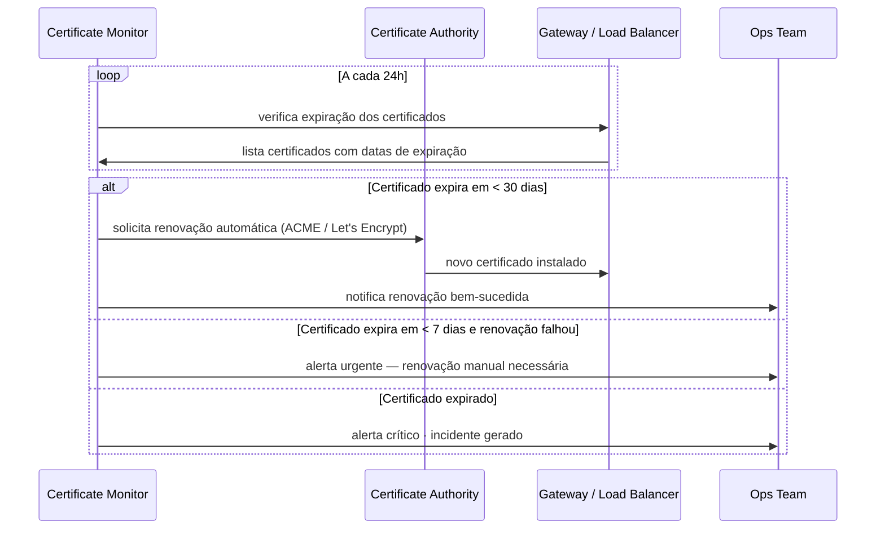
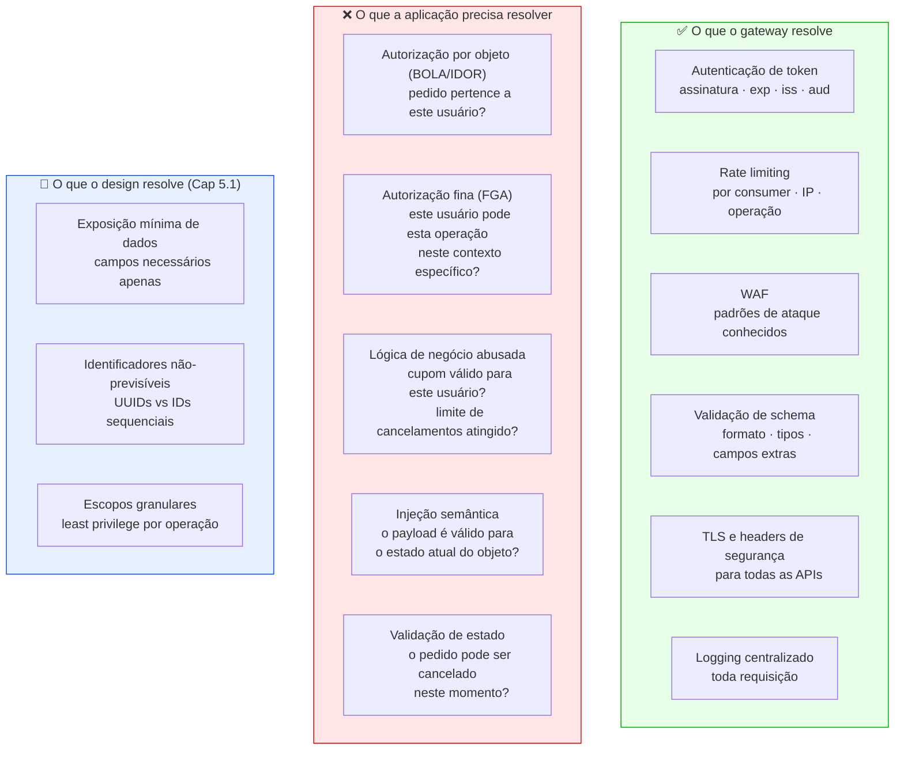

# Módulo 5 · Segurança de APIs
## Capítulo 5.7 · Segurança no gateway e na plataforma

> **Série:** Gerenciamento e Governança de APIs
> **Nível:** Técnico e operacional
> **Pré-requisito:** Cap 5.2 · Cap 5.4 · Cap 5.5

---

## Sumário

- [5.7.1 · O gateway como plano de controle de segurança](#571--o-gateway-como-plano-de-controle-de-segurança)
- [5.7.2 · Controles de autenticação e autorização no gateway](#572--controles-de-autenticação-e-autorização-no-gateway)
- [5.7.3 · Proteção contra abuso — rate limiting e throttling avançados](#573--proteção-contra-abuso--rate-limiting-e-throttling-avançados)
- [5.7.4 · Validação e filtragem de tráfego](#574--validação-e-filtragem-de-tráfego)
- [5.7.5 · TLS, certificados e gestão de segredos na plataforma](#575--tls-certificados-e-gestão-de-segredos-na-plataforma)
- [5.7.6 · O que o gateway não pode fazer — e o que a aplicação precisa resolver](#576--o-que-o-gateway-não-pode-fazer--e-o-que-a-aplicação-precisa-resolver)
- [Fontes e referências](#fontes-e-referências)

---

## 5.7.1 · O gateway como plano de controle de segurança

O gateway de APIs é o ponto de entrada centralizado do portfólio — e por isso é o lugar natural para aplicar controles de segurança que valem para todas as APIs, sem que cada time de produto precise reimplementá-los.

Essa centralização tem valor real: políticas de autenticação, rate limiting, validação de schema e WAF configurados uma vez no gateway se aplicam a todas as APIs que passam por ele. A alternativa — cada API implementando cada controle individualmente — é inconsistente por natureza.



---

## 5.7.2 · Controles de autenticação e autorização no gateway

### Validação de tokens JWT no gateway

O gateway pode validar tokens JWT localmente usando as chaves públicas do Authorization Server — disponíveis no JWKS endpoint. Essa validação acontece antes que a requisição chegue ao backend, eliminando requisições com tokens inválidos sem consumir recursos dos serviços.

A validação no gateway verifica: assinatura, expiração (`exp`), issuer (`iss`) e audiência (`aud`). O que o gateway geralmente não pode verificar — e que pertence ao backend — é o escopo no nível de operação específica e a autorização por objeto (FGA).



### Propagação de claims para os backends

O gateway enriquece as requisições com informações extraídas do token antes de encaminhar ao backend — eliminando a necessidade de cada backend validar e decodificar o token de forma independente.

Esse padrão de propagação de claims é conveniente mas tem um risco: se o backend confia cegamente nos headers propagados pelo gateway, um atacante que acessa o backend diretamente (contornando o gateway) pode forjar esses headers.

A mitigação: backends devem ser acessíveis apenas pelo gateway — via regras de rede, service mesh ou validação de certificado mTLS. Um backend que pode ser acessado diretamente sem passar pelo gateway é uma vulnerabilidade de design.

### Suporte a múltiplos provedores de identidade

Em portfólios com múltiplos Authorization Servers — Entra ID para usuários corporativos, Cognito para usuários externos, Keycloak para aplicações legadas — o gateway pode suportar múltiplos JWKS endpoints e validar tokens de diferentes issuers conforme configuração por rota.

---

## 5.7.3 · Proteção contra abuso — rate limiting e throttling avançados

### Granularidade de rate limiting

O Cap 5.2.2 introduziu rate limiting por consumer, operação e IP. No gateway, a implementação dessas camadas requer uma arquitetura de armazenamento distribuído para que os limites se apliquem corretamente em ambientes com múltiplas instâncias do gateway.



### Rate limiting adaptativo

Rate limiting estático — N requisições por minuto — é eficaz contra abuso de volume mas não detecta ataques que ficam abaixo dos thresholds. Rate limiting adaptativo ajusta os limites dinamicamente com base no comportamento observado:

- Um consumidor que nunca excedeu 100 req/min e de repente está em 900 req/min recebe throttling progressivo mesmo que ainda esteja abaixo do limite absoluto
- Um IP que fez 50 tentativas de autenticação falhadas em 5 minutos recebe rate limiting mais restritivo mesmo que esteja abaixo do limite por requisição

### Headers de rate limit na resposta

O gateway deve comunicar o status de rate limit ao consumidor via headers padronizados, permitindo que consumidores bem implementados se ajustem antes de atingir o limite:

```
HTTP/1.1 200 OK
X-RateLimit-Limit: 1000
X-RateLimit-Remaining: 247
X-RateLimit-Reset: 1700000060
Retry-After: 60  # incluído apenas quando 429 é retornado
```

---

## 5.7.4 · Validação e filtragem de tráfego

### Validação de schema no gateway

O gateway pode validar requests contra a spec OpenAPI antes de encaminhá-los ao backend. Requisições com payloads que violam o schema — campos faltando, tipos errados, campos extras quando `additionalProperties: false` — são rejeitadas no gateway com 400, sem consumir recursos do backend.

Essa validação é uma camada adicional de proteção — não substitui a validação na aplicação. Um atacante que controla a rede pode tentar contornar o gateway. A aplicação sempre valida o input que recebe, independente de onde veio.

### WAF no gateway

O WAF configurado no gateway — com o OWASP Core Rule Set como baseline — filtra padrões de ataque conhecidos antes que cheguem ao backend. O Cap 5.2.2 documentou as limitações estruturais do WAF para APIs: não detecta IDOR, mass assignment nem lógica de negócio abusada. No gateway, o WAF cobre o que consegue — injeção, scanning, exploits de CVEs conhecidos — sem a ilusão de que é suficiente sozinho.

### Headers de segurança na resposta

O gateway adiciona headers de segurança a todas as respostas — sem que cada backend precise fazê-lo individualmente:

```
Strict-Transport-Security: max-age=31536000; includeSubDomains
X-Content-Type-Options: nosniff
X-Frame-Options: DENY
Cache-Control: no-store
Content-Security-Policy: default-src 'none'
```

### CORS centralizado

Configuração de CORS no gateway — com allowlist explícita de origens — aplicada uniformemente a todas as APIs. Sem configuração de CORS no gateway, cada backend precisaria configurá-lo individualmente, com risco de `Access-Control-Allow-Origin: *` em APIs que retornam dados sensíveis.

---

## 5.7.5 · TLS, certificados e gestão de segredos na plataforma

### TLS termination e re-encryption



O gateway termina a conexão TLS do cliente — descriptografa o tráfego para inspecionar e aplicar políticas — e estabelece uma nova conexão TLS para o backend. Essa arquitetura (TLS termination + re-encryption) é o padrão para gateways que precisam inspecionar tráfego.

A alternativa — TLS passthrough — não permite inspeção de tráfego no gateway mas garante criptografia end-to-end até o backend.

### Gestão de certificados na plataforma

Certificados TLS expirados são uma das causas mais comuns de indisponibilidade e de vulnerabilidades de segurança em APIs. A plataforma precisa de automação de gestão de certificados:



### Secrets da plataforma

Credenciais da plataforma — client secrets de integrações com Authorization Servers, credenciais de banco de dados, API keys de serviços externos — devem ser gerenciadas via vault centralizado, nunca em arquivos de configuração ou variáveis de ambiente em texto plano.

O NIST SP 800-57 (Cap 5.2.2) define os princípios: ciclo de vida com rotação periódica, least privilege, e revogação imediata em caso de comprometimento.

---

## 5.7.6 · O que o gateway não pode fazer — e o que a aplicação precisa resolver

A centralização no gateway tem um limite fundamental: o gateway não conhece a semântica de negócio das APIs que protege. Há controles que só podem existir na aplicação:



Essa divisão de responsabilidades é o argumento central do Módulo 5 como um todo: segurança robusta de APIs emerge da combinação de design seguro (Cap 5.1), controles na plataforma (Cap 5.7) e lógica de autorização na aplicação (Cap 5.4.12) — não de nenhum dos três isoladamente.

---

## Pontos-chave do capítulo

- O gateway é o plano de controle de segurança centralizado — autenticação de tokens, rate limiting, WAF, validação de schema, TLS e headers de segurança aplicados a todas as APIs sem que cada time precise reimplementar
- A validação JWT no gateway elimina requisições inválidas antes que consumam recursos dos backends. Os claims validados no gateway — assinatura, exp, iss, aud — não incluem FGA, que pertence à aplicação
- Backends devem ser acessíveis apenas via gateway. Um backend acessível diretamente invalida todos os controles de segurança do gateway
- Rate limiting distribuído exige armazenamento compartilhado (Redis) para que os limites se apliquem corretamente em múltiplas instâncias do gateway. Rate limiting adaptativo complementa o estático para ataques abaixo dos thresholds
- Gestão automatizada de certificados — renovação proativa antes da expiração — previne a causa mais evitável de incidentes de disponibilidade e vulnerabilidade
- O gateway não conhece a semântica de negócio: BOLA, FGA e lógica de negócio abusada são responsabilidade da aplicação. Segurança robusta combina gateway, aplicação e design — não qualquer um deles isoladamente

---

## Fontes e referências

| Fonte | Referência completa |
|---|---|
| **OWASP Core Rule Set** | OWASP Foundation. *OWASP ModSecurity Core Rule Set*. Disponível em: [coreruleset.org](https://coreruleset.org/) |
| **NIST SP 800-57 Pt1 Rev.5 (2020)** | Barker, E. *Recommendation for Key Management*. NIST SP 800-57 Part 1 Revision 5. Disponível em: [csrc.nist.gov/pubs/sp/800/57/pt1/r5/final](https://csrc.nist.gov/pubs/sp/800/57/pt1/r5/final) |

---

## Próximo capítulo

**5.8 · Segurança em APIs de parceiros e APIs públicas** — as dimensões específicas de segurança para APIs expostas além dos limites organizacionais.

---

*Série: Gerenciamento e Governança de APIs · Módulo 5 · Capítulo 5.7*