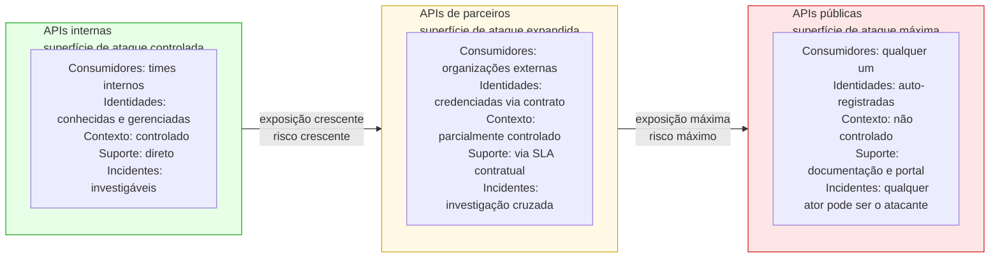
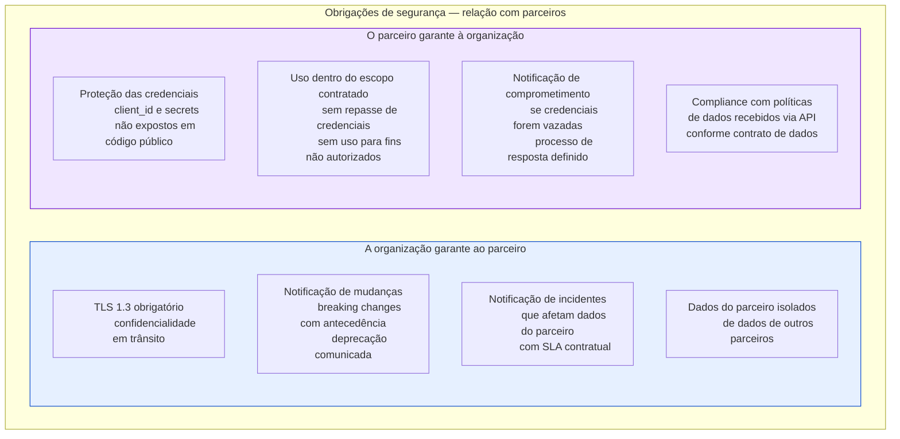
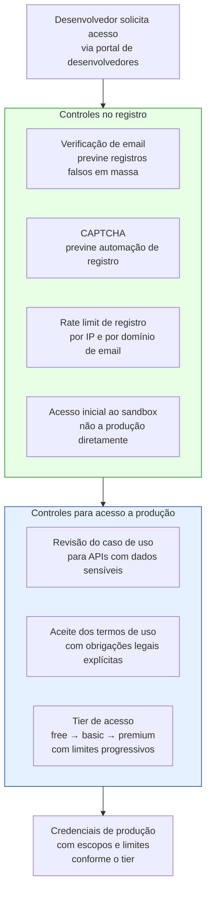
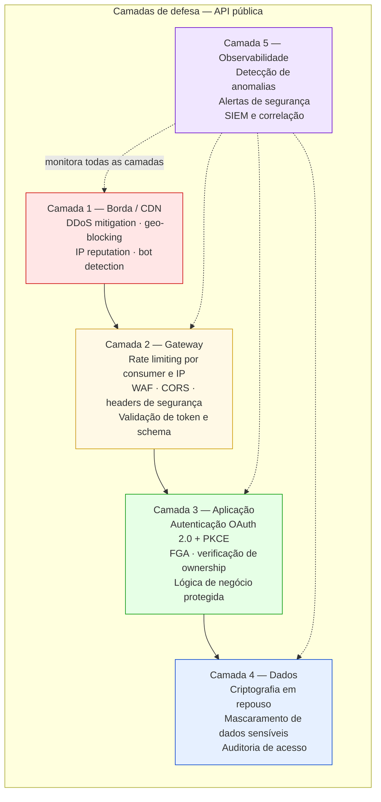
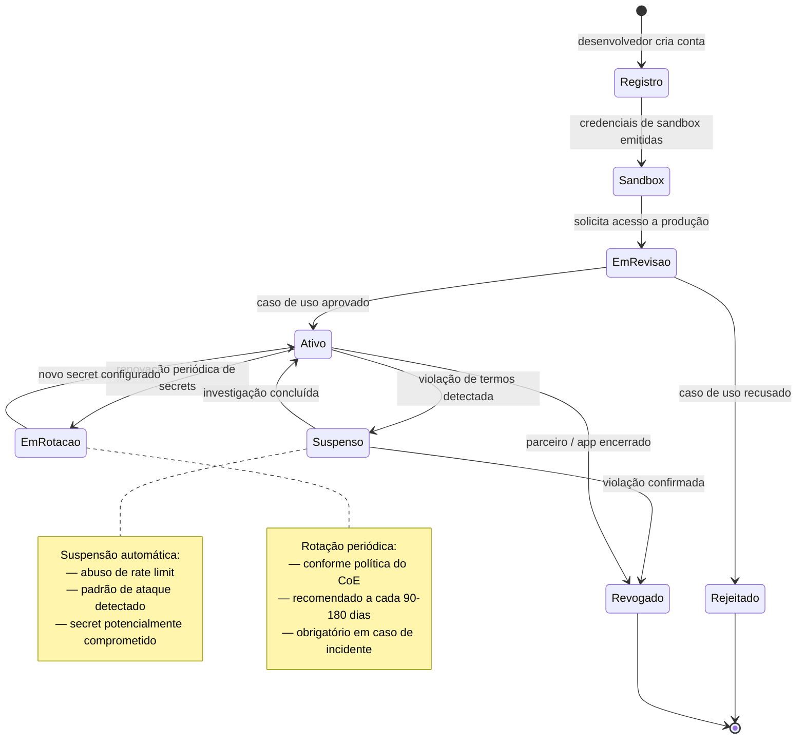
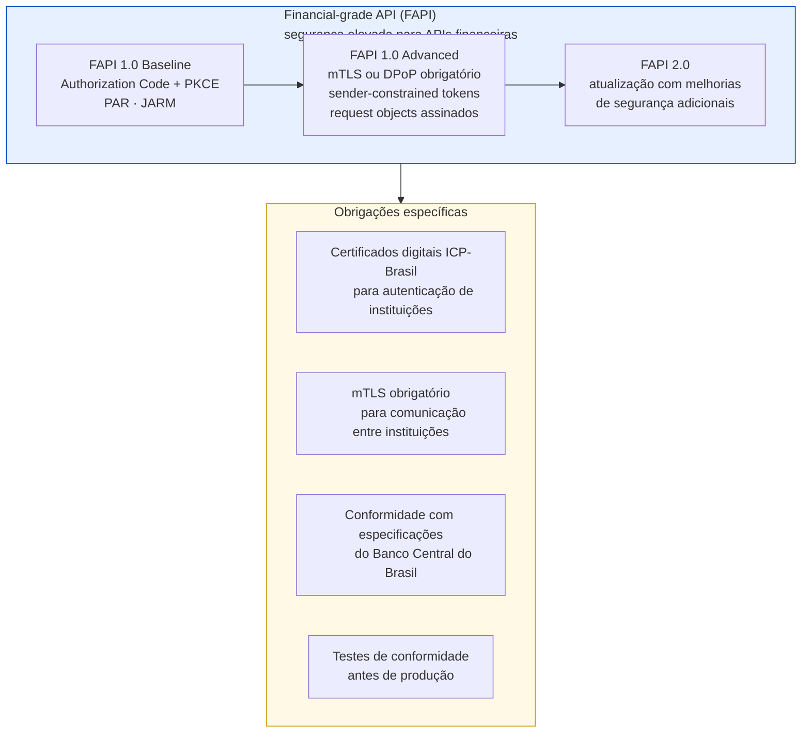

# Módulo 5 · Segurança de APIs
## Capítulo 5.8 · Segurança em APIs de parceiros e APIs públicas

> **Série:** Gerenciamento e Governança de APIs
> **Nível:** Estratégico e técnico
> **Pré-requisito:** Cap 3.6 · Cap 5.4 · Cap 5.7

---

## Sumário

- [5.8.1 · A ampliação da superfície de ataque além do perímetro](#581--a-ampliação-da-superfície-de-ataque-além-do-perímetro)
- [5.8.2 · Segurança em APIs de parceiros](#582--segurança-em-apis-de-parceiros)
- [5.8.3 · Segurança em APIs públicas](#583--segurança-em-apis-públicas)
- [5.8.4 · Credenciamento e gestão do ciclo de vida de consumidores externos](#584--credenciamento-e-gestão-do-ciclo-de-vida-de-consumidores-externos)
- [5.8.5 · Obrigações regulatórias em mercados específicos](#585--obrigações-regulatórias-em-mercados-específicos)
- [Fontes e referências](#fontes-e-referências)

---

## 5.8.1 · A ampliação da superfície de ataque além do perímetro

APIs internas são consumidas por atores conhecidos em contextos controlados — times de produto da mesma organização, com acesso a repositórios, pipelines e processos de suporte. Quando uma API é exposta a parceiros ou ao público, o modelo de risco muda fundamentalmente.

---

## 5.8.2 · Segurança em APIs de parceiros

O Cap 3.6 tratou governança de APIs de parceiros em profundidade — acordos, SLAs, credenciamento. Aqui o foco é nas dimensões específicas de segurança dessa relação.

### Modelo de confiança com parceiros

Parceiros não são consumidores internos mas também não são o público geral. Há uma relação contratual que estabelece obrigações mútuas de segurança — o que a organização garante ao parceiro e o que o parceiro precisa garantir para acessar as APIs.

### Isolamento de credenciais por parceiro

Cada parceiro recebe credenciais exclusivas — client_id e client_secret ou certificado mTLS próprio. Credenciais compartilhadas entre parceiros são inaceitáveis: um incidente em um parceiro comprometeria todos os outros, e a trilha de auditoria não distinguiria as ações de parceiros diferentes.

### Escopos restritos ao caso de uso contratado

O princípio de least privilege aplicado a parceiros: o parceiro recebe apenas os escopos necessários para o caso de uso contratado — não um escopo amplo "por conveniência". Se o contrato prevê leitura de pedidos, o token do parceiro tem `pedidos:read` — não `api:full_access`.

O CoE mantém o registro de quais escopos cada parceiro tem autorizado (Cap 5.1.6) — auditável, revisável e revogável.

### Monitoramento diferenciado para parceiros

O comportamento esperado de um parceiro é mais previsível do que o de consumidores do público geral — há um contrato que define o caso de uso. Desvios desse padrão são sinais mais claros de problema:

- Volume muito acima do contratado pode indicar uso indevido ou comprometimento
- Acesso a endpoints não previstos no caso de uso contratado é um sinal imediato de investigação
- Horários incomuns para o fuso horário do parceiro merecem atenção

---

## 5.8.3 · Segurança em APIs públicas

APIs públicas têm o modelo de risco mais exigente: qualquer pessoa pode se registrar, qualquer pessoa pode tentar explorar vulnerabilidades, e o volume de tentativas de ataque é ordens de magnitude maior do que em APIs internas ou de parceiros.

### Registro e onboarding seguro de consumidores

O self-service de registro — onde qualquer desenvolvedor pode criar uma conta e obter credenciais — é o padrão para APIs públicas. Mas self-service não significa ausência de controles:

### Defesa em profundidade para APIs públicas

APIs públicas exigem todas as camadas de defesa discutidas no módulo — com ênfase especial em proteção contra abuso automatizado:

### Programa de responsible disclosure

APIs públicas são alvo de pesquisadores de segurança que buscam vulnerabilidades — tanto de forma mal-intencionada quanto de boa-fé. Um programa de responsible disclosure (ou bug bounty) canaliza as descobertas de boa-fé para um processo estruturado, em vez de resultar em divulgação pública sem aviso.

Um programa mínimo inclui: política de disclosure publicada no portal, canal de comunicação seguro para reportar vulnerabilidades, SLA de resposta inicial (geralmente 48-72h), e reconhecimento público ou recompensa para descobertas válidas.

---

## 5.8.4 · Credenciamento e gestão do ciclo de vida de consumidores externos

### O ciclo de vida das credenciais de consumidores externos

### Revogação de acesso — processo e urgência

A capacidade de revogar rapidamente as credenciais de um consumidor externo é tão crítica quanto a de revogar um token. O processo precisa ser documentado e testado:

**Revogação imediata** — para incidentes de segurança confirmados, comprometimento de credenciais ou violações graves de termos. Executada em minutos, com comunicação ao consumidor em paralelo.

**Revogação planejada** — para encerramento de contratos, mudança de parceiro ou desativação de aplicações. Com período de notificação adequado (geralmente 30-90 dias).

**Suspensão temporária** — para investigação de comportamento suspeito sem confirmação de incidente. O acesso é bloqueado enquanto a investigação acontece — se o comportamento for legítimo, a suspensão é revertida.

---

## 5.8.5 · Obrigações regulatórias em mercados específicos

Em mercados regulados, a segurança de APIs não é apenas uma boa prática — é uma obrigação legal com consequências de não-conformidade.

### LGPD e APIs com dados pessoais

A Lei Geral de Proteção de Dados — LGPD — impõe obrigações específicas para APIs que processam dados pessoais:

**Minimização de dados** — APIs não devem coletar ou expor mais dados pessoais do que o necessário para a finalidade declarada. O princípio de exposição mínima do Cap 5.1.2 é também uma obrigação legal sob a LGPD.

**Notificação de incidentes** — a LGPD estabelece prazo de 72 horas para notificação à ANPD em casos de incidentes que possam acarretar risco ou dano relevante aos titulares. O processo de resposta a incidentes do Cap 5.9 deve incluir verificação da obrigação de notificação.

**Direitos dos titulares** — APIs que retornam dados pessoais podem precisar de endpoints específicos para exercício de direitos: acesso, correção, portabilidade, exclusão.

### Open Finance e APIs financeiras

O ecossistema de Open Finance no Brasil exige que APIs financeiras sigam especificações técnicas de segurança definidas pelo Banco Central. O framework FAPI — Financial-grade API — do OpenID Foundation é a base técnica:

---

## Pontos-chave do capítulo

- APIs de parceiros e APIs públicas ampliam progressivamente a superfície de ataque. O modelo de risco muda fundamentalmente quando consumidores são externos — identidades são auto-registradas ou credenciadas via contrato, contexto não é controlado e qualquer ator pode ser um atacante
- Em APIs de parceiros: cada parceiro recebe credenciais exclusivas, escopos restritos ao caso de uso contratado e monitoramento diferenciado. As obrigações de segurança são mútuas e contratualmente definidas
- Em APIs públicas: defesa em profundidade em cinco camadas — borda/CDN, gateway, aplicação, dados e observabilidade. Registro com verificação de email, CAPTCHA e acesso inicial ao sandbox. Programa de responsible disclosure para pesquisadores de boa-fé
- O ciclo de vida das credenciais de consumidores externos inclui revogação imediata para incidentes, revogação planejada para encerramentos e suspensão temporária para investigação
- LGPD impõe minimização de dados, notificação à ANPD em 72h para incidentes relevantes e suporte a direitos dos titulares como obrigações legais para APIs com dados pessoais
- Open Finance exige conformidade com FAPI — Financial-grade API — incluindo mTLS obrigatório, sender-constrained tokens e certificados ICP-Brasil para APIs financeiras

---

## Fontes e referências

| Fonte | Referência completa |
|---|---|
| **LGPD — Lei nº 13.709/2018** | Brasil. *Lei Geral de Proteção de Dados Pessoais*. Lei nº 13.709, 14 de agosto de 2018. Disponível em: [planalto.gov.br/ccivil_03/_ato2015-2018/2018/lei/l13709.htm](http://www.planalto.gov.br/ccivil_03/_ato2015-2018/2018/lei/l13709.htm) |
| **FAPI — Financial-grade API** | OpenID Foundation. *Financial-grade API Security Profile*. Disponível em: [openid.net/wg/fapi](https://openid.net/wg/fapi/) |
| **Open Finance Brasil** | Banco Central do Brasil. *Open Finance Brasil*. Disponível em: [openfinancebrasil.org.br](https://openfinancebrasil.org.br/) |

---

## Próximo capítulo

**5.9 · Resposta a incidentes de segurança** — o processo completo de contenção, investigação, recuperação e aprendizado para incidentes de segurança em APIs.

---

*Série: Gerenciamento e Governança de APIs · Módulo 5 · Capítulo 5.8*