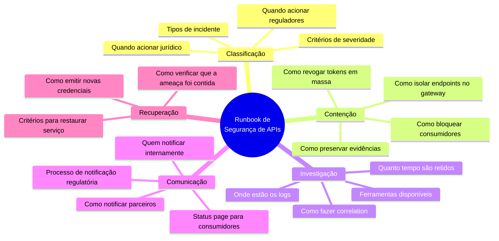
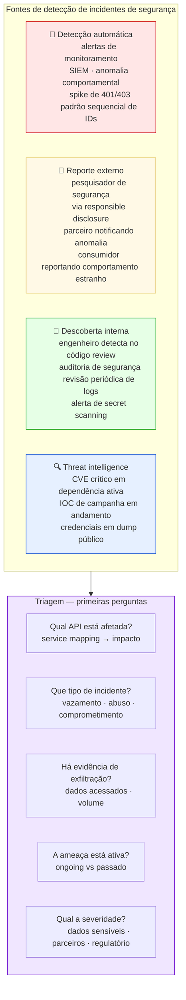
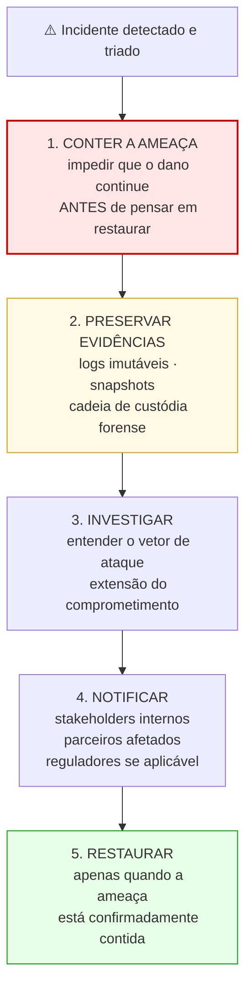
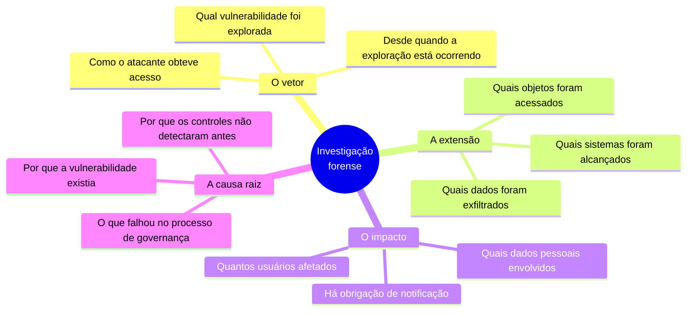
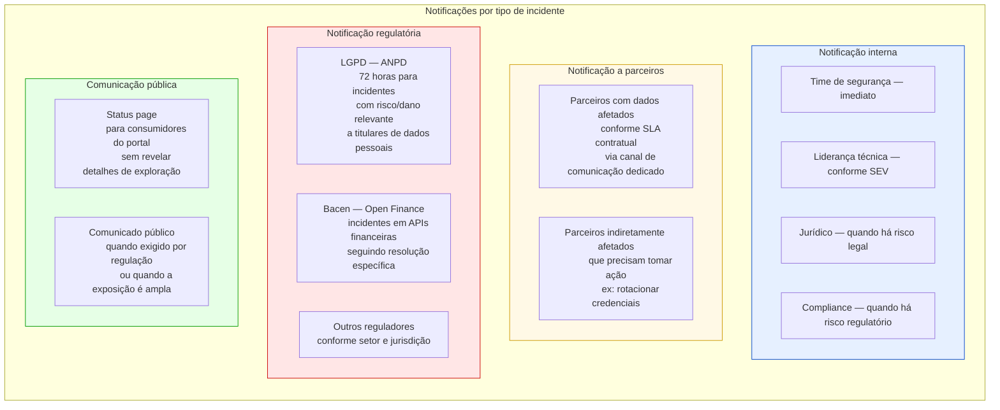
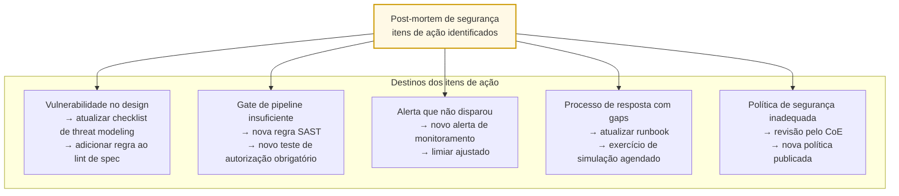
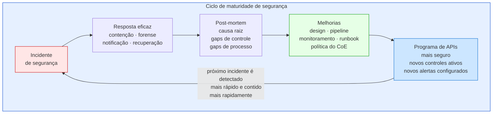

# Módulo 5 · Segurança de APIs
## Capítulo 5.9 · Resposta a incidentes de segurança

> **Série:** Gerenciamento e Governança de APIs
> **Nível:** Operacional e estratégico
> **Pré-requisito:** Cap 4.6 · Cap 5.2 · Cap 5.4

---

## Sumário

- [5.9.1 · Por que incidentes de segurança são diferentes](#591--por-que-incidentes-de-segurança-são-diferentes)
- [5.9.2 · Preparação — antes do incidente](#592--preparação--antes-do-incidente)
- [5.9.3 · Detecção e triagem](#593--detecção-e-triagem)
- [5.9.4 · Contenção — conter primeiro, restaurar depois](#594--contenção--conter-primeiro-restaurar-depois)
- [5.9.5 · Investigação e análise forense](#595--investigação-e-análise-forense)
- [5.9.6 · Recuperação e notificação](#596--recuperação-e-notificação)
- [5.9.7 · Post-mortem de segurança e aprendizado](#597--post-mortem-de-segurança-e-aprendizado)
- [5.9.8 · O ciclo completo — de incidente a programa mais seguro](#598--o-ciclo-completo--de-incidente-a-programa-mais-seguro)
- [Fontes e referências](#fontes-e-referências)

---

## 5.9.1 · Por que incidentes de segurança são diferentes

O Cap 4.6 tratou incident management no contexto do ITIL 4 — com uma seção específica sobre incidentes de segurança. Aqui a profundidade é maior porque incidentes de segurança têm características que os distinguem fundamentalmente de outros tipos de incidente.

```mermaid
graph LR
    subgraph disponib["Incidente de disponibilidade"]
        d1["Objetivo: restaurar o serviço
        o mais rápido possível"]
        d2["Prioridade: velocidade de resolução"]
        d3["Evidências: preservadas
        mas não são o foco central"]
        d4["Stakeholders: equipe técnica
        consumidores afetados"]
    end

    subgraph seguranca["Incidente de segurança"]
        s1["Objetivo: conter a ameaça primeiro
        restaurar depois — na ordem certa"]
        s2["Prioridade: contenção antes de velocidade
        restaurar sem conter pode piorar"]
        s3["Evidências: preservação forense
        é crítica — não pode ser destruída"]
        s4["Stakeholders: jurídico · compliance
        reguladores · parceiros afetados"]
    end

    subgraph diferenca["A diferença crítica"]
        dc["Restaurar o serviço SEM conter a ameaça
        pode significar reativar um sistema
        que continua sendo explorado —
        dados continuam sendo exfiltrados"]
    end

    disponib -->|"vs"| seguranca
    seguranca --> diferenca

    style diferenca fill:#ffe6e6,stroke:#cc0000,stroke-width:2px
```



---

## 5.9.2 · Preparação — antes do incidente

A eficácia da resposta a um incidente de segurança é determinada em grande parte pelo que foi preparado antes dele acontecer. Organizações que respondem a incidentes sem preparação prévia improvisam sob pressão — e improvisação em segurança tende a criar novos problemas.

### O runbook de resposta a incidentes de segurança

O runbook de segurança é o artefato central da preparação. Diferente do runbook de disponibilidade, o runbook de segurança deve cobrir:



### Testes de resposta

Um runbook não testado é um runbook hipotético. Exercícios regulares de resposta — tabletop exercises, simulações controladas — verificam que o processo funciona na prática:

- O processo de revogação em massa de tokens funciona em minutos?
- Os logs de segurança estão acessíveis e são pesquisáveis?
- Os contatos do time jurídico e de compliance estão atualizados?
- O time sabe o prazo da LGPD para notificação à ANPD?

### Pré-autorização de ações de contenção

Em um incidente real, a velocidade de contenção pode ser crítica. Obter aprovação para revogar credenciais ou isolar um endpoint durante um incidente ativo é friction desnecessária.

O CoE deve pré-autorizar um conjunto de ações de contenção que podem ser executadas imediatamente pelo time de segurança sem aprovação adicional — com registro imediato e revisão pós-incidente.

---

## 5.9.3 · Detecção e triagem

### Fontes de detecção



### Classificação de severidade para incidentes de segurança

A classificação de severidade do Cap 4.6.3 se aplica com uma dimensão adicional em incidentes de segurança: o potencial regulatório.

| Severidade | Critérios | Ações imediatas |
|---|---|---|
| **SEV-1 Crítico** | Exfiltração confirmada de dados pessoais · acesso a sistemas de pagamento · credenciais de produção comprometidas | Contenção imediata · acionar jurídico · avaliar LGPD 72h |
| **SEV-2 Alto** | Acesso não autorizado ativo · BOLA em escala · credenciais possivelmente comprometidas | Contenção em minutos · notificar time de segurança |
| **SEV-3 Médio** | Tentativas de ataque sem sucesso aparente · CVE crítico em dependência · configuração insegura descoberta | Investigação · remediação planejada |
| **SEV-4 Baixo** | Configuração subótima · CVE médio · anomalia menor | Backlog de segurança · ciclo normal |

---

## 5.9.4 · Contenção — conter primeiro, restaurar depois

A sequência correta em incidentes de segurança:



### Ações de contenção por tipo de incidente

**Credenciais comprometidas:**
```
1. Revogar o client_id comprometido via RFC 7009
2. Invalidar todos os tokens emitidos para esse client_id
3. Bloquear o client_id no gateway
4. Notificar o consumidor legítimo para re-credenciamento
5. Preservar logs antes de qualquer limpeza de ambiente
```

**BOLA/Enumeração em escala:**
```
1. Rate limit emergencial no consumidor comprometido ou no IP
2. Bloquear o padrão de acesso sequencial no gateway
3. Preservar logs do período de exploração
4. Avaliar volume de objetos acessados indevidamente
```

**Endpoint comprometido:**
```
1. Isolar o endpoint no gateway — retornar 503
2. Preservar logs e estado do sistema
3. Investigar o vetor de ataque
4. Corrigir a vulnerabilidade
5. Verificar que a correção é efetiva em staging
6. Restaurar o endpoint com a versão corrigida
```

### Preservação forense

Evidências de incidentes de segurança podem ser necessárias para processos legais, regulatórios ou de arbitragem. A cadeia de custódia forense deve ser estabelecida imediatamente:

- Logs não podem ser modificados ou deletados durante e após o incidente
- Snapshots do estado do sistema no momento da detecção devem ser preservados
- Todas as ações de resposta devem ser registradas com timestamp e responsável
- A cadeia de custódia deve ser mantida se houver possibilidade de uso legal

---

## 5.9.5 · Investigação e análise forense

### O que investigar

A investigação de um incidente de segurança em APIs busca responder:



### Análise de logs como fonte primária

Os logs de segurança descritos no Cap 5.2.3 e os registros de auditoria do Cap 5.2.4 são a fonte primária da investigação forense. A qualidade da investigação é limitada pela qualidade do logging — uma lacuna na cobertura de logs é uma lacuna na capacidade de investigação.

Para cada requisição suspeita, a investigação correlaciona:

- O token usado — identificando o consumidor e o usuário delegante
- Os objetos acessados — construindo a lista de dados potencialmente afetados
- O padrão temporal — quando a exploração começou e terminou
- A origem — IPs, user agents, padrões que identificam o atacante

---

## 5.9.6 · Recuperação e notificação

### Critérios para restaurar o serviço

O serviço não deve ser restaurado até que três condições sejam confirmadas:

1. **A vulnerabilidade foi corrigida** — não apenas mitigada temporariamente, mas corrigida na causa raiz
2. **A ameaça está contida** — o vetor de ataque não está mais ativo
3. **As evidências foram preservadas** — logs e snapshots estão seguros antes de qualquer modificação de ambiente

### Notificação a stakeholders



---

## 5.9.7 · Post-mortem de segurança e aprendizado

O post-mortem blameless do Cap 4.6.6 se aplica a incidentes de segurança com uma dimensão adicional: além de identificar o que falhou tecnicamente, o post-mortem de segurança identifica o que falhou no programa de governança.

### Perguntas específicas do post-mortem de segurança

**Sobre o design:**
- A vulnerabilidade explorada estava documentada no threat model?
- Se sim — por que a mitigação não foi implementada?
- Se não — qual é a cobertura do threat modeling para APIs similares?

**Sobre o pipeline:**
- O SAST ou DAST detectaria essa vulnerabilidade?
- Se não — como o pipeline precisa evoluir?
- O secret scanning estava ativo?

**Sobre a detecção:**
- Quanto tempo entre o início da exploração e a detecção?
- O que teria permitido detecção mais rápida?
- Qual alerta deveria ter disparado e não disparou?

**Sobre a resposta:**
- O runbook de resposta foi seguido?
- O que foi improvisado que deveria estar documentado?
- Qual foi o tempo entre detecção e contenção?

### Alimentando o Continual Improvement

Cada item identificado no post-mortem tem um destino no programa de governança:



---

## 5.9.8 · O ciclo completo — de incidente a programa mais seguro

Um incidente de segurança bem tratado não é apenas um problema resolvido — é uma oportunidade de aprendizado que torna o programa de APIs mais seguro do que estava antes.



Organizações que tratam cada incidente como um ciclo de aprendizado acumulam maturidade de segurança de forma orgânica — não apenas como resposta a conformidade, mas como evolução contínua dirigida por evidências de onde o programa tem lacunas reais.

---

## Pontos-chave do capítulo

- Incidentes de segurança diferem de incidentes de disponibilidade na sequência de ação: conter primeiro, restaurar depois. Restaurar um serviço sem conter a ameaça pode reativar um sistema que continua sendo explorado
- A preparação antes do incidente determina a eficácia da resposta: runbook documentado, ações de contenção pré-autorizadas, testes regulares do processo de resposta e contatos de jurídico e compliance atualizados
- A detecção vem de múltiplas fontes: monitoramento automático, reporte externo via responsible disclosure, descoberta interna e threat intelligence. Cada fonte tem velocidade e cobertura diferentes
- A contenção usa as ferramentas discutidas ao longo do módulo: revogação de tokens (RFC 7009), bloqueio de consumidores no gateway, isolamento de endpoints, rate limiting emergencial
- A preservação forense é crítica antes de qualquer ação que altere o ambiente. Logs e snapshots com cadeia de custódia podem ser necessários para processos legais e regulatórios
- A LGPD impõe prazo de 72 horas para notificação à ANPD em incidentes com risco ou dano relevante a titulares de dados pessoais. O processo de triagem deve avaliar essa obrigação na classificação de severidade
- O post-mortem blameless de segurança vai além do técnico: questiona o que falhou no design, no pipeline, no monitoramento e no processo de governança — e alimenta o Continual Improvement do programa

---

## Fontes e referências

| Fonte | Referência completa |
|---|---|
| **NIST SP 800-61r2 — Incident Handling** | Cichonski, P. et al. *Computer Security Incident Handling Guide*. NIST SP 800-61 Rev. 2, agosto 2012. Disponível em: [csrc.nist.gov/pubs/sp/800/61/r2/final](https://csrc.nist.gov/pubs/sp/800/61/r2/final) |
| **LGPD — Lei nº 13.709/2018** | Brasil. *Lei Geral de Proteção de Dados Pessoais*. Disponível em: [planalto.gov.br/ccivil_03/_ato2015-2018/2018/lei/l13709.htm](http://www.planalto.gov.br/ccivil_03/_ato2015-2018/2018/lei/l13709.htm) |
| **RFC 7009 — Token Revocation** | Lodderstedt, T. & Dronia, S. *OAuth 2.0 Token Revocation*. RFC 7009, agosto 2013. Disponível em: [datatracker.ietf.org/doc/html/rfc7009](https://datatracker.ietf.org/doc/html/rfc7009) |
| **OWASP Incident Response** | OWASP Foundation. *Incident Response*. Disponível em: [owasp.org/www-community/Incident_Response](https://owasp.org/www-community/Incident_Response) |

---

*Série: Gerenciamento e Governança de APIs · Módulo 5 · Capítulo 5.9*

---

> **Módulo 5 · Segurança de APIs — completo**
>
> Cap 5.1 · Segurança como propriedade do design
> Cap 5.2 · O arsenal de segurança — preventivo, detectivo, corretivo e auditoria
> Cap 5.3 · OWASP API Security Top 10 e ecossistema CVE/CVSS/CWE/EPSS
> Cap 5.4 · Autenticação e autorização — os fundamentos (incl. FGA)
> Cap 5.5 · Zero Trust para APIs
> Cap 5.6 · Segurança no ciclo de vida — shift left
> Cap 5.7 · Segurança no gateway e na plataforma
> Cap 5.8 · Segurança em APIs de parceiros e APIs públicas
> Cap 5.9 · Resposta a incidentes de segurança
>
> Anexos: E (falhas de design) · F (SIEM) · G (autorização OWASP) · H (dados e config OWASP) · I (recursos e ativos OWASP) · J (RFCs OAuth) · K (RFCs tokens) · L (FGA)